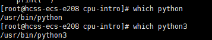

# Overview

This program, called process-run.py, allows you to see how the state of a
process state changes as it runs on a CPU. As described in the chapter, 
processes can be in a few different states:

这个名为process-run.py的程序允许您查看进程状态在CPU上运行时会发生变化。如本章所述，进程可以处于几种不同的状态：

```sh
RUNNING - the process is using the CPU right now
READY   - the process could be using the CPU right now
          but (alas) some other process is
BLOCKED - the process is waiting on I/O
          (e.g., it issued a request to a disk)
DONE    - the process is finished executing
RUNNING-进程正在使用CPU

就绪-进程现在可能正在使用CPU，但是（唉）另一个过程是

阻塞-进程正在等待I/O，（例如，它向磁盘发出请求）

完成-流程执行完毕
```

In this homework, we'll see how these process states change as a program
runs, and thus learn a little bit better how these things work.

To run the program and get its options, do this:

在这个家庭作业中，我们将看到这些进程状态是如何作为一个程序变化的

跑步，从而更好地了解这些东西是如何工作的。


要运行程序并获取其选项，请执行以下操作：

```sh
prompt> ./process-run.py -h
```

实操：

```
git clone https://github.com/remzi-arpacidusseau/ostep-homework.git
cd ostep-homework
cd cpu-intro
./process-run.py -h
```


解决方法：

由于 `process-run.py` 文件没有可执行权限。要解决这个问题，你需要为该文件添加可执行权限。

```
chmod +x process-run.py

chmod +x process-run.py：这条命令为 process-run.py 文件添加了执行权限。+x 表示为文件添加可执行权限。
ll 命令的输出中，-rw-r--r-- 表示该文件的权限设置为：
文件所有者可以读取和写入（rw-）。
组用户和其他用户只能读取（r--）。
没有可执行权限（没有 x）。
添加执行权限后，权限应该变为 -rwxr-xr-x。
```

If this doesn't work, type `python` before the command, like this:

如果这不起作用，请在命令前键入“python”，如下所示：

```sh
prompt> python process-run.py -h
```


What you should see is this:

你应该看到的是：

```sh
Usage: process-run.py [options]

Options:
  -h, --help            show this help message and exit
  -s SEED, --seed=SEED  the random seed
  -l PROCESS_LIST, --processlist=PROCESS_LIST
                        a comma-separated list of processes to run, in the
                        form X1:Y1,X2:Y2,... where X is the number of
                        instructions that process should run, and Y the
                        chances (from 0 to 100) that an instruction will use
                        the CPU or issue an IO
  -L IO_LENGTH, --iolength=IO_LENGTH
                        how long an IO takes
  -S PROCESS_SWITCH_BEHAVIOR, --switch=PROCESS_SWITCH_BEHAVIOR
                        when to switch between processes: SWITCH_ON_IO,
                        SWITCH_ON_END
  -I IO_DONE_BEHAVIOR, --iodone=IO_DONE_BEHAVIOR
                        type of behavior when IO ends: IO_RUN_LATER,
                        IO_RUN_IMMEDIATE
  -c                    compute answers for me
  -p, --printstats      print statistics at end; only useful with -c flag
                        (otherwise stats are not printed)
```

The most important option to understand is the PROCESS_LIST (as specified by
the -l or --processlist flags) which specifies exactly what each running
program (or 'process') will do. A process consists of instructions, and each
instruction can just do one of two things: 

- use the CPU 
- issue an IO (and wait for it to complete)

When a process uses the CPU (and does no IO at all), it should simply
alternate between RUNNING on the CPU or being READY to run. For example, here
is a simple run that just has one program being run, and that program only
uses the CPU (it does no IO).

要理解的最重要的选项是PROCESS_LIST（如-l或--processlist标志），它精确地指定了每个运行的内容

程序（或“进程”）就可以了。进程由指令组成，每个指令指令只能做以下两件事之一：


-使用CPU

-发出IO（并等待其完成）


当一个进程使用CPU（并且根本不进行IO）时，它应该简单地在CPU上运行或准备运行之间交替。例如，这里

是一个简单的运行，只有一个程序在运行，而且只有那个程序在运行使用CPU（它不进行IO）。

```sh
prompt> ./process-run.py -l 5:100 
Produce a trace of what would happen when you run these processes:
生成运行这些进程时会发生什么的痕迹：
Process 0
  cpu
  cpu
  cpu
  cpu
  cpu

Important behaviors:
  System will switch when the current process is FINISHED or ISSUES AN IO
  After IOs, the process issuing the IO will run LATER (when it is its turn)

重要行为：
当当前进程完成或发出IO时，系统将切换
IO之后，发出IO的进程将稍后运行（轮到它时）

prompt> 
```

实操：

```
./process-run.py -l 5:100 
```


确定是否有python编译环境



采用别的命令执行，可以。

==查询./执行不了程序的原因，但是没有查到。==因为确实python的环境都有，path中也有。

```
python process-run.py -l 5:100
```


Here, the process we specified is "5:100" which means it should consist of 5
instructions, and the chances that each instruction is a CPU instruction are
100%. 

You can see what happens to the process by using the -c flag, which computes the
answers for you:

在这里，我们指定的过程是“5:100”，这意味着它应该由5个

指令，以及每条指令是CPU指令的可能性

100%.

```
根据常见的模拟器脚本的约定，-l 5:100 可能具有以下含义（具体要看 process-run.py 脚本的实现）：

-l 选项：

可能是一个用于指定进程列表的选项，告诉脚本要模拟哪些进程。
5:100 参数：

5:100 可能表示一个进程的行为特征或指令：
5：可能表示这个进程有 5 个指令或操作需要执行。
100：可能表示这些指令全部是 CPU 操作，或者是特定概率（如 100%）的 CPU 操作。
因此，python process-run.py -l 5:100 可能是模拟一个进程，该进程有 5 条指令，并且每条指令都使用 CPU 进行操作。
```

您可以通过使用-c标志来查看进程的情况，该标志计算

为您解答：

```sh
prompt> ./process-run.py -l 5:100 -c
Time     PID: 0        CPU        IOs
  1     RUN:cpu          1
  2     RUN:cpu          1
  3     RUN:cpu          1
  4     RUN:cpu          1
  5     RUN:cpu          1
```


This result is not too interesting: the process is simple in the RUN state and
then finishes, using the CPU the whole time and thus keeping the CPU busy the
entire run, and not doing any I/Os.

Let's make it slightly more complex by running two processes:

这个结果并不太有趣：在RUN状态下，这个过程很简单

然后结束，始终使用CPU，从而使CPU保持忙碌

整个运行过程中，不进行任何I/O操作。


让我们通过运行两个进程来使它稍微复杂一些：

```sh
prompt> ./process-run.py -l 5:100,5:100
Produce a trace of what would happen when you run these processes:
Process 0
  cpu
  cpu
  cpu
  cpu
  cpu

Process 1
  cpu
  cpu
  cpu
  cpu
  cpu

Important behaviors:
  Scheduler will switch when the current process is FINISHED or ISSUES AN IO
  After IOs, the process issuing the IO will run LATER (when it is its turn)

重要行为：
当当前进程完成或发出IO时，调度器将切换
IO之后，发出IO的进程将稍后运行（轮到它时）
```


In this case, two different processes run, each again just using the CPU. What
happens when the operating system runs them? Let's find out:

在这种情况下，运行两个不同的进程，每个进程都只使用CPU。

当操作系统运行它们时会发生什么？让我们来看看：

```sh
prompt> ./process-run.py -l 5:100,5:100 -c
Time     PID: 0     PID: 1        CPU        IOs
  1     RUN:cpu      READY          1
  2     RUN:cpu      READY          1
  3     RUN:cpu      READY          1
  4     RUN:cpu      READY          1
  5     RUN:cpu      READY          1
  6        DONE    RUN:cpu          1
  7        DONE    RUN:cpu          1
  8        DONE    RUN:cpu          1
  9        DONE    RUN:cpu          1
 10        DONE    RUN:cpu          1
```


As you can see above, first the process with "process ID" (or "PID") 0 runs,
while process 1 is READY to run but just waits until 0 is done. When 0 is
finished, it moves to the DONE state, while 1 runs. When 1 finishes, the trace
is done.

如上所述，首先运行“进程ID”（或“PID”）为0的进程，而进程1准备运行，但只是等待直到0完成。当0为

完成后，它将移动到DONE状态，同时1运行。当1完成时，轨迹

完成了。

Let's look at one more example before getting to some questions. In this
example, the process just issues I/O requests. We specify here that I/Os take 5
time units to complete with the flag -L.

在回答一些问题之前，让我们再看一个例子。

例如，该过程只发出I/O请求。我们在这里指定I/O取5。

以时间单位完成标记-L。

```sh
prompt> ./process-run.py -l 3:0 -L 5
Produce a trace of what would happen when you run these processes:
Process 0
  io
  io_done
  io
  io_done
  io
  io_done

Important behaviors:
  System will switch when the current process is FINISHED or ISSUES AN IO
  After IOs, the process issuing the IO will run LATER (when it is its turn)

重要行为：
当当前进程完成或发出IO时，系统将切换
IO之后，发出IO的进程将稍后运行（轮到它时）
```


What do you think the execution trace will look like? Let's find out:

你认为执行痕迹会是什么样子？让我们来看看：


```sh
prompt> ./process-run.py -l 3:0 -L 5 -c
Time    PID: 0       CPU       IOs
  1         RUN:io             1
  2        BLOCKED                           1
  3        BLOCKED                           1
  4        BLOCKED                           1
  5        BLOCKED                           1
  6        BLOCKED                           1
  7*   RUN:io_done             1
  8         RUN:io             1
  9        BLOCKED                           1
 10        BLOCKED                           1
 11        BLOCKED                           1
 12        BLOCKED                           1
 13        BLOCKED                           1
 14*   RUN:io_done             1
 15         RUN:io             1
 16        BLOCKED                           1
 17        BLOCKED                           1
 18        BLOCKED                           1
 19        BLOCKED                           1
 20        BLOCKED                           1
 21*   RUN:io_done             1
```


As you can see, the program just issues three I/Os. When each I/O is issued,
the process moves to a BLOCKED state, and while the device is busy servicing
the I/O, the CPU is idle.

如您所见，该程序只发出三个I/O。当发出每个I/O时，

进程移动到BLOCKED状态，而设备正忙于服务

CPU处于空闲状态。

To handle the completion of the I/O, one more CPU action takes place. Note
that a single instruction to handle I/O initiation and completion is not
particularly realistic, but just used here for simplicity.

为了处理I/O的完成，还需要执行一个CPU操作。注：

处理I/O启动和完成的单个指令不是

特别逼真，但这里只是为了简单起见。

Let's print some stats (run the same command as above, but with the -p flag)
to see some overall behaviors: 

让我们打印一些统计数据（运行与上述相同的命令，但带有-p标志）

查看一些总体行为：

```sh
Stats: Total Time 21
Stats: CPU Busy 6 (28.57%)
Stats: IO Busy  15 (71.43%)
```


As you can see, the trace took 21 clock ticks to run, but the CPU was
busy less than 30% of the time. The I/O device, on the other hand, was
quite busy. In general, we'd like to keep all the devices busy, as
that is a better use of resources.

如您所见，跟踪需要21个时钟滴答才能运行，但CPU

忙碌的时间不到30%。另一方面，I/O设备是

很忙。一般来说，我们希望所有设备都保持忙碌，例如

这是对资源的更好利用。


There are a few other important flags:

还有其他一些重要的标志：

```sh
  -s SEED, --seed=SEED  the random seed  
    this gives you way to create a bunch of different jobs randomly

  -L IO_LENGTH, --iolength=IO_LENGTH
    this determines how long IOs take to complete (default is 5 ticks)

  -S PROCESS_SWITCH_BEHAVIOR, --switch=PROCESS_SWITCH_BEHAVIOR
                        when to switch between processes: SWITCH_ON_IO, SWITCH_ON_END
    this determines when we switch to another process:
    - SWITCH_ON_IO, the system will switch when a process issues an IO
    - SWITCH_ON_END, the system will only switch when the current process is done 

  -I IO_DONE_BEHAVIOR, --iodone=IO_DONE_BEHAVIOR
                        type of behavior when IO ends: IO_RUN_LATER, IO_RUN_IMMEDIATE
    this determines when a process runs after it issues an IO:
    - IO_RUN_IMMEDIATE: switch to this process right now
    - IO_RUN_LATER: switch to this process when it is natural to 
      (e.g., depending on process-switching behavior)

-s SEED, --seed=SEED

翻译：随机种子
解释：这个选项允许你设置一个随机种子，用于生成一组不同的随机作业。随机种子是为了确保在多次运行中生成的随机数据是可重复的，这样你在同一随机种子下运行程序，每次都会生成相同的随机作业。
-L IO_LENGTH, --iolength=IO_LENGTH

翻译：I/O 操作的完成时间（默认是 5 个时钟周期）
解释：这个选项决定了 I/O 操作需要多长时间才能完成。默认情况下，I/O 操作需要 5 个时钟周期（tick）。可以通过这个参数调整 I/O 操作的时间，使得模拟过程更符合你的需求。
-S PROCESS_SWITCH_BEHAVIOR, --switch=PROCESS_SWITCH_BEHAVIOR

翻译：进程切换行为
解释：这个选项决定了系统在何时切换到另一个进程。具体有两种模式：
SWITCH_ON_IO：当进程发出 I/O 请求时，系统会立即切换到另一个进程。
SWITCH_ON_END：系统只有在当前进程执行完毕时才会切换到下一个进程。
这个选项让你控制进程调度的策略，即在进程执行中发出 I/O 操作时，系统是立即切换到另一个进程，还是等当前进程结束后再切换。

-I IO_DONE_BEHAVIOR, --iodone=IO_DONE_BEHAVIOR

翻译：I/O 完成后的行为类型
解释：这个选项决定了当一个进程发出 I/O 操作后，在 I/O 操作完成时系统该如何处理这个进程。具体有两种模式：
IO_RUN_IMMEDIATE：在 I/O 操作完成后，系统立即切换回到这个进程并运行它。
IO_RUN_LATER：在 I/O 操作完成后，系统会根据当前的进程切换行为自然地回到这个进程，而不是立即切换。这个模式通常取决于进程切换的策略，比如当前进程是否结束或是否有其他更高优先级的任务在等待。
这个选项让你控制 I/O 完成后的调度策略，是立即处理完成 I/O 操作的进程，还是根据调度策略适时处理。
```

Now go answer the questions at the back of the chapter to learn more, please.

现在，请回答本章后面的问题以了解更多信息。

