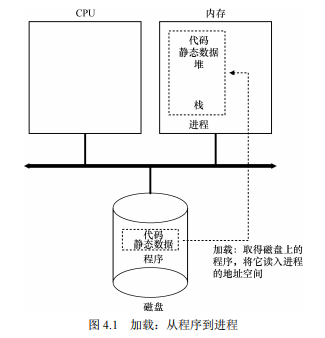
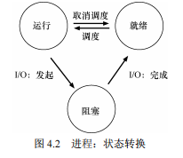
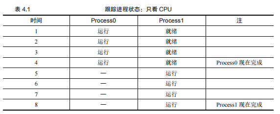
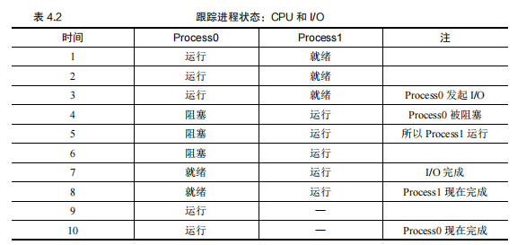
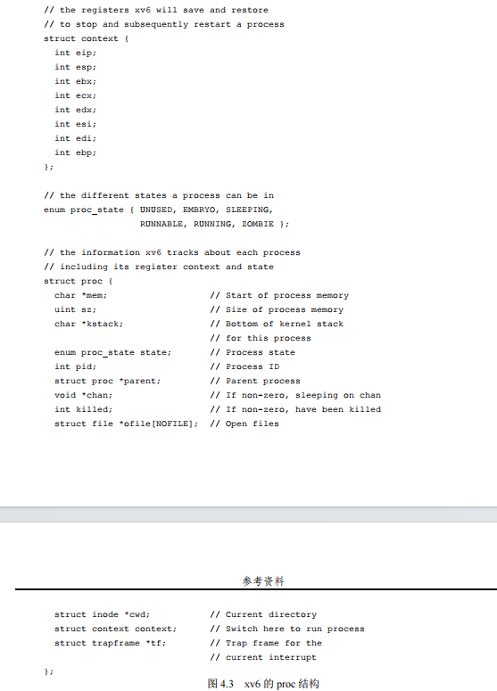

## 第 4 章 抽象：进程

本章讨论了操作系统提供的基本抽象——进程。通过对进程的理解，我们可以明白操作系统如何管理和虚拟化计算资源，使得多个程序能够并发执行。

#### 进程的定义

- **进程的概念**：进程就是运行中的程序。程序本身只是存储在磁盘上的一组指令，只有当它们被操作系统加载并执行时，才成为进程。
- **多进程的需求**：现代计算设备通常同时运行多个程序（进程），如浏览器、邮件、游戏等。操作系统的挑战在于如何在有限的物理CPU上提供几乎无数个虚拟CPU的假象。

#### 虚拟化CPU

- **CPU虚拟化**：操作系统通过虚拟化CPU来实现多个进程的并发执行。通过**时分共享技术**（time sharing），操作系统让每个进程在特定时间片内独占CPU，然后切换到另一个进程，从而提供了多个虚拟CPU的假象。
- **性能开销**：虚拟化CPU带来的一些性能损失是不可避免的，因为每个进程分配到的CPU时间片较短，因此整体运行速度会变慢。

```
提示：使用时分共享（和空分共享）
时分共享（time sharing）是操作系统共享资源所使用的最基本的技术之一。通过允许资源由一个实
体使用一小段时间，然后由另一个实体使用一小段时间，如此下去，所谓的资源（例如，CPU 或网络链
接）可以被许多人共享。时分共享的自然对应技术是空分共享，资源在空间上被划分给希望使用它的人。
例如，磁盘空间自然是一个空分共享资源，因为一旦将块分配给文件，在用户删除文件之前，不可能将
它分配给其他文件。
```


#### 机制与策略

- **机制（Mechanism）**：**机制是实现虚拟化和管理进程的低级方法**。例如，上下文切换（context switch）是一个关键机制，它允许操作系统暂停一个进程并切换到另一个进程运行。
- **策略（Policy）**：策略是操作系统用来做出决定的算法。例如，调度策略决定了在某个时刻哪个进程应该运行。**这可能基于历史信息、当前工作负载和系统性能目标等。**

### 4.1 抽象：进程

这一节深入探讨了进程的构成和操作系统如何抽象地处理运行中的程序。

**操作系统为正在运行的程序提供的抽象，就是所谓的进程（process）。正如我们上面所说的，一个进程只是一个正在运行的程序。**

#### 进程的机器状态

- **机器状态的定义**：进程的机器状态包括程序运行时可以读取或更新的所有内容。理解进程的机器状态有助于理解操作系统如何管理进程。
- **内存（地址空间）**：进程的机器状态中最重要的一部分是内存。进程的指令和数据都存储在内存中，进程通过访问这些内存来执行任务。
- **寄存器**：寄存器是机器状态的另一关键部分。程序计数器（PC）、栈指针和帧指针等寄存器对于进程的执行至关重要。

#### I/O 与持久存储

- **持久存储**：进程通常还会涉及I/O操作，例如当前打开的文件列表。这些I/O信息也是进程机器状态的一部分。

### 提示与设计理念

- **分离策略与机制**：操作系统设计中的一个常见范式是将策略与机制分离开来。机制解决“如何实现”问题，而策略解决“哪个进程应该执行”的问题。这种分离使得操作系统的设计更具模块化，并易于调整策略而不影响底层机制。

------

这总结涵盖了第4章中的内容，包括操作系统如何通过虚拟化CPU和管理进程机器状态来实现并发执行，并且强调了策略与机制分离的重要性。

### 4.2 进程 API

在这一节中，作者简要介绍了操作系统提供的进程管理API，这些API在所有现代操作系统中都以某种形式存在。

#### 进程 API 的主要功能：

- **创建（create）**：操作系统必须提供创建新进程的方法。当用户在命令行输入命令或双击应用程序图标时，操作系统会创建一个新进程来运行指定的程序。
- **销毁（destroy）**：既然有创建进程的接口，操作系统也必须提供销毁进程的接口。虽然很多进程会在任务完成后自动退出，但如果某个进程失控，用户可以通过接口强制终止它。
- **等待（wait）**：有时用户或系统需要等待某个进程停止运行，因此操作系统提供了等待接口来实现这一功能。
- **其他控制（miscellaneous control）**：除了终止或等待进程外，操作系统还提供了其他控制功能，例如暂停（暂停运行一段时间）或恢复进程（继续运行）。
- **状态（status）**：操作系统通常还提供查询进程状态的接口，比如查询进程运行的时间或进程当前所处的状态。

### 4.3 进程创建：更多细节

本节深入探讨了操作系统如何创建和运行一个进程的具体过程，揭示了程序如何转化为进程。

具体来说，操作系统如何启动并运行一个程序？进程创建实际如何进行？

#### 进程创建的步骤：



1. **加载程序到内存**：
   - **加载代码和静态数据**：操作系统首先将程序的代码和所有静态数据（例如初始化变量）从磁盘加载到内存中。**程序通常以某种可执行格式存储在磁盘上，操作系统将其读取并放入内存中的某处。**
   - **加载方式**：在早期或简单的操作系统中，这一过程是尽早（early）完成的，即在程序运行前将所有内容加载到内存。**而现代操作系统往往采用惰性加载（lazily），即仅在程序执行过程中需要时才加载代码或数据片段。**
2. **分配运行时栈**：
   - **栈的作用**：操作系统为程序的运行时栈分配内存，**栈用于存放局部变量、函数参数和返回地址**。操作系统还会将传递给 `main()` 函数的参数 `argc` 和 `argv` 初始化在栈中。
3. **分配堆内存**：
   - **堆的作用**：**堆内存用于动态分配数据结构，如链表、散列表和树等**。操作系统初始分配较小的堆内存，当程序运行时通过调用 `malloc()` 请求更多内存时，操作系统可能会参与为其分配更多内存。
4. **I/O 初始化**：
   - **文件描述符**：在 UNIX 系统中，**操作系统默认为每个进程分配三个打开的文件描述符，分别对应标准输入、输出和错误**。这些描述符使程序可以方便地读取输入和输出内容。
5. **启动程序执行**：
   - **启动程序**：**在完成上述初始化后，操作系统将控制权交给新创建的进程，通过跳转到 `main()` 函数开始执行程序**。这一过程涉及到操作系统将CPU控制权转移到新进程中，使其开始运行。

------

这段总结详细介绍了操作系统提供的进程API，以及操作系统如何从程序创建一个完整的进程并启动其执行。通过这些细节，我们了解了操作系统在后台为每个运行中的程序所做的复杂准备工作。

### 4.4 进程状态

本节详细介绍了操作系统中进程的不同状态及其之间的转换。这些状态反映了进程在不同时间的活动情况，并且是操作系统管理多任务处理的基础。

#### 进程的三种主要状态：

- **运行（Running）**：当进程处于运行状态时，它正在处理器上执行指令。这是进程最活跃的状态。
- **就绪（Ready）**：处于就绪状态的进程已经准备好执行，但由于某种原因（如处理器繁忙），暂时未被操作系统安排运行。
- **阻塞（Blocked）**：当进程发起某种操作（如I/O请求）后，它可能会被阻塞，直到特定事件发生（如I/O操作完成）。在此期间，该进程无法继续执行，操作系统会将其挂起。

#### 进程状态转换：

- **状态图解**：如图 4.2 所示，进程可以在不同状态之间转换。进程从就绪状态到运行状态意味着它被调度执行，从运行状态到就绪状态意味着它被取消调度。**当进程发起I/O请求时，它会从运行状态转到阻塞状态**；当I/O操作完成后，它会从阻塞状态返回到就绪状态，或者立即被调度执行。

  

#### 状态转换的例子：

1. 仅使用CPU的进程：

   - 表 4.1 展示了两个仅使用CPU的进程在不发起I/O操作的情况下的状态转换。一个进程在运行时，另一个进程处于就绪状态，直到前者完成，后者才开始运行。

     

2. 包含I/O操作的进程：

   - 表 4.2 展示了一个进程在发起I/O操作时的状态转换。Process0 在运行了一段时间后发起I/O请求并进入阻塞状态，这时操作系统开始运行Process1。当I/O操作完成后，Process0返回到就绪状态，并在Process1完成后继续运行。

   

#### 操作系统的决策：

- **调度决策**：即使在这些简单的例子中，操作系统也需要做出重要的决策。例如，当Process0发起I/O请求时，系统决定让Process1运行，以保持CPU繁忙并提高资源利用率。当I/O完成后，系统选择不立即切换回Process0，这样的决策取决于调度策略。

### 总结：

本节通过对进程状态的详细讨论，解释了操作系统如何管理进程的执行及其在不同状态之间的转换。这些状态和转换机制使得操作系统能够有效地管理多任务处理，确保系统资源的最佳利用。

### 补充1：操作系统中的IO指什么，详细说明

在操作系统中，I/O（Input/Output，输入/输出）指的是计算机系统与外部环境之间的数据交换过程。I/O 涉及从外部设备（如键盘、鼠标、显示器、磁盘、网络接口等）获取数据（输入），以及将数据发送到外部设备（输出）。I/O 操作是操作系统的一项核心功能，因为它负责管理系统与外部世界之间的所有数据传输。

#### I/O 的分类

1. **块设备 I/O**:
   - 块设备是指可以以块为单位读写数据的设备，比如硬盘、固态硬盘、光盘等。
   - 数据在块设备中通常以固定大小的块（如 512 字节、4 KB）进行读写。
   - 操作系统通过块设备驱动程序将文件系统的数据请求转换为块设备的读写操作。
2. **字符设备 I/O**:
   - 字符设备是指数据流以字符为单位进行处理的设备，比如键盘、串口、打印机等。
   - 字符设备通常不支持随机访问，即无法像块设备那样按块进行访问，而是以字节流的方式顺序读取或写入。
3. **网络 I/O**:
   - 网络 I/O 涉及通过网络接口进行的数据传输，包括接收和发送数据包。
   - 网络 I/O 通常使用套接字接口，操作系统通过网络协议栈处理网络数据的收发。

#### I/O 操作的关键概念

1. **I/O 设备与控制器**:
   - **I/O 设备**：指进行输入或输出操作的实际硬件设备，如键盘、显示器、硬盘、网卡等。
   - **I/O 控制器**：是连接 I/O 设备与计算机总线的硬件组件，负责在设备和操作系统之间进行数据传输和控制信号传递。
2. **I/O 请求与调度**:
   - 操作系统通过 I/O 请求将数据读写操作提交给 I/O 设备。I/O 调度器负责管理这些请求，优化其执行顺序以提高效率。例如，在磁盘 I/O 中，调度器可能会按照磁盘访问的最短寻道时间优先算法来安排请求顺序。
3. **I/O 缓存与缓冲**:
   - **缓冲**：操作系统使用内存缓冲区来暂存 I/O 数据，以提高传输效率。例如，写操作的数据可能首先写入缓冲区，然后在合适的时间批量写入设备。
   - **缓存**：操作系统还会使用缓存来存储经常访问的数据，以减少对慢速 I/O 设备的直接访问，提高系统性能。例如，文件系统缓存可以存储最近访问的文件块。
4. **同步与异步 I/O**:
   - **同步 I/O**：在同步 I/O 中，调用线程在 I/O 操作完成之前会被阻塞。这意味着程序会等待 I/O 操作完成后才能继续执行后续操作。
   - **异步 I/O**：在异步 I/O 中，I/O 操作会在后台进行，调用线程可以在等待 I/O 操作完成的同时继续执行其他任务。一旦 I/O 操作完成，系统会通知应用程序。
5. **I/O 中断**:
   - 中断是操作系统处理 I/O 的一种重要机制。当 I/O 设备完成请求操作或发生事件（如按键按下），设备控制器会发送一个中断信号给 CPU。CPU 会暂停当前的操作，转而处理这个中断，执行相应的 I/O 操作，之后再恢复原来的任务。
6. **直接内存访问 (DMA)**:
   - DMA 是一种用于提高 I/O 操作效率的机制。通过 DMA，设备控制器可以直接访问内存，将数据传输到内存或从内存读取数据，而无需通过 CPU 进行数据传输。这减少了 CPU 的负担，特别是在大量数据传输的场景下。

#### I/O 在操作系统中的作用

1. **资源管理**:
   - 操作系统负责管理所有的 I/O 设备，包括分配 I/O 资源、处理 I/O 请求、以及维护设备状态和控制信息。
2. **数据传输**:
   - 操作系统通过 I/O 子系统实现数据在内存与外部设备之间的传输，支持文件读写、设备控制、网络通信等操作。
3. **系统性能优化**:
   - 由于 I/O 操作往往是系统性能的瓶颈，操作系统通过调度、缓存、异步 I/O、DMA 等机制优化 I/O 性能，减少等待时间，提高系统的整体效率。
4. **系统安全与保护**:
   - 操作系统控制对 I/O 设备的访问权限，确保不同进程对设备的安全访问，防止恶意进程进行未经授权的 I/O 操作。

#### I/O 操作的流程

1. 应用程序发出 I/O 请求（如读文件或发送网络数据）。
2. 操作系统将请求转交给相应的设备驱动程序。
3. 驱动程序与设备控制器通信，启动 I/O 操作。
4. 设备控制器执行 I/O 操作（如读取数据或发送数据包），并在操作完成后向操作系统发送中断信号。
5. 操作系统处理中断，读取数据或更新状态，并将结果返回给应用程序。

#### 总结

I/O 在操作系统中是一个至关重要的概念，涉及多种设备的管理、数据传输、性能优化及系统安全。操作系统通过一系列机制高效地处理 I/O 操作，从而确保系统稳定、可靠地运行。


### 4.5 数据结构

本节探讨了操作系统中用于管理进程的关键数据结构，这些数据结构是操作系统跟踪每个进程的状态和信息的基础。

#### 进程列表与数据结构

- **进程列表（Process List）**：操作系统使用某种形式的进程列表来跟踪系统中所有就绪、运行和阻塞的进程。这些数据结构帮助操作系统管理多个同时运行的进程，并确保在需要时正确调度和管理这些进程。
- **进程控制块（Process Control Block, PCB）**：操作系统通常为每个进程维护一个数据结构来存储与该进程相关的所有信息。在许多操作系统中，这种数据结构被称为进程控制块。它包含了进程的状态、内存信息、寄存器内容等。

#### xv6 操作系统的进程结构示例

 图4.3 展示了 OS 需要跟踪 xv6 内核中每个进程的信息类型[CK+08]。“真正的”操作系统中存在类似的进程结构，如 Linux、macOS X 或 Windows。查看它们，看看有多复杂。从图 4.3 中可以看到，操作系统追踪进程的一些重要信息。对于停止的进程，寄存器上下文将保存其寄存器的内容。当一个进程停止时，它的寄存器将被保存到这个内存位置。通过恢复这些寄存器（将它们的值放回实际的物理寄存器中），操作系统可以恢复运行该进程。我们将在后面的章节中更多地了解这种技术，它被称为上下文切换（context switch）。



- **寄存器上下文**：在 `xv6` 内核中，**`context` 结构体保存了进程停止时的寄存器内容**。当进程被恢复时，这些寄存器的值会被重新加载到物理寄存器中，从而恢复进程的运行。这种技术被称为**上下文切换**（context switch）。
- **进程状态**：`xv6` 中的 `proc_state` 枚举定义了进程可能处于的几种状态，包括未使用（UNUSED）、胚胎（EMBRYO）、睡眠（SLEEPING）、可运行（RUNNABLE）、运行（RUNNING）和僵尸（ZOMBIE）状态。僵尸状态用于表示进程已经退出但尚未清理，允许父进程检查其退出状态。
- **进程信息**：`xv6` 的 `proc` 结构体包含了关于进程的各种信息，例如：
  - **内存信息**：进程内存的起始地址和大小。
  - **内核栈**：用于存储该进程的内核栈底部地址。
  - **进程 ID（PID）**：唯一标识进程的ID。
  - **父进程**：指向父进程的指针。
  - **I/O 信息**：如打开的文件、当前目录等。
  - **陷阱框架**：用于处理当前中断的陷阱框架指针。

#### 进程状态的其他扩展

- **初始状态与最终状态**：除了运行、就绪和阻塞状态外，操作系统还可能定义其他状态。例如，初始状态表示进程在创建时的状态，最终状态则表示进程已经退出但尚未被清理的状态（如 UNIX 系统中的僵尸状态）。父进程通常通过调用 `wait()` 函数来等待子进程完成，并在进程结束后清理相关资源。


```
补充：数据结构——进程列表
操作系统充满了我们将在这些讲义中讨论的各种重要数据结构（data structure）。进程列表（process 
list）是第一个这样的结构。这是比较简单的一种，但是，任何能够同时运行多个程序的操作系统当然都
会有类似这种结构的东西，以便跟踪系统中正在运行的所有程序。有时候人们会将存储关于进程的信息
的个体结构称为进程控制块（Process Control Block，PCB），这是谈论包含每个进程信息的 C 结构的一
种方式。
```


### 4.6 小结

**本节总结了操作系统的最基本抽象——进程的概念**。通过介绍**进程的状态、数据结构和管理方式**，我们为进一步讨论实现进程所需的低级机制和调度进程的高级策略奠定了基础。这些内容将帮助我们更深入地理解操作系统如何通过虚拟化 CPU 来管理和运行多个进程。