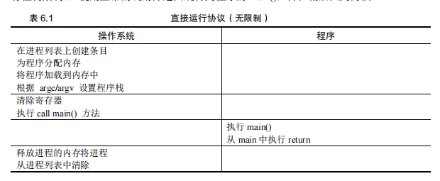
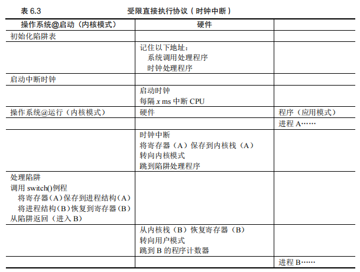

## 第 6 章 机制：受限直接执行

本章探讨了操作系统如何通过一种称为受限直接执行（limited direct execution）的技术来虚拟化CPU。这种技术的目标是让多个任务共享物理CPU，使得它们看起来像是同时运行。

#### 虚拟化 CPU 的挑战：

- **性能**：如何在不增加系统开销的情况下实现CPU的虚拟化？操作系统需要找到一种方法，使得虚拟化过程尽可能高效。
- **控制权**：操作系统必须保持对CPU的控制，以确保资源的正确管理。如果操作系统失去控制，进程可能会无限制地运行，导致系统不稳定或安全漏洞。因此，操作系统在实现CPU虚拟化时，必须在性能与控制权之间取得平衡。

#### 关键问题：

- **高效、可控的虚拟化**：操作系统必须**以高性能的方式虚拟化CPU，同时保持对系统的控制**。这需要硬件和操作系统的支持，操作系统通常会利用硬件支持来高效地实现这些目标。

### 6.1 基本技巧：受限直接执行

#### 直接执行的基本思想：

- **直接执行**：直接在CPU上运行程序，操作系统在进程列表中为程序创建条目、分配内存、加载程序代码、设置栈、清除寄存器，然后跳转到程序的入口点（如`main()`函数），开始执行用户代码。
- **无限制的直接执行**：表6.1展示了直接执行的基本协议，在没有任何限制的情况下，操作系统通过常规的调用和返回机制来运行程序。这种方法的主要问题在于操作系统无法控制进程的行为，也无法在需要时切换进程。、

```
听起来很简单，不是吗？但是，这种方法在我们的虚拟化 CPU 时产生了一些问题。第
一个问题很简单：如果我们只运行一个程序，操作系统怎么能确保程序不做任何我们不希
望它做的事，同时仍然高效地运行它？第二个问题：当我们运行一个进程时，操作系统如
何让它停下来并切换到另一个进程，从而实现虚拟化 CPU 所需的时分共享？
```



#### 受限直接执行的需求：

- **问题1：控制程序行为**：如果操作系统仅仅是直接执行程序，它将无法控制程序的行为。**这意味着程序可能会执行不安全或不受欢迎的操作，这在操作系统中是不可接受的**。因此，需要引入限制来控制程序的行为。
- **问题2：时分共享和进程切换**：为了实现CPU的时分共享，**操作系统需要能够在运行一个进程时暂停它，并切换到另一个进程**。如果没有适当的机制，操作系统将无法实现这种进程切换。

### 受限直接执行的意义：

- **“受限” 的引入**：受限直接执行的概念表明操作系统不能仅仅依赖直接执行，还需要设置某些限制来控制程序的行为和执行。这些限制使得操作系统能够保持对CPU和系统资源的控制，从而有效地管理和调度多个进程。

### 小结：

本章介绍了操作系统在虚拟化CPU时面临的挑战，并引入了受限直接执行的概念。**通过这种技术，操作系统能够在保持高性能的同时，确保对系统资源的控制，从而有效地管理多个并发进程**。在下一步中，操作系统需要进一步开发技术，以解决进程切换和控制问题，实现真正的虚拟化。

### 6.2 问题 1：受限制的操作

在本节中，讨论了操作系统如何处理进程希望执行受限制的操作（如I/O请求或内存分配）的问题，同时仍然保持对系统的控制。这是实现受限直接执行（limited direct execution）中的一个关键挑战。

#### 受限制操作的挑战：

- **直接执行的优势与问题**：直接执行程序具有高效运行的优势，因为它在硬件CPU上直接运行，速度很快。然而，这种直接执行模式带来了一个问题：如果进程需要执行受限操作（如I/O请求），操作系统如何防止进程执行不安全或未经授权的操作？
- **引入用户模式**：为了应对这些问题，操作系统和硬件引入了不同的执行模式：用户模式（user mode）和内核模式（kernel mode）。
  - **用户模式**：在用户模式下，进程受到限制，不能执行I/O请求等特权操作。如果进程尝试执行这些操作，硬件会引发异常，可能导致操作系统终止进程。
  - **内核模式**：操作系统在内核模式下运行，具有访问所有硬件资源的权限，可以执行特权操作。

#### 系统调用与陷阱：

- **系统调用**：系统调用允许用户程序请求操作系统执行特权操作。通过执行系统调用，程序可以安全地请求诸如文件访问、进程创建与销毁、内存分配等操作。
- **陷阱机制**：系统调用依赖于硬件提供的陷阱机制。陷阱指令会将执行流从用户模式切换到内核模式，并跳转到操作系统的指定位置执行特权操作。完成操作后，操作系统通过返回陷阱指令将控制权返还给用户程序，并恢复到用户模式。
- **陷阱表**：操作系统在启动时通过设置陷阱表（trap table）来告诉硬件在发生系统调用或异常时应该跳转到哪个处理程序。这使得操作系统能够控制在发生特权请求时执行的代码，防止进程跳转到任意位置。

```
补充：为什么系统调用看起来像过程调用

你可能想知道，为什么对系统调用的调用（如 open()或 read()）看起来完全就像 C 中的典型过程调用。也就是说，如果它看起来像一个过程调用，系统如何知道这是一个系统调用，并做所有正确的事情？原因很简单：它是一个过程调用，但隐藏在过程调用内部的是著名的陷阱指令。更具体地说，当你调用 open()（举个例子）时，你正在执行对 C 库的过程调用。其中，无论是对于 open()还是提供的其他系统调用，库都使用与内核一致的调用约定来将参数放在众所周知的位置（例如，在栈中或特定的寄存器中），将系统调用号也放入一个众所周知的位置（同样，放在栈或寄存器中），然后执行上述的陷阱指令。库中陷阱之后的代码准备好返回值，并将控制权返回给发出系统调用的程序。因此，C 库中进行系统调用的部分是用汇编手工编码的，因为它们需要仔细遵循约定，以便正确处理参数和返回值，以及执行硬件特定的陷阱指令。
现在你知道为什么你自己不必写汇编代码来陷入操作系统了，因为有人已经为你写了这些汇编。
```


#### 安全与控制：

- **硬件保护机制**：硬件确保只有操作系统（在内核模式下）才能设置或修改陷阱表，防止用户模式下的进程干扰系统控制。如果一个进程尝试在用户模式下执行特权指令，硬件会拒绝该操作并可能终止进程。
- **协议总结**：==表6.2总结了受限直接执行协议的过程==，涵盖了操作系统如何初始化陷阱表、运行进程、处理系统调用和清理进程等步骤。


### 关键点总结：

- **受限直接执行**：通过限制用户模式下的操作和引入系统调用，操作系统能够在直接执行程序的同时保持对系统的控制。
- **陷阱与内核模式**：系统调用和陷阱机制是确保操作系统控制权的重要工具，它们允许安全地执行特权操作，并在完成后恢复到正常的用户程序执行。

### 思考问题：

- **特权操作的风险**：如果进程可以设置自己的陷阱表，它将能够接管整个系统。硬件和操作系统必须紧密协作，以防止这样的安全漏洞。

这部分内容探讨了操作系统如何在实现虚拟化CPU的过程中处理受限操作的挑战，确保系统的安全性和稳定性。

### 6.3 问题 2：在进程之间切换

在操作系统中，进程之间的切换是一个关键的操作。这个过程看似简单，但实际上涉及许多复杂的机制，特别是在操作系统没有在 CPU 上运行的情况下，它如何重新获得控制权来进行进程切换。

#### 关键问题：如何重获 CPU 的控制权

操作系统必须在进程之间切换时重新获得 CPU 的控制权。如果进程在运行，这就意味着操作系统没有在 CPU 上运行，操作系统无法直接干预。这种情况下，操作系统依赖于两种方式来重新获得控制权：**协作方式和非协作方式。**

#### 协作方式：等待系统调用

在协作方式中，操作系统依赖于进程的合作，**即进程在运行一段时间后会主动通过系统调用（如文件操作或进程创建）将控制权交还给操作系统**。在这种情况下，操作系统可以选择继续当前进程或切换到其他进程。然而，这种方式有一个明显的缺点：**如果进程进入无限循环或拒绝进行系统调用，操作系统将无法重新获得控制权。**

#### 非协作方式：操作系统进行控制

为了确保操作系统能够在非协作的情况下也能控制 CPU，系统设计者引入了**时钟中断**。时钟设备可以配置为定期产生中断信号，当中断发生时，操作系统可以暂停当前进程并执行必要的操作，例如进行进程切换。通**过时钟中断，操作系统能够在预定时间间隔内强制获得 CPU 控制权，无论当前进程是否协作**。


表 6.3 展示了整个过程的时间线。在这个例子中，进程 A 正在运行，然后被中断时钟中断。硬件保存它的寄存器（在内核栈中），并进入内核（切换到内核模式）。在时钟中断处理程序中，操作系统决定从正在运行的进程 A 切换到进程 B。此时，它调用 switch()例程，该例程仔细保存当前寄存器的值（保存到 A 的进程结构），恢复寄存器进程 B（从它的进程结构），然后切换上下文（switch context），具体来说是通过改变栈指针来使用 B 的内核栈（而不是 A 的）。最后，操作系统从陷阱返回，恢复 B 的寄存器并开始运行它。




#### 保存和恢复上下文

当操作系统通过系统调用或时钟中断获得 CPU 控制权后，它需要决定是继续当前进程还是切换到另一个进程。**如果决定切换，操作系统必须保存当前进程的执行上下文（包括寄存器、程序计数器和栈指针），然后恢复即将运行的进程的上下文**。这个过程被称为**上下文切换**。

在上下文切换中，操作系统执行底层代码来保存和恢复寄存器值，并切换内核栈。最终，当操作系统完成从陷阱返回指令时，新的进程就会开始执行，而旧的进程则被暂停。整个过程确保了进程之间的无缝切换。

#### xv6 的上下文切换代码示例

```
# void swtch(struct context **old, struct context *new); 
#
# Save current register context in old 
# and then load register context from new. 
#
# 全局标签，表明这是一个全局符号，链接时可以被其他文件访问
.globl swtch

# 函数开始标签
swtch:
    # 保存旧的寄存器值

    # 将保存旧的上下文指针 (old) 放入 EAX 寄存器中
    movl 4(%esp), %eax    # eax = old

    # 保存指令指针 (IP)，pop 会从栈顶弹出当前的返回地址到 eax 中，然后
    # 把它保存到 old 指针指向的内存位置 (即保存 IP 到 old->eip)
    popl 0(%eax)          # *old->eip = 返回地址

    # 保存栈指针 (ESP)
    movl %esp, 4(%eax)    # *old->esp = esp

    # 保存其他通用寄存器
    movl %ebx, 8(%eax)    # *old->ebx = ebx
    movl %ecx, 12(%eax)   # *old->ecx = ecx
    movl %edx, 16(%eax)   # *old->edx = edx
    movl %esi, 20(%eax)   # *old->esi = esi
    movl %edi, 24(%eax)   # *old->edi = edi
    movl %ebp, 28(%eax)   # *old->ebp = ebp

    # 加载新的寄存器值

    # 将新上下文的指针 (new) 放入 EAX 寄存器中
    movl 4(%esp), %eax    # eax = new

    # 恢复新的寄存器值
    movl 28(%eax), %ebp   # ebp = *new->ebp
    movl 24(%eax), %edi   # edi = *new->edi
    movl 20(%eax), %esi   # esi = *new->esi
    movl 16(%eax), %edx   # edx = *new->edx
    movl 12(%eax), %ecx   # ecx = *new->ecx
    movl 8(%eax), %ebx    # ebx = *new->ebx

    # 切换栈指针 (ESP)
    movl 4(%eax), %esp    # esp = *new->esp

    # 将新的返回地址压入栈中 (恢复新的 IP)
    pushl 0(%eax)         # push *new->eip

    # 返回到新的上下文 (执行新的代码)
    ret                   # return
解释
函数入口: swtch 是上下文切换函数的入口，用于保存当前进程的寄存器状态到 old 指向的结构体，并从 new 指向的结构体中恢复新的寄存器状态。

保存旧的寄存器状态:

popl 0(%eax) 和 movl 系列指令将当前的指令指针 (IP)、栈指针 (ESP) 和其他通用寄存器的值保存到 old 指向的内存区域。这确保了当前进程的状态能够在将来恢复。
加载新的寄存器状态:

movl 系列指令从 new 指向的内存区域恢复新的寄存器状态。movl 4(%eax), %esp 切换到新进程的栈。
pushl 0(%eax) 和 ret 用于跳转到新进程的指令指针 (IP) 并继续执行。
关键点
上下文切换是操作系统中多任务处理的核心。它通过保存和恢复进程的寄存器状态，实现不同进程之间的切换。
指令指针 (IP) 和 栈指针 (ESP) 的切换使得 CPU 能够继续执行新的进程代码，保持进程之间的独立性。
```

图 6.1 展示了 xv6 操作系统中的上下文切换代码。代码展示了如何在汇编级别保存当前进程的寄存器状态并恢复下一个进程的寄存器状态。上下文切换的关键步骤包括：

1. **保存旧的寄存器状态**：将当前进程的寄存器值保存到对应的内存位置。
2. **加载新的寄存器状态**：从即将运行的进程的内存位置恢复寄存器值。
3. **切换栈指针**：改变栈指针以使用新的内核栈。
4. **返回到新的上下文**：通过 `ret` 指令返回到新的进程上下文，使新的进程开始执行。

上下文切换的实现对于多任务操作系统的性能和稳定性至关重要。操作系统的调度程序在每次时钟中断或系统调用时决定是否进行上下文切换，从而管理系统的进程调度和资源分配。

这一节的讨论帮助我们理解了操作系统在多任务环境中如何通过上下文切换实现进程之间的切换，从而有效地管理计算资源。


### 6.4 担心并发吗

在本节中，作者提出了一个读者可能关心的问题：当在处理一个系统调用或中断时，又发生了新的中断，操作系统如何处理这种情况？这种并发问题确实是操作系统必须解决的关键挑战之一。

#### 并发问题的引入：

- **系统调用期间的中断**：当系统调用正在处理中，时钟中断发生时，操作系统需要管理这种并发情况，确保系统稳定运行。
- **多个中断的处理**：如果在处理一个中断的过程中，又发生了其他中断，操作系统如何应对这种情况？这些复杂的并发情况可能会让内核的设计变得相当复杂。

#### 并发问题的解决：

- **中断的禁用**：一个简单的解决方法是在处理当前中断时，临时禁用其他中断。这确保了在处理一个中断时，CPU不会被其他中断打断。但这种方式需要小心使用，因为禁用中断的时间过长可能会导致重要中断被忽略。
- **加锁机制****：操作系统还可以采用复杂的加锁机制来处理并发访问数据结构的问题**。尤其是在多处理器环境中，加锁机制可以确保多个进程或中断同时访问内核时，不会引发数据不一致的问题。

#### 上下文切换的时间：

- **性能问题**：上下文切换需要时间。历史上，1996年在200-MHz P6 CPU上运行的Linux 1.3.37系统中，上下文切换大约需要6微秒，而现代系统的性能则可以提高一个数量级，达到亚微秒级别。
- **性能瓶颈**：尽管处理器速度有所提高，但内存带宽的提升并不显著，因此操作系统的某些操作可能仍然受到内存密集型任务的限制。

#### 操作系统中的并发管理：

- **并发复杂性**：操作系统必须妥善管理并发情况，以确保系统在多任务和多处理中能够稳定运行。在接下来的章节中，书中将详细讨论并发的各种挑战和解决方案。

### 6.5 小结

本章总结了实现CPU虚拟化的关键底层机制，统称为“受限直接执行”（limited direct execution）。基本思路是允许程序直接在CPU上运行，但操作系统在此之前会设置必要的硬件和软件机制，以确保进程不会执行未经授权的操作。

#### 关键点总结：

- **受限直接执行**：通过限制进程在用户模式下的操作，操作系统能够有效地管理和控制进程的行为，从而实现CPU虚拟化。
- **系统稳定性**：为了确保系统的稳定性，操作系统使用时钟中断和系统调用来重新获得CPU的控制权，并通过上下文切换来实现进程调度。
- **并发管理**：操作系统必须应对并发访问和中断处理的挑战，通过禁用中断或使用加锁机制来确保系统在多任务环境下的稳定运行。

#### 调度问题：

最后，操作系统还面临一个主要问题：在任何给定的时刻，应该运行哪个进程？这是调度程序必须解决的问题，也是本书接下来要探讨的主题。