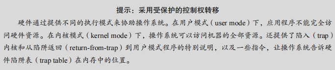
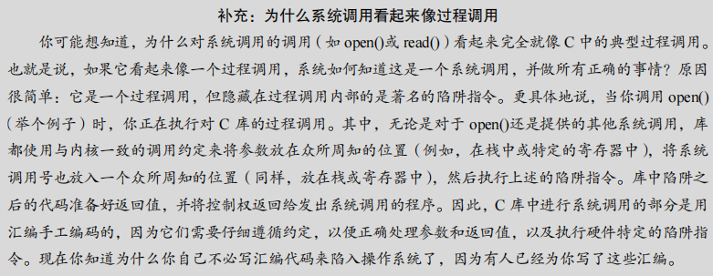
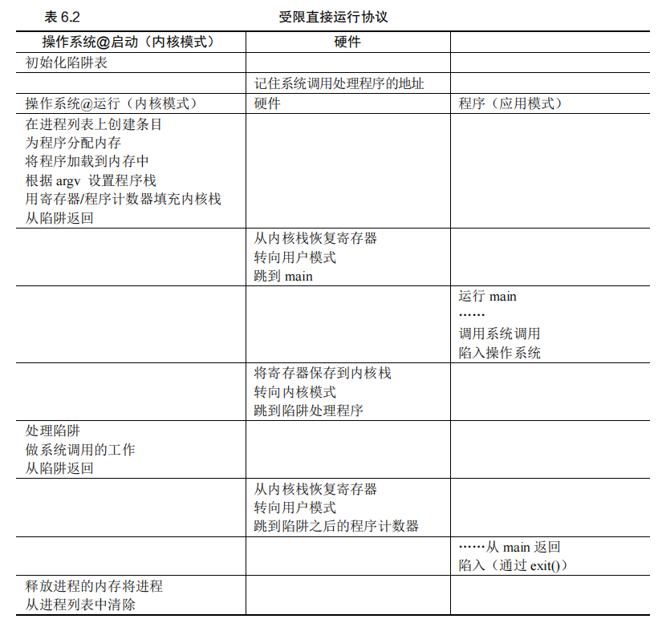
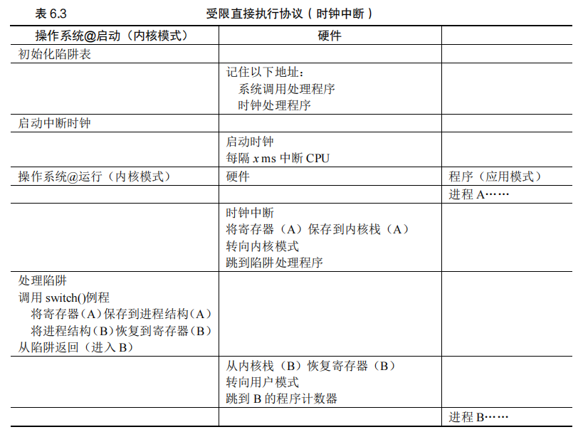
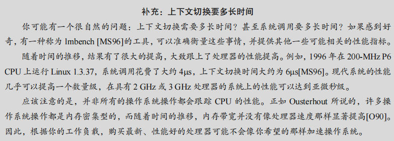

## 第 6 章 机制：受限直接执行

本章探讨了操作系统如何通过一种称为受限直接执行（limited direct execution）的技术来虚拟化CPU。这种技术的目标是让多个任务共享物理CPU，使得它们看起来像是同时运行。

#### 虚拟化 CPU 的挑战：

- **性能**：如何在不增加系统开销的情况下实现CPU的虚拟化？操作系统需要找到一种方法，使得虚拟化过程尽可能高效。
- **控制权**：操作系统必须保持对CPU的控制，以确保资源的正确管理。如果操作系统失去控制，进程可能会无限制地运行，导致系统不稳定或安全漏洞。因此，操作系统在实现CPU虚拟化时，必须在性能与控制权之间取得平衡。

#### 关键问题：

- **高效、可控的虚拟化**：操作系统必须**以高性能的方式虚拟化CPU，同时保持对系统的控制**。这需要硬件和操作系统的支持，操作系统通常会利用硬件支持来高效地实现这些目标。

### 6.1 基本技巧：受限直接执行

#### 直接执行的基本思想：

- **直接执行**：直接在CPU上运行程序，操作系统在进程列表中为程序创建条目、分配内存、加载程序代码、设置栈、清除寄存器，然后跳转到程序的入口点（如`main()`函数），开始执行用户代码。
- **无限制的直接执行**：表6.1展示了直接执行的基本协议，在没有任何限制的情况下，操作系统通过常规的调用和返回机制来运行程序。**这种方法的主要问题在于操作系统无法控制进程的行为，也无法在需要时切换进程。**

#### 原文：

​		听起来很简单，不是吗？但是，这种方法在我们的虚拟化 CPU 时产生了一些问题。第一个问题很简单：如果我们只运行一个程序，操作系统怎么能确保程序不做任何我们不希望它做的事，同时仍然高效地运行它？第二个问题：当我们运行一个进程时，操作系统如何让它停下来并切换到另一个进程，从而实现虚拟化 CPU 所需的时分共享？


#### 受限直接执行的需求：

- **问题1：控制程序行为**：如果操作系统仅仅是直接执行程序，它将无法控制程序的行为。**这意味着程序可能会执行不安全或不受欢迎的操作，这在操作系统中是不可接受的**。因此，需要引入限制来控制程序的行为。
- **问题2：时分共享和进程切换**：为了实现CPU的时分共享，**操作系统需要能够在运行一个进程时暂停它，并切换到另一个进程**。如果没有适当的机制，操作系统将无法实现这种进程切换。

### 受限直接执行的意义：

- **“受限” 的引入**：受限直接执行的概念表明操作系统不能仅仅依赖直接执行，还需要设置某些限制来控制程序的行为和执行。这些限制使得操作系统能够保持对CPU和系统资源的控制，从而有效地管理和调度多个进程。

### 小结：

本章介绍了操作系统在虚拟化CPU时面临的挑战，并引入了受限直接执行的概念。**通过这种技术，操作系统能够在保持高性能的同时，确保对系统资源的控制，从而有效地管理多个并发进程**。在下一步中，操作系统需要进一步开发技术，以解决进程切换和控制问题，实现真正的虚拟化。

### 6.2 问题 1：受限制的操作

在本节中，讨论了操作系统如何处理进程希望执行受限制的操作（如I/O请求或内存分配）的问题，同时仍然保持对系统的控制。这是实现受限直接执行（limited direct execution）中的一个关键挑战。

#### 受限制操作的挑战：

- **直接执行的优势与问题**：直接执行程序具有高效运行的优势，因为它在硬件CPU上直接运行，速度很快。然而，这种直接执行模式带来了一个问题：如果进程需要执行受限操作（如I/O请求），操作系统如何防止进程执行不安全或未经授权的操作？
- **引入用户模式**：为了应对这些问题，操作系统和硬件引入了不同的执行模式：用户模式（user mode）和内核模式（kernel mode）。
  - **用户模式**：在用户模式下，进程受到限制，不能执行I/O请求等特权操作。如果进程尝试执行这些操作，硬件会引发异常，可能导致操作系统终止进程。
  - **内核模式**：操作系统在内核模式下运行，具有访问所有硬件资源的权限，可以执行特权操作。

#### 系统调用与陷阱：

- **系统调用**：系统调用允许用户程序请求操作系统执行特权操作。通过执行系统调用，程序可以安全地请求诸如文件访问、进程创建与销毁、内存分配等操作。
- **陷阱机制**：系统调用依赖于硬件提供的陷阱机制。陷阱指令会将执行流从用户模式切换到内核模式，并跳转到操作系统的指定位置执行特权操作。完成操作后，操作系统通过返回陷阱指令将控制权返还给用户程序，并恢复到用户模式。
- **陷阱表**：操作系统在启动时通过设置陷阱表（trap table）来告诉硬件在发生系统调用或异常时应该跳转到哪个处理程序。这使得操作系统能够控制在发生特权请求时执行的代码，防止进程跳转到任意位置。

#### 安全与控制：

- **硬件保护机制**：硬件确保只有操作系统（在内核模式下）才能设置或修改陷阱表，防止用户模式下的进程干扰系统控制。如果一个进程尝试在用户模式下执行特权指令，硬件会拒绝该操作并可能终止进程。
- **协议总结**：==表6.2总结了受限直接执行协议的过程==，涵盖了操作系统如何初始化陷阱表、运行进程、处理系统调用和清理进程等步骤。


### 关键点总结：

- **受限直接执行**：通过限制用户模式下的操作和引入系统调用，操作系统能够在直接执行程序的同时保持对系统的控制。
- **陷阱与内核模式**：系统调用和陷阱机制是确保操作系统控制权的重要工具，它们允许安全地执行特权操作，并在完成后恢复到正常的用户程序执行。

### 思考问题：

- **特权操作的风险**：如果进程可以设置自己的陷阱表，它将能够接管整个系统。硬件和操作系统必须紧密协作，以防止这样的安全漏洞。

这部分内容探讨了操作系统如何在实现虚拟化CPU的过程中处理受限操作的挑战，确保系统的安全性和稳定性。

#### 原文：

​		直接执行的明显优势是快速。该程序直接在硬件 CPU 上运行，因此执行速度与预期的一样快。但是，在 CPU 上运行会带来一个问题——如果进程希望执行某种受限操作（如向磁盘发出 I/O 请求或获得更多系统资源（如 CPU 或内存）），该怎么办？




​		对于 I/O 和其他相关操作，一种方法就是让所有进程做所有它想做的事情。但是，这样做导致无法构建许多我们想要的系统。例如，如果我们希望构建一个在授予文件访问权限前检查权限的文件系统，就不能简单地让任何用户进程向磁盘发出 I/O。如果这样做，一个进程就可以读取或写入整个磁盘，这样所有的保护都会失效。

​		因此，我们采用的方法是引入一种新的处理器模式，称为用户模式（user mode）。在用户模式下运行的代码会受到限制。例如，在用户模式下运行时，进程不能发出 I/O 请求。这样做会导致处理器引发异常，操作系统可能会终止进程。

​		与用户模式不同的内核模式（kernel mode），操作系统（或内核）就以这种模式运行。在此模式下，运行的代码可以做它喜欢的事，包括特权操作，如发出 I/O 请求和执行所有类型的受限指令。

​		但是，我们仍然面临着一个挑战——如果用户希望执行某种特权操作（如从磁盘读取），应该怎么做？为了实现这一点，几乎所有的现代硬件都提供了用户程序执行系统调用的能力。系统调用是在 Atlas [K+61，L78]等古老机器上开创的，它允许内核小心地向用户程序暴露某些关键功能，例如访问文件系统、创建和销毁进程、与其他进程通信，以及分配更多内存。大多数操作系统提供几百个调用（详见 POSIX 标准[P10]）。早期的 UNIX 系统公开了更简洁的子集，大约 20 个调用。

​		要执行系统调用，程序必须执行特殊的陷阱（trap）指令。该指令同时跳入内核并将特权级别提升到内核模式。一旦进入内核，系统就可以执行任何需要的特权操作（如果允许），从而为调用进程执行所需的工作。完成后，操作系统调用一个特殊的从陷阱返回（return-from-trap）指令，如你期望的那样，该指令返回到发起调用的用户程序中，同时将特权级别降低，回到用户模式。

​		执行陷阱时，硬件需要小心，因为它必须确保存储足够的调用者寄存器，以便在操作系统发出从陷阱返回指令时能够正确返回。例如，在 x86 上，处理器会将程序计数器、标志和其他一些寄存器推送到每个进程的内核栈（kernel stack）上。从返回陷阱将从栈弹出这些值，并恢复执行用户模式程序（有关详细信息，请参阅英特尔系统手册[I11]）。其他硬件系统使用不同的约定，但基本概念在各个平台上是相似的。




​		还有一个重要的细节没讨论：陷阱如何知道在 OS 内运行哪些代码？显然，发起调用的过程不能指定要跳转到的地址（就像你在进行过程调用时一样），这样做让程序可以跳转到内核中的任意位置，这显然是一个糟糕的主意（想象一下跳到访问文件的代码，但在权限检查之后。实际上，这种能力很可能让一个狡猾的程序员令内核运行任意代码序列[S07]）。因此内核必须谨慎地控制在陷阱上执行的代码。

​		内核通过在启动时设置陷阱表（trap table）来实现。当机器启动时，它在特权（内核）模式下执行，因此可以根据需要自由配置机器硬件。操作系统做的第一件事，就是告诉硬件在发生某些异常事件时要运行哪些代码。例如，当发生硬盘中断，发生键盘中断或程序进行系统调用时，应该运行哪些代码？操作系统通常通过某种特殊的指令，通知硬件这些陷阱处理程序的位置。一旦硬件被通知，它就会记住这些处理程序的位置，直到下一次重新启动机器，并且硬件知道在发生系统调用和其他异常事件时要做什么（即跳转到哪段代码）。

​		最后再插一句：能够执行指令来告诉硬件陷阱表的位置是一个非常强大的功能。因此，你可能已经猜到，这也是一项特权（privileged）操作。如果你试图在用户模式下执行这个指令，硬件不会允许，你可能会猜到会发生什么（提示：再见，违规程序）。思考问题：如果可以设置自己的陷阱表，你可以对系统做些什么？你能接管机器吗？

​		时间线（随着时间的推移向下，在表 6.2 中）总结了该协议。我们假设每个进程都有一个内核栈，在进入内核和离开内核时，寄存器（包括通用寄存器和程序计数器）分别被保存和恢复。



​		LDE 协议有两个阶段。第一个阶段（在系统引导时），内核初始化陷阱表，并且 CPU 记住它的位置以供随后使用。内核通过特权指令来执行此操作（所有特权指令均以粗体突出显示）。第二个阶段（运行进程时），在使用从陷阱返回指令开始执行进程之前，内核设置了一些内容（例如，在进程列表中分配一个节点，分配内存）。这会将 CPU 切换到用户模式并开始运行该进程。当进程希望发出系统调用时，它会重新陷入操作系统，然后再次通过从陷阱返回，将控制权还给进程。该进程然后完成它的工作，并从 main()返回。这通常会返回到一些存根代码，它将正确退出该程序（例如，通过调用 exit()系统调用，这将陷入 OS 中）。此时，OS 清理干净，任务完成了。


### 6.3 问题 2：在进程之间切换

在操作系统中，进程之间的切换是一个关键的操作。这个过程看似简单，但实际上涉及许多复杂的机制，特别是在操作系统没有在 CPU 上运行的情况下，它如何重新获得控制权来进行进程切换。

#### 关键问题：如何重获 CPU 的控制权

操作系统必须在进程之间切换时重新获得 CPU 的控制权。如果进程在运行，这就意味着操作系统没有在 CPU 上运行，操作系统无法直接干预。这种情况下，操作系统依赖于两种方式来重新获得控制权：**协作方式和非协作方式。**

#### 协作方式：等待系统调用

在协作方式中，操作系统依赖于进程的合作，**即进程在运行一段时间后会主动通过系统调用（如文件操作或进程创建）将控制权交还给操作系统**。在这种情况下，操作系统可以选择继续当前进程或切换到其他进程。然而，这种方式有一个明显的缺点：**如果进程进入无限循环或拒绝进行系统调用，操作系统将无法重新获得控制权。**

#### 非协作方式：操作系统进行控制

为了确保操作系统能够在非协作的情况下也能控制 CPU，系统设计者引入了**时钟中断**。时钟设备可以配置为定期产生中断信号，当中断发生时，操作系统可以暂停当前进程并执行必要的操作，例如进行进程切换。通**过时钟中断，操作系统能够在预定时间间隔内强制获得 CPU 控制权，无论当前进程是否协作**。


表 6.3 展示了整个过程的时间线。在这个例子中，进程 A 正在运行，然后被中断时钟中断。硬件保存它的寄存器（在内核栈中），并进入内核（切换到内核模式）。在时钟中断处理程序中，操作系统决定从正在运行的进程 A 切换到进程 B。此时，它调用 switch()例程，该例程仔细保存当前寄存器的值（保存到 A 的进程结构），恢复寄存器进程 B（从它的进程结构），然后切换上下文（switch context），具体来说是通过改变栈指针来使用 B 的内核栈（而不是 A 的）。最后，操作系统从陷阱返回，恢复 B 的寄存器并开始运行它。


#### 保存和恢复上下文

当操作系统通过系统调用或时钟中断获得 CPU 控制权后，它需要决定是继续当前进程还是切换到另一个进程。**如果决定切换，操作系统必须保存当前进程的执行上下文（包括寄存器、程序计数器和栈指针），然后恢复即将运行的进程的上下文**。这个过程被称为**上下文切换**。

在上下文切换中，操作系统执行底层代码来保存和恢复寄存器值，并切换内核栈。最终，当操作系统完成从陷阱返回指令时，新的进程就会开始执行，而旧的进程则被暂停。整个过程确保了进程之间的无缝切换。

#### xv6 的上下文切换代码示例

```
# void swtch(struct context **old, struct context *new); 
#
# Save current register context in old 
# and then load register context from new. 
#
# 全局标签，表明这是一个全局符号，链接时可以被其他文件访问
.globl swtch

# 函数开始标签
swtch:
    # 保存旧的寄存器值

    # 将保存旧的上下文指针 (old) 放入 EAX 寄存器中
    movl 4(%esp), %eax    # eax = old

    # 保存指令指针 (IP)，pop 会从栈顶弹出当前的返回地址到 eax 中，然后
    # 把它保存到 old 指针指向的内存位置 (即保存 IP 到 old->eip)
    popl 0(%eax)          # *old->eip = 返回地址

    # 保存栈指针 (ESP)
    movl %esp, 4(%eax)    # *old->esp = esp

    # 保存其他通用寄存器
    movl %ebx, 8(%eax)    # *old->ebx = ebx
    movl %ecx, 12(%eax)   # *old->ecx = ecx
    movl %edx, 16(%eax)   # *old->edx = edx
    movl %esi, 20(%eax)   # *old->esi = esi
    movl %edi, 24(%eax)   # *old->edi = edi
    movl %ebp, 28(%eax)   # *old->ebp = ebp

    # 加载新的寄存器值

    # 将新上下文的指针 (new) 放入 EAX 寄存器中
    movl 4(%esp), %eax    # eax = new

    # 恢复新的寄存器值
    movl 28(%eax), %ebp   # ebp = *new->ebp
    movl 24(%eax), %edi   # edi = *new->edi
    movl 20(%eax), %esi   # esi = *new->esi
    movl 16(%eax), %edx   # edx = *new->edx
    movl 12(%eax), %ecx   # ecx = *new->ecx
    movl 8(%eax), %ebx    # ebx = *new->ebx

    # 切换栈指针 (ESP)
    movl 4(%eax), %esp    # esp = *new->esp

    # 将新的返回地址压入栈中 (恢复新的 IP)
    pushl 0(%eax)         # push *new->eip

    # 返回到新的上下文 (执行新的代码)
    ret                   # return
解释
函数入口: swtch 是上下文切换函数的入口，用于保存当前进程的寄存器状态到 old 指向的结构体，并从 new 指向的结构体中恢复新的寄存器状态。

保存旧的寄存器状态:

popl 0(%eax) 和 movl 系列指令将当前的指令指针 (IP)、栈指针 (ESP) 和其他通用寄存器的值保存到 old 指向的内存区域。这确保了当前进程的状态能够在将来恢复。
加载新的寄存器状态:

movl 系列指令从 new 指向的内存区域恢复新的寄存器状态。movl 4(%eax), %esp 切换到新进程的栈。
pushl 0(%eax) 和 ret 用于跳转到新进程的指令指针 (IP) 并继续执行。
关键点
上下文切换是操作系统中多任务处理的核心。它通过保存和恢复进程的寄存器状态，实现不同进程之间的切换。
指令指针 (IP) 和 栈指针 (ESP) 的切换使得 CPU 能够继续执行新的进程代码，保持进程之间的独立性。
```

图 6.1 展示了 xv6 操作系统中的上下文切换代码。代码展示了如何在汇编级别保存当前进程的寄存器状态并恢复下一个进程的寄存器状态。上下文切换的关键步骤包括：

1. **保存旧的寄存器状态**：将当前进程的寄存器值保存到对应的内存位置。
2. **加载新的寄存器状态**：从即将运行的进程的内存位置恢复寄存器值。
3. **切换栈指针**：改变栈指针以使用新的内核栈。
4. **返回到新的上下文**：通过 `ret` 指令返回到新的进程上下文，使新的进程开始执行。

上下文切换的实现对于多任务操作系统的性能和稳定性至关重要。操作系统的调度程序在每次时钟中断或系统调用时决定是否进行上下文切换，从而管理系统的进程调度和资源分配。

这一节的讨论帮助我们理解了操作系统在多任务环境中如何通过上下文切换实现进程之间的切换，从而有效地管理计算资源。


#### 原文：

​		直接执行的下一个问题是实现进程之间的切换。在进程之间切换应该很简单，对吧？操作系统应该决定停止一个进程并开始另一个进程。有什么大不了的？但实际上这有点棘手，特别是，如果一个进程在 CPU 上运行，这就意味着操作系统没有运行。如果操作系统没有运行，它怎么能做事情？（提示：它不能）虽然这听起来几乎是哲学，但这是真正的问题——如果操作系统没有在 CPU 上运行，那么操作系统显然没有办法采取行动。因此，我们遇到了关键问题。


#### 协作方式：等待系统调用 

​		过去某些系统采用的一种方式（例如，早期版本的 Macintosh 操作系统[M11]或旧的Xerox Alto 系统[A79]）称为协作（cooperative）方式。在这种风格下，操作系统相信系统的进程会合理运行。运行时间过长的进程被假定会定期放弃 CPU，以便操作系统可以决定运行其他任务。

​		因此，你可能会问，在这个虚拟的世界中，一个友好的进程如何放弃 CPU？事实证明，大多数进程通过进行系统调用，将 CPU 的控制权转移给操作系统，例如打开文件并随后读取文件，或者向另一台机器发送消息或创建新进程。像这样的系统通常包括一个显式的 yield 系统调用，它什么都不干，只是将控制权交给操作系统，以便系统可以运行其他进程。


​		如果应用程序执行了某些非法操作，也会将控制转移给操作系统。例如，如果应用程序以 0 为除数，或者尝试访问应该无法访问的内存，就会陷入（trap）操作系统。操作系统将再次控制 CPU（并可能终止违规进程）。

​		因此，在协作调度系统中，OS 通过等待系统调用，或某种非法操作发生，从而重新获得 CPU 的控制权。你也许会想：这种被动方式不是不太理想吗？例如，如果某个进程（无论是恶意的还是充满缺陷的）进入无限循环，并且从不进行系统调用，会发生什么情况？那时操作系统能做什么？

#### 非协作方式：操作系统进行控制 

​		事实证明，没有硬件的额外帮助，如果进程拒绝进行系统调用（也不出错），从而将控制权交还给操作系统，那么操作系统无法做任何事情。事实上，在协作方式中，当进程陷入无限循环时，唯一的办法就是使用古老的解决方案来解决计算机系统中的所有问题——重新启动计算机。因此，我们又遇到了请求获得 CPU 控制权的一个子问题。


​		答案很简单，许多年前构建计算机系统的许多人都发现了：时钟中断（timer interrupt）[M+63]。时钟设备可以编程为每隔几毫秒产生一次中断。产生中断时，当前正在运行的进程停止，操作系统中预先配置的中断处理程序（interrupt handler）会运行。此时，操作系统重新获得 CPU 的控制权，因此可以做它想做的事：停止当前进程，并启动另一个进程。


​		首先，正如我们之前讨论过的系统调用一样，操作系统必须通知硬件哪些代码在发生时钟中断时运行。因此，在启动时，操作系统就是这样做的。其次，在启动过程中，操作系统也必须启动时钟，这当然是一项特权操作。一旦时钟开始运行，操作系统就感到安全了，因为控制权最终会归还给它，因此操作系统可以自由运行用户程序。时钟也可以关闭（也是特权操作），稍后更详细地理解并发时，我们会讨论。请注意，硬件在发生中断时有一定的责任，尤其是在中断发生时，要为正在运行的程序保存足够的状态，以便随后从陷阱返回指令能够正确恢复正在运行的程序。这一组操作与硬件在显式系统调用陷入内核时的行为非常相似，其中各种寄存器因此被保存（进入内核栈），因此从陷阱返回指令可以容易地恢复。

#### 保存和恢复上下文 

​		既然操作系统已经重新获得了控制权，无论是通过系统调用协作，还是通过时钟中断更强制执行，都必须决定：是继续运行当前正在运行的进程，还是切换到另一个进程。这个决定是由调度程序（scheduler）做出的，它是操作系统的一部分。我们将在接下来的几章中详细讨论调度策略。

​		如果决定进行切换，OS 就会执行一些底层代码，即所谓的上下文切换（context switch）。上下文切换在概念上很简单：操作系统要做的就是为当前正在执行的进程保存一些寄存器的值（例如，到它的内核栈），并为即将执行的进程恢复一些寄存器的值（从它的内核栈）。这样一来，操作系统就可以确保最后执行从陷阱返回指令时，不是返回到之前运行的进程，而是继续执行另一个进程。

​		为了保存当前正在运行的进程的上下文，操作系统会执行一些底层汇编代码，来保存通用寄存器、程序计数器，以及当前正在运行的进程的内核栈指针，然后恢复寄存器、程序计数器，并切换内核栈，供即将运行的进程使用。通过切换栈，内核在进入切换代码调用时，是一个进程（被中断的进程）的上下文，在返回时，是另一进程（即将执行的进程）的上下文。当操作系统最终执行从陷阱返回指令时，即将执行的进程变成了当前运行的进程。至此上下文切换完成。

​		表 6.3 展示了整个过程的时间线。在这个例子中，进程 A 正在运行，然后被中断时钟中断。硬件保存它的寄存器（在内核栈中），并进入内核（切换到内核模式）。在时钟中断处理程序中，操作系统决定从正在运行的进程 A 切换到进程 B。此时，它调用 switch()例程，该例程仔细保存当前寄存器的值（保存到 A 的进程结构），恢复寄存器进程 B（从它的进程结构），然后切换上下文（switch context），具体来说是通过改变栈指针来使用 B 的内核栈（而不是 A 的）。最后，操作系统从陷阱返回，恢复 B 的寄存器并开始运行它。



​		请注意，在此协议中，有两种类型的寄存器保存/恢复。第一种是发生时钟中断的时候。在这种情况下，运行进程的用户寄存器由硬件隐式保存，使用该进程的内核栈。第二种是当操作系统决定从 A 切换到 B。在这种情况下，内核寄存器被软件（即 OS）明确地保存，但这次被存储在该进程的进程结构的内存中。后一个操作让系统从好像刚刚由 A 陷入内核，变成好像刚刚由 B 陷入内核。

​		为了让你更好地了解如何实现这种切换，图 6.1 给出了 xv6 的上下文切换代码。看看你是否能理解它（你必须知道一点 x86 和一点 xv6）。context 结构 old 和 new 分别在老的和新的进程的进程结构中。

这是您提供的代码，进行了格式化，并附上解释和总结：

```
.globl swtch
swtch:
    # 保存旧的寄存器
    movl 4(%esp), %eax     # 将旧上下文的地址加载到 %eax 中
    popl 0(%eax)           # 将返回地址（IP）保存到旧上下文中
    movl %esp, 4(%eax)     # 将栈指针保存到旧上下文中
    movl %ebx, 8(%eax)     # 将 %ebx 寄存器保存到旧上下文中
    movl %ecx, 12(%eax)    # 将 %ecx 寄存器保存到旧上下文中
    movl %edx, 16(%eax)    # 将 %edx 寄存器保存到旧上下文中
    movl %esi, 20(%eax)    # 将 %esi 寄存器保存到旧上下文中
    movl %edi, 24(%eax)    # 将 %edi 寄存器保存到旧上下文中
    movl %ebp, 28(%eax)    # 将 %ebp 寄存器保存到旧上下文中

    # 加载新的寄存器
    movl 4(%esp), %eax     # 将新上下文的地址加载到 %eax 中
    movl 28(%eax), %ebp    # 恢复 %ebp 寄存器
    movl 24(%eax), %edi    # 恢复 %edi 寄存器
    movl 20(%eax), %esi    # 恢复 %esi 寄存器
    movl 16(%eax), %edx    # 恢复 %edx 寄存器
    movl 12(%eax), %ecx    # 恢复 %ecx 寄存器
    movl 8(%eax), %ebx     # 恢复 %ebx 寄存器
    movl 4(%eax), %esp     # 切换栈指针
    pushl 0(%eax)          # 将新的返回地址放置到栈顶
    ret                    # 返回到新的上下文
```

#### 补充：代码解释与总结

这个汇编代码实现了一个上下文切换函数 `swtch`，主要用于操作系统或多线程环境中的任务切换。上下文切换的目的是保存当前任务的寄存器状态，然后加载另一个任务的寄存器状态，从而在不同任务之间切换执行。

##### 步骤详解

1. **保存当前上下文**:
   - 从堆栈指针（%esp）中获取 `old` 上下文指针，存入 `%eax`。
   - 保存当前的指令指针（IP），即返回地址。
   - 保存栈指针（%esp）以及其他重要的寄存器（如 `%ebx`，`%ecx`，`%edx`，`%esi`，`%edi`，`%ebp`）到 `old` 上下文结构中。
2. **加载新上下文**:
   - 获取 `new` 上下文指针，并将其加载到 `%eax`。
   - 从 `new` 上下文中恢复栈指针和各寄存器的值。
   - 将 `new` 的返回地址放入栈顶，以便执行 `ret` 指令时跳转到新上下文中的正确位置。

##### 总结

这段代码是一个典型的上下文切换实现，它保存和恢复任务的CPU寄存器状态，使不同的任务可以在相同的CPU上交替执行。上下文切换是实现多任务处理的核心机制之一，在操作系统的内核层次中应用广泛。


#### 补充：在x86架构下（如代码中使用的），常见的寄存器主要分为以下几类，每类包含若干种寄存器：

##### 1. **通用寄存器（General-Purpose Registers）**

- **EAX**（累加器寄存器）：用于算术运算、数据传输等通用操作。
- **EBX**（基址寄存器）：通常用于数据存储或基址地址存取。
- **ECX**（计数器寄存器）：常用于循环计数或字符串操作。
- **EDX**（数据寄存器）：用于I/O操作或与EAX结合进行乘除法。
- **ESI**（源索引寄存器）：用于字符串或数组操作中的源指针。
- **EDI**（目的索引寄存器）：用于字符串或数组操作中的目的指针。
- **EBP**（基指针寄存器）：用于栈帧基址指针，访问函数参数和局部变量。
- **ESP**（栈指针寄存器）：指向当前栈顶，用于栈操作。

##### 2. **段寄存器（Segment Registers）**

- **CS**（代码段寄存器）：指向当前正在执行的代码段。
- **DS**（数据段寄存器）：指向数据段，用于数据存取。
- **SS**（栈段寄存器）：指向当前的栈段。
- **ES**（附加段寄存器）：附加数据段指针。
- **FS**、**GS**：额外的段寄存器，用于特殊用途或多线程环境中的数据存取。

##### 3. **指令指针寄存器**

- **EIP**（指令指针）：保存下一条将要执行的指令地址。

##### 4. **状态标志寄存器**

- **EFLAGS**（标志寄存器）：包含状态标志位，用于控制和反映处理器的状态。

##### 5. **控制寄存器（Control Registers）**

- **CR0** 到 **CR4**：用于控制CPU的运行模式，如保护模式和分页。

##### 6. **调试寄存器（Debug Registers）**

- **DR0** 到 **DR7**：用于硬件调试和断点设置。

##### 7. **浮点寄存器和SIMD寄存器**

- **ST0** 到 **ST7**：浮点寄存器。
- **XMM0** 到 **XMM7**（或更多）：用于SSE指令的SIMD寄存器。

综上，在x86架构下有多种类型的寄存器，每类寄存器数量各不相同，总共有几十种寄存器，每种寄存器有各自的用途和功能。


### 6.4 担心并发吗

在本节中，作者提出了一个读者可能关心的问题：==当在处理一个系统调用或中断时，又发生了新的中断，操作系统如何处理这种情况==？这种并发问题确实是操作系统必须解决的关键挑战之一。

#### 并发问题的引入：

- **系统调用期间的中断**：当系统调用正在处理中，时钟中断发生时，操作系统需要管理这种并发情况，确保系统稳定运行。
- **多个中断的处理**：如果在处理一个中断的过程中，又发生了其他中断，操作系统如何应对这种情况？这些复杂的并发情况可能会让内核的设计变得相当复杂。

#### 并发问题的解决：

- **中断的禁用**：一个简单的解决方法是在处理当前中断时，临时禁用其他中断。这确保了在处理一个中断时，CPU不会被其他中断打断。但这种方式需要小心使用，因为禁用中断的时间过长可能会导致重要中断被忽略。
- **加锁机制****：操作系统还可以采用复杂的加锁机制来处理并发访问数据结构的问题**。尤其是在多处理器环境中，加锁机制可以确保多个进程或中断同时访问内核时，不会引发数据不一致的问题。

#### 上下文切换的时间：

- **性能问题**：上下文切换需要时间。历史上，1996年在200-MHz P6 CPU上运行的Linux 1.3.37系统中，上下文切换大约需要6微秒，而现代系统的性能则可以提高一个数量级，达到亚微秒级别。
- **性能瓶颈**：尽管处理器速度有所提高，但内存带宽的提升并不显著，因此操作系统的某些操作可能仍然受到内存密集型任务的限制。

#### 操作系统中的并发管理：

- **并发复杂性**：操作系统必须妥善管理并发情况，以确保系统在多任务和多处理中能够稳定运行。在接下来的章节中，书中将详细讨论并发的各种挑战和解决方案。

#### 原文：

​		作为细心周到的读者，你们中的一些人现在可能会想：“呃……在系统调用期间发生时钟中断时会发生什么？”或“处理一个中断时发生另一个中断，会发生什么？这不会让内核难以处理吗？”好问题——我们真的对你抱有一点希望！答案是肯定的，如果在中断或陷阱处理过程中发生另一个中断，那么操作系统确实需要关心发生了什么。实际上，这正是本书第 2 部分关于并发的主题。那时我们将详细讨论。



​		为了让你开开胃，我们只是简单介绍了操作系统如何处理这些棘手的情况。操作系统可能简单地决定，在中断处理期间禁止中断（disable interrupt）。这样做可以确保在处理一个中断时，不会将其他中断交给 CPU。当然，操作系统这样做必须小心。禁用中断时间过长可能导致丢失中断，这（在技术上）是不好的。操作系统还开发了许多复杂的加锁（locking）方案，以保护对内部数据结构的并发访问。这使得多个活动可以同时在内核中进行，特别适用于多处理器。我们在本书下一部分关于并发的章节中将会看到，这种锁可能会变得复杂，并导致各种有趣且难以发现的错误。


### 6.5 小结

本章总结了实现CPU虚拟化的关键底层机制，统称为“受限直接执行”（limited direct execution）。==基本思路是允许程序直接在CPU上运行，但操作系统在此之前会设置必要的硬件和软件机制，以确保进程不会执行未经授权的操作。==

#### 关键点总结：

- **受限直接执行**：通过限制进程在用户模式下的操作，操作系统能够有效地管理和控制进程的行为，从而实现CPU虚拟化。
- **系统稳定性**：为了确保系统的稳定性，操作系统使用时钟中断和系统调用来重新获得CPU的控制权，并通过上下文切换来实现进程调度。
- **并发管理**：操作系统必须应对并发访问和中断处理的挑战，通过禁用中断或使用加锁机制来确保系统在多任务环境下的稳定运行。

#### 调度问题：

最后，操作系统还面临一个主要问题：在任何给定的时刻，应该运行哪个进程？这是调度程序必须解决的问题，也是本书接下来要探讨的主题。


#### 原文：

​		我们已经描述了一些实现 CPU 虚拟化的关键底层机制，并将其统称为受限直接执行（limited direct execution）。基本思路很简单：就让你想运行的程序在 CPU 上运行，但首先确保设置好硬件，以便在没有操作系统帮助的情况下限制进程可以执行的操作。这种一般方法也在现实生活中采用。例如，那些有孩子或至少听说过孩子的人可能会熟悉宝宝防护（baby proofing）房间的概念——锁好包含危险物品的柜子，并掩盖电源插座。当这些都准备妥当时，你可以让宝宝自由行动，确保房间最危险的方面受到限制。

#### 提示：重新启动是有用的

​		之前我们指出，在协作式抢占时，无限循环（以及类似行为）的唯一解决方案是重启（reboot）机器。虽然你可能会嘲笑这种粗暴的做法，但研究表明，重启（或在通常意义上说，重新开始运行一些软件）可能是构建强大系统的一个非常有用的工具[C+04]。

​		具体来说，重新启动很有用，因为它让软件回到已知的状态，很可能是经过更多测试的状态。重新启动还可以回收旧的或泄露的资源（例如内存），否则这些资源可能很难处理。最后，重启很容易自动化。由于所有这些原因，在大规模集群互联网服务中，系统管理软件定期重启一些机器，重置它们并因此获得以上好处，这并不少见。

​		因此，下次重启时，要相信自己不是在进行某种丑陋的粗暴攻击。实际上，你正在使用经过时间考验的方法来改善计算机系统的行为。干得漂亮！


​		通过类似的方式，OS 首先（在启动时）设置陷阱处理程序并启动时钟中断，然后仅在受限模式下运行进程，以此为 CPU 提供“宝宝防护”。这样做，操作系统能确信进程可以高效运行，只在执行特权操作，或者当它们独占 CPU 时间过长并因此需要切换时，才需要操作系统干预。

​		至此，我们有了虚拟化 CPU 的基本机制。但一个主要问题还没有答案：在特定时间，我们应该运行哪个进程？调度程序必须回答这个问题，因此这也是我们研究的下一个主题。