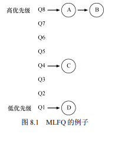
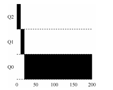
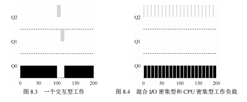
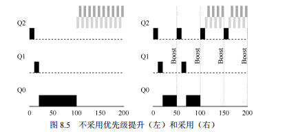
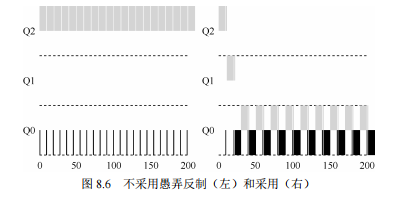
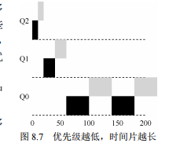

### 第 8 章 调度：多级反馈队列

本章介绍了一种著名的调度方法——多级反馈队列（Multi-level Feedback Queue, MLFQ）。这一调度策略最早由 Corbato 于 1962 年提出，应用于兼容时分共享系统（CTSS）。由于他在 CTSS 和 Multics 系统中的贡献，Corbato 被授予了 ACM 图灵奖。MLFQ 调度程序经过多年的优化，成为许多现代操作系统的重要组成部分。

#### MLFQ 面临的问题

MLFQ 旨在解决两个主要问题：

1. **优化周转时间**：在第 7 章中，我们已经了解到，先执行短作业有助于优化周转时间。然而，操作系统通常不知道任务的运行时间，而这正是 SJF（Shortest Job First）或 STCF（Shortest Time-to-Completion First）等算法所依赖的先验知识。
2. **提高交互体验**：MLFQ 希望为交互式用户提供较好的响应时间，使得用户在使用计算机时能感到系统响应迅速。然而，尽管像轮转调度（Round-Robin, RR）这样的算法可以降低响应时间，但它们在周转时间方面表现不佳。

因此，MLFQ 面临的挑战是：如何在没有任务长度先验知识的情况下，构建一个能够同时优化响应时间和周转时间的调度程序？如何在进程运行的过程中学习其特性，并据此做出更好的调度决策？

**关键问题：没有完备的知识如何调度？** 在缺乏任务长度等先验知识的情况下，如何设计一个能够同时减少响应时间和周转时间的调度程序？

**提示：从历史中学习** MLFQ 是通过观察进程的历史行为来预测未来的一种调度策略。操作系统通过学习进程的行为模式，来动态调整调度策略。这种方法在计算机科学的许多领域都得到了应用，例如硬件中的分支预测和缓存算法。然而，这种基于历史的预测方法也存在风险，因为它可能出错，从而导致比完全无知时更糟糕的决策。

### 补充1：举例短作业优先如何减少系统中作业的平均等待时间，难道不是一样时间吗

让我们通过一个具体的例子来说明短作业优先如何减少系统中作业的平均等待时间。

假设有四个作业，它们的到达时间相同，执行时间如下：

- 作业 A：8 单位时间
- 作业 B：4 单位时间
- 作业 C：2 单位时间
- 作业 D：1 单位时间

#### 1. 先来看看如果按照**先来先服务**（FCFS，First-Come-First-Served）调度算法执行，作业的执行顺序如下：

- 作业 A：0 到 8 单位时间
- 作业 B：8 到 12 单位时间
- 作业 C：12 到 14 单位时间
- 作业 D：14 到 15 单位时间

计算每个作业的等待时间（等待时间=开始执行时间 - 到达时间）：

- 作业 A：0 单位时间
- 作业 B：8 单位时间
- 作业 C：12 单位时间
- 作业 D：14 单位时间

平均等待时间 = (0 + 8 + 12 + 14) / 4 = 34 / 4 = 8.5 单位时间

#### 2. 现在我们使用**短作业优先**（SJF，Shortest Job First）调度算法执行，作业的执行顺序如下：

- 作业 D：0 到 1 单位时间
- 作业 C：1 到 3 单位时间
- 作业 B：3 到 7 单位时间
- 作业 A：7 到 15 单位时间

计算每个作业的等待时间：

- 作业 D：0 单位时间
- 作业 C：1 单位时间
- 作业 B：3 单位时间
- 作业 A：7 单位时间

平均等待时间 = (0 + 1 + 3 + 7) / 4 = 11 / 4 = 2.75 单位时间

#### 总结

通过这个例子可以看到，短作业优先算法将平均等待时间从 8.5 单位时间减少到了 2.75 单位时间。虽然每个作业执行的时间总和是相同的，但因为短作业先执行，整体上减少了其他作业的等待时间，从而降低了平均等待时间。这就是短作业优先调度在减少系统中作业的平均等待时间方面的优势。

### 补充2：举例短作业优先如何减少系统中作业的周转时间，难道不是一样时间吗

要理解短作业优先（SJF）如何减少系统中作业的周转时间，首先需要明确什么是周转时间。

#### 周转时间的定义：

**周转时间 = 作业完成时间 - 作业到达时间**

也就是说，周转时间指的是从作业到达系统到作业完成所经过的总时间。

接下来，让我们用一个例子来说明短作业优先如何减少系统中作业的周转时间。

假设有四个作业，它们的到达时间相同，执行时间如下：

- 作业 A：8 单位时间
- 作业 B：4 单位时间
- 作业 C：2 单位时间
- 作业 D：1 单位时间

#### 1. 先来看看如果按照**先来先服务**（FCFS，First-Come-First-Served）调度算法执行，作业的执行顺序如下：

- 作业 A：0 到 8 单位时间
- 作业 B：8 到 12 单位时间
- 作业 C：12 到 14 单位时间
- 作业 D：14 到 15 单位时间

计算每个作业的周转时间（周转时间=完成时间 - 到达时间）：

- 作业 A：8 - 0 = 8 单位时间
- 作业 B：12 - 0 = 12 单位时间
- 作业 C：14 - 0 = 14 单位时间
- 作业 D：15 - 0 = 15 单位时间

平均周转时间 = (8 + 12 + 14 + 15) / 4 = 49 / 4 = 12.25 单位时间

#### 2. 现在我们使用**短作业优先**（SJF，Shortest Job First）调度算法执行，作业的执行顺序如下：

- 作业 D：0 到 1 单位时间
- 作业 C：1 到 3 单位时间
- 作业 B：3 到 7 单位时间
- 作业 A：7 到 15 单位时间

计算每个作业的周转时间：

- 作业 D：1 - 0 = 1 单位时间
- 作业 C：3 - 0 = 3 单位时间
- 作业 B：7 - 0 = 7 单位时间
- 作业 A：15 - 0 = 15 单位时间

平均周转时间 = (1 + 3 + 7 + 15) / 4 = 26 / 4 = 6.5 单位时间

#### 总结

通过这个例子可以看到，短作业优先算法将平均周转时间从 12.25 单位时间减少到了 6.5 单位时间。

虽然作业的执行时间总和不变，但通过优先执行短作业，系统能够更快地完成作业，因此作业的周转时间也随之减少。这种调度策略减少了系统中作业的平均周转时间，从而提升了系统的整体性能。

### 8.1 MLFQ：基本规则

为了实现上述目标，本章介绍了多级反馈队列的基本算法。虽然 MLFQ 的具体实现方式可能各有不同，但其核心思想是相似的。

MLFQ 通过多个具有不同优先级的队列来管理任务的调度。任何时刻，每个任务只能存在于一个队列中。MLFQ 的关键在于优先级的设置：它不是为每个任务分配一个固定的优先级，而是根据任务的运行行为动态调整其优先级。

**规则 1**：如果任务 A 的优先级 > 任务 B 的优先级，则运行任务 A，而不运行任务 B。

**规则 2**：如果任务 A 和任务 B 的优先级相同，则对它们采用轮转调度。

MLFQ 的一个关键特点是，它在进程的运行过程中根据观察到的行为调整其优先级。例如，如果一个任务频繁地让出 CPU 以等待键盘输入（典型的交互式进程行为），MLFQ 会提高该任务的优先级。相反，如果一个任务长时间占用 CPU，MLFQ 会降低其优先级。通过这种方式，MLFQ 试图利用过去的行为预测任务未来的行为，并优化调度决策。

图 8.1 展示了一个 MLFQ 系统的静态快照。

在这个快照中，任务 A 和 B 处于最高优先级的队列中，而任务 C 和 D 分别处于中等和低优先级队列中。根据上述规则，调度程序会首先交替运行任务 A 和 B，而 C 和 D 则必须等待。尽管这个快照展示了队列的状态，但它并未揭示任务优先级随时间变化的动态过程，这正是我们接下来要详细探讨的内容。

### 8.2 尝试 1：如何改变优先级

为了使多级反馈队列（MLFQ）在进程的生命周期中动态地调整优先级，我们引入了一些规则。这些规则旨在通过观察进程的行为来判断它们的特性，并相应地调整它们在队列中的位置。

**规则 3**：当工作进入系统时，默认放在最高优先级队列中。

**规则 4a**：如果一个工作用完整个时间片，则降低其优先级，将其移入下一个低优先级的队列。

**规则 4b**：如果工作在时间片结束前主动释放 CPU（例如，进入 I/O 操作），则保持其优先级不变。

#### 实例 1：单个长时间运行的工作

让我们从一个简单的例子开始，假设系统中只有一个长时间运行的工作。在这个例子中，调度程序有 3 个队列，如图 8.2 所示。

当这个工作进入系统时，它被放在最高优先级队列（Q2）中。执行一个 10ms 的时间片后，调度程序会将该工作的优先级降低一层，移入 Q1。在 Q1 执行完一个时间片后，它的优先级再次降低，进入最低优先级队列（Q0），并在剩余的生命周期内停留在该队列中。这是一个相对简单的情况。

#### 实例 2：混合长短任务

接下来我们看一个稍微复杂的例子，系统中有两个工作：一个是长时间运行的 CPU 密集型工作 A，另一个是短时间运行的交互型工作 B。假设 A 已经在系统中运行了一段时间，然后 B 在某个时间点进入系统。

根据 MLFQ 的规则，B 将被放入最高优先级队列中。由于 B 的运行时间较短（例如 20ms），在它的优先级降低之前就完成了任务。这意味着 B 将获得较高的响应时间和较短的周转时间，而 A 则继续在低优先级队列中运行。

通过这个例子，MLFQ 近似实现了 SJF 的调度目标：优先处理短任务。如果一个任务确实是短任务，那么它会很快完成，而不会被移到较低优先级的队列中。如果任务较长，优先级将逐渐降低，最终被认为是一个长时间任务。

#### 实例 3：加入 I/O 操作

现在来看一个涉及 I/O 操作的例子。在这个例子中，我们假设一个交互型工作 B 频繁进行 I/O 操作，每执行 1ms 的 CPU 时间后就进入 I/O 操作。与此同时，一个长时间运行的 CPU 密集型工作 A 也在系统中运行。

根据规则 4b，B 每次在时间片用完之前主动放弃 CPU，因此其优先级保持不变，继续停留在最高优先级队列中。这样，B 作为一个交互型任务，能够频繁地获得 CPU 时间，从而实现较好的响应时间。而 A 则继续在低优先级队列中运行。

这个例子展示了 MLFQ 如何通过保持交互型任务的高优先级，从而提高系统的交互性能。

#### MLFQ 的问题

尽管基本的 MLFQ 看起来相当不错，但它仍然存在一些严重的问题：

1. **饥饿问题**：如果系统中有过多的交互型任务，它们会占用大部分的 CPU 时间，导致长时间运行的任务得不到足够的 CPU 时间，最终可能陷入饥饿状态，永远无法完成。
2. **调度程序的被愚弄**：聪明的用户可能会编写一些策略来欺骗调度程序。例如，通过在每个时间片即将结束时主动发起一个无关的 I/O 操作，使得任务始终保持在高优先级队列中，从而占用更多的 CPU 时间。
3. **任务特性的变化**：某些任务的行为可能在不同的时间段发生变化。例如，一个计算密集型的任务在某个时间段可能表现为交互型任务。如果使用当前的优先级调整规则，它可能无法像其他交互型任务那样获得优待。

这些问题表明，MLFQ 需要进一步的改进和调整，以应对更复杂的系统需求。

### 8.3 尝试 2：提升优先级

为了防止长时间运行的 CPU 密集型任务被饥饿，我们可以引入一个优先级提升（priority boost）机制。这种机制将周期性地提升所有进程的优先级，使得即使是低优先级的进程也能定期获得 CPU 时间。

**规则 5**：经过一段时间 S，将系统中所有的进程重新提升到最高优先级队列。

这个新规则解决了两个主要问题：

1. **防止饥饿**：即使系统中有大量的交互型进程，长时间运行的进程也不会被完全忽略。它们会在 S 这个时间周期内被提升到最高优先级队列，从而获得执行机会。
2. **应对进程行为变化**：如果一个原本是计算密集型的进程变成了交互型进程，在下一次优先级提升时，调度程序能够识别并正确地对待它。

**例子**：假设有一个长时间运行的进程和两个交互型短任务在系统中竞争 CPU。

图 8.5 显示了没有优先级提升（左图）和有优先级提升（右图）的情况。在没有提升的情况下，长时间运行的任务会被饥饿，而有了优先级提升后，长时间运行的任务至少能够定期获得执行机会。

### 8.4 尝试 3：更好的计时方式

接下来的问题是如何防止进程通过伪装自己的行为来欺骗调度程序。例如，某些进程可能在时间片结束前主动放弃 CPU，以保持在高优先级队列中。为了解决这个问题，我们需要改进 MLFQ 的 CPU 计时机制。

**规则 4**：**在某一层中，无论进程主动放弃了多少次 CPU，一旦用完了该层的时间配额，都会降低其优先级，移入低一级队列。**

通过这种方式，进程无法通过主动放弃 CPU 来保持高优先级。无论进程如何分割时间片，最终都会因为用完时间配额而被降级。

**例子**：图 8.6 对比了两种策略的效果。

左图中，进程通过频繁的 I/O 操作保持在高优先级，进而垄断了 CPU 时间。而右图中的新规则阻止了这种行为，确保所有进程都能公平地获得 CPU 时间。

### 8.5 MLFQ 的调优及其他问题

MLFQ 的配置涉及多个参数，如队列数量、时间片长度、以及多长时间提升一次优先级。不同的系统可能需要不同的参数配置，因此通常需要通过经验和调优来确定最合适的设置。

**时间片配置**：高优先级队列的时间片通常较短（如 10ms），以便交互型进程能够快速响应。低优先级队列的时间片则较长，以提高 CPU 密集型任务的效率。

**优先级提升周期**：配置 S 的值非常关键。如果 S 设置过高，低优先级的进程可能会饥饿；如果 S 过低，交互型进程的响应时间可能会受到影响。这种权衡需要根据实际系统的负载情况进行调整。

### 8.6 MLFQ：小结

多级反馈队列（MLFQ）是一种非常灵活的调度算法，通过观察进程的行为，动态调整优先级，从而在没有先验知识的情况下，既能优化响应时间，又能保证 CPU 密集型任务的公平性。MLFQ 的主要优势在于它可以同时满足短时间交互任务和长时间 CPU 密集型任务的需求。

总结规则如下：

1. **规则 1**：如果 A 的优先级 > B 的优先级，运行 A（不运行 B）。
2. **规则 2**：如果 A 的优先级 = B 的优先级，轮转运行 A 和 B。
3. **规则 3**：工作进入系统时，放在最高优先级队列。
4. **规则 4**：一旦工作用完了其在某一层中的时间配额（无论中间主动放弃了多少次 CPU），就降低其优先级，移入低一级队列。
5. **规则 5**：经过一段时间 S，将系统中所有工作重新加入最高优先级队列。

MLFQ 通过动态调整优先级，适应不同类型的工作负载，广泛应用于许多现代操作系统中，包括 BSD UNIX、Solaris 和 Windows 系列。