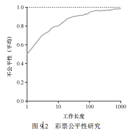

# 第9章 调度：比例份额

在本章中，我们来看一个不同类型的调度程序——比例份额（proportional-share）调度程序，有时也称为公平份额（fair-share）调度程序。比例份额算法基于一个简单的想法：调度程序的最终目标，是确保每个工作获得一定比例的 CPU 时间，而不是优化周转时间和响应时间。

比例份额调度程序有一个非常优秀的现代例子，由 Waldspurger 和 Weihl 发现，名为彩票调度（lottery scheduling） [WW94]。但这个想法其实出现得更早[KL88]。基本思想很简单：每隔一段时间，都会举行一次彩票抽奖，以确定接下来应该运行哪个进程。越是应该频繁运行的进程，越是应该拥有更多地赢得彩票的机会。很简单吧？现在，谈谈细节！但还是先看看下面的关键问题。


关键问题：如何按比例分配 **CPU**

如何设计调度程序来按比例分配 CPU？其关键的机制是什么？效率如何？

### 9.1 基本概念：彩票数表示份额

在比例份额调度程序中，核心概念是“彩票数”（tickets）。每个进程都分配有一定数量的彩票，这些彩票代表了该进程所应占用的 CPU 资源的份额。**简单来说，拥有的彩票越多，进程获得 CPU 时间的概率就越高。**

#### 举例说明

假设系统中有两个进程 A 和 B，A 分配到 75 张彩票，B 分配到 25 张彩票。总彩票数为 100 张，意味着 A 理论上应获得 75% 的 CPU 时间，B 应获得 25% 的 CPU 时间。

调度程序通过在每个时间片内进行一次抽奖来决定哪个进程将获得 CPU 的使用权。比如，如果抽奖的结果是落在 A 拥有的 75 张彩票范围内，则 A 运行；如果落在 B 的 25 张彩票范围内，则 B 运行。这种方式确保了从长远来看，进程 A 和 B 获得的 CPU 资源将大致符合 75:25 的比例。

#### 利用随机性

彩票调度通过随机抽奖的方式来分配 CPU 时间，虽然每次的结果可能并不完全符合预期的比例，但随着时间的推移，抽奖结果的累积将会接近预期的比例。利用随机性能够减少算法的复杂性，同时避免某些边缘情况带来的问题。

### 9.2 彩票机制

彩票调度还提供了几种机制来增强调度的灵活性和有效性：

1. **彩票货币**：用户可以使用自己的一种“货币”形式来分配彩票给他们的进程。操作系统会将这些货币转换成全局彩票总量中的份额。例如，用户 A 拥有 100 张彩票货币，他可以将其分配给两个进程 A1 和 A2。操作系统会根据全局彩票数量，将用户的彩票货币兑换成实际的彩票数，从而决定每个进程的运行概率。
2. **彩票转让**：进程可以将自己的部分彩票转让给另一个进程。这在客户端/服务端模型中非常有用。例如，客户端进程可以将彩票转让给正在为其服务的服务端进程，以加快服务进程的执行。
3. **彩票通胀**：在信任环境中，进程可以临时增加或减少自己的彩票数，以告知操作系统其对 CPU 时间的需求。这种机制允许在系统内部灵活调整资源的分配，但在竞争激烈的环境中需要谨慎使用，以防止资源分配不公平。

这些机制使得彩票调度不仅能实现按比例分配资源，还能灵活应对不同的进程需求和系统配置。

### 9.3 实现彩票调度

实现彩票调度（lottery scheduling）涉及一些关键机制和概念，这些机制使得调度程序能够有效地分配 CPU 资源。下面是实现彩票调度的几个核心部分：

**彩票分配**：每个进程都会分配一定数量的彩票，这些彩票的数量反映了进程应获得的 CPU 份额。进程拥有的彩票越多，它被选中运行的概率就越大。

**抽奖机制**：在每个时间片的开始，调度程序会随机抽取一张彩票，以决定哪个进程将获得该时间片的 CPU 时间。这种抽奖机制非常轻量级，并且能够动态调整资源分配。

**彩票货币**：彩票调度中引入了“彩票货币”的概念。用户可以按照自己偏好的比例分配彩票给不同的进程。操作系统会根据全局彩票总量将用户的彩票货币兑换成全局彩票。这种机制允许用户在资源分配上具有更大的灵活性和控制权。

**彩票转让**：在某些情况下，进程之间可以转让彩票。例如，客户端进程可以将彩票转让给服务端进程，以加快服务请求的处理速度。这种转让可以临时改变调度的优先级，有效地支持了进程间的协作。

**彩票通胀**：在某些信任环境中，进程可以通过彩票通胀临时增加或减少自己的彩票数量，从而向操作系统传达自己对 CPU 时间的需求。在竞争激烈的环境中，使用彩票通胀需要谨慎，因为它可能导致某些进程过度获取资源，影响系统的整体公平性。

**效率和公平性**：彩票调度的一个显著优点是其简单性和灵活性。通过随机抽奖，它能够在较长时间内接近平衡的资源分配。然而，由于其本质上的随机性，短期内的调度结果可能会有所偏离。例如，某个进程可能会偶尔得到较多或较少的 CPU 时间，但在较长时间内，这些偏差会被逐渐平衡。

**实现细节**：在实际系统中，彩票调度的实现需要考虑如何生成随机数、管理彩票池、以及处理不同进程的优先级需求。常见的实现方法包括使用高效的随机数生成器，以及设计快速的算法来选择中奖的彩票。通过这些技术手段，彩票调度能够在保持灵活性和简单性的同时，提供足够的性能和公平性。

彩票调度以其简单且有效的设计成为一种广泛应用的比例份额调度方法。它不仅能够根据进程需求动态分配 CPU 资源，还能通过彩票转让和通胀等机制，支持进程间的协作和资源的灵活分配。这使得彩票调度在多种应用场景中都能表现出色，尤其是在需要灵活处理资源竞争的系统中。


彩票调度中最不可思议的，或许就是实现简单。只需要一个不错的随机数生成器来选择中奖彩票和一个记录系统中所有进程的数据结构（一个列表），以及所有彩票的总数。

假定我们用列表记录进程。下面的例子中有 A、B、C 这 3 个进程，每个进程有一定数量的彩票。


在做出调度决策之前，首先要从彩票总数 400 中选择一个随机数（中奖号码）①。假设选择了 300。然后，遍历链表，用一个简单的计数器帮助我们找到中奖者（见图 9.1）。

```c
// counter: 用于跟踪我们是否已经找到了获胜者
int counter = 0; 

// winner: 使用随机数生成器函数获取一个值，范围在0到所有票数之间
int winner = getrandom(0, totaltickets); 

// current: 用来遍历作业列表的指针
node_t *current = head; 

// 循环，直到累加的票数大于获胜者的票数
while (current) { 
    // 累加当前作业的票数
    counter = counter + current->tickets; 
    
    // 如果累加票数大于获胜者票数，说明找到了需要调度的作业
    if (counter > winner) 
        break; // 找到了获胜者，跳出循环
    
    // 移动到下一个作业节点
    current = current->next; 
} 

// 'current' 现在指向获胜的作业节点：调度它...

```

### 代码解释：

- **行 1-2**: 初始化 `counter` 变量，用于累加作业的票数。
- **行 4-6**: 使用 `getrandom()` 函数生成一个随机数 `winner`，其范围在 0 到 `totaltickets` 之间（即所有作业的票数总和）。`winner` 表示最终获胜的票数。
- **行 8-9**: 初始化 `current` 指针，使其指向作业列表的头节点，以开始遍历作业列表。
- **行 12-17**: 在循环中，通过累加 `counter` 和当前节点的票数，检查 `counter` 是否超过 `winner`。如果超过，则找到了需要调度的作业，并通过 `break` 跳出循环。否则，继续遍历列表的下一个节点。
- **行 18**: 循环结束时，`current` 指针指向的作业节点即为获胜者，将调度该作业。

这个算法的核心思想是，**通过随机选择一个票数，然后遍历所有作业的票数，找到哪个作业的累计票数第一次超过这个随机数，那个作业就会被选为获胜者，得到执行。**


要让这个过程更有效率，建议将列表项按照彩票数递减排序。这个顺序并不会影响算法的正确性，但能保证用最小的迭代次数找到需要的节点，尤其当大多数彩票被少数进程掌握时。


### 9.4 一个例子

为了更好地理解彩票调度的实际效果，本节通过一个简单的实验例子来展示两个进程在竞争 CPU 资源时的行为。

假设有两个进程 A 和 B，它们各自拥有 100 张彩票，并且运行时间相同，设为 R。由于彩票调度引入了随机性，尽管理论上 A 和 B 应该在相同的时间完成，但实际情况下，可能会出现某个进程先于另一个完成的情况。为此，我们引入了“不公平度”（unfairness metric, U）来衡量两个进程完成时间的差异。

具体来说，不公平度 U 的计算方法为：

**U=第一个进程完成时间/第二个进程完成时间**


例如，若进程 A 在 10 秒时完成，进程 B 在 20 秒时完成，则 U = 10/20 = 0.5。如果两个进程同时完成，则 U 的值为 1，这意味着调度是完全公平的。



图 9.2 展示了在运行时间从 1 到 1000 秒变化时，30 次试验的平均不公平度 U。实验结果表明，当工作时间较短时，平均不公平度 U 较低，表现不佳。然而，随着工作运行时间的增加，彩票调度算法的结果逐渐接近平均的期望，U 值接近 1，即调度变得更加公平。

### 9.5 如何分配彩票

彩票调度中的一个关键问题是如何为每个进程分配彩票。这是个具有挑战性的问题，因为系统的整体表现严重依赖于彩票的分配策略。

一种直观的解决方案是让用户自主决定分配多少彩票给各自的进程。用户可以根据自己的需求，将彩票分配给不同的进程。但这种方法并没有解决根本问题，因为彩票的具体分配策略依然没有明确的指导原则。

因此，对于给定的一组工作，彩票的最佳分配策略并不明确，需要结合实际工作负载和系统需求进行调整。

### 9.6 为什么不是确定的

你可能会问，为什么要使用随机性进行调度，而不是采用确定性的方法？虽然彩票调度通过随机性实现了大致正确的资源分配，但在某些情况下，它可能不会产生理想的结果，尤其是在工作运行时间较短的情况下。为了克服这一缺点，Waldspurger 提出了另一种名为**“步长调度”（stride scheduling）的确定性调度算法**。

步长调度的核心思想是为**每个进程分配一个步长值，该值与进程拥有的彩票数成反比。每次进程获得 CPU 时间后，其行程值（pass value）会增加其步长值**。调度程序每次都会选择行程值最小的进程进行调度，从而确保每个进程得到与其彩票数成比例的 CPU 时间。

步长调度的优点在于**它能在每个调度周期内精确地分配 CPU 时间，而不像彩票调度那样依赖概率**。然而，步长调度也有缺点，比如需要记录全局状态，并且在新进程加入系统时可能会导致不公平。而彩票调度不需要全局状态，因此在处理新加入的进程时更加灵活。

下面是 Waldspurger[W95]给出的伪代码：

```
current = remove_min(queue); // pick client with minimum pass 
schedule(current); // use resource for quantum 
current->pass += current->stride; // compute next pass using stride 
insert(queue, current); // put back into the queue
```

在我们的例子中，3 个进程（A、B、C）的步长值分别为 100、200 和 40，初始行程值都为 0。因此，最初，所有进程都可能被选择执行。假设选择 A（任意的，所有具有同样低的行程值的进程，都可能被选中）。A 执行一个时间片后，更新它的行程值为 100。然后运行 B，并更新其行程值为 200。最后执行 C，C 的行程值变为 40。这时，算法选择最小的行程值，是 C，执行并增加为 80（C 的步长是 40）。然后 C 再次运行（依然行程值最小），行程值增加到 120。现在运行 A，更新它的行程值为 200（现在与 B 相同）。然后 C 再次连续运行两次，行程值也变为 200。此时，所有行程值再次相等，这个过程会无限地重复下去。表 9.1 展示了一段时间内调度程序的行为。


可以看出，C 运行了 5 次、A 运行了 2 次，B 一次，正好是票数的比例——200、100 和 50。彩票调度算法只能一段时间后，在概率上实现比例，而步长调度算法可以在每个调度周期后做到完全正确。

你可能想知道，既然有了可以精确控制的步长调度算法，为什么还要彩票调度算法呢？好吧，彩票调度有一个步长调度没有的优势——不需要全局状态。假如一个新的进程在上面的步长调度执行过程中加入系统，应该怎么设置它的行程值呢？设置成 0 吗？这样的话，它就独占 CPU 了。而**彩票调度算法不需要对每个进程记录全局状态，只需要用新进程的票数更新全局的总票数就可以了**。因此彩票调度算法能够更合理地处理新加入的进程。


### 9.7 小结

本章介绍了比例份额调度的概念，并讨论了两种实现方法：**彩票调度和步长调度。彩票调度通过随机性实现了资源的按比例分配，具有实现简单、灵活的优点。步长调度则通过确定性的方法精确地实现了按比例分配，避免了随机性的影响。**

然而，这两种调度方式并未在广泛的 CPU 调度中得到普遍应用，原因之一是它们不太适合 I/O 密集型工作。此外，如何合理分配彩票数仍然是一个难以解决的问题。然而，在一些特定领域，如虚拟化数据中心中，比例份额调度依然非常有用，可以有效地分配计算资源。