## 第10章 多处理器调度（高级）

本章将介绍多处理器调度（multiprocessor scheduling）的基础知识。由于本章内容相对较深，建议认真学习并发相关的内容后再读。

过去很多年，多处理器（multiprocessor）系统只存在于高端服务器中。现在，它们越来越多地出现在个人 PC、笔记本电脑甚至移动设备上。多核处理器（multicore）将多个 CPU核组装在一块芯片上，是这种扩散的根源。由于计算机的架构师们当时难以让单核 CPU 更快，同时又不增加太多功耗，所以这种多核 CPU 很快就变得流行。现在，我们每个人都可以得到一些 CPU，这是好事，对吧？

当然，多核 CPU 带来了许多困难。**主要困难是典型的应用程序（例如你写的很多 C 程序）都只使用一个 CPU，增加了更多的 CPU 并没有让这类程序运行得更快**。为了解决这个问题，不得不重写这些应用程序，使之能并行（parallel）执行，**也许使用多线程**（thread，本书的第 2 部分将用较多篇幅讨论）。多线程应用可以将工作分散到多个 CPU 上，因此 CPU资源越多就运行越快。


**补充：高级章节**

**需要阅读本书的更多内容才能真正理解高级章节，但这些内容在逻辑上放在一章里。例如，本章是关于多处理器调度的，如果先学习了中间部分的并发知识，会更有意思。但是，从逻辑上它属于本书中虚拟化（一般）和 CPU 调度（具体）的部分。因此，建议不按顺序学习这些高级章节。对于本章，建议在本书第 2 部分之后学习。**

除了应用程序，操作系统遇到的一个新的问题是（不奇怪！）多处理器调度（multiprocessor scheduling）。到目前为止，我们讨论了许多单处理器调度的原则，那么如何将这些想法扩展到多处理器上呢？还有什么新的问题需要解决？因此，我们的问题如下。


**关键问题：如何在多处理器上调度工作**

**操作系统应该如何在多 CPU 上调度工作？会遇到什么新问题？已有的技术依旧适用吗？是否需要新的思路？**

### 10.1 背景：多处理器架构

本节介绍了多处理器调度中的一些基本问题和概念，特别是当涉及到多核处理器时。多核处理器将多个 CPU 核心集成在一块芯片上，这种架构逐渐在个人电脑、笔记本电脑甚至移动设备上普及。

在单 CPU 系统中，缓存（cache）是用来加速程序运行的关键组件。缓存是较小但速度很快的存储器，用来保存最频繁访问的数据副本。通常，数据从内存加载到缓存中，后续的访问会更快，因为不需要每次都从较慢的内存中读取。

但在多 CPU 系统中，**缓存的一致性**（cache coherence）问题变得更加复杂。**例如，如果一个 CPU 在缓存中修改了某个内存地址的数据，但没有立即写回内存，另一个 CPU 读取该地址时，可能会得到旧的、不一致的数据。**

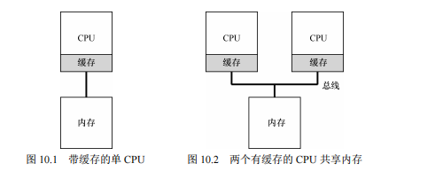

为了解决这个问题，现代系统使用了缓存一致性协议，例如总线窥探（bus snooping）。**这种协议让每个 CPU 的缓存监视连接所有缓存和内存的总线，确保每个 CPU 在访问数据时都能获得最新的值**。如果某个 CPU 修改了数据，其他 CPU 的缓存会使其本地副本无效或更新为新值。

这些机制保证了多处理器系统在并行运行时，数据的一致性和系统的稳定性。

### 10.2 别忘了同步

在多处理器系统中，即使硬件提供了缓存一致性，应用程序或操作系统仍然需要小心处理共享数据的访问，特别是在多个CPU上并发操作共享数据或数据结构时。为了保证数据的一致性和正确性，通常需要使用同步原语，如锁（mutex），来保护这些共享资源。

举例来说，假设多个CPU上的线程并发地访问一个共享链表（linked list），如果没有加锁，可能会导致多个线程同时修改链表，进而导致数据结构的损坏。具体表现为，一个线程在获取链表头的指针后，另一个线程也获取了同样的指针，导致两个线程试图删除同一个链表节点。这种情况下，程序可能会重复释放同一内存块，或返回错误的数据。

为了避免这种情况发生，程序应在访问和修改共享数据结构之前，先获取锁，从而确保只有一个线程能够执行这些操作。当操作完成后，再释放锁，允许其他线程继续操作。这种机制虽然能确保数据的正确性，但随着系统中CPU数量的增加，锁的争用可能会成为性能瓶颈。每次访问共享数据时获取和释放锁的操作都会增加系统开销，特别是在高并发环境下。


### 原文：

为了更具体，我们设想这样的代码序列，用于删除共享链表的一个元素，如图 10.3 所示。假设两个 CPU 上的不同线程同时进入这个函数。如果线程 1 执行第一行，会将 head 的当前值存入它的 tmp 变量。如果线程 2 接着也执行第一行，它也会将同样的 head 值存入它自己的私有 tmp 变量（tmp 在栈上分配，因此每个线程都有自己的私有存储）。因此，两个线程会尝试删除同一个链表头，而不是每个线程移除一个元素，这导致了各种问题（比如在第 4 行重复释放头元素，以及可能两次返回同一个数据）。

```C
// 定义链表节点的结构体
typedef struct __Node_t {
    int value;                  // 节点的值
    struct __Node_t *next;      // 指向下一个节点的指针
} Node_t;

// 弹出链表头节点的值并移除该节点
int List_Pop() {
    Node_t *tmp = head;         // 暂存当前头节点的指针，以便后续释放
    int value = head->value;    // 获取当前头节点的值
    head = head->next;          // 将头指针移动到下一个节点
    free(tmp);                  // 释放原头节点的内存
    return value;               // 返回原头节点的值
}

```

### 代码解释：

- **行 1-4**: 定义了一个名为 `Node_t` 的结构体类型，用于表示链表的节点。每个节点包含一个整数 `value` 和一个指向下一个节点的指针 `next`。
  - **行 2**: `int value;` 是存储在节点中的数据。
  - **行 3**: `struct __Node_t *next;` 是指向链表中下一个节点的指针。
- **行 6**: 定义了一个 `List_Pop()` 函数，用于从链表的头部弹出一个节点并返回其值。
- **行 7**: `Node_t *tmp = head;` 将当前头节点的指针存储在 `tmp` 变量中，以便稍后释放它的内存。
- **行 8**: `int value = head->value;` 获取当前头节点的值，这个值将在函数返回时返回。
- **行 9**: `head = head->next;` 将链表的头指针移动到下一个节点，意味着头节点被移除了。
- **行 10**: `free(tmp);` 释放掉原头节点的内存，防止内存泄漏。
- **行 11**: `return value;` 返回被移除节点的值。

这个函数的主要功能是从链表头部删除一个节点，并返回该节点存储的值，同时确保删除的节点的内存被正确释放。


当然，让这类函数正确工作的方法是加锁（locking）。这里只需要一个互斥锁（即pthread_mutex_t m;），然后在函数开始时调用 lock(&m)，在结束时调用 unlock(&m)，确保代码的执行如预期。我们会看到，这里依然有问题，尤其是性能方面。具体来说，随着 CPU数量的增加，访问同步共享的数据结构会变得很慢。


### 10.3 最后一个问题：缓存亲和度

多处理器调度中的另一个关键问题是缓存亲和度（cache affinity）。缓存亲和度指的是，当一个进程在某个CPU上运行一段时间后，其数据和指令会保留在该CPU的缓存中，这使得它在下次继续在同一CPU上运行时更快，因为数据已经在缓存中，无需重新从内存加载。

然而，如果该进程被调度到另一个CPU上运行，由于数据不在新CPU的缓存中，系统必须重新加载这些数据，导致性能下降。**因此，调度程序在设计时应该考虑尽量将进程调度到它上次运行的CPU上，以利用缓存亲和性。这种策略可以减少缓存未命中（cache miss）次数，提高系统整体性能。**

### 10.4 单队列调度

最基本的方式是简单地复用单处理器调度的基本架构，将所有需要调度的工作放入一个单独的队列中，我们称之为单队列多处理器调度（Single Queue Multiprocessor Scheduling，SQMS）。这个方法最大的优点是简单。它不需要太多修改，就可以将原有的策略用于多个 CPU，选择最适合的工作来运行（例如，如果有两个 CPU，它可能选择两个最合适的工作）。


在多处理器调度中，一种简单的方法是使用单队列多处理器调度（Single Queue Multiprocessor Scheduling，SQMS）。在这种方法中，所有需要调度的进程被放入一个全局的单一队列中，各个CPU从这个队列中取出任务执行。

#### 优点：

- **简单性**：SQMS 简单易实现，直接复用单处理器调度策略即可。在这种架构下，所有CPU都从一个全局队列中取任务，保证了系统的调度一致性。

#### 缺点：

1. **扩展性问题**：随着CPU数量增加，多个CPU并发访问全局队列，必然需要加锁以保证操作的原子性。锁的争用会随着CPU数量的增加而显著增加，导致系统在锁竞争上浪费大量时间，从而降低整体性能。
2. **缓存亲和性问题**：SQMS的一个重大缺点是难以保持缓存亲和性。由于每个CPU从全局队列中获取下一个任务，可能导致任务频繁在不同CPU之间切换，这会导致缓存数据的失效，进而增加缓存未命中次数，降低系统性能。

**原文：**

SQMS 的第二个主要问题是缓存亲和性。比如，假设我们有 5 个工作（A、B、C、D、E）和 4 个处理器。调度队列如下：


一段时间后，假设每个工作依次执行一个时间片，然后选择另一个工作，下面是每个CPU 可能的调度序列：

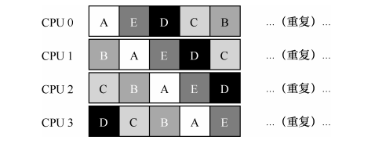

由于每个 CPU 都简单地从全局共享的队列中选取下一个工作执行，因此每个工作都不断在不同 CPU 之间转移，这与缓存亲和的目标背道而驰。为了解决这个问题，大多数 SQMS 调度程序都引入了一些亲和度机制，尽可能让进程在同一个 CPU 上运行。保持一些工作的亲和度的同时，可能需要牺牲其他工作的亲和度来实现负载均衡。例如，针对同样的 5 个工作的调度如下：

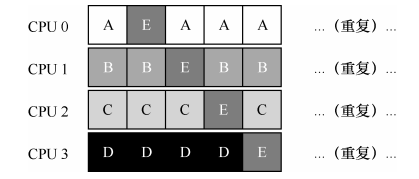

这种调度中，A、B、C、D 这 4 个工作都保持在同一个 CPU 上，只有工作 E 不断地来回迁移（migrating），从而尽可能多地获得缓存亲和度。为了公平起见，之后我们可以选择不同的工作来迁移。但实现这种策略可能很复杂。我们看到，SQMS 调度方式有优势也有不足。优势是能够从单 CPU 调度程序很简单地发展而来，根据定义，它只有一个队列。然而，它的扩展性不好（由于同步开销有限），并且不能很好地保证缓存亲和度。


**为了缓解缓存亲和性问题，SQMS调度程序可以引入一些机制，使进程尽量在同一CPU上运行。然而，这种机制可能导致部分进程在负载不均衡的情况下不得不迁移，破坏缓存亲和性。**这种负载均衡与缓存亲和性的矛盾是SQMS的一个典型问题。

### 10.5 多队列调度

由于单队列调度程序（SQMS）在多处理器环境中存在扩展性和缓存亲和度的问题，另一个解决方案被提出，即多队列多处理器调度（Multi-Queue Multiprocessor Scheduling，MQMS）。在MQMS中，每个CPU拥有一个独立的调度队列，各个CPU可以根据不同的调度规则（如轮转调度或其他算法）独立地选择要运行的任务。

**原文：**

例如，假设系统中有两个 CPU（CPU 0 和 CPU 1）。这时一些工作进入系统：A、B、C和 D。由于每个 CPU 都有自己的调度队列，操作系统需要决定每个工作放入哪个队列。可能像下面这样做：

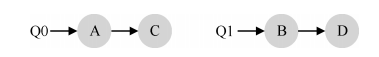

根据不同队列的调度策略，每个 CPU 从两个工作中选择，决定谁将运行。例如，利用轮转，调度结果可能如下所示：

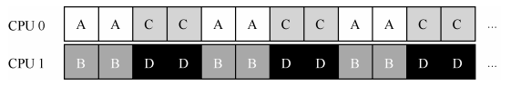

MQMS 比 SQMS 有明显的优势，它天生更具有可扩展性。队列的数量会随着 CPU 的增加而增加，因此锁和缓存争用的开销不是大问题。此外，MQMS 天生具有良好的缓存亲和度。所有工作都保持在固定的 CPU 上，因而可以很好地利用缓存数据。

但是，如果稍加注意，你可能会发现有一个新问题（这在多队列的方法中是根本的），即负载不均（load imbalance）。假定和上面设定一样（4 个工作，2 个 CPU），但假设一个工作（如 C）这时执行完毕。现在调度队列如下：

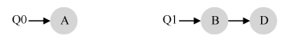

如果对系统中每个队列都执行轮转调度策略，会获得如下调度结果：

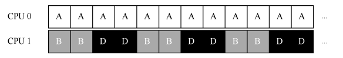

从图中可以看出，A 获得了 B 和 D 两倍的 CPU 时间，这不是期望的结果。更糟的是，假设 A 和 C 都执行完毕，系统中只有 B 和 D。调度队列看起来如下：

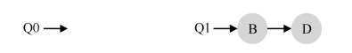

因此 CPU 使用时间线看起来令人难过：

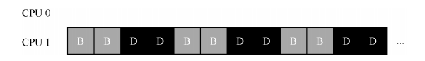

所以可怜的多队列多处理器调度程序应该怎么办呢？怎样才能克服潜伏的负载不均问题，打败邪恶的……霸天虎军团？如何才能不要问这些与这本好书几乎无关的问题？


#### 优点：

- **扩展性强**：由于每个CPU都有独立的调度队列，各CPU之间的调度是相互独立的，不需要对单一队列进行加锁，因此减少了锁的争用问题，极大地提高了系统的可扩展性。
- **缓存亲和度好**：在MQMS中，任务一般会被分配到固定的CPU上运行，因此这些任务可以很好地利用该CPU的缓存，从而提高执行效率。

#### 缺点：

- **负载不均**：MQMS中，每个CPU只从自己的队列中选择任务运行，这可能导致某些CPU的负载很重，而另一些CPU的负载较轻，从而出现负载不均的问题。例如，当某个任务（如任务C）完成后，如果其他队列中的任务没有迁移到这个CPU上，该CPU可能会闲置，而其他CPU可能因任务过多而负载过重。


#### 负载均衡的解决方案：

为了解决负载不均的问题，MQMS可以使用任务迁移（migration）技术。任务迁移的基本思想是，将任务从负载较重的CPU队列中移到负载较轻的CPU上，以实现负载均衡。

- **工作窃取（work stealing）**：工作窃取是一种常用的负载均衡策略，其中负载较轻的CPU会定期检查其他CPU的队列，并“窃取”任务以平衡负载。这种方法的优点是能够动态平衡负载，避免某些CPU过度闲置。然而，如果检查间隔设置不当，可能导致负载不均持续存在或频繁的任务迁移带来的额外开销。

**原文：**

**关键问题：如何应对负载不均**

**多队列多处理器调度程序应该如何处理负载不均问题，从而更好地实现预期的调度目标？**


最明显的答案是让工作移动，这种技术我们称为迁移（migration）。通过工作的跨 CPU迁移，可以真正实现负载均衡。

来看两个例子就更清楚了。同样，有一个 CPU 空闲，另一个 CPU 有一些工作。


在这种情况下，期望的迁移很容易理解：操作系统应该将 B 或 D 迁移到 CPU0。这次工作迁移导致负载均衡，皆大欢喜。

更棘手的情况是较早一些的例子，A 独自留在 CPU 0 上，B 和 D 在 CPU 1 上交替运行。

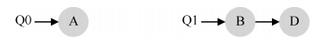

在这种情况下，单次迁移并不能解决问题。应该怎么做呢？答案是不断地迁移一个或多个工作。一种可能的解决方案是不断切换工作，如下面的时间线所示。可以看到，开始的时候 A 独享 CPU 0，B 和 D 在 CPU 1。一些时间片后，B 迁移到 CPU 0 与 A 竞争，D 则独享 CPU 1 一段时间。这样就实现了负载均衡。

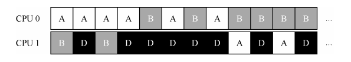

当然，还有其他不同的迁移模式。但现在是最棘手的部分：系统如何决定发起这样的迁移？一个基本的方法是采用一种技术，名为工作窃取（work stealing）[FLR98]。通过这种方法，工作量较少的（源）队列不定期地“偷看”其他（目标）队列是不是比自己的工作多。如果目标队列比源队列（显著地）更满，就从目标队列“窃取”一个或多个工作，实现负载均衡。当然，这种方法也有让人抓狂的地方——如果太频繁地检查其他队列，就会带来较高的开销，可扩展性不好，而这是多队列调度最初的全部目标！相反，如果检查间隔太长，又可能会带来严重的负载不均。找到合适的阈值仍然是黑魔法，这在系统策略设计中很常见。


### 总结：

多队列多处理器调度（MQMS）通过将任务分配到多个队列，从而提高了调度程序的扩展性和缓存亲和度。然而，负载均衡问题仍然是MQMS的一个主要挑战，需要通过任务迁移等技术来解决。选择合适的负载均衡策略（如工作窃取）至关重要，因为这会直接影响系统的整体性能。

### 10.6 Linux 多处理器调度

在实现多处理器调度方面，Linux 社区采用了多种不同的方法，主要有以下三种调度程序：

1. **O(1) 调度程序**：
   - **特点**：O(1)调度程序是一种基于优先级的调度算法，类似于之前讨论的多级反馈队列（MLFQ）。它通过时间推移来动态调整进程的优先级，以实现各种调度目标，特别是关注交互性。它的名称“O(1)”表明在任何时刻都可以在常数时间内做出调度决定。
   - **多队列架构**：O(1)调度程序采用了多队列架构，每个队列代表一个优先级，并且队列之间相互独立。
2. **完全公平调度程序（CFS）**：
   - **特点**：CFS 是一种基于公平性原则的比例份额调度方法，类似于步长调度。CFS 试图在所有任务之间公平地分配 CPU 时间，使用红黑树（红黑树是一种自平衡二叉搜索树）来管理任务，使调度决策可以在对数时间内完成。
   - **多队列架构**：CFS 也采用了多队列架构，不同的 CPU 可以独立进行调度决策。
3. **BFS（Brain Fuck Scheduler）**：
   - **特点**：BFS 主要针对桌面系统的交互性进行了优化，是一种简单但高效的调度算法。与 O(1) 和 CFS 不同，BFS 使用了单队列调度，这意味着所有任务共享一个全局队列。
   - **调度策略**：BFS 采用了最早最合适虚拟截止时间优先算法（EEVEF），这是一个更加复杂的调度方案，旨在为高响应性提供保障。

### 10.7 小结

本章探讨了多处理器调度的不同方法。关键在于如何在多个 CPU 上调度工作，以及如何在负载均衡和缓存亲和度之间找到平衡点。

- **单队列多处理器调度（SQMS）**：简单易实现，适合负载较小的系统，但在扩展性和缓存亲和度方面存在缺陷。
- **多队列多处理器调度（MQMS）**：通过为每个 CPU 分配独立的调度队列，提高了系统的扩展性和缓存亲和度，但可能导致负载不均，需要通过任务迁移（如工作窃取）来实现负载均衡。

Linux 的多处理器调度实现展示了不同方法的应用，其中 O(1) 和 CFS 使用了多队列架构，而 BFS 选择了单队列架构，每种方法都有其独特的优缺点。构建一个通用的多处理器调度程序是一项艰巨的任务，因为即使是微小的代码改动，也可能对系统的整体性能产生重大影响。