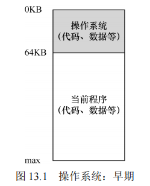
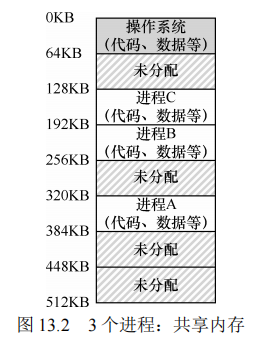
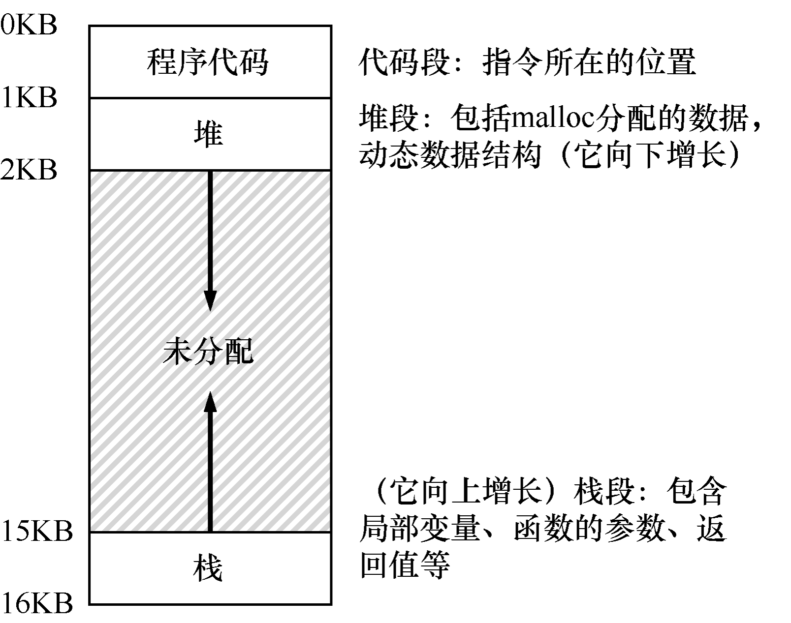

### 第十三章 抽象：地址空间

**引言** 在操作系统发展的早期，系统的设计和实现相对简单，主要是因为用户的需求非常有限。当时的用户对操作系统的期望并不高，开发者只需要满足基本的功能。然而，随着用户需求的增加，尤其是对“易用性”“高性能”和“可靠性”的需求，这使得操作系统的开发变得更加复杂。可以说，正是这些用户的新需求促使了操作系统的不断演进，同时也带来了许多开发中的挑战。

#### 13.1 早期系统

最早的计算机系统中，用户几乎没有任何内存抽象。操作系统只是一组函数，通常作为一个库加载在内存中，从物理地址0（在本例中，从物理地址 64KB 开始）开始。随后，程序（即进程）会被加载到内存的其他部分，占据剩余的物理内存空间。在这个阶段，操作系统的功能非常简单，用户对它的要求也不高。**开发者不需要考虑复杂的内存管理问题，只需要简单地将程序和操作系统加载到物理内存中即可**。这种简化的模型使得早期操作系统的开发相对容易。



#### 13.2 多道程序和时分共享

随着计算机硬件价格的上升，人们开始寻求更高效的资源利用方式。多道程序系统应运而生，这种系统允许多个进程在同一时间段内准备运行。**当一个进程等待I/O操作时，操作系统可以切换到另一个进程执行，以此来提高CPU的利用率。**这种方式在当时尤为重要，因为计算机的成本非常高，资源的有效利用能够显著降低运营成本。

然而，随着多道程序系统的发展，用户对系统的要求进一步增加。尤其是分时系统的出现，标志着计算机从批量计算向更具交互性的系统过渡。**分时系统允许多个用户同时使用计算机，每个用户都希望能够及时得到响应**。**为了实现这一目标，操作系统必须有效地管理多个进程的调度和内存使用。**

在早期的分时系统中，操作系统会**让一个进程独占全部内存运行一小段时间，然后保存该进程的状态信息，将其暂停，接着切换到下一个进程运行**。然而，这种方法效率较低，尤其是在内存较大时，保存和恢复整个内存状态的操作非常耗时。

为了提高效率，**操作系统引入了多进程并发驻留内存的技术，使得多个进程可以同时在内存中保留，从而减少了进程切换的时间开销**。随着这种方法的普及，内存保护问题也变得越来越重要。操作系统需要确保一个进程不能访问或修改其他进程的内存，防止程序间的相互干扰。


**原文：**

一种实现时分共享的方法，是让一个进程单独占用全部内存运行一小段时间（见图13.1），然后停止它，并将它所有的状态信息保存在磁盘上（包含所有的物理内存），加载其他进程的状态信息，再运行一段时间，这就实现了某种比较粗糙的机器共享[M+63]。

遗憾的是，这种方法有一个问题：太慢了，特别是当内存增长的时候。虽然保存和恢复寄存器级的状态信息（程序计数器、通用寄存器等）相对较快，但将全部的内存信息保存到磁盘就太慢了。因此，在进程切换的时候，我们仍然将进程信息放在内存中，这样操作系统可以更有效率地实现时分共享（见图 13.2）。

在图 13.2 中，有 3 个进程（A、B、C），每个进程拥有从512KB 物理内存中切出来给它们的一小部分内存。假定只有一个 CPU，操作系统选择运行其中一个进程（比如 A），同时其他进程（B 和 C）则在队列中等待运行。

随着时分共享变得更流行，人们对操作系统又有了新的要求。特别是多个程序同时驻留在内存中，使保护（protection）成为重要问题。人们不希望一个进程可以读取其他进程的内存，更别说修改了。




#### 13.3 地址空间

​		为了应对用户对操作系统提出的新要求，开发者引入了地址空间的概念。地址空间是操作系统提供给程序的一种抽象表示，它包含了程序运行所需的所有内存状态，包括代码段、栈和堆。代码段包含程序的指令，栈用于保存函数调用信息和局部变量，而堆则管理动态分配的内存。

​		地址空间的一个关键特性是其动态性：栈和堆可以随着程序的运行而增长或收缩。通过将栈和堆放在地址空间的两端，操作系统允许它们朝相反方向增长，最大化地利用内存空间。然而，地址空间只是一个抽象概念，实际上程序的内存分配并非直接映射到物理内存中。**操作系统通过内存虚拟化技术，将程序的虚拟地址转换为物理地址，从而实现每个进程独立且私有的内存空间。**这种虚拟化技术使得多个进程可以共享物理内存，同时又保持彼此独立，这是现代计算机系统的基础。

​		**隔离原则** 在操作系统设计中，隔离是确保系统可靠性的关键原则之一。**通过内存隔离，操作系统可以保证不同的进程相互独立，一个进程的错误不会影响其他进程或整个系统的稳定性。**进一步的隔离可以通过微内核架构实现，**微内核将操作系统的功能模块分离，提升了系统的可靠性和安全性。**


**原文：**

​		然而，我们必须将这些烦人的用户的需求放在心上。因此操作系统需要提供一个易用（easy to use）的物理内存抽象。这个抽象叫作地址空间（address space），是运行的程序看到的系统中的内存。理解这个基本的操作系统内存抽象，是了解内存虚拟化的关键。

​		一个进程的地址空间包含运行的程序的所有内存状态。比如：程序的代码（code，指令）必须在内存中，因此它们在地址空间里。当程序在运行的时候，利用栈（stack）来保存当前的函数调用信息，分配空间给局部变量，传递参数和函数返回值。最后，堆（heap）用于管理动态分配的、用户管理的内存，就像你从 C 语言中调用 malloc()或面向对象语言（如 C ++或 Java）中调用 new 获得内存。当然，还有其他的东西（例如，静态初始化的变量），但现在假设只有这 3 个部分：代码、栈和堆。

​		在图 13.3 的例子中，我们有一个很小的地址空间① （只有 16KB）。程序代码位于地址空间的顶部（在本例中从 0 开始，并且装入到地址空间的前 1KB）。代码是静态的（因此很容易放在内存中），所以可以将它放在地址空间的顶部，我们知道程序运行时不再需要新的空间。



​		接下来，在程序运行时，地址空间有两个区域可能增长（或者收缩）。它们就是堆（在顶部）和栈（在底部）。把它们放在那里，是因为它们都希望能够增长。通过将它们放在地址空间的两端，我们可以允许这样的增长：**它们只需要在相反的方向增长**。因此堆在代码（1KB）之下开始并向下增长（当用户通过 malloc()请求更多内存时），栈从 16KB 开始并向上增长

​		（当用户进行程序调用时）。然而，堆栈和堆的这种放置方法只是一种约定，如果你愿意，可以用不同的方式安排地址空间 [稍后我们会看到，当多个线程（threads）在地址空间中共存时，就没有像这样分配空间的好办法了]。当然，当我们描述地址空间时，所描述的是操作系统提供给运行程序的抽象（abstract）。程序不在物理地址 0～16KB 的内存中，而是加载在任意的物理地址。回顾图 13.2 中的进程A、B 和 C，你可以看到每个进程如何加载到内存中的不同地址。因此问题来了：

**关键问题：如何虚拟化内存**

**操作系统如何在单一的物理内存上为多个运行的进程（所有进程共享内存）构建一个私有的、可能很大的地址空间的抽象？**

​		当操作系统这样做时，我们说操作系统在虚拟化内存（virtualizing memory），因为运行的程序认为它被加载到特定地址（例如 0）的内存中，并且具有非常大的地址空间（例如32 位或 64 位）。现实很不一样。

​		例如，当图 13.2 中的进程 A 尝试在地址 0（我们将称其为虚拟地址，virtual address）执行加载操作时，然而操作系统在硬件的支持下，**出于某种原因，必须确保不是加载到物理地址 0，而是物理地址 320KB**（这是 A 载入内存的地址）。**这是内存虚拟化的关键，这是世界上每一个现代计算机系统的基础。**


**提示：隔离原则**

**隔离是建立可靠系统的关键原则。如果两个实体相互隔离，这意味着一个实体的失败不会影响另一个实体。操作系统力求让进程彼此隔离，从而防止相互造成伤害。==通过内存隔离，操作系统进一步确保运行程序不会影响底层操作系统的操作。==一些现代操作系统通过将某些部分与操作系统的其他部分分离，实现进一步的隔离。这样的微内核（microkernel）[BH70，R+89，S+03] 可以比整体内核提供更大的可靠性。**


### 13.4 目标

在这一节中，讨论了操作系统的主要任务之一——内存虚拟化。内存虚拟化不仅仅是提供内存抽象，还需要实现一定的系统目标，以确保内存虚拟化的效果。这些目标包括透明性、效率和保护。

**透明性（Transparency）** 虚拟内存系统的首要目标是透明性。==操作系统需要通过虚拟内存机制，使得运行中的程序看不出内存被虚拟化的事实。==也就是说，程序应当认为自己拥有一块私有的、连续的物理内存，而不会意识到这实际上是通过操作系统和硬件的共同努力，实现了多个程序共享物理内存的假象。这种透明性让程序的运行逻辑更加简化，因为它们不必处理复杂的内存管理问题。

**效率（Efficiency）** 另一个关键目标是效率。操作系统在实现虚拟内存时，==必须确保系统的时间和空间效率。这意味着虚拟内存系统不应显著减慢程序的运行速度，同时也不能占用过多的物理内存资源来支持虚拟化。==在这个过程中，操作系统通常需要依赖硬件支持，如TLB（Translation Lookaside Buffer）等功能，以提高内存访问的效率。

**保护（Protection）** 保护是虚拟内存系统的第三个目标。==操作系统必须确保每个进程的内存区域是独立且受到保护的，一个进程不能访问或修改其他进程的内存内容，也不能干扰操作系统的运行。==通过这种保护机制，操作系统实现了进程间的隔离，使得每个进程都能够在独立的环境中安全运行，不受其他进程或恶意程序的影响。

**补充：虚拟地址** 在操作系统的虚拟内存体系中，程序员接触到的所有地址实际上都是虚拟地址。**这些虚拟地址为程序提供了一种地址分布的假象，而实际的物理地址只有操作系统和硬件才能知道**。举个例子，当你在C程序中打印一个指针的地址时，你看到的是虚拟地址，而操作系统会将这些虚拟地址翻译成物理地址，以便从实际的物理内存中获取数据。

**代码示例** 以下是一个简单的C程序示例，它分别打印了main函数的代码地址、通过malloc分配的堆空间地址，以及栈上一个整数的地址：

```c
#include <stdio.h> 
#include <stdlib.h> 
int main(int argc, char *argv[]) { 
    printf("location of code : %p\n", (void *) main); 
    printf("location of heap : %p\n", (void *) malloc(1)); 
    int x = 3; 
    printf("location of stack : %p\n", (void *) &x); 
    return x; 
}
```

在64位的Mac上运行这个程序时，输出显示代码、堆和栈分别位于不同的虚拟地址空间内，这些地址都是虚拟的。操作系统通过将这些虚拟地址映射到物理地址，确保程序的正常运行。

```
location of code : 0x1095afe50 
location of heap : 0x1096008c0 
location of stack : 0x7fff691aea64
```

**展望** 在接下来的章节中，将重点探讨虚拟内存系统的基本机制（如硬件和操作系统的支持），以及相关策略（如如何管理内存和页面置换）。通过深入理解这些内容，可以全面掌握现代虚拟内存系统的运作原理。

**原文：**

补充：你看到的所有地址都不是真的

写过打印出指针的 C 程序吗？你看到的值（一些大数字，通常以十六进制打印）是虚拟地址（virtual address）。有没有想过你的程序代码在哪里找到？你也可以打印出来，是的，如果你可以打印它，它也是一个虚拟地址。实际上，作为用户级程序的程序员，可以看到的任何地址都是虚拟地址。只有操作系统，通过精妙的虚拟化内存技术，知道这些指令和数据所在的物理内存的位置。所以永远不要忘记：如果你在一个程序中打印出一个地址，那就是一个虚拟的地址。虚拟地址只是提供地址如何在内存中分布的假象，只有操作系统（和硬件）才知道物理地址。

这里有一个小程序，打印出 main() 函数（代码所在地方）的地址，由 malloc()返回的堆空间分配的值，以及栈上一个整数的地址：

```C
#include <stdio.h> 
#include <stdlib.h> 
int main(int argc, char *argv[]) { 
    printf("location of code : %p\n", (void *) main); 
    printf("location of heap : %p\n", (void *) malloc(1)); 
    int x = 3; 
    printf("location of stack : %p\n", (void *) &x); 
    return x; 
}
```

在 64 位的 Mac 上面运行时，我们得到以下输出：

location of code : 0x1095afe50 

location of heap : 0x1096008c0 

location of stack : 0x7fff691aea64 

从这里，你可以看到代码在地址空间开头，然后是堆，而栈在这个大型虚拟地址空间的另一端。所有

这些地址都是虚拟的，并且将由操作系统和硬件翻译成物理地址，以便从真实的物理位置获取该地址的值。


### 13.5 小结

这一章介绍了操作系统中的一个关键子系统：虚拟内存。==虚拟内存系统为程序提供了一个巨大的、稀疏的、私有的地址空间的假象，程序的所有指令和数据都在其中存储。==操作系统在硬件的协助下，通过将虚拟地址转换为物理地址，获取所需的物理内存内容。**为了实现这一目标，操作系统需要使用大量的底层机制，并依靠关键的策略，确保多个进程同时运行时，彼此之间不互相干扰，也不影响操作系统本身的稳定性**。接下来的章节将自底向上地描述这些关键机制。