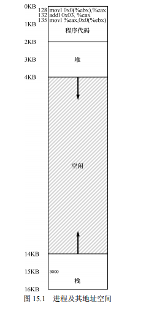
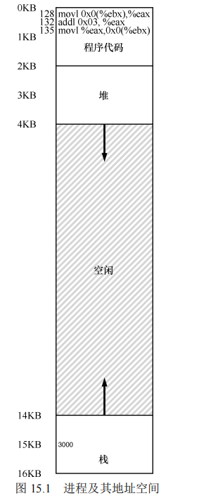
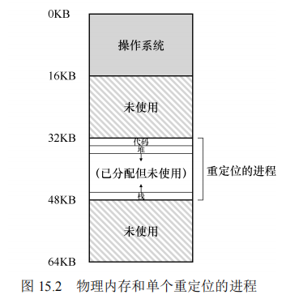
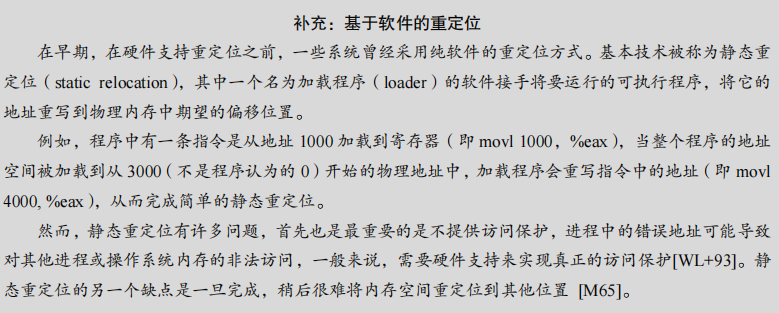
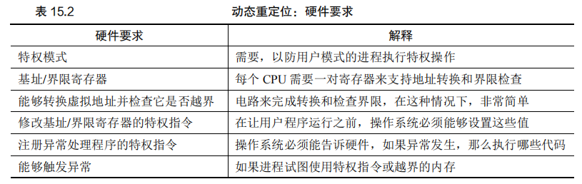
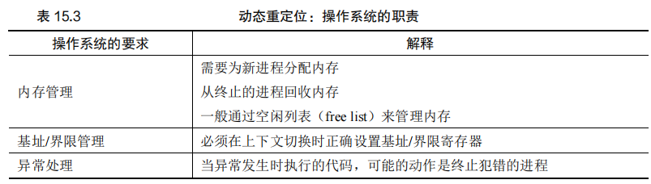
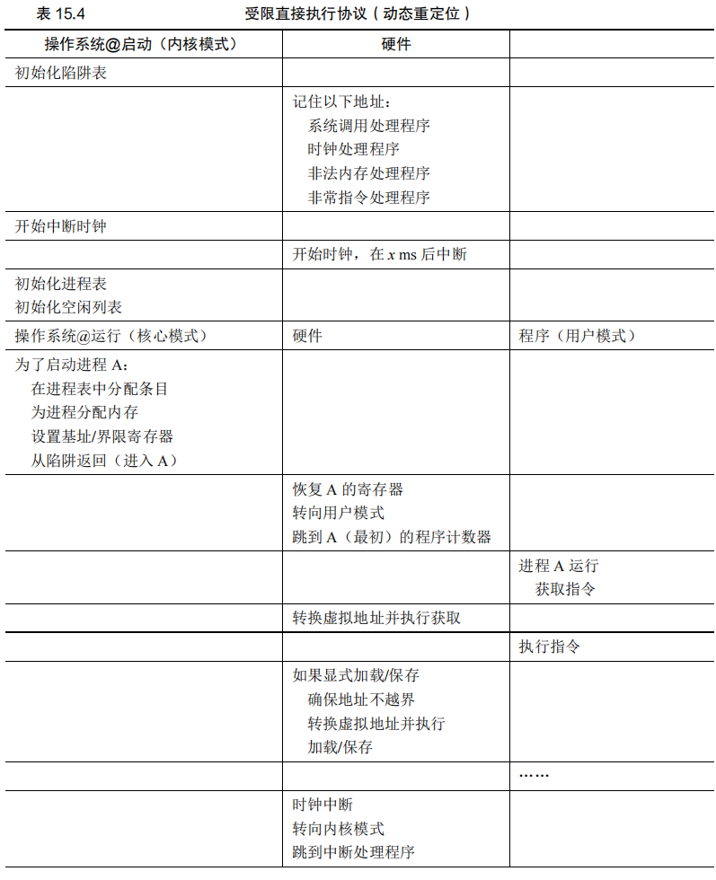
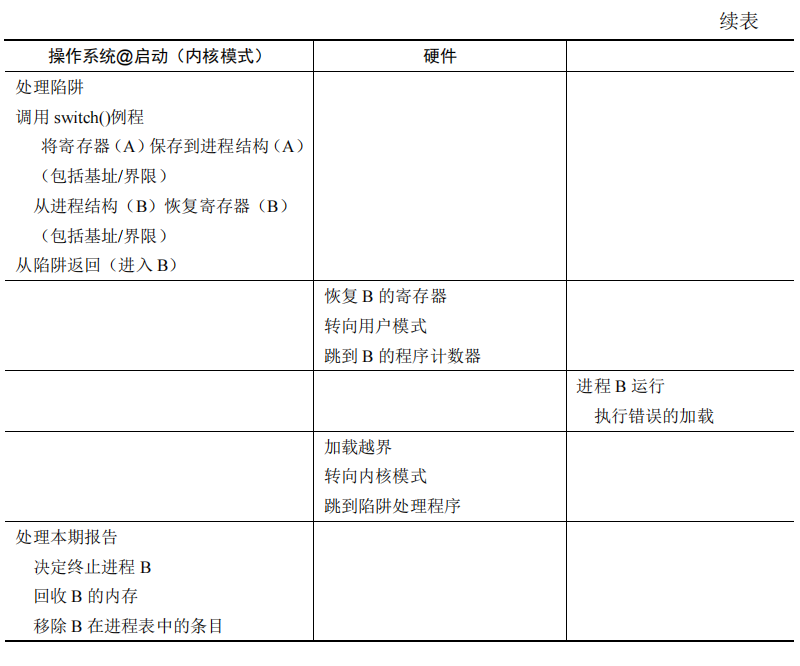

## 第十五章 机制：地址转换

在本章中，我们讨论了操作系统如何通过地址转换实现内存虚拟化，从而在保持系统高效和灵活的同时，确保对内存的控制。

#### 原文：

​		在实现 CPU 虚拟化时，==我们遵循的一般准则被称为**受限直接访问**（Limited Direct Execution，LDE）。LDE 背后的想法很简单：让程序运行的大部分指令直接访问硬件，只在一些关键点（如进程发起系统调用或发生时钟中断）由操作系统介入来确保“在正确时间，正确的地点，做正确的事”。==为了实现高效的虚拟化，操作系统应该尽量让程序自己运行，同时通过在关键点的及时介入（interposing），来保持对硬件的控制。==高效和控制是现代操作系统的两个主要目标。==

​		在实现虚拟内存时，我们将追求类似的战略，在实现高效和控制的同时，提供期望的虚拟化。高效决定了我们要利用硬件的支持，==这在开始的时候非常初级（如使用一些寄存器），但会变得相当复杂（比如我们会讲到的 TLB、页表等）==。控制意味着操作系统要确保应用程序只能访问它自己的内存空间。因此，要保护应用程序不会相互影响，也不会影响操作系统，我们需要硬件的帮助。最后，我们对虚拟内存还有一点要求，即灵活性。具体来说，我们希望程序能以任何方式访问它自己的地址空间，从而让系统更容易编程。所以，关键问题在于：


​		===我们利用了一种通用技术，有时被称为基于硬件的地址转换（hardware-based address translation），简称为地址转换（address translation）。==它可以看成是受限直接执行这种一般方法的补充。利用地址转换，硬件对每次内存访问进行处理（即指令获取、数据读取或写入），将指令中的虚拟（virtual）地址转换为数据实际存储的物理（physical）地址。==因此，在每次内存引用时，硬件都会进行地址转换，将应用程序的内存引用重定位到内存中实际的位置。==

​		当然，仅仅依靠硬件不足以实现虚拟内存，因为它只是提供了底层机制来提高效率。操作系统必须在关键的位置介入，设置好硬件，以便完成正确的地址转换。==因此它必须管理内存（manage memory），记录被占用和空闲的内存位置，并明智而谨慎地介入，保持对内存使用的控制。==

​		同样，所有这些工作都是为了创造一种美丽的假象：每个程序都拥有私有的内存，那里存放着它自己的代码和数据。虚拟现实的背后是丑陋的物理事实：==许多程序其实是在同一时间共享着内存，就像 CPU（或多个 CPU）在不同的程序间切换运行。==通过虚拟化，操作系统（在硬件的帮助下）将丑陋的机器现实转化成一种有用的、强大的、易于使用的抽象。


==gb:CPU虚拟化的底层是受限直接执行，然后采取许多进程调度策略，著名的如多级反馈队列，后面也介绍多队列。现在再到内存的虚拟化，底层主要是基于硬件的地址转化，也是基于受限直接执行。程序中的虚拟地址每次在内存使用时都会转换成实际物理地址，产生虚拟化的假象。==

### 15.1 假设

​		实现CPU虚拟化的一般准则被称为**受限直接访问（Limited Direct Execution, LDE）**。**这一原则的核心思想是让程序直接访问硬件，但在关键时刻（如系统调用或时钟中断）由操作系统介入，确保系统按预期运行**。操作系统的目标是在实现高效虚拟化的同时，保持对硬件的控制。

​		在实现内存虚拟化时，操作系统采用了类似的策略：通过硬件支持，实现高效的地址转换，同时确保操作系统对内存的控制。==**操作系统必须管理内存，记录被占用和空闲的内存位置，并通过硬件介入来实现对内存访问的控制**。最终目标是为每个程序提供一个虚拟的私有内存空间，尽管在物理上多个程序共享相同的内存资源。==

### 15.2 一个例子

​		为了更好地理解地址转换，我们来看一个简单的例子。假设一个进程的地址空间如图15.1所示。



​		我们关注的是一小段代码，它从内存中加载一个值，对其加3，然后将结果存回内存。

​		这段代码在C语言中的形式如下：

```c
void func() { 
 int x; 
 x = x + 3; // 这是我们感兴趣的代码行 
}
```

​		编译器将这段代码转化为汇编指令，可能如下所示（假设x86架构）：

```shell
128: movl 0x0(%ebx), %eax  ; 将ebx寄存器指向的内存内容加载到eax寄存器
132: addl $0x03, %eax      ; 将eax寄存器中的值加3
135: movl %eax, 0x0(%ebx)  ; 将eax寄存器中的值存回到ebx指向的内存
```

​		在这段代码中，变量`x`的地址被存储在寄存器`ebx`中，`movl`指令将该地址的内容加载到寄存器`eax`中，然后对`eax`中的值加3，最后将结果存回内存。

​		从程序的角度来看，它的地址空间从0开始，到16KB结束。程序中的所有内存引用都应当在这个范围内。**然而，操作系统实际上希望将进程的地址空间放置在物理内存中的其他位置，而不是从地址0开始。**

#### 原文：

​		为了更好地理解实现地址转换需要什么，以及为什么需要，我们先来看一个简单的例子。设想一个进程的地址空间如图 15.1 所示。这里我们要检查一小段代码，它从内存中加载一个值，对它加 3，然后将它存回内存。你可以设想，这段代码的 C 语言形式可能像这样：

```C
void func() { 
 int x; 
 x = x + 3; // this is the line of code we are interested in
```

​		编译器将这行代码转化为汇编语句，可能像下面这样（x86 汇编）。我们可以用 Linux的 objdump 或者 Mac 的 otool 将它反汇编：

```C
128: movl 0x0(%ebx), %eax ;load 0+ebx into eax 
132: addl $0x03, %eax ;add 3 to eax register 
135: movl %eax, 0x0(%ebx) ;store eax back to mem
```

​		这段代码相对简单，它假定 *x* 的地址已经存入寄存器 ebx，之后通过 movl 指令将这个地址的值加载到通用寄存器 eax（长字移动）。下一条指令对 eax 的内容加 3。最后一条指令将 eax 中的值写回到内存的同一位置。


​		在图 15.1 中，可以看到代码和数据都位于进程的地址空间，3 条指令序列位于地址 128（靠近头部的代码段），变量 *x* 的值位于地址 15KB（在靠近底部的栈中）。如图 15.1 所示，*x*的初始值是 3000。



如果这 3 条指令执行，从进程的角度来看，发生了以下几次内存访问：

- 从地址 128 获取指令；

- 执行指令（从地址 15KB 加载数据）；

- 从地址 132 获取命令；

- 执行命令（没有内存访问）；

- 从地址 135 获取指令；

- 执行指令（新值存入地址 15KB）。

​		从程序的角度来看，它的地址空间（address space）从 0 开始到 16KB 结束。它包含的所有内存引用都应该在这个范围内。然而，**对虚拟内存来说，操作系统希望将这个进程地址空间放在物理内存的其他位置**，并不一定从地址 0 开始。==因此我们遇到了如下问题：怎样在内存中重定位这个进程，同时对该进程透明（transparent）？怎么样提供一种虚拟地址空间从 0 开始的假象，而实际上地址空间位于另外某个物理地址？==

​		图 15.2 展示了一个例子，说明这个进程的地址空间被放入物理内存后可能的样子。从图 15.2 中可以看到，操作系统将第一块物理内存留给了自己，并将上述例子中的进程地址空间重定位到从 32KB 开始的物理内存地址。剩下的两块内存空闲（16～32KB 和 48～64KB）。




### 15.3 动态（基于硬件）重定位

​		在内存虚拟化的早期实现中，引入了一种简单而有效的技术，称为**基址加界限机制**（Base and Bound Mechanism），也称为**动态重定位**（Dynamic Relocation）。这种技术首次应用于20世纪50年代末的时分机器中。

#### 基址加界限机制

​		该机制依赖于两个硬件寄存器：**基址寄存器（Base Register）** 和 **界限寄存器（Bound Register）**，也称为**限制寄存器（Limit Register）**。这两个寄存器共同作用，使得程序的地址空间可以被放置在物理内存的任意位置，并且保证进程只能访问其自身的地址空间。

​		**地址转换** 在编写和编译程序时，程序的地址空间被假设从零开始。但在程序执行时，操作系统会决定程序实际加载到物理内存中的位置，并将其起始地址存入基址寄存器。例如，如果操作系统决定将进程加载到物理内存的32KB处，则基址寄存器被设置为32KB。在运行时，每当进程发出内存访问请求，硬件会将虚拟地址加上基址寄存器中的值，以生成对应的物理地址：

```
physical address = virtual address + base
```

**补充：基于软件的重定位**

​		**在早期，在硬件支持重定位之前，一些系统曾经采用纯软件的重定位方式。基本技术被称为静态重定位（static relocation），其中一个名为加载程序（loader）的软件接手将要运行的可执行程序，将它的地址重写到物理内存中期望的偏移位置。** 

​		**例如，程序中有一条指令是从地址 1000 加载到寄存器（即 movl 1000，%eax），当整个程序的地址空间被加载到从 3000（不是程序认为的 0）开始的物理地址中，加载程序会重写指令中的地址（即 movl 4000, %eax），从而完成简单的静态重定位。**

​		**然而，静态重定位有许多问题，首先也是最重要的是不提供访问保护，进程中的错误地址可能导致对其他进程或操作系统内存的非法访问，一般来说，需要硬件支持来实现真正的访问保护[WL+93]。静态重定位的另一个缺点是一旦完成，稍后很难将内存空间重定位到其他位置 [M65]。**


#### 原文：

​		为了更好地理解基于硬件的地址转换，我们先来讨论它的第一次应用。在 20 世纪 50年代后期，它在首次出现的时分机器中引入，那时只是一个简单的思想，称为**基址加界限机制（base and bound）**，有时又称为**动态重定位（dynamic relocation）**，我们将互换使用这两个术语[SS74]。

​		具体来说，每个 CPU 需要两个硬件寄存器：==基址（base）寄存器和界限（bound）寄存器，有时称为限制（limit）寄存器。这组基址和界限寄存器，让我们能够将地址空间放在物理内存的任何位置，同时又能确保进程只能访问自己的地址空间。==

​		采用这种方式，在编写和编译程序时假设地址空间从零开始。但是，当程序真正执行时，操作系统会决定其在物理内存中的实际加载地址，并将起始地址记录在基址寄存器中。在上面的例子中，操作系统决定加载在物理地址 32KB 的进程，因此将基址寄存器设置为这个值。

​		当进程运行时，有趣的事情发生了。现在，该进程产生的所有内存引用，都会被处理器通过以下方式转换为物理地址：

```
physical address = virtual address + base
```




​		==进程中使用的内存引用都是虚拟地址（virtual address），硬件接下来将虚拟地址加上基址寄存器中的内容，得到物理地址（physical address），再发给内存系统。==

​		为了更好地理解，让我们追踪一条指令执行的情况。具体来看前面序列中的一条指令：

```
128: movl 0x0(%ebx), %eax 
```

​		程序计数器（PC）首先被设置为 128。当硬件需要获取这条指令时，它先将这个值加上基址寄存器中的 32KB(32768)，得到实际的物理地址 32896，然后硬件从这个物理地址获取指令。接下来，处理器开始执行该指令。这时，进程发起从虚拟地址 15KB 的加载，处理器同样将虚拟地址加上基址寄存器内容（32KB），得到最终的物理地址 47KB，从而获得需要的数据。

​		将虚拟地址转换为物理地址，这正是所谓的地址转换（address translation）技术。==也就是说，硬件取得进程认为它要访问的地址，将它转换成数据实际位于的物理地址。由于这种重定位是在运行时发生的，而且我们甚至可以在进程开始运行后改变其地址空间，这种技术一般被称为动态重定位（dynamic relocation）[M65]。==


​		**静态重定位** 在硬件支持动态重定位之前，一些系统采用了纯软件的静态重定位技术。加载程序（Loader）负责将可执行程序的地址重写到物理内存中的期望位置。虽然静态重定位可以实现基本的地址映射，但它无法提供有效的访问保护，并且一旦程序开始运行，难以重新定位内存。


#### 动态重定位的实现

​		在动态重定位过程中，每次内存访问都会通过硬件进行地址转换。例如，当程序计数器（PC）设置为128时，硬件会将其加上基址寄存器中的值（如32KB），得到物理地址32896，然后从该物理地址获取指令。

​		类似地，当进程从虚拟地址15KB加载数据时，硬件会将虚拟地址加上基址寄存器中的32KB，得到最终的物理地址47KB，并从该位置获取数据。这样的地址转换在程序运行的每一步都发生，以确保进程的内存访问被正确定位到物理内存中。

​		==**界限寄存器的作用** 界限寄存器用于提供访问保护。如果进程尝试访问超出界限或为负数的地址，CPU会触发异常，可能导致进程终止。这种机制确保进程只能在其分配的地址范围内操作，从而保护系统的稳定性。==


#### 原文：

​		现在你可能会问，界限（限制）寄存器去哪了？不是基址加界限机制吗？正如你猜测的那样，**界限寄存器提供了访问保护**。在上面的例子中，**界限寄存器被置为 16KB。如果进程需要访问超过这个界限或者为负数的虚拟地址，CPU 将触发异常，进程最终可能被终止**。界限寄存器的用处在于，它确保了进程产生的所有地址都在进程的地址“界限”中。

​		这种基址寄存器配合界限寄存器的硬件结构是芯片中的（每个 CPU 一对）。有时我们将CPU 的这个负责地址转换的部分统称为内存管理单元（Memory Management Unit，MMU）。随着我们开发更复杂的内存管理技术，MMU 也将有更复杂的电路和功能。

​		关于界限寄存器再补充一点，它通常有两种使用方式。**在一种方式中（像上面那样），它记录地址空间的大小，硬件在将虚拟地址与基址寄存器内容求和前，就检查这个界限。另一种方式是界限寄存器中记录地址空间结束的物理地址，硬件在转化虚拟地址到物理地址之后才去检查这个界限。**这两种方式在逻辑上是等价的。简单起见，我们这里假设采用第一种方式。


#### 转换示例

​		**假设一个进程的地址空间大小为4KB**，加载在物理内存的16KB处，表15.1展示了一些地址转换的结果：

**表 15.1 地址转换结果**

| 虚拟地址 | 物理地址     |
| -------- | ------------ |
| 0        | 16KB         |
| 1KB      | 17KB         |
| 3000     | 19384        |
| 4400     | 错误（越界） |

通过这种方式，虚拟地址通过与基址寄存器相加，轻松地转换为物理地址。如果虚拟地址超出界限，则会引发异常。


------

本节总结了动态重定位技术，它通过硬件的基址和界限寄存器，实现了虚拟地址到物理地址的映射，并提供了基本的内存访问保护。这种机制为操作系统的内存管理打下了基础，尽管随着技术的发展，内存管理机制变得更加复杂，但动态重定位仍然是内存虚拟化的重要里程碑。

### 15.4 硬件支持：总结

​		在本节中，我们总结了实现动态重定位（Dynamic Relocation）所需的硬件支持。这些硬件要求与我们在CPU虚拟化中讨论的内容类似，需要特定的CPU模式和寄存器来确保内存访问的正确性和安全性。

#### 硬件要求

**1. 特权模式** 操作系统必须运行在特权模式（Privileged Mode），也称为内核模式（Kernel Mode），以便可以访问整个机器资源。应用程序则运行在用户模式（User Mode），只能执行有限的操作。特权模式和用户模式的区分是通过处理器状态字（Processor Status Word）中的一个位来实现的。

**2. 基址和界限寄存器** 每个CPU都需要一对基址（Base）和界限（Bound）寄存器来支持地址转换和边界检查。==**基址寄存器存储的是进程在物理内存中的起始地址，而界限寄存器则定义了进程地址空间的大小或结束地址。**==

**3. 地址转换和边界检查** 硬件需要能够进行地址转换和边界检查。这些操作通过CPU内的电路完成，确保虚拟地址能够正确转换为物理地址，并且检查是否超出进程的合法地址范围。

**4. 特权指令** 硬件需要提供修改基址和界限寄存器的特权指令。操作系统在进程切换时必须能够设置这些寄存器的值，以确保新进程能够正确访问内存。如果普通用户进程能够随意修改这些寄存器，可能会导致严重的安全问题。

**5. 异常处理** CPU必须能够检测并处理异常情况，例如进程试图访问越界内存或执行特权指令时。操作系统必须提供异常处理程序（Exception Handler），在异常发生时执行正确的操作，通常是终止进程并释放其占用的资源。

#### 表 15.2 动态重定位的硬件要求

| **硬件要求**               | **解释**                                       |
| -------------------------- | ---------------------------------------------- |
| **特权模式**               | 防止用户模式进程执行特权操作                   |
| **基址/界限寄存器**        | 支持地址转换和边界检查                         |
| **地址转换与边界检查电路** | 负责完成地址转换和检查边界                     |
| **特权指令**               | 允许操作系统在进程切换时修改基址和界限寄存器   |
| **异常处理支持**           | 在进程试图访问非法内存或执行特权操作时触发异常 |

硬件的这些支持能够确保操作系统在切换进程时能够正确设置寄存器，并且在发生异常时能够及时处理，确保系统的稳定和安全。

#### 原文：

​			我们来总结一下需要的硬件支持（见表 15.2）。首先，正如在 CPU 虚拟化的章节中提到的，我们需要两种 CPU 模式。操作系统在特权模式（privileged mode，或内核模式，kernel mode），可以访问整个机器资源。应用程序在用户模式（user mode）运行，只能做有限的操作。只要一个位，也许保存在处理器状态字（processor status word）中，就能说明当前的CPU 运行模式。在一些特殊的时刻（如系统调用、异常或中断），CPU 会切换状态。



​		硬件还必须提供基址和界限寄存器（base and bounds register），因此每个 CPU 的内存管理单元（Memory Management Unit，MMU）都需要这两个额外的寄存器。用户程序运行时，硬件会转换每个地址，即将用户程序产生的虚拟地址加上基址寄存器的内容。硬件也必须能检查地址是否有用，通过界限寄存器和 CPU 内的一些电路来实现。

​		硬件应该提供一些特殊的指令，用于修改基址寄存器和界限寄存器，允许操作系统在切换进程时改变它们。这些指令是特权（privileged）指令，只有在内核模式下，才能修改这些寄存器。想象一下，如果用户进程在运行时可以随意更改基址寄存器，那么用户进程可能会造成严重破坏①。想象一下吧！然后迅速将这些阴暗的想法从你的头脑中赶走，因为它们很可怕，会导致噩梦。

​		最后，在用户程序尝试非法访问内存（越界访问）时，CPU必须能够产生异常（exception）。在这种情况下，CPU 应该阻止用户程序的执行，并安排操作系统的“越界”异常处理程序（exception handler）去处理。操作系统的处理程序会做出正确的响应，比如在这种情况下终止进程。类似地，如果用户程序尝试修改基址或者界限寄存器时，CPU 也应该产生异常，并调用“用户模式尝试执行特权指令”的异常处理程序。CPU 还必须提供一种方法，来通知它这些处理程序的位置，因此又需要另一些特权指令。


### 15.5 操作系统的问题

硬件的支持使操作系统能够实施动态重定位，但这也引入了一些需要操作系统管理的新问题。

**1. 内存管理** 在进程创建时，操作系统需要为新进程分配内存，并在进程终止时回收其占用的内存。==操作系统通常使用空闲列表（Free List）来管理内存，记录哪些物理内存块是空闲的，哪些是已被分配的。==

**2. 基址/界限管理** ==在上下文切换时，操作系统必须保存和恢复基址和界限寄存器的值。==这意味着在进程切换时，操作系统需要保存当前进程的寄存器值，并在下一个进程开始执行时恢复这些值。

**3. 异常处理** ==操作系统必须提供异常处理程序，以便在进程试图越界访问内存或执行非法指令时能够正确处理。通常情况下，操作系统会终止导致异常的进程，以确保系统的安全性和稳定性。==

#### 表 15.3 动态重定位的操作系统职责

| **操作系统的职责** | **解释**                                 |
| ------------------ | ---------------------------------------- |
| **内存管理**       | 分配和回收内存，管理空闲列表             |
| **基址/界限管理**  | 上下文切换时正确设置基址和界限寄存器     |
| **异常处理**       | 提供异常处理程序，处理越界访问和非法指令 |

在操作系统的管理下，动态重定位机制能够有效运作，提供基本的内存虚拟化服务。


#### 原文：

​		为了支持动态重定位，硬件添加了新的功能，使得操作系统有了一些必须处理的新问题。硬件支持和操作系统管理结合在一起，实现了一个简单的虚拟内存。具体来说，在一些关键的时刻操作系统需要介入，以实现基址和界限方式的虚拟内存，见表 15.3。

​		第一，**在进程创建时，操作系统必须采取行动，为进程的地址空间找到内存空间。**由于我们假设每个进程的地址空间小于物理内存的大小，并且大小相同，这对操作系统来说很容易。它可以把整个物理内存看作一组槽块，标记了空闲或已用。**当新进程创建时，操作系统检索这个数据结构（常被称为空闲列表，free list），为新地址空间找到位置，并将其标记为已用。**如果地址空间可变，那么生活就会更复杂，我们将在后续章节中讨论。

​		我们来看一个例子。在图 15.2 中，操作系统将物理内存的第一个槽块分配给自己，然后将例子中的进程重定位到物理内存地址 32KB。另两个槽块（16～32KB，48～64KB）空闲，因此空闲列表（free list）就包含这两个槽块。

​		第二，在进程终止时（正常退出，或因行为不端被强制终止），**操作系统也必须做一些工作，回收它的所有内存，给其他进程或者操作系统使用。在进程终止时，操作系统会将这些内存放回到空闲列表，并根据需要清除相关的数据结构。**

​		第三，在上下文切换时，操作系统也必须执行一些额外的操作。**每个 CPU 毕竟只有一个基址寄存器和一个界限寄存器，但对于每个运行的程序，它们的值都不同，因为每个程序被加载到内存中不同的物理地址。因此，在切换进程时，操作系统必须保存和恢复基础和界限寄存器。**具体来说，当操作系统决定中止当前的运行进程时，==它必须将当前基址和界限寄存器中的内容保存在内存中，放在某种每个进程都有的结构中，如进程结构（process structure）或进程控制块（Process Control Block，PCB）中。==类似地，当操作系统恢复执行某个进程时（或第一次执行），也必须给基址和界限寄存器设置正确的值。



​		需要注意，==当进程停止时（即没有运行），操作系统可以改变其地址空间的物理位置，这很容易。要移动进程的地址空间，操作系统首先让进程停止运行，然后将地址空间拷贝到新位置，最后更新保存的基址寄存器（在进程结构中），指向新位置。==当该进程恢复执行时，它的（新）基址寄存器会被恢复，它再次开始运行，显然它的指令和数据都在新的内存位置了。

​		第四，==操作系统必须提供异常处理程序（exception handler），或要一些调用的函数，==像上面提到的那样。操作系统在启动时加载这些处理程序（通过特权命令）。例如，当一个进程试图越界访问内存时，CPU 会触发异常。在这种异常产生时，操作系统必须准备采取行动。通常操作系统会做出充满敌意的反应：终止错误进程。操作系统应该尽力保护它运行的机器，因此它不会对那些企图访问非法地址或执行非法指令的进程客气。再见了，行为不端的进程，很高兴认识你。

​		表 15.4 为按时间线展示了大多数硬件与操作系统的交互。可以看出，操作系统在启动时做了什么，为我们准备好机器，然后在进程（进程 A）开始运行时发生了什么。==请注意，地址转换过程完全由硬件处理，没有操作系统的介入。==在这个时候，发生时钟中断，操作系统切换到进程 B 运行，它执行了“错误的加载”（对一个非法内存地址），这时操作系统必须介入，终止该进程，清理并释放进程 B 占用的内存，将它从进程表中移除。从表中可以看出，==我们仍然遵循受限直接访问（limited direct execution）的基本方法，大多数情况下，操作系统正确设置硬件后，就任凭进程直接运行在 CPU 上，只有进程行为不端时才介入。==





==gb:**每个 CPU 毕竟只有一个基址寄存器和一个界限寄存器，但对于每个运行的程序，它们的值都不同，因为每个程序被加载到内存中不同的物理地址。因此，在切换进程时，操作系统必须保存和恢复基础和界限寄存器。**具体来说，当操作系统决定中止当前的运行进程时，它必须将当前基址和界限寄存器中的内容保存在内存中，**放在某种每个进程都有的结构中，如进程结构（process structure）或进程控制块（Process Control Block，PCB）中**。==


### 15.6 小结

​		本章介绍了地址转换机制，它扩展了受限直接访问的概念。利用基址和界限寄存器，操作系统能够控制进程的所有内存访问，并将虚拟地址转换为物理地址。这种机制的高效性依赖于硬件的支持，它在每次内存访问时迅速完成地址转换，并检查是否越界。

​		尽管动态重定位提供了基础的内存保护，==但它也有一些缺点，如内存浪费和内部碎片化==。为了更好地利用物理内存，避免碎片问题，我们需要更加复杂的机制，这将在后续章节中讨论。


#### 原文：

​		本章通过虚拟内存使用的一种特殊机制，即地址转换（address translation），扩展了受限直接访问的概念。利用地址转换，操作系统可以控制进程的所有内存访问，确保访问在地址空间的界限内。==这个技术高效的关键是硬件支持，硬件快速地将所有内存访问操作中的虚拟地址（进程自己看到的内存位置）转换为物理地址（实际位置）。==所有的这一切对进程来说都是透明的，进程并不知道自己使用的内存引用已经被重定位，制造了美妙的假象。

​		我们还看到了一种特殊的虚拟化方式，==称为基址加界限的动态重定位。基址加界限的虚拟化方式非常高效，因为只需要很少的硬件逻辑，就可以将虚拟地址和基址寄存器加起来，并检查进程产生的地址没有越界。==基址加界限也提供了保护，操作系统和硬件的协作，确保没有进程能够访问其地址空间之外的内容。保护肯定是操作系统最重要的目标之一。没有保护，操作系统不可能控制机器（如果进程可以随意修改内存，它们就可以轻松地做出可怕的事情，比如重写陷阱表并完全接管系统）。

​		遗憾的是，这个简单的动态重定位技术有效率低下的问题。例如，从图 15.2 中可以看到，重定位的进程使用了从 32KB 到 48KB 的物理内存，但由于该进程的栈区和堆区并不很大，导致这块内存区域中大量的空间被浪费。这种浪费通常称为==内部碎片（internal fragmentation），==指的是已经分配的内存单元内部有未使用的空间（即碎片），造成了浪费。在我们当前的方式中，即使有足够的物理内存容纳更多进程，但我们目前要求将地址空间放在固定大小的槽块中，因此会出现内部碎片①。所以，我们需要更复杂的机制，以便更好地利用物理内存，避免内部碎片。第一次尝试是将基址加界限的概念稍稍泛化，得到==分段（segmentation）的概念==，我们接下来将讨论。