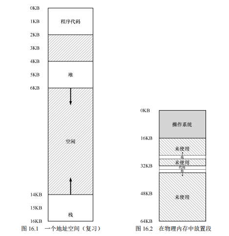
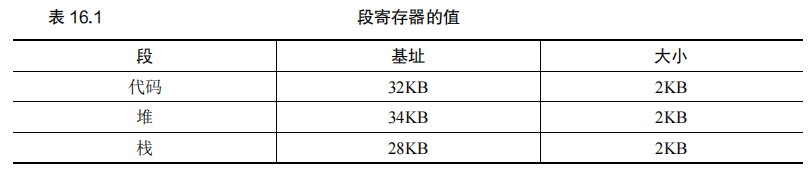
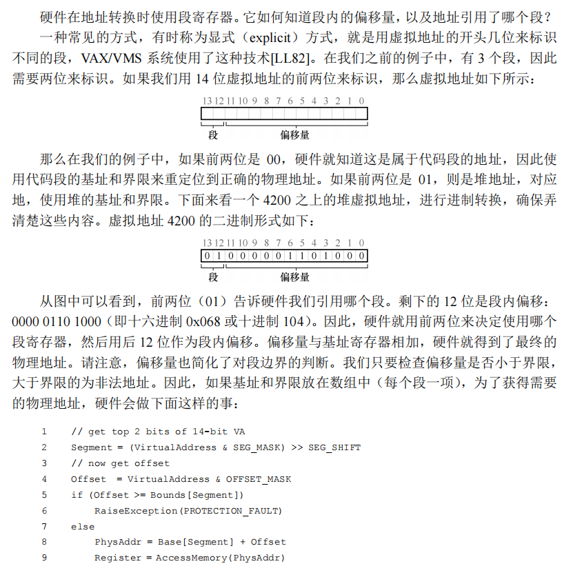
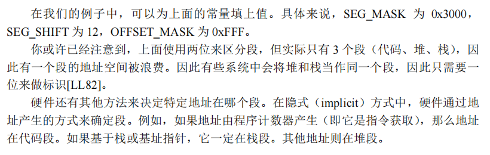
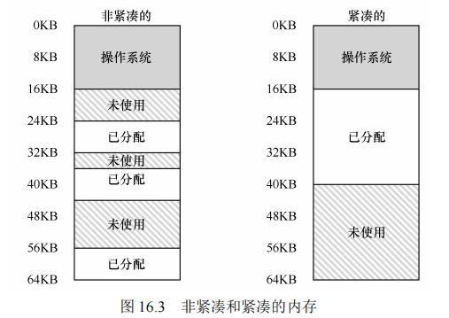

## 第十六章 分段

在前面的章节中，我们假设将进程的整个地址空间加载到物理内存中，利用基址和界限寄存器来进行地址重定位。==然而，这种方式会导致内存的浪费，特别是在栈和堆之间的未使用空间会占用实际的物理内存。==为了提高内存利用率并支持更大的地址空间，引入了**分段（Segmentation）**这一概念。

#### 原文：

​		到目前为止，我们一直假设将所有进程的地址空间完整地加载到内存中。利用基址和界限寄存器，操作系统很容易将不同进程重定位到不同的物理内存区域。但是，对于这些内存区域，你可能已经注意到一件有趣的事：栈和堆之间，有一大块“空闲”空间。

​		从图 16.1 中可知，如果我们将整个地址空间放入物理内存，那么栈和堆之间的空间并没有被进程使用，却依然占用了实际的物理内存。==因此，简单的通过基址寄存器和界限寄存器实现的虚拟内存很浪费。另外，如果剩余物理内存无法提供连续区域来放置完整的地址空间，进程便无法运行。这种基址加界限的方式看来并不像我们期望的那样灵活。==因此：


### 16.1 分段：泛化的基址/界限

​		**分段**是将地址空间划分为多个独立的逻辑段（segment），每个段有自己的一对基址和界限寄存器。常见的段包括代码段、堆段和栈段。通过分段，**操作系统可以将这些段分别放置在物理内存的不同区域，避免未使用的地址空间占用物理内存**。这种机制特别适用于存在稀疏地址空间（Sparse Address Spaces）的情况。

​		**示例**： 假设一个进程的地址空间被划分为三个段，如图16.1所示。



​		通过使用基址和界限寄存器，操作系统将每个段独立放置在物理内存中，如图16.2所示。在这个例子中，物理内存被分为64KB的区域，其中16KB留给操作系统，**剩余的48KB用于放置代码段、堆段和栈段。**

​		表16.1展示了这些段的具体基址和大小：

| **段**     | **基址** | **大小** |
| ---------- | -------- | -------- |
| **代码段** | 32KB     | 2KB      |
| **堆段**   | 34KB     | 2KB      |
| **栈段**   | 28KB     | 2KB      |

**地址转换过程**：

- 如果引用代码段中的虚拟地址100，硬件会将基址（32KB）加上偏移量100，得到物理地址32868，并检查该地址是否在界限内（100 < 2KB），如果合法，则发起对物理地址32868的访问。
- 对于堆中的虚拟地址4200，首先计算段内的偏移量（4200 - 4096 = 104），然后将偏移量加上堆段的基址（34KB），得到物理地址34920。

​		**段错误（Segmentation Fault）**： ==当进程试图访问超出段边界的地址时==，硬件会检测到这一越界行为，并触发异常，通常会导致进程被终止。这种错误在支持分段的机器上被称为**段错误（Segmentation Fault）**。

#### 原文：

​		为了解决这个问题，分段（segmentation）的概念应运而生。分段并不是一个新概念，它甚至可以追溯到 20 世纪 60 年代初期[H61, G62]。这个想法很简单，在 MMU 中引入不止一个基址和界限寄存器对，而是给地址空间内的每个逻辑段（segment）一对。一个段只是地址空间里的一个连续定长的区域，在典型的地址空间里有 3 个逻辑不同的段：代码、栈和堆。分段的机制使得操作系统能够将不同的段放到不同的物理内存区域，从而避免了虚拟地址空间中的未使用部分占用物理内存。

​		我们来看一个例子。假设我们希望将图 16.1 中的地址空间放入物理内存。通过给每个段一对基址和界限寄存器，可以将每个段独立地放入物理内存。


​		如图 16.2 所示，64KB 的物理内存中放置了 3 个段（为操作系统保留 16KB）。

​		从图中可以看到，只有已用的内存才在物理内存中分配空间，因此可以容纳巨大的地址空间，其中包含大量未使用的地址空间（有时又称为稀疏地址空间，sparse address spaces）。

​		你会想到，需要 MMU 中的硬件结构来支持分段：在这种情况下，需要一组 3 对基址和界限寄存器。表 16.1 展示了上面的例子中的寄存器值，每个界限寄存器记录了一个段的大小。



​		如表 16.1 所示，代码段放在物理地址 32KB，大小是 2KB。堆在 34KB，大小也是 2KB。

​		利用图 16.1 中的地址空间，我们来看一个地址转换的例子。假设现在要引用虚拟地址100（在代码段中），MMU 将基址值加上偏移量（100）得到实际的物理地址：100 + 32KB = 32868。然后它会检查该地址是否在界限内（100 小于 2KB），发现是的，于是发起对物理地址 32868 的引用。 


​		来看一个堆中的地址，虚拟地址 4200（同样参考图 16.1）。如果用虚拟地址 4200 加上堆的基（34KB），得到物理地址 39016，这不是正确的地址。==我们首先应该先减去堆的偏移量，即该地址指的是这个段中的哪个字节。因为堆从虚拟地址 4K（4096）开始，4200 的偏移量实际上是 4200 减去 4096，即 104，==然后用这个偏移量（104）加上基址寄存器中的物理地址（34KB），得到真正的物理地址 34920。

​		如果我们试图访问非法的地址，例如 7KB，它超出了堆的边界呢？你可以想象发生的情况：硬件会发现该地址越界，因此陷入操作系统，很可能导致终止出错进程。这就是每个 C 程序员都感到恐慌的术语的来源：段异常（segmentation violation）或段错误（segmentation fault）。


==gb:我们需要看虚拟地址处于哪一个段，之后需要减去这个段的偏移量（这个段中的哪个字节），然后将这个偏移量加上基址得到物理地址。==


### 16.2 我们引用哪个段

​		**段选择**：==在地址转换过程中，硬件需要确定虚拟地址属于哪个段，并计算段内的偏移量。==有两种常见的方式来实现这一点：

1. **显式方式（Explicit Method）**：==通过虚拟地址的高位来标识段。==例如，在一个14位的虚拟地址中，前两位用于标识段，其余12位用于表示段内的偏移量。这种方式使得硬件能够快速确定地址属于哪个段，并计算物理地址。

   示例代码片段展示了如何进行段选择和地址转换：

   ```c
   // 获取虚拟地址的高位，确定段
   Segment = (VirtualAddress & SEG_MASK) >> SEG_SHIFT;
   // 计算段内偏移量
   Offset = VirtualAddress & OFFSET_MASK;
   // 检查偏移量是否越界
   if (Offset >= Bounds[Segment])
       RaiseException(PROTECTION_FAULT);
   else
       PhysAddr = Base[Segment] + Offset;
   ```

这段代码片段展示了在操作系统或硬件中，如何使用虚拟地址来确定所属的段并计算物理地址。这种方法通常用于分段内存管理模型中，其中虚拟地址被分成多个部分，分别用于标识段和段内偏移。

##### 代码分析

```C
// 获取虚拟地址的高位，确定段
Segment = (VirtualAddress & SEG_MASK) >> SEG_SHIFT;

// 计算段内偏移量
Offset = VirtualAddress & OFFSET_MASK;

// 检查偏移量是否越界
if (Offset >= Bounds[Segment])
    RaiseException(PROTECTION_FAULT);
else
    PhysAddr = Base[Segment] + Offset;
```

##### 1. **获取虚拟地址的高位，确定段**

```
Segment = (VirtualAddress & SEG_MASK) >> SEG_SHIFT;
```

- `VirtualAddress`：这是一个虚拟地址，由操作系统或应用程序生成，用于访问内存中的数据。
- `SEG_MASK`：这是一个掩码，用于提取虚拟地址中的段标识部分。假设 `SEG_MASK` 是一个高位掩码，比如对于14位虚拟地址，如果前2位用于段标识，那么 `SEG_MASK` 的二进制值可能是 `11000000000000`。
- `SEG_SHIFT`：用于将提取的段标识右移，使其成为一个有效的段编号。例如，如果 `SEG_SHIFT` 是12（表示段标识在前2位），右移12位将段标识移至最低有效位。

这一行代码的目的是从虚拟地址中提取高位，用于确定虚拟地址所属的段编号。

##### 2. **计算段内偏移量**

```
Offset = VirtualAddress & OFFSET_MASK;
```

- `OFFSET_MASK`：用于提取虚拟地址中表示段内偏移量的部分。比如，对于14位虚拟地址，如果低12位用于段内偏移，那么 `OFFSET_MASK` 的二进制值可能是 `0000111111111111`。

这一行代码的目的是从虚拟地址中提取段内的偏移量，它表示在这个段内的具体位置。

##### 3. **检查偏移量是否越界**

```C
if (Offset >= Bounds[Segment])
    RaiseException(PROTECTION_FAULT);
```

- `Bounds[Segment]`：**这是一个数组，其中存储了每个段的边界或最大有效偏移量**。如果段内偏移量超过了这个值，则表示越界访问。

这一行代码的目的是检查计算出来的偏移量是否超过该段的有效范围。如果偏移量大于该段的边界值，则会触发一个保护异常，防止非法内存访问。

##### 4. **计算物理地址**

```C
else
    PhysAddr = Base[Segment] + Offset;
```

- `Base[Segment]`：这是一个数组，其中存储了每个段的基地址。这个基地址是物理内存中的起始地址。
- `PhysAddr`：最终计算出的物理地址。通过将段的基地址与段内偏移量相加，得到实际的物理地址。

这一行代码的目的是将基地址和偏移量相加，得到实际的物理内存地址，从而可以访问或操作该地址上的数据。

##### 总结

这段代码实现了虚拟地址到物理地址的转换，具体步骤如下：

1. **确定段**：通过虚拟地址的高位，提取段标识。
2. **计算偏移量**：提取虚拟地址的低位部分，作为段内偏移量。
3. **边界检查**：检查偏移量是否超过段的边界，防止越界访问。
4. **计算物理地址**：通过基地址和偏移量计算实际的物理内存地址。

这种机制通过将虚拟地址划分为段和偏移量部分，使得系统能够有效管理内存，同时提供保护机制防止非法访问。


#### 原文：





2.**隐式方式（Implicit Method）**：**硬件通过地址的产生方式来确定段。**例如，程序计数器（PC）产生的地址通常属于代码段，而基址指针产生的地址则属于栈段。==这种方式不需要显式的段标识，而是通过上下文推断出地址属于哪个段。==

**分段的灵活性**： 虽然分段机制引入了更多的硬件复杂性，但它带来了显著的内存利用效率提升。通过分段，操作系统可以灵活地管理内存，将程序的各个部分放置在物理内存中最合适的位置，从而支持大地址空间和稀疏地址空间。

------

本章介绍了分段机制，它通过将地址空间划分为多个逻辑段，并为每个段配备独立的基址和界限寄存器，显著提高了内存利用效率。==分段不仅减少了内存浪费，还允许操作系统灵活地管理和分配物理内存，从而更好地支持复杂的应用程序和大规模内存需求。==下一步将探讨更复杂的内存管理机制，如**分页（Paging）和虚拟内存的实现。**


### 16.3 栈怎么办

​		在前面的讨论中，我们主要关注了代码段和堆段的地址转换，但栈段有一个关键的不同点：它是反向增长的。换句话说，栈从高地址向低地址增长，这与代码段和堆段的增长方向相反。

​		**栈的反向增长**： 在地址转换过程中，栈段的处理方式与其他段有所不同。硬件需要支持一个额外的标志位，用于指示段的增长方向。例如，**1表示正向增长（从低地址向高地址增长），0表示反向增长（从高地址向低地址增长）**。在表16.2中，更新后的段寄存器结构包括了这个新标志位。

**表 16.2 段寄存器（支持反向增长）**：

| 段   | 基址 | 大小 | 是否反向增长 |
| ---- | ---- | ---- | ------------ |
| 代码 | 32KB | 2KB  | 1            |
| 堆   | 34KB | 2KB  | 1            |
| 栈   | 28KB | 2KB  | 0            |

​		**栈段地址转换示例**： 假设要访问虚拟地址15KB（位于栈段中），该地址应该映射到物理地址27KB。虚拟地址的二进制形式为`11 1100 0000 0000`（十六进制为0x3C00）。硬件首先利用前两位`11`来指定这是栈段，然后根据剩余的地址部分计算偏移量。因为栈是反向增长的，我们需要从栈段的最大地址（4KB）中减去偏移量（3KB），得到−1KB的反向偏移量。将这个偏移量与基址28KB相加，就得到正确的物理地址27KB。

​		这种处理方式确保了反向增长段的地址能够正确映射到物理内存，同时也允许硬件进行界限检查，确保反向偏移量的绝对值小于段的大小。

### 16.4 支持共享

​		随着分段机制的发展，系统设计人员意识到，通过进一步的硬件支持，可以实现内存的共享，尤其是在多个进程之间共享代码段。为了实现这一点，引入了**保护位（Protection Bit）**的概念。

​		**保护位的作用**： 每个段寄存器除了基址、大小和增长方向外，还需要增加几个位来标识该段的权限，比如是否允许读、写、或执行。这些保护位允许操作系统将某些段标记为只读，从而实现代码段的共享。多个进程可以共享同一个物理内存中的代码段，而不必担心进程之间的相互影响。

**表 16.3 段寄存器的值（有保护）**：

| 段   | 基址 | 大小 | 是否反向增长 | 保护    |
| ---- | ---- | ---- | ------------ | ------- |
| 代码 | 32KB | 2KB  | 1            | 读—执行 |
| 堆   | 34KB | 2KB  | 1            | 读—写   |
| 栈   | 28KB | 2KB  | 0            | 读—写   |

​		**共享的实现**： 当硬件在进行地址转换时，不仅要检查地址是否越界，还需要检查该访问是否符合段的权限设置。如果用户进程试图写入只读段，或者从非执行段执行指令，硬件会触发异常，并让操作系统处理该错误。

### 16.5 细粒度与粗粒度的分段

​		我们之前的讨论主要集中在粗粒度分段上，即将地址空间分成较大的段（如代码段、栈段、堆段）。然而，一些早期系统，如Multics，允许将地址空间划分为许多小段，这被称为**细粒度分段（Fine-Grained Segmentation）**。

​		**细粒度分段的优势**： 细粒度分段提供了更大的灵活性，允许操作系统和编译器更精细地管理内存资源。例如，早期的Burroughs B5000机器支持成千上万的段，操作系统可以将代码和数据划分为许多小段，从而更高效地利用内存。

​		**段表的引入**： 为了支持大量的小段，系统需要引入段表（Segment Table）来管理这些段的信息。==段表通常存储在内存中，并包含每个段的基址、大小和权限等信息。==

### 16.6 操作系统支持

#### 原文：

​		现在你应该大致了解了分段的基本原理。==系统运行时，地址空间中的不同段被重定位到物理内存中。与我们之前介绍的整个地址空间只有一个基址/界限寄存器对的方式相比，大量节省了物理内存。==**具体来说，栈和堆之间没有使用的区域就不需要再分配物理内存，让我们能将更多地址空间放进物理内存。**

​		然而，分段也带来了一些新的问题。我们先介绍必须关注的操作系统新问题。第一个是老问题：操作系统在上下文切换时应该做什么？你可能已经猜到了：==各个段寄存器中的内容必须保存和恢复。显然，每个进程都有自己独立的虚拟地址空间，操作系统必须在进程运行前，确保这些寄存器被正确地赋值。==

​		第二个问题更重要，即管理物理内存的空闲空间。新的地址空间被创建时，操作系统需要在物理内存中为它的段找到空间。之前，我们假设所有的地址空间大小相同，物理内存可以被认为是一些槽块，进程可以放进去。现在，每个进程都有一些段，每个段的大小也可能不同。

​		==一般会遇到的问题是，物理内存很快充满了许多空闲空间的小洞，因而很难分配给新的段，或扩大已有的段。这种问题被称为外部碎片（external fragmentation）[R69]，==如图 16.3（左边）所示。



​		在这个例子中，一个进程需要分配一个 20KB 的段。当前有 24KB 空闲，但并不连续（是3 个不相邻的块）。因此，操作系统无法满足这个 20KB 的请求。

​		==该问题的一种解决方案是紧凑（compact）物理内存，重新安排原有的段。例如，操作系统先终止运行的进程，将它们的数据复制到连续的内存区域中去，改变它们的段寄存器中的值，指向新的物理地址，从而得到了足够大的连续空闲空间。==这样做，操作系统能让新的内存分配请求成功。**但是，内存紧凑成本很高，因为拷贝段是内存密集型的，一般会占用大量的处理器时间。**图 16.3（右边）是紧凑后的物理内存。

​		==一种更简单的做法是利用空闲列表管理算法，试图保留大的内存块用于分配。==相关的算法可能有成百上千种，包括传统的最优匹配（best-fit，从空闲链表中找最接近需要分配空间的空闲块返回）、最坏匹配（worst-fit）、首次匹配（first-fit）以及像伙伴算法（buddy algorithm）[K68]这样更复杂的算法。Wilson 等人做过一个很好的调查[W+95]，如果你想对这些算法了解更多，可以从它开始，或者等到第 17 章，我们将介绍一些基本知识。但遗憾的是，无论算法多么精妙，都无法完全消除外部碎片，因此，好的算法只是试图减小它。


**提示：如果有一千个解决方案，就没有特别好的**

**==存在如此多不同的算法来尝试减少外部碎片，正说明了解决这个问题没有最好的办法==。因此我们满足于找到一个合理的足够好的方案。唯一真正的解决办法就是（我们会在后续章节看到），完全避免这个问题，永远不要分配不同大小的内存块。**


​		分段机制虽然提供了内存利用效率，但也给操作系统带来了新的挑战。

​		**1. 上下文切换**： 在上下文切换时，操作系统必须保存和恢复各个段寄存器的内容。每个进程都有自己独立的虚拟地址空间，因此在进程切换时，操作系统必须确保所有段寄存器被正确设置。

​		**2. 空闲内存管理**： 操作系统必须管理物理内存中的空闲空间。当创建新的地址空间时，操作系统需要为它的各个段找到合适的物理内存块。==然而，由于段大小不同，可能会导致物理内存中出现许多不连续的空闲空间，即**外部碎片（External Fragmentation）**。==

​		**解决外部碎片的策略**：

- **紧凑内存**：操作系统可以通过移动段来紧凑内存，使得空闲空间变得连续，从而满足新的内存分配请求。**但这种方法代价高昂，因为移动段需要大量的处理器时间。**
- **空闲列表管理**：操作系统可以采用各种空闲列表管理算法，如最优匹配、最坏匹配、首次匹配等，来减少外部碎片的影响。

### 16.7 小结

分段机制通过动态重定位和灵活的段管理，帮助操作系统更有效地利用内存资源，特别是在支持稀疏地址空间和共享代码段方面。**尽管如此，分段机制仍然面临一些挑战，如外部碎片和对稀疏地址空间的支持不足**。为了解决这些问题，**更复杂的内存管理技术将被引入，例如分页（Paging）**，这是后续章节的内容。

------

这部分对第16章的关键内容进行了详细总结，涵盖了栈段的处理、共享机制的引入、细粒度与粗粒度分段的对比，以及操作系统在分段机制下的挑战和解决方案。如果有更多内容需要总结，请继续提供。


==gb: 分段是用来解决简单使用动态重定位（基址寄存器和受限寄存器）产生的内存碎片问题（很多物理内存分配了但是没有使用），分段主要为代码段，堆段，栈段，我们需要知道虚拟地址处于哪个段，并且计算其偏移量来确定其在物理地址正确位置，但是分段会产生新的问题，即外部碎片，会导致内存中出现许多不连续的空闲空间，无法继续分段。解决的方法有紧凑内存（移动段来使空闲空间变得连续，但是移动段需要大量的CPU时间）和空闲列表管理（空闲列表管理算法太多）。==