## 第十七章 空闲空间管理

在这一章中，我们暂时搁置虚拟内存的讨论，转而探讨所有内存管理系统中的一个基本方面——空闲空间管理。无论是用户级的内存分配库（如 `malloc()`）还是操作系统自身的内存管理系统，都需要有效地管理空闲空间。

#### 关键问题：如何管理空闲空间

当要管理的空间大小不固定时，管理空闲空间就变得复杂且富有挑战性。外部碎片是一个核心问题：空闲空间被切割成不同大小的小块，这些碎片可能导致无法满足后续请求，即使总的空闲空间超过请求的大小。

**示例**： 例如，如果内存中有两个各为10字节的空闲块，而应用程序请求一个15字节的内存块，尽管总空闲空间为20字节，但由于没有足够大的连续空闲块，分配请求仍然会失败。

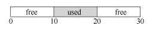

**问题**：如何管理空闲空间以最小化碎片，同时满足变长的分配请求？这引出了管理空闲空间的策略、时间开销和空间开销等问题。

#### 17.1 假设

本章主要围绕用户级内存分配库（如 `malloc()` 和 `free()`）的历史和方法展开讨论。我们假设的接口类似于 `malloc()` 和 `free()` 提供的基本接口：

- `void *malloc(size_t size)`：接受一个表示字节数的参数 `size`，返回指向分配的内存块的指针。
- `void free(void *ptr)`：接受一个指针 `ptr`，释放对应的内存块。

**隐含意义**： 在释放空间时，用户不需要告知库这块空间的大小，因此库必须有办法在只传入一个指针的情况下确定该内存块的大小。

**堆和空闲列表**：

- **堆**：历史上，管理内存的区域被称为堆。
- **空闲列表**：用于管理堆中所有空闲块的引用的数据结构称为空闲列表（free list）。尽管它被称为“列表”，但它可以是任何一种能够追踪空闲空间的数据结构。

**碎片问题**： 本章主要关注外部碎片。内部碎片也可能存在，但为了简化讨论，主要讨论外部碎片。内部碎片是指当分配程序给出的内存块超出请求的大小时，未使用的空间造成的浪费。

**内存分配的不可移动性**： 我们假设**一旦内存分配给程序，它就不能被移动**。例如，当程序调用 `malloc()` 获取指向堆中内存块的指针时，这块内存就归该程序所有，直到程序调用 `free()` 归还它。**因此，不可能通过紧凑化操作来减少碎片。**

**连续的内存区域**： 假设分配程序管理的是一块连续的内存区域。在一些情况下，分配程序可能要求这块区域增长，但在本章中假设这块区域在整个生命周期内是固定大小的。

### 17.2 底层机制

本节深入探讨分配程序中普遍使用的基本机制，主要包括空间的分割与合并、追踪已分配空间的大小、以及如何利用空闲区域来维护空闲列表。

#### 分割与合并

**分割（Splitting）：** 空闲列表管理着未分配的内存块。当一个程序请求分配内存时，分配程序会检查空闲列表，找到足够大的块。如果找到的块比请求的内存大，那么分配程序会将该块分割为两部分：一部分返回给程序使用，另一部分继续留在空闲列表中。例如，假设一个空闲列表中有两个元素，分别记录着两个10字节的空闲块。当程序请求1字节的内存时，分配程序会从其中一个10字节的空闲块中切割出1字节分配给程序，剩余的9字节继续保留在空闲列表中。

**合并（Coalescing）：** 当程序释放内存时，分配程序会将这块内存重新加入空闲列表。如果这块内存与列表中现有的空闲块相邻，分配程序会将它们合并为一个更大的空闲块。例如，如果一个程序释放了堆中间的一块已分配空间，分配程序将检查它前后的空闲块，并将它们合并成一个更大的块，从而减少外部碎片。


**原文：**

空闲列表包含一组元素，记录了堆中的哪些空间还没有分配。假设有下面的 30 字节的堆：

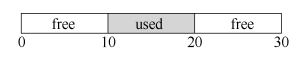

这个堆对应的空闲列表会有两个元素，一个描述第一个10字节的空闲区域（字节0～9），

一个描述另一个空闲区域（字节 20～29）：

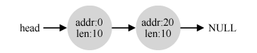

​		通过上面的介绍可以看出，任何大于 10 字节的分配请求都会失败（返回 NULL），因为没有足够的连续可用空间。而恰好 10 字节的需求可以由两个空闲块中的任何一个满足。但是，如果申请小于 10 字节空间，会发生什么？

​		假设我们只申请一个字节的内存。这种情况下，分配程序会执行所谓的分割（splitting）动作：它找到一块可以满足请求的空闲空间，将其分割，第一块返回给用户，第二块留在空闲列表中。在我们的例子中，假设这时遇到申请一个字节的请求，分配程序选择使用第二块空闲空间，对 malloc()的调用会返回 20（1 字节分配区域的地址），空闲列表会变成这样：

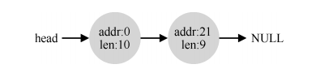

​		从上面可以看出，空闲列表基本没有变化，只是第二个空闲区域的起始位置由 20 变成21，长度由 10 变为 9 了①。因此，如果请求的空间大小小于某块空闲块，分配程序通常会进行分割。

​		许多分配程序中因此也有一种机制，名为合并（coalescing）。还是看前面的例子（10字节的空闲空间，10 字节的已分配空间，和另外 10 字节的空闲空间）。

​		对于这个（小）堆，如果应用程序调用 free(10)，归还堆中间的空间，会发生什么？如果只是简单地将这块空闲空间加入空闲列表，不多想想，可能得到如下的结果：

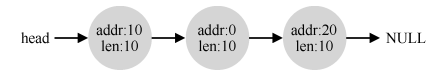

​		问题出现了：尽管整个堆现在完全空闲，但它似乎被分割成了 3 个 10 字节的区域。这时，如果用户请求 20 字节的空间，简单遍历空闲列表会找不到这样的空闲块，因此返回失败。

​		为了避免这个问题，分配程序会在释放一块内存时合并可用空间。想法很简单：在归还一块空闲内存时，仔细查看要归还的内存块的地址以及邻它的空闲空间块。如果新归还的空间与一个原有空闲块相邻（或两个，就像这个例子），就将它们合并为一个较大的空闲块。通过合并，最后空闲列表应该像这样：

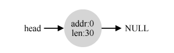

实际上，这是堆的空闲列表最初的样子，在所有分配之前。通过合并，分配程序可以更好地确保大块的空闲空间能提供给应用程序。


#### 追踪已分配空间的大小

在 `free(void *ptr)` 函数中，分配程序需要知道要释放的内存块的大小。由于 `free()` 函数不接受大小参数，分配程序通常在内存块的头部（header）保存一些额外的信息，如块的大小和幻数（magic number）用于完整性检查。

**示例：** 假设用户请求分配20字节的内存，分配程序会在返回的内存块前面加上一个头块，记录这块内存的大小和其他相关信息。头块可能会包含以下结构：

```
typedef struct header_t { 
 int size; 
 int magic; 
} header_t;
```

当用户调用 `free(ptr)` 时，分配程序会通过指针运算定位到头块，读取其中的大小信息，从而将该内存块正确地放回空闲列表。


**原文：**

​		你可能注意到，free(void *ptr)接口没有块大小的参数。因此它是假定，对于给定的指针，内存分配库可以很快确定要释放空间的大小，从而将它放回空闲列表。

​		要完成这个任务，大多数分配程序都会在头块（header）中保存一点额外的信息，它在内存中，通常就在返回的内存块之前。我们再看一个例子（见图 17.1）。

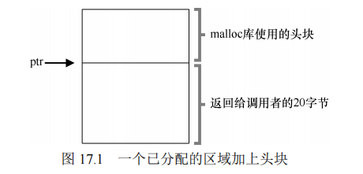

在这个例子中，我们检查一个 20 字节的已分配块，由 ptr 指着，设想用户调用了 malloc()，并将结果保存在ptr 中：ptr = malloc(20)。

​		该头块中至少包含所分配空间的大小（这个例子中是 20）。它也可能包含一些额外的指针来加速空间释放，包含一个幻数来提供完整性检查，以及其他信息。我们假定，一个简单的头块包含了分配空间的大小和一个幻数：

```C
typedef struct header_t { 
 	int size; 
 	int magic; 
} header_t;
```

上面的例子看起来会像图 17.2 的样子。用户调用 free(ptr)时，库会通过简单的指针运算得到头块的位置：

```C
void free(void *ptr) { 
	header_t *hptr = (void *)ptr - sizeof(header_t); 
}
```

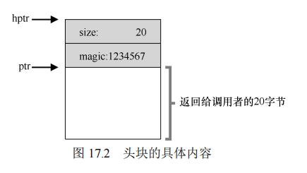

获得头块的指针后，库可以很容易地确定幻数是否符合预期的值，作为正常性检查（assert（hptr->magic == 1234567）），并简单计算要释放的空间大小（即头块的大小加区域长度）。请注意前一句话中一个小但重要的细节：实际释放的是头块大小加上分配给用户的空间的大小。因此，如果用户请求 *N* 字节的内存，库不是寻找大小为 *N* 的空闲块，而是寻找N* 加上头块大小的空闲块。


#### 嵌入空闲列表

空闲列表是一种数据结构，用于记录堆中的空闲块。为了在空闲内存中维护这个列表，分配程序通常在空闲块中嵌入列表节点的信息。一个典型的空闲列表节点结构可能是：

```C
typedef struct node_t { 
 int size; 
 struct node_t *next; 
} node_t;
```

在空闲列表中，每个节点记录一个空闲块的大小和下一个空闲块的指针。

**示例：** 假设堆初始时大小为4096字节，只有一个空闲块。分配程序会初始化空闲列表，将这块空间记录为一个节点。这块空间通过系统调用 mmap()获得。这不是构建这种堆的唯一选择，但在这个例子中很合适。这个节点可能会像这样初始化：

```C
node_t *head = mmap(NULL, 4096, PROT_READ|PROT_WRITE, 
 MAP_ANON|MAP_PRIVATE, -1, 0); 
head->size = 4096 - sizeof(node_t); 
head->next = NULL;
```

如果程序请求100字节的内存，分配程序会在这个节点中分割出108字节（包括头块大小），返回给用户，并将剩余的空间继续保留在空闲列表中。


**原文：**

执行这段代码之后，列表的状态是它只有一个条目，记录大小为 4088。

是的，这是一个小堆，但对我们是一个很好的例子。head 指针指向这块区域的起始地址，假设是 16KB（尽管任何虚拟地址都可以）。堆看起来如图 17.3 所示。

现在，假设有一个 100 字节的内存请求。为了满足这个请求，库首先要找到一个足够大小的块。因为只有一个 4088 字节的块，所以选中这个块。然后，这个块被分割（split）为两块：一块足够满足请求（以及头块，如前所述），一块是剩余的空闲块。假设记录头块为 8 个字节（一个整数记录大小，一个整数记录幻数），堆中的空间如图 17.4 所示。

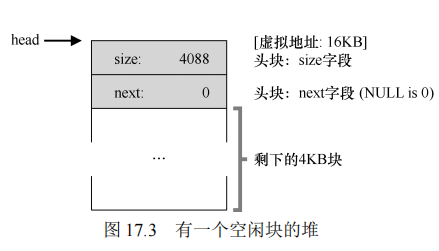

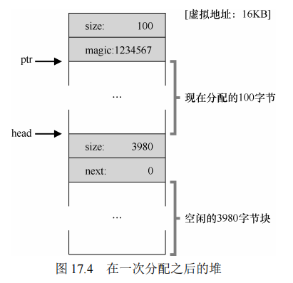

​		至此，对于 100 字节的请求，库从原有的一个空闲块中分配了 108 字节，返回指向它的一个指针（在上图中用 ptr 表示），并在其之前连续的 8 字节中记录头块信息，供未来的free()函数使用。同时将列表中的空闲节点缩小为 3980 字节（4088−108）。

​		现在再来看该堆，其中有 3 个已分配区域，每个 100（加上头块是 108）。这个堆如图 17.5所示。

​		可以看出，堆的前 324 字节已经分配，因此我们看到该空间中有 3 个头块，以及 3 个 100字节的用户使用空间。空闲列表还是无趣：只有一个节点（由 head 指向），但在 3 次分割后，现在大小只有 3764 字节。但如果用户程序通过 free()归还一些内存，会发生什么？

​		在这个例子中，应用程序调用 free(16500)，归还了中间的一块已分配空间（内存块的起始地址 16384 加上前一块的 108，和这一块的头块的 8 字节，就得到了 16500）。这个值在前图中用 sptr 指向。

​		库马上弄清楚了这块要释放空间的大小，并将空闲块加回空闲列表。假设我们将它插入到空闲列表的头位置，该空间如图 17.6 所示。

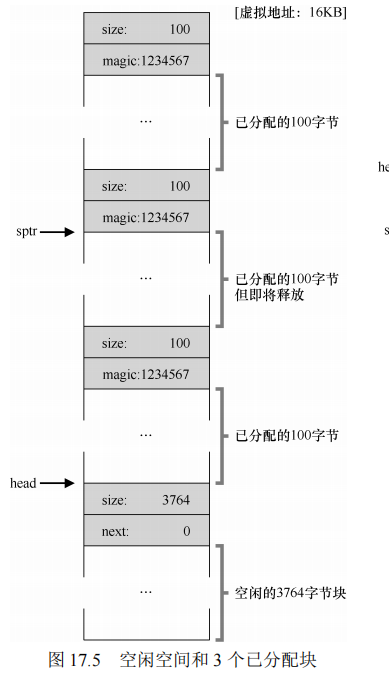

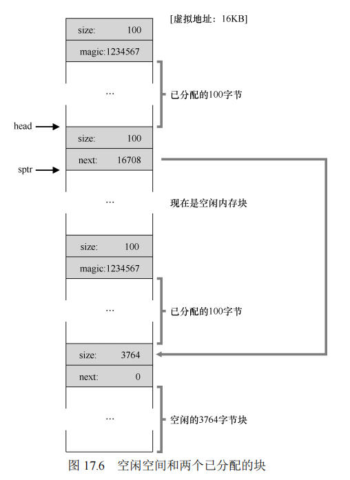


​		现在的空闲列表包括一个小空闲块（100 字节，由列表的头指向）和一个大空闲块（3764字节）。

​		我们的列表终于有不止一个元素了！是的，空闲空间被分割成了两段，但很常见。

​		最后一个例子：现在假设剩余的两块已分配的空间也被释放。没有合并，空闲列表将非常破碎，如图 17.7 所示。

​		从图中可以看出，我们现在一团糟！为什么？简单，我们忘了合并（coalesce）列表项，虽然整个内存空间是空闲的，但却被分成了小段，因此形成了碎片化的内存空间。解决方案很简单：遍历列表，合并（merge）相邻块。完成之后，堆又成了一个整体。

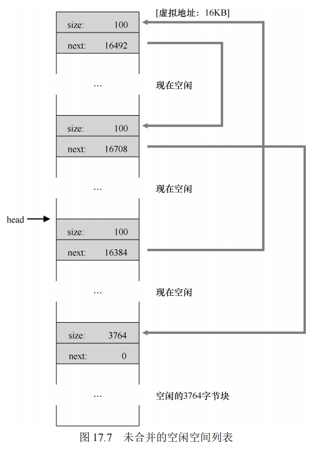


#### 合并后的例子

当用户程序释放内存块时，如果释放的块与现有的空闲块相邻，分配程序会将它们合并，减少碎片。例如，在一个包含3个已分配块的堆中，如果用户释放中间的块，分配程序会合并相邻的空闲块，形成一个更大的空闲块。

**示例：** 假设堆中的空闲块为：

- 一个100字节的空闲块
- 一个3764字节的空闲块

当用户释放中间的内存块时，分配程序会将其合并回空闲列表，使堆空间更连续和紧凑，减少碎片。

#### 让堆增长

当堆中的空闲空间耗尽时，分配程序通常会向操作系统请求更多的内存。通过 `sbrk` 或其他系统调用，分配程序可以扩大堆的大小，使得能够继续满足分配请求。如果无法获取更多的内存，分配程序会返回 `NULL`，表示分配失败。

------

通过这些底层机制，分配程序能够有效管理堆中的空闲空间，最大限度地减少碎片并优化内存使用。在接下来的讨论中，将进一步探讨这些机制的实际实现和优化策略。

### 17.3 基本策略

在内存分配中，管理空闲空间的策略决定了分配的效率和碎片的控制。下面介绍几种常见的基本策略，每种策略都有其独特的优缺点。

#### 最优匹配（Best Fit）

**描述：** 最优匹配策略试图找到最接近用户请求大小的空闲块。分配程序会遍历整个空闲列表，找到大小最接近且大于或等于请求大小的块，将其分配给用户，并返回剩余部分作为新的空闲块。

**优点：** 这种策略的优点是最大程度地减少了浪费，因为它总是选择最小的符合要求的空闲块，避免了大的内存块被划分成多个小块。

**缺点：** 由于需要遍历整个空闲列表，最优匹配的查找速度较慢。并且，最优匹配策略可能会产生许多小的无法使用的碎片（即内部碎片），尤其是在频繁的分配和释放操作后。

#### 最差匹配（Worst Fit）

**描述：** 最差匹配策略与最优匹配相反，它选择最大的空闲块，将其分配给用户。剩余部分作为新的空闲块继续留在空闲列表中。

**优点：** 最差匹配试图保留较大的空闲块，从而避免产生许多小的无法利用的碎片。

**缺点：** 尽管最差匹配保留了大块空闲空间，但它的表现通常很差，因为频繁的分割会导致过量的外部碎片。它的查找开销也很高，因为同样需要遍历整个空闲列表。

#### 首次匹配（First Fit）

**描述：** 首次匹配策略从空闲列表的头部开始，找到第一个能够满足请求的空闲块，将其分割并返回给用户，剩余部分作为新的空闲块继续留在列表中。

**优点：** 首次匹配的速度较快，因为它不需要遍历整个空闲列表，一旦找到合适的块就立即分配。

**缺点：** 首次匹配容易在列表的开头留下许多小的空闲块，导致列表的前部出现许多碎片。因此，首次匹配的空闲列表排序方式变得重要，通常使用按地址排序（address-based ordering）的方法，以便在释放内存时更容易合并相邻的空闲块。

#### 下次匹配（Next Fit）

**描述：** 下次匹配策略与首次匹配类似，但它不会每次都从空闲列表的头部开始查找，而是从上一次查找结束的位置继续。通过维护一个指针，分配程序可以在每次查找时从上次结束的位置继续，以均匀地利用整个空闲列表。

**优点：** 下次匹配可以避免频繁对空闲列表头部进行分割，从而减少前部产生碎片的几率。它的查找速度与首次匹配相近，且在分布上更加均匀。

**缺点：** 下次匹配的表现通常与首次匹配相似，但在某些情况下可能会导致较差的局部性。

#### 例子解析

考虑一个包含三个元素的空闲列表，长度依次为10、30、20。假设有一个15字节的内存请求，不同策略的表现如下：

- **最优匹配** 会遍历整个空闲列表，选择20字节的块，分配15字节后剩下5字节的空闲块。
- **最差匹配** 会选择最大的30字节块，分配15字节后剩下15字节的空闲块。
- **首次匹配** 会选择第一个足够大的块，也就是30字节块，分配15字节后剩下15字节的空闲块。

这些策略各有优缺点，具体选择取决于实际应用场景和需求。在实践中，可能需要对这些策略进行更深入的分析和优化，以适应不同的分配需求和工作负载。


**原文：**

​		下面是上述策略的一些例子。设想一个空闲列表包含 3 个元素，长度依次为 10、30、20（我们暂时忽略头块和其他细节，只关注策略的操作方式）：


​		假设有一个 15 字节的内存请求。最优匹配会遍历整个空闲列表，发现 20 字节是最优匹配，因为它是满足请求的最小空闲块。结果空闲列表变为：

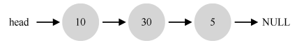

​		本例中发生的情况，在最优匹配中常常发生，现在留下了一个小空闲块。最差匹配类似，但会选择最大的空闲块进行分割，在本例中是 30。结果空闲列表变为：

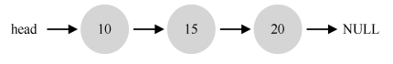

​		在这个例子中，首次匹配会和最差匹配一样，也发现满足请求的第一个空闲块。不同的是查找开销，最优匹配和最差匹配都需要遍历整个列表，而首次匹配只找到第一个满足需求的块即可，因此减少了查找开销。

​		这些例子只是内存分配策略的肤浅分析。真实场景下更详细的分析和更复杂的分配行为（如合并），需要更深入的理解。也许可以作为作业，你说呢？

### 17.4 其他方式

在内存分配策略的基础上，还有一些更高级的技术和算法，用来改进内存管理的效率和减少碎片。以下是几种常见的扩展方法：

#### 分离空闲列表（Segregated Free Lists）

**描述：** 分离空闲列表是一个有趣的方法，它的核心思想是为常见大小的内存请求维护单独的空闲列表。这意味着，如果一个应用程序经常请求某个特定大小的内存块，那么可以为这种大小的请求创建专门的列表，而不是使用通用的内存分配程序。

**优点：** 通过为常见的请求大小创建单独的列表，分离空闲列表能够有效减少碎片问题，因为这些内存块不会被其他大小的请求所打乱。此外，由于这些列表不需要复杂的查找过程，因此分配和释放内存的速度也很快。

**缺点：** 尽管分离空闲列表能够提高效率，但它也增加了系统的复杂性。特别是，在初始化时如何决定为哪些大小的内存请求创建专门的列表？如果分配给特定大小请求的内存不足，系统如何处理？

**示例：** Solaris 内核中使用的厚块分配程序（Slab Allocator）就是这种方法的一个实现。在 Solaris 系统中，为内核常用的对象（如锁、文件系统 inode 等）创建了对象缓存，这些对象缓存使用分离空闲列表来管理特定大小的内存块。当内存用尽时，分配程序可以向通用内存申请新的厚块（slab），以满足特定大小的请求。当对象不再使用时，内存块会被释放并返回到通用内存池。


**补充：了不起的工程师真的了不起**

**像 Jeff Bonwick 这样的工程师（Jeff Bonwick 不仅写了上面提到的厚块分配程序，还是令人惊叹的文件系统 ZFS 的负责人），是硅谷的灵魂。在每一个伟大的产品或技术后面都有这样一个人（或一小群人），他们的天赋、能力和奉献精神远超众人。Facebook 的 Mark Zuckerberg 曾经说过：“那些在自己的领域中超凡脱俗的人，比那些相当优秀的人强得不是一点点。”这就是为什么，会有人成立自己的公司，然后永远地改变了这个世界（想想 Google、Apple 和 Facebook）。努力工作，你也可能成为这种“以一当百”的人。做不到的话，就和这样的人一起工作，你会明白什么是“听君一席话，胜读十年书”。如果都做不到，那就太难过了。**


#### 伙伴系统（Buddy System）

**描述：** 伙伴系统是一种旨在简化内存合并过程的分配算法。在这种系统中，空闲内存最初被视为一个大块（如 2^N 大小）。当有内存请求时，这个大块会被递归地一分为二，直到块的大小刚好满足请求。如果块被释放，系统会检查其“伙伴”块是否也空闲，如果是，则将它们合并成一个更大的块。

**优点：** 伙伴系统的优势在于合并过程非常高效。通过简单的地址计算可以快速确定两个块是否为“伙伴”，从而决定是否需要合并。这种方法可以有效减少外部碎片问题。

**缺点：** 伙伴系统的一个主要问题是它只支持 2 的幂次方大小的内存块分配，因此容易产生内部碎片（内存块内部未使用的部分）。此外，如果内存请求的大小不是 2 的幂次方，分配的内存块会比实际需要的要大，从而造成浪费。

**示例：** 考虑一个 64KB 大小的空闲内存块，用户请求 7KB 的内存，伙伴系统会将这个 64KB 的块递归分割成 32KB、16KB，直到产生一个 8KB 的块。这个 8KB 的块会被分配给用户，剩下的块继续留在空闲列表中。

**原文：**

因为合并对分配程序很关键，所以人们设计了一些方法，让合并变得简单，一个好例子就是二分伙伴分配程序（binary buddy allocator）[K65]。

在这种系统中，空闲空间首先从概念上被看成大小为 2*N* 的大空间。当有一个内存分配请求时，空闲空间被递归地一分为二，直到刚好可以满足请求的大小（再一分为二就无法满足）。这时，请求的块被返回给用户。在下面的例子中，一个 64KB 大小的空闲空间被切分，以便提供 7KB 的块：

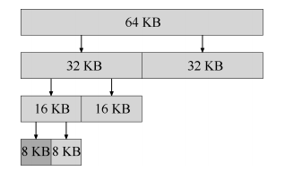

​		在这个例子中，最左边的 8KB 块被分配给用户（如上图中深灰色部分所示）。请注意，这种分配策略只允许分配 2 的整数次幂大小的空闲块，因此会有内部碎片（internal fragment）的麻烦。

​		伙伴系统的漂亮之处在于块被释放时。如果将这个 8KB 的块归还给空闲列表，分配程序会检查“伙伴”8KB 是否空闲。如果是，就合二为一，变成 16KB 的块。然后会检查这个 16KB 块的伙伴是否空闲，如果是，就合并这两块。这个递归合并过程继续上溯，直到合并整个内存区域，或者某一个块的伙伴还没有被释放。

​		伙伴系统运转良好的原因，在于很容易确定某个块的伙伴。怎么找？仔细想想上面例子中的各个块的地址。如果你想得够仔细，就会发现每对互为伙伴的块只有一位不同，正是这一位决定了它们在整个伙伴树中的层次。现在你应该已经大致了解了二分伙伴分配程序的工作方式。更多的细节可以参考 Wilson 的调查[W+95]。


#### 其他想法

**描述：** 除了上述方法，还有许多更复杂的内存分配技术，旨在提高分配速度和减少碎片。例如，平衡二叉树、伸展树、偏序树等数据结构都被用于改进内存分配的效率。这些数据结构通过优化空闲块的查找过程，提高了分配速度。

**多核系统的扩展：** 现代操作系统通常会运行多核处理器和多线程程序。为了在多核系统中提升分配程序的性能，人们提出了许多优化策略。例如，Berger 等人的方法和 Evans 的方法都是为了在多核系统中提高内存分配效率而设计的。

**挑战：** 内存分配器面临的一个持续挑战是如何在不同的工作负载下保持高效性和可扩展性。不同的应用程序对内存的使用方式各异，因此内存分配器需要灵活且高效地应对各种情况。

### 17.5 小结

在本章中，我们讨论了内存分配的基本策略以及一些高级的扩展方法。内存分配是现代计算机系统的一个关键组成部分，影响着系统的性能和效率。设计一个高效、灵活的内存分配器是一个复杂的任务，需要在多种策略之间进行权衡和优化。随着计算机系统的不断发展，内存分配器的设计也在不断演进，以适应新的挑战和需求。