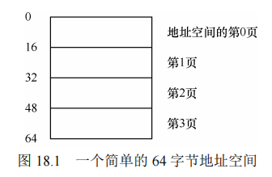
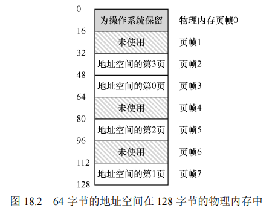
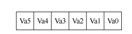
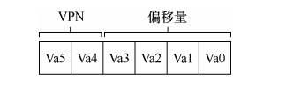
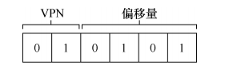
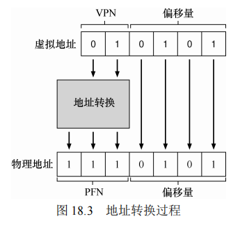
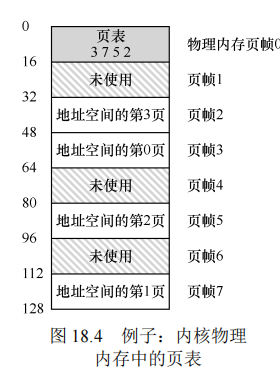
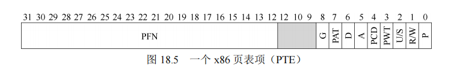
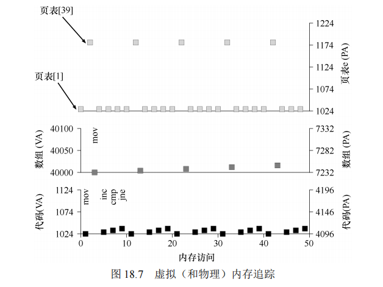

### 18.1 分页简介

在内存管理中，分页是一种将虚拟内存分割成固定大小的页面（page）的方法，每个页面对应物理内存中的一个页帧（page frame）。这与分段技术不同，分段是将内存分割成不同大小的段，容易导致外部碎片化问题。分页通过固定大小的页面解决了这一问题，简化了内存的管理和分配。

**原文：**

有时候人们会说，操作系统有两种方法，来解决大多数空间管理问题。第一种是将空间分割成不同长度的分片，就像虚拟内存管理中的分段。遗憾的是，这个解决方法存在固有的问题。具体来说，将空间切成不同长度的分片以后，空间本身会碎片化（fragmented），随着时间推移，分配内存会变得比较困难。

因此，值得考虑第二种方法：将空间分割成固定长度的分片。在虚拟内存中，我们称这种思想为分页，可以追溯到一个早期的重要系统，Atlas[KE+62, L78]。分页不是将一个进程的地址空间分割成几个不同长度的逻辑段（即代码、堆、段），而是分割成固定大小的单元，每个单元称为一页。相应地，我们把物理内存看成是定长槽块的阵列，叫作页帧（page frame）。每个这样的页帧包含一个虚拟内存页。我们的挑战是：

**关键问题：如何通过页来实现虚拟内存**

**如何通过页来实现虚拟内存，从而避免分段的问题？基本技术是什么？如何让这些技术运行良好，并尽可能减少空间和时间开销？**

### 关键问题：如何通过分页实现虚拟内存

分页技术解决了分段存在的碎片化问题，通过将内存分割成固定大小的页面，系统可以更加灵活和高效地管理内存，并且减少了复杂性。


#### 18.1 一个简单的例子

为了更清晰地理解分页的基本概念，考虑一个非常简单的示例。假设一个64字节的虚拟地址空间被分成4个16字节的虚拟页面。相应地，物理内存也由定长的页帧组成，在本例中为128字节，共8个页帧。

##### 页表和地址转换

操作系统通过页表（page table）来管理每个虚拟页面在物理内存中的位置。每个进程有自己的页表，记录虚拟页到物理页的映射。通过页表，操作系统可以在物理内存中找到进程虚拟地址空间中的页面。例如，假设一个进程的虚拟页0被映射到物理页帧3，虚拟页1被映射到物理页帧7，依此类推。

当进程访问虚拟地址时，系统需要将该虚拟地址转换为物理地址。这个转换过程分为两步：

1. **虚拟地址分解**：将虚拟地址分为虚拟页号（VPN）和页内偏移量（offset）。在我们的示例中，虚拟地址有6位，其中前2位为VPN，后4位为偏移量。
2. **地址转换**：通过页表将VPN转换为物理页号（PFN），并保留偏移量不变，最终构成物理地址。

##### 例子中的地址转换

假设进程访问虚拟地址21（在二进制中为010101）。首先，系统将其分解为虚拟页号01和偏移量0101。然后，通过查找页表，将虚拟页号01映射到物理页帧7。最终，物理地址为1110101（十进制为117），指向物理内存中正确的数据位置。

### 结论

通过分页，操作系统能够更加灵活地管理内存，避免了分段带来的碎片化问题。同时，分页简化了内存管理的复杂性，提高了系统的效率和可控性。在后续章节中，我们将进一步探讨分页的实现细节，包括页表的存储方式、分页的开销以及如何优化分页系统。

**==原文：==**

​		为了让该方法看起来更清晰，我们用一个简单例子来说明。图 18.1 展示了一个只有 64字节的小地址空间，有 4 个 16 字节的页（虚拟页 0、1、2、3）。



真实的地址空间肯定大得多，通常 32 位有 4GB 的地址空间，甚至有 64 位①。在本书中，我们常常用小例子，让大家更容易理解。

​		物理内存，如图 18.2 所示，也由一组固定大小的槽块组成。



在这个例子中，有 8 个页帧（由 128 字节物理内存构成，也是极小的）。从图中可以看出，虚拟地址空间的页放在物理内存的不同位置。图中还显示，操作系统自己用了一些物理内存。

​		可以看到，与我们以前的方法相比，分页有许多优点。可能最大的改进就是灵活性：通过完善的分页方法，操作系统能够高效地提供地址空间的抽象，不管进程如何使用地址空间。例如，我们不会假定堆和栈的增长方向，以及它们如何使用。

​		另一个优点是分页提供的空闲空间管理的简单性。例如，如果操作系统希望将 64 字节的小地址空间放到 8 页的物理地址空间中，它只要找到 4 个空闲页。也许操作系统保存了一个所有空闲页的空闲列表（free list），只需要从这个列表中拿出 4 个空闲页。在这个例子里，操作系统将地址空间的虚拟页 0 放在物理页帧 3，虚拟页 1 放在物理页帧 7，虚拟页 2放在物理页帧 5，虚拟页 3 放在物理页帧 2。页帧 1、4、6 目前是空闲的。


​		为了记录地址空间的每个虚拟页放在物理内存中的位置，操作系统通常为每个进程保存一个数据结构，称为页表（page table）。页表的主要作用是为地址空间的每个虚拟页面保存地址转换（address translation），从而让我们知道每个页在物理内存中的位置。对于我们的简单示例（见图 18.2），页表因此具有以下 4 个条目：（虚拟页 0→物理帧 3）、（VP 1→PF 7）、（VP 2→PF 5）和（VP 3→PF 2）。

​		重要的是要记住，这个页表是一个每进程的数据结构（我们讨论的大多数页表结构都是每进程的数据结构，我们将接触的一个例外是倒排页表，inverted page table）。如果在上面的示例中运行另一个进程，操作系统将不得不为它管理不同的页表，因为它的虚拟页显然映射到不同的物理页面（除了共享之外）。

​		现在，我们了解了足够的信息，可以完成一个地址转换的例子。设想拥有这个小地址空间（64 字节）的进程正在访问内存：

```
movl <virtual address>, %eax
```

具体来说，注意从地址<virtual address>到寄存器 eax 的数据显式加载（因此忽略之前肯

定会发生的指令获取）。

为了转换（translate）该过程生成的虚拟地址，我们必须首先将它分成两个组件：虚拟页面号（virtual page number，VPN）和页内的偏移量（offset）。对于这个例子，因为进程的虚拟地址空间是 64 字节，我们的虚拟地址总共需要 6 位（26 = 64）。因此，虚拟地址可以表示如下：



在该图中，Va5 是虚拟地址的最高位，Va0 是最低位。因为我们知道页的大小（16 字节），所以可以进一步划分虚拟地址，如下所示：



​		页面大小为 16 字节，位于 64 字节的地址空间。因此我们需要能够选择 4 个页，地址的前 2 位就是做这件事的。因此，我们有一个 2 位的虚拟页号（VPN）。其余的位告诉我们，感兴趣该页的哪个字节，在这个例子中是 4 位，我们称之为偏移量。

​		当进程生成虚拟地址时，操作系统和硬件必须协作，将它转换为有意义的物理地址。例如，让我们假设上面的加载是虚拟地址 21：

```
movl 21, %eax
```

将“21”变成二进制形式，是“010101”，因此我们可以检查这个虚拟地址，看看它是如何分解成虚拟页号（VPN）和偏移量的：



因此，虚拟地址“21”在虚拟页“01”（或 1）的第 5 个（“0101”）字节处。通过虚拟页号，我们现在可以检索页表，找到虚拟页 1 所在的物理页面。在上面的页表中，物理帧号（PFN）（有时也称为物理页号，physical page number 或 PPN）是 7（二进制 111）。因此，我们可以通过用 PFN 替换 VPN 来转换此虚拟地址，然后将载入发送给物理内存（见图 18.3）。

请注意，偏移量保持不变（即未翻译），因为偏移量只是告诉我们页面中的哪个字节是我们想要的。

我们的最终物理地址是 1110101（十进制 117），正是我们希望加载指令（见图 18.2）获取数据的地方。

有了这个基本概念，我们现在可以询问（希望也可以回答）关于分页的一些基本问题。例如，这些页表在哪里存储？页表的典型内容是什么，表有多大？分页是否会使系统变（得很）慢？这些问题和其他迷人的问题（至少部分）在下文中回答。请继续阅读！




### 18.2 页表存储位置

​		页表可以非常庞大，特别是在现代计算机中。例如，考虑一个典型的32位地址空间，页面大小为4KB，这意味着虚拟地址分为20位的虚拟页号（VPN）和12位的页内偏移量。因为虚拟页号有20位，所以操作系统需要为每个进程管理2^20（大约一百万）个地址转换。假设每个页表项（PTE）需要4个字节来保存物理地址和其他信息，这就意味着每个进程的页表需要4MB的内存空间。如果有100个进程同时运行，操作系统需要400MB的内存仅仅用来存储这些页表！这表明页表的存储需求非常大，尤其是在多任务环境下。

​		由于页表可能如此庞大，通常不会将页表存储在处理器的片上缓存或MMU（内存管理单元）中，而是将其存储在物理内存中。这意味着每次访问内存时都需要访问主存来查找页表中的信息，这可能会导致性能问题。为了应对这些问题，操作系统可能会在其物理内存中管理这些页表，并且可能会对内存进行进一步的虚拟化处理。

图 18.4 展示了操作系统内存中的页表，看到其中的一小组地址转换了吗？



### 18.3 页表的内容

页表是一种用于将虚拟地址（通常是虚拟页号）映射到物理地址（物理页帧号）的数据结构。最简单的页表结构是线性页表，它是一个数组。操作系统通过虚拟页号访问数组中的相应页表项，以查找物理帧号。

#### 页表项的组成部分

每个页表项（PTE）通常包含多个位，用于控制和管理虚拟内存：

- **有效位（Valid bit）**：指示某个地址转换是否有效。如果页面无效，访问它将导致操作系统产生异常并可能终止进程。有效位使操作系统能够支持稀疏地址空间，不必为每个页面都分配物理内存，从而节省了资源。
- **保护位（Protection bit）**：指示页面是否可以读、写或执行。试图以不允许的方式访问页面时，会触发操作系统异常处理。
- **存在位（Present bit）**：指示页面是否驻留在物理内存中。如果页面已被换出到磁盘，存在位将为0。
- **脏位（Dirty bit）**：指示页面自从加载到内存后是否被修改过。如果页面被修改过，在将其换出到磁盘之前需要将其写回。
- **参考位（Reference bit）**：又称为访问位，用于追踪页面是否被访问过。它在页面替换算法中非常重要，用于确定哪些页面应保留在内存中。

图 18.5 显示了来自 x86 架构的示例页表项[I09]。它包含一个存在位（P），确定是否允许写入该页面的读/写位（R/W） 确定用户模式进程是否可以访问该页面的用户/超级用户位（U/S），有几位（PWT、PCD、PAT 和 G）确定硬件缓存如何为这些页面工作，一个访问位（A）和一个脏位（D），最后是页帧号（PFN）本身。



### 18.4 分页：也很慢

在之前的章节中，我们了解到页表可以非常庞大，但它们不仅占用大量内存，还会导致系统变慢。让我们通过一个简单的指令来说明这一点：

```
movl 21, %eax
```

这个指令从虚拟地址 21 读取数据并存储在寄存器 `eax` 中。在执行这个指令时，系统必须首先将虚拟地址 21 转换为物理地址 117，然后从物理地址 117 读取数据。因此，在完成数据加载之前，系统需要访问页表来执行地址转换。

为了找到正确的页表项，硬件会执行以下步骤：

1. **提取虚拟页号（VPN）**：

   ```
   VPN = (VirtualAddress & VPN_MASK) >> SHIFT
   ```
   
2. **计算页表项的地址**：

   ```
   PTEAddr = PageTableBaseRegister + (VPN * sizeof(PTE))
   ```

在这个过程中，硬件会使用页表基址寄存器来指向页表的起始位置，然后通过 VPN 从页表中找到正确的页表项（PTE）。在上面的例子中，虚拟地址 21 对应的 VPN 是 1，页表基址寄存器指向页表的开始位置，硬件会计算出 PTE 的地址并从内存中读取。

一旦找到 PTE，硬件会检查页面是否有效并具有正确的访问权限。如果检查通过，硬件会使用物理页帧号（PFN）与偏移量结合，生成最终的物理地址，并从该地址加载数据到寄存器 `eax` 中。

这个过程涉及多个内存访问，包括页表的访问和实际数据的访问。每次内存访问都需要一个额外的内存引用来查找页表项，这大大增加了系统的开销。结果是，分页机制会使内存访问变得更慢，特别是在频繁内存访问的情况下，系统的性能可能会减慢两倍或更多。


**原文：**

​		内存中的页表，我们已经知道它们可能太大了。事实证明，它们也会让速度变慢。以简单的指令为例：

```
movl 21, %eax
```

​		同样，我们只看对地址 21 的显式引用，而不关心指令获取。在这个例子中，我们假定硬件为我们执行地址转换。要获取所需数据，系统必须首先将虚拟地址（21）转换为正确的物理地址（117）。因此，在从地址 117 获取数据之前，系统必须首先从进程的页表中提取适当的页表项，执行转换，然后从物理内存中加载数据。

​		为此，硬件必须知道当前正在运行的进程的页表的位置。现在让我们假设一个页表基址寄存器（page-table base register）包含页表的起始位置的物理地址。为了找到想要的 PTE的位置，硬件将执行以下功能：

```
VPN = (VirtualAddress & VPN_MASK) >> SHIFT 
PTEAddr = PageTableBaseRegister + (VPN * sizeof(PTE))
```

​		在我们的例子中，VPN MASK 将被设置为 0x30（十六进制 30，或二进制 110000），它从完整的虚拟地址中挑选出 VPN 位；SHIFT 设置为 4（偏移量的位数），这样我们就可以将VPN 位向右移动以形成正确的整数虚拟页码。例如，使用虚拟地址 21（010101），掩码将此值转换为 010000，移位将它变成 01，或虚拟页 1，正是我们期望的值。然后，我们使用该值作为页表基址寄存器指向的 PTE 数组的索引。

​		一旦知道了这个物理地址，硬件就可以从内存中获取 PTE，提取 PFN，并将它与来自虚拟地址的偏移量连接起来，形成所需的物理地址。具体来说，你可以想象 PFN 被 SHIFT左移，然后与偏移量进行逻辑或运算，以形成最终地址，如图 18.6 所示。

```
offset = VirtualAddress & OFFSET_MASK 
PhysAddr = (PFN << SHIFT) | offset 
1 // Extract the VPN from the virtual address 
2 VPN = (VirtualAddress & VPN_MASK) >> SHIFT 
3 
4 // Form the address of the page-table entry (PTE) 
5 PTEAddr = PTBR + (VPN * sizeof(PTE)) 
6 
7 // Fetch the PTE
8 PTE = AccessMemory(PTEAddr) 
9 
10 // Check if process can access the page 
11 if (PTE.Valid == False) 
12 RaiseException(SEGMENTATION_FAULT) 
13 else if (CanAccess(PTE.ProtectBits) == False) 
14 RaiseException(PROTECTION_FAULT) 
15 else 
16 // Access is OK: form physical address and fetch it 
17 offset = VirtualAddress & OFFSET_MASK 
18 PhysAddr = (PTE.PFN << PFN_SHIFT) | offset 
19 Register = AccessMemory(PhysAddr)
图 18.6 利用分页访问内存
```

​		最后，硬件可以从内存中获取所需的数据并将其放入寄存器 eax。程序现在已成功从内存中加载了一个值！

​		总之，我们现在描述了在每个内存引用上发生的情况的初始协议。基本方法如图 18.6所示。对于每个内存引用（无论是取指令还是显式加载或存储），分页都需要我们执行一个额外的内存引用，以便首先从页表中获取地址转换。工作量很大！额外的内存引用开销很大，在这种情况下，可能会使进程减慢两倍或更多。

​		现在你应该可以看到，有两个必须解决的实际问题。如果不仔细设计硬件和软件，页表会导致系统运行速度过慢，并占用太多内存。虽然看起来是内存虚拟化需求的一个很好的解决方案，但这两个关键问题必须先克服。


### 18.5 内存追踪

为了更好地理解分页如何影响系统性能，我们可以通过一个简单的内存访问示例来展示使用分页时发生的所有内存访问。假设我们有一个简单的 C 程序，它初始化一个数组：

```
int array[1000]; 
for (int i = 0; i < 1000; i++) 
    array[i] = 0;
```

在这个例子中，每次循环迭代都会访问内存，并执行以下操作：

1. 从页表中查找数组的虚拟地址对应的物理地址。
2. 将数据存储到对应的物理地址中。

假设虚拟地址空间为 64KB，页面大小为 1KB，页表存储在物理内存中。虚拟地址到物理地址的映射存储在页表中，每个内存访问都需要查找页表并进行地址转换。

在每次循环迭代中，系统需要执行 10 次内存访问，包括 4 次指令获取、1 次数据存储和 5 次页表访问。随着循环的继续，这些内存访问会随着不同的内存位置变化。


**原文：**

在结束之前，我们现在通过一个简单的内存访问示例，来演示使用分页时产生的所有

内存访问。我们感兴趣的代码片段（用 C 写的，名为 array.c）是这样的：

```
int array[1000]; 
... 
for (i = 0; i < 1000; i++) 
 array[i] = 0;
```

我们编译 array.c 并使用以下命令运行它：

```
prompt> gcc -o array array.c -Wall -O 
prompt> ./array
```


**补充：数据结构——页表**

**现代操作系统的内存管理子系统中最重要的数据结构之一就是页表（page table）。通常，页表存储虚拟—物理地址转换（virtual-to-physical address translation），从而让系统知道地址空间的每个页实际驻留在物理内存中的哪个位置。由于每个地址空间都需要这种转换，因此一般来说，系统中每个进程都有一个页表。页表的确切结构要么由硬件（旧系统）确定，要么由 OS（现代系统）更灵活地管理。**


当然，为了真正理解这个代码片段（它只是初始化一个数组）进程怎样的内存访问，我们必须知道（或假设）一些东西。首先，我们必须反汇编结果二进制文件（在 Linux 上使用 objdump 或在 Mac 上使用 otool），查看使用什么汇编指令来初始化循环中的数组。以下是生成的汇编代码：

```
0x1024 movl $0x0,(%edi,%eax,4) 
0x1028 incl %eax 
0x102c cmpl $0x03e8,%eax 
0x1030 jne 0x1024
```

​		如果懂一点 x86，代码实际上很容易理解①。第一条指令将零值（显示为$0x0）移动到数组位置的虚拟内存地址，这个地址是通过取%edi 的内容并将其加上%eax 乘以 4 来计算的。因此，%edi 保存数组的基址，而%eax 保存数组索引（i）。我们乘以 4，因为数组是一个整型数组，每个元素的大小为 4 个字节。

​		第二条指令增加保存在%eax 中的数组索引，第三条指令将该寄存器的内容与十六进制值 0x03e8 或十进制数 1000 进行比较。如果比较结果显示两个值不相等（这就是 jne 指令测试），第四条指令跳回到循环的顶部。

​		为了理解这个指令序列（在虚拟层和物理层）所访问的内存，我们必须假设虚拟内存中代码片段和数组的位置，以及页表的内容和位置。

​		对于这个例子，我们假设一个大小为 64KB 的虚拟地址空间（不切实际地小）。我们还假定页面大小为 1KB。我们现在需要知道页表的内容，以及它在物理内存中的位置。假设有一个线性（基于数组）的页表，它位于物理地址 1KB（1024）。

​		至于其内容，我们只需要关心为这个例子映射的几个虚拟页面。首先，存在代码所在的虚拟页面。由于页大小为 1KB，虚拟地址 1024 驻留在虚拟地址空间的第二页（VPN = 1，因为 VPN = 0 是第一页）。假设这个虚拟页映射到物理帧 4（VPN 1→PFN 4）。

​		接下来是数组本身。它的大小是 4000 字节（1000 整数），我们假设它驻留在虚拟地址40000 到 44000（不包括最后一个字节）。它的虚拟页的十进制范围是 VPN = 39……VPN = 42。因此，我们需要这些页的映射。针对这个例子，让我们假设以下虚拟到物理的映射： (VPN 39 → PFN 7), (VPN 40 → PFN 8), (VPN 41 → PFN 9), (VPN 42 → PFN 10) 

​		我们现在准备好跟踪程序的内存引用了。当它运行时，每个获取指将产生两个内存引用：一个访问页表以查找指令所在的物理框架，另一个访问指令本身将其提取到 CPU 进行处理。另外，在 mov 指令的形式中，有一个显式的内存引用，这会首先增加另一个页表访问（将数组虚拟地址转换为正确的物理地址），然后时数组访问本身。

​		图 18.7 展示了前 5 次循环迭代的整个过程。最下面的图显示了 *y* 轴上的指令内存引用（黑色虚拟地址和右边的实际物理地址）。中间的图以深灰色展示了数组访问（同样，虚拟在左侧，物理在右侧）；最后，最上面的图展示了浅灰色的页表内存访问（只有物理的，因为本例中的页表位于物理内存中）。整个追踪的 *x* 轴显示循环的前 5 个迭代中内存访问。每个循环有 10 次内存访问，其中包括 4 次取指令，一次显式更新内存，以及 5 次页表访问，为这 4 次获取和一次显式更新进行地址转换。



​		看看你是否可以理解在这个可视化中出现的模式。特别是，随着循环继续，超过前 5次迭代，会发生什么变化？哪些新的内存位置将被访问？你能弄明白吗？

​		这只是最简单的例子（只有几行 C 代码），但你可能已经能够感觉到理解实际应用程序的实际内存行为的复杂性。别担心：它肯定会变得更糟，因为我们即将引入的机制只会使这个已经很复杂的机器更复杂。


### 18.6 小结

分页是虚拟内存管理中的重要技术，提供了许多优点，如避免外部碎片和支持稀疏地址空间。然而，分页也带来了一些挑战，包括系统变慢和内存浪费。如果不加以改进，分页可能导致大量的额外内存访问，从而降低系统性能。接下来的章节将讨论如何优化分页系统，使其不仅能够工作，而且能高效工作。