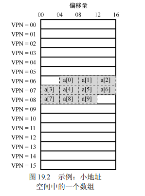
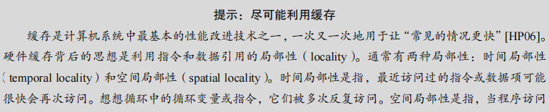
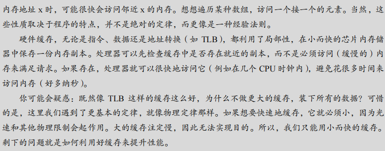
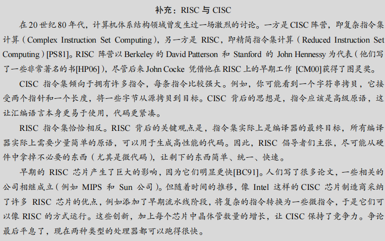
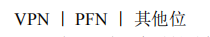
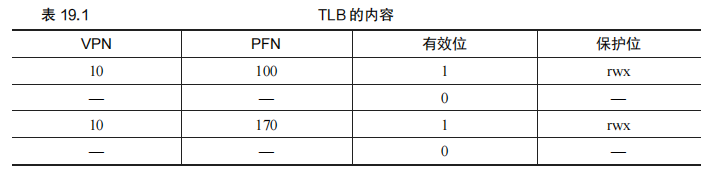
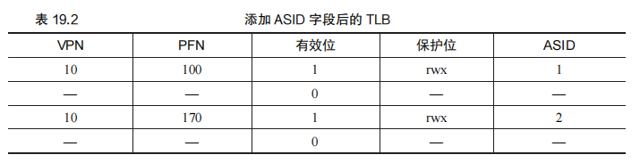
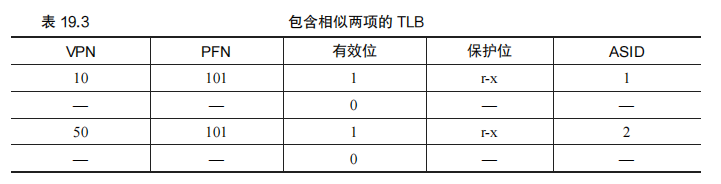
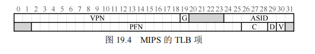

## 19 分页：快速地址转换（TLB）

​		==使用分页作为核心机制来实现虚拟内存，可能会带来较高的性能开销。因为要使用分页，就要将内存地址空间切分成大量固定大小的单元（页），并且需要记录这些单元的地址映射信息。因为这些映射信息一般存储在物理内存中，所以在转换虚拟地址时，分页逻辑上需要一次额外的内存访问。==**每次指令获取、显式加载或保存，都要额外读一次内存以得到转换信息，这慢得无法接受**。因此我们面临如下问题：


​		想让某些东西更快，操作系统通常需要一些帮助。帮助常常来自操作系统的老朋友：硬件。我们要增加所谓的（由于历史原因[CP78]）**地址转换旁路缓冲存储器**（translation-lookaside buffer，TLB[CG68,C95]），==它就是频繁发生的虚拟到物理地址转换的硬件缓存（cache）==。因此，更好的名称应该是地址转换缓存（address-translation cache）。==对每次内存访问，硬件先检查 TLB，看看其中是否有期望的转换映射，如果有，就完成转换（很快），不用访问页表（其中有全部的转换映射）==。TLB 带来了巨大的性能提升，实际上，因此它使得虚拟内存成为可能[C95]


### 19.1 TLB 的基本算法

在使用分页（paging）作为内存管理机制时，每次内存访问都需要进行虚拟地址到物理地址的转换。这种转换通常通过查阅页表（page table）来实现，但每次查找页表会导致额外的内存访问，从而引发性能问题。为了解决这一问题，硬件引入了地址转换旁路缓冲存储器（Translation Lookaside Buffer，TLB），它是用于缓存常用的虚拟到物理地址转换的硬件缓存。TLB 使得多数地址转换可以直接通过高速缓存完成，从而减少了对内存的访问次数。

TLB 的基本工作流程如下：

1. **提取虚拟页号（VPN）**：从虚拟地址中提取出虚拟页号（VPN），用于查找对应的物理页帧号（PFN）。
2. **查找 TLB**：硬件首先会在 TLB 中查找该 VPN 对应的转换映射。这一步称为 TLB 查找。
3. **TLB 命中（Hit）**：如果 TLB 中存在该 VPN 的映射（即 TLB 命中），硬件会提取出相应的 PFN，并结合虚拟地址的偏移量，计算出实际的物理地址。随后，硬件访问内存中的该物理地址，完成数据加载。
4. **TLB 未命中（Miss）**：如果 TLB 中没有找到该 VPN 的映射（即 TLB 未命中），硬件需要访问内存中的页表来获取该 VPN 的物理地址映射。页表查找完成后，TLB 会更新缓存条目，将新的映射加入其中。此时，硬件将重试这次内存访问，但由于 TLB 已经被更新，因此这次重试能够命中 TLB，从而快速完成地址转换。

TLB 的命中对于系统性能至关重要。如果命中率高，则大多数地址转换可以通过 TLB 快速完成，避免了频繁访问内存。而 TLB 的未命中则会引发额外的内存访问，带来显著的性能开销。

#### 原文：

图 19.1 展示了一个大体框架，说明硬件如何处理虚拟地址转换，假定使用简单的线性页表（linear page table，即页表是一个数组）和硬件管理的 TLB（hardware-managed TLB，即硬件承担许多页表访问的责任，下面会有更多解释）。

以下是您的代码格式化后的版本，并附有详细的注释和解释，以描述TLB（Translation Lookaside Buffer）控制流算法的工作流程：

```C
// 从虚拟地址中提取虚拟页号（VPN）
VPN = (VirtualAddress & VPN_MASK) >> SHIFT 

// 尝试从TLB中查找对应的VPN
(Success, TlbEntry) = TLB_Lookup(VPN) 

// 如果TLB查找成功（TLB命中）
if (Success == True)  // TLB Hit
    // 检查当前进程是否有权限访问页面
    if (CanAccess(TlbEntry.ProtectBits) == True) 
        // 提取偏移量
        Offset = VirtualAddress & OFFSET_MASK 
        // 构建物理地址
        PhysAddr = (TlbEntry.PFN << SHIFT) | Offset 
        // 访问物理内存
        AccessMemory(PhysAddr) 
    else 
        // 如果没有权限，抛出保护错误异常
        RaiseException(PROTECTION_FAULT) 
else  // 如果TLB查找失败（TLB未命中）
    // 计算页表项（PTE）的地址
    PTEAddr = PTBR + (VPN * sizeof(PTE)) 
    // 从内存中获取页表项
    PTE = AccessMemory(PTEAddr)
    
    // 检查页面是否有效
    if (PTE.Valid == False) 
        // 如果页面无效，抛出段错误异常
        RaiseException(SEGMENTATION_FAULT) 
    // 检查是否具有访问权限
    else if (CanAccess(PTE.ProtectBits) == False) 
        // 如果没有访问权限，抛出保护错误异常
        RaiseException(PROTECTION_FAULT) 
    else 
        // 将新页表项插入到TLB中
        TLB_Insert(VPN, PTE.PFN, PTE.ProtectBits) 
        // 重新尝试执行指令
        RetryInstruction() 
```

### 代码解释

1. **提取虚拟页号（VPN）**：
   - `VPN = (VirtualAddress & VPN_MASK) >> SHIFT`：从虚拟地址中提取虚拟页号，用于页表查找。
2. **TLB查找**：
   - `TLB_Lookup(VPN)`：尝试在TLB中查找对应的虚拟页号。如果找到（TLB命中），则返回成功标志和TLB条目。
3. **处理TLB命中**：
   - 如果TLB命中（`Success == True`），检查TLB条目中的保护位是否允许访问。
   - 如果有权限，提取偏移量并构建物理地址，然后通过物理地址访问内存。
   - 如果没有权限，抛出保护错误异常（`PROTECTION_FAULT`）。
4. **处理TLB未命中**：
   - 如果TLB未命中，计算页表项地址并从内存中获取页表项。
   - 检查页表项的有效位。如果页面无效，抛出段错误异常（`SEGMENTATION_FAULT`）。
   - 如果页面有效但没有权限访问，则抛出保护错误异常。
   - 如果页面有效且权限允许，将页表项插入到TLB中。
   - 重新尝试执行引发TLB未命中的指令（`RetryInstruction()`）。

#### 总结

​		==此代码实现了TLB控制流算法，用于加速虚拟地址到物理地址的转换过程。通过优先查询TLB缓存页表项，可以减少直接访问内存中的页表的开销，从而提高内存访问速度。TLB命中时直接使用缓存的页表项信息，而TLB未命中时则从内存中查找页表项，并将结果插入到TLB中以供未来使用。整个过程包括了权限检查和异常处理，确保内存访问的合法性和安全性。==

​		**硬件算法的大体流程如下：首先从虚拟地址中提取页号（VPN）（见图 19.1 第 1 行），然后检查 TLB 是否有该 VPN 的转换映射（第 2 行）。如果有，我们有了 TLB 命中（TLB hit），这意味着 TLB 有该页的转换映射。成功！接下来我们就可以从相关的 TLB 项中取出页帧号（PFN），与原来虚拟地址中的偏移量组合形成期望的物理地址（PA），并访问内存（第 5～7行），假定保护检查没有失败（第 4 行）。**

​			**如果 CPU 没有在 TLB 中找到转换映射（TLB 未命中），我们有一些工作要做。在本例中，硬件访问页表来寻找转换映射（第 11～12 行），并用该转换映射更新 TLB（第 18 行），假设该虚拟地址有效，而且我们有相关的访问权限（第 13、15 行）。**上述系列操作开销较大，主要是因为访问页表需要额外的内存引用（第 12 行）。最后，当 TLB 更新成功后，系统会重新尝试该指令，这时 TLB 中有了这个转换映射，内存引用得到很快处理。

​		TLB 和其他缓存相似，前提是在一般情况下，转换映射会在缓存中（即命中）。如果是这样，只增加了很少的开销，因为 TLB 处理器核心附近，设计的访问速度很快。如果 TLB未命中，就会带来很大的分页开销。必须访问页表来查找转换映射，导致一次额外的内存引用（或者更多，如果页表更复杂）。如果这经常发生，程序的运行就会显著变慢。相对于大多数 CPU 指令，内存访问开销很大，TLB 未命中导致更多内存访问。因此，我们希望尽可能避免 TLB 未命中。


### 19.2 示例：访问数组

为了更好地理解 TLB 的工作原理，以下通过一个简单的示例来说明 TLB 如何在实际内存访问中提高性能。

假设我们有一个包含 10 个 4 字节整型数的数组，数组的起始虚拟地址为 100。在这个虚拟地址空间中，每页大小为 16 字节，因此虚拟地址可以分成 4 位的虚拟页号（VPN）和 4 位的偏移量。

**内存布局**：

- 数组的第一个元素（a[0]）位于 VPN 为 6，偏移量为 4 的位置。
- 第二、第三个元素（a[1]、a[2]）与 a[0] 位于同一页中，因此它们共享相同的 VPN。
- 第四个元素（a[3]）位于下一个虚拟页（VPN=7），接下来的元素（a[4]…a[6]）也在这一页中。
- 最后，数组的最后 3 个元素（a[7]…a[9]）位于 VPN=8 的页面上。

**程序执行**：

```C
int sum = 0;
for (int i = 0; i < 10; i++) {
    sum += a[i];
}
```

在这个循环中，每次数组访问都会触发内存访问请求，并且需要进行地址转换。以下是 TLB 在每次数组访问中的表现：

1. **第一次访问 a[0]**：系统尝试加载地址 100，对应 VPN=6。因为这是第一次访问这个页面，TLB 未命中，系统需要查找页表并更新 TLB。
2. **访问 a[1] 和 a[2]**：由于它们和 a[0] 位于同一页，VPN=6，因此这两次访问都能命中 TLB，快速完成。
3. **访问 a[3]**：这次访问对应的新页面（VPN=7），TLB 未命中，系统再次需要查找页表并更新 TLB。
4. **访问 a[4] 到 a[6]**：这些元素都在 VPN=7 页内，因此能够命中 TLB。
5. **访问 a[7]**：触发了第三次 TLB 未命中，因为它位于新的页面（VPN=8）。再次查找页表并更新 TLB 后，TLB 命中后续访问。
6. **访问 a[8] 和 a[9]**：这两个元素都命中 TLB，快速完成。

**TLB 命中率**： 在这个例子中，数组的 10 次访问中有 7 次命中 TLB，3 次未命中，命中率为 70%。在程序首次访问数组时，未命中率相对较高，但随着数组访问的进行，TLB 中缓存了这些页面的映射，命中率逐渐提高。

**局部性**： 程序展示了良好的空间局部性，数组元素在内存中紧密排列，使得多次访问可以利用同一个 TLB 缓存条目。此外，如果数组再次被访问，时间局部性也会显现，因为 TLB 中已经缓存了之前的映射，后续访问将会表现出更高的命中率。

总结来说，TLB 有效地减少了内存访问延迟，通过缓存常用的地址映射，大大提高了内存访问性能。在处理内存密集型任务时，TLB 的作用尤为重要。


#### 原文：

​		为了弄清楚 TLB 的操作，我们来看一个简单虚拟地址追踪，看看 TLB 如何提高它的性能。在本例中，假设有一个由 10 个 4 字节整型数组成的数组，起始虚地址是 100。进一步假定，有一个 8 位的小虚地址空间，页大小为 16B。我们可以把虚地址划分为 4 位的 VPN（有 16 个虚拟内存页）和 4 位的偏移量（每个页中有 16 个字节）。

​		图 19.2 展示了该数组的布局，在系统的 16 个 16 字节的页上。如你所见，数组的第一项（a[0]）开始于（VPN=06，offset=04），只有 3 个 4 字节整型数存放在该页。数组在下一页（VPN=07）继续，其中有接下来 4 项（a[3] … a[6]）。10 个元素的数组的最后 3 项（a[7] … a[9]）位于地址空间的下一页（VPN=08）。



现在考虑一个简单的循环，访问数组中的每个元素，类似下面的 C 程序：

```C
int sum = 0; 
for (i = 0; i < 10; i++) { 
 sum += a[i]; 
}
```

​		简单起见，我们假装循环产生的内存访问只是针对数组（忽略变量 *i* 和 *sum*，以及指令本身）。当访问第一个数组元素（a[0]）时，CPU 会看到载入虚存地址 100。硬件从中提取VPN（VPN=06），然后用它来检查 TLB，寻找有效的转换映射。假设这里是程序第一次访问该数组，结果是 TLB 未命中。

​		接下来访问 a[1]，这里有好消息：TLB 命中！因为数组的第二个元素在第一个元素之后，它们在同一页。因为我们之前访问数组的第一个元素时，已经访问了这一页，所以 TLB中缓存了该页的转换映射。因此成功命中。访问 a[2]同样成功（再次命中），因为它和 a[0]、a[1]位于同一页。

​		遗憾的是，当程序访问 a[3]时，会导致 TLB 未命中。但同样，接下来几项（a[4] … a[6]）都会命中 TLB，因为它们位于内存中的同一页。

​		最后，访问 a[7]会导致最后一次 TLB 未命中。系统会再次查找页表，弄清楚这个虚拟页在物理内存中的位置，并相应地更新 TLB。最后两次访问（a[8]、a[9]）受益于这次 TLB更新，当硬件在 TLB 中查找它们的转换映射时，两次都命中。

​		我们来总结一下这 10 次数组访问操作中 TLB 的行为表现：未命中、命中、命中、未命中、命中、命中、命中、未命中、命中、命中。命中的次数除以总的访问次数，得到 TLB命中率（hit rate）为 70%。尽管这不是很高（实际上，我们希望命中率接近 100%），但也不是零，是零我们就要奇怪了。即使这是程序首次访问该数组，但得益于空间局部性（spatial locality），TLB 还是提高了性能。数组的元素被紧密存放在几页中（即它们在空间中紧密相邻），因此只有对页中第一个元素的访问才会导致 TLB 未命中。

​		也要注意页大小对本例结果的影响。如果页大小变大一倍（32 字节，而不是 16），数组访问遇到的未命中更少。典型页的大小一般为 4KB，这种情况下，密集的、基于数组的访问会实现极好的 TLB 性能，每页的访问只会遇到一次未命中。

​		关于 TLB 性能还有最后一点：如果在这次循环后不久，该程序再次访问该数组，我们会看到更好的结果，假设 TLB 足够大，能缓存所需的转换映射：命中、命中、命中、命中、命中、命中、命中、命中、命中、命中。在这种情况下，由于时间局部性（temporal locality），即在短时间内对内存项再次引用，所以 TLB 的命中率会很高。类似其他缓存，TLB 的成功依赖于空间和时间局部性。如果某个程序表现出这样的局部性（许多程序是这样），TLB 的命中率可能很高。






### 19.3 谁来处理 TLB 未命中

当系统发生 TLB 未命中时，有两种主要方式来处理这种情况：硬件处理和软件（操作系统）处理。

#### 硬件处理 TLB 未命中

在早期的复杂指令集计算机（CISC）体系结构中，硬件负责处理 TLB 未命中。这种方式下，硬件需要直接访问页表，以找到对应的页表项并更新 TLB。这种机制要求硬件知道页表的确切位置和格式。

具体流程如下：

1. **TLB 未命中**：硬件检测到未命中后，会自动查找存储在内存中的页表。
2. **页表查找**：硬件根据页表基址寄存器（Page-Table Base Register, PTBR）的内容，在内存中查找页表项。
3. **更新 TLB**：找到正确的页表项后，硬件将该转换映射更新到 TLB 中。
4. **重试指令**：更新后，硬件重新执行触发未命中的指令，这次可以直接命中 TLB。

这种方式的优势在于由硬件完全处理，无需操作系统介入，因此处理速度较快。然而，硬件必须固定支持特定的页表结构，这限制了操作系统设计的灵活性。

#### 软件（操作系统）处理 TLB 未命中

在现代精简指令集计算机（RISC）体系结构中，TLB 未命中通常由操作系统处理。这种方法灵活性更高，因为操作系统可以自由选择页表的结构和管理方式。

具体流程如下：

1. **TLB 未命中异常**：硬件检测到 TLB 未命中时，会抛出异常，暂停当前指令流，并将系统转入内核模式。
2. **调用陷阱处理程序**：操作系统的陷阱处理程序被调用，它负责处理这个异常。操作系统在该程序中查找页表，找到正确的页表项。
3. **更新 TLB**：操作系统使用特权指令将找到的页表项加载到 TLB 中。
4. **重试指令**：更新 TLB 后，操作系统返回控制权，硬件重试引发异常的指令，这次可以直接命中 TLB。

这种方法的主要优势在于灵活性：操作系统可以自行管理页表，采用任意数据结构来实现不同的优化策略。此外，硬件只需支持基本的异常处理，简化了硬件设计。

#### 关键区别

在硬件管理的 TLB 中，硬件处理所有细节，操作系统的角色相对较小；而在软件管理的 TLB 中，操作系统负责大部分的处理，这允许操作系统根据具体需求调整管理方式。

#### 防止递归

当操作系统处理 TLB 未命中时，必须避免处理过程本身再次引发 TLB 未命中，导致无限递归。常见的做法包括将处理程序的代码和数据直接映射到物理内存中，或者在 TLB 中保留一些始终有效的项，用于处理关键的内核任务。

#### RISC 与 CISC

在 20 世纪 80 年代，RISC 和 CISC 是计算机体系结构领域的两大流派。RISC 主张简化指令集，依赖编译器生成高效代码；而 CISC 则支持复杂的指令集，直接在硬件中处理更多任务。最终，现代处理器借鉴了两者的优势，融合了两种体系结构的特点，使得处理器在保持高性能的同时具备了更强的灵活性。

总结来说，现代操作系统倾向于使用软件管理的 TLB，因为它提供了更大的灵活性，允许操作系统根据需要进行优化，尽管它在处理 TLB 未命中时可能会稍慢一些。


#### 原文：

​		有一个问题我们必须回答：谁来处理 TLB 未命中？可能有两个答案：硬件或软件（操作系统）。以前的硬件有复杂的指令集（有时称为复杂指令集计算机，Complex-Instruction Set Computer，CISC），造硬件的人不太相信那些搞操作系统的人。因此，硬件全权处理 TLB未命中。为了做到这一点，硬件必须知道页表在内存中的确切位置（通过页表基址寄存器，page-table base register，在图 19.1 的第 11 行使用），以及页表的确切格式。发生未命中时，硬件会“遍历”页表，找到正确的页表项，取出想要的转换映射，用它更新 TLB，并重试该指令。这种“旧”体系结构有硬件管理的 TLB，一个例子是 x86 架构，它采用固定的多级页表（multi-level page table，详见第 20 章），当前页表由 CR3 寄存器指出[I09]。

​		更现代的体系结构（例如，MIPS R10k[H93]、Sun 公司的 SPARC v9[WG00]，都是精简指令集计算机，Reduced-Instruction Set Computer，RISC），有所谓的软件管理 TLB（softwaremanaged TLB）。发生 TLB 未命中时，硬件系统会抛出一个异常（见图 19.3 第 11 行），这会暂停当前的指令流，将特权级提升至内核模式，跳转至陷阱处理程序（trap handler）。接下来你可能已经猜到了，这个陷阱处理程序是操作系统的一段代码，用于处理 TLB 未命中。这段代码在运行时，会查找页表中的转换映射，然后用特别的“特权”指令更新 TLB，并从陷阱返回。此时，硬件会重试该指令（导致 TLB 命中）。

以下是图19.3中描述的TLB控制流算法的代码形式，加入了详细的注释和解释，以便理解操作系统如何处理TLB控制流：

```C
c复制代码// 从虚拟地址中提取虚拟页号（VPN）
// 使用 VPN_MASK 提取虚拟地址中的虚拟页号部分，并将其右移到合适的位置
VPN = (VirtualAddress & VPN_MASK) >> SHIFT 

// 尝试从TLB中查找对应的VPN
// TLB_Lookup 函数返回查找是否成功的标志（Success）以及相应的TLB条目（TlbEntry）
(Success, TlbEntry) = TLB_Lookup(VPN) 

// 如果TLB查找成功（TLB命中）
if (Success == True)  // TLB Hit
    // 检查当前进程是否有权限访问页面
    // TlbEntry.ProtectBits 包含页面的保护位，用于访问权限检查
    if (CanAccess(TlbEntry.ProtectBits) == True) 
        // 提取偏移量
        // 使用 OFFSET_MASK 提取虚拟地址中的偏移部分
        Offset = VirtualAddress & OFFSET_MASK 
        // 构建物理地址
        // 将 TLB 条目中的页面框号（PFN）与偏移量结合，形成物理地址
        PhysAddr = (TlbEntry.PFN << SHIFT) | Offset 
        // 从物理地址访问内存，并将结果存入寄存器
        Register = AccessMemory(PhysAddr) 
    else 
        // 如果没有权限访问，抛出保护错误异常
        RaiseException(PROTECTION_FAULT) 
else  // 如果TLB查找失败（TLB未命中）
    // 抛出 TLB 未命中异常
    // 这通常会让操作系统进行页表查找或其他处理来解决未命中问题
    RaiseException(TLB_MISS)
```

### 代码解释

1. **提取虚拟页号（VPN）**：
   - `VPN = (VirtualAddress & VPN_MASK) >> SHIFT`：这一步从虚拟地址中提取虚拟页号，用于页表或TLB查找。`VPN_MASK` 用于提取VPN的部分，而 `SHIFT` 用于将该部分右移到正确的位置。
2. **TLB查找**：
   - `TLB_Lookup(VPN)`：尝试在TLB中查找与提取的虚拟页号对应的TLB条目。返回查找成功标志和查找到的TLB条目。
3. **处理TLB命中**：
   - 如果TLB命中（`Success == True`），程序检查当前TLB条目中的保护位（`ProtectBits`）以确定是否有权限访问该页面。
   - 如果访问权限允许（`CanAccess(TlbEntry.ProtectBits) == True`），则提取虚拟地址中的偏移量，将TLB条目中的页面框号（PFN）与偏移量结合形成物理地址，并访问内存获取数据。
   - 如果没有权限访问，抛出保护错误异常（`PROTECTION_FAULT`）。
4. **处理TLB未命中**：
   - 如果TLB查找失败（`Success == False`），抛出TLB未命中异常（`TLB_MISS`）。
   - 该异常通常会让操作系统进一步处理，如从页表查找相应的页面框号（PFN）并更新TLB，或者处理页面不在内存的情况。

### 总结

这段代码展示了TLB（转换后备缓冲器）在内存访问过程中如何加速虚拟地址到物理地址的转换。当TLB命中时，系统能够快速完成地址转换并进行内存访问；当TLB未命中时，系统抛出异常，通常由操作系统处理未命中情况，包括查找页表和更新TLB。此机制极大地提高了内存访问效率，减少了直接访问页表的开销。

​		接下来讨论几个重要的细节。首先，这里的从陷阱返回指令稍稍不同于之前提到的服务于系统调用的从陷阱返回。在后一种情况下，从陷阱返回应该继续执行陷入操作系统之后那条指令，就像从函数调用返回后，会继续执行此次调用之后的语句。在前一种情况下，在从 TLB 未命中的陷阱返回后，硬件必须从导致陷阱的指令继续执行。这次重试因此导致该指令再次执行，但这次会命中 TLB。因此，根据陷阱或异常的原因，系统在陷入内核时必须保存不同的程序计数器，以便将来能够正确地继续执行。

​		第二，在运行 TLB 未命中处理代码时，操作系统需要格外小心避免引起 TLB 未命中的无限递归。有很多解决方案，例如，可以把 TLB 未命中陷阱处理程序直接放到物理内存中 [它们没有映射过（unmapped），不用经过地址转换]。或者在 TLB 中保留一些项，记录永久有效的地址转换，并将其中一些永久地址转换槽块留给处理代码本身，这些被监听的（wired）地址转换总是会命中 TLB。

​		软件管理的方法，主要优势是灵活性：操作系统可以用任意数据结构来实现页表，不需要改变硬件。另一个优势是简单性。从 TLB 控制流中可以看出（见图 19.3 的第 11 行，对比图 19.1 的第 11～19 行），硬件不需要对未命中做太多工作，它抛出异常，操作系统的未命中处理程序会负责剩下的工作。




### 19.4 TLB 的内容

​		TLB（Translation Lookaside Buffer，地址转换旁路缓冲存储器）是一个关键的硬件组件，用于加速虚拟地址到物理地址的转换。TLB 的内容决定了系统在执行地址转换时的速度和效率。典型的 TLB 大小通常为 32、64 或 128 项，并且是全相联的（fully associative）。全相联意味着 TLB 中的每一项可以存储任何虚拟地址到物理地址的映射，并且硬件可以并行地查找这些映射，找到所需的地址转换。

#### TLB 项的结构

每个 TLB 项通常包含以下几个部分：

- **虚拟页号 (VPN)**：用于标识虚拟地址中的页号。每个虚拟地址都可以分为 VPN 和偏移量两部分。VPN 是 TLB 查找的关键部分。

- **物理帧号 (PFN)**：映射到物理内存中的页帧号。当硬件找到匹配的 VPN 时，它会返回对应的 PFN，并将其与原虚拟地址的偏移量组合，生成实际的物理地址。

- 其他位：除了 VPN 和 PFN，TLB 项还包含一些额外的信息，用于确保内存访问的正确性和安全性。这些位包括：

  - **有效位 (Valid bit)**：指示该 TLB 项是否包含有效的地址映射。如果 TLB 项无效，那么即使 VPN 匹配，也不会使用该项的地址转换信息。
  - **保护位 (Protection bits)**：这些位用来确定对该页的访问权限，例如是否允许读取、写入或执行。如果进程试图进行未授权的访问，硬件将触发异常，通常由操作系统来处理。
  - **地址空间标识符 (Address-Space Identifier, ASID)**：在支持多进程的系统中，ASID 用于标识 TLB 项属于哪个进程，从而避免不同进程之间的地址映射混淆。ASID 允许多个进程共享一个 TLB，而无需在每次上下文切换时清空 TLB。

#### TLB 有效位与页表有效位的区别

TLB 的有效位与页表中的有效位有着不同的含义。页表中的有效位是指特定页表项是否有效，如果无效，表示该页未被进程使用，任何对此页的访问都会触发操作系统的异常处理，通常会导致进程终止。

相反，TLB 中的有效位仅仅表明该 TLB 项是否包含有效的地址映射。系统启动时，TLB 通常是空的，所有项的有效位都被置为无效状态。当进程开始运行并访问内存时，TLB 会逐渐被填满，有效项逐步增加。上下文切换时，通常会将 TLB 中所有项的有效位设置为无效，以防止新的进程错误地使用上一个进程的地址映射。

#### 其他关键位

除了有效位和保护位，TLB 中还可能包含以下位：

- **脏位 (Dirty bit)**：指示该页是否被修改过。如果页被修改，脏位会被设置为 1，这在页被换出时尤为重要。
- **参考位 (Reference bit)**：也称为访问位（Accessed bit），用于跟踪页面是否被访问过。这些信息对于实现页替换算法非常有用。

TLB 中的这些位为操作系统和硬件提供了必要的信息，以确保地址转换的正确性和效率，并在上下文切换和内存管理过程中提供必要的支持。


#### 原文：

我们来详细看一下硬件 TLB 中的内容。典型的 TLB 有 32 项、64 项或 128 项，并且是全相联的（fully associative）。基本上，这就意味着一条地址映射可能存在 TLB 中的任意位置，硬件会并行地查找 TLB，找到期望的转换映射。一条 TLB 项内容可能像下面这样：



​		注意，VPN 和 PFN 同时存在于 TLB 中，因为一条地址映射可能出现在任意位置（用硬件的术语，TLB 被称为全相联的（fully-associative）缓存）。硬件并行地查找这些项，看看是否有匹配。

​		更有趣的是“其他位”。例如，TLB 通常有一个有效（valid）位，用来标识该项是不是有效地转换映射。通常还有一些保护（protection）位，用来标识该页是否有访问权限。例如，代码页被标识为可读和可执行，而堆的页被标识为可读和可写。还有其他一些位，包括地址空间标识符（address-space identifier）、脏位（dirty bit）等。下面会介绍更多信息。


**补充：TLB 的有效位!=页表的有效位**

​		**常见的错误是混淆 TLB 的有效位和页表的有效位。在页表中，如果一个页表项（PTE）被标记为无效，就意味着该页并没有被进程申请使用，正常运行的程序不应该访问该地址。当程序试图访问这样的页时，就会陷入操作系统，操作系统会杀掉该进程。**

​		**TLB 的有效位不同，只是指出 TLB 项是不是有效的地址映射。例如，系统启动时，所有的 TLB 项通常被初始化为无效状态，因为还没有地址转换映射被缓存在这里。一旦启用虚拟内存，当程序开始运行，访问自己的虚拟地址，TLB 就会慢慢地被填满，因此有效的项很快会充满 TLB。**

​		**TLB 有效位在系统上下文切换时起到了很重要的作用，后面我们会进一步讨论。通过将所有 TLB项设置为无效，系统可以确保将要运行的进程不会错误地使用前一个进程的虚拟到物理地址转换映射。**


### 19.5 上下文切换时对 TLB 的处理

当系统进行上下文切换时（即从一个进程切换到另一个进程），由于不同进程的虚拟地址空间是独立的，因此存储在 TLB 中的虚拟到物理地址映射信息对于新进程是无效的。如果不加以处理，新进程可能会误用前一个进程的地址映射，导致错误的内存访问。这就引出了一个重要的问题：在上下文切换时，如何处理 TLB 的内容？

#### 1. 清空（Flush）TLB

最直接的解决方案是在每次上下文切换时清空 TLB。清空操作会将 TLB 中所有的有效位（valid bit）置为 0，这样在新进程开始执行时，TLB 会被重新填充当前进程的地址映射。这种方法可以确保不同进程之间的地址映射不会混淆，但它也有一个明显的缺点：每次切换到新进程时，TLB 必须重新加载映射，导致初次访问的内存操作都会触发 TLB 未命中，增加了开销。

清空 TLB 的操作通常可以通过软件管理的方式来实现，例如在操作系统中通过特权指令来执行。此外，如果是硬件管理的 TLB，硬件也可以在检测到页表基址寄存器（Page-Table Base Register, PTBR）变化时自动清空 TLB。

#### 2. 使用地址空间标识符（ASID）

为了解决每次上下文切换都要清空 TLB 的开销问题，一些系统引入了地址空间标识符（Address Space Identifier, ASID）。ASID 是一个小的标识符，通常比进程标识符（PID）短（例如，ASID 可能只有 8 位，而 PID 通常有 32 位），用来标识 TLB 中的每一条转换映射属于哪个进程。

当 TLB 中的每个条目都包含 ASID 时，系统可以在上下文切换时不清空 TLB，因为硬件会检查当前进程的 ASID，确保只有与当前进程 ASID 匹配的 TLB 项才会被使用。这样一来，TLB 可以同时保存多个进程的地址映射信息，不同进程间不会相互干扰。

例如，假设进程 P1 的 ASID 是 1，P2 的 ASID 是 2。当 TLB 中存在 P1 和 P2 的地址映射时，硬件可以通过检查 ASID 字段来区分这些映射属于哪个进程，从而避免误用。这个方法的一个显著优势是减少了 TLB 未命中的频率，提高了系统的性能，尤其是在频繁上下文切换的场景下。

#### 3. 处理特殊情况

还有一种特殊情况需要考虑，即当两个不同的进程共享相同的物理页时，如何处理 TLB 中的映射。例如，两个进程 P1 和 P2 可能会共享同一个代码段，而这个代码段位于相同的物理页内。在这种情况下，虽然两个进程的虚拟页号不同，但它们的物理页号相同。此时，ASID 的使用能够确保即使两个进程共享相同的物理页，它们的虚拟地址空间依然是独立的，不会因为共享的物理页而导致混淆。

通过引入 ASID，不同进程可以在同一个 TLB 中同时拥有自己的地址映射，从而避免了在每次上下文切换时频繁清空 TLB 的性能开销。

总结来说，TLB 在上下文切换时的处理方法主要有两种：清空 TLB 和使用 ASID。清空 TLB 是一种简单但性能较低的方案，而使用 ASID 则提供了一种高效的方法，能够在保证不同进程地址空间独立性的同时提高系统性能。


==原文：==

​		有了 TLB，在进程间切换时（因此有地址空间切换），会面临一些新问题。具体来说，TLB 中包含的虚拟到物理的地址映射只对当前进程有效，对其他进程是没有意义的。所以在发生进程切换时，硬件或操作系统（或二者）必须注意确保即将运行的进程不要误读了之前进程的地址映射。

​		为了更好地理解这种情况，我们来看一个例子。当一个进程（P1）正在运行时，假设TLB 缓存了对它有效的地址映射，即来自 P1 的页表。对这个例子，假设 P1 的 10 号虚拟页映射到了 100 号物理帧。

​		在这个例子中，假设还有一个进程（P2），操作系统不久后决定进行一次上下文切换，运行 P2。这里假定 P2 的 10 号虚拟页映射到 170 号物理帧。如果这两个进程的地址映射都在 TLB 中，TLB 的内容如表 19.1 所示。



在上面的 TLB 中，很明显有一个问题：VPN 10 被转换成了 PFN 100（P1）和 PFN 170（P2），但硬件分不清哪个项属于哪个进程。所以我们还需要做一些工作，让 TLB 正确而高效地支持跨多进程的虚拟化。因此，关键问题是：

**关键问题：进程切换时如何管理 TLB 的内容**

**如果发生进程间上下文切换，上一个进程在 TLB 中的地址映射对于即将运行的进程是无意义的。硬件或操作系统应该做些什么来解决这个问题呢？**


​		这个问题有一些可能的解决方案。一种方法是在上下文切换时，简单地清空（flush）TLB，这样在新进程运行前 TLB 就变成了空的。如果是软件管理 TLB 的系统，可以在发生上下文切换时，通过一条显式（特权）指令来完成。如果是硬件管理 TLB，则可以在页表基址寄存器内容发生变化时清空 TLB（注意，在上下文切换时，操作系统必须改变页表基址寄存器（PTBR）的值）。不论哪种情况，清空操作都是把全部有效位（valid）置为 0，本质上清空了 TLB。

​		上下文切换的时候清空 TLB，这是一个可行的解决方案，进程不会再读到错误的地址映射。但是，有一定开销：每次进程运行，当它访问数据和代码页时，都会触发 TLB 未命中。如果操作系统频繁地切换进程，这种开销会很高。

​		为了减少这种开销，一些系统增加了硬件支持，实现跨上下文切换的 TLB 共享。比如有的系统在 TLB 中添加了一个地址空间标识符（Address Space Identifier，ASID）。可以把ASID 看作是进程标识符（Process Identifier，PID），但通常比 PID 位数少（PID 一般 32 位，ASID 一般是 8 位）。

​		如果仍以上面的 TLB 为例，加上 ASID，很清楚不同进程可以共享 TLB 了：只要 ASID字段来区分原来无法区分的地址映射。表 19.2 展示了添加 ASID 字段后的 TLB。



​		因此，有了地址空间标识符，TLB 可以同时缓存不同进程的地址空间映射，没有任何冲突。当然，硬件也需要知道当前是哪个进程正在运行，以便进行地址转换，因此操作系统在上下文切换时，必须将某个特权寄存器设置为当前进程的 ASID。

​		补充一下，你可能想到了另一种情况，TLB 中某两项非常相似。在表 19.3 中，属于两个不同进程的两项，将两个不同的 VPN 指向了相同的物理页。



​		如果两个进程共享同一物理页（例如代码段的页），就可能出现这种情况。在上面的例子中，进程 P1 和进程 P2 共享 101 号物理页，但是 P1 将自己的 10 号虚拟页映射到该物理页，而 P2 将自己的 50 号虚拟页映射到该物理页。共享代码页（以二进制或共享库的方式）是有用的，因为它减少了物理页的使用，从而减少了内存开销。

### 19.6 TLB 替换策略

TLB（Translation Lookaside Buffer）是虚拟内存系统中至关重要的硬件缓存，用于加速虚拟地址到物理地址的转换。然而，TLB 的容量是有限的，这意味着在需要插入新地址映射时，必须替换掉一个旧项。这就引发了一个关键问题：如何选择合适的替换策略，最大限度地减少 TLB 未命中率？

#### 关键问题：如何设计 TLB 替换策略

在 TLB 中替换哪个旧项是一个至关重要的设计决策。一个好的替换策略可以显著减少 TLB 未命中率，从而提升系统性能。以下是几种常见的 TLB 替换策略：

1. **最近最少使用（Least Recently Used, LRU）策略**：
   - LRU 策略基于内存访问的局部性原理，假设最近使用过的项更有可能在短期内再次使用，而较久未使用的项可能不会很快被访问。LRU 会替换掉最久未使用的 TLB 项。
   - **优点**：LRU 能够较好地适应具有强时间局部性的访问模式，因此在许多实际应用中表现良好。
   - **缺点**：实现 LRU 策略需要额外的硬件复杂度来记录和管理每个 TLB 项的使用顺序，这可能增加系统的实现成本。
2. **随机（Random）策略**：
   - 随机策略在每次需要替换时，随机选择一个 TLB 项进行替换。
   - **优点**：实现简单，不需要额外的硬件开销和复杂的算法逻辑。
   - **缺点**：未命中率相对较高，尤其是在程序的访问模式具有明显局部性时，随机替换可能不如 LRU 有效。
3. **FIFO（First In, First Out）策略**：
   - FIFO 策略会替换掉最早插入 TLB 的项，即先进先出。
   - **优点**：实现相对简单，不需要跟踪每个项的使用历史，只需记录插入顺序。
   - **缺点**：FIFO 可能无法充分利用程序的局部性，因为它忽略了项的使用频率和最近访问情况。
4. **LFU（Least Frequently Used）策略**：
   - LFU 策略会替换掉使用频率最低的 TLB 项，基于这样的假设：使用频率低的项未来被访问的可能性较小。
   - **优点**：在一些重复访问模式下，LFU 可能比 LRU 更有效。
   - **缺点**：需要额外的硬件或算法来跟踪每个项的访问次数，这增加了复杂性。此外，LFU 可能对突发访问模式反应迟缓。

在选择 TLB 替换策略时，需要平衡复杂性与性能收益。尽管 LRU 通常被认为是一个合理的选择，但其实现难度较大；随机策略虽然简单，但可能在特定情况下表现不佳。因此，具体选择应结合系统设计目标和典型工作负载的特性。

### 19.7 实际系统的 TLB 表项

在实际系统中，TLB 的设计和实现因架构不同而有所差异。以下是 MIPS R4000 处理器的 TLB 设计，展示了如何在现代硬件中管理虚拟地址到物理地址的转换。

#### MIPS R4000 TLB 表项结构

MIPS R4000 是一种使用软件管理 TLB 的现代处理器，其 TLB 表项设计如图 19.4 所示。

**图 19.4 MIPS 的 TLB 项**（示意图请自行补充）

MIPS R4000 支持 32 位地址空间，页大小为 4KB。因此，在典型的虚拟地址中，我们会看到 20 位的虚拟页号（VPN）和 12 位的偏移量。然而，在 MIPS TLB 中，虚拟页号（VPN）实际上只有 19 位，因为用户地址空间只占整个地址空间的一半（其余部分留给内核）。VPN 在 TLB 中转换为最大 24 位的物理页帧号（PFN），这意味着 MIPS R4000 可以支持最多 64GB 物理内存（224 个 4KB 页）。

MIPS TLB 还包含一些其他有用的标志位：

- **全局位（Global, G）**：指示该页是否为所有进程全局共享。如果设置为 1，则忽略 ASID（地址空间标识符），使得该页映射对所有进程都有效。
- **ASID（地址空间标识符）**：通常为 8 位，用于区分不同进程的地址空间。ASID 有效解决了在不同进程间切换时，TLB 中地址映射的冲突问题。
- **一致性位（Coherence, C）**：用于控制该页在缓存中的一致性策略（此部分超出了本书的范围）。
- **脏位（Dirty bit, D）**：指示该页是否已被修改。脏位通常用于写回策略的管理，帮助操作系统决定是否将页面写回到磁盘。
- **有效位（Valid bit, V）**：指示该项是否为有效的地址映射，帮助硬件区分哪些 TLB 项可以用于地址转换。

MIPS 的 TLB 通常有 32 项或 64 项，大多数项目供用户进程使用，还有一些项目为操作系统保留。这些保留的项用于关键时刻，特别是在 TLB 未命中处理程序中，这些情况下 TLB 未命中可能会导致严重的性能问题。

由于 MIPS TLB 是软件管理的，系统提供了一些指令来操作 TLB，包括：

- **TLBP**：查找指定的转换映射是否在 TLB 中。
- **TLBR**：读取 TLB 中的内容到指定寄存器中。
- **TLBWI**：替换指定的 TLB 项。
- **TLBWR**：随机替换一个 TLB 项。

这些指令是特权指令，只能由操作系统使用。这样可以避免用户程序恶意或错误地修改 TLB 的内容，确保系统的稳定性和安全性。


==原文：==

​		最后，我们简单看一下真实的 TLB。这个例子来自 MIPS R4000[H93]，它是一种现代的系统，采用软件管理 TLB。图 19.4 展示了稍微简化的 MIPS TLB 项。



​		MIPS R4000 支持 32 位的地址空间，页大小为 4KB。所以在典型的虚拟地址中，预期会看到 20 位的 VPN 和 12 位的偏移量。但是，你可以在 TLB 中看到，只有 19 位的 VPN。事实上，用户地址只占地址空间的一半（剩下的留给内核），所以只需要 19 位的 VPN。VPN转换成最大 24 位的物理帧号（PFN），因此可以支持最多有 64GB 物理内存（224个 4KB 内存页）的系统。

​		MIPS TLB 还有一些有趣的标识位。比如全局位（Global，G），用来指示这个页是不是所有进程全局共享的。因此，如果全局位置为 1，就会忽略 ASID。我们也看到了 8 位的 ASID，操作系统用它来区分进程空间（像上面介绍的一样）。这里有一个问题：如果正在运行的进程数超过 256（28 ）个怎么办？最后，我们看到 3 个一致性位（Coherence，C），决定硬件如何缓存该页（其中一位超出了本书的范围）；脏位（dirty），表示该页是否被写入新数据（后面会介绍用法）；有效位（valid），告诉硬件该项的地址映射是否有效。还有没在图 19.4 中展示的页掩码（page mask）字段，用来支持不同的页大小。后面会介绍，为什么更大的页可能有用。最后，64 位中有一些未使用（图 19.4 中灰色部分）。

​		MIPS 的 TLB 通常有 32 项或 64 项，大多数提供给用户进程使用，也有一小部分留给操作系统使用。操作系统可以设置一个被监听的寄存器，告诉硬件需要为自己预留多少 TLB槽。这些保留的转换映射，被操作系统用于关键时候它要使用的代码和数据，在这些时候，TLB 未命中可能会导致问题（例如，在 TLB 未命中处理程序中）。

​		由于 MIPS 的 TLB 是软件管理的，所以系统需要提供一些更新 TLB 的指令。MIPS 提供了 4 个这样的指令：TLBP，用来查找指定的转换映射是否在 TLB 中；TLBR，用来将 TLB中的内容读取到指定寄存器中；TLBWI，用来替换指定的 TLB 项；TLBWR，用来随机替换一个 TLB 项。操作系统可以用这些指令管理 TLB 的内容。当然这些指令是特权指令，这很关键。如果用户程序可以任意修改 TLB 的内容，你可以想象一下会发生什么可怕的事情。

### 19.8 小结

在本章中，我们探讨了通过使用 TLB 来加速地址转换的方法。TLB 是一个小型、高速的缓存，用于存储虚拟地址到物理地址的转换信息，极大地减少了每次内存访问时的页表查找开销，使虚拟内存系统的性能接近于没有虚拟化的情况下。

然而，TLB 的局限性也显而易见。当程序短时间内访问的页数超过 TLB 的容量时，会导致大量的 TLB 未命中，显著降低系统性能。为了应对这种情况，现代处理器通常支持更大的页，增加 TLB 的覆盖范围。此外，TLB 访问本身也可能成为 CPU 流水线的瓶颈，特别是在涉及物理地址索引缓存时。这些问题促使研究人员开发了各种优化技术，例如虚拟地址索引缓存，以改善性能。

总的来说，TLB 是现代计算机体系结构中的一个关键组件，它的设计和优化直接影响到系统的整体性能。理解 TLB 的工作原理和优化策略对于系统设计者和操作系统开发者来说至关重要。