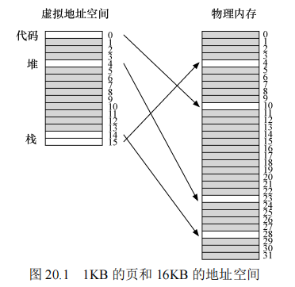
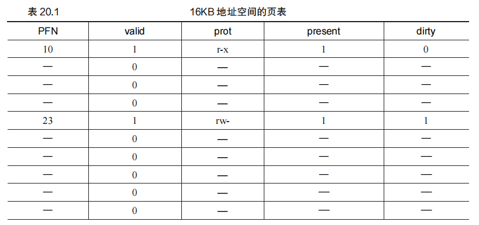
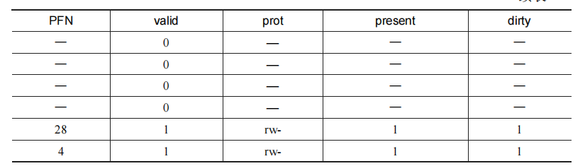
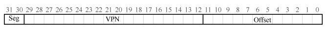
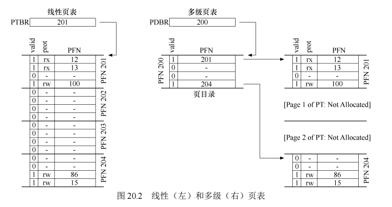
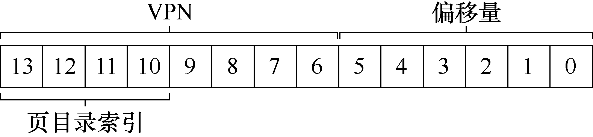
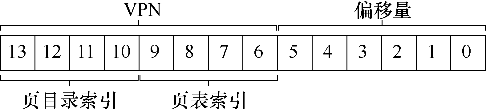
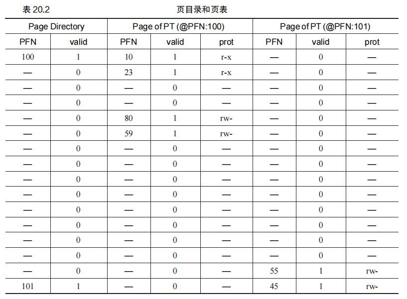
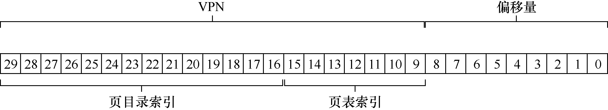
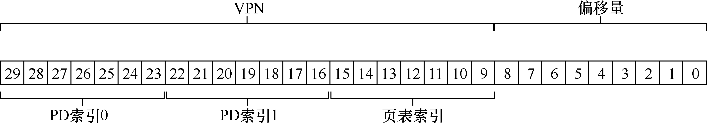

## 第20章 分页：较小的表

​		我们现在来解决分页引入的第二个问题：页表太大，因此消耗的内存太多。让我们从线性页表开始。你可能会记得①，线性页表变得相当大。假设一个 32 位地址空间（232 字节），4KB（212 字节）的页和一个 4 字节的页表项。一个地址空间中大约有一百万个虚拟页面（232/212）。乘以页表项的大小，你会发现页表大小为 4MB。回想一下：通常系统中的每个进程都有一个页表！有一百个活动进程（在现代系统中并不罕见），就要为页表分配数百兆的内存！因此，要寻找一些技术来减轻这种沉重的负担。有很多方法，所以我们开始吧。

但先看我们的关键问题：

**关键问题：如何让页表更小？**

**简单的基于数组的页表（通常称为线性页表）太大，在典型系统上占用太多内存。如何让页表更小？**

**关键的思路是什么？由于这些新的数据结构，会出现什么效率影响？**

### 20.1 简单的解决方案：更大的页

解决页表过大的一个简单方法是增大页面的大小。通过增大页的大小，页表中的页数减少，从而显著减小页表的大小。

#### 关键问题：如何让页表更小？

​		假设我们有一个 32 位地址空间，其中页大小为 4KB。这样，我们需要 20 位的虚拟页号（VPN），再加上 12 位的页内偏移量。每个页表项的大小为 4 字节，则页表中总共有 220 个项，因此页表的总大小为 4MB。这个大小对于每个进程来说非常庞大，尤其是当有多个进程同时运行时。

​		如果我们将页面大小增加到 16KB，虚拟页号减少到 18 位。页表中的项数因此减少为 218，而页表的总大小则变为 1MB，仅为原来的四分之一。这种方式显著减小了页表所需的内存。

​		然而，这种方法的主要问题在于，大内存页会导致每页内的浪费，这被称为内部碎片（internal fragmentation）问题（因为浪费在分配单元内部）。因此，结果是应用程序会分配页，但只用每页的一小部分，而内存很快就会充满这些过大的页。因此，大多数系统在常见的情况下使用相对较小的页大小：4KB（如 x86）或 8KB（如 SPARCv9）。问题不会如此简单地解决。


#### 补充：多种页大小

​		**另外请注意，许多体系结构（例如 MIPS、SPARC、x86-64）现在都支持多种页大小。通常使用一个小的（4KB 或 8KB）页大小。但是，如果一个“聪明的”应用程序请求它，则可以为地址空间的特定部分使用一个大型页（例如，大小为 4MB），从而让这些应用程序可以将常用的（大型的）数据结构放入这样的空间，同时只占用一个 TLB 项。这种类型的大页在数据库管理系统和其他高端商业应用程序中很常见。然而，多种页面大小的主要原因并不是为了节省页表空间。这是为了减少 TLB 的压力，让程序能够访问更多的地址空间而不会遭受太多的 TLB 未命中之苦。然而，正如研究人员已经说明[N+02]一样，采用多种页大小，使操作系统虚拟内存管理程序显得更复杂，因此，有时只需向应用程序暴露一个新接口，让它们直接请求大内存页，这样最容易。**


#### 多种页大小的使用

许多现代处理器架构（如 MIPS、SPARC、x86-64）支持多种页大小。通常情况下，小页面（4KB 或 8KB）用于大多数操作，但对于某些特定应用（如数据库管理系统），可以使用更大的页面（如 4MB）。大页面可以减少 TLB 的压力，因为大页面意味着需要的 TLB 项更少。

尽管使用更大的页面可以减少页表的大小和 TLB 的负载，**但它也带来了内部碎片的问题**。即使只有部分页面被使用，整个页面的空间也会被分配，这可能导致内存的浪费。因此，大多数系统在常见情况下仍使用较小的页面大小，如 4KB 或 8KB。

### 20.2 混合方法：分页和分段

在解决复杂问题时，结合不同的方法往往能带来更好的结果。分页和分段的结合就是一种杂合方法，旨在减少页表的内存开销。

#### 分页和分段结合的原因

通过回顾线性页表的使用情况，我们可以看到，典型的地址空间往往会有很大一部分未被使用。比如，一个 16KB 地址空间，使用 1KB 的页面，那么就会有许多页表项是无效的。如果将这种情况扩展到 32 位地址空间，未使用的页表项数量会变得非常巨大，造成极大的内存浪费。

#### 杂合方案的实现

杂合方法的关键思想是将分页和分段结合起来。我们不再为整个进程的地址空间提供一个单一的页表，而是为每个逻辑段（如代码段、堆段、栈段）分别提供页表。每个段的页表大小与该段的实际使用情况相匹配，从而减少内存浪费。

在这种方案中，每个段都有自己的基址寄存器和界限寄存器。基址寄存器指向该段的页表的物理地址，界限寄存器则指示该页表的结尾。在进行地址转换时，系统会根据段标识符（SN）选择相应的基址寄存器，结合虚拟页号（VPN）计算页表项的地址。

通过这种方法，我们可以显著减少页表的大小，同时保留分页和分段的优点。然而，这种方法并非没有缺点。由于仍然使用了分段，杂合方案可能会导致外部碎片问题，而且对于那些具有大而稀疏地址空间的应用程序，页表仍可能会浪费大量空间。


==**原文：**==

​		在生活中，每当有两种合理但不同的方法时，你应该总是研究两者的结合，看看能否两全其美。我们称这种组合为杂合（hybrid）。例如，为什么只吃巧克力或简单的花生酱，而不是将两者结合起来，就像可爱的花生酱巧克力杯[M28]？

​		多年前，Multics 的创造者（特别是 Jack Dennis）在构建 Multics 虚拟内存系统时，偶然发现了这样的想法[M07]。具体来说，Dennis 想到将分页和分段相结合，以减少页表的内存开销。更仔细地看看典型的线性页表，就可以理解为什么这可能有用。假设我们有一个地址空间，其中堆和栈的使用部分很小。例如，我们使用一个16KB 的小地址空间和 1KB 的页（见图 20.1）。该地址空间的页表如表 20.1 所示。

​		这个例子假定单个代码页（VPN 0）映射到物理页 10，单个堆页（VPN 4）映射到物理页 23，以及地址空间另一端的两个栈页（VPN 14 和 15）被分别映射到物理页 28 和 4。从图 20.1 中可以看到，大部分页表都没有使用，充满了无效的（invalid）项。真是太浪费了！这是一个微小的 16KB 地址空间。想象一下 32 位地址空间的页表和所有潜在的浪费空间！真的，不要想象这样的事情，太可怕了。








​		因此，我们的杂合方法不是为进程的整个地址空间提供单个页表，而是为每个逻辑分段提供一个。在这个例子中，我们可能有 3 个页表，地址空间的代码、堆和栈部分各有一个。

​		现在，回忆在分段中，有一个基址（base）寄存器，告诉我们每个段在物理内存中的位置，还有一个界限（bound）或限制（limit）寄存器，告诉我们该段的大小。在杂合方案中，

​		我们仍然在 MMU 中拥有这些结构。在这里，我们使用基址不是指向段本身，而是保存该段的页表的物理地址。界限寄存器用于指示页表的结尾（即它有多少有效页）。我们通过一个简单的例子来澄清。假设 32 位虚拟地址空间包含 4KB 页面，并且地址空间分为 4 个段。在这个例子中，我们只使用 3 个段：一个用于代码，另一个用于堆，还有一个用于栈。

​		要确定地址引用哪个段，我们会用地址空间的前两位。假设 00 是未使用的段，01 是代码段，10 是堆段，11 是栈段。因此，虚拟地址如下所示：



​		在硬件中，假设有 3 个基本/界限对，代码、堆和栈各一个。当进程正在运行时，每个段的基址寄存器都包含该段的线性页表的物理地址。因此，系统中的每个进程现在都有 3 个与其关联的页表。在上下文切换时，必须更改这些寄存器，以反映新运行进程的页表的位置。

​		在 TLB 未命中时（假设硬件管理的 TLB，即硬件负责处理 TLB 未命中），硬件使用分段位（SN）来确定要用哪个基址和界限对。然后硬件将其中的物理地址与 VPN 结合起来，形成页表项（PTE）的地址：

```
SN = (VirtualAddress & SEG_MASK) >> SN_SHIFT 
VPN = (VirtualAddress & VPN_MASK) >> VPN_SHIFT 
AddressOfPTE = Base[SN] + (VPN * sizeof(PTE))
```

​		这段代码应该看起来很熟悉，它与我们之前在线性页表中看到的几乎完全相同。当然，唯一的区别是使用 3 个段基址寄存器中的一个，而不是单个页表基址寄存器。

​		杂合方案的关键区别在于，每个分段都有界限寄存器，每个界限寄存器保存了段中最大有效页的值。例如，如果代码段使用它的前 3 个页（0、1 和 2），则代码段页表将只有 3个项分配给它，并且界限寄存器将被设置为 3。内存访问超出段的末尾将产生一个异常，并可能导致进程终止。以这种方式，与线性页表相比，杂合方法实现了显著的内存节省。栈和堆之间未分配的页不再占用页表中的空间（仅将其标记为无效）。

​		但是，你可能会注意到，这种方法并非没有问题。首先，它仍然要求使用分段。正如我们讨论的那样，分段并不像我们需要的那样灵活，因为它假定地址空间有一定的使用模式。例如，如果有一个大而稀疏的堆，仍然可能导致大量的页表浪费。其次，这种杂合导致外部碎片再次出现。尽管大部分内存是以页面大小单位管理的，但页表现在可以是任意大小（是 PTE 的倍数）。因此，在内存中为它们寻找自由空间更为复杂。出于这些原因，人们继续寻找更好的方式来实现更小的页表。

### 提示：使用杂合

​		**当你有两个看似相反的好主意时，你应该总是看到你是否可以将它们组合成一个能够实现两全其美的杂合体（hybrid）。例如，杂交玉米物种已知比任何天然存在的物种更强壮。当然，并非所有的杂合都是好主意，请参阅 Zeedonk（或 Zonkey），它是斑马和驴的杂交。如果你不相信这样的生物存在，就查一下，你会大吃一惊。**


### 20.3 多级页表

多级页表（multi-level page table）是一种有效地解决页表空间浪费问题的方法。其基本思想是通过将页表分层组织成类似树的结构，使得仅为有效的虚拟地址分配页表空间，从而减少内存的消耗。多级页表在许多现代系统中得到了应用，例如 x86 架构。

#### 多级页表的结构

在多级页表中，页表被分割成多个页面，每个页面由页目录（page directory）管理。如果某个页表页面中的所有页表项（PTE）都是无效的，那么整个页表页面就不会被分配内存。页目录则用于记录哪些页表页面是有效的，并指向它们在内存中的位置。

图 20.2 展示了一个多级页表的示例。左侧显示了经典的线性页表，其中即使地址空间中的大部分中间区域无效，仍然需要为这些区域分配页表空间。右侧则是一个多级页表。可以看到，只有页表的两页被标记为有效，因此只需要为这两页分配内存。

在一个简单的两级页表中，页目录为每页页表包含一项（PDE，Page Directory Entry）。PDE 包含有效位（valid bit）和页帧号（page frame number, PFN）。如果 PDE 的有效位为 1，则表示该 PDE 指向的页表页面中至少有一个有效的 PTE；如果有效位为 0，则该 PDE 无效，页表页面不存在。

#### 多级页表的优势

1. **节省内存**：多级页表的主要优势在于其内存使用量与实际使用的地址空间成比例。对于稀疏的地址空间，多级页表只需要为那些实际使用的页面分配页表空间，而不会浪费内存。
2. **易于管理**：通过将页表的每一部分组织成页面大小的单位，操作系统可以更加容易地管理页表。例如，当需要增加或删除页表项时，操作系统只需对整个页面进行操作，而无需处理连续的大块内存。
3. **减少碎片**：多级页表避免了线性页表中必须分配连续大块内存的需求。通过使用页目录来分层管理页表项，多级页表允许页表页面分散在物理内存的各个位置，减少了内存碎片。

#### 多级页表的劣势

然而，多级页表也有其缺点。首先，多级页表的实现比线性页表更为复杂。无论是硬件还是操作系统都需要处理多级页表的查找操作，这增加了系统的复杂性。其次，在 TLB 未命中的情况下，多级页表的地址转换需要更多的内存访问（例如，两次访问，一次用于页目录，一次用于页表项），这会导致性能上的开销。

#### 示例：构建多级页表

为了更好地理解多级页表的工作原理，我们来看一个具体的例子。假设有一个大小为 16KB 的地址空间，其中包含 64 字节的页面。这个地址空间有一个 8 位的虚拟页号（VPN）和 6 位的偏移量（offset）。即使这个地址空间只有一小部分被使用，线性页表仍然会有 256 个项（2^8），即占用 1KB 的内存。

我们可以将这个地址空间的页表分为 16 个页面，每个页面包含 16 个 PTE。接下来，我们使用 VPN 的前 4 位来索引页目录（Page Directory），找到对应的页表页面。如果该页表页面存在，我们再用 VPN 的后 4 位来索引页表，找到对应的 PTE，最终得到物理地址。

例如，假设我们有一个地址空间，其中：

- VPN 0 和 1 用于代码段，
- VPN 4 和 5 用于堆，
- VPN 254 和 255 用于栈。

在多级页表中，我们首先查找页目录，找到指向代码段、堆和栈的页表页面。然后再从这些页表页面中找到对应的 PTE，最终得到物理地址。通过这种方式，我们可以避免为未使用的地址空间分配内存。

#### 多级页表的扩展

在某些情况下，两级页表可能还不够用。对于更大的地址空间，可能需要使用更多级的页表。例如，假设我们有一个 30 位的虚拟地址空间和 512 字节的页面。这时，我们可能需要使用三级或更多级的页表来管理地址转换。

每增加一级页表，都会在地址转换过程中增加一次内存访问。但与此同时，每一级页表都会减少内存的占用，从而达到节省内存的目的。

### 地址转换过程

多级页表的地址转换过程如下：

1. **TLB 查找**：首先，硬件会检查 TLB 中是否存在该虚拟地址的转换映射。如果命中，直接得到物理地址。
2. **页目录查找**：如果 TLB 未命中，硬件将使用虚拟地址的前几位索引页目录，找到对应的页目录项。
3. **页表查找**：然后，硬件使用虚拟地址的下一部分索引页表，找到对应的页表项（PTE）。
4. **物理地址生成**：最后，硬件根据 PTE 生成物理地址，并进行内存访问。

通过这种方式，多级页表在节省内存的同时，实现了高效的地址转换。


#### ==原文：==

​		另一种方法并不依赖于分段，但也试图解决相同的问题：如何去掉页表中的所有无效区域，而不是将它们全部保留在内存中？我们将这种方法称为多级页表（multi-level page table），因为它将线性页表变成了类似树的东西。这种方法非常有效，许多现代系统都用它（例如 x86 [BOH10]）。我们现在详细描述这种方法。

​		多级页表的基本思想很简单。首先，将页表分成页大小的单元。然后，如果整页的页表项（PTE）无效，就完全不分配该页的页表。为了追踪页表的页是否有效（以及如果有效，它在内存中的位置），使用了名为页目录（page directory）的新结构。页目录因此可以告诉你页表的页在哪里，或者页表的整个页不包含有效页。

​		图 20.2 展示了一个例子。图的左边是经典的线性页表。即使地址空间的大部分中间区域无效，我们仍然需要为这些区域分配页表空间（即页表的中间两页）。右侧是一个多级页表。页目录仅将页表的两页标记为有效（第一个和最后一个）；因此，页表的这两页就驻留在内存中。因此，你可以形象地看到多级页表的工作方式：它只是让线性页表的一部分消失（释放这些帧用于其他用途），并用页目录来记录页表的哪些页被分配。

​		在一个简单的两级页表中，页目录为每页页表包含了一项。它由多个页目录项（Page Directory Entries，PDE）组成。PDE（至少）拥有有效位（valid bit）和页帧号（page frame number，PFN），类似于 PTE。但是，正如上面所暗示的，这个有效位的含义稍有不同：如果 PDE 项是有效的，则意味着该项指向的页表（通过 PFN）中至少有一页是有效的，即在该 PDE 所指向的页中，至少一个 PTE，其有效位被设置为 1。如果 PDE 项无效（即等于零），则 PDE的其余部分没有定义。

​		与我们至今为止看到的方法相比，多级页表有一些明显的优势。首先，也许最明显的是，多级页表分配的页表空间，与你正在使用的地址空间内存量成比例。因此它通常很紧凑，并且支持稀疏的地址空间。



​		其次，如果仔细构建，页表的每个部分都可以整齐地放入一页中，从而更容易管理内存。操作系统可以在需要分配或增长页表时简单地获取下一个空闲页。将它与一个简单的（非分页）线性页表相比①，后者仅是按 VPN 索引的 PTE 数组。用这样的结构，整个线性页表必须连续驻留在物理内存中。对于一个大的页表（比如 4MB），找到如此大量的、未使用的连续空闲物理内存，可能是一个相当大的挑战。有了多级结构，我们增加了一个间接层（level of indirection），使用了页目录，它指向页表的各个部分。这种间接方式，让我们能够将页表页放在物理内存的任何地方。

#### 提示：理解时空折中

​		**在构建数据结构时，应始终考虑时间和空间的折中（time-space trade-off）。通常，如果你希望更快**

**地访问特定的数据结构，就必须为该结构付出空间的代价。**

​		应该指出，多级页表是有成本的。在 TLB 未命中时，需要从内存加载两次，才能从页表中获取正确的地址转换信息（一次用于页目录，另一次用于 PTE 本身），而用线性页表只需要一次加载。因此，多级表是一个时间—空间折中（time-space trade-off）的小例子。我们想要更小的表（并得到了），但不是没代价。尽管在常见情况下（TLB 命中），性能显然是相同的，但 TLB 未命中时，则会因较小的表而导致较高的成本。

​		另一个明显的缺点是复杂性。无论是硬件还是操作系统来处理页表查找（在 TLB 未命中时），这样做无疑都比简单的线性页表查找更复杂。通常我们愿意增加复杂性以提高性能或降低管理费用。在多级表的情况下，为了节省宝贵的内存，我们使页表查找更加复杂。

#### 详细的多级示例 

​		为了更好地理解多级页表背后的想法，我们来看一个例子。设想一个大小为 16KB 的小地址空间，其中包含 64 个字节的页。因此，我们有一个 14 位的虚拟地址空间，VPN 有 8位，偏移量有 6 位。即使只有一小部分地址空间正在使用，线性页表也会有 28 （256）个项。图 20.3 展示了这种地址空间的一个例子。

#### 提示：对复杂性表示怀疑

​		系统设计者应该谨慎对待让系统增加复杂性。好的系统构建者所做的就是：实现最小复杂性的系统，来完成手上的任务。例如，如果磁盘空间非常大，则不应该设计一个尽可能少使用字节的文件系统。同样，如果处理器速度很快，建议在操作系统中编写一个干净、易于理解的模块，而不是 CPU 优化的、手写汇编的代码。注意过早优化的代码或其他形式的不必要的复杂性。这些方法会让系统难以理解、维护和调试。正如 Antoine de Saint-Exupery 的名言：“完美非无可增，乃不可减。”他没有写的是：“谈论完美易，真正实现难。


​		在这个例子中，虚拟页 0 和 1 用于代码，虚拟页 4 和 5 用于堆，虚拟页 254 和 255 用于栈。地址空间的其余页未被使用。

​		要为这个地址空间构建一个两级页表，我们从完整的线性页表开始，将它分解成页大小的单元。回想一下我们的完整页表（在这个例子中）有 256 个项；假设每个 PTE 的大小是 4个字节。因此，我们的页大小为 1KB（256×4 字节）。鉴于我们有 64 字节的页，1KB 页表可以分为 16 个 64 字节的页，每个页可以容纳 16 个 PTE。

​		我们现在需要了解：如何获取 VPN，并用它来首先索引到页目录中，然后再索引到页表的页中。请记住，每个都是一组项。因此，我们需要弄清楚，如何为每个 VPN 构建索引。

​		我们首先索引到页目录。这个例子中的页表很小：256 个项，分布在 16 个页上。页目录需要为页表的每页提供一个项。因此，它有 16 个项。结果，我们需要 4 位 VPN 来索引目录。我们使用 VPN 的前 4 位，如下所示：



​		一旦从 VPN 中提取了页目录索引（简称 PDIndex），我们就可以通过简单的计算来找到页目录项（PDE）的地址：PDEAddr = PageDirBase +（PDIndex×sizeof（PDE））。这就得到了页目录，现在我们来看它，在地址转换上取得进一步进展。

​		如果页目录项标记为无效，则我们知道访问无效，从而引发异常。但是，如果 PDE 有效，我们还有更多工作要做。具体来说，我们现在必须从页目录项指向的页表的页中获取页表项（PTE）。要找到这个 PTE，我们必须使用 VPN 的剩余位索引到页表的部分：




​		这个页表索引（Page-Table Index，PTIndex）可以用来索引页表本身，给出 PTE 的地址：

```
PTEAddr = (PDE.PFN << SHIFT) + (PTIndex * sizeof(PTE))
```

​		请注意，从页目录项获得的页帧号（PFN）必须左移到位，然后再与页表索引组合，才能形成 PTE 的地址。

​		为了确定这一切是否合理，我们现在代入一个包含一些实际值的多级页表，并转换一个虚拟地址。让我们从这个例子的页目录开始（见表 20.2 的左侧）。在该表中，可以看到每个页目录项（PDE）都描述了有关地址空间页表的一些内容。在这个例子中，地址空间里有两个有效区域（在开始和结束处），以及一些无效的映射。在物理页 100（页表的第 0 页的物理帧号）中，我们有 1 页，包含 16 个页表项，记录了地址空间中的前 16 个 VPN。请参见表 20.2（中间部分）了解这部分页表的内容。



​		页表的这一页包含前 16 个 VPN 的映射。在我们的例子中，VPN 0 和 1 是有效的（代码段），4 和 5（堆）也是。因此，该表有每个页的映射信息。其余项标记为无效。

​		页表的另一个有效页在 PFN 101 中。该页包含地址空间的最后 16 个 VPN 的映射。具体见表 20.2（右侧）。

​		在这个例子中，VPN 254 和 255（栈）包含有效的映射。希望从这个例子中可以看出，多级索引结构可以节省多少空间。在这个例子中，我们不是为一个线性页表分配完整的 16页，而是分配 3 页：一个用于页目录，两个用于页表的具有有效映射的块。大型（32 位或64 位）地址空间的节省显然要大得多。

​		最后，让我们用这些信息来进行地址转换。这里是一个地址，指向 VPN 254 的第 0 个字节：0x3F80，或二进制的 11 1111 1000 0000。

​		回想一下，我们将使用 VPN 的前 4 位来索引页目录。因此，1111 会从上面的页目录中选择最后一个（第 15 个，如果你从第 0 个开始）。这就指向了位于地址 101 的页表的有效页。然后，我们使用 VPN 的下 4 位（1110）来索引页表的那一页并找到所需的 PTE。1110 是页面中的倒数第二（第 14 个）条，并告诉我们虚拟地址空间的页 254 映射到物理页 55。通过连接 PFN = 55（或十六进制 0x37）和 offset = 000000，可以形成我想要的物理地址，并向内存系统发出请求：PhysAddr =（PTE.PFN << SHIFT）+ offset = 00 1101 1100 0000 = 0x0DC0。

​		你现在应该知道如何构建两级页表，利用指向页表页的页目录。但遗憾的是，我们的工作还没有完成。我们现在要讨论，有时两个页级别是不够的！

#### 超过两级

​		在至今为止的例子中，我们假定多级页表只有两个级别：一个页目录和几页页表。在某些情况下，更深的树是可能的（并且确实需要）。

​		让我们举一个简单的例子，用它来说明为什么更深层次的多级页表可能有用。在这个例子中，假设我们有一个 30 位的虚拟地址空间和一个小的（512 字节）页。因此我们的虚拟地址有一个 21 位的虚拟页号和一个 9 位偏移量。

​		请记住我们构建多级页表的目标：使页表的每一部分都能放入一个页。到目前为止，我们只考虑了页表本身。但是，如果页目录太大，该怎么办？

​		要确定多级表中需要多少级别才能使页表的所有部分都能放入一页，首先要确定多少页表项可以放入一页。鉴于页大小为 512 字节，并且假设 PTE 大小为 4 字节，你应该看到，可以在单个页上放入 128 个 PTE。当我们索引页表时，我们可以得出结论，我们需要 VPN的最低有效位 7 位（log2128）作为索引：



​		在上面你还可能注意到，多少位留给了（大）页目录：14。如果我们的页目录有 214个项，那么它不是一个页，而是 128 个，因此我们让多级页表的每一个部分放入一页目标失败了。

​		为了解决这个问题，我们为树再加一层，将页目录本身拆成多个页，然后在其上添加另一个页目录，指向页目录的页。我们可以按如下方式分割虚拟地址：




​		现在，当索引上层页目录时，我们使用虚拟地址的最高几位（图中的 PD 索引 0）。该索引用于从顶级页目录中获取页目录项。如果有效，则通过组合来自顶级 PDE 的物理帧号和 VPN 的下一部分（PD 索引 1）来查阅页目录的第二级。最后，如果有效，则可以通过使用与第二级 PDE 的地址组合的页表索引来形成 PTE 地址。这会有很多工作。所有这些只是为了在多级页表中查找某些东西。

#### 地址转换过程：记住 TLB 

为了总结使用两级页表的地址转换的整个过程，我们再次以算法形式展示控制流（见图 20.4）。该图显示了每个内存引用在硬件中发生的情况（假设硬件管理的 TLB）。从图中可以看到，在任何复杂的多级页表访问发生之前，硬件首先检查 TLB。在命中时，物理地址直接形成，而不像之前一样访问页表。只有在 TLB 未命中时，硬件才需要执行完整的多级查找。在这条路径上，可以看到传统的两级页表的成本：两次额外的内存访问来查找有效的转换映射。

```
1 VPN = (VirtualAddress & VPN_MASK) >> SHIFT 
2 (Success, TlbEntry) = TLB_Lookup(VPN) 
3 if (Success == True) // TLB Hit 
4 if (CanAccess(TlbEntry.ProtectBits) == True) 
5 Offset = VirtualAddress & OFFSET_MASK 
6 PhysAddr = (TlbEntry.PFN << SHIFT) | Offset 
7 Register = AccessMemory(PhysAddr)
8 else 
9 RaiseException(PROTECTION_FAULT) 
10 else // TLB Miss 
11 // first, get page directory entry 
12 PDIndex = (VPN & PD_MASK) >> PD_SHIFT 
13 PDEAddr = PDBR + (PDIndex * sizeof(PDE)) 
14 PDE = AccessMemory(PDEAddr) 
15 if (PDE.Valid == False) 
16 RaiseException(SEGMENTATION_FAULT) 
17 else 
18 // PDE is valid: now fetch PTE from page table 
19 PTIndex = (VPN & PT_MASK) >> PT_SHIFT 
20 PTEAddr = (PDE.PFN << SHIFT) + (PTIndex * sizeof(PTE)) 
21 PTE = AccessMemory(PTEAddr) 
22 if (PTE.Valid == False) 
23 RaiseException(SEGMENTATION_FAULT) 
24 else if (CanAccess(PTE.ProtectBits) == False) 
25 RaiseException(PROTECTION_FAULT) 
26 else 
27 TLB_Insert(VPN, PTE.PFN, PTE.ProtectBits) 
28 RetryInstruction() 
图 20.4 多级页表控制流
```


### 20.4 反向页表

在反向页表（Inverted Page Table, IPT）中，页表的设计变得更加极端，以实现更大的空间节省。与传统的页表设计不同，反向页表仅维护一个系统范围内的全局页表，而不是为每个进程都分配一个独立的页表。每个页表项对应一个物理页，并且包含使用该物理页的进程标识符（PID）以及虚拟页号（VPN）。

#### 反向页表的工作原理

在传统的页表中，页表项通过虚拟页号索引，可以快速定位对应的物理页。而在反向页表中，由于每个页表项代表一个物理页，需要通过扫描页表来找到与给定虚拟页匹配的物理页，这就引入了效率问题。

为了解决这个问题，反向页表通常会结合哈希表（hash table）来加速查找过程。具体来说，每次需要执行地址转换时，系统会使用虚拟页号和进程标识符作为哈希函数的输入，从而在反向页表中定位到可能的物理页。通过这种方式，哈希表减少了线性扫描的成本，提高了查找速度。

PowerPC 体系结构就是一个使用反向页表的典型例子。它通过这种设计在系统级别实现了更高效的内存管理。

#### 反向页表的优缺点

**优点**：

- **节省空间**：反向页表显著减少了页表的内存开销，因为系统只需要维护一个全局页表，而不是为每个进程维护独立的页表。
- **简化管理**：通过集中管理物理页，操作系统可以更容易地进行全局内存管理和页面置换。

**缺点**：

- **查找复杂度**：由于反向页表不再直接通过虚拟页号进行索引，查找过程变得更加复杂，需要借助哈希表等辅助结构来提高查找效率。
- **哈希冲突**：在使用哈希表时，如果哈希函数设计不当，可能会引发大量冲突，进一步降低查找效率。

### 20.5 将页表交换到磁盘

在内存有限的系统中，即使应用了多级页表或反向页表等优化技术，页表仍然可能过大，无法完全存储在物理内存中。在这种情况下，操作系统可以将页表的部分内容交换（swap）到磁盘中。这样做允许操作系统腾出内存空间给其他更紧急的任务，同时确保页表不会成为内存消耗的瓶颈。

#### 页表的交换机制

在需要将页表的一部分交换到磁盘时，操作系统会将页表存储在内核虚拟内存中，并在物理内存中为其分配一个较小的缓存区域。未被缓存的页表部分将被换出到磁盘，当系统需要访问这些部分时，操作系统会将其换回内存中。

这种机制的工作原理类似于对进程页面的换出和换入，只不过这里的对象是页表项。当系统内存紧张时，这种机制能够显著减少页表的内存占用，从而将更多的内存留给实际的用户进程。

在实际操作系统中，例如 VAX/VMS 系统中，就采用了这种技术，以处理大规模的虚拟内存需求。通过将页表交换到磁盘，操作系统能够在内存管理方面更灵活应对多任务负载。

### 20.6 小结

在本章中，我们探讨了几种减少页表内存占用的策略，从简单的线性页表到更复杂的多级页表和反向页表。这些策略反映了时间与空间的权衡，不同系统和应用场景下，选择不同的数据结构来管理内存页表是非常重要的。

- **多级页表**：通过将线性页表分成多级结构，有效减少了内存使用，适合大多数现代系统。
- **反向页表**：进一步极端的空间节省方法，适用于特定架构，如 PowerPC，但需要更复杂的查找机制。
- **页表交换到磁盘**：当内存压力过大时，允许将部分页表换出到磁盘，进一步降低内存占用。

总的来说，页表设计中涉及的复杂性和性能权衡，依赖于系统的具体需求和硬件支持。操作系统开发人员需要根据应用场景选择合适的页表结构，确保系统在内存管理方面的高效性与可扩展性。