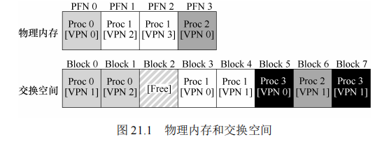

## 第21章 超越物理内存：机制

​		到目前为止，我们一直假定地址空间非常小，能放入物理内存。事实上，我们假设每个正在运行的进程的地址空间都能放入内存。我们将放松这些大的假设，并假设我们需要支持许多同时运行的巨大地址空间。

​		为了达到这个目的，需要在内存层级（memory hierarchy）上再加一层。==到目前为止，我们一直假设所有页都常驻在物理内存中。但是，为了支持更大的地址空间，操作系统需要把当前没有在用的那部分地址空间找个地方存储起来。一般来说，这个地方有一个特点，那就是比内存有更大的容量。==因此，一般来说也更慢（如果它足够快，我们就可以像使用内存一样使用，对吗？）。在现代系统中，硬盘（hard disk drive）通常能够满足这个需求。因此，在我们的存储层级结构中，大而慢的硬盘位于底层，内存之上。那么我们的关键问题是：


​		你可能会问一个问题：==为什么我们要为进程支持巨大的地址空间？答案还是方便和易用性。==有了巨大的地址空间，你不必担心程序的数据结构是否有足够空间存储，只需自然地编写程序，根据需要分配内存。这是操作系统提供的一个强大的假象，使你的生活简单很多。别客气！一个反面例子是，一些早期系统使用“内存覆盖（memory overlays）”，它需要程序员根据需要手动移入或移出内存中的代码或数据[D97]。设想这样的场景：在调用函数或访问某些数据之前，你需要先安排将代码或数据移入内存。


### 21.1 交换空间

​		在现代操作系统中，为了支持大于物理内存的地址空间，==操作系统会在硬盘上开辟一部分空间，称为**交换空间（Swap Space）**，用于存储从物理内存中换出的页面。当物理内存不足时，操作系统会将一些页面从内存移出，存储在交换空间中；当这些页面再次需要时，再从交换空间中将它们移回内存。==这种机制使得操作系统能够为进程提供比物理内存更大的地址空间。

#### 交换空间的作用

​		==交换空间的作用是为操作系统提供一个比物理内存更大的“虚拟”内存==，使得在多任务并行执行时，每个进程都可以使用足够的内存，而不会因为物理内存不足而崩溃。例如，假设一个系统有 4GB 的物理内存和 8GB 的交换空间，则系统总共可以为进程提供 12GB 的虚拟内存。当物理内存耗尽时，操作系统会将不常用的页面换出到交换空间，以腾出内存给需要的进程。

#### 交换空间的大小

​		==交换空间的大小直接影响系统的性能和稳定性。一般来说，交换空间越大，操作系统能够处理的进程和数据就越多。==**然而，交换空间过大会导致磁盘 I/O 增加，进而影响系统性能。**因此，操作系统通常会根据物理内存大小、工作负载类型等因素，合理配置交换空间的大小。

​		在配置交换空间时，还要考虑到现代操作系统使用的其他磁盘空间。例如，运行一个二进制程序（如 `ls` 或者用户自己编译的程序），这些程序的代码最初存储在硬盘上，并在运行时按需加载到内存中。如果系统需要腾出内存给其他进程，操作系统可以将这些代码页面从内存中移除，并在需要时重新从硬盘加载，而无需使用交换空间。这种机制进一步优化了内存的使用效率。



​		图 21.1 展示了一个系统的内存使用情况。系统中有 4 页物理内存和 8 页交换空间。在这个示例中，有 3 个进程（进程 0、进程 1 和进程 2）正在运行，它们各自的页面部分存储在物理内存中，部分存储在交换空间中。进程 3 的所有页面都已被换出到交换空间中，表明该进程当前没有运行。

​		通过这个示例可以看到，交换空间允许系统假装内存比实际物理内存更大。当进程 3 需要运行时，操作系统会将它的页面从交换空间中换入内存，同时将其他进程的页面换出，腾出足够的内存空间。这种机制使得系统能够同时运行多个大规模进程，即使它们的内存需求总和远超物理内存。

​		交换空间不仅用于存储换出的页面，还可以用于存储二进制文件的代码页面。当一个程序运行时，代码页面会按需从硬盘加载到内存中，并在内存不足时将其移出，以便稍后重新加载。这种机制使得系统能够高效地管理内存，并在物理内存有限的情况下，仍然为进程提供足够的虚拟内存。


#### 原文：

​		我们要做的第一件事情就是，在硬盘上开辟一部分空间用于物理页的移入和移出。在操作系统中，一般这样的空间称为交换空间（swap space），因为我们将内存中的页交换到其中，并在需要的时候又交换回去。因此，我们会假设操作系统能够以页大小为单元读取或者写入交换空间。为了达到这个目的，操作系统需要记住给定页的硬盘地址（disk address）。

​		==交换空间的大小是非常重要的，它决定了系统在某一时刻能够使用的最大内存页数==。简单起见，现在假设它非常大。

​		在小例子中（见图 21.1），你可以看到一个 4 页的物理内存和一个 8 页的交换空间。在这个例子中，3 个进程（进程 0、进程 1 和进程 2）主动共享物理内存。但 3 个中的每一个，都只有一部分有效页在内存中，剩下的在硬盘的交换空间中。第 4 个进程（进程 3）的所有页都被交换到硬盘上，因此很清楚它目前没有运行。有一块交换空间是空闲的。即使通过这个小例子，你应该也能看出，==使用交换空间如何让系统假装内存比实际物理内存更大。==

​		我们需要注意，交换空间不是唯一的硬盘交换目的地。例如，假设运行一个二进制程序（如ls，或者你自己编译的 main 程序）。这个二进制程序的代码页最开始是在硬盘上，但程序运行的时候，它们被加载到内存中（要么在程序开始运行时全部加载，要么在现代操作系统中，按需要一页一页加载）。但是，如果系统需要在物理内存中腾出空间以满足其他需求，则可以安全地重新使用这些代码页的内存空间，因为稍后它又可以重新从硬盘上的二进制文件加载。


### 21.2 存在位

​		在系统中引入交换机制后，我们需要额外的机制来支持从硬盘交换页。关键的一点是**存在位（present bit）**。这个位位于每个页表项（PTE）中，用于指示该页是否当前存在于物理内存中。如果存在位为 1，表示该页在物理内存中；如果存在位为 0，表示该页已被交换到硬盘上。此时，访问该页将触发一个**页错误（page fault）**。

​		在处理页错误时，操作系统必须通过页表项找到该页在硬盘上的位置，然后将其从硬盘交换回内存。存在位的引入使得系统可以区分哪些页面是在内存中，哪些页面是在硬盘上。

#### 原文：

​		现在我们在硬盘上有一些空间，==需要在系统中增加一些更高级的机制，来支持从硬盘交换页==。简单起见，假设有一个硬件管理 TLB 的系统。

​		先回想一下内存引用发生了什么。正在运行的进程生成虚拟内存引用（用于获取指令或访问数据），在这种情况下，硬件将其转换为物理地址，再从内存中获取所需数据。

​		硬件首先从虚拟地址获得 VPN，检查 TLB 是否匹配（TLB 命中），如果命中，则获得最终的物理地址并从内存中取回。这希望是常见情形，因为它很快（不需要额外的内存访问）。

​		如果在 TLB 中找不到 VPN（即 TLB 未命中），则硬件在内存中查找页表（使用页表基址寄存器），并使用 VPN 查找该页的页表项（PTE）作为索引。如果页有效且存在于物理内存中，则硬件从 PTE 中获得 PFN，将其插入 TLB，并重试该指令，这次产生 TLB 命中。到现在为止还挺好。

​		但是，如果希望允许页交换到硬盘，必须添加更多的机制。==具体来说，当硬件在 PTE中查找时，可能发现页不在物理内存中。硬件（或操作系统，在软件管理 TLB 时）判断是否在内存中的方法，是通过页表项中的一条新信息，即存在位（present bit）。如果存在位设置为 1，则表示该页存在于物理内存中，并且所有内容都如上所述进行。如果存在位设置为零，则页不在内存中，而在硬盘上。==访问不在物理内存中的页，这种行为通常被称为**页错误（page fault）。**


​		

​		在页错误时，操作系统被唤起来处理页错误。一段称为“页错误处理程序（page-fault handler）”的代码会执行，来处理页错误，接下来就会讲。


### 21.3 页错误

​		当页不存在于内存中时，操作系统必须处理这个**页错误**。无论是硬件管理的 TLB 还是软件管理的 TLB，页错误的处理过程大致相同。==操作系统的**页错误处理程序**负责查找该页在硬盘上的位置，将其读取回内存，并更新页表。==

​		==处理页错误时，操作系统会暂停当前进程，执行一系列步骤来将页面换入内存。操作系统首先从页表项中获取该页在硬盘上的地址，然后发起 I/O 操作，将页面读取到内存中。读取完成后，操作系统更新页表项的存在位，将页表项的物理帧号（PFN）指向新加载的页面，并重新尝试触发页错误的指令。==

​		这个过程会使进程在 **I/O 操作期间处于阻塞状态**，而操作系统可以利用这个时间运行其他进程。这样，虽然处理页错误的时间较长，但通过多道程序的并行执行，系统可以更有效地利用硬件资源。

#### 原文：

​		回想一下，在 TLB 未命中的情况下，我们有两种类型的系统：硬件管理的 TLB（硬件在页表中找到需要的转换映射）和软件管理的 TLB（操作系统执行查找过程）。不论在哪种系统中，如果页不存在，都由操作系统负责处理页错误。操作系统的页错误处理程序（page-fault handler）确定要做什么。几乎所有的系统都在软件中处理页错误。即使是硬件管理的 TLB，硬件也信任操作系统来管理这个重要的任务。

​		如果一个页不存在，它已被交换到硬盘，在处理页错误的时候，操作系统需要将该页交换到内存中。那么，问题来了：操作系统如何知道所需的页在哪儿？在许多系统中，页表是存储这些信息最自然的地方。因此，操作系统可以用 PTE 中的某些位来存储硬盘地址，这些位通常用来存储像页的 PFN 这样的数据。当操作系统接收到页错误时，它会在 PTE 中查找地址，并将请求发送到硬盘，将页读取到内存中。


​		当硬盘 I/O 完成时，操作系统会更新页表，将此页标记为存在，更新页表项（PTE）的PFN 字段以记录新获取页的内存位置，并重试指令。下一次重新访问 TLB 还是未命中，然而这次因为页在内存中，因此会将页表中的地址更新到 TLB 中（也可以在处理页错误时更新 TLB 以避免此步骤）。最后的重试操作会在 TLB 中找到转换映射，从已转换的内存物理地址，获取所需的数据或指令。

​		请注意，当 I/O 在运行时，进程将处于阻塞（blocked）状态。因此，当页错误正常处理时，操作系统可以自由地运行其他可执行的进程。因为 I/O 操作是昂贵的，一个进程进行I/O（页错误）时会执行另一个进程，这种交叠（overlap）是多道程序系统充分利用硬件的一种方式。


### 21.4 内存满了怎么办

​		如果系统内存已满，当新的页面需要被换入时，操作系统必须决定将哪些页面换出。这就是**页交换策略（page-replacement policy）**的作用。页交换策略决定了哪些页面会被交换到硬盘上，以腾出空间给新页面。

​		选择合适的页面换出对于系统性能至关重要。错误的选择可能会导致频繁的页错误，使得系统运行速度大幅下降。因此，开发一个有效的页交换策略是操作系统设计中的关键环节。换出错误的页可能导致程序运行速度下降几个数量级，因此这个问题值得深入研究。下一章将详细讨论这些策略。

#### 原文：

​		在上面描述的过程中，==你可能会注意到，我们假设有足够的空闲内存来从存储交换空间换入（page in）的页==。当然，情况可能并非如此。内存可能已满（或接近满了）。因此，==操作系统可能希望先交换出（page out）一个或多个页，以便为操作系统即将交换入的新页留出空间。选择哪些页被交换出或被替换（replace）的过程，被称为页交换策略（page-replacement policy）。==

​		事实表明，人们在创建好页交换策略上投入了许多思考，因为换出不合适的页会导致程序性能上的巨大损失，也会导致程序以类似硬盘的速度运行而不是以类似内存的速度。在现有的技术条件下，这意味着程序可能会运行慢 10000～100000 倍。因此，这样的策略是我们应该详细研究的。实际上，这也正是我们下一章要做的。现在，我们只要知道有这样的策略存在，建立在之前描述的机制之上。

### 21.5 页错误处理流程

有了前面的知识，现在我们可以总结内存访问的完整流程，并了解在页面交换机制下可能发生的各种情况。如果有人问你：“当程序从内存中读取数据时会发生什么？”，你应该能够很好地描述出不同的可能性。请参阅图 21.2 和图 21.3，它们分别展示了硬件和操作系统在页错误处理中所执行的控制流程。

**图 21.2** 展示了硬件在地址转换过程中所做的工作：


以下是你提供的虚拟地址到物理地址转换流程的代码，并添加了详细的注释解释每一步的作用：

```C
// Step 1: 从虚拟地址中提取虚拟页号 (VPN)
VPN = (VirtualAddress & VPN_MASK) >> SHIFT; // 使用掩码提取虚拟页号，并进行位移

// Step 2: 在 TLB 中查找虚拟页号 (VPN) 是否存在
(Success, TlbEntry) = TLB_Lookup(VPN); // 尝试在 TLB 中查找映射

// Step 3: 检查 TLB 查找是否命中
if (Success == True) { // TLB 命中
    // Step 4: 检查是否具有访问权限
    if (CanAccess(TlbEntry.ProtectBits) == True) { // 检查权限位是否允许访问
        // Step 5: 从虚拟地址中提取页内偏移量
        Offset = VirtualAddress & OFFSET_MASK; // 提取偏移量
        
        // Step 6: 计算物理地址 (PhysAddr)
        PhysAddr = (TlbEntry.PFN << SHIFT) | Offset; // 使用 TLB 中的页框号和偏移量构成物理地址
        
        // Step 7: 访问物理内存
        Register = AccessMemory(PhysAddr); // 根据计算出的物理地址访问内存
    } else {
        // 没有权限，触发保护故障异常
        RaiseException(PROTECTION_FAULT); // 访问被拒绝，触发保护故障
    }
} else { // TLB 未命中
    // Step 11: 计算页表项 (PTE) 的地址
    PTEAddr = PTBR + (VPN * sizeof(PTE)); // 使用页表基址寄存器 (PTBR) 和 VPN 计算页表项的物理地址
    
    // Step 12: 访问页表项
    PTE = AccessMemory(PTEAddr); // 通过页表地址访问页表项
    
    // Step 13: 检查页表项是否有效
    if (PTE.Valid == False) {
        // 如果无效，触发段错误异常
        RaiseException(SEGMENTATION_FAULT); // 页表项无效，触发段错误
    } else {
        // Step 16: 检查是否具有访问权限
        if (CanAccess(PTE.ProtectBits) == False) {
            // 没有权限，触发保护故障异常
            RaiseException(PROTECTION_FAULT); // 权限不足，触发保护故障
        } else if (PTE.Present == True) {
            // Step 18: 页面存在，插入到 TLB 中
            TLB_Insert(VPN, PTE.PFN, PTE.ProtectBits); // 将页表项插入到 TLB 中
            
            // Step 21: 重新执行导致 TLB 未命中的指令
            RetryInstruction(); // TLB 更新后重新执行指令
        } else if (PTE.Present == False) {
            // 页面不在内存中，触发缺页异常
            RaiseException(PAGE_FAULT); // 页面不在内存中，触发缺页异常
        }
    }
}
```

### 代码解释

1. **虚拟页号提取**：首先通过掩码和位移操作提取虚拟页号（VPN）。
2. **TLB 查找**：检查 TLB 是否有对应的映射。如果命中，继续检查权限。
3. **权限检查**：如果 TLB 中有条目并且权限允许，计算物理地址并访问内存。
4. **TLB 未命中处理**：如果 TLB 未命中，计算页表项地址，从内存中读取页表项。
5. **页表项检查**：检查页表项的有效性、权限以及是否页面在内存中。
6. **异常处理**：根据检查结果，可能引发保护故障、段错误或缺页异常。

这个流程展现了现代操作系统中虚拟内存管理的典型步骤，结合 TLB 和页表完成虚拟地址到物理地址的转换，并处理各种可能的异常情况。


在这个控制流中，当 TLB 未命中时，有三种可能的情况：

1. **页面存在且有效**（第 18～21 行）：此时，硬件可以从 PTE 中获取物理帧号（PFN），插入 TLB，并重试指令，通常会在第二次尝试时命中 TLB，从而快速完成内存访问。
2. **页面不存在物理内存中**（第 22～23 行）：此时，操作系统会触发页错误处理程序，因为页面虽然是有效的，但已经被换出到硬盘。
3. **访问无效页面**（第 13～14 行）：这种情况下，访问了一个非法的内存地址，操作系统会捕获非法访问，并可能终止相关进程。

**图 21.3** 展示了操作系统在页错误时的处理流程：


以下是你提供的页错误控制流算法的代码，并添加了详细的注释来解释每一步的作用：

```C
// Step 1: 查找一个空闲的物理页框
PFN = FindFreePhysicalPage(); // 尝试找到一个空闲的物理页框号 (PFN)

// Step 2: 检查是否找到空闲页框
if (PFN == -1) { // 如果没有找到空闲的页框
    // Step 3: 运行页面替换算法来腾出一个页框
    PFN = EvictPage(); // 执行页面替换算法，选择一个页框进行驱逐以腾出空间
}

// Step 4: 从磁盘读取页面到选定的页框
DiskRead(PTE.DiskAddr, PFN); // 从磁盘读取页面内容到物理内存中指定的页框 (PFN)
// 此过程会导致当前进程进入休眠状态，等待 I/O 操作完成

// Step 5: 更新页表项的状态
PTE.present = True; // 将页表项的 present 位设为 True，表示页面现在在物理内存中

// Step 6: 更新页表项的页框号 (PFN)
PTE.PFN = PFN; // 将页表项的页框号更新为分配或替换得到的物理页框号

// Step 7: 重新执行导致页错误的指令
RetryInstruction(); // 由于页错误处理完成，重新执行引发页错误的指令
```

### 代码解释

1. **查找空闲页框**：
   - 调用 `FindFreePhysicalPage()` 函数尝试找到一个空闲的物理页框。如果找到了，将返回一个有效的页框号（PFN）。
2. **页面替换**：
   - 如果没有找到空闲的页框（即 `PFN == -1`），则需要通过页面替换算法来腾出一个页框。`EvictPage()` 函数执行页面替换算法，如 LRU（最近最少使用）或 FIFO（先进先出），以选择并驱逐一个页面，为新页面腾出空间。
3. **从磁盘读取页面**：
   - 使用 `DiskRead(PTE.DiskAddr, PFN)` 函数从磁盘中读取页面数据到选定的物理页框中。这个过程会导致进程进入休眠状态，直到 I/O 操作完成。
4. **更新页表项**：
   - 将页表项的 `present` 位设为 `True`，表示页面现在在内存中。
   - 更新页表项的 `PFN`，即页框号，指向刚刚分配或替换得到的物理页框。
5. **重试指令**：
   - 页错误处理完成后，重新执行引发页错误的指令（`RetryInstruction()`）。通常是重新执行访问导致页错误的内存访问指令。

### 总结

这个算法描述了当发生页错误时，操作系统如何处理以将所需的页面从磁盘加载到物理内存中。包括寻找空闲页框或使用页面替换算法驱逐现有页面以腾出空间，以及更新页表项并重试失败的指令。这是虚拟内存管理中关键的部分，确保进程可以在内存受限的情况下顺利运行。


在处理页错误时，操作系统需要做以下步骤：

1. 寻找一个空闲的物理帧（如果没有空闲帧，则执行页替换算法）。
2. 从硬盘读取所需页面，并更新页表项。
3. 在完成这些操作后，重新尝试引发页错误的指令，并将页面加载到 TLB 中。


#### 原文：

​		有了这些知识，我们现在就可以粗略地描绘内存访问的完整流程。换言之，如果有人问你：“当程序从内存中读取数据会发生什么？”，你应该对所有不同的可能性有了很好的概念。有关详细信息，请参见图 21.2 和图 21.3 中的控制流。图 21.2 展示了硬件在地址转换过程中所做的工作，图 21.3 展示了操作系统在页错误时所做的工作。

```C
// Step 1: 从虚拟地址中提取虚拟页号 (VPN)
VPN = (VirtualAddress & VPN_MASK) >> SHIFT; // 使用掩码提取虚拟页号，并进行位移

// Step 2: 在 TLB 中查找虚拟页号 (VPN) 是否存在
(Success, TlbEntry) = TLB_Lookup(VPN); // 尝试在 TLB 中查找映射

// Step 3: 检查 TLB 查找是否命中
if (Success == True) { // TLB 命中
    // Step 4: 检查是否具有访问权限
    if (CanAccess(TlbEntry.ProtectBits) == True) { // 检查权限位是否允许访问
        // Step 5: 从虚拟地址中提取页内偏移量
        Offset = VirtualAddress & OFFSET_MASK; // 提取偏移量
        
        // Step 6: 计算物理地址 (PhysAddr)
        PhysAddr = (TlbEntry.PFN << SHIFT) | Offset; // 使用 TLB 中的页框号和偏移量构成物理地址
        
        // Step 7: 访问物理内存
        Register = AccessMemory(PhysAddr); // 根据计算出的物理地址访问内存
    } else {
        // 没有权限，触发保护故障异常
        RaiseException(PROTECTION_FAULT); // 访问被拒绝，触发保护故障
    }
} else { // TLB 未命中
    // Step 11: 计算页表项 (PTE) 的地址
    PTEAddr = PTBR + (VPN * sizeof(PTE)); // 使用页表基址寄存器 (PTBR) 和 VPN 计算页表项的物理地址
    
    // Step 12: 访问页表项
    PTE = AccessMemory(PTEAddr); // 通过页表地址访问页表项
    
    // Step 13: 检查页表项是否有效
    if (PTE.Valid == False) {
        // 如果无效，触发段错误异常
        RaiseException(SEGMENTATION_FAULT); // 页表项无效，触发段错误
    } else {
        // Step 16: 检查是否具有访问权限
        if (CanAccess(PTE.ProtectBits) == False) {
            // 没有权限，触发保护故障异常
            RaiseException(PROTECTION_FAULT); // 权限不足，触发保护故障
        } else if (PTE.Present == True) {
            // Step 18: 页面存在，插入到 TLB 中
            TLB_Insert(VPN, PTE.PFN, PTE.ProtectBits); // 将页表项插入到 TLB 中
            
            // Step 21: 重新执行导致 TLB 未命中的指令
            RetryInstruction(); // TLB 更新后重新执行指令
        } else if (PTE.Present == False) {
            // 页面不在内存中，触发缺页异常
            RaiseException(PAGE_FAULT); // 页面不在内存中，触发缺页异常
        }
    }
}
```

图 21.2 页错误控制流算法（硬件）

​		从图 21.2 的硬件控制流图中，可以注意到当 TLB 未命中发生的时候有 3 种重要情景。第一种情况，该页存在（present）且有效（valid）（第 18～21 行）。在这种情况下，TLB 未命中处理程序可以简单地从 PTE 中获取 PFN，然后重试指令（这次 TLB 会命中），并因此继续前面描述的流程。第二种情况（第 22～23 行），页错误处理程序需要运行。虽然这是进程可以访问的合法页（毕竟是有效的），但它并不在物理内存中。第三种情况，访问的是一个无效页，可能由于程序中的错误（第 13～14 行）。在这种情况下，PTE 中的其他位都不重要了。硬件捕获这个非法访问，操作系统陷阱处理程序运行，可能会杀死非法进程。

​		从图 21.3 的软件控制流中，可以看到为了处理页错误，操作系统大致做了什么。首先，操作系统必须为将要换入的页找到一个物理帧，如果没有这样的物理帧，我们将不得不等待交换算法运行，并从内存中踢出一些页，释放帧供这里使用。在获得物理帧后，处理程序发出 I/O 请求从交换空间读取页。最后，当这个慢操作完成时，操作系统更新页表并重试指令。重试将导致 TLB 未命中，然后再一次重试时，TLB 命中，此时硬件将能够访问所需的值。

```C
// Step 1: 查找一个空闲的物理页框
PFN = FindFreePhysicalPage(); // 尝试找到一个空闲的物理页框号 (PFN)

// Step 2: 检查是否找到空闲页框
if (PFN == -1) { // 如果没有找到空闲的页框
    // Step 3: 运行页面替换算法来腾出一个页框
    PFN = EvictPage(); // 执行页面替换算法，选择一个页框进行驱逐以腾出空间
}

// Step 4: 从磁盘读取页面到选定的页框
DiskRead(PTE.DiskAddr, PFN); // 从磁盘读取页面内容到物理内存中指定的页框 (PFN)
// 此过程会导致当前进程进入休眠状态，等待 I/O 操作完成

// Step 5: 更新页表项的状态
PTE.present = True; // 将页表项的 present 位设为 True，表示页面现在在物理内存中

// Step 6: 更新页表项的页框号 (PFN)
PTE.PFN = PFN; // 将页表项的页框号更新为分配或替换得到的物理页框号

// Step 7: 重新执行导致页错误的指令
RetryInstruction(); // 由于页错误处理完成，重新执行引发页错误的指令
```


### 21.6 交换何时真正发生

​		我们已经讨论了当内存满时，操作系统会执行页替换操作。然而，==在实际系统中，操作系统通常不会等到内存完全用尽才开始页替换。==为了提高效率，操作系统通常会维护一定量的空闲内存，通过设定高水位线（High Watermark，HW）和低水位线（Low Watermark，LW），控制何时开始预防性地释放内存页。

​		当空闲页数少于低水位线时，一个后台线程（通常称为**交换守护进程**或**页守护进程**）会开始运行，释放内存直到达到高水位线。通过预先释放内存页，操作系统可以在需要时快速响应新页面的请求。

​		这种后台操作还可以通过聚集和合并多个要写入的页面来提高硬盘效率，减少寻道和旋转延迟。为了配合这个机制，图 21.3 中的控制流会做出调整，首先检查是否有空闲页，然后根据需要唤醒后台线程以释放内存。

#### 原文：

​		到目前为止，我们一直描述的是操作系统会等到内存已经完全满了以后才会执行交换流程，然后才替换（踢出）一个页为其他页腾出空间。正如你想象的那样，这有点不切实际的，因为操作系统可以更主动地预留一小部分空闲内存。

​		为了保证有少量的空闲内存，大多数操作系统会设置高水位线（High Watermark，HW）和低水位线（Low Watermark，LW），来帮助决定何时从内存中清除页。原理是这样：当操作系统发现有少于 LW 个页可用时，后台负责释放内存的线程会开始运行，直到有 HW 个可用的物理页。这个后台线程有时称为交换守护进程（swap daemon）或页守护进程（page daemon）①，它然后会很开心地进入休眠状态，因为它毕竟为操作系统释放了一些内存。

​		通过同时执行多个交换过程，我们可以进行一些性能优化。例如，许多系统会把多个要写入的页聚集（cluster）或分组（group），同时写入到交换区间，从而提高硬盘的效率[LL82]。我们稍后在讨论硬盘时将会看到，这种合并操作减少了硬盘的寻道和旋转开销，从而显著提高了性能。

​		为了配合后台的分页线程，图 21.3 中的控制流需要稍作修改。交换算法需要先简单检查是否有空闲页，而不是直接执行替换。如果没有空闲页，会通知后台分页线程按需要释放页。当线程释放一定数目的页时，它会重新唤醒原来的线程，然后就可以把需要的页交换进内存，继续它的工作。


### 21.7 小结

​		在本章中，我们探讨了操作系统如何支持超出物理内存大小的地址空间。通过增加存在位和页错误处理机制，操作系统可以将页面交换到硬盘上，并在需要时将其换回内存。整个过程对于正在运行的进程来说是透明的，它们只看到一个连续的虚拟内存空间。尽管内存访问在最坏情况下可能需要多个硬盘操作的时间，但这使得操作系统能够有效地管理内存并支持大规模的地址空间。