## 第 22 章 超越物理内存：策略

​		在虚拟内存管理中，如果系统拥有大量的空闲内存，那么操作会变得非常简单。当页错误发生时，操作系统可以直接从空闲页列表中找到一个空闲页，并将其分配给所需的页面。这样的情况下，操作系统可以轻松应对内存管理的挑战。

​		然而，当内存资源变得紧张时，情况就会变得复杂得多。==在内存压力下，操作系统不得不将一些页面换出内存，以为那些更常用的页面腾出空间。决定哪些页面应被踢出内存是操作系统替换策略的核心。替换策略直接影响系统性能，因此，在历史上，这是虚拟内存系统开发中最重要的决策之一。==为了更好地理解这个问题，我们提出以下关键问题：

#### 原文：

​		在虚拟内存管理程序中，如果拥有大量空闲内存，操作就会变得很容易。页错误发生了，你在空闲页列表中找到空闲页，将它分配给不在内存中的页。嘿，操作系统，恭喜！ 你又成功了。

​		遗憾的是，当内存不够时事情会变得更有趣。在这种情况下，由于内存压力（memory pressure）迫使操作系统换出（paging out）一些页，为常用的页腾出空间。确定要踢出（evict）哪个页（或哪些页）封装在操作系统的替换策略（replacement policy）中。历史上，这是早期的虚拟内存系统要做的最重要的决定之一，因为旧系统的物理内存非常小。至少，有一些策略是非常值得了解的。因此我们的问题如下所示。

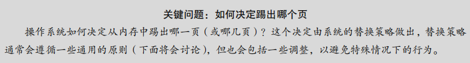


### 22.1 缓存管理

​		在深入研究替换策略之前，我们需要更详细地描述要解决的问题。因为内存只包含系统中所有页面的一个子集，所以可以将其视为虚拟内存页面的一个缓存。在为这个缓存选择替换策略时，我们的目标是将缓存未命中次数降到最低，即尽量减少从磁盘获取页面的次数。换句话说，目标是最大化缓存命中次数，即尽量在内存中找到所需的页面。

​		通过计算缓存命中和未命中次数，我们可以得出程序的平均内存访问时间（Average Memory Access Time, AMAT），这在计算机体系结构中是衡量硬件缓存性能的一个重要指标。公式如下：

```
AMAT = (PHit * TM) + (PMiss * TD)
```

​		其中，TM 表示内存访问的成本，TD 表示磁盘访问的成本，PHit 表示缓存命中的概率，PMiss 表示缓存未命中的概率。PHit 和 PMiss 的总和为 1。

举个例子，假设一个机器有一个 4KB 的地址空间，每页 256 字节。一个进程可能会产生以下内存访问序列：0x000, 0x100, 0x200, 0x300, 0x400, 0x500, 0x600, 0x700, 0x800, 0x900。

假设内存中除了虚拟页 3 之外的所有页面都已加载，此时的内存访问序列的命中率为 90%（PHit = 0.9），未命中率为 10%（PMiss = 0.1）。根据上面的 AMAT 公式，假设 TM 为 100ns，TD 为 10ms，则 AMAT = 0.9 * 100ns + 0.1 * 10ms = 1ms。可以看到，即使有很小概率的缓存未命中，也会显著增加程序的平均内存访问时间。


#### 原文：

​		在深入研究策略之前，先详细描述一下我们要解决的问题。==由于内存只包含系统中所有页的子集，因此可以将其视为系统中虚拟内存页的缓存（cache）==。因此，在为这个缓存选择替换策略时，==我们的目标是让缓存未命中（cache miss）最少，即使得从磁盘获取页的次数最少。==或者，可以将目标看成让缓存命中（cache hit）最多，即在内存中找到待访问页的次数最多。

​		==知道了缓存命中和未命中的次数，就可以计算程序的平均内存访问时间（Average Memory Access Time，==AMAT，计算机架构师衡量硬件缓存的指标 [HP06]）。具体来说，给定这些值，可以按照如下公式计算 *AMAT*：

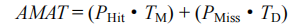

​		其中 *T*M表示访问内存的成本，*T*D表示访问磁盘的成本，*P*Hit表示在缓存中找到数据的概率（命中），*P*Miss表示在缓存中找不到数据的概率（未命中）。*P*Hit和 *P*Miss从 0.0 变化到 1.0，并且 *P*Miss + *P*Hit = 1.0。


​		例如，假设有一个机器有小型地址空间：4KB，每页 256 字节。因此，虚拟地址由两部分组成：一个 4 位 VPN（最高有效位）和一个 8 位偏移量（最低有效位）。因此，本例中的一个进程可以访问总共 24 =16 个虚拟页。在这个例子中，该进程将产生以下内存引用（即虚拟地址）0x000，0x100，0x200，0x300，0x400，0x500，0x600，0x700，0x800，0x900。这些虚拟地址指向地址空间中前 10 页的每一页的第一个字节（页号是每个虚拟地址的第一

个十六进制数字）。

​		让我们进一步假设，除了虚拟页 3 之外，所有页都已经在内存中。因此，我们的内存引用序列将遇到以下行为：命中，命中，命中，未命中，命中，命中，命中，命中，命中。我们可以计算命中率（hit rate，在内存中找到引用的百分比）：90%（*P*Hit = 0.9），因为 10个引用中有 9 个在内存中。未命中率（miss rate）显然是 10%（*P*Miss = 0.1）。

​		要计算 AMAT，需要知道访问内存的成本和访问磁盘的成本。假设访问内存（TM）的成本约为 100ns，并且访问磁盘（TD）的成本大约为 10ms，则我们有以下 AMAT：0.9×100ns +0.1×10ms，即90ns + 1ms或1.0009ms，或约1ms。如果我们的命中率是99.9%（PMiss = 0.001），结果是完全不同的：AMAT 是 10.1μs，大约快 100 倍。当命中率接近 100%时，AMAT 接近100ns。

​		遗憾的是，正如你在这个例子中看到的，在现代系统中，磁盘访问的成本非常高，即使很小概率的未命中也会拉低正在运行的程序的总体 AMAT。显然，我们必须尽可能地避免缓存未命中，避免程序以磁盘的速度运行。要做到这一点，有一种方法就是仔细开发一个聪明的策略，像我们现在所做的一样。


### 22.2 最优替换策略

​		为了理解替换策略的工作原理，我们可以将其与最优替换策略进行比较。最优替换策略（Belady 策略，也称为 MIN 策略）能够达到最少的未命中次数。这个策略的基本思想是，始终替换内存中在将来最远才会被访问的页面，以此最小化缓存未命中次数。

​		**提示**：尽管最优策略难以实际实现，但在仿真或研究中，它是一个有用的对比基准。通过与最优策略进行比较，可以了解新的替换策略有多接近理想状态，并评估是否还有改进的空间。

​		为了更好地理解最优策略，我们可以看一个简单的例子。假设一个程序按以下顺序访问虚拟页面：0, 1, 2, 0, 1, 3, 0, 3, 1, 2, 1。假设缓存可以存储 3 个页面，最优替换策略将按照表 22.1 所示的方式工作。

| 访问 | 命中/未命中 | 踢出 | 缓存状态 |
| ---- | ----------- | ---- | -------- |
| 0    | 未命中      |      | 0        |
| 1    | 未命中      |      | 0, 1     |
| 2    | 未命中      |      | 0, 1, 2  |
| 0    | 命中        |      | 0, 1, 2  |
| 1    | 命中        |      | 0, 1, 2  |
| 3    | 未命中      | 2    | 0, 1, 3  |
| 0    | 命中        |      | 0, 1, 3  |
| 3    | 命中        |      | 0, 1, 3  |
| 1    | 命中        |      | 0, 1, 3  |
| 2    | 未命中      | 3    | 0, 1, 2  |
| 1    | 命中        |      | 0, 1, 2  |

​		通过这个例子可以看到，最优替换策略能够确保在缓存未命中次数最少的情况下进行页面替换。

​		尽管最优策略无法在实际系统中实现，但它为我们提供了一个重要的参考基准。在开发实际可行的替换策略时，我们将致力于接近这个最优策略的性能。

​		接下来，我们将探索实际系统中使用的各种替换策略，以及它们在不同场景下的优劣。

#### 原文：

​		为了更好地理解一个特定的替换策略是如何工作的，将它与最好的替换策略进行比较是很好的方法。事实证明，这样一个最优（optimal）策略是 Belady 多年前开发的[B66]（原来这个策略叫作 MIN）。最优替换策略能达到总体未命中数量最少。Belady 展示了一个简单的方法（但遗憾的是，很难实现！），即替换内存中在最远将来才会被访问到的页，可以达到缓存未命中率最低。

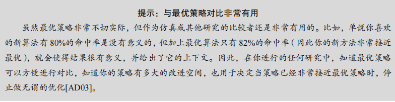

​		希望最优策略背后的想法你能理解。这样想：如果你不得不踢出一些页，为什么不踢出在最远将来才会访问的页呢？这样做基本上是说，缓存中所有其他页都比这个页重要。道理很简单：==在引用最远将来会访问的页之前，你肯定会引用其他页。==

​		我们追踪一个简单的例子，来理解最优策略的决定。假设一个程序按照以下顺序访问虚拟页：0，1，2，0，1，3，0，3，1，2，1。表 22.1 展示了最优的策略，这里假设缓存可以存 3 个页。

​		在表 22.1 中，可以看到以下操作。不要惊讶，==前 3 个访问是未命中，因为缓存开始是空的。==这种未命中有时也称作冷启动未命中（cold-start miss，或强制未命中，compulsory miss）。然后我们再次引用页 0 和 1，它们都在缓存中。最后，我们又有一个缓存未命中（页3），但这时缓存已满，必须进行替换！这引出了一个问题：我们应该替换哪个页？==使用最优策略，我们检查当前缓存中每个页（0、1 和 2）未来访问情况，可以看到页 0 马上被访问，页 1 稍后被访问，页 2 在最远的将来被访问。因此，最优策略的选择很简单：踢出页面 2，结果是缓存中的页面是 0、1 和 3。==接下来的 3 个引用是命中的，然后又访问到被我们之前踢出的页 2，那么又有一个未命中。这里，最优策略再次检查缓存页（0、1 和 3）中每个页面的未来被访问情况，并且看到只要不踢出页 1（即将被访问）就可以。这个例子显示了页 3 被踢出，虽然踢出 0 也是可以的。最后，我们命中页 1，追踪完成。

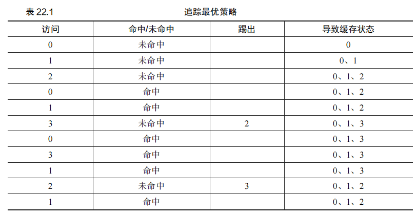

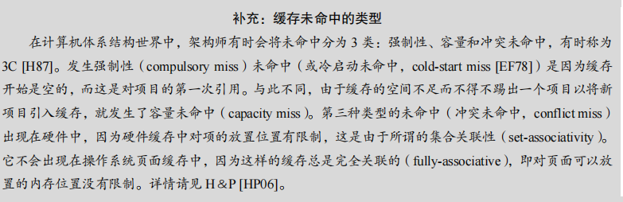

​		在计算机体系结构世界中，架构师有时会将未命中分为 3 类：强制性、容量和冲突未命中，有时称为3C [H87]。发生强制性（compulsory miss）未命中（或冷启动未命中，cold-start miss [EF78]）是因为缓存开始是空的，而这是对项目的第一次引用。与此不同，由于缓存的空间不足而不得不踢出一个项目以将新项目引入缓存，就发生了容量未命中（capacity miss）。第三种类型的未命中（冲突未命中，conflict miss）出现在硬件中，因为硬件缓存中对项的放置位置有限制，这是由于所谓的集合关联性（set-associativity）。它不会出现在操作系统页面缓存中，因为这样的缓存总是完全关联的（fully-associative），即对页面可以放置的内存位置没有限制。详情请见 H＆P [HP06]。

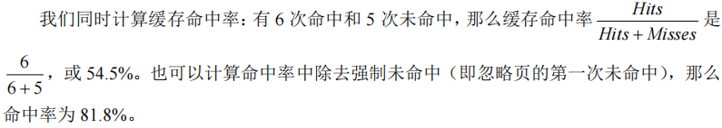

​		遗憾的是，==正如我们之前在开发调度策略时所看到的那样，未来的访问是无法知道的，你无法为通用操作系统实现最优策略==。因此，在开发一个真正的、可实现的策略时，我们将聚焦于寻找其他决定把哪个页面踢出的方法。因此，最优策略只能作为比较，知道我们的策略有多接近“完美”。


### 22.3 简单策略：FIFO

许多早期的系统采用了非常简单的替换策略来管理内存页的替换，==其中之一是 FIFO（先入先出）策略。该策略的基本思想非常简单：页在进入系统时被放入一个队列，当内存需要替换页面时，队列中最早进入的页（即“先入”页）将被踢出。==

FIFO 策略的一个主要优势在于其实现非常简单。然而，==这种简单性也意味着它无法识别页的重要性，只是按照它们进入内存的顺序进行替换==。我们可以通过一个具体的例子来理解 FIFO 策略的执行过程（见表 22.2）。

在这个例子中，我们追踪 3 个页面（0、1 和 2）的访问序列。最开始是强制性未命中，因为内存开始是空的，接下来是页面 0 和 1 的命中。当页 3 被访问时，由于缓存已满，因此需要替换一个页面。FIFO 策略会选择最早进入内存的页，即页 0。遗憾的是，下一次访问又是页 0，这导致了另一次未命中和替换。结果，FIFO 的命中率较低，因为它并没有考虑页面的访问频率或重要性。

| 访问 | 命中/未命中 | 踢出 | 缓存状态 |
| ---- | ----------- | ---- | -------- |
| 0    | 未命中      |      | 0        |
| 1    | 未命中      |      | 0, 1     |
| 2    | 未命中      |      | 0, 1, 2  |
| 0    | 命中        |      | 0, 1, 2  |
| 1    | 命中        |      | 0, 1, 2  |
| 3    | 未命中      | 0    | 1, 2, 3  |
| 0    | 未命中      | 1    | 2, 3, 0  |
| 3    | 命中        |      | 2, 3, 0  |
| 1    | 未命中      | 2    | 3, 0, 1  |
| 2    | 未命中      | 3    | 0, 1, 2  |
| 1    | 命中        |      | 0, 1, 2  |

通过对比 FIFO 和最优策略，我们可以看到 FIFO 的局限性。FIFO 的命中率仅为 36.4%（不包括强制性未命中的命中率为 57.1%）。它无法识别页的重要性，即使某个页面多次被访问，也可能被不合理地踢出内存，从而降低系统性能。


#### 原文：

​		许多早期的系统避免了尝试达到最优的复杂性，采用了非常简单的替换策略。例如，一些系统使用 FIFO（先入先出）替换策略。页在进入系统时，简单地放入一个队列。当发生替换时，队列尾部的页（“先入”页）被踢出。FIFO 有一个很大的优势：实现相当简单。

​		让我们来看看 FIFO 策略如何执行这过程（见表 22.2）。我们再次开始追踪 3 个页面 0、1和 2。首先是强制性未命中，然后命中页 0 和 1。接下来，引用页 3，缓存未命中。使用 FIFO策略决定替换哪个页面是很容易的：选择第一个进入的页，这里是页 0（表中的缓存状态列是按照先进先出顺序，最左侧是第一个进来的页），遗憾的是，我们的下一个访问还是页 0，导致另一次未命中和替换（替换页 1）。然后我们命中页 3，但是未命中页 1 和 2，最后命中页 3。

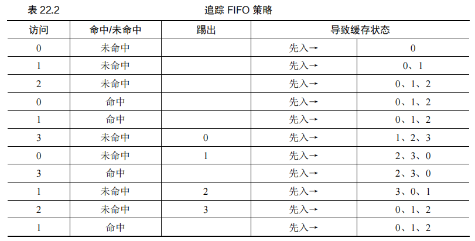

​		对比 FIFO 和最优策略，FIFO 明显不如最优策略，FIFO 命中率只有 36.4%（不包括强制性未命中为 57.1%）。先进先出（FIFO）根本无法确定页的重要性：即使页 0 已被多次访问，FIFO 仍然会将其踢出，因为它是第一个进入内存的。

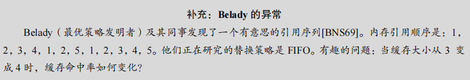

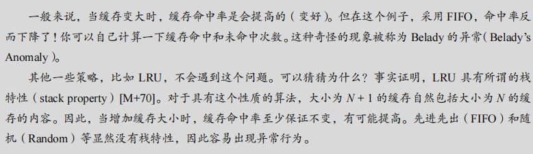


### 22.4 另一简单策略：随机

另一种类似的简单替换策略是随机策略（Random）。在内存需要替换页面时，它随机选择一个页面进行替换。随机策略与 FIFO 相似，易于实现，但在选择替换页面时并不考虑页面的重要性或历史访问情况。表 22.3 展示了随机策略在我们的示例引用序列中的表现。

| 访问 | 命中/未命中 | 踢出 | 缓存状态 |
| ---- | ----------- | ---- | -------- |
| 0    | 未命中      |      | 0        |
| 1    | 未命中      |      | 0, 1     |
| 2    | 未命中      |      | 0, 1, 2  |
| 0    | 命中        |      | 0, 1, 2  |
| 1    | 命中        |      | 0, 1, 2  |
| 3    | 未命中      | 0    | 1, 2, 3  |
| 0    | 未命中      | 1    | 2, 3, 0  |
| 3    | 命中        |      | 2, 3, 0  |
| 1    | 未命中      | 3    | 2, 0, 1  |
| 2    | 命中        |      | 2, 0, 1  |
| 1    | 命中        |      | 2, 0, 1  |

随机策略的表现完全取决于运气。在上述例子中，随机策略的平均命中率在多次实验中有所波动，有时会接近最优策略，有时则会表现得更糟。


#### 原文

​		当然，随机的表现完全取决于多幸运（或不幸）。在上面的例子中，随机比 FIFO 好一点，比最优的差一点。事实上，我们可以运行数千次的随机实验，求得一个平均的结果。图 22.1显示了 10000 次试验后随机策略的平均命中率，每次试验都有不同的随机种子。正如你所看到的，有些时候（仅仅 40%的概率），随机和最优策略一样好，在上述例子中，命中内存的次数是 6 次。有时候情况会更糟糕，只有 2 次或更少。随机策略取决于当时的运气。

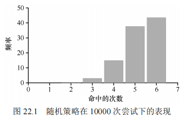

### 22.5 利用历史数据：LRU

简单的替换策略如 FIFO 或随机策略的一个主要缺陷是，它们可能会踢出一个即将被访问的重要页面。为了避免这个问题，替换策略可以利用历史访问数据来做出更明智的决策。基于历史数据的替换策略包括最不经常使用策略（LFU）和最少最近使用策略（LRU）。

==LRU 策略基于局部性原则，假设最近访问过的页面在未来也有更大的可能性被再次访问。因此，LRU 选择替换最近最少使用的页面。==

表 22.4 展示了 LRU 策略在我们示例引用序列中的表现。可以看到，LRU 策略有效地避免了替换即将被访问的页面，从而提高了缓存命中率。

| 访问 | 命中/未命中 | 踢出 | 缓存状态 |
| ---- | ----------- | ---- | -------- |
| 0    | 未命中      |      | 0        |
| 1    | 未命中      |      | 0, 1     |
| 2    | 未命中      |      | 0, 1, 2  |
| 0    | 命中        |      | 1, 2, 0  |
| 1    | 命中        |      | 2, 0, 1  |
| 3    | 未命中      | 2    | 0, 1, 3  |
| 0    | 命中        |      | 1, 3, 0  |
| 3    | 命中        |      | 1, 0, 3  |
| 1    | 命中        |      | 0, 3, 1  |
| 2    | 未命中      | 0    | 3, 1, 2  |
| 1    | 命中        |      | 3, 2, 1  |

从表中可以看出，LRU 策略利用了页面的历史访问信息，比 FIFO 和随机策略表现得更好。LRU 策略在许多情况下接近最优策略，是一种非常有效的替换策略。

通过这些例子，我们可以看到，不同的替换策略在处理页面替换时表现各异，选择合适的策略对于提升系统性能至关重要。

#### 原文：

​		遗憾的是，任何像 FIFO 或随机这样简单的策略都可能会有一个共同的问题：它可能会踢出一个重要的页，而这个页马上要被引用。先进先出（FIFO）将先进入的页踢出。如果这恰好是一个包含重要代码或数据结构的页，它还是会被踢出，尽管它很快会被重新载入。因此，FIFO、Random 和类似的策略不太可能达到最优，需要更智能的策略。正如在调度策略所做的那样，为了提高后续的命中率，我们再次通过历史的访问情况作为参考。例如，如果某个程序在过去访问过某个页，则很有可能在不久的将来会再次访问该页。

​		页替换策略可以使用的一个历史信息是频率（frequency）。如果一个页被访问了很多次，也许它不应该被替换，因为它显然更有价值。页更常用的属性是访问的近期性（recency），越近被访问过的页，也许再次访问的可能性也就越大。

​		这一系列的策略是基于人们所说的局部性原则（principle of locality）[D70]，基本上只是对程序及其行为的观察。这个原理简单地说就是程序倾向于频繁地访问某些代码（例如循环）和数据结构（例如循环访问的数组）。因此，我们应该尝试用历史数据来确定哪些页面更重要，并在需要踢出页时将这些页保存在内存中。

​		因此，一系列简单的基于历史的算法诞生了。“最不经常使用”（Least-Frequently-Used，LFU）策略会替换最不经常使用的页。同样，“最少最近使用”（Least-Recently-Used，LRU）策略替换最近最少使用的页面。这些算法很容易记住：一旦知道这个名字，就能确切知道它是什么，这种名字就非常好。

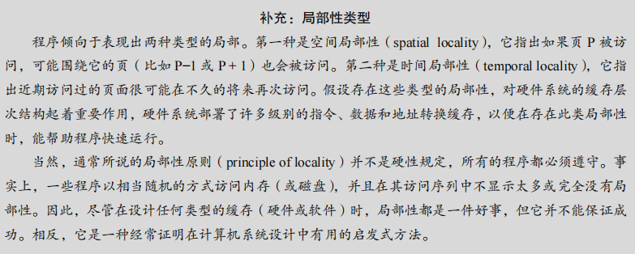

​		为了更好地理解 LRU，我们来看看 LRU 如何在示例引用序列上执行。表 22.4 展示了结果。从表中，可以看到 LRU 如何利用历史记录，比无状态策略（如随机或 FIFO）做得更好。在这个例子中，当第一次需要替换页时，LRU 会踢出页 2，因为 0 和 1 的访问时间更近。然后它替换页 0，因为 1 和 3 最近被访问过。在这两种情况下，基于历史的 LRU 的决定证明是更准确的，并且下一个引用也是命中。因此，在我们的简单例子中，LRU 的表现几乎快要赶上最优策略了①。

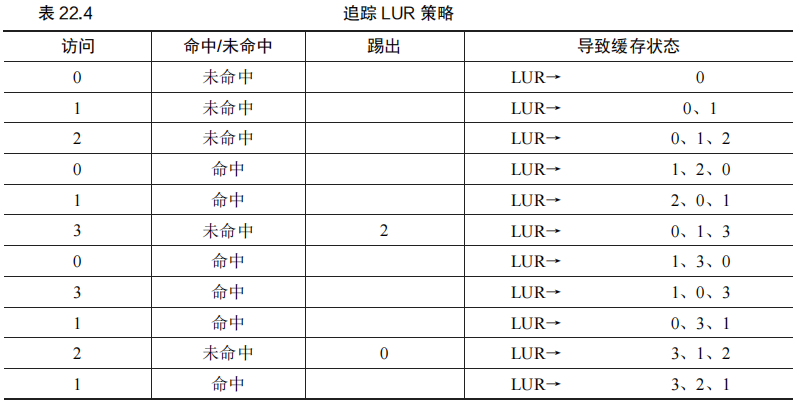

​		我们也应该注意到，与这些算法完全相反的算法也是存在：最经常使用策略（MostFrequently-Used，MFU）和最近使用策略（Most-Recently-Used，MRU）。在大多数情况下（不是全部！），这些策略效果都不好，因为它们忽视了大多数程序都具有的局部性特点。


### 22.6 工作负载示例

​		为了更好地理解替换策略的表现，我们将通过几个工作负载示例来分析不同策略的效果。这些示例虽然简化了实际情况，但能帮助我们理解不同替换策略在各种条件下的表现。

#### **无局部性工作负载**

​		第一个工作负载没有任何局部性，这意味着每次内存引用都是随机访问一个页。在这个例子中，工作负载每次从 100 个不同的页中随机选择一个页进行访问，总共进行 10000 次访问。为了分析替换策略的表现，我们将缓存大小从 1 页增加到 100 页，以观察命中率的变化。

​		图 22.2 展示了最优策略、LRU、随机和 FIFO 策略在无局部性工作负载下的表现。y 轴显示了命中率，x 轴表示缓存大小的变化。

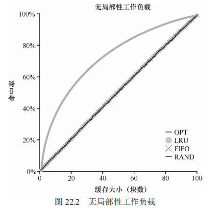

从图 22.2 可以得出以下结论：

1. **策略差异不大**：在没有局部性的工作负载中，LRU、FIFO 和随机策略的表现相差无几，因为所有的引用都是随机的，历史信息无法为这些策略提供优势。
2. **缓存大小的重要性**：随着缓存大小的增加，命中率也会提高。当缓存大小足够大，可以容纳所有的数据时，所有策略都会达到 100% 的命中率。
3. **最优策略的优势**：最优策略的表现始终优于其他策略，因为它能够“预知”未来的访问，选择最优的替换方案。

#### **80-20 工作负载**

第二个工作负载被称为“80-20”负载场景，表现出显著的局部性：80% 的引用集中在 20% 的页上（“热门”页），剩余 20% 的引用则分布在其余 80% 的页上（“冷门”页）。图 22.3 展示了不同策略在这个工作负载下的表现。

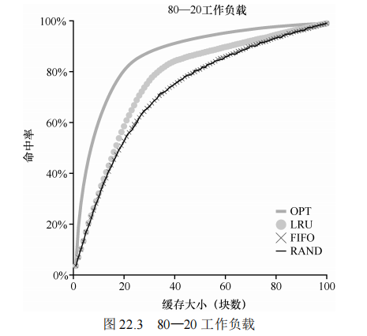

从图 22.3 可以看出：

1. **LRU 的优势**：由于 LRU 能够保留最近访问的页，因此在有局部性的工作负载下表现出色。它倾向于保留“热门”页，从而提高命中率。
2. **最优策略仍然占优**：虽然 LRU 表现良好，但最优策略依然比它表现更好，因为 LRU 仅依赖历史信息，而最优策略能准确预知未来的访问模式。

#### **循环顺序工作负载**

最后一个工作负载是“循环顺序”负载，它依次访问 50 个页，从 0 开始，访问到 49 后重新开始，总共进行了 10000 次访问。图 22.4 展示了不同策略在这个工作负载下的表现。

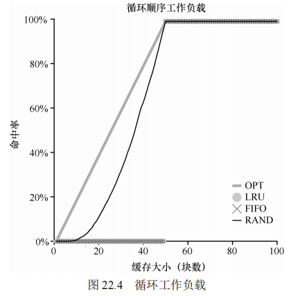

图 22.4 显示了：

1. **LRU 和 FIFO 的最差情况**：在循环顺序的工作负载下，LRU 和 FIFO 的表现极差，因为它们会不断踢出刚刚被访问的页，从而导致频繁的未命中。
2. **随机策略的表现较好**：与 LRU 和 FIFO 相比，随机策略在这个工作负载下表现更好，尽管离最优策略仍有差距，但至少能达到一定的命中率，避免了特殊情况下的糟糕结果。

### 22.7 实现基于历史信息的算法

​		如我们所见，像 LRU 这样的基于历史信息的策略通常比简单策略（如 FIFO 或随机）表现更好，因为它们能更有效地保留重要的页。然而，实现这些策略可能面临挑战，特别是在需要频繁更新和维护历史信息时。

#### **实现 LRU 的挑战**

​		==实现 LRU 的一大挑战在于每次内存访问都需要更新某些数据，以将该页移动到列表的前面（即最近使用的一侧）。==相比之下，FIFO 仅在页被替换或新页加入队列时更新列表。因此，为了记录哪些页最近使用，需要在每次内存访问时进行更新，这可能会影响性能。

​		==一种可能的优化是增加硬件支持。==例如，硬件可以在每次页访问时更新时间字段（存储在页表中或专门的数组中）。然而，扫描系统中所有页的时间字段以找到最少使用的页仍然代价高昂，特别是在页数量庞大的系统中。因此，有必要探讨是否可以实现近似的 LRU 替换策略，并且仍然保持较高的性能。

### 22.8 近似 LRU

实际上，许多现代系统采用了近似 LRU 的方法来实现高效的页面替换。一个典型的例子是时钟算法，它通过硬件支持的使用位（use bit 或 reference bit）来近似实现 LRU。

#### **时钟算法**

时钟算法将所有页组织成一个循环列表，时钟指针指向某个页。当需要替换页时，操作系统检查当前页的使用位。如果使用位为 1，表示该页最近被访问过，因此不适合被替换。操作系统将使用位设置为 0，并将时钟指针移动到下一个页，直到找到使用位为 0 的页并将其替换。

时钟算法虽然不如完美的 LRU 精确，但在性能上显著优于不考虑历史信息的策略，并且能够避免频繁扫描所有页带来的开销。图 22.5 展示了时钟算法在“80-20”工作负载下的表现，它比不考虑历史访问的策略更为有效。

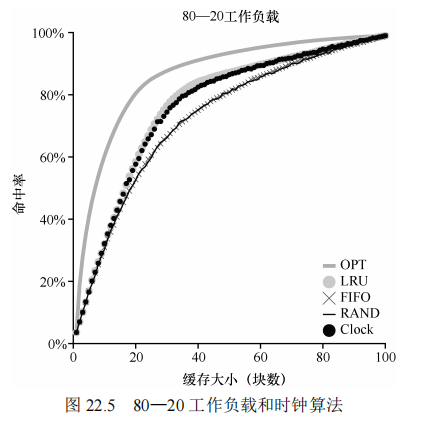

#### 原文：

​		事实证明，答案是肯定的：从计算开销的角度来看，近似 LRU 更为可行，实际上这也是许多现代系统的做法。这个想法需要硬件增加一个使用位（use bit，有时称为引用位，reference bit），这种做法在第一个支持分页的系统 Atlas one-level store[KE + 62]中实现。系统的每个页有一个使用位，然后这些使用位存储在某个地方（例如，它们可能在每个进程的页表中，或者只在某个数组中）。每当页被引用（即读或写）时，硬件将使用位设置为 1。但是，硬件不会清除该位（即将其设置为 0），这由操作系统负责。

​		操作系统如何利用使用位来实现近似 LRU？可以有很多方法，有一个简单的方法称作时钟算法（clock algorithm）[C69]。想象一下，系统中的所有页都放在一个循环列表中。时钟指针（clock hand）开始时指向某个特定的页（哪个页不重要）。当必须进行页替换时，操作系统检查当前指向的页 *P* 的使用位是 1 还是 0。如果是 1，则意味着页面 *P* 最近被使用，因此不适合被替换。然后，*P* 的使用位设置为 0，时钟指针递增到下一页（*P* + 1）。该算法一直持续到找到一个使用位为 0 的页，使用位为 0 意味着这个页最近没有被使用过（在最坏的情况下，所有的页都已经被使用了，那么就将所有页的使用位都设置为 0）。

​		请注意，这种方法不是通过使用位来实现近似 LRU 的唯一方法。实际上，任何周期性地清除使用位，然后通过区分使用位是 1 和 0 来判定该替换哪个页的方法都是可以的。Corbato 的时钟算法只是一个早期成熟的算法，并且具有不重复扫描内存来寻找未使用页的特点，也就是它在最差情况下，只会遍历一次所有内存。

​		图 22.5 展示了时钟算法的一个变种的行为。该变种在需要进行页替换时随机扫描各页，如果遇到一个页的引用位为 1，就清除该位（即将它设置为 0）。直到找到一个使用位为 0的页，将这个页进行替换。如你所见，虽然时钟算法不如完美的 LRU 做得好，但它比不考虑历史访问的方法要好。


### 22.9 考虑脏页

​		==时钟算法的一个常见改进是考虑页的脏位（modified bit 或 dirty bit）。如果一个页被修改过，则将其换出需要写回磁盘，这将增加 I/O 开销。因此，一些系统更倾向于先踢出未被修改的干净页（clean page）。==

​		通过这种方式，系统能够减少不必要的 I/O 操作，从而提高性能。这种改进在页替换策略中非常常见，特别是在磁盘 I/O 成本较高的系统中。

### 22.10 其他虚拟内存策略

​		除了页面替换策略之外，虚拟内存子系统还涉及其他一些策略，尽管页面替换可能是其中最重要的。例如，操作系统必须决定何时将页面载入内存，这一策略有时被称为**页选择（page selection）策略**。

#### **按需分页和预取**

​		大多数情况下，操作系统采用**按需分页（demand paging）**，即当页面被访问时，操作系统将其载入内存。这种策略在内存利用上非常有效，但也存在一定的延迟，因为第一次访问某个页面时可能会导致页错误，从而引发额外的磁盘 I/O 操作。

​		**预取（prefetching）**是一种更积极的策略，操作系统会尝试预测哪些页面可能会被访问，并提前将它们载入内存。比如，如果操作系统发现代码页 P 被载入内存，那么可能会猜测代码页 P+1 也很快会被访问，因此也将其载入。这种策略在某些情况下可以显著提高性能，特别是当程序具有强烈的顺序访问模式时。

#### **聚集写入**

​		另一项策略涉及操作系统如何将修改后的页面写入磁盘。操作系统可以选择每次只写入一个页面，或者采用一种更有效的策略——**聚集写入（clustering）**。在聚集写入中，操作系统会在内存中积累多个需要写入的页面，然后一次性将它们写入磁盘。这种方式可以利用硬盘的特性，提高写入效率，因为单次大规模的写入通常比多次小规模的写入更有效率。

#### 原文：

​		页面替换不是虚拟内存子系统采用的唯一策略（尽管它可能是最重要的）。例如，操作系统还必须决定何时将页载入内存。该策略有时称为页选择（page selection）策略（因为Denning 这样命名[D70]），它向操作系统提供了一些不同的选项。

​		对于大多数页而言，操作系统只是使用按需分页（demand paging），这意味着操作系统在页被访问时将页载入内存中，“按需”即可。当然，操作系统可能会猜测一个页面即将被使用，从而提前载入。这种行为被称为预取（prefetching），只有在有合理的成功机会时才应该这样做。例如，一些系统将假设如果代码页 *P* 被载入内存，那么代码页 *P* + 1 很可能很快被访问，因此也应该被载入内存。

​		另一个策略决定了操作系统如何将页面写入磁盘。当然，它们可以简单地一次写出一个。然而，许多系统会在内存中收集一些待完成写入，并以一种（更高效）的写入方式将它们写入硬盘。这种行为通常称为聚集（clustering）写入，或者就是分组写入（grouping），这样做有效是因为硬盘驱动器的性质，执行单次大的写操作，比许多小的写操作更有效。


### 22.11 抖动（Thrashing）

​		抖动（thrashing）是指当系统的内存需求超过可用物理内存时，操作系统频繁进行页面交换，导致系统性能严重下降的情况。在抖动状态下，CPU 大部分时间都在等待页面交换完成，而不是执行实际的工作。

#### **应对抖动**

​		一些早期的操作系统实现了复杂的机制来检测并应对抖动。例如，系统可以通过**准入控制（admission control）**来减少活跃进程的数量，从而减轻内存压力。通过暂停或推迟某些进程的执行，操作系统可以确保剩余进程的工作集（即它们正在使用的页面）可以完全装入内存，从而有效地避免抖动。

​		现代操作系统则可能采用更激进的策略。例如，某些 Linux 版本在内存严重不足时会启动**“内存不足的杀手程序（out-of-memory killer）”**，选择一个内存密集型进程并将其终止，从而立即释放内存。这种方法虽然能够缓解内存压力，但也可能带来问题，比如如果杀死了关键进程（如 X 服务器），系统的用户界面可能会崩溃。

#### 原文：

​		在结束之前，我们解决了最后一个问题：当内存就是被超额请求时，操作系统应该做什么，这组正在运行的进程的内存需求是否超出了可用物理内存？在这种情况下，系统将不断地进行换页，这种情况有时被称为抖动（thrashing）[D70]。

​		一些早期的操作系统有一组相当复杂的机制，以便在抖动发生时检测并应对。例如，给定一组进程，系统可以决定不运行部分进程，希望减少的进程工作集（它们活跃使用的页面）能放入内存，从而能够取得进展。这种方法通常被称为准入控制（admission control），它表明，少做工作有时比尝试一下子做好所有事情更好，这是我们在现实生活中以及在现代计算机系统中经常遇到的情况（令人遗憾）。

​		目前的一些系统采用更严格的方法处理内存过载。例如，当内存超额请求时，某些版本的 Linux 会运行“内存不足的杀手程序（out-of-memory killer）”。这个守护进程选择一个内存密集型进程并杀死它，从而以不怎么委婉的方式减少内存。虽然成功地减轻了内存压力，但这种方法可能会遇到问题，例如，如果它杀死 *X* 服务器，就会导致所有需要显示的应用程序不可用。


### 22.12 小结

本章讨论了多种虚拟内存策略，特别是页面替换策略，这些策略是现代操作系统虚拟内存管理的核心部分。虽然传统的替换算法如 LRU 和时钟算法依然在使用，但现代系统也在进行改进。例如，**扫描抗性（scan resistance）**是许多现代算法的重要特性，旨在避免 LRU 在特定工作负载下的最差表现，如在循环顺序工作负载中观察到的情况。

随着内存和磁盘访问时间之间差距的扩大，页面替换算法的重要性可能有所下降。对于许多系统来说，减少分页的最佳方法往往是增加物理内存容量，因为频繁的分页操作代价实在太高。因此，购买更多的内存常常成为提升系统性能的最直接、最有效的手段。