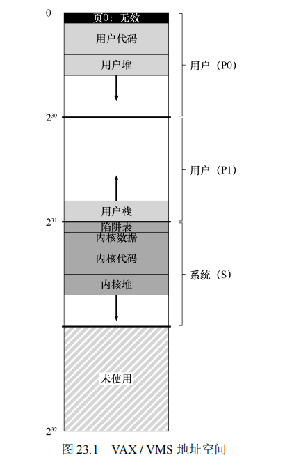

## 第23章 VAX/VMS 虚拟内存系统

在我们结束对虚拟内存的研究之前，让我们仔细研究一下 VAX/VMS 操作系统[LL82]的虚拟内存管理器，它特别干净漂亮。本章将讨论该系统，说明如何在一个完整的内存管理器中，将先前章节中提出的一些概念结合在一起。

### 23.1 背景

数字设备公司（DEC）在 20 世纪 70 年代末推出了 VAX-11 小型机架构。VAX-11 系列是当时微型计算机领域的领导者之一，其操作系统被称为 VAX/VMS（通常简称为 VMS）。VMS 操作系统的主要设计目标之一是通用性，它需要在广泛的硬件配置上表现良好，从较便宜的 VAX 计算机到功能强大的高端机器都要能够运行。

VAX/VMS 操作系统的开发团队面临的一个主要挑战是如何避免通用性“魔咒”，即操作系统在广泛的应用场景中表现一般，无法在任何特定场景中表现优异。通过巧妙的设计，VMS 成为了一个成功的通用操作系统案例，即便在硬件存在一些缺陷的情况下，仍能有效运作。

### 23.2 内存管理硬件

VAX-11 提供了一个 32 位的虚拟地址空间，每个页大小为 512 字节。虚拟地址被分为 23 位的虚拟页号 (VPN) 和 9 位的页内偏移量。高两位的 VPN 用于区分不同的段，形成了分页和分段的混合模型。

VAX 系统的虚拟地址空间分为三部分：

1. **P0 空间**：用于存储用户程序和向下增长的堆。
2. **P1 空间**：用于栈，栈在此区域中向上增长。
3. **系统空间（S 空间）**：用于存放受保护的操作系统代码和数据，所有进程共享这部分地址空间。

由于 VAX 的页大小较小（512 字节），页表可能变得非常大。为了减轻内存压力，VAX-11 通过以下两种方式来优化内存管理：

1. **分段页表**：为每个进程的 P0 和 P1 空间分别提供一个页表，这样未使用的地址空间部分就不需要占用页表条目。
2. **内核虚拟内存中的页表**：用户的 P0 和 P1 页表被放入内核虚拟内存中。如果内存压力较大，内核可以将这些页表页交换到磁盘，从而节省物理内存。

由于页表在内核虚拟内存中，因此地址转换过程更加复杂。硬件首先需要查找系统页表，找到进程的 P0 或 P1 页表的页表项，然后进行地址转换。但通过硬件管理的 TLB，这一复杂过程可以被加速。

### 23.3 一个真实的地址空间

VAX/VMS 操作系统将每个进程的虚拟地址空间划分为多个部分，以便有效管理内存并减少对页表的需求。具体来说，VAX-11 系统的虚拟地址空间被划分为三部分：P0 空间、P1 空间和系统空间 (S 空间)。

- **P0 空间**：这是用户程序和向下增长的堆所在的区域。每个进程的 P0 空间是独立的，因此用户程序的数据在不同的进程之间是隔离的。
- **P1 空间**：这是为栈保留的区域，栈在该区域中向上增长。每个进程都有独立的 P1 空间，用于管理各自的栈。
- **系统空间 (S 空间)**：用于存放操作系统代码和数据，所有进程共享此空间的内容。系统空间的上半部分通常未被使用，用于进一步扩展或存放其他系统相关数据。

通过将虚拟地址空间划分为 P0、P1 和 S 空间，VAX/VMS 操作系统能够更有效地管理内存，并减小了页表的大小。此外，通过将页表放入内核虚拟内存中，操作系统可以在内存压力较大时将页表页交换到磁盘，进一步节省了物理内存的使用。

这样，VAX/VMS 操作系统成功地结合了分页和分段的优点，构建了一个高效的虚拟内存管理系统。

#### ==原文：==

​		 VMS 有一个很好的方面，我们可以看到如何构建一个真正的地址空间（见图 23.1）。到目前为止，我们一直假设了一个简单的地址空间，只有用户代码、用户数据和用户堆，但正如我们上面所看到的，真正的地址空间显然更复杂。

**补充：为什么空指针访问会导致段错误**

​		**你现在应该很好地理解一个空指针引用会发生什么。通过这样做，进程生成了一个虚拟地址 0：**

```
int *p = NULL; // set p = 0 
*p = 10; // try to store value 10 to virtual address 0 
```

​		**硬件试图在 TLB 中查找 VPN（这里也是 0），遇到 TLB 未命中。查询页表，并且发现 VPN 0 的条目被标记为无效。因此，我们遇到无效的访问，将控制权交给操作系统，这可能会终止进程（在 UNIX 系统上，会向进程发出一个信号，让它们对这样的错误做出反应。但是如果信号未被捕获，则会终止进程）。**


例如，代码段永远不会从第 0 页开始。相反，该页被标记为不可访问，以便为检测空指针（null-pointer）访问提供一些支持。因此，设计地址空间时需要考虑的一个问题是对调试的支持，这正是无法访问的零页所提供的。



​		也许更重要的是，内核虚拟地址空间（即其数据结构和代码）是每个用户地址空间的一部分。在上下文切换时，操作系统改变 P0 和 P1 寄存器以指向即将运行的进程的适当页表。但是，它不会更改 S 基址和界限寄存器，并因此将“相同的”内核结构映射到每个用户的地址空间。

​		内核映射到每个地址空间，这有一些原因。这种结构使得内核的运转更轻松。例如，如果操作系统收到用户程序（例如，在 write()系统调用中）递交的指针，很容易将数据从该指针处复制到它自己的结构。操作系统自然是写好和编译好的，无须担心它访问的数据来自哪里。相反，如果内核完全位于物理内存中，那么将页表的交换页切换到磁盘是非常困难的。如果内核被赋予了自己的地址空间，那么在用户应用程序和内核之间移动数据将再次变得复杂和痛苦。通过这种构造（现在广泛使用），内核几乎就像应用程序库一样，尽管是受保护的。

​		关于这个地址空间的最后一点与保护有关。显然，操作系统不希望用户应用程序读取或写入操作系统数据或代码。因此，硬件必须支持页面的不同保护级别才能启用该功能。VAX通过在页表中的保护位中指定CPU 访问特定页面所需的特权级别来实现此目的。因此，系统数据和代码被设置为比用户数据和代码更高的保护级别。试图从用户代码访问这些信息，将会在操作系统中产生一个陷阱，并且（你猜对了）可能会终止违规进程。


### 23.4 页替换

在 VAX 系统中，页表项 (PTE) 包含了一些关键字段：有效位、保护字段（4 位）、修改位（或脏位）、为操作系统保留的字段（5 位），以及存储页面位置的物理帧号码 (PFN)。有趣的是，VAX 系统的 PTE 中没有引用位（reference bit），这意味着 VMS 的页替换算法必须在没有硬件支持的情况下，确定哪些页是活跃的。

**分段的 FIFO 替换策略**
为了解决这个问题，VMS 开发了分段的 FIFO（先进先出）替换策略。该策略为每个进程设定了一个驻留集大小 (RSS)，即可以保存在内存中的最大页数。当一个进程超过其 RSS 时，最早进入内存的页将被驱逐。为了进一步优化 FIFO 的性能，VMS 引入了二次机会列表，这包括全局的干净页列表和脏页列表。如果一个页被踢出内存，但在被写回磁盘之前再次被访问，那么操作系统可以直接从二次机会列表中恢复该页，从而避免了昂贵的磁盘访问。

**页聚集**
为了提高 I/O 效率，VMS 还使用了页聚集 (clustering) 技术。聚集将多个脏页分组到一起，并一次性将它们写入磁盘，从而提高了 I/O 操作的效率。这种技术在现代系统中也广泛应用，通过减少 I/O 操作的次数和增加单次操作的写入量来提高性能。


#### 补充：模拟引用位

​		**事实证明，你不需要硬件引用位，就可以了解系统中哪些页在用。事实上，在 20 世纪 80 年代早期，Babaoglu 和 Joy 表明，VAX 上的保护位可以用来模拟引用位[BJ81]。其基本思路是：如果你想了解哪些页在系统中被活跃使用，请将页表中的所有页标记为不可访问（但请注意关于哪些页可以被进程真正访问的信息，也许在页表项的“保留的操作系统字段”部分）。当一个进程访问一页时，它会在操作系统中产生一个陷阱。操作系统将检查页是否真的可以访问，如果是，则将该页恢复为正常保护（例如，只读或读写）。在替换时，操作系统可以检查哪些页仍然标记为不可用，从而了解哪些页最近没有被使用过。这种引用位“模拟”的关键是减少开销，同时仍能很好地了解页的使用。标记页不可访问时，操作系统不应太激进，否则开销会过高。同时，操作系统也不能太被动，否则所有页面都会被引用，操作系统又无法知道踢出哪一页。**

### 23.5 其他漂亮的虚拟内存技巧

**按需置零**
按需置零 (demand zeroing) 是 VMS 中的一种惰性优化。当一个进程请求分配一个新页时，操作系统并不会立即将该页置零并分配，而是将页表中的对应项标记为不可访问。当进程实际尝试访问该页时，会触发页错误，此时操作系统再将该页置零并映射到进程的地址空间。如果进程从未访问该页，那么这个置零操作就被完全避免了。

**写时复制 (Copy-On-Write, COW)**
写时复制是另一个重要的优化策略。当操作系统需要将某个页面从一个地址空间复制到另一个地址空间时，并不会立即进行物理复制，而是将该页映射为只读。当进程尝试写入该页时，才会真正复制页面，并将其映射为可写入的。COW 技术不仅节省了内存，还提高了系统性能，特别是在实现 `fork()` 和 `exec()` 调用时，它可以避免大量不必要的复制操作。、


#### 提示：惰性

**惰性可以使得工作推迟，但出于多种原因，这在操作系统中是有益的。首先，推迟工作可能会减少当前操作的延迟，从而提高响应能力。例如，操作系统通常会报告立即写入文件成功，只是稍后在后台将其写入硬盘。其次，更重要的是，惰性有时会完全避免完成这项工作。例如，延迟写入直到文件被删除，根本不需要写入。**


### 23.6 小结

​		VAX/VMS 系统通过结合分段的 FIFO 替换策略、按需置零和写时复制等多种技术，构建了一个高效的虚拟内存管理系统。尽管 VAX/VMS 的设计已经过去了很多年，但这些经典的理念仍然影响着现代操作系统的设计。通过深入了解 VAX/VMS 系统的虚拟内存管理机制，我们可以更好地理解操作系统中虚拟内存管理的基本原理。