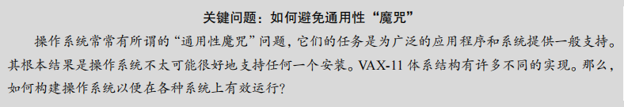
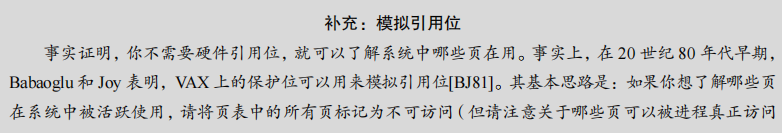
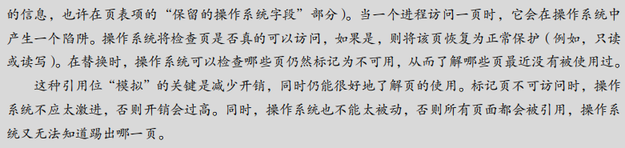
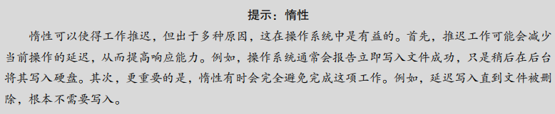

## 第23章 VAX/VMS 虚拟内存系统

​		在我们结束对虚拟内存的研究之前，让我们仔细研究一下 VAX/VMS 操作系统[LL82]的虚拟内存管理器，它特别干净漂亮。本章将讨论该系统，说明如何在一个完整的内存管理器中，将先前章节中提出的一些概念结合在一起。

### 23.1 背景

​		数字设备公司（DEC）在 20 世纪 70 年代末推出了 VAX-11 小型机架构。VAX-11 系列是当时微型计算机领域的领导者之一，其操作系统被称为 VAX/VMS（通常简称为 VMS）。VMS 操作系统的主要设计目标之一是通用性，它需要在广泛的硬件配置上表现良好，从较便宜的 VAX 计算机到功能强大的高端机器都要能够运行。

​		VAX/VMS 操作系统的开发团队面临的一个主要挑战是如何避免通用性“魔咒”，==即操作系统在广泛的应用场景中表现一般，无法在任何特定场景中表现优异。通过巧妙的设计，VMS 成为了一个成功的通用操作系统案例，即便在硬件存在一些缺陷的情况下，仍能有效运作。==


#### 原文：

​		数字设备公司（DEC）在 20 世纪 70 年代末推出了 VAX-11 小型机体系结构。在微型计算机时代，DEC 是计算机行业的一个大玩家。遗憾的是，一系列糟糕的决定和个人计算机的出现慢慢（但不可避免地）导致该公司走向倒闭[C03]。该架构有许多实现，包括VAX-11/780 和功能较弱的 VAX-11/750。

​		该系统的操作系统被称为 VAX/VMS（或者简单的 VMS），其主要架构师之一是 Dave Cutler，他后来领导开发了微软 Windows NT [C93]。VMS 面临通用性的问题，即它将运行在各种机器上，包括非常便宜的 VAXen（是的，这是正确的复数形式），以及同一架构系列中极高端和强大的机器。因此，操作系统必须具有一些机制和策略，适用于这一系列广泛的系统（并且运行良好）。



​		附带说一句，VMS 是软件创新的很好例子，用于隐藏架构的一些固有缺陷。尽管操作系统通常依靠硬件来构建高效的抽象和假象，但有时硬件设计人员并没有把所有事情都做好。在 VAX 硬件中，我们会看到一些例子，也会看到尽管存在这些硬件缺陷，VMS 操作系统如何构建一个有效的工作系统。


### 23.2 内存管理硬件

VAX-11 提供了一个 32 位的虚拟地址空间，每个页大小为 512 字节。虚拟地址被分为 23 位的虚拟页号 (VPN) 和 9 位的页内偏移量。高两位的 VPN 用于区分不同的段，形成了分页和分段的混合模型。

VAX 系统的虚拟地址空间分为三部分：

1. ==**P0 空间**：用于存储用户程序和向下增长的堆。==
2. ==**P1 空间**：用于栈，栈在此区域中向上增长。==
3. **系统空间（S 空间）**：用于存放受保护的操作系统代码和数据，所有进程共享这部分地址空间。

由于 VAX 的页大小较小（512 字节），页表可能变得非常大。为了减轻内存压力，VAX-11 通过以下两种方式来优化内存管理：

1. **分段页表**：为每个进程的 P0 和 P1 空间分别提供一个页表，这样未使用的地址空间部分就不需要占用页表条目。
2. **内核虚拟内存中的页表**：用户的 P0 和 P1 页表被放入内核虚拟内存中。如果内存压力较大，内核可以将这些页表页交换到磁盘，从而节省物理内存。

由于页表在内核虚拟内存中，因此地址转换过程更加复杂。硬件首先需要查找系统页表，找到进程的 P0 或 P1 页表的页表项，然后进行地址转换。但通过硬件管理的 TLB，这一复杂过程可以被加速。


#### 原文：

​		VAX-11 为每个进程提供了一个 32 位的虚拟地址空间，分为 512 字节的页。因此，虚拟地址由 23 位 VPN 和 9 位偏移组成。此外，VPN 的高两位用于区分页所在的段。因此，如前所述，该系统是分页和分段的混合体。

​		地址空间的下半部分称为“进程空间”，对于每个进程都是唯一的。在进程空间的前半部分（称为 P0）中，有用户程序和一个向下增长的堆。在进程空间的后半部分（P1），有向上增长的栈。地址空间的上半部分称为系统空间（S），尽管只有一半被使用。受保护的操作系统代码和数据驻留在此处，操作系统以这种方式跨进程共享。

​		VMS 设计人员的一个主要关注点是 VAX 硬件中的页大小非常小（512 字节）。由于历史原因选择的这种尺寸，存在一个根本性问题，即简单的线性页表过大。因此，VMS 设计人员的首要目标之一是确保 VMS 不会用页表占满内存。

​		系统通过两种方式，减少了页表对内存的压力。首先，通过将用户地址空间分成两部分，VAX-11 为每个进程的每个区域（P0 和 P1）提供了一个页表。因此，栈和堆之间未使用的地址空间部分不需要页表空间。基址和界限寄存器的使用与你期望的一样。一个基址寄存器保存该段的页表的地址，界限寄存器保存其大小（即页表项的数量）。

​		其次，通过在内核虚拟内存中放置用户页表（对于 P0 和 P1，因此每个进程两个），操作系统进一步降低了内存压力。因此，在分配或增长页表时，内核在段 S 中分配自己的虚拟内存空间。如果内存受到严重压力，内核可以将这些页表的页面交换到磁盘，从而使物理内存可以用于其他用途。

​		将页表放入内核虚拟内存意味着地址转换更加复杂。例如，要转换 P0 或 P1 中的虚拟地址，硬件必须首先尝试在其页表中查找该页的页表项（该进程的 P0 或 P1 页表）。但是，在这样做时，硬件可能首先需要查阅系统页表（它存在于物理内存中）。随着地址转换完成，硬件可以知道页表页的地址，然后最终知道所需内存访问的地址。幸运的是，VAX 的硬件管理的 TLB 让所有这些工作更快，TLB 通常（很有可能）会绕过这种费力的查找。


### 23.3 一个真实的地址空间

VAX/VMS 操作系统将每个进程的虚拟地址空间划分为多个部分，以便有效管理内存并减少对页表的需求。具体来说，VAX-11 系统的虚拟地址空间被划分为三部分：P0 空间、P1 空间和系统空间 (S 空间)。

- **P0 空间**：这是用户程序和向下增长的堆所在的区域。每个进程的 P0 空间是独立的，因此用户程序的数据在不同的进程之间是隔离的。
- **P1 空间**：这是为栈保留的区域，栈在该区域中向上增长。每个进程都有独立的 P1 空间，用于管理各自的栈。
- **系统空间 (S 空间)**：用于存放操作系统代码和数据，所有进程共享此空间的内容。系统空间的上半部分通常未被使用，用于进一步扩展或存放其他系统相关数据。

通过将虚拟地址空间划分为 P0、P1 和 S 空间，VAX/VMS 操作系统能够更有效地管理内存，并减小了页表的大小。此外，通过将页表放入内核虚拟内存中，操作系统可以在内存压力较大时将页表页交换到磁盘，进一步节省了物理内存的使用。

这样，VAX/VMS 操作系统成功地结合了分页和分段的优点，构建了一个高效的虚拟内存管理系统。

#### ==原文：==

​		 VMS 有一个很好的方面，我们可以看到如何构建一个真正的地址空间（见图 23.1）。到目前为止，我们一直假设了一个简单的地址空间，只有用户代码、用户数据和用户堆，但正如我们上面所看到的，真正的地址空间显然更复杂。

**补充：为什么空指针访问会导致段错误**

​		**你现在应该很好地理解一个空指针引用会发生什么。通过这样做，进程生成了一个虚拟地址 0：**

```C
int *p = NULL; // set p = 0 
*p = 10; // try to store value 10 to virtual address 0 
```

​		**硬件试图在 TLB 中查找 VPN（这里也是 0），遇到 TLB 未命中。查询页表，并且发现 VPN 0 的条目被标记为无效。因此，我们遇到无效的访问，将控制权交给操作系统，这可能会终止进程（在 UNIX 系统上，会向进程发出一个信号，让它们对这样的错误做出反应。但是如果信号未被捕获，则会终止进程）。**


例如，代码段永远不会从第 0 页开始。相反，该页被标记为不可访问，以便为检测空指针（null-pointer）访问提供一些支持。因此，设计地址空间时需要考虑的一个问题是对调试的支持，这正是无法访问的零页所提供的。


​		也许更重要的是，内核虚拟地址空间（即其数据结构和代码）是每个用户地址空间的一部分。在上下文切换时，操作系统改变 P0 和 P1 寄存器以指向即将运行的进程的适当页表。但是，它不会更改 S 基址和界限寄存器，并因此将“相同的”内核结构映射到每个用户的地址空间。

​		内核映射到每个地址空间，这有一些原因。这种结构使得内核的运转更轻松。例如，如果操作系统收到用户程序（例如，在 write()系统调用中）递交的指针，很容易将数据从该指针处复制到它自己的结构。操作系统自然是写好和编译好的，无须担心它访问的数据来自哪里。相反，如果内核完全位于物理内存中，那么将页表的交换页切换到磁盘是非常困难的。如果内核被赋予了自己的地址空间，那么在用户应用程序和内核之间移动数据将再次变得复杂和痛苦。通过这种构造（现在广泛使用），内核几乎就像应用程序库一样，尽管是受保护的。

​		关于这个地址空间的最后一点与保护有关。显然，操作系统不希望用户应用程序读取或写入操作系统数据或代码。因此，硬件必须支持页面的不同保护级别才能启用该功能。VAX通过在页表中的保护位中指定CPU 访问特定页面所需的特权级别来实现此目的。因此，系统数据和代码被设置为比用户数据和代码更高的保护级别。试图从用户代码访问这些信息，将会在操作系统中产生一个陷阱，并且（你猜对了）可能会终止违规进程。


### 23.4 页替换

​		在 VAX 系统中，==页表项 (PTE) 包含了一些关键字段：有效位、保护字段（4 位）、修改位（或脏位）、为操作系统保留的字段（5 位），以及存储页面位置的物理帧号码 (PFN)。==有趣的是，VAX 系统的 PTE 中没有引用位（reference bit），这意味着 VMS 的页替换算法必须在没有硬件支持的情况下，确定哪些页是活跃的。

#### **分段的 FIFO 替换策略**

​		为了解决这个问题，VMS 开发了分段的 FIFO（先进先出）替换策略。该策略为每个进程设定了一个驻留集大小 (RSS)，即可以保存在内存中的最大页数。当一个进程超过其 RSS 时，最早进入内存的页将被驱逐。为了进一步优化 FIFO 的性能，VMS 引入了二次机会列表，这包括全局的干净页列表和脏页列表。如果一个页被踢出内存，但在被写回磁盘之前再次被访问，那么操作系统可以直接从二次机会列表中恢复该页，从而避免了昂贵的磁盘访问。

#### **页聚集**

​		为了提高 I/O 效率，VMS 还使用了页聚集 (clustering) 技术。聚集将多个脏页分组到一起，并一次性将它们写入磁盘，从而提高了 I/O 操作的效率。这种技术在现代系统中也广泛应用，通过减少 I/O 操作的次数和增加单次操作的写入量来提高性能。






### 23.5 其他漂亮的虚拟内存技巧

**按需置零**
		按需置零 (demand zeroing) 是 VMS 中的一种惰性优化。当一个进程请求分配一个新页时，操作系统并不会立即将该页置零并分配，而是将页表中的对应项标记为不可访问。当进程实际尝试访问该页时，会触发页错误，此时操作系统再将该页置零并映射到进程的地址空间。如果进程从未访问该页，那么这个置零操作就被完全避免了。

**写时复制 (Copy-On-Write, COW)**
		写时复制是另一个重要的优化策略。==当操作系统需要将某个页面从一个地址空间复制到另一个地址空间时，并不会立即进行物理复制，而是将该页映射为只读。当进程尝试写入该页时，才会真正复制页面，并将其映射为可写入的。==COW 技术不仅节省了内存，还提高了系统性能，**特别是在实现 `fork()` 和 `exec()` 调用时**，它可以避免大量不必要的复制操作。

#### 原文：

​		VMS 有另外两个现在成为标准的技巧：按需置零和写入时复制。我们现在描述这些惰性（lazy）优化。

​		==VMS（以及大多数现代系统）中的一种懒惰形式是页的按需置零（demand zeroing）。==为了更好地理解这一点，我们来考虑一下在你的地址空间中添加一个页的例子。==在一个初级实现中，操作系统响应一个请求，在物理内存中找到页，将该页添加到你的堆中，并将其置零（安全起见，这是必需的。否则，你可以看到其他进程使用该页时的内容。）==，然后将其映射到你的地址空间（设置页表以根据需要引用该物理页）。但是初级实现可能是昂贵的，特别是如果页没有被进程使用。

​		利用按需置零，当页添加到你的地址空间时，操作系统的工作很少。它会在页表中放入一个标记页不可访问的条目。如果进程读取或写入页，则会向操作系统发送陷阱。在处理陷阱时，操作系统注意到（通常通过页表项中“保留的操作系统字段”部分标记的一些位），这实际上是一个按需置零页。此时，操作系统会完成寻找物理页的必要工作，将它置零，并映射到进程的地址空间。如果该进程从不访问该页，则所有这些工作都可以避免，从而体现按需置零的好处。



​		VMS有另一个很酷的优化（几乎每个现代操作系统都是这样），**写时复制（copy-on-write，COW）**。这个想法至少可以回溯到 TENEX 操作系统[BB+72]，它很简单：==如果操作系统需要将一个页面从一个地址空间复制到另一个地址空间，不是实际复制它，而是将其映射到目标地址空间，并在两个地址空间中将其标记为只读。如果两个地址空间都只读取页面，则不会采取进一步的操作，因此操作系统已经实现了快速复制而不实际移动任何数据。==

​		但是，如果其中一个地址空间确实尝试写入页面，就会陷入操作系统。操作系统会注意到该页面是一个 COW 页面，因此（惰性地）分配一个新页，填充数据，并将这个新页映射到错误处理的地址空间。该进程然后继续，现在有了该页的私人副本。

​		COW 有用有一些原因。当然，任何类型的共享库都可以通过写时复制，映射到许多进程的地址空间中，从而节省宝贵的内存空间。在 UNIX 系统中，由于 fork()和 exec()的语义，COW 更加关键。你可能还记得，==fork()会创建调用者地址空间的精确副本。==对于大的地址空间，这样的复制过程很慢，并且是数据密集的。更糟糕的是，大部分地址空间会被随后的exec()调用立即覆盖，它用即将执行的程序覆盖调用进程的地址空间。==通过改为执行写时复制的 fork()，操作系统避免了大量不必要的复制，从而保留了正确的语义，同时提高了性能。==


### 23.6 小结

​		VAX/VMS 系统通过结合分段的 FIFO 替换策略、按需置零和写时复制等多种技术，构建了一个高效的虚拟内存管理系统。尽管 VAX/VMS 的设计已经过去了很多年，但这些经典的理念仍然影响着现代操作系统的设计。通过深入了解 VAX/VMS 系统的虚拟内存管理机制，我们可以更好地理解操作系统中虚拟内存管理的基本原理。