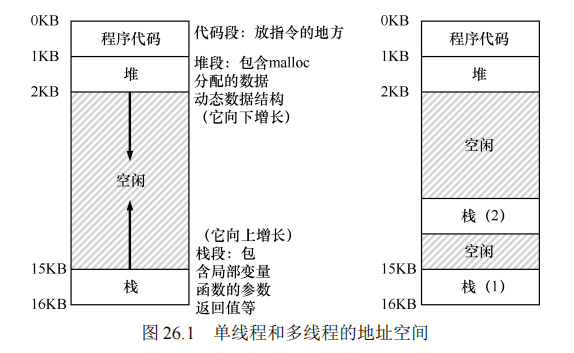
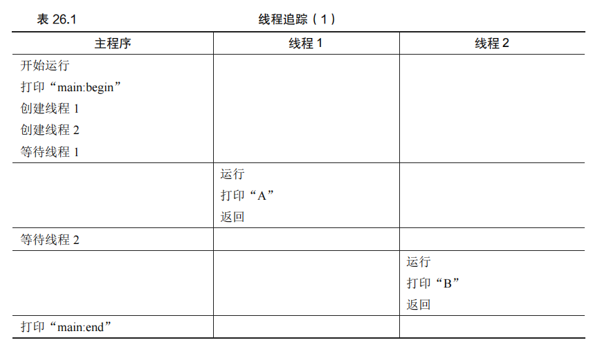
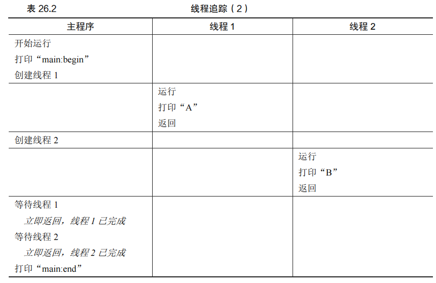
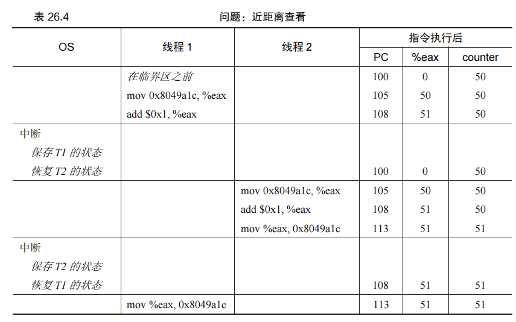

### 第 26 章 并发：介绍

到目前为止，我们已经探讨了操作系统提供的各种基本抽象，例如将物理 CPU 转换为多个虚拟 CPU，以支持多个程序同时运行的假象，还探讨了如何通过虚拟内存的抽象为每个进程创建一个巨大的、私有的地址空间。通过这些机制，多个地址空间得以复用物理内存（或磁盘）。

本章将介绍一个新抽象：**线程（thread）**，这是为单个运行进程提供的并发机制。在传统的单线程程序中，只有一个执行点（即一个程序计数器，用来存放要执行的指令）。然而，在多线程程序中，会有多个执行点（多个程序计数器），每个执行点都用于获取指令并执行。换句话说，每个线程类似于一个独立的进程，唯一的区别是它们共享同一个地址空间，从而可以访问相同的数据。

#### 线程状态与进程状态的相似性

单个线程的状态与进程的状态非常相似。线程拥有一个程序计数器（PC），用于记录线程的执行位置。每个线程还有自己的一组寄存器，用于进行计算。如果两个线程在一个处理器上运行，从一个线程（T1）切换到另一个线程（T2）时，就会发生**上下文切换（context switch）**。线程间的上下文切换类似于进程间的上下文切换。不同之处在于，线程切换时地址空间保持不变，因此不需要切换页表。

#### 线程和进程之间的栈的差异

线程和进程的另一个主要区别在于栈。在传统的单线程进程中，只有一个栈，通常位于地址空间的一端（见图 26.1 左图）。然而，在多线程进程中，由于每个线程可以独立运行，并且可能会调用各种例程完成任务，因此每个线程都有自己的栈。这样，地址空间中可能存在多个栈（见图 26.1 右图）。这些栈中的变量、参数和返回值等会被放置在所谓的**线程本地存储（thread-local storage）** 中，即相关线程的栈中。

尽管多个栈可能会破坏地址空间的美感，但通常栈不会太大（除非大量使用递归的程序）。幸运的是，大多数程序并不需要使用太大的栈空间。

#### 原文：

​		目前为止，我们已经看到了操作系统提供的基本抽象的发展；也看到了如何将一个物理 CPU 变成多个虚拟 CPU（virtual CPU），从而支持多个程序同时运行的假象；还看到了如何为每个进程创建巨大的、私有的虚拟内存（virtual memory）的假象，这种地址空间（address space）的抽象让每个程序好像拥有自己的内存，而实际上操作系统秘密地让多个地址空间复用物理内存（或者磁盘）。

​		本章将介绍为单个运行进程提供的新抽象：线程（thread）。经典观点是一个程序只有一个执行点（一个程序计数器，用来存放要执行的指令），但多线程（multi-threaded）程序会有多个执行点（多个程序计数器，每个都用于取指令和执行）。换一个角度来看，每个线程类似于独立的进程，只有一点区别：它们共享地址空间，从而能够访问相同的数据。

​		因此，单个线程的状态与进程状态非常类似。线程有一个程序计数器（PC），记录程序从哪里获取指令。每个线程有自己的一组用于计算的寄存器。所以，如果有两个线程运行在一个处理器上，从运行一个线程（T1）切换到另一个线程（T2）时，必定发生上下文切换（context switch）。线程之间的上下文切换类似于进程间的上下文切换。对于进程，我们将状态保存到进程控制块（Process Control Block，PCB）。现在，我们需要一个或多个线程控制块（Thread Control Block，TCB），保存每个线程的状态。但是，与进程相比，线程之间的上下文切换有一点主要区别：地址空间保持不变（即不需要切换当前使用的页表）。

​		线程和进程之间的另一个主要区别在于栈。在简单的传统进程地址空间模型 [我们现在可以称之为单线程（single-threaded）进程] 中，只有一个栈，通常位于地址空间的底部（见图 26.1 左图）。



​		然而，在多线程的进程中，每个线程独立运行，当然可以调用各种例程来完成正在执行的任何工作。不是地址空间中只有一个栈，而是每个线程都有一个栈。假设有一个多线程的进程，它有两个线程，结果地址空间看起来不同（见图 26.1 右图）。

​		在图 26.1 中，可以看到两个栈跨越了进程的地址空间。因此，所有位于栈上的变量、参数、返回值和其他放在栈上的东西，将被放置在有时称为线程本地（thread-local）存储的地方，即相关线程的栈。

​		可能注意到，多个栈也破坏了地址空间布局的美感。以前，堆和栈可以互不影响地增长，直到空间耗尽。多个栈就没有这么简单了。幸运的是，通常栈不会很大（除了大量使用递归的程序）。


### 26.1 实例：线程创建

让我们通过一个简单的例子来演示如何创建线程。假设我们想运行一个程序，该程序创建两个线程，每个线程执行一些独立的任务，在这个例子中，分别打印 "A" 或 "B"。图 26.2 显示了代码。

```
#include <stdio.h> 
#include <assert.h> 
#include <pthread.h> 

void *mythread(void *arg) { 
    printf("%s\n", (char *) arg); 
    return NULL; 
}

int main(int argc, char *argv[]) { 
    pthread_t p1, p2; 
    int rc; 
    printf("main: begin\n"); 
    rc = pthread_create(&p1, NULL, mythread, "A"); assert(rc == 0); 
    rc = pthread_create(&p2, NULL, mythread, "B"); assert(rc == 0); 
    rc = pthread_join(p1, NULL); assert(rc == 0); 
    rc = pthread_join(p2, NULL); assert(rc == 0); 
    printf("main: end\n"); 
    return 0; 
}
```

在这个程序中，主程序创建了两个线程，它们分别执行函数 `mythread()`，并传入不同的参数（"A" 或 "B"）。创建了两个线程（T1 和 T2）后，主程序调用 `pthread_join()`，等待特定的线程完成。

#### 可能的执行顺序

我们来看看这个程序可能的执行顺序。在表 26.1 中，时间是向下递增的，每一列展示了不同的线程（主线程、线程 1 或线程 2）的执行时刻。



然而，这种执行顺序并不是唯一可能的顺序。不同的调度程序可能会导致不同的执行顺序。譬如，调度程序可能在线程创建后立即运行该线程，或决定以不同顺序运行线程。表 26.2 和 26.3 展示了不同的执行顺序。



#### 线程复杂性

通过这些例子可以看出，线程的使用让程序的执行顺序变得更加不可预测，从而使调试和理解程序变得更加困难。线程带来了强大的并发能力，但也使程序的行为更加复杂和难以预测。

总结起来，并发带来了巨大的灵活性和性能提升，但同时也增加了编程的复杂性。如何管理这种复杂性，如何确保线程之间的正确同步，是并发编程中的关键挑战。

### 26.2 为什么更糟糕：共享数据

上面的简单线程示例很好地展示了线程的创建以及它们如何根据调度程序的决定以不同的顺序运行。然而，它并没有展示当多个线程访问共享数据时如何相互作用。这种情况下，线程之间的相互作用可能导致一些非常棘手的问题。

让我们考虑一个简单的例子，其中两个线程试图更新一个全局共享变量。下面是代码示例，如图 26.3 所示：

```
#include <stdio.h> 
#include <pthread.h> 
#include "mythreads.h" 

static volatile int counter = 0; 

// mythread()
// Simply adds 1 to counter repeatedly, in a loop 
// No, this is not how you would add 10,000,000 to 
// a counter, but it shows the problem nicely. 
void *mythread(void *arg) { 
    printf("%s: begin\n", (char *) arg); 
    int i; 
    for (i = 0; i < 1e7; i++) { 
        counter = counter + 1; 
    } 
    printf("%s: done\n", (char *) arg); 
    return NULL; 
} 

// main()
// Just launches two threads (pthread_create) 
// and then waits for them (pthread_join) 
int main(int argc, char *argv[]) { 
    pthread_t p1, p2; 
    printf("main: begin (counter = %d)\n", counter); 
    Pthread_create(&p1, NULL, mythread, "A"); 
    Pthread_create(&p2, NULL, mythread, "B"); 

    // join waits for the threads to finish 
    Pthread_join(p1, NULL); 
    Pthread_join(p2, NULL); 
    printf("main: done with both (counter = %d)\n", counter); 
    return 0; 
}
```

#### 代码说明

1. **线程封装：** 代码中使用了 `Pthread_create()` 和 `Pthread_join()` 进行线程创建和合并，并在失败时退出。这种封装便于处理错误，确保我们注意到任何潜在的问题。
2. **共享数据访问：** 在这段代码中，两个线程都尝试更新共享变量 `counter`，每个线程在循环中执行 1000 万次的加 1 操作。因此，理论上，最终的 `counter` 值应该是 2000 万。

#### 实验结果

在实际运行中，有时程序会如预期般工作，产生正确的结果：

```
prompt> gcc -o main main.c -Wall -pthread 
prompt> ./main 
main: begin (counter = 0) 
A: begin 
B: begin 
A: done 
B: done 
main: done with both (counter = 20000000)
```

然而，即使在单处理器上运行这段代码，也不一定会得到正确的结果。例如：

```
prompt> ./main 
main: begin (counter = 0) 
A: begin 
B: begin 
A: done 
B: done 
main: done with both (counter = 19345221)
```

甚至，结果可能每次都不同：

```
prompt> ./main 
main: begin (counter = 0) 
A: begin 
B: begin 
A: done 
B: done 
main: done with both (counter = 19221041)
```

#### 为什么会发生这种情况？

这类问题的核心在于**竞态条件（race condition）**。当多个线程并发地访问和修改共享数据时，调度程序的决策可能导致这些线程的操作交错执行，产生不确定的行为。特别是在这种情况下，`counter = counter + 1` 实际上并不是一个原子操作，而是由多个步骤组成：

1. 读取 `counter` 的当前值。
2. 计算新的值。
3. 将新值写回 `counter`。

如果两个线程交替执行这些步骤，很可能导致某个更新被覆盖，从而导致 `counter` 的最终值比预期的要小。

#### 提示：了解并使用工具

为了更好地理解和调试这种情况，你应该学习使用调试工具。例如，可以使用**反汇编程序**（如 `objdump`）来查看程序的汇编代码，理解底层指令是如何执行的。通过分析 `counter` 更新的底层代码，你可以更清楚地看到线程交替执行可能产生的竞态条件。

使用工具如 `gdb` 调试器或 `valgrind` 这样的内存分析器，可以帮助你更深入地了解程序的执行过程，并找到并发程序中的潜在问题。熟练掌握这些工具，将有助于你建立更健壮的并发程序。

### 26.3 核心问题：不可控的调度

为了理解为什么会发生前面提到的问题，我们需要了解编译器为更新共享变量 `counter` 生成的汇编代码序列。在这个例子中，我们的目标是让 `counter` 的值增加 1。以下是可能生成的代码序列（在 x86 架构下）：

```
mov 0x8049a1c, %eax
add $0x1, %eax
mov %eax, 0x8049a1c
```

假设变量 `counter` 存储在内存地址 `0x8049a1c`。在这三条指令中，第一条指令使用 `mov` 指令将内存地址 `0x8049a1c` 中的值加载到寄存器 `eax` 中。然后，第二条指令将 `eax` 寄存器中的值加 1。最后，第三条指令将 `eax` 中的新值存回 `counter` 对应的内存地址。

#### 竞态条件的示例

假设线程 1 开始执行这段代码并将 `counter` 的值（假设初始值为 50）加载到它的 `eax` 寄存器中。此时，`eax` = 50。然后，线程 1 对 `eax` 执行加 1 操作，`eax` = 51。就在此时，系统触发了时钟中断，操作系统将线程 1 的状态保存到它的 TCB（线程控制块）中，并切换到线程 2。

现在，线程 2 开始执行相同的代码段。它首先将 `counter` 的当前值（仍为 50，因为线程 1 的更新尚未写回内存）加载到它的 `eax` 寄存器中。因此，线程 2 的 `eax` = 50。接着，线程 2 对 `eax` 执行加 1 操作，`eax` = 51，并将 `eax` 的值写回 `counter` 的内存地址。

随后，操作系统再次发生上下文切换，线程 1 恢复执行。此时，线程 1 的 `eax` = 51，并且准备将这个值写回 `counter` 对应的内存地址。结果，`counter` 的最终值仍然是 51，而不是预期的 52。

这种现象称为**竞态条件（race condition）**，即程序的行为依赖于多个线程的相对执行顺序。在竞态条件下，线程对共享资源的访问顺序不确定，可能导致数据不一致性或其他错误。

#### 临界区与互斥

这种代码段被称为**临界区（critical section）**，因为它是访问共享资源的部分代码。在临界区内，如果允许多个线程同时执行，可能会导致数据竞争和不一致性。因此，我们希望确保在任意时刻最多只有一个线程能执行临界区内的代码。

**互斥（mutual exclusion）**是我们期望的属性，它保证了当一个线程在临界区内执行时，其他线程将被阻止进入该临界区。实现互斥的一种常见方法是使用锁或其他同步原语，以确保同一时间只有一个线程能够访问共享资源。

#### 表 26.4：竞态条件的详细示例

为了更清楚地理解这个问题，我们可以逐步跟踪执行的指令序列：

| OS 操作      | 线程 1 执行指令       | 线程 1 状态 | 线程 2 执行指令       | 线程 2 状态 | `counter` 状态 |
| ------------ | --------------------- | ----------- | --------------------- | ----------- | -------------- |
| 在临界区之前 | -                     | -           | -                     | -           | 50             |
| `mov` 指令   | `mov 0x8049a1c, %eax` | `eax` = 50  | -                     | -           | 50             |
| `add` 指令   | `add $0x1, %eax`      | `eax` = 51  | -                     | -           | 50             |
| 中断         | 保存线程 1 的状态     | -           | 恢复线程 2 的状态     | -           | 50             |
| `mov` 指令   | -                     | -           | `mov 0x8049a1c, %eax` | `eax` = 50  | 50             |
| `add` 指令   | -                     | -           | `add $0x1, %eax`      | `eax` = 51  | 50             |
| `mov` 指令   | -                     | -           | `mov %eax, 0x8049a1c` | `eax` = 51  | 51             |
| 中断         | 保存线程 2 的状态     | -           | 恢复线程 1 的状态     | -           | 51             |
| `mov` 指令   | `mov %eax, 0x8049a1c` | `eax` = 51  | -                     | -           | 51             |

最终，尽管线程 1 和线程 2 都尝试将 `counter` 增加 1，但由于竞态条件的存在，`counter` 的最终值仍然是 51，而不是预期的 52。

#### 互斥与 Dijkstra

为了避免竞态条件，我们需要确保在执行临界区代码时只有一个线程能够进入，这就是所谓的互斥。Edgar Dijkstra 是这个领域的重要先驱，他创造了很多相关的术语和概念，并提出了早期解决并发问题的方法。

在接下来的章节中，我们将讨论如何使用各种同步原语（如锁、信号量等）来实现互斥，从而避免竞态条件。

#### ==原文：==

​	为了理解为什么会发生这种情况，我们必须了解编译器为更新计数器生成的代码序列。

在这个例子中，我们只是想给 counter 加上一个数字（1）。因此，做这件事的代码序列可能

看起来像这样（在 x86 中）：

```
mov 0x8049a1c, %eax 
add $0x1, %eax 
mov %eax, 0x8049a1c
```

​		这个例子假定，变量 counter 位于地址 0x8049a1c。在这 3 条指令中，先用 x86 的 mov指令，从内存地址处取出值，放入 eax。然后，给 eax 寄存器的值加 1（0x1）。最后，eax的值被存回内存中相同的地址。

​		设想我们的两个线程之一（线程 1）进入这个代码区域，并且因此将要增加一个计数器。它将 counter 的值（假设它这时是 50）加载到它的寄存器 eax 中。因此，线程 1 的 eax = 50。然后它向寄存器加 1，因此 eax = 51。现在，一件不幸的事情发生了：时钟中断发生。因此，操作系统将当前正在运行的线程（它的程序计数器、寄存器，包括 eax 等）的状态保存到线程的 TCB。

​		现在更糟的事发生了：线程 2 被选中运行，并进入同一段代码。它也执行了第一条指令，获取计数器的值并将其放入其 eax 中 [请记住：运行时每个线程都有自己的专用寄存器。上下文切换代码将寄存器虚拟化（virtualized），保存并恢复它们的值]。此时 counter 的值仍为 50，因此线程 2 的 eax = 50。假设线程 2 执行接下来的两条指令，将 eax 递增 1（因此 eax = 51），然后将 eax 的内容保存到 counter（地址 0x8049a1c）中。因此，全局变量 counter 现在的值是 51。

​		最后，又发生一次上下文切换，线程 1 恢复运行。还记得它已经执行过 mov 和 add 指令，现在准备执行最后一条 mov 指令。回忆一下，eax=51。因此，最后的 mov 指令执行，将值保存到内存，counter 再次被设置为 51。

​		简单来说，发生的情况是：增加 counter 的代码被执行两次，初始值为 50，但是结果为51。这个程序的“正确”版本应该导致变量 counter 等于 52。为了更好地理解问题，让我们追踪一下详细的执行。假设在这个例子中，上面的代码被加载到内存中的地址 100 上，就像下面的序列一样（熟悉类似 RISC 指令集的人请注意：x86 具有可变长度指令。这个 mov 指令占用 5 个字节的内存，add 只占用 3 个字节）

```
100 mov 0x8049a1c, %eax 
105 add $0x1, %eax 
108 mov %eax, 0x8049a1c
```

​		有了这些假设，发生的情况如表 26.4 所示。假设 counter 从 50 开始，并追踪这个例子，确保你明白发生了什么。

​		这里展示的情况称为竞态条件（race condition）：结果取决于代码的时间执行。由于运气不好（即在执行过程中发生的上下文切换），我们得到了错误的结果。事实上，可能每次都会得到不同的结果。因此，我们称这个结果是不确定的（indeterminate），而不是确定的（deterministic）计算（我们习惯于从计算机中得到）。不确定的计算不知道输出是什么，它在不同运行中确实可能是不同的。

​		由于执行这段代码的多个线程可能导致竞争状态，因此我们将此段代码称为临界区（critical section）。临界区是访问共享变量（或更一般地说，共享资源）的代码片段，一定不能由多个线程同时执行。




​		我们真正想要的代码就是所谓的互斥（mutual exclusion）。这个属性保证了如果一个线程在临界区内执行，其他线程将被阻止进入临界区。

​		事实上，所有这些术语都是由 Edsger Dijkstra 创造的，他是该领域的先驱，并且因为这项工作和其他工作而获得了图灵奖。请参阅他 1968 年关于“Cooperating Sequential Processes”的文章[D68]，该文对这个问题给出了非常清晰的描述。在本书的这一部分，我们将多次看到 Dijkstra 的名字。


### 26.4 原子性愿望

解决共享数据访问中的竞态条件问题的一种方法是使用更强大的指令，使得某些操作可以在单个步骤中完成，从而消除在执行这些操作时发生不合时宜的中断的可能性。例如，假设我们有一条超级指令：

```
memory-add 0x8049a1c, $0x1
```

这条假想的指令将一个值添加到指定的内存位置，并且硬件保证它以原子方式（atomic）执行。这意味着在指令执行过程中，不会发生中断，操作要么完全发生，要么完全不发生——没有中间状态。这样的硬件支持将非常有用。

### 原子操作的概念

“原子性”意味着“作为一个单元”操作。有时我们说这是“全部或没有”的操作。我们希望能够以原子方式执行以下三条指令的序列：

```
mov 0x8049a1c, %eax
add $0x1, %eax
mov %eax, 0x8049a1c
```

然而，在大多数情况下，硬件不提供这样高级别的原子操作指令。设想你正在构建一个并发的 B 树结构，并希望更新它。我们很难期待硬件提供“B 树的原子性更新”这样的复杂指令集。

### 同步原语的引入

因此，操作系统和多线程程序通常依赖于硬件提供的更基础的同步原语（synchronization primitives），如锁（locks）、信号量（semaphores）和条件变量（condition variables），这些原语可以用来构建更复杂的、确保正确性的同步操作。通过使用这些同步原语，结合操作系统的支持，开发者可以编写多线程代码，使其在访问临界区时避免竞态条件，确保产生正确的结果。

### 关键并发术语

在讨论并发编程时，有几个重要术语需要掌握：

- **临界区（critical section）**：指访问共享资源的代码片段，该资源通常是一个变量或数据结构。为了避免数据竞争，必须确保每次只有一个线程进入临界区。
- **竞态条件（race condition）**：当多个线程同时进入临界区并试图更新共享数据时，可能会导致意外的结果。竞态条件使程序的行为依赖于线程的执行顺序，而这种顺序在多线程环境中是不可预测的。
- **不确定性（indeterminate behavior）**：程序的输出在不同的运行中可能不同，具体取决于线程在何时执行。竞态条件导致程序的输出不再是确定的。
- **互斥（mutual exclusion）**：为了解决竞态条件，程序必须确保每次只有一个线程进入临界区。通过使用锁等同步原语来实现互斥，程序可以避免竞态条件，确保其行为是确定的。

### 核心问题：如何实现同步

为了实现有效的同步，我们需要硬件提供基础的同步原语，并在操作系统层面上正确地利用这些原语。接下来的讨论将深入研究如何在硬件和操作系统的支持下，构建和使用同步原语来确保多线程程序的正确性。

### 26.5 还有一个问题：等待另一个线程

​		除了确保原子性，线程之间还有另一种常见的交互形式：一个线程在继续执行之前必须等待另一个线程完成某项操作。这种情况在多线程编程中非常普遍，例如，一个线程可能需要等待另一个线程完成 I/O 操作后再继续执行。对于这种交互，操作系统提供了如条件变量（condition variables）之类的机制，以便线程可以协调它们的执行顺序。

### 26.6 小结：为什么操作系统课要研究并发

​		并发是操作系统的重要组成部分，因为操作系统本身就是第一个并发程序。它必须管理多个进程和线程，确保系统的稳定性和性能。随着计算机系统的演进，应用程序也逐渐变得多线程化，开发者必须考虑到并发带来的复杂性。因此，理解并发问题以及如何通过操作系统来管理并发，是操作系统课程的重要内容。

​		通过学习操作系统中的并发管理，我们可以更好地理解和解决多线程编程中的挑战，并运用这些知识构建健壮的多线程应用程序。

#### 提示：使用原子操作

​		原子操作是构建计算机系统的最强大的基础技术之一，从计算机体系结构到并行代码（我们在这里研究的内容）、文件系统（我们将很快研究）、数据库管理系统，甚至分布式系统[L+93]。将一系列动作原子化（atomic）背后的想法可以简单用一个短语表达：“全部或没有”。看上去，要么你希望组合在一起的所有活动都发生了，要么它们都没有发生。不会看到中间状态。有时，将许多行为组合为单个原子动作称为事务（transaction），这是一个在数据库和事务处理世界中非常详细地发展的概念[GR92]。

​		在探讨并发的主题中，我们将使用同步原语，将指令的短序列变成原子性的执行块。但是我们会看到，原子性的想法远不止这些。例如，文件系统使用诸如日志记录或写入时复制等技术来自动转换其磁盘状态，这对于在系统故障时正确运行至关重要。如果不明白，不要担心——后续某章会探讨。