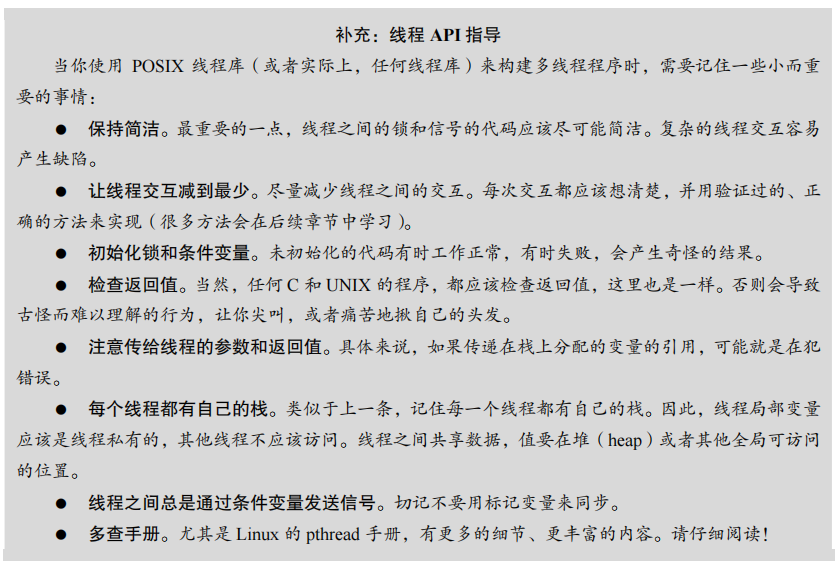

## 第27章 插叙：线程API

​		本章介绍了主要的线程 API。后续章节也会进一步介绍如何使用 API。更多的细节可以参考其他书籍和在线资源[B89，B97，B+96，K+96]。随后的章节会慢慢介绍锁和条件变量的概念，因此本章可以作为参考。


### 27.1 线程创建

编写多线程程序的第一步就是创建新线程，因此必须存在某种线程创建接口。在 POSIX 中，创建线程的方式非常简单：

```C
#include <pthread.h>

int pthread_create(pthread_t *thread, const pthread_attr_t *attr, void *(*start_routine)(void*), void *arg);
```

这个函数声明看起来可能有点复杂（特别是如果你不熟悉 C 中的函数指针），但实际使用时并不难。该函数有四个参数：`thread`、`attr`、`start_routine` 和 `arg`。

- **`thread`**: 这是一个指向 `pthread_t` 结构类型的指针。这个结构将用于标识线程，因此需要将它传入 `pthread_create()` 以便初始化。
- **`attr`**: 用于指定线程的属性，例如栈大小或调度优先级等信息。可以通过调用 `pthread_attr_init()` 来初始化属性。在大多数情况下，传入 `NULL` 即可使用默认属性。
- **`start_routine`**: 这是一个函数指针，指向线程将要执行的函数。这个函数必须接受一个 `void *` 类型的参数，并返回一个 `void *` 类型的值。
- **`arg`**: 这是要传递给线程执行函数的参数，可以是任何类型的数据。为了通用性，`arg` 的类型为 `void *`，允许传递任意类型的数据。

#### 示例

来看一个创建线程的简单例子：

```C
#include <pthread.h>
#include <stdio.h>

typedef struct myarg_t {
    int a;
    int b;
} myarg_t;

void *mythread(void *arg) {
    myarg_t *m = (myarg_t *) arg;
    printf("Thread arguments: %d %d\n", m->a, m->b);
    return NULL;
}

int main(int argc, char *argv[]) {
    pthread_t p;
    int rc;

    myarg_t args;
    args.a = 10;
    args.b = 20;

    rc = pthread_create(&p, NULL, mythread, &args);
    if (rc != 0) {
        printf("Error creating thread\n");
        return 1;
    }

    pthread_join(p, NULL);  // 等待线程完成
    return 0;
}
```

在这个例子中，我们定义了一个结构体 `myarg_t`，其中包含两个整数成员 `a` 和 `b`。然后，我们定义了一个线程函数 `mythread()`，它接受一个 `void *` 参数，并将其转换为 `myarg_t *` 类型，从而可以访问传入的参数。线程函数打印参数的值并返回。

主程序创建一个线程，并传递 `myarg_t` 结构的地址作为参数。线程创建后，主程序调用 `pthread_join()` 等待线程完成。

#### 线程的生命周期

线程一旦创建，就会作为一个独立的执行实体存在。它有自己的调用栈，并与同一进程中的其他线程共享相同的地址空间。线程的生命周期包括创建、执行和终止三个阶段。线程可以通过返回函数或调用 `pthread_exit()` 来终止。当线程终止时，系统会回收它使用的资源，除非它处于“分离”状态。分离状态的线程在终止后，其资源会自动被回收，无需显式等待它完成。

希望这些信息能够补全第 27.1 节的内容。如果你有更多问题或需要进一步的解释，请随时告诉我！


#### 原文：

​		编写多线程程序的第一步就是创建新线程，因此必须存在某种线程创建接口。在 POSIX中，很简单：

```C
#include <pthread.h> 
int 
pthread_create( pthread_t * thread, 
 const pthread_attr_t * attr, 
 void * (*start_routine)(void*), 
 void * arg);
```

​		这个函数声明可能看起来有一点复杂（尤其是如果你没在 C 中用过函数指针），但实际上它并不差。该函数有 4 个参数：thread、attr、start_routine 和 arg。第一个参数 thread 是指向 pthread_t 结构类型的指针，我们将利用这个结构与该线程交互，因此需要将它传入pthread_create()，以便将它初始化。

​		第二个参数 attr 用于指定该线程可能具有的任何属性。一些例子包括设置栈大小，或关于该线程调度优先级的信息。一个属性通过单独调用 pthread_attr_init()来初始化。有关详细信息，请参阅手册。但是，在大多数情况下，默认值就行。在这个例子中，我们只需传入 NULL。

​		第三个参数最复杂，但它实际上只是问：这个线程应该在哪个函数中运行？在 C 中，我们把它称为一个函数指针（function pointer），这个指针告诉我们需要以下内容：一个函数名称（start_routine），它被传入一个类型为 void *的参数（start_routine 后面的括号表明了这一点），并且它返回一个 void *类型的值（即一个 void 指针）。

​		如果这个函数需要一个整数参数，而不是一个 void 指针，那么声明看起来像这样：

```
int pthread_create(..., // first two args are the same 
 void * (*start_routine)(int), 
 int arg);
```

​		如果函数接受 void 指针作为参数，但返回一个整数，函数声明会变成：

```
int pthread_create(..., // first two args are the same 
 int (*start_routine)(void *), 
 void * arg);
```

​		最后，第四个参数 arg 就是要传递给线程开始执行的函数的参数。你可能会问：为什么我们需要这些 void 指针？好吧，答案很简单：将 void 指针作为函数的参数 start_routine，允许我们传入任何类型的参数，将它作为返回值，允许线程返回任何类型的结果。

​		下面来看图 27.1 中的例子。这里我们只是创建了一个线程，传入两个参数，它们被打包成一个我们自己定义的类型（myarg_t）。该线程一旦创建，可以简单地将其参数转换为它所期望的类型，从而根据需要将参数解包。

​		

​		以下是你提供的代码，其中创建了一个线程并传递了参数给线程函数 `mythread`，代码已经格式化并添加了一些解释性注释：

```C
#include <pthread.h>  // 包含 POSIX 线程库的头文件
#include <stdio.h>    // 包含标准输入输出库

// 定义一个结构体 myarg_t，用于传递多个参数给线程函数
typedef struct myarg_t {
    int a;  // 参数 a
    int b;  // 参数 b
} myarg_t;

// 线程函数 mythread，接收一个 void* 类型的参数
void *mythread(void *arg) {
    myarg_t *m = (myarg_t *) arg;  // 将参数转换为 myarg_t 类型的指针
    printf("%d %d\n", m->a, m->b); // 打印参数 a 和 b 的值
    return NULL;                   // 线程函数返回 NULL，表示无返回值
}

int main(int argc, char *argv[]) {
    pthread_t p;    // 定义一个 pthread_t 变量用于存储线程 ID
    int rc;         // 用于存储 pthread_create 的返回值

    myarg_t args;   // 定义一个 myarg_t 类型的变量 args
    args.a = 10;    // 设置参数 a 的值为 10
    args.b = 20;    // 设置参数 b 的值为 20

    // 创建一个新线程 p，执行函数 mythread，并传递 &args 作为参数
    rc = pthread_create(&p, NULL, mythread, &args);

    // 检查线程创建是否成功
    if (rc != 0) {
        fprintf(stderr, "Error creating thread\n");
        return 1;  // 如果创建失败，打印错误并返回 1
    }

    // 等待线程 p 结束
    rc = pthread_join(p, NULL);

    // 检查线程等待是否成功
    if (rc != 0) {
        fprintf(stderr, "Error joining thread\n");
        return 1;  // 如果等待失败，打印错误并返回 1
    }

    return 0;  // 主程序正常结束
}
```

#### 解释说明：

1. **头文件：**
   - `#include <pthread.h>`: 用于包含 POSIX 线程相关的函数和数据类型定义。
   - `#include <stdio.h>`: 用于包含标准输入输出函数。
2. **数据结构 `myarg_t`：**
   - 用于将多个参数打包传递给线程函数。这里包含两个整数成员 `a` 和 `b`。
3. **线程函数 `mythread`：**
   - 接收一个 `void*` 类型的参数，通常是为了灵活传递任何类型的数据。
   - 通过类型转换 `(myarg_t *)` 将传递的参数转换为 `myarg_t` 类型。
   - 使用 `printf` 打印结构体中的成员 `a` 和 `b`。
4. **主函数 `main`：**
   - 创建一个线程变量 `p` 和一个返回值变量 `rc`。
   - 初始化 `myarg_t` 结构体 `args` 的成员。
   - 使用 `pthread_create` 创建新线程，传递函数指针 `mythread` 和参数 `&args`。
   - 使用 `pthread_join` 等待线程结束，确保主程序在线程结束后才退出。

#### 重要注意事项：

- 线程函数中使用了 `printf`，它是线程安全的，可以在多线程环境中使用。
- `pthread_create` 和 `pthread_join` 都有返回值，返回 0 表示成功，其他值表示失败，需要进行检查。

​		它就在那里！一旦你创建了一个线程，你确实拥有了另一个活着的执行实体，它有自己的调用栈，与程序中所有当前存在的线程在相同的地址空间内运行。好玩的事开始了！


### 27.2 线程完成

上面的例子展示了如何创建一个线程。但是，如果你想等待线程完成，会发生什么情况？为了确保线程执行完毕，你需要使用 `pthread_join()` 函数。该函数有两个参数：

- 第一个参数是 `pthread_t` 类型，用于指定要等待的线程。这个变量是在创建线程时由 `pthread_create()` 初始化的。你需要保存它，以便稍后使用它来等待线程终止。
- 第二个参数是一个指针，指向你希望得到的线程返回值。因为线程函数可以返回任何类型的值，因此该指针定义为 `void *` 类型。由于 `pthread_join()` 会修改传入的参数值，因此你需要传入一个指向该值的指针，而不仅仅是该值本身。

来看一个示例代码（见图 27.2）。在这个例子中，我们再次创建了一个线程，并通过 `myarg_t` 结构传递一些参数。线程函数的返回值使用 `myret_t` 类型。当线程完成时，主线程通过 `pthread_join()` 等待线程，并获取线程的返回值，即 `myret_t` 结构中的内容。

```C
#include <stdio.h> 
#include <pthread.h> 
#include <assert.h> 
#include <stdlib.h> 

typedef struct myarg_t { 
    int a; 
    int b; 
} myarg_t; 

typedef struct myret_t { 
    int x; 
    int y; 
} myret_t; 

void *mythread(void *arg) { 
    myarg_t *m = (myarg_t *) arg; 
    printf("%d %d\n", m->a, m->b); 
    myret_t *r = (myret_t *) malloc(sizeof(myret_t)); 
    r->x = 1; 
    r->y = 2; 
    return (void *) r; 
} 

int main(int argc, char *argv[]) { 
    int rc; 
    pthread_t p; 
    myret_t *m; 

    myarg_t args; 
    args.a = 10; 
    args.b = 20; 
    rc = pthread_create(&p, NULL, mythread, &args); 
    assert(rc == 0); 
    rc = pthread_join(p, (void **) &m); 
    assert(rc == 0); 
    printf("returned %d %d\n", m->x, m->y); 
    free(m);  // 不要忘记释放分配的内存
    return 0; 
}
```

#### 重要说明

1. **内存分配**: 在示例中，返回值是通过 `malloc()` 动态分配的。这意味着线程返回的指针指向的是堆上的内存，而不是栈上的内存。因此，主线程在使用完返回值后需要调用 `free()` 释放内存。
2. **避免返回栈上的指针**: 如果你在线程函数中分配了栈内存并返回它的地址，如下例所示，那么线程终止时栈内存将被释放，返回的指针将指向无效的内存，导致程序出现不确定行为：

```C
void *mythread(void *arg) { 
    myarg_t *m = (myarg_t *) arg; 
    printf("%d %d\n", m->a, m->b); 
    myret_t r;  // 分配在栈上：不安全！
    r.x = 1; 
    r.y = 2; 
    return (void *) &r;  // 返回栈指针：危险！
}
```

1. **简单情况下的传参与返回**: 如果线程函数只需传入或返回一个简单的值（如 `int`），那么你可以不必创建结构，直接传递参数，如图 27.3 所示：

```
void *mythread(void *arg) { 
    int m = (int) arg; 
    printf("%d\n", m); 
    return (void *) (m + 1); 
}

int main(int argc, char *argv[]) { 
    pthread_t p; 
    int rc, m; 
    rc = pthread_create(&p, NULL, mythread, (void *) 100); 
    assert(rc == 0); 
    rc = pthread_join(p, (void **) &m); 
    assert(rc == 0); 
    printf("returned %d\n", m); 
    return 0; 
}
```

#### 线程的使用场景

在多线程编程中，`pthread_create()` 和 `pthread_join()` 是关键的 API，它们允许你创建并控制线程。通常情况下，`pthread_join()` 用于确保线程在主线程结束前执行完毕。对于长期运行的程序，如多线程 Web 服务器，可能不会使用 `pthread_join()`，而是让线程独立地完成各自的任务。

通过这些例子和注意事项，你可以更好地理解如何创建和管理线程，确保你的多线程程序正确运行。


#### 原文：

​		上面的例子展示了如何创建一个线程。但是，如果你想等待线程完成，会发生什么情况？你需要做一些特别的事情来等待完成。具体来说，你必须调用函数 pthread_join()。

​		该函数有两个参数。第一个是 pthread_t 类型，用于指定要等待的线程。这个变量是由线程创建函数初始化的（当你将一个指针作为参数传递给 pthread_create()时）。如果你保留了它，就可以用它来等待该线程终止。

​		第二个参数是一个指针，指向你希望得到的返回值。因为函数可以返回任何东西，所以它被定义为返回一个指向 void 的指针。因为 pthread_join()函数改变了传入参数的值，所以你需要传入一个指向该值的指针，而不只是该值本身。

​		我们来看另一个例子（见图 27.2）。在代码中，再次创建单个线程，并通过 myarg_t 结构传递一些参数。对于返回值，使用 myret_t 型。当线程完成运行时，主线程已经在pthread_join()函数内等待了①。然后会返回，我们可以访问线程返回的值，即在 myret_t 中的内容。

​		有几点需要说明。首先，我们常常不需要这样痛苦地打包、解包参数。如果我们不需要参数，创建线程时传入 NULL 即可。类似的，如果不需要返回值，那么 pthread_join()调用也可以传入 NULL。

​		

​		以下是格式化后的代码，以及相应的解释注释。这个程序创建了一个线程，将参数传递给线程函数，并从线程函数返回结构体 `myret_t` 的指针。

```C
#include <stdio.h>    // 包含标准输入输出库
#include <pthread.h>  // 包含 POSIX 线程库
#include <assert.h>   // 包含断言库，用于错误检查
#include <stdlib.h>   // 包含标准库函数，例如 malloc

// 定义一个结构体 myarg_t，用于传递参数给线程函数
typedef struct myarg_t {
    int a;  // 参数 a
    int b;  // 参数 b
} myarg_t;

// 定义一个结构体 myret_t，用于线程函数返回结果
typedef struct myret_t {
    int x;  // 返回值 x
    int y;  // 返回值 y
} myret_t;

// 线程函数 mythread，接收一个 void* 类型的参数
void *mythread(void *arg) {
    myarg_t *m = (myarg_t *) arg;  // 将传入参数转换为 myarg_t 类型
    printf("%d %d\n", m->a, m->b); // 打印参数 a 和 b 的值

    myret_t *r = malloc(sizeof(myret_t)); // 分配内存给返回值结构体
    assert(r != NULL);  // 确保 malloc 成功分配内存

    r->x = 1;  // 设置返回值 x
    r->y = 2;  // 设置返回值 y

    return (void *) r;  // 返回指向 myret_t 结构体的指针
}

int main(int argc, char *argv[]) {
    int rc;            // 存储返回值
    pthread_t p;       // 定义线程变量 p
    myret_t *m;        // 指向 myret_t 结构体的指针，用于接收线程返回的结果

    myarg_t args;      // 定义参数结构体 args
    args.a = 10;       // 设置参数 a 的值
    args.b = 20;       // 设置参数 b 的值

    // 创建一个新线程，执行 mythread 函数，并传递 &args 作为参数
    rc = pthread_create(&p, NULL, mythread, &args);
    assert(rc == 0);   // 检查线程创建是否成功

    // 等待线程 p 结束，并获取返回的结果存入 m
    rc = pthread_join(p, (void **) &m);
    assert(rc == 0);   // 检查线程等待是否成功

    // 打印线程返回的结果
    printf("returned %d %d\n", m->x, m->y);

    free(m);           // 释放线程返回的结构体内存
    return 0;          // 程序正常结束
}
```

#### **解释说明：**

1. **头文件：**
   - `#include <stdio.h>`: 用于标准输入输出函数（如 `printf`）。
   - `#include <pthread.h>`: 提供线程操作的相关函数和数据类型（如 `pthread_create` 和 `pthread_join`）。
   - `#include <assert.h>`: 用于断言检查，验证条件是否成立。
   - `#include <stdlib.h>`: 包含标准库函数，例如 `malloc` 和 `free`。
2. **结构体定义：**
   - `myarg_t`：用于将多个参数传递给线程函数 `mythread`。
   - `myret_t`：用于线程函数返回多个值。
3. **线程函数 `mythread`：**
   - 接收 `void*` 类型的参数，通过类型转换将其转换为 `myarg_t` 指针。
   - 打印传入的参数值 `a` 和 `b`。
   - 分配内存给 `myret_t` 结构体，并设置返回值 `x` 和 `y`。
   - 返回指向 `myret_t` 结构体的指针。
4. **主函数 `main`：**
   - 创建一个线程变量 `p` 和一个 `myret_t` 指针 `m`。
   - 初始化 `myarg_t` 结构体 `args` 的成员 `a` 和 `b`。
   - 使用 `pthread_create` 创建新线程，并传递 `mythread` 函数和参数 `&args`。
   - 使用 `pthread_join` 等待线程结束，并获取线程返回的结果。
   - 打印线程返回的结果 `x` 和 `y`。
   - 释放分配给 `myret_t` 结构体的内存，避免内存泄漏。

#### **注意事项：**

- 在创建线程和等待线程结束时，使用 `assert` 进行检查，以确保每一步操作都成功执行。
- 在返回指针之前，确保内存分配成功，避免空指针解引用。
- 程序结束前释放所有分配的内存，保持良好的内存管理习惯。


​		其次，如果我们只传入一个值（例如，一个 int），也不必将它打包为一个参数。图 27.3 展示了一个例子。在这种情况下，更简单一些，因为我们不必在结构中打包参数和返回值。

以下是格式化后的代码和相应的解释注释。这个示例展示了如何通过简单的方式将整数参数传递给线程函数，并从线程返回一个修改后的值。

```C
#include <stdio.h>    // 包含标准输入输出库
#include <pthread.h>  // 包含 POSIX 线程库

// 线程函数 mythread，接收一个 void* 类型的参数
void *mythread(void *arg) {
    int m = (int)arg;  // 将传入的 void* 类型参数转换为 int 类型
    printf("%d\n", m); // 打印传入的整数参数

    return (void *)(m + 1);  // 返回传入的整数加 1 后的值，转换为 void* 类型
}

int main(int argc, char *argv[]) {
    pthread_t p;       // 定义线程变量 p
    int rc, m;         // rc 用于存储返回值，m 用于接收线程返回的结果

    // 创建一个新线程，执行 mythread 函数，并传递整数 100 作为参数
    rc = pthread_create(&p, NULL, mythread, (void *)100);
    if (rc != 0) {
        fprintf(stderr, "Error creating thread\n");
        return 1;      // 如果创建失败，打印错误信息并返回 1
    }

    // 等待线程 p 结束，并获取返回的结果存入 m
    rc = pthread_join(p, (void **)&m);
    if (rc != 0) {
        fprintf(stderr, "Error joining thread\n");
        return 1;      // 如果等待失败，打印错误信息并返回 1
    }

    // 打印线程返回的结果
    printf("returned %d\n", m);

    return 0;          // 程序正常结束
}
```

### **解释说明：**

1. **头文件：**
   - `#include <stdio.h>`: 用于标准输入输出函数（如 `printf`）。
   - `#include <pthread.h>`: 提供线程操作的相关函数和数据类型（如 `pthread_create` 和 `pthread_join`）。
2. **线程函数 `mythread`：**
   - 线程函数接收一个 `void*` 类型的参数。
   - 使用类型转换将 `void*` 转换为 `int`，以便处理整数参数。
   - 打印传入的参数值。
   - 返回传入参数加 1 的结果，作为 `void*` 类型返回。
3. **主函数 `main`：**
   - 创建一个线程变量 `p` 和一个整数变量 `m`。
   - 使用 `pthread_create` 创建新线程，传递 `mythread` 函数和整数 `100`（转换为 `void*`）作为参数。
   - 检查 `pthread_create` 是否成功创建线程，如果失败，打印错误信息并退出。
   - 使用 `pthread_join` 等待线程结束，并将线程返回的结果赋值给 `m`。
   - 检查 `pthread_join` 是否成功，如果失败，打印错误信息并退出。
   - 打印线程返回的结果 `m`。

### **注意事项：**

- **类型转换：** 在 `mythread` 函数中，将 `void*` 转换为 `int` 是为了简单的整数处理。这种方式适用于传递小整数，但不适用于传递大型或复杂的数据结构。
- **返回值处理：** 线程函数返回 `void*`，因此主程序中需要将结果转换回合适的类型（这里是 `int`）。
- **错误检查：** 对 `pthread_create` 和 `pthread_join` 的返回值进行了检查，以确保线程的创建和等待成功执行。


​		再次，我们应该注注，必须非常小心如何从线程返回值。特别是，永远不要返回一个指针，并让它指向线程调用栈上分配的东西。如果这样做，你认为会发生什么？（想一想！）下面是一段危险的代码示例，对图 27.2 中的示例做了修改。


​		以下是格式化后的代码，并附加了详细的解释注释。这个代码展示了一个错误的用法：在线程函数中返回一个栈上分配的局部变量的地址，这在 C 中是一个常见的错误，因为栈上分配的变量在函数返回后会被释放。

```C
#include <stdio.h>    // 包含标准输入输出库
#include <pthread.h>  // 包含 POSIX 线程库

// 定义一个结构体 myarg_t，用于传递参数给线程函数
typedef struct myarg_t {
    int a;  // 参数 a
    int b;  // 参数 b
} myarg_t;

// 定义一个结构体 myret_t，用于线程函数返回结果
typedef struct myret_t {
    int x;  // 返回值 x
    int y;  // 返回值 y
} myret_t;

// 线程函数 mythread，接收一个 void* 类型的参数
void *mythread(void *arg) {
    myarg_t *m = (myarg_t *) arg;  // 将传入的参数转换为 myarg_t 类型
    printf("%d %d\n", m->a, m->b); // 打印传入的参数 a 和 b 的值

    myret_t r;       // 在栈上分配 myret_t 结构体，BAD: 线程结束后局部变量 r 将失效
    r.x = 1;         // 设置返回值 x
    r.y = 2;         // 设置返回值 y

    return (void *) &r;  // 返回栈上局部变量 r 的地址，BAD: 这将导致未定义行为
}

int main(int argc, char *argv[]) {
    pthread_t p;           // 定义线程变量 p
    myarg_t args = {10, 20};  // 初始化 myarg_t 结构体，用于传递给线程
    myret_t *result;       // 用于接收线程返回的结果

    // 创建一个新线程，执行 mythread 函数，并传递 &args 作为参数
    pthread_create(&p, NULL, mythread, &args);

    // 等待线程 p 结束，并获取返回的结果存入 result
    pthread_join(p, (void **)&result);

    // 打印线程返回的结果，这里可能会出现未定义行为
    printf("returned %d %d\n", result->x, result->y);

    return 0;  // 程序正常结束
}
```

### **解释说明：**

1. **头文件：**
   - `#include <stdio.h>`: 提供输入输出函数，例如 `printf`。
   - `#include <pthread.h>`: 提供 POSIX 线程的相关函数和数据类型，例如 `pthread_create` 和 `pthread_join`。
2. **数据结构：**
   - `myarg_t`：用于将多个参数传递给线程函数。
   - `myret_t`：用于从线程函数返回多个值。
3. **线程函数 `mythread`：**
   - 接收一个 `void*` 类型的参数，通过类型转换将其转换为 `myarg_t` 指针。
   - 打印结构体中的成员 `a` 和 `b`。
   - 定义 `myret_t` 类型的局部变量 `r`，并设置其成员 `x` 和 `y`。
   - 返回 `&r`（`r` 的地址），但这会导致未定义行为，因为 `r` 是栈上分配的局部变量，其在函数返回后将不再有效。
4. **主函数 `main`：**
   - 创建一个线程 `p` 和一个指向 `myret_t` 的指针 `result`。
   - 使用 `pthread_create` 创建新线程，并将 `args` 作为参数传递给线程。
   - 使用 `pthread_join` 等待线程结束，并将线程返回的结果存入 `result`。
   - 打印线程返回的结果，但此时 `result` 指向的内存可能已经无效，这可能导致未定义行为或崩溃。

### **注意事项：**

- **返回栈上的局部变量地址是错误的**：当函数返回时，栈上的局部变量内存被释放，任何对这些内存的引用都会导致未定义行为。

- 正确的做法：

  - 使用 `malloc` 动态分配内存，然后返回这块内存的地址。确保在使用完毕后调用 `free` 释放内存。

  - 示例修改为：

    ```C
    myret_t *r = malloc(sizeof(myret_t));  // 使用 malloc 动态分配内存
    if (r == NULL) {
        perror("malloc failed");
        pthread_exit(NULL);
    }
    r->x = 1;
    r->y = 2;
    return (void *) r;
    ```

- **线程结束时正确释放资源**：在 `main` 函数中使用完 `result` 后，使用 `free(result)` 释放内存。


​		在这个例子中，变量 *r* 被分配在 mythread 的栈上。但是，当它返回时，该值会自动释放（这就是栈使用起来很简单的原因！），因此，将指针传回现在已释放的变量将导致各种不好的结果。当然，当你打印出你以为的返回值时，你可能会感到惊讶（但不一定！）。试试看，自己找出真相①！

​		最后，你可能会注注到，使用 pthread_create()创建线程，然后立即调用 pthread_join()，这是创建线程的一种非常奇怪的方式。事实上，有一个更简单的方法来完成这个任务，它被称为过程调用（procedure call）。显然，我们通常会创建不止一个线程并等待它完成，否则根本没有太多的用途。

​		我们应该注注，并非所有多线程代码都使用 join 函数。例如，多线程 Web 服务器可能会创建大量工作线程，然后使用主线程接受请求，并将其无限期地传递给工作线程。因此这样的长期程序可能不需要 join。然而，创建线程来（并行）执行特定任务的并行程序，很可能会使用 join 来确保在退出或进入下一阶段计算之前完成所有这些工作。


### 27.3 锁

​		在多线程编程中，使用锁来提供互斥访问临界区是非常重要的。这意味着在任何给定的时间，只有一个线程可以进入临界区，从而避免竞争条件。POSIX 线程库提供了两种最基本的锁操作函数：

```C
int pthread_mutex_lock(pthread_mutex_t *mutex);
int pthread_mutex_unlock(pthread_mutex_t *mutex);
```

​		这些函数的使用非常直接。如果你发现某段代码属于临界区，就需要通过锁来保护它，以确保它按预期运行。代码大致如下：

```C
pthread_mutex_t lock;
pthread_mutex_lock(&lock);
// 临界区代码，例如：
x = x + 1;
pthread_mutex_unlock(&lock);
```

**基本原理**：

- `pthread_mutex_lock()` 尝试获取锁。如果没有其他线程持有锁，线程将成功获取锁并进入临界区。
- 如果锁已被另一个线程持有，那么调用 `pthread_mutex_lock()` 的线程将阻塞，直到锁被释放。
- `pthread_mutex_unlock()` 用于释放锁，允许其他阻塞的线程获取该锁。

**常见问题**：

1. **锁的初始化**：

   所有锁在使用前必须正确初始化。POSIX 线程库提供了两种方法来初始化锁：

   - **静态初始化**：使用 `PTHREAD_MUTEX_INITIALIZER` 进行静态初始化。

     ```C
     pthread_mutex_t lock = PTHREAD_MUTEX_INITIALIZER;
     ```
     
   - **动态初始化**：调用 `pthread_mutex_init()` 动态初始化。

     ```C
    int rc = pthread_mutex_init(&lock, NULL);
     assert(rc == 0);  // 确保初始化成功
     ```
   
   初始化时可以指定锁的属性，通常传入 `NULL` 以使用默认属性。

2. **错误检查**：

   在获取锁和释放锁时，检查返回值是非常重要的。如果不检查错误代码，可能会导致多个线程意外进入临界区。你可以使用如下的封装函数来确保代码整洁并处理错误：

   ```C
   void Pthread_mutex_lock(pthread_mutex_t *mutex) {
       int rc = pthread_mutex_lock(mutex);
       assert(rc == 0);
   }
   
   void Pthread_mutex_unlock(pthread_mutex_t *mutex) {
       int rc = pthread_mutex_unlock(mutex);
       assert(rc == 0);
   }
   ```

3. **其他锁操作**：

   POSIX 线程库还提供了以下两个函数，用于更灵活地获取锁：

   - `pthread_mutex_trylock(pthread_mutex_t *mutex)`: 尝试获取锁，如果锁已被占用，则立即返回失败。
   - `pthread_mutex_timedlock(pthread_mutex_t *mutex, struct timespec *abs_timeout)`: 尝试在指定的超时时间内获取锁。如果在超时前获取成功，则返回成功；否则返回超时失败。

   这些函数在某些特殊情况下非常有用，例如在处理死锁时。通过 `pthread_mutex_trylock()` 和 `pthread_mutex_timedlock()`，程序可以避免在尝试获取锁时无限期地阻塞。

**总结**：

​		通过正确地初始化、使用和管理锁，你可以确保多线程程序中的临界区得到安全的访问，避免竞态条件。锁是多线程编程的基础之一，理解并熟练使用这些工具，对于编写健壮的并发程序至关重要。

#### 原文：

​		除了线程创建和 join 之外，POSIX 线程库提供的最有用的函数集，可能是通过锁（lock）来提供互斥进入临界区的那些函数。这方面最基本的一对函数是：

```
int pthread_mutex_lock(pthread_mutex_t *mutex); 
int pthread_mutex_unlock(pthread_mutex_t *mutex);
```

​		函数应该易于理解和使用。如果你注识到有一段代码是一个临界区，就需要通过锁来保护，以便像需要的那样运行。你大概可以想象代码的样子：

```
pthread_mutex_t lock; 
pthread_mutex_lock(&lock); 
x = x + 1; // or whatever your critical section is 
pthread_mutex_unlock(&lock);
```

​		这段代码的注思是：如果在调用 pthread_mutex_lock()时没有其他线程持有锁，线程将获取该锁并进入临界区。如果另一个线程确实持有该锁，那么尝试获取该锁的线程将不会从该调用返回，直到获得该锁（注味着持有该锁的线程通过解锁调用释放该锁）。当然，在给定的时间内，许多线程可能会卡住，在获取锁的函数内部等待。然而，只有获得锁的线程才应该调用解锁。

​		遗憾的是，这段代码有两个重要的问题。第一个问题是缺乏正确的初始化（lack of proper initialization）。所有锁必须正确初始化，以确保它们具有正确的值，并在锁和解锁被调用时按照需要工作。

​		对于 POSIX 线程，有两种方法来初始化锁。一种方法是使用 PTHREAD_MUTEX_ INITIALIZER，如下所示：

```
pthread_mutex_t lock = PTHREAD_MUTEX_INITIALIZER;
```

​		这样做会将锁设置为默认值，从而使锁可用。初始化的动态方法（即在运行时）是调用 pthread_mutex_init()，如下所示：

```
int rc = pthread_mutex_init(&lock, NULL); 
assert(rc == 0); // always check success!
```

​		此函数的第一个参数是锁本身的地址，而第二个参数是一组可选属性。请你自己去详细了解这些属性。传入 NULL 就是使用默认值。无论哪种方式都有效，但我们通常使用动态（后者）方法。请注注，当你用完锁时，还应该相应地调用 pthread_mutex_destroy()，所有细节请参阅手册。

​		上述代码的第二个问题是在调用获取锁和释放锁时没有检查错误代码。就像 UNIX 系统中调用的任何库函数一样，这些函数也可能会失败！如果你的代码没有正确地检查错误代码，失败将会静静地发生，在这种情况下，可能会允许多个线程进入临界区。至少要使用包注的函数，它对函数成功加上断言（见图 27.4）。更复杂的（非玩具）程序，在出现问题时不能简单地退出，应该检查失败并在获取锁或释放锁未成功时执行适当的操作。

```
// Use this to keep your code clean but check for failures 
// Only use if exiting program is OK upon failure 
void Pthread_mutex_lock(pthread_mutex_t *mutex) { 
 int rc = pthread_mutex_lock(mutex); 
 assert(rc == 0); 
} 
图 27.4 包注函数示例
```

​		获取锁和释放锁函数不是 pthread 与锁进行交互的仅有的函数。特别是，这里有两个你可能感兴趣的函数：

```
int pthread_mutex_trylock(pthread_mutex_t *mutex); 
int pthread_mutex_timedlock(pthread_mutex_t *mutex, 
 struct timespec *abs_timeout);
```

​		这两个调用用于获取锁。如果锁已被占用，则 trylock 版本将失败。获取锁的 timedlock定版本会在超时或获取锁后返回，以先发生者为准。因此，具有零超时的 timedlock 退化为trylock 的情况。通常应避免使用这两种版本，但有些情况下，避免卡在（可能无限期的）获取锁的函数中会很有用，我们将在以后的章节中看到（例如，当我们研究死锁时）。


### 27.4 条件变量

​		条件变量（condition variable）是线程库中的一个关键组件，用于在线程之间传递信号，特别是在一个线程需要等待另一个线程完成某些操作时。POSIX 线程库为条件变量提供了两个主要函数：

```C
int pthread_cond_wait(pthread_cond_t *cond, pthread_mutex_t *mutex);
int pthread_cond_signal(pthread_cond_t *cond);
```

**使用条件变量的步骤**：

1. **条件变量的初始化**：

   条件变量通常与锁配合使用。在初始化相关的锁和条件变量之后，程序可以使用它们来控制线程的同步。如下是典型的初始化代码：

   ```C
   pthread_mutex_t lock = PTHREAD_MUTEX_INITIALIZER;
   pthread_cond_t cond = PTHREAD_COND_INITIALIZER;
   ```

   或者使用动态初始化：

   ```C
   pthread_mutex_init(&lock, NULL);
   pthread_cond_init(&cond, NULL);
   ```

2. **等待条件满足**：

   `pthread_cond_wait()` 函数让调用线程进入休眠状态，等待其他线程发出信号。通常，当某些程序状态发生变化时，需要唤醒该线程。典型的用法如下：

   ```C
   Pthread_mutex_lock(&lock);
   while (ready == 0)
       Pthread_cond_wait(&cond, &lock);
   Pthread_mutex_unlock(&lock);
   ```

   - 线程会在 `while` 循环中检查条件 `ready`，如果条件不满足，调用 `pthread_cond_wait()` 进入休眠状态。
   - `pthread_cond_wait()` 函数不仅让线程进入休眠，还会在休眠时释放锁，以便其他线程可以获得锁并改变条件。
   - 当条件变量收到信号并唤醒线程后，`pthread_cond_wait()` 会重新获取锁，并继续执行等待线程后面的代码。

3. **发出信号**：

   另一个线程可以通过 `pthread_cond_signal()` 函数发出信号，通知等待线程条件已经改变。例如：

   ```C
   Pthread_mutex_lock(&lock);
   ready = 1;
   Pthread_cond_signal(&cond);
   Pthread_mutex_unlock(&lock);
   ```

   - 在发出信号时，必须确保持有锁。这样可以避免在信号发出和条件检查之间发生竞态条件。

4. **注意事项**：

   - **使用 `while` 循环而不是 `if`**：等待线程在 `while` 循环中重新检查条件比使用 `if` 更加安全，因为有些实现可能会错误地唤醒线程。如果条件没有满足，线程会再次进入休眠状态。

   - **避免自旋等待**：不要使用忙等待（busy-waiting）来轮询条件的变化，如下面的错误示例：

     ```C
     while (ready == 0)
         ; // 自旋等待
     ```

     这种方式会浪费 CPU 资源，并且容易出错。正确的做法是使用条件变量来控制线程间的同步。

#### 原文：

​		所有线程库还有一个主要组件（当然 POSIX 线程也是如此），就是存在一个条件变量（condition variable）。当线程之间必须发生某种信号时，如果一个线程在等待另一个线程继续执行某些操作，条件变量就很有用。希望以这种方式进行交互的程序使用两个主要函数：

```
int pthread_cond_wait(pthread_cond_t *cond, pthread_mutex_t *mutex); 
int pthread_cond_signal(pthread_cond_t *cond);
```

​		要使用条件变量，必须另外有一个与此条件相关的锁。在调用上述任何一个函数时，应该持有这个锁。第一个函数 pthread_cond_wait()使调用线程进入休眠状态，因此等待其他线程发出信号，通常当程序中的某些内容发生变化时，现在正在休眠的线程可能会关心它。典型的用法如下所示：

```
pthread_mutex_t lock = PTHREAD_MUTEX_INITIALIZER; 
pthread_cond_t cond = PTHREAD_COND_INITIALIZER;
Pthread_mutex_lock(&lock); 
while (ready == 0) 
 Pthread_cond_wait(&cond, &lock); 
Pthread_mutex_unlock(&lock);
```

​		在这段代码中，在初始化相关的锁和条件之后①，一个线程检查变量 ready 是否已经被设置为零以外的值。如果没有，那么线程只是简单地调用等待函数以便休眠，直到其他线程唤醒它。唤醒线程的代码运行在另外某个线程中，像下面这样：

```
Pthread_mutex_lock(&lock); 
ready = 1; 
Pthread_cond_signal(&cond); 
Pthread_mutex_unlock(&lock);
```

​		关于这段代码有一些注注事项。首先，在发出信号时（以及修改全局变量 ready 时），我们始终确保持有锁。这确保我们不会在代码中注外引入竞态条件。

​		其次，你可能会注注到等待调用将锁作为其第二个参数，而信号调用仅需要一个条件。造成这种差异的原因在于，等待调用除了使调用线程进入睡眠状态外，还会让调用者睡眠时释放锁。想象一下，如果不是这样：其他线程如何获得锁并将其唤醒？但是，在被唤醒之后返回之前，pthread_cond_wait()会重新获取该锁，从而确保等待线程在等待序列开始时获取锁与结束时释放锁之间运行的任何时间，它持有锁。

​		最后一点需要注注：等待线程在 while 循环中重新检查条件，而不是简单的 if 语句。在后续章节中研究条件变量时，我们会详细讨论这个问题，但是通常使用 while 循环是一件简单而安全的事情。虽然它重新检查了这种情况（可能会增加一点开销），但有一些 pthread实现可能会错误地唤醒等待的线程。在这种情况下，没有重新检查，等待的线程会继续认为条件已经改变。因此，将唤醒视为某种事物可能已经发生变化的暗示，而不是绝对的事实，这样更安全。

​		请注意，有时候线程之间不用条件变量和锁，用一个标记变量会看起来很简单，很吸引人。例如，我们可以重写上面的等待代码，像这样：

```
while (ready == 0) 
 ; // spin
```

相关的发信号代码看起来像这样： 

```
ready = 1;
```

​		千万不要这么做。首先，多数情况下性能差（长时间的自旋浪费 CPU）。其次，容易出错。最近的研究[X+10]显示，线程之间通过标志同步（像上面那样），出错的可能性让人吃惊。在那项研究中，这些不正规的同步方法半数以上都是有问题的。不要偷懒，就算你想到可以不用条件变量，还是用吧。

​		如果条件变量听起来让人迷惑，也不要太担心。后面的章节会详细介绍。在此之前，只要知道它们存在，并对为什么要使用它们有一些概念即可。


### 27.5 编译和运行

​		编译多线程代码时，需要包含 `pthread.h` 头文件，并在链接时指定 `-pthread` 标记。例如：

```shell
gcc -o main main.c -Wall -pthread
```

​		这将编译一个使用 pthread 库的多线程程序。

### 27.6 小结

​		本章介绍了 pthread 库的基本功能，包括线程创建、使用锁进行互斥访问，以及通过条件变量进行线程间的同步信号传递。虽然这些 API 并不复杂，但编写健壮的多线程程序需要小心和细致。

​		编写并发程序的真正难点在于构建正确的并发逻辑，而不仅仅是调用 API。继续学习并掌握这些工具，将帮助你开发高效且可靠的多线程程序。


