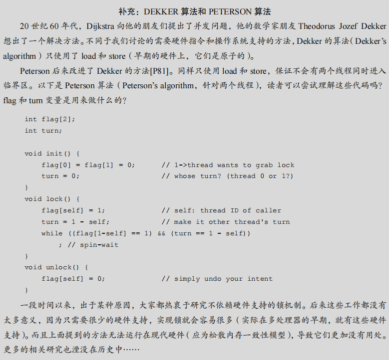
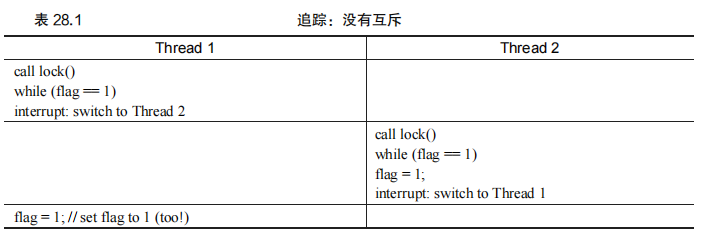
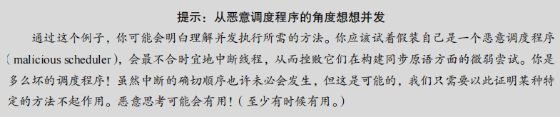
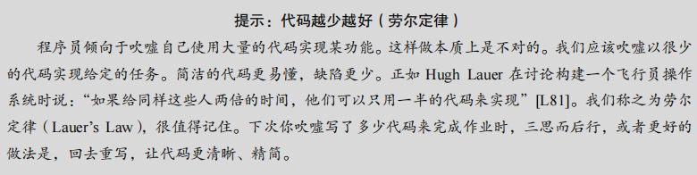

## 第28章 锁

​		通过对并发的介绍，我们看到了并发编程的一个最基本问题：==我们希望原子式执行一系列指令，但由于单处理器上的中断（或者多个线程在多处理器上并发执行），我们做不到。==本章介绍了锁（lock），直接解决这一问题。==程序员在源代码中加锁，放在临界区周围，保证临界区能够像单条原子指令一样执行。==

### 28.1 锁的基本思想

​		==在并发编程中，锁（lock）是一种机制，用于确保只有一个线程能够访问共享资源或进入临界区。临界区是一段访问共享资源的代码，这段代码必须原子性地执行，以防止数据竞争和不确定性问题。==通过加锁，我们可以控制对共享资源的访问，确保数据的一致性和正确性。

​		举个简单的例子，假设有一个共享变量 `balance`，多个线程需要对它进行更新操作：

```C
balance = balance + 1;
```

​		在多线程环境下，如果不加锁，不同线程的 `balance` 更新操作可能会发生冲突，导致错误的结果。为了避免这种情况，我们可以使用锁来保护这段代码，使其成为一个临界区：

```C
lock_t mutex; // 定义一个全局锁变量 'mutex'
...
lock(&mutex); // 获取锁
balance = balance + 1; // 临界区
unlock(&mutex); // 释放锁
```

​		在这个代码段中，我们首先声明了一个锁变量 `mutex`。在进入临界区之前，线程首先调用 `lock(&mutex)` 获取锁。如果锁是可用的，线程将获得锁并进入临界区执行代码。如果锁已被其他线程占用，线程将阻塞，直到锁变为可用。执行完临界区代码后，线程调用 `unlock(&mutex)` 释放锁，使其他线程可以获取锁并进入临界区。

​		通过锁的机制，==我们可以控制线程的执行顺序，避免多个线程同时进入临界区，确保线程之间的互斥访问。==

#### 原文：

​		举个例子，假设临界区像这样，典型的更新共享变量：

```C
balance = balance + 1;
```

​		当然，其他临界区也是可能的，比如为链表增加一个元素，或对共享结构的复杂更新操作。为了使用锁，我们给临界区增加了这样一些代码：

```C
lock_t mutex; // 定义一个全局锁变量 'mutex'
...
lock(&mutex); // 获取锁
balance = balance + 1; // 临界区
unlock(&mutex); // 释放锁
```

​		锁就是一个变量，因此我们需要声明一个某种类型的锁变量（lock variable，如上面的mutex），才能使用。这个锁变量（简称锁）保存了锁在某一时刻的状态。它要么是可用的（available，或 unlocked，或 free），表示没有线程持有锁，要么是被占用的（acquired，或 locked，或 held），表示有一个线程持有锁，正处于临界区。我们也可以保存其他的信息，比如持有锁的线程，或请求获取锁的线程队列，但这些信息会隐藏起来，锁的使用者不会发现。

​		lock()和 unlock()函数的语义很简单。调用 lock()尝试获取锁，如果没有其他线程持有锁（即它是可用的），该线程会获得锁，进入临界区。这个线程有时被称为锁的持有者（owner）。如果另外一个线程对相同的锁变量（本例中的 mutex）调用 lock()，因为锁被另一线程持有，该调用不会返回。这样，当持有锁的线程在临界区时，其他线程就无法进入临界区。

​		锁的持有者一旦调用 unlock()，锁就变成可用了。如果没有其他等待线程（即没有其他线程调用过 lock()并卡在那里），锁的状态就变成可用了。如果有等待线程（卡在 lock()里），其中一个会（最终）注意到（或收到通知）锁状态的变化，获取该锁，进入临界区。

​		锁为程序员提供了最小程度的调度控制。我们把线程视为程序员创建的实体，但是被操作系统调度，具体方式由操作系统选择。锁让程序员获得一些控制权。通过给临界区加锁，可以保证临界区内只有一个线程活跃。锁将原本由操作系统调度的混乱状态变得更为可控。


### 28.2 Pthread 锁

​		在 POSIX 线程库（Pthreads）中，锁被称为互斥量（mutex）。互斥量用于在线程之间实现互斥，防止多个线程同时进入临界区，从而避免数据竞争。下面是一个使用 Pthreads 实现锁机制的示例：

```C
pthread_mutex_t lock = PTHREAD_MUTEX_INITIALIZER;

Pthread_mutex_lock(&lock); // 获取锁
balance = balance + 1; // 临界区
Pthread_mutex_unlock(&lock); // 释放锁
```

​		在这个示例中，我们使用了 `pthread_mutex_t` 类型的 `lock` 变量，并通过 `PTHREAD_MUTEX_INITIALIZER` 进行初始化。在进入临界区之前，线程调用 `Pthread_mutex_lock(&lock)` 获取锁。如果锁可用，线程将获得锁并继续执行临界区代码。如果锁已被占用，线程将阻塞，直到锁变为可用。执行完临界区代码后，线程调用 `Pthread_mutex_unlock(&lock)` 释放锁。

​		POSIX 提供的锁机制允许程序员根据需要使用不同的锁来保护不同的数据结构或变量。这种细粒度的锁策略有助于提高并发性，允许多个线程同时进入不同的临界区，从而提高程序的性能。

### 总结

​		锁是并发编程中确保多个线程安全访问共享资源的重要工具。通过锁，程序员可以控制线程的执行顺序，避免数据竞争和不确定性问题。Pthreads 提供的互斥量机制使得锁的使用更加灵活和高效，适用于多线程环境中的各种并发控制需求。

#### 原文：

​		POSIX 库将锁称为互斥量（mutex），因为它被用来提供线程之间的互斥。即当一个线程在临界区，它能够阻止其他线程进入直到本线程离开临界区。因此，如果你看到下面的POSIX 线程代码，应该理解它和上面的代码段执行相同的任务（我们再次使用了包装函数来检查获取锁和释放锁时的错误）。

```C
pthread_mutex_t lock = PTHREAD_MUTEX_INITIALIZER;

Pthread_mutex_lock(&lock); // 获取锁
balance = balance + 1; // 临界区
Pthread_mutex_unlock(&lock); // 释放锁
```

​		你可能还会注意到，POSIX 的 lock 和 unlock 函数会传入一个变量，因为我们可能用不同的锁来保护不同的变量。==这样可以增加并发：不同于任何临界区都使用同一个大锁（粗粒度的锁策略）==，通常大家会用不同的锁保护不同的数据和结构，从而允许更多的线程进入临界区（细粒度的方案）。


### 28.3 实现一个锁

​		为了实现锁，我们需要考虑以下几个方面：硬件支持、操作系统的支持，以及锁的效率和公平性等因素。


​		在硬件方面，==现代计算机体系结构通常提供了一些基本的同步原语==，例如原子指令（如 `test-and-set`、`compare-and-swap` 等），==这些原语能够在硬件层面上确保某些操作的原子性。通过使用这些原语，我们可以实现简单而有效的锁机制。==

​		操作系统则提供了更高级别的支持，比如线程管理、锁机制的抽象，以及在多处理器环境中处理并发的功能。==操作系统通常提供锁的标准库，程序员可以直接调用这些库函数，而不需要关注底层实现的细节。==

#### 原文：

​		我们已经从程序员的角度，对锁如何工作有了一定的理解。那如何实现一个锁呢？我们需要什么硬件支持？需要什么操作系统的支持？本章下面的内容将解答这些问题。

​		我们需要硬件和操作系统的帮助来实现一个可用的锁。近些年来，各种计算机体系结构的指令集都增加了一些不同的硬件原语，我们不研究这些指令是如何实现的（毕竟，这是计算机体系结构课程的主题），只研究如何使用它们来实现像锁这样的互斥原语。我们也会研究操作系统如何发展完善，支持实现成熟复杂的锁库。


#### 28.4 评价锁

在实现锁之前，我们需要明确锁的评价标准：

1. ==**互斥性**：锁的最基本功能是提供互斥，确保在同一时刻只有一个线程可以进入临界区。有效的锁必须能够防止多个线程同时进入临界区。==
2. ==**公平性**：锁的实现应当是公平的，即当多个线程竞争锁时，每个线程应该有公平的机会获得锁。公平性问题也涉及到避免线程饿死（某个线程始终无法获得锁）。==
3. **性能**：锁的性能主要考虑在不同场景下的开销：
   - **无竞争**：当只有一个线程尝试获取和释放锁时，锁的开销应该尽可能小。
   - **单处理器上的多线程竞争**：在单处理器上，多个线程竞争锁的情况下，锁的开销如何。
   - **多处理器上的多线程竞争**：在多处理器环境下，多个线程在不同处理器上竞争锁的性能表现。

通过分析这些场景，我们可以更好地理解不同锁实现的优缺点。

#### 原文：

​		在实现锁之前，我们应该首先明确目标，因此我们要问，如何评价一种锁实现的效果。为了评价锁是否能工作（并工作得好），我们应该先设立一些标准。第一是锁是否能完成它的基本任务，即提供互斥（mutual exclusion）。最基本的，锁是否有效，能够阻止多个线程进入临界区？

​		第二是公平性（fairness）。当锁可用时，是否每一个竞争线程有公平的机会抢到锁？用另一个方式来看这个问题是检查更极端的情况：是否有竞争锁的线程会饿死（starve），一直无法获得锁？

​		最后是性能（performance），具体来说，是使用锁之后增加的时间开销。有几种场景需要考虑。一种是没有竞争的情况，即只有一个线程抢锁、释放锁的开支如何？另外一种是一个 CPU 上多个线程竞争，性能如何？最后一种是多个 CPU、多个线程竞争时的性能。通过比较不同的场景，我们能够更好地理解不同的锁技术对性能的影响，下面会进行介绍。


### 28.5 控制中断

​		在单处理器系统中，实现锁的早期方法之一是通过关闭中断来实现互斥。这种方法的代码如下：

```C
void lock() { 
    DisableInterrupts(); 
} 
void unlock() { 
    EnableInterrupts(); 
}
```

这个方法的原理是在进入临界区前关闭中断，确保临界区的代码不会被打断，从而保证了代码的原子性。

#### 优点：

- **简单**：关闭中断是一种非常直接的方式，易于理解和实现。

#### 缺点：

- **信任问题**：这种方法要求允许所有调用线程执行特权操作（如关闭中断），这可能导致安全性问题。例如，恶意程序可以通过关闭中断并进入死循环来独占处理器。
- **不支持多处理器**：在多处理器系统中，关闭中断只能影响当前处理器，而不能阻止其他处理器上的线程进入临界区。
- **中断丢失**：关闭中断可能导致系统错过一些重要的中断信号，如硬件设备完成任务的通知，可能导致系统无法正常运行。
- **效率低下**：在现代处理器中，关闭和打开中断的操作相对较慢，影响系统性能。

由于这些缺点，关闭中断的方法通常只在一些特殊情况下使用，例如操作系统内核中需要临时保证原子性的操作。在一般的应用程序中，这种方法并不适合用来实现锁。


#### 补充：DEKKER 算法和 PETERSON 算法

​		**20 世纪 60 年代，Dijkstra 向他的朋友们提出了并发问题，他的数学家朋友 Theodorus Jozef Dekker想出了一个解决方法。不同于我们讨论的需要硬件指令和操作系统支持的方法，Dekker 的算法（Dekker’s algorithm）只使用了 load 和 store（早期的硬件上，它们是原子的）。Peterson 后来改进了 Dekker 的方法[P81]。同样只使用 load 和 store，保证不会有两个线程同时进入临界区。以下是 Peterson 算法（Peterson’s algorithm，针对两个线程），读者可以尝试理解这些代码吗？flag 和 turn 变量是用来做什么的？**

以下是格式化后的代码，以及详细的解释注释。这段代码实现了一个简单的互斥锁机制，使用了 Dekker’s algorithm 的基本思想，用于两个线程之间的互斥操作。

```C
#include <stdio.h>
#include <pthread.h>

// 全局变量，用于线程间的同步
int flag[2]; // flag[i] = 1 表示线程 i 想要获取锁
int turn;    // 用于决定轮到哪个线程进入临界区

// 初始化函数，设置初始状态
void init() {
    flag[0] = flag[1] = 0; // 初始化 flag 数组，表示两个线程都不想获取锁
    turn = 0;              // 初始化 turn，表示线程 0 先有机会获取锁
}

// 锁函数，用于实现互斥
void lock(int self) {
    flag[self] = 1;          // 表示当前线程想要获取锁
    turn = 1 - self;         // 将机会让给另一个线程
    // 当另一个线程想要获取锁，并且当前不是自己的轮次时，进行忙等待
    while (flag[1 - self] == 1 && turn == 1 - self)
        ; // 自旋等待，直到条件不满足
}

// 解锁函数，释放锁
void unlock(int self) {
    flag[self] = 0; // 当前线程释放锁
}

// 示例线程函数
void *thread_function(void *arg) {
    int self = *(int *)arg; // 线程 ID，0 或 1
    lock(self);             // 尝试获取锁
    printf("Thread %d in critical section\n", self);
    unlock(self);           // 退出临界区，释放锁
    return NULL;
}

int main() {
    pthread_t t0, t1;       // 定义两个线程
    int id0 = 0, id1 = 1;   // 线程 ID

    init();                 // 初始化锁状态

    // 创建两个线程，分别执行 thread_function
    pthread_create(&t0, NULL, thread_function, &id0);
    pthread_create(&t1, NULL, thread_function, &id1);

    // 等待两个线程执行完毕
    pthread_join(t0, NULL);
    pthread_join(t1, NULL);

    return 0;               // 程序正常结束
}
```

#### **解释说明：**

1. **头文件：**
   - `#include <stdio.h>`: 用于标准输入输出函数（如 `printf`）。
   - `#include <pthread.h>`: 提供 POSIX 线程的相关函数和数据类型。
2. **全局变量：**
   - `flag[2]`：用于记录每个线程是否想要进入临界区。`flag[0]` 表示线程 0，`flag[1]` 表示线程 1。
   - `turn`：用于决定哪个线程可以进入临界区。`turn = 0` 表示轮到线程 0，`turn = 1` 表示轮到线程 1。
3. **初始化函数 `init`：**
   - 初始化 `flag[0]` 和 `flag[1]` 为 0，表示两个线程都不想进入临界区。
   - 初始化 `turn` 为 0，表示默认线程 0 先尝试进入临界区。
4. **锁函数 `lock`：**
   - 设置 `flag[self] = 1` 表示当前线程想要进入临界区。
   - 设置 `turn = 1 - self`，将优先权给另一个线程。
   - 使用 `while` 循环忙等待，当另一个线程想要进入临界区且当前不是自己的轮次时，等待。
5. **解锁函数 `unlock`：**
   - 设置 `flag[self] = 0`，表示当前线程退出临界区。
6. **示例线程函数 `thread_function`：**
   - 接收线程 ID，并尝试进入临界区，打印消息后退出临界区。
7. **主函数 `main`：**
   - 初始化锁状态，创建两个线程，并等待它们完成。
   - 每个线程都会尝试进入临界区，打印其 ID 并退出。

#### **注意事项：**

- **忙等待的缺点：** 这种锁机制使用了忙等待（spin-wait），这可能导致 CPU 资源的浪费。
- ==**仅适用于两个线程：** 该实现仅支持两个线程之间的互斥。如果需要扩展到多个线程，需要使用更复杂的算法或锁机制。==
- **确保正确调用 `unlock`：** 忘记调用 `unlock` 会导致死锁，因为其他线程永远无法进入临界区。

​		**一段时间以来，出于某种原因，大家都热衷于研究不依赖硬件支持的锁机制。后来这些工作都没有太多意义，因为只需要很少的硬件支持，实现锁就会容易很多（实际在多处理器的早期，就有这些硬件支持）。而且上面提到的方法无法运行在现代硬件（应为松散内存一致性模型），导致它们更加没有用处。更多的相关研究也湮没在历史中……**


#### 原文：

​		最早提供的互斥解决方案之一，就是在临界区关闭中断。这个解决方案是为单处理器系统开发的。代码如下：

```C
void lock() { 
    DisableInterrupts(); 
} 
void unlock() { 
    EnableInterrupts(); 
}
```

​		假设我们运行在这样一个单处理器系统上。通过在进入临界区之前关闭中断（使用特殊的硬件指令），可以保证临界区的代码不会被中断，从而原子地执行。结束之后，我们重新打开中断（同样通过硬件指令），程序正常运行。

​		这个方法的主要优点就是简单。显然不需要费力思考就能弄清楚它为什么能工作。没有中断，线程可以确信它的代码会继续执行下去，不会被其他线程干扰。

​		遗憾的是，缺点很多。首先，这种方法要求我们允许所有调用线程执行特权操作（打开关闭中断），即信任这种机制不会被滥用。众所周知，如果我们必须信任任意一个程序，可能就有麻烦了。这里，麻烦表现为多种形式：第一，一个贪婪的程序可能在它开始时就调用 lock()，从而独占处理器。更糟的情况是，恶意程序调用 lock()后，一直死循环。后一种情况，系统无法重新获得控制，只能重启系统。关闭中断对应用要求太多，不太适合作为通用的同步解决方案。

​		第二，这种方案不支持多处理器。如果多个线程运行在不同的 CPU 上，每个线程都试图进入同一个临界区，关闭中断也没有作用。线程可以运行在其他处理器上，因此能够进入临界区。多处理器已经很普遍了，我们的通用解决方案需要更好一些。

​		第三，关闭中断导致中断丢失，可能会导致严重的系统问题。假如磁盘设备完成了读取请求，但 CPU 错失了这一事实，那么，操作系统如何知道去唤醒等待读取的进程？

​		最后一个不太重要的原因就是效率低。与正常指令执行相比，现代 CPU 对于关闭和打开中断的代码执行得较慢。

​		基于以上原因，只在很有限的情况下用关闭中断来实现互斥原语。例如，在某些情况下操作系统本身会采用屏蔽中断的方式，保证访问自己数据结构的原子性，或至少避免某些复杂的中断处理情况。这种用法是可行的，因为在操作系统内部不存在信任问题，它总是信任自己可以执行特权操作。



### 28.6 测试并设置指令（原子交换）

​		==由于在多处理器环境中关闭中断的方法不能工作，系统设计者为硬件引入了对锁的支持。==最早的多处理器系统，如20世纪60年代早期的Burroughs B5000，就已经包含了这种支持。如今，所有系统（甚至单处理器系统）都具备了这样的功能。

​		==最简单的硬件支持形式是**测试并设置指令**（test-and-set instruction），也被称为**原子交换**（atomic exchange）。==为了理解 `test-and-set` 指令如何工作，我们先实现一个不依赖它的锁，该锁使用一个简单的变量来标记锁是否被持有。

​		在初次尝试中，我们可以使用一个变量来表示锁是否被线程占用。下图 28.1 显示了这一方法的代码实现。

```C
typedef struct lock_t { 
    int flag; 
} lock_t; 

void init(lock_t *mutex) { 
    // 0 -> lock is available, 1 -> held 
    mutex->flag = 0; 
} 

void lock(lock_t *mutex) { 
    while (mutex->flag == 1) // TEST the flag 
        ; // spin-wait (do nothing) 
    mutex->flag = 1; // now SET it! 
} 

void unlock(lock_t *mutex) { 
    mutex->flag = 0; 
}
```

*图 28.1 第一次尝试：简单标志*

​		==在这个实现中，当第一个线程进入临界区并调用 `lock()` 时，它会检查标志是否为1（如果标志不是1），然后将标志设置为1，表示该线程持有锁。当该线程离开临界区时，会调用 `unlock()`，清除标志，表示锁未被持有。==

​		然而，这个实现有两个显著的问题：**正确性**和**性能**。

#### 正确性问题

考虑表 28.1 中的执行场景，假设 `flag = 0`： *表 28.1 追踪：没有互斥*

| 线程1               | 线程2                      |
| ------------------- | -------------------------- |
| 调用 `lock()`       |                            |
| `while (flag == 1)` |                            |
| 中断：切换到线程2   | 调用 `lock()`              |
|                     | `while (flag == 1)`        |
|                     | `flag = 1;`                |
| 中断：切换回线程1   | `flag = 1; // 再次设置为1` |

​		在这个场景中，由于适时的中断，两个线程都将标志设置为1，从而都进入了临界区。这种行为显然没有满足最基本的互斥要求。

#### 性能问题

​		==性能问题主要出现在**自旋等待**（spin-waiting）时，即当一个线程在等待另一个线程释放锁时，采用了自旋的方式。==这种方式会浪费CPU时间，尤其是在单处理器上，等待的线程甚至无法运行目标线程，因为它被上下文切换阻止了。我们需要一个更成熟的解决方案来避免这种浪费。


#### 原文：

​		因为关闭中断的方法无法工作在多处理器上，所以系统设计者开始让硬件支持锁。最早的多处理器系统，像 20 世纪 60 年代早期的 Burroughs B5000[M82]，已经有这些支持。今天所有的系统都支持，甚至包括单 CPU 的系统。

​		最简单的硬件支持是测试并设置指令（test-and-set instruction），也叫作原子交换（atomic exchange）。为了理解 test-and-set 如何工作，我们首先实现一个不依赖它的锁，用一个变量标记锁是否被持有。

​		在第一次尝试中（见图 28.1），想法很简单：用一个变量来标志锁是否被某些线程占用。第一个线程进入临界区，调用 lock()，检查标志是否为 1（这里不是 1），然后设置标志为 1，表明线程持有该锁。结束临界区时，线程调用 unlock()，清除标志，表示锁未被持有。

```C
1 typedef struct lock_t { int flag; } lock_t; 
2 
3 void init(lock_t *mutex) { 
4 // 0 -> lock is available, 1 -> held 
5 mutex->flag = 0; 
6 } 
7 
8 void lock(lock_t *mutex) { 
9 while (mutex->flag == 1) // TEST the flag 
10 ; // spin-wait (do nothing) 
11 mutex->flag = 1; // now SET it! 
12 } 
13 
14 void unlock(lock_t *mutex) { 
15 mutex->flag = 0; 
16 }
```

​		当第一个线程正处于临界区时，如果另一个线程调用 lock()，它会在 while 循环中自旋等待（spin-wait)，直到第一个线程调用 unlock()清空标志。然后等待的线程会退出 while 循环，设置标志，执行临界区代码。

​		遗憾的是，这段代码有两个问题：正确性和性能。这个正确性问题在并发编程中很常见。假设代码按照表 28.1 执行，开始时 flag=0。



​		从这种交替执行可以看出，通过适时的（不合时宜的？）中断，我们很容易构造出两个线程都将标志设置为 1，都能进入临界区的场景。这种行为就是专家所说的“不好”，我们显然没有满足最基本的要求：互斥。

​		性能问题（稍后会有更多讨论）主要是线程在等待已经被持有的锁时，采用了自旋等待（spin-waiting）的技术，就是不停地检查标志的值。自旋等待在等待其他线程释放锁的时候会浪费时间。尤其是在单处理器上，一个等待线程等待的目标线程甚至无法运行（至少在上下文切换之前）！我们要开发出更成熟的解决方案，也应该考虑避免这种浪费。


### 28.7 实现可用的自旋锁

​		尽管前面的实现思路很好，但没有硬件支持就无法实现。幸运的是，现代系统提供了这种硬件支持，可以基于这个概念创建简单的锁。这个更强大的指令被称为**测试并设置指令**（test-and-set instruction），也叫作**原子交换**（atomic exchange）。在不同平台上，这个指令有不同的名字：在 SPARC 上叫 `ldstub`（load/store unsigned byte），在 x86 上叫 `xchg`（atomic exchange）。它们基本上实现了相同的功能。

​		我们用如下的C代码片段定义了测试并设置指令的功能：

```C
int TestAndSet(int *old_ptr, int new) { 
    int old = *old_ptr; // fetch old value at old_ptr 
    *old_ptr = new; // store 'new' into old_ptr 
    return old; // return the old value 
}
```

​		这个函数返回 `old_ptr` 指向的旧值，同时更新为 `new` 值。==关键在于这些操作是原子地执行的。(不像b=b+1)==基于此，我们可以实现一个简单的自旋锁，如图 28.2 所示。

```C
typedef struct lock_t { 
    int flag; 
} lock_t; 

void init(lock_t *lock) { 
    // 0 indicates that lock is available, 1 that it is held 
    lock->flag = 0; 
} 

void lock(lock_t *lock) { 
    while (TestAndSet(&lock->flag, 1) == 1) 
        ; // spin-wait (do nothing) 
} 

void unlock(lock_t *lock) { 
    lock->flag = 0; 
}
```

*图 28.2 利用测试并设置指令的简单自旋锁*

这个锁的工作原理如下：

1. 如果一个线程调用 `lock()` 并且锁是空闲的（`flag = 0`），那么 `TestAndSet()` 会返回 0，线程将获取锁，并将 `flag` 设置为1，表示锁已被持有。
2. 如果另一个线程也尝试获取同一个锁（`flag = 1`），它会在 `TestAndSet()` 中自旋，直到 `flag` 被解锁（即被设置为0）。一旦锁被释放，`TestAndSet()` 会返回0，并将 `flag` 设置为1，从而获取锁。

​		这种自旋锁利用了硬件的支持，实现了有效的互斥。然而，在单处理器系统中，它可能会引发效率问题。多个线程在竞争锁时，可能导致高的CPU使用率，但无法做有意义的工作。为了解决这个问题，需要采用更复杂的锁机制，例如自旋锁与阻塞锁的结合，或其他高级锁设计。


#### 原文：

​		==尽管上面例子的想法很好，但没有硬件的支持是无法实现的。幸运的是，一些系统提供了这一指令，支持基于这种概念创建简单的锁。==这个更强大的指令有不同的名字：在 SPARC上，这个指令叫 ldstub（load/store unsigned byte，加载/保存无符号字节）；在 x86 上，是 xchg（atomic exchange，原子交换）指令。但它们基本上在不同的平台上做同样的事，通常称为测试并设置指令（test-and-set）。==我们用如下的 C 代码片段来定义测试并设置指令做了什么：==

```C
int TestAndSet(int *old_ptr, int new) { 
    int old = *old_ptr; // fetch old value at old_ptr 
    *old_ptr = new; // store 'new' into old_ptr 
    return old; // return the old value 
}
```

​		测试并设置指令做了下述事情。它返回 old_ptr 指向的旧值，同时更新为 new 的新值。当然，关键是这些代码是原子地（atomically）执行。因为既可以测试旧值，又可以设置新值，所以我们把这条指令叫作“测试并设置”。这一条指令完全可以实现一个简单的自旋锁（spin lock），如图 28.2 所示。或者你可以先尝试自己实现，这样更好！

​		我们来确保理解为什么这个锁能工作。首先假设一个线程在运行，调用 lock()，没有其他线程持有锁，所以 flag 是 0。当调用 TestAndSet(flag, 1)方法，返回 0，线程会跳出 while循环，获取锁。同时也会原子的设置 flag 为 1，标志锁已经被持有。当线程离开临界区，调用 unlock()将 flag 清理为 0。


以下是格式化后的代码，以及详细的解释注释。这个代码实现了一个简单的自旋锁，使用了 `TestAndSet` 指令，该指令可以原子地测试和设置一个值，从而实现互斥锁的功能。

```C
#include <stdio.h>

// 定义一个自旋锁结构体 lock_t，包含一个标志 flag
typedef struct lock_t { 
    int flag;  // 标志变量，0 表示锁是空闲的，1 表示锁是被占用的
} lock_t; 

// 初始化函数，设置锁的初始状态
void init(lock_t *lock) { 
    // 0 表示锁是空闲的
    lock->flag = 0; 
}

// 自旋锁的获取函数
void lock(lock_t *lock) { 
    // 使用 TestAndSet 原子操作来获取锁
    // 如果 flag 已经是 1，则表示锁已被占用，需要继续自旋等待
    // 如果 flag 是 0，则设置为 1 并成功获取锁
    while (TestAndSet(&lock->flag, 1) == 1) 
        ; // 自旋等待，直到锁被释放
}

// 自旋锁的释放函数
void unlock(lock_t *lock) { 
    // 释放锁，将 flag 设置为 0
    lock->flag = 0; 
}

// 模拟的 TestAndSet 函数，用于原子地测试和设置一个值
// 返回旧的值，并将 *ptr 设置为 new 值
int TestAndSet(int *ptr, int new) {
    int old = *ptr;   // 保存旧值
    *ptr = new;       // 设置新值
    return old;       // 返回旧值
}

int main() {
    lock_t mylock;    // 定义一个锁
    init(&mylock);    // 初始化锁

    // 模拟获取锁
    lock(&mylock);
    printf("Lock acquired.\n");

    // 模拟释放锁
    unlock(&mylock);
    printf("Lock released.\n");

    return 0;
}
```

#### **解释说明：**

1. **结构体定义：**
   - `typedef struct lock_t`：定义了一个简单的锁结构体 `lock_t`，包含一个整数标志 `flag`。
   - `flag` 的值为 `0` 表示锁是可用的（空闲），值为 `1` 表示锁已被占用。
2. **初始化函数 `init`：**
   - 初始化锁的状态，将 `flag` 设置为 `0`，表示锁是空闲的。
3. **锁获取函数 `lock`：**
   - 使用 `TestAndSet` 函数原子地检查和设置 `flag`。
   - 如果 `flag` 是 `1`（锁已被占用），则函数返回 `1`，进入自旋等待状态。
   - 如果 `flag` 是 `0`（锁是空闲的），`TestAndSet` 将 `flag` 设置为 `1`，函数返回 `0`，表示成功获取锁。
4. **锁释放函数 `unlock`：**
   - 将 `flag` 设置为 `0`，释放锁，使锁重新变为空闲状态。
5. **模拟的 `TestAndSet` 函数：**
   - 接受一个指向整数的指针 `ptr` 和一个新的值 `new`。
   - 函数原子地将 `*ptr` 设置为 `new`，并返回 `*ptr` 原来的值。
   - ==`TestAndSet` 的实现模拟了硬件级别的原子操作，这在多线程环境中非常关键。==
6. **主函数 `main`：**
   - 创建并初始化一个锁。
   - 通过调用 `lock` 获取锁，并在获取成功后打印“Lock acquired”。
   - 调用 `unlock` 释放锁，并在释放后打印“Lock released”。

#### **注意事项：**

- **自旋锁的特性：** 自旋锁在高竞争环境下可能会导致 CPU 资源浪费，因为在等待锁的过程中，线程会不断占用 CPU 进行空转（自旋）。
- **原子性：** `TestAndSet` 必须是原子操作，以保证在多线程环境下的正确性，防止竞态条件。
- **只适用于单核或共享内存的多核系统：** `TestAndSet` 是一种低级同步原语，适合在操作系统内核或硬件支持的环境中使用，用户空间的应用程序应尽量使用高级同步机制（如互斥量）。


​		第二种场景是，当某一个线程已经持有锁（即 flag 为 1）。本线程调用 lock()，然后调用TestAndSet(flag, 1)，这一次返回 1。只要另一个线程一直持有锁，TestAndSet()会重复返回 1，本线程会一直自旋。当 flag 终于被改为 0，本线程会调用 TestAndSet()，返回 0 并且原子地设置为 1，从而获得锁，进入临界区。

​		将测试（test 旧的锁值）和设置（set 新的值）合并为一个原子操作之后，我们保证了只有一个线程能获取锁。这就实现了一个有效的互斥原语！你现在可能也理解了为什么这种锁被称为自旋锁（spin lock）。这是最简单的一种锁，一直自旋，利用 CPU 周期，直到锁可用。在单处理器上，需要抢占式的调度器（preemptive scheduler，即不断通过时钟中断一个线程，运行其他线程）。否则，自旋锁在单 CPU 上无法使用，因为一个自旋的线程永远不会放弃 CPU。



#### 补充：**原子操作的定义**，哪种是原子操作，哪种不是

**原子操作**（Atomic Operation）是指在多线程或多进程环境中，不可分割的操作，即这个操作要么完全执行，要么完全不执行，期间不会被任何其他线程或进程打断。原子操作在操作系统和并发编程中非常重要，因为它们可以防止竞态条件，确保共享资源的正确性。

#### **原子操作的示例**

- **原子操作：**

  - **读取或写入一个内存中的整数（在大多数系统中）：**

    - 例如，读取或写入一个 `int` 类型变量（32位系统上的 4 字节）通常是原子的。
    - 示例：`x = 5;` 或 `int y = x;`，假设 `x` 是一个简单的整型变量且对齐到机器字大小。

  - **Test-and-Set (测试并设置)：**

    - 它是一种常见的原子操作，用于锁实现。

    - 这个操作读取一个值，并在读取的同时将它设置为一个新值，这两个动作是不可分割的。

    - 示例：

      ```C
      int TestAndSet(int *ptr, int new) {
          int old = *ptr;   // 保存旧值
          *ptr = new;       // 设置新值
          return old;       // 返回旧值
      }
      ```

    - 如果多个线程同时执行 `TestAndSet`，只有一个线程能够成功设置值，其他线程会获取旧值。

  - **Compare-and-Swap (比较并交换)：**

    - 这是一种高级的原子操作，用于检查变量是否具有预期值，如果是则更新，否则不做修改。

    - 示例：

      ```C
      int CompareAndSwap(int *ptr, int expected, int new) {
          int old = *ptr;
          if (old == expected)
              *ptr = new;
          return old;
      }
      ```

    - 此操作在处理器指令集（如 x86 的 `CMPXCHG` 指令）中广泛支持。

- **非原子操作：**

  - **读取和修改（如递增或递减）一个变量：**

    - 例如，`x = x + 1;` 或 `x++`，这些操作实际上包括读取变量的值、修改值并将新值写回内存，这些子操作可能被其他线程打断。

    - 示例：

      ```C
      x++;  // 等价于 x = x + 1; 非原子操作
      ```

    - 在多线程环境中，若两个线程同时执行 `x++`，可能导致其中一次修改丢失（竞态条件）。

  - **组合操作：**

    - 比如 `y = x + 5;` 涉及读取 `x` 的值、加上 5 并将结果赋给 `y`，这不是一个原子操作。

  - **操作非对齐的数据：**

    - 在一些系统中，读取或写入非对齐的数据（如读取未对齐的 64 位数据）可能需要多个内存访问，不是原子的。

#### **总结**

- 原子操作保证：
  - 操作不可分割，不会被打断。
  - 确保并发环境下的正确性和一致性。
- 非原子操作：
  - ==通常是多个子操作组成，在并发环境下可能被其他操作打断。==
  - 需要使用锁、信号量等同步机制确保其正确性。

原子操作是并发编程中的基础构建块，用于实现高效且安全的同步机制。对于涉及共享资源的操作，确保原子性是避免竞态条件的关键。


### 28.8 评价自旋锁

​		现在我们可以使用之前设定的标准来评价自旋锁的表现。首先是**正确性**：自旋锁是否能够保证互斥？答案是肯定的。自旋锁一次只允许一个线程进入临界区，因此它是一个正确的锁。

​		接下来是**公平性**：自旋锁对等待线程的公平性如何？能否保证一个等待线程最终会进入临界区？答案是不确定的。自旋锁不提供任何公平性保证。在某些情况下，等待线程可能会因为竞争而永远自旋，导致**饿死**的情况。

​		最后一个标准是**性能**。使用自旋锁的成本是多少？要全面分析性能，我们需要考虑几种不同的情况。

​		==首先，在单处理器环境下，自旋锁的性能表现不佳。==如果一个线程持有锁并进入临界区，而此时调度器中断了该线程，其他线程将不得不自旋等待。由于这些线程无法在当前线程释放锁之前获得处理器时间，这种等待实际上浪费了CPU周期。

​		然而，==在多处理器环境下，自旋锁的表现要好得多，特别是当线程数与CPU数量大致相等时。如果线程A在CPU1上运行，线程B在CPU2上自旋等待锁，线程B的自旋不会浪费CPU时间，因为临界区的代码通常很短，锁很快就会释放，线程B将能够立即获得锁并继续执行。==

### 28.9 比较并交换

#### 原文：

​		在某些系统中，除了测试并设置指令，还提供了**比较并交换**指令。SPARC系统中称为 `compare-and-swap`，x86系统中称为 `compare-and-exchange`。图28.3展示了这条指令的C语言伪代码。

```C
int CompareAndSwap(int *ptr, int expected, int new) { 
    int actual = *ptr; 
    if (actual == expected) 
        *ptr = new; 
    return actual; 
}
```

*图 28.3 比较并交换*

**比较并交换**指令的基本思路是：检查指针`ptr`指向的值是否与`expected`相等。如果相等，则将`ptr`的值更新为`new`，否则什么也不做。无论是否成功，函数都会返回指针`ptr`当前的实际值，以便调用者知道操作是否成功。

有了**比较并交换**指令，我们可以像使用**测试并设置**一样实现一个自旋锁。以下是 `lock()` 函数的实现代码：

```C
void lock(lock_t *lock) { 
    while (CompareAndSwap(&lock->flag, 0, 1) == 1) 
        ; // spin 
}
```

其余的代码与使用**测试并设置**指令实现的自旋锁完全相同。这段代码的工作方式与之前的锁类似：它检查`flag`是否为0，如果是，则将其原子性地更新为1，从而获取锁。若锁已经被持有，其他竞争的线程将会自旋等待。


如果你想看看如何创建建 C 可调用的 x86 版本的比较并交换，下面的代码段可能有用（来自[S05])：

以下是格式化后的代码，以及详细的解释注释。这个代码实现了 `CompareAndSwap` 函数，使用内联汇编来执行原子操作 `cmpxchgl`，用于比较并交换内存中的值。

```C
#include <stdio.h>

// CompareAndSwap 函数，用于原子地比较并交换值
// 如果 *ptr 的值等于 old，则将 *ptr 设置为 new，并返回 1（成功）
// 如果 *ptr 的值不等于 old，则不做任何修改，并返回 0（失败）
char CompareAndSwap(int *ptr, int old, int new) {
    unsigned char ret;  // 用于存储 cmpxchgl 指令的结果（0 或 1）

    // 使用内联汇编实现原子操作
    // __asm__ __volatile__ 用于防止编译器优化，确保指令不被重排序
    __asm__ __volatile__ (
        "lock\n"           // lock 前缀，用于多处理器环境下的总线锁定
        "cmpxchgl %2,%1\n" // cmpxchgl 指令，将 EAX 寄存器的值与内存中的值比较
                           // 如果相等，则将新值 %2（new）写入内存位置 %1（*ptr）
                           // 如果不相等，则将内存位置 %1（*ptr）的值写入 EAX
        "sete %0\n"        // sete 指令，根据 cmpxchgl 的结果设置 ret 的值
                           // 如果比较相等，则 ret = 1；否则 ret = 0
        : "=q" (ret), "=m" (*ptr)   // 输出部分：ret 和 *ptr 的值
        : "r" (new), "m" (*ptr), "a" (old) // 输入部分：new, *ptr, old (EAX)
        : "memory"         // 通知编译器内存可能会被修改
    );

    return ret;  // 返回结果（0 或 1）
}

int main() {
    int value = 10; // 初始化值为 10
    int old = 10;   // 希望比较的旧值
    int new = 20;   // 希望更新的新值

    // 调用 CompareAndSwap，尝试将 value 从 10 改为 20
    char result = CompareAndSwap(&value, old, new);

    // 打印结果
    printf("CompareAndSwap result: %d, new value: %d\n", result, value);

    return 0;
}
```

#### **解释说明：**

1. **函数 `CompareAndSwap`：**
   - 该函数用于实现原子比较并交换操作，接受三个参数：
     - `ptr`：指向需要操作的整数变量。
     - `old`：预期的旧值。
     - `new`：希望设置的新值。
   - 如果 `*ptr` 的值与 `old` 相等，则将 `*ptr` 更新为 `new`，并返回 1。
   - 如果 `*ptr` 的值与 `old` 不相等，则不进行更新，并返回 0。
2. **内联汇编：**
   - 使用 `__asm__ __volatile__` 保证内联汇编的指令不会被编译器优化或重排。
   - **`lock` 前缀：** 在多核环境中，确保操作是原子的，并防止其他处理器在指令执行时访问相同的内存位置。
   - **`cmpxchgl %2,%1`：** 比较 `EAX` 寄存器（`old` 的值）和内存位置 `*ptr`，如果相等，则将 `new` 写入 `*ptr`，否则将 `*ptr` 的值写入 `EAX`。
   - **`sete %0`：** 根据比较结果设置 `ret`，如果比较成功（相等），则设置 `ret` 为 1，否则为 0。
3. **输入和输出操作数：**
   - `: "=q" (ret), "=m" (*ptr)`：输出操作数，`ret` 存储返回值，`*ptr` 表示内存位置可能被修改。
   - `: "r" (new), "m" (*ptr), "a" (old)`：输入操作数，`new` 为新值，`*ptr` 为要比较的地址，`old` 通过 `EAX` 寄存器传递。
   - `: "memory"`：告知编译器该操作影响内存，以确保内存访问的顺序性。
4. **主函数 `main`：**
   - 测试 `CompareAndSwap` 函数，用于演示比较并交换操作。
   - 打印结果，显示操作是否成功以及 `value` 的最终值。

#### **注意事项：**

- **内联汇编的使用：** 需要了解目标平台的汇编指令集，确保指令的正确性和有效性。
- **原子性和同步：** `CompareAndSwap` 是并发编程中常用的原子操作之一，适用于无锁编程和实现简单的自旋锁或其他同步机制。

最后，你可能会发现，比较并交换指令比测试并设置更强大。当我们在将来简单探讨无等待同步（wait-free synchronization）[H91]时，会用到这条指令的强大之处。然而，如果只用它实现一个简单的自旋锁，它的行为等价于上面分析的自旋锁。


### 28.10 链接的加载和条件式存储指令

​		一些平台提供了用于实现临界区的特定指令组合。例如，MIPS架构中的**链接的加载**（load-linked）和**条件式存储**（store-conditional）指令可用于实现锁等并发结构。图28.4展示了这些指令的C语言伪代码。

```C
int LoadLinked(int *ptr) { 
    return *ptr; 
}

int StoreConditional(int *ptr, int value) { 
    if (no one has updated *ptr since the LoadLinked to this address) { 
        *ptr = value; 
        return 1; // success! 
    } else { 
        return 0; // failed to update 
    } 
}
```

*图 28.4 链接的加载和条件式存储*

​		**链接的加载**指令与普通的加载指令类似，都是从内存中取出一个值并存入寄存器中。关键的区别在于**条件式存储**指令：只有在自从执行链接的加载指令后，指针`ptr`指向的内存没有被其他线程修改时，条件存储才会成功，并将`ptr`的值更新为`value`。成功时，`StoreConditional` 返回 1；失败时，返回 0，并且不会更新值。

以下是使用**链接的加载**和**条件式存储**实现一个锁的代码：

```C
void lock(lock_t *lock) { 
    while (1) { 
        while (LoadLinked(&lock->flag) == 1) 
            ; // spin until it's zero 
        if (StoreConditional(&lock->flag, 1) == 1) 
            return; // if set-it-to-1 was a success: all done 
        // otherwise: try it all over again 
    } 
}

void unlock(lock_t *lock) { 
    lock->flag = 0; 
}
```

*图 28.5 使用 LL/SC 实现锁*

​		在这里，`lock()` 函数的工作方式如下：线程首先自旋等待，直到`flag`被设置为0（表示锁没有被持有）。然后，线程尝试通过条件式存储获取锁。如果成功，线程将`flag`设置为1，并进入临界区。否则，线程将继续自旋并重试。

这种方法在现代系统中非常有效，尤其是在支持松散内存一致性模型的多处理器系统中。

总结：通过这一章节的讨论，我们了解了多种锁的实现方法，包括**测试并设置**和**比较并交换**，以及如何使用**链接的加载**和**条件式存储**指令来构建有效的锁。这些锁机制为并发编程提供了关键的基础。


#### 原文：

​		一些平台提供了实现临界区的一对指令。==例如 MIPS 架构[H93]中，链接的加载（load-linked）和条件式存储（store-conditional）可以用来配合使用，实现其他并发结构==。图 28.4 是这些指令的 C 语言伪代码。Alpha、PowerPC 和 ARM 都提供类似的指令[W09]。

​		以下是格式化后的代码以及详细的解释注释。这段代码实现了链式加载（Load-Linked）和条件式存储（Store-Conditional）的操作，用于模拟无锁编程中的原子性操作机制。

```C
#include <stdio.h>

// LoadLinked 函数，用于从指定地址加载值
// 模拟链式加载操作，从内存中读取并返回指定地址的值
int LoadLinked(int *ptr) {
    return *ptr;  // 简单返回指针指向的值
}

// StoreConditional 函数，用于条件式存储
// 如果自上次 LoadLinked 以来该地址的值未被修改，则将新值存储到该地址
int StoreConditional(int *ptr, int value) {
    // 模拟条件：检查自上次 LoadLinked 以来，*ptr 是否未被其他操作更新
    if (/* 条件：没有其他操作更新 *ptr 的值 */) {
        *ptr = value;  // 将新值写入 *ptr
        return 1;      // 返回 1，表示成功
    } else {
        return 0;      // 返回 0，表示失败，未能更新 *ptr
    }
}

int main() {
    int value = 10;  // 初始化变量 value 为 10
    int newValue = 20; // 想要更新的值

    // 执行链式加载，获取当前值
    int loadedValue = LoadLinked(&value);
    printf("Loaded value: %d\n", loadedValue);

    // 尝试条件式存储新值
    int result = StoreConditional(&value, newValue);
    if (result) {
        printf("StoreConditional succeeded, new value: %d\n", value);
    } else {
        printf("StoreConditional failed, value remains: %d\n", value);
    }

    return 0;
}
```

#### **解释说明：**

1. **函数 `LoadLinked`：**
   - **作用：** 从指定的内存地址 `ptr` 加载当前值。
   - **模拟链式加载：** 简单地返回 `*ptr` 指向的值。在实际的硬件实现中，链式加载会监视此地址的内容，以检查是否发生更改。
2. **函数 `StoreConditional`：**
   - **作用：** 尝试将新值 `value` 存储到指定的内存地址 `ptr`。
   - 条件式存储：
     - 如果自上次 `LoadLinked` 调用以来，`ptr` 指向的值没有被其他进程或线程修改，则存储新值并返回 `1`（表示成功）。
     - 如果值已经被修改，则不存储新值，返回 `0`（表示失败）。
   - **关键点：** 在实际硬件中，这个操作依赖于处理器的原子性支持，保证在存储时没有其他干扰。
3. **主函数 `main`：**
   - 测试 `LoadLinked` 和 `StoreConditional` 函数的功能。
   - 步骤：
     - 初始化一个变量 `value`，并加载其值。
     - 尝试通过 `StoreConditional` 函数更新 `value`，并根据返回结果判断更新是否成功。
     - 打印操作结果，显示新的值或更新失败时的原值。

#### **实际应用：**

- ==**无锁编程：** `LoadLinked` 和 `StoreConditional` 是无锁编程中实现原子操作的基础，用于构建高效的同步机制，例如自旋锁、无锁队列等。==
- ==**硬件支持：** 大多数现代处理器（如 MIPS、ARM、PowerPC）提供对 `Load-Linked` 和 `Store-Conditional` 的支持，以实现复杂的原子操作。==

#### **注意事项：**

- **实际实现：** 在实际硬件中，链式加载和条件式存储由专用指令支持，确保操作的原子性。
- **竞态条件：** 这些机制的设计初衷是避免竞态条件，但需要程序员确保操作的正确使用，防止逻辑上的错误。

​	

​	==链接的加载指令和典型加载指令类似，都是从内存中取出值存入一个寄存器。==关键区别来自条件式存储（store-conditional）指令，==只有上一次加载的地址在期间都没有更新时，才会成功，==（同时更新刚才链接的加载的地址的值）。成功时，条件存储返回 1，并将 ptr 指的值更新为 value。失败时，返回 0，并且不会更新值。

​		==你可以挑战一下自己，使用链接的加载和条件式存储来实现一个锁。==完成之后，看看下面代码提供的简单解决方案。试一下！解决方案如图 28.5 所示。

​		lock()代码是唯一有趣的代码。首先，一个线程自旋等待标志被设置为 0（因此表明锁没有被保持）。一旦如此，线程尝试通过条件存储获取锁。如果成功，则线程自动将标志值更改为 1，从而可以进入临界区。

​		以下是格式化后的代码和详细的解释注释。这段代码展示了如何使用 `Load-Linked` (LL) 和 `Store-Conditional` (SC) 操作实现一个简单的自旋锁。

```C
#include <stdio.h>

// 定义锁结构体 lock_t，包含一个标志位 flag
typedef struct lock_t {
    int flag; // 锁标志，0 表示锁是空闲的，1 表示锁已被占用
} lock_t;

// LoadLinked 函数，模拟从内存地址加载值的操作
// 在实际硬件中，LoadLinked 会设置一个监视位，用于后续的 StoreConditional 操作
int LoadLinked(int *ptr) {
    return *ptr; // 返回当前的值
}

// StoreConditional 函数，模拟条件式存储
// 如果自上次 LoadLinked 以来，ptr 地址的值未被修改，则存储新值并返回 1，否则返回 0
int StoreConditional(int *ptr, int value) {
    // 这里假设条件检查：如果值未被其他操作更新
    if (/* 检查条件：没有其他操作更新 *ptr 的值 */) {
        *ptr = value;  // 将新值存储到 *ptr
        return 1;      // 返回 1，表示成功
    } else {
        return 0;      // 返回 0，表示失败，未能更新 *ptr
    }
}

// lock 函数，用于获取锁
void lock(lock_t *lock) {
    while (1) { // 无限循环，直到成功获取锁
        // 使用 LoadLinked 加载锁的状态
        while (LoadLinked(&lock->flag) == 1) 
            ; // 如果锁已被占用（flag 为 1），则自旋等待直到锁变为空闲

        // 使用 StoreConditional 尝试设置锁为占用状态（flag 为 1）
        if (StoreConditional(&lock->flag, 1) == 1) 
            return; // 如果成功将 flag 设置为 1，表示成功获取锁，返回
        // 如果失败（可能因为其他线程修改了 flag），重新尝试
    }
}

// unlock 函数，用于释放锁
void unlock(lock_t *lock) {
    lock->flag = 0; // 将锁标志设置为 0，表示释放锁
}

int main() {
    lock_t mylock;    // 创建一个锁实例
    mylock.flag = 0;  // 初始化锁为空闲状态

    // 测试锁的获取和释放
    lock(&mylock);    // 尝试获取锁
    printf("Lock acquired.\n");

    unlock(&mylock);  // 释放锁
    printf("Lock released.\n");

    return 0;         // 程序正常结束
}
```

#### **解释说明：**

1. **结构体定义：**
   - `typedef struct lock_t`：定义了一个简单的锁结构体 `lock_t`，包含一个整数标志 `flag`。
   - `flag` 的值为 `0` 表示锁是空闲的，值为 `1` 表示锁已被占用。
2. **函数 `LoadLinked`：**
   - **作用：** 从指定地址 `ptr` 加载当前值。
   - **模拟链式加载：** 在实际硬件实现中，`LoadLinked` 会设置一个监视位，如果该地址被其他进程或线程修改，则监视位会被清除，后续的 `StoreConditional` 操作将失败。
3. **函数 `StoreConditional`：**
   - **作用：** 尝试将新值 `value` 存储到指定的内存地址 `ptr`。
   - 条件式存储：
     - 如果自上次 `LoadLinked` 调用以来，`ptr` 指向的值没有被其他进程或线程修改，则存储新值并返回 `1`（表示成功）。
     - 如果值已经被修改，则不进行更新，并返回 `0`（表示失败）。
   - **关键点：** 在实际硬件中，这个操作依赖于处理器的原子性支持，保证在存储时没有其他干扰。
4. **锁函数 `lock`：**
   - **实现自旋锁：** 使用 `LoadLinked` 检查锁是否空闲（`flag == 0`），如果锁空闲，使用 `StoreConditional` 尝试设置 `flag` 为 `1` 以获取锁。
   - **自旋等待：** 如果 `LoadLinked` 读取到的 `flag` 为 `1`（锁被占用），则继续自旋等待。
   - **获取锁成功：** 如果 `StoreConditional` 成功将 `flag` 设置为 `1`，则表示锁被当前线程成功获取。
5. **解锁函数 `unlock`：**
   - 将 `flag` 设置为 `0`，释放锁，使锁重新变为空闲状态。

#### **注意事项：**

- **无锁编程：** 使用 `LL/SC` 机制可以实现高效的无锁编程，是构建自旋锁和其他同步原语的基础。
- **原子性和正确性：** `LoadLinked` 和 `StoreConditional` 的组合确保了操作的原子性，避免了竞态条件。
- **适用场景：** 这种锁机制适用于短时间的资源锁定，不适合长时间持有锁的场景，以避免 CPU 资源的浪费。




​		请注意条件式存储失败是如何发生的。一个线程调用 lock()，执行了链接的加载指令，返回 0。在执行条件式存储之前，中断产生了，另一个线程进入 lock 的代码，也执行链接式加载指令，同样返回 0。现在，两个线程都执行了链接式加载指令，将要执行条件存储。重点是只有一个线程能够成功更新标志为 1，从而获得锁；第二个执行条件存储的线程会失败（因为另一个线程已经成功执行了条件更新），必须重新尝试获取锁。

​		在几年前的课上，一位本科生同学 David Capel 给出了一种更为简洁的实现，献给那些喜欢布尔条件短路的人。看看你是否能弄清楚为什么它是等价的。当然它更短！

```C
// lock 函数，用于获取锁
void lock(lock_t *lock) {
    // 使用 LoadLinked 检查锁是否空闲（flag 为 0），
    // 如果锁被占用（flag 为 1），则继续自旋
    // 使用 StoreConditional 尝试将 flag 设置为 1（锁定）
    // 如果 StoreConditional 失败，则继续自旋
    while (LoadLinked(&lock->flag) || !StoreConditional(&lock->flag, 1))
        ; // 自旋等待，直到成功获取锁
}
```

​		以下是格式化后的代码和详细的解释注释。这段代码展示了如何使用 `Load-Linked` (LL) 和 `Store-Conditional` (SC) 操作来实现一个简化的自旋锁。

```C
#include <stdio.h>

// 定义锁结构体 lock_t，包含一个标志位 flag
typedef struct lock_t {
    int flag; // 锁标志，0 表示锁是空闲的，1 表示锁已被占用
} lock_t;

// LoadLinked 函数，模拟从内存地址加载值的操作
// 在实际硬件中，LoadLinked 会设置一个监视位，用于后续的 StoreConditional 操作
int LoadLinked(int *ptr) {
    return *ptr; // 返回当前的值
}

// StoreConditional 函数，模拟条件式存储
// 如果自上次 LoadLinked 以来，ptr 地址的值未被修改，则存储新值并返回 1，否则返回 0
int StoreConditional(int *ptr, int value) {
    // 这里假设条件检查：如果值未被其他操作更新
    if (/* 检查条件：没有其他操作更新 *ptr 的值 */) {
        *ptr = value;  // 将新值存储到 *ptr
        return 1;      // 返回 1，表示成功
    } else {
        return 0;      // 返回 0，表示失败，未能更新 *ptr
    }
}

// lock 函数，用于获取锁
void lock(lock_t *lock) {
    // 使用 LoadLinked 检查锁是否空闲（flag 为 0），
    // 如果锁被占用（flag 为 1），则继续自旋
    // 使用 StoreConditional 尝试将 flag 设置为 1（锁定）
    // 如果 StoreConditional 失败，则继续自旋
    while (LoadLinked(&lock->flag) || !StoreConditional(&lock->flag, 1))
        ; // 自旋等待，直到成功获取锁
}

// 主函数用于测试锁的实现
int main() {
    lock_t mylock;    // 创建一个锁实例
    mylock.flag = 0;  // 初始化锁为空闲状态

    // 测试锁的获取
    lock(&mylock);    // 尝试获取锁
    printf("Lock acquired.\n");

    // 释放锁（需要实现 unlock 函数）
    mylock.flag = 0;  // 简单地释放锁
    printf("Lock released.\n");

    return 0;         // 程序正常结束
}
```

#### **解释说明：**

1. **结构体定义：**
   - `typedef struct lock_t`：定义了一个简单的锁结构体 `lock_t`，包含一个整数标志 `flag`。
   - `flag` 的值为 `0` 表示锁是空闲的，值为 `1` 表示锁已被占用。
2. **函数 `LoadLinked`：**
   - **作用：** 从指定地址 `ptr` 加载当前值。
   - **模拟链式加载：** 在实际硬件实现中，`LoadLinked` 会设置一个监视位，如果该地址被其他进程或线程修改，则监视位会被清除，后续的 `StoreConditional` 操作将失败。
3. **函数 `StoreConditional`：**
   - **作用：** 尝试将新值 `value` 存储到指定的内存地址 `ptr`。
   - 条件式存储：
     - 如果自上次 `LoadLinked` 调用以来，`ptr` 指向的值没有被其他进程或线程修改，则存储新值并返回 `1`（表示成功）。
     - 如果值已经被修改，则不进行更新，并返回 `0`（表示失败）。
   - **关键点：** 在实际硬件中，这个操作依赖于处理器的原子性支持，保证在存储时没有其他干扰。
4. **锁函数 `lock`：**
   - 实现自旋锁：
     - `LoadLinked(&lock->flag)` 检查锁的状态。
     - 如果锁被占用（`flag == 1`），则自旋等待。
     - 如果锁空闲（`flag == 0`），则尝试通过 `StoreConditional` 将 `flag` 设置为 `1`。
     - `!StoreConditional(&lock->flag, 1)` 检查设置是否成功，失败则继续自旋。
   - **自旋等待：** 如果 `LoadLinked` 读取到的 `flag` 为 `1`（锁被占用），或者 `StoreConditional` 失败，则继续自旋。
5. **主函数 `main`：**
   - 创建并初始化一个锁。
   - 使用 `lock` 函数尝试获取锁，获取成功后打印“Lock acquired”。
   - 简单地将 `flag` 设置为 `0` 来释放锁，并打印“Lock released”。

#### **注意事项：**

- **自旋锁适用场景：** 自旋锁适用于锁持有时间非常短的场景，如果持有锁的时间较长，自旋锁会浪费 CPU 资源。
- **原子性和同步：** `LoadLinked` 和 `StoreConditional` 的组合确保了操作的原子性，避免了竞态条件。
- **多核支持：** `LL/SC` 机制常用于多核处理器中，用于实现复杂的同步原语。


### 28.11 获取并增加

**获取并增加**（fetch-and-add）是一种简单而强大的硬件原语，能够原子地返回特定内存地址的旧值，并将该值自增1。其C语言伪代码如下：

```C
int FetchAndAdd(int *ptr) { 
    int old = *ptr; 
    *ptr = old + 1; 
    return old; 
}
```

这个指令可以用来实现各种同步原语，其中之一就是 **ticket 锁**，由 Mellor-Crummey 和 Michael Scott 提出【MS91】。Ticket 锁的基本思路是让每个线程获取一个递增的 ticket 值，并通过一个 turn 值来确保每个线程按照顺序进入临界区。

以下是实现 ticket 锁的代码示例：

```C
typedef struct lock_t { 
    int ticket; 
    int turn; 
} lock_t;

void lock_init(lock_t *lock) { 
    lock->ticket = 0; 
    lock->turn = 0; 
}

void lock(lock_t *lock) { 
    int myturn = FetchAndAdd(&lock->ticket); 
    while (lock->turn != myturn) 
        ; // spin
}

void unlock(lock_t *lock) { 
    FetchAndAdd(&lock->turn); 
}
```

*图 28.6 ticket 锁*

与之前的方法不同，ticket 锁使用了两个变量 `ticket` 和 `turn` 来构建锁。其操作流程如下：

1. 当一个线程希望获取锁时，首先对 `ticket` 变量执行原子的 `FetchAndAdd` 操作。这个操作返回线程的“顺位”`myturn`，表示线程排在队列中的位置。
2. 线程接着检查全局的 `turn` 变量，只有当 `myturn` 等于 `turn` 时，线程才能进入临界区。
3. 当线程释放锁时，`turn` 变量递增，这样下一个等待线程可以进入临界区。

Ticket 锁的一个重要特性是它能够保证所有线程最终都能获得锁，只要它们已经获取了一个 `ticket` 值。这避免了自旋锁可能出现的饿死情况。

### 原文：

​		最后一个硬件原语是获取并增加（fetch-and-add）指令，它能原子地返回特定地址的旧

值，并且让该值自增一。获取并增加的 C 语言伪代码如下：

​		在这个例子中，我们会用获取并增加指令，实现一个更有趣的 ticket 锁，这是 Mellor-Crummey

和 Michael Scott[MS91]提出的。图 28.6 是 lock 和 unlock 的代码。

```C
int FetchAndAdd(int *ptr) { 
    int old = *ptr; 
    *ptr = old + 1; 
    return old; 
}

typedef struct lock_t { 
    int ticket; 
    int turn; 
} lock_t; 

void lock_init(lock_t *lock) { 
    lock->ticket = 0; 
    lock->turn = 0; 
}

void lock(lock_t *lock) { 
    int myturn = FetchAndAdd(&lock->ticket); 
    while (lock->turn != myturn) 
        ; // spin 
}

void unlock(lock_t *lock) { 
    FetchAndAdd(&lock->turn); 
}

```

以下是格式化后的代码和详细的解释注释。这个代码展示了如何使用 Ticket 锁来实现线程同步，这种锁通过分配一个“票号”来控制线程的进入顺序。

```C
#include <stdio.h>

// 定义 FetchAndAdd 函数，用于原子地增加值并返回旧值
// 模拟原子操作，在实际多线程环境中，应使用硬件支持的原子操作
int FetchAndAdd(int *ptr) {
    int old = *ptr;   // 保存当前的值
    *ptr = old + 1;   // 增加 1
    return old;       // 返回旧值
}

// 定义锁结构体 lock_t，包含 ticket 和 turn
typedef struct lock_t {
    int ticket; // 当前排队的票号
    int turn;   // 当前被允许进入临界区的票号
} lock_t;

// 初始化锁，将 ticket 和 turn 初始化为 0
void lock_init(lock_t *lock) {
    lock->ticket = 0; // 所有线程的起始票号
    lock->turn = 0;   // 当前轮到的票号
}

// 获取锁的函数
void lock(lock_t *lock) {
    // 每个线程获取一个唯一的票号
    int myturn = FetchAndAdd(&lock->ticket);

    // 自旋等待直到轮到自己
    while (lock->turn != myturn)
        ; // 自旋等待
}

// 释放锁的函数
void unlock(lock_t *lock) {
    // 释放锁，将 turn 增加 1，允许下一个票号的线程进入
    FetchAndAdd(&lock->turn);
}

// 主函数用于测试锁的实现
int main() {
    lock_t mylock;    // 创建一个锁实例
    lock_init(&mylock);  // 初始化锁

    // 获取锁
    lock(&mylock);    
    printf("Lock acquired.\n");

    // 释放锁
    unlock(&mylock);  
    printf("Lock released.\n");

    return 0;         // 程序正常结束
}
```

#### **解释说明：**

1. **`FetchAndAdd` 函数：**
   - 该函数模拟一个原子操作，接受一个指针 `ptr` 并返回指针指向的当前值，然后增加该值。
   - 在实际的多线程环境中，这个操作需要硬件支持，以确保在多核或多线程环境中不会发生竞态条件。
   - 例如：`int x = FetchAndAdd(&value);` 返回 `value` 的旧值，然后 `value` 自增 1。
2. **结构体 `lock_t`：**
   - `ticket`：表示下一个要排队的票号，每个线程进来时会获取一个唯一的票号。
   - `turn`：表示当前轮到的票号，即被允许进入临界区的线程的票号。
3. **`lock_init` 函数：**
   - 初始化锁的状态，将 `ticket` 和 `turn` 都设置为 0，表示锁处于空闲状态，没有线程在等待。
4. **`lock` 函数：**
   - 每个线程通过 `FetchAndAdd(&lock->ticket)` 获取一个唯一的票号 `myturn`。
   - 线程会自旋等待，直到 `lock->turn` 等于 `myturn`，表示轮到当前线程进入临界区。
   - 当 `lock->turn == myturn` 时，自旋结束，线程进入临界区。
5. **`unlock` 函数：**
   - 释放锁时，通过 `FetchAndAdd(&lock->turn)` 增加 `turn`，允许下一个票号的线程进入临界区。
6. **主函数 `main`：**
   - 创建一个 `lock_t` 类型的锁实例，并通过 `lock_init` 初始化。
   - 调用 `lock` 获取锁，进入临界区并打印消息。
   - 调用 `unlock` 释放锁，并打印消息。

#### **Ticket 锁的优点和缺点：**

- **优点：**
  - 先进先出（FIFO）的公平性：每个线程按照获取票号的顺序进入临界区，避免了线程饥饿问题。
  - 简单易于实现，适合用于多线程环境下的同步。
- **缺点：**
  - **自旋等待：** 当等待时间较长时，自旋等待会浪费 CPU 资源。
  - **性能限制：** Ticket 锁在高竞争环境下可能导致大量自旋，影响系统性能。

#### **实际应用：**

- ==**适用于短时间的临界区：** Ticket 锁适合用于临界区短小的场景，例如计数器更新。==
- **硬件支持：** 在实际系统中，`FetchAndAdd` 等原子操作由硬件提供支持，如 x86 架构的 `LOCK XADD` 指令。

​		

​		不是用一个值，这个解决方案使用了 ticket 和 turn 变量来构建锁。基本操作也很简单：如果线程希望获取锁，首先对一个 ticket 值执行一个原子的获取并相加指令。这个值作为该线程的“turn”（顺位，即 myturn）。根据全局共享的 lock->turn 变量，当某一个线程的（myturn == turn）时，则轮到这个线程进入临界区。unlock 则是增加 turn，从而下一个等待线程可以进入临界区。

​		不同于之前的方法：本方法能够保证所有线程都能抢到锁。只要一个线程获得了 ticket值，它最终会被调度。之前的方法则不会保证。比如基于测试并设置的方法，一个线程有可能一直自旋，即使其他线程在获取和释放锁。


### 28.12 自旋过多：怎么办

​		虽然硬件支持的锁实现非常简单且有效，但在某些场景下，它们可能会表现得效率低下。例如，在单处理器系统上，如果一个线程正在持有锁且被中断，另一个线程尝试获取锁时将会进入自旋等待。而这个线程会一直自旋，直到持有锁的线程被调度回运行并释放锁。

​		这种情况下，自旋等待线程在整个时间片内都会无效地浪费CPU时间。情况会在有多个线程竞争一个锁时变得更加糟糕：所有线程都会在锁被释放前自旋，从而浪费大量的时间片。

​		因此，接下来的关键问题是：


​		只有硬件支持是不够的。我们还需要操作系统支持！接下来看一看怎么解决这一问题。

### 28.13 简单方法：让出来吧，宝贝

​		在面对自旋锁浪费CPU资源的问题时，有一种简单且友好的改进方法：在自旋等待时主动放弃CPU，以允许其他线程运行。这种方法被称为“让出来吧，宝贝！”（yield）。图28.7展示了这种方法的实现。

```C
void init() { 
    flag = 0; 
} 

void lock() { 
    while (TestAndSet(&flag, 1) == 1) 
        yield(); // give up the CPU 
} 

void unlock() { 
    flag = 0; 
}
```

*图 28.7 测试并设置和让出实现的锁*

​		在这种方法中，我们假设操作系统提供了一个`yield()`的原语，线程调用它可以主动放弃CPU，从而允许其他线程运行。这样，线程在发现锁被占用时可以避免继续自旋，而是让出CPU时间给其他线程。

#### 评价这种方法

​		在单CPU系统上，这种方法非常有效。==如果一个线程在持有锁时被抢占，其他线程发现锁被占用后，通过`yield()`放弃CPU，持有锁的线程就可以尽快完成它的工作并释放锁，从而让等待的线程继续执行。==

​		然而，==在多线程环境下，特别是当有大量线程竞争同一个锁时，这种方法仍然可能会导致大量的上下文切换，影响性能。==比如，如果有100个线程在竞争一把锁，一个线程持有锁并被抢占，其他99个线程都可能会进入**`yield()`循环，从而导致频繁的上下文切换，浪费大量系统资源。**

​		此外，这种方法也存在潜在的饿死问题。**如果一个线程不断地放弃CPU，而其他线程在它重新运行之前抢先获得锁，该线程可能会一直得不到锁的机会。**

#### 原文：

​		硬件支持让我们有了很大的进展：我们已经实现了有效、公平（通过 ticket 锁）的锁。但是，问题仍然存在：如果临界区的线程发生上下文切换，其他线程只能一直自旋，等待被中断的（持有锁的）进程重新运行。有什么好办法？

​		第一种简单友好的方法就是，在要自旋的时候，放弃 CPU。正如 Al Davis 说的“让出来吧，宝贝！”[D91]。图 28.7 展示了这种方法。

```C
void init() { 
    flag = 0; 
} 

void lock() { 
    while (TestAndSet(&flag, 1) == 1) 
        yield(); // give up the CPU 
} 

void unlock() { 
    flag = 0; 
}
```

​		在这种方法中，我们假定操作系统提供原语 yield()，线程可以调用它主动放弃 CPU，让其他线程运行。线程可以处于 3 种状态之一（运行、就绪和阻塞）。yield()系统调用能够让运行（running）态变为就绪（ready）态，从而允许其他线程运行。因此，让出线程本质上取消调度（deschedules）了它自己。

​		考虑在单 CPU 上运行两个线程。在这个例子中，基于 yield 的方法十分有效。一个线程调用 lock()，发现锁被占用时，让出 CPU，另外一个线程运行，完成临界区。在这个简单的例子中，让出方法工作得非常好。

​		现在来考虑许多线程（例如 100 个）反复竞争一把锁的情况。在这种情况下，一个线程持有锁，在释放锁之前被抢占，其他 99 个线程分别调用 lock()，发现锁被抢占，然后让出 CPU。假定采用某种轮转调度程序，这 99 个线程会一直处于运行—让出这种模式，直到持有锁的线程再次运行。虽然比原来的浪费 99 个时间片的自旋方案要好，但这种方法仍然成本很高，上下文切换的成本是实实在在的，因此浪费很大。

​		更糟的是，我们还没有考虑饿死的问题。一个线程可能一直处于让出的循环，而其他线程反复进出临界区。很显然，我们需要一种方法来解决这个问题。


### 28.14 使用队列：休眠替代自旋

​		为了避免前述方法中的自旋和饿死问题，我们可以使用队列来控制线程的获取顺序，并让线程在锁不可用时进入休眠状态，避免浪费CPU资源。

​		Solaris操作系统提供了两个系统调用`park()`和`unpark(threadID)`，可以用来实现这种基于队列的锁。`park()`让调用线程进入休眠状态，`unpark(threadID)`则会唤醒指定的线程。图28.8展示了这种锁的实现：

```C
typedef struct lock_t { 
    int flag; 
    int guard; 
    queue_t *q; 
} lock_t;

void lock_init(lock_t *m) { 
    m->flag = 0; 
    m->guard = 0; 
    queue_init(m->q); 
}

void lock(lock_t *m) { 
    while (TestAndSet(&m->guard, 1) == 1) 
        ; // acquire guard lock by spinning 
    if (m->flag == 0) { 
        m->flag = 1; // lock is acquired 
        m->guard = 0; 
    } else { 
        queue_add(m->q, gettid()); 
        m->guard = 0; 
        park(); 
    } 
}

void unlock(lock_t *m) { 
    while (TestAndSet(&m->guard, 1) == 1) 
        ; // acquire guard lock by spinning 
    if (queue_empty(m->q)) 
        m->flag = 0; // let go of lock; no one wants it 
    else 
        unpark(queue_remove(m->q)); // hold lock (for next thread!) 
    m->guard = 0; 
}
```

*图 28.8 使用队列，测试并设置、让出和唤醒的锁*

#### 解释这个锁实现

1. **Guard Lock**: `guard`变量起到了自旋锁的作用，围绕对`flag`和队列的操作。虽然这种方法并没有完全避免自旋等待，但由于自旋的时间非常短（只涉及锁的获取和释放操作，而不是用户定义的临界区），它仍然是一个合理的解决方案。
2. **Park and Unpark**: 当线程发现锁被占用且自己无法获得锁时，它会将自己的线程ID加入等待队列，然后调用`park()`进入睡眠状态。锁释放时，持有锁的线程会调用`unpark()`，唤醒下一个等待的线程。
3. **Wakeup-Waiting Race**: 在调用`park()`之前必须先释放`guard`锁，否则可能会出现唤醒/等待竞争条件，导致线程进入永久睡眠状态。Solaris通过提供`setpark()`系统调用解决了这个问题，确保线程在`park()`之前不会错过`unpark()`的信号。

这种基于队列的锁通过将线程组织成队列，并在锁可用时有序唤醒等待线程，避免了资源浪费和饿死问题，同时保证了公平性。


#### 原文：

​		前面一些方法的真正问题是存在太多的偶然性。调度程序决定如何调度。如果调度不合理，线程或者一直自旋（第一种方法），或者立刻让出 CPU（第二种方法）。无论哪种方法，都可能造成浪费，也能防止饿死。

​		因此，我们必须显式地施加某种控制，决定锁释放时，谁能抢到锁。为了做到这一点，我们需要操作系统的更多支持，并需要一个队列来保存等待锁的线程。

​		简单起见，我们利用 Solaris 提供的支持，它提供了两个调用：park()能够让调用线程休眠unpark(threadID)则会唤醒 threadID 标识的线程。可以用这两个调用来实现锁，让调用者在获取不到锁时睡眠，在锁可用时被唤醒。我们来看看图 28.8 中的代码，理解这组原语的一种可能用法。

以下是格式化后的代码和详细的解释注释。这段代码实现了一种基于队列的锁，使用了 `TestAndSet`、`park` 和 `unpark` 操作来管理线程同步。

```C
#include <stdio.h>
#include <stdlib.h>

// 定义队列的数据结构，假设队列操作已实现
typedef struct queue_t {
    // 队列结构的定义
} queue_t;

// 假设队列初始化、添加、删除、判空函数已实现
void queue_init(queue_t *q) {
    // 初始化队列
}

void queue_add(queue_t *q, int thread_id) {
    // 向队列添加线程 ID
}

int queue_remove(queue_t *q) {
    // 从队列中移除并返回线程 ID
    return 0; // 示例返回值
}

int queue_empty(queue_t *q) {
    // 判断队列是否为空
    return 1; // 示例返回值
}

// 获取线程 ID 的示例函数
int gettid() {
    // 获取当前线程的 ID
    return 1; // 示例返回值
}

// 假设 TestAndSet 函数实现
int TestAndSet(int *ptr, int new) {
    int old = *ptr;
    *ptr = new;
    return old;
}

// 假设 park 和 unpark 函数用于阻塞和唤醒线程
void park() {
    // 将线程阻塞
}

void unpark(int thread_id) {
    // 唤醒指定线程
}

// 定义锁结构 lock_t
typedef struct lock_t {
    int flag;      // 锁标志位，0 表示锁空闲，1 表示锁被占用
    int guard;     // 保护锁的标志位，用于保证对 flag 和队列的原子操作
    queue_t *q;    // 指向等待队列的指针
} lock_t;

// 初始化锁
void lock_init(lock_t *m) {
    m->flag = 0;   // 初始化锁为空闲状态
    m->guard = 0;  // 初始化 guard 标志位
    m->q = (queue_t *)malloc(sizeof(queue_t));  // 分配队列内存
    queue_init(m->q);  // 初始化队列
}

// 获取锁
void lock(lock_t *m) {
    // 获取 guard 锁，确保对 flag 和队列的操作是原子的
    while (TestAndSet(&m->guard, 1) == 1)
        ; // 自旋，等待获取 guard 锁

    if (m->flag == 0) {  // 如果锁是空闲的
        m->flag = 1;     // 获取锁
        m->guard = 0;    // 释放 guard 锁
    } else {  // 如果锁已被占用
        queue_add(m->q, gettid());  // 将线程加入等待队列
        m->guard = 0;               // 释放 guard 锁
        park();  // 阻塞当前线程，直到被唤醒
    }
}

// 释放锁
void unlock(lock_t *m) {
    // 获取 guard 锁，确保对 flag 和队列的操作是原子的
    while (TestAndSet(&m->guard, 1) == 1)
        ; // 自旋，等待获取 guard 锁

    if (queue_empty(m->q)) {  // 如果没有线程在等待
        m->flag = 0;          // 释放锁
    } else {
        unpark(queue_remove(m->q));  // 唤醒等待队列中的下一个线程
    }
    m->guard = 0;  // 释放 guard 锁
}
```

#### **解释说明：**

1. **结构体 `lock_t`：**
   - 包含三个成员：
     - `flag`：表示锁的状态，0 表示锁是空闲的，1 表示锁已被占用。
     - `guard`：用于保护对 `flag` 和等待队列的操作，使其原子化。
     - `q`：指向等待线程的队列，当锁被占用时，其他线程将其线程 ID 加入队列。
2. **锁的初始化 `lock_init`：**
   - 将 `flag` 和 `guard` 初始化为 0。
   - 初始化等待队列 `q`，用于保存等待获取锁的线程。
3. **锁获取 `lock`：**
   - 使用 `TestAndSet` 获取 `guard` 锁，确保对 `flag` 和队列的操作是原子的。
   - 如果 `flag` 为 0（锁空闲），将其设置为 1 表示锁已被占用，并释放 `guard` 锁。
   - 如果 `flag` 为 1（锁已被占用），将当前线程的 ID 加入等待队列 `q`，释放 `guard` 锁，然后调用 `park()` 阻塞当前线程，直到被唤醒。
4. **锁释放 `unlock`：**
   - 使用 `TestAndSet` 获取 `guard` 锁，确保对 `flag` 和队列的操作是原子的。
   - 如果等待队列 `q` 为空，直接将 `flag` 设置为 0（释放锁）。
   - 如果队列不为空，从队列中移除并唤醒下一个等待的线程，使用 `unpark()` 进行唤醒。
   - 释放 `guard` 锁。

#### **总结：**

- ==**自旋锁与阻塞机制的结合：** 这个实现结合了自旋锁和线程阻塞机制，使用 `TestAndSet` 来保护锁的状态和队列的操作，同时利用队列管理多个线程的等待和唤醒。==
- **适用场景：** 适用于多线程环境中需要公平竞争锁的场景，避免了线程饥饿问题，并且可以有效管理线程的等待和唤醒，提升锁的性能和效率。


​		在这个例子中，我们做了两件有趣的事。==首先，我们将之前的测试并设置和等待队列结合，实现了一个更高性能的锁。其次，我们通过队列来控制谁会获得锁，避免饿死==。

​		你可能注意到，guard 基本上起到了自旋锁的作用，围绕着 flag 和队列操作。因此，这个方法并没有完全避免自旋等待。线程在获取锁或者释放锁时可能被中断，从而导致其他线程自旋等待。但是，这个自旋等待时间是很有限的（不是用户定义的临界区，只是在 lock和 unlock 代码中的几个指令），因此，这种方法也许是合理的。

​		第二点，==你可能注意到在 lock()函数中，如果线程不能获取锁（它已被持有），线程会把自己加入队列（通过调用 gettid()获得当前的线程 ID），将 guard 设置为 0，然后让出 CPU。====留给读者一个问题：如果我们在 park()之后，才把 guard 设置为 0 释放锁，会发生什么呢？提示一下，这是有问题的。==

​		你还可能注意到了很有趣一点，当要唤醒另一个线程时，flag 并没有设置为 0。为什么呢？其实这不是错，而是必须的！==线程被唤醒时，就像是从 park()调用返回。但是，此时它没有持有 guard，所以也不能将 flag 设置为 1。==因此，==我们就直接把锁从释放的线程传递给下一个获得锁的线程，期间 flag 不必设置为 0。==

​		最后，你可能注意到解决方案中的竞争条件，就在 park()调用之前。如果不凑巧，一个线程将要 park，假定它应该睡到锁可用时。这时切换到另一个线程（比如持有锁的线程），这可能会导致麻烦。比如，如果该线程随后释放了锁。接下来第一个线程的 park 会永远睡下去（可能）。这种问题有时称为唤醒/等待竞争（wakeup/waiting race）。为了避免这种情况，我们需要额外的工作。

​		Solaris 通过增加了第三个系统调用 separk()来解决这一问题。通过 setpark()，一个线程表明自己马上要 park。如果刚好另一个线程被调度，并且调用了 unpark，那么后续的 park调用就会直接返回，而不是一直睡眠。lock()调用可以做一点小修改：

```C
		queue_add(m->q, gettid());  // 将线程加入等待队列
        setpark();                  // 设置当前线程为可阻塞状态
        m->guard = 0;               // 释放 guard 锁
```

​		以下是添加了新代码 `setpark()` 后的完整代码，并附加了详细的解释注释。`setpark()` 用于标记线程为可被阻塞的状态，这在实际的调度系统中很有用，确保线程能够被 `park()` 阻塞。

```C
#include <stdio.h>
#include <stdlib.h>

// 定义队列的数据结构，假设队列操作已实现
typedef struct queue_t {
    // 队列结构的定义
} queue_t;

// 假设队列初始化、添加、删除、判空函数已实现
void queue_init(queue_t *q) {
    // 初始化队列
}

void queue_add(queue_t *q, int thread_id) {
    // 向队列添加线程 ID
}

int queue_remove(queue_t *q) {
    // 从队列中移除并返回线程 ID
    return 0; // 示例返回值
}

int queue_empty(queue_t *q) {
    // 判断队列是否为空
    return 1; // 示例返回值
}

// 获取线程 ID 的示例函数
int gettid() {
    // 获取当前线程的 ID
    return 1; // 示例返回值
}

// 假设 TestAndSet 函数实现
int TestAndSet(int *ptr, int new) {
    int old = *ptr;
    *ptr = new;
    return old;
}

// 假设 park 和 unpark 函数用于阻塞和唤醒线程
void park() {
    // 将线程阻塞
}

void unpark(int thread_id) {
    // 唤醒指定线程
}

// setpark 函数用于标记线程为可阻塞状态
void setpark() {
    // 设置当前线程为可被 park 的状态
}

// 定义锁结构 lock_t
typedef struct lock_t {
    int flag;      // 锁标志位，0 表示锁空闲，1 表示锁被占用
    int guard;     // 保护锁的标志位，用于保证对 flag 和队列的原子操作
    queue_t *q;    // 指向等待队列的指针
} lock_t;

// 初始化锁
void lock_init(lock_t *m) {
    m->flag = 0;   // 初始化锁为空闲状态
    m->guard = 0;  // 初始化 guard 标志位
    m->q = (queue_t *)malloc(sizeof(queue_t));  // 分配队列内存
    queue_init(m->q);  // 初始化队列
}

// 获取锁
void lock(lock_t *m) {
    // 获取 guard 锁，确保对 flag 和队列的操作是原子的
    while (TestAndSet(&m->guard, 1) == 1)
        ; // 自旋，等待获取 guard 锁

    if (m->flag == 0) {  // 如果锁是空闲的
        m->flag = 1;     // 获取锁
        m->guard = 0;    // 释放 guard 锁
    } else {  // 如果锁已被占用
        queue_add(m->q, gettid());  // 将线程加入等待队列
        setpark();                  // 设置当前线程为可阻塞状态
        m->guard = 0;               // 释放 guard 锁
        park();                     // 阻塞当前线程，直到被唤醒
    }
}

// 释放锁
void unlock(lock_t *m) {
    // 获取 guard 锁，确保对 flag 和队列的操作是原子的
    while (TestAndSet(&m->guard, 1) == 1)
        ; // 自旋，等待获取 guard 锁

    if (queue_empty(m->q)) {  // 如果没有线程在等待
        m->flag = 0;          // 释放锁
    } else {
        unpark(queue_remove(m->q));  // 唤醒等待队列中的下一个线程
    }
    m->guard = 0;  // 释放 guard 锁
}
```

#### **解释说明：**

1. **新代码 `setpark()`：**
   - **作用：** 在将线程阻塞前，通过 `setpark()` 标记当前线程为可阻塞状态。这是一个预备步骤，确保 `park()` 调用能够正确地阻塞线程。
   - **重要性：** `setpark()` 通常是操作系统或线程库提供的机制，用于配合 `park()` 和 `unpark()` 实现线程的阻塞和唤醒。它确保在进入阻塞状态前线程已经准备好被阻塞。
2. **`queue_add(m->q, gettid());`：**
   - 将当前线程的 ID 添加到等待队列中，以便后续 `unlock` 时可以按顺序唤醒等待的线程。
3. **`m->guard = 0;`：**
   - 在操作完队列和设置线程阻塞状态后，释放 `guard` 锁。这确保了在其他线程可以继续操作锁状态的同时，当前线程在必要时被正确阻塞。
4. **锁的工作机制：**
   - 获取锁时：
     - 如果锁是空闲的，立即获取锁并继续执行。
     - 如果锁已被占用，将线程 ID 添加到队列中，标记为可阻塞状态并阻塞线程，直到被唤醒。
   - 释放锁时：
     - 如果等待队列为空，直接释放锁。
     - 如果有等待的线程，从队列中移除一个线程并唤醒。

#### **总结：**

- **使用队列管理锁的公平性：** 通过队列管理等待的线程，确保锁的竞争是公平的，避免线程饥饿。
- **预防与唤醒机制：** `setpark()` 配合 `park()` 和 `unpark()` 使用，使得线程阻塞与唤醒操作更加精确和可靠。
- **应用场景：** 适用于多线程程序中的资源竞争管理，通过这种机制可以有效控制并发访问资源的顺序。

​		另外一种方案就是将 guard 传入内核。在这种情况下，内核能够采取预防措施，保证原

子地释放锁，把运行线程移出队列。


### 28.15 不同操作系统，不同实现

我们已经讨论了如何通过硬件支持和操作系统机制来实现高效的锁。不同的操作系统可能会提供不同的机制和支持来实现锁，尽管它们的基本思想是类似的。

#### Linux的Futex

Linux提供了一种名为futex（Fast Userspace Mutexes）的机制，它与Solaris的机制类似，但提供了更多内核功能。futex锁与一个特定的物理内存位置相关联，并且有一个预先构建好的内核队列。调用者可以通过futex调用来进行睡眠或者唤醒操作。

futex有两个主要的系统调用：

1. `futex_wait(address, expected)`：当`address`处的值等于`expected`时，让调用线程进入睡眠状态。如果不相等，则调用立即返回。
2. `futex_wake(address)`：唤醒等待队列中的一个线程。

以下是一个基于Linux环境下的futex锁实现示例：

```C
void mutex_lock (int *mutex) { 
    int v; 
    /* Bit 31 was clear, we got the mutex (this is the fastpath) */ 
    if (atomic_bit_test_set (mutex, 31) == 0) 
        return; 
    atomic_increment (mutex); 
    while (1) { 
        if (atomic_bit_test_set (mutex, 31) == 0) { 
            atomic_decrement (mutex); 
            return; 
        } 
        /* We have to wait now. First make sure the futex value 
        we are monitoring is truly negative (i.e. locked). */ 
        v = *mutex; 
        if (v >= 0) 
            continue; 
        futex_wait (mutex, v); 
    } 
} 

void mutex_unlock (int *mutex) { 
    /* Adding 0x80000000 to the counter results in 0 if and only if 
    there are no other interested threads */ 
    if (atomic_add_zero (mutex, 0x80000000)) 
        return; 

    /* There are other threads waiting for this mutex, 
    wake one of them up. */ 
    futex_wake (mutex); 
}
```

*图 28.9 基于 Linux 的 futex 锁*

这段代码展示了如何利用futex实现锁。在这种实现中，一个整数同时记录了锁是否被持有（通过整数的最高位）以及等待的线程数量（通过整数的其他位）。如果锁是负的，则表示锁已被持有。


#### 原文：

​		目前我们看到，为了构建更有效率的锁，一个操作系统提供的一种支持。其他操作系统也提供了类似的支持，但细节不同。

​		例如，Linux 提供了 futex，它类似于 Solaris 的接口，但提供了更多内核功能。具体来说，每个 futex 都关联一个特定的物理内存位置，也有一个事先建好的内核队列。调用者通过futex 调用（见下面的描述）来睡眠或者唤醒。

​		具体来说，有两个调用。调用 futex_wait(address, expected)时，如果 address 处的值等于expected，就会让调线程睡眠。否则，调用立刻返回。调用 futex_wake(address)唤醒等待队列中的一个线程。图 28.9 是 Linux 环境下的例子。

以下是格式化后的代码以及详细的解释注释。这段代码实现了一个基于 Linux `futex` 的锁机制，通过使用 `futex` 系统调用进行高效的线程同步。

```C
#include <stdio.h>
#include <stdlib.h>

// 假设 atomic_bit_test_set、atomic_increment、atomic_decrement、atomic_add_zero 等原子操作已实现

// 假设 futex_wait 和 futex_wake 函数已实现
void futex_wait(int *addr, int val) {
    // 模拟 futex 系统调用中的 wait 操作
}

void futex_wake(int *addr) {
    // 模拟 futex 系统调用中的 wake 操作
}

// mutex_lock 函数用于获取互斥锁
void mutex_lock(int *mutex) {
    int v;

    // 快速路径：如果第 31 位（最高位）为 0，则可以立即获取锁
    // atomic_bit_test_set 函数原子地将第 31 位设置为 1，并返回原来的值
    if (atomic_bit_test_set(mutex, 31) == 0)
        return;  // 成功获取锁，直接返回

    // 慢路径：锁已被占用，增加锁计数，表示有更多的线程在等待
    atomic_increment(mutex);

    while (1) {
        // 再次尝试获取锁，如果成功则减少计数并返回
        if (atomic_bit_test_set(mutex, 31) == 0) {
            atomic_decrement(mutex);
            return;
        }

        // 如果锁仍然被占用，检查锁的值是否为负
        // 负值表示锁已被占用，需要进入等待状态
        v = *mutex;
        if (v >= 0)
            continue;  // 如果值不为负，继续尝试

        // 使用 futex_wait 进入等待状态，直到锁的状态改变
        futex_wait(mutex, v);
    }
}

// mutex_unlock 函数用于释放互斥锁
void mutex_unlock(int *mutex) {
    // 解锁时，将计数值增加 0x80000000（即将最高位清除）
    // 如果解锁后值为 0，表示没有其他线程在等待，直接返回
    if (atomic_add_zero(mutex, 0x80000000))
        return;

    // 如果有其他线程在等待，调用 futex_wake 唤醒其中一个
    futex_wake(mutex);
}
```

#### **解释说明：**

1. **互斥锁结构：**
   - 互斥锁通过一个整数值来表示，其最高位（第 31 位）用于表示锁的状态：0 表示锁是空闲的，1 表示锁被占用。
   - 其余的位用于表示有多少个线程在等待锁，这些等待线程通过增加计数来表示其兴趣。
2. **函数 `mutex_lock`：**
   - 快速路径：
     - 尝试通过原子操作 `atomic_bit_test_set` 将锁的最高位设置为 1。
     - 如果成功，说明锁是空闲的，直接获取锁并返回。
   - 慢路径：
     - 如果锁已经被占用，调用 `atomic_increment` 增加等待计数。
     - 进入一个循环，持续尝试获取锁。
     - 如果锁仍然被占用，检查锁的值是否为负（表示锁已被占用且可能有等待线程）。
     - 如果值为负，则调用 `futex_wait` 让线程进入等待状态，直到被唤醒。
3. **函数 `mutex_unlock`：**
   - 尝试通过 `atomic_add_zero` 增加计数（清除锁的最高位）。
   - 如果操作后计数为 0，表示没有其他线程在等待锁，直接返回。
   - 如果有其他线程在等待，通过 `futex_wake` 唤醒一个等待线程。
4. **关键操作解释：**
   - **`atomic_bit_test_set`：** 原子地测试并设置某一位，这里用于尝试获取锁。
   - **`atomic_increment` 和 `atomic_decrement`：** 用于增加或减少等待线程的计数。
   - **`atomic_add_zero`：** 原子地增加值并检查结果是否为零，用于判断是否有等待线程。
   - **`futex_wait` 和 `futex_wake`：** 使用 Linux `futex` 系统调用进行线程阻塞和唤醒操作。`futex_wait` 用于将线程阻塞在互斥锁的地址上，而 `futex_wake` 用于唤醒一个阻塞的线程。

#### **总结：**

- **高效的锁实现：** 这种锁机制结合了快速路径和慢路径，通过原子操作和 `futex` 系统调用，实现了高效的互斥锁。
- **适用场景：** 适用于多线程环境，特别是需要频繁锁定和解锁的场景，能够有效减少上下文切换和 CPU 资源浪费。

​		这段代码来自 nptl 库（gnu libc 库的一部分）[L09]中 lowlevellock.h，它很有趣。基本上，它利用一个整数，同时记录锁是否被持有（整数的最高位），以及等待者的个数（整数的其余所有位）。因此，如果锁是负的，它就被持有（因为最高位被设置，该位决定了整数的符号）。这段代码的有趣之处还在于，它展示了如何优化常见的情况，即没有竞争时：只有一个线程获取和释放锁，所做的工作很少（获取锁时测试和设置的原子位运算，释放锁时原子的加法）。你可以看看这个“真实世界”的锁的其余部分，是否能理解其工作原理。


### 28.16 两阶段锁

​		Linux的futex锁实现中引入了两阶段锁（two-phase lock）的概念。这种锁方法意识到自旋在某些情况下是有用的，特别是在锁即将被释放时。因此，两阶段锁首先自旋一段时间，尝试获取锁；如果未能成功获取锁，则进入第二阶段，线程会进入睡眠状态，直到锁可用。

​		这种方法的基本思路是结合自旋和休眠两种机制，以实现更高效的锁。具体地，Linux的futex锁在初始阶段会进行自旋（有时只自旋一次），如果自旋无法获取锁，则调用futex进入睡眠状态，等待唤醒。

​		两阶段锁是一种混合策略，结合了自旋和休眠两种方案，旨在应对不同的硬件环境、线程数量和负载条件。它提供了一种在广泛场景中表现良好的通用锁策略。

#### 原文：

​		最后一点：Linux 采用的是一种古老的锁方案，多年来不断被采用，可以追溯到 20 世纪 60 年代早期的 Dahm 锁[M82]，现在也称为两阶段锁（two-phase lock）。两阶段锁意识到自旋可能很有用，尤其是在很快就要释放锁的场景。因此，两阶段锁的第一阶段会先自旋一段时间，希望它可以获取锁。

​		但是，如果第一个自旋阶段没有获得锁，第二阶段调用者会睡眠，直到锁可用。上文的 Linux 锁就是这种锁，不过只自旋一次；更常见的方式是在循环中自旋固定的次数，然后使用 futex 睡眠。

​		两阶段锁是又一个杂合（hybrid）方案的例子，即结合两种好想法得到更好的想法。当然，硬件环境、线程数、其他负载等这些因素，都会影响锁的效果。事情总是这样，让单个通用目标的锁，在所有可能的场景下都很好，这是巨大的挑战。

### 28.17 小结

现代锁的实现通常结合了硬件支持（如更强大的指令）和操作系统支持（如Solaris的`park()`和`unpark()`原语，以及Linux的futex）。尽管细节上有所不同，但这些锁操作的实现通常高度优化，并针对特定系统环境进行了调整。

这些方法展示了如何在真实的系统中实现高效的锁。了解这些实现有助于理解操作系统和硬件如何协同工作，以提供强大且高效的同步机制。可以通过查看Solaris或Linux的代码来获得更多信息，或参考相关文献以更深入地理解现代多处理器锁策略的比较和分析。