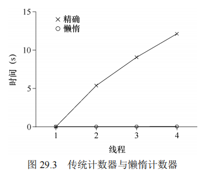
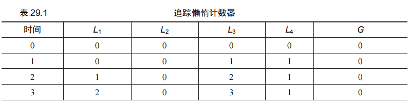
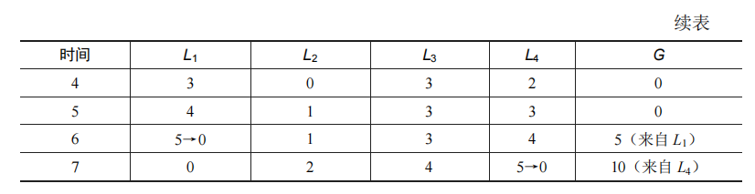
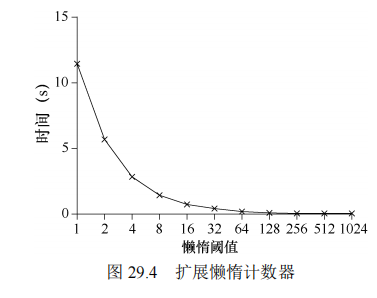
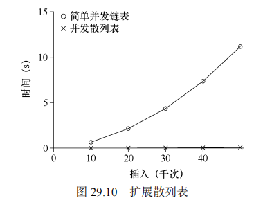
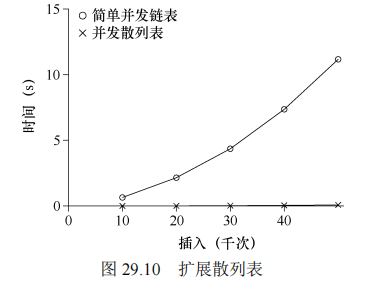
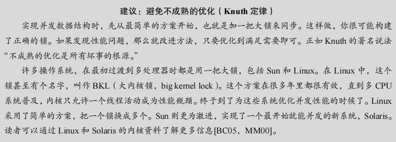

## 第29章 基于锁的并发数据结构

​		在结束锁的讨论之前，我们先讨论如何在常见数据结构中使用锁。通过锁可以使数据结构线程安全（thread safe）。当然，具体如何加锁决定了该数据结构的正确性和效率？因此，我们的挑战是：


​		当然，我们很难介绍所有的数据结构，或实现并发的所有方法，因为这是一个研究多年的议题，已经发表了数以千计的相关论文。因此，我们希望能够提供这类思考方式的足够介绍，同时提供一些好的资料，供你自己进一步研究。我们发现，Moir 和 Shavit 的调查[MS04]就是很好的资料。

### 29.1 并发计数器

计数器是最简单的一种数据结构，使用广泛而且接口简单。图 29.1 中定义了一个非并发的计数器。

```C
typedef struct counter_t { 
    int value; 
} counter_t; 

void init(counter_t *c) { 
    c->value = 0; 
} 

void increment(counter_t *c) { 
    c->value++; 
} 

void decrement(counter_t *c) { 
    c->value--; 
} 

int get(counter_t *c) { 
    return c->value; 
} 
```

*图 29.1 无锁的计数器*

​		这个非并发的计数器虽然简单，但在多线程环境中，不能保证线程安全。当多个线程同时访问或更新计数器时，可能会导致数据竞争问题。

#### 简单但无法扩展的加锁计数器

为了解决并发问题，我们可以通过添加锁来实现线程安全的计数器，如图 29.2 所示。

```C
typedef struct counter_t { 
    int value; 
    pthread_mutex_t lock; 
} counter_t; 

void init(counter_t *c) { 
    c->value = 0; 
    pthread_mutex_init(&c->lock, NULL); 
} 

void increment(counter_t *c) { 
    pthread_mutex_lock(&c->lock); 
    c->value++; 
    pthread_mutex_unlock(&c->lock); 
} 

void decrement(counter_t *c) { 
    pthread_mutex_lock(&c->lock); 
    c->value--; 
    pthread_mutex_unlock(&c->lock); 
} 

int get(counter_t *c) { 
    pthread_mutex_lock(&c->lock); 
    int rc = c->value; 
    pthread_mutex_unlock(&c->lock); 
    return rc; 
} 
```

*图 29.2 有锁的计数器*

​		这个有锁的计数器可以正确地在多线程环境中工作，但它存在扩展性问题。当多个线程同时访问计数器时，锁的争用会导致性能显著下降。

#### 可扩展的懒惰计数器

​		为了提高计数器的扩展性，可以使用一种称为懒惰计数器的技术。==这种技术使用多个局部计数器和一个全局计数器，其中每个 CPU 核心有一个局部计数器。局部计数器减少了线程之间的锁争用，从而提高了并发性能。每当局部计数器达到一定阈值时，它们的值会被合并到全局计数器中。==

懒惰计数器的实现如下：

```C
typedef struct counter_t { 
    int global; // global count 
    pthread_mutex_t glock; // global lock 
    int local[NUMCPUS]; // local count (per CPU) 
    pthread_mutex_t llock[NUMCPUS]; // ... and locks 
    int threshold; // update frequency 
} counter_t; 

void init(counter_t *c, int threshold) { 
    c->threshold = threshold; 
    c->global = 0; 
    pthread_mutex_init(&c->glock, NULL); 
    for (int i = 0; i < NUMCPUS; i++) { 
        c->local[i] = 0; 
        pthread_mutex_init(&c->llock[i], NULL); 
    } 
} 

void update(counter_t *c, int threadID, int amt) { 
    pthread_mutex_lock(&c->llock[threadID]); 
    c->local[threadID] += amt; // assumes amt > 0 
    if (c->local[threadID] >= c->threshold) { // transfer to global 
        pthread_mutex_lock(&c->glock); 
        c->global += c->local[threadID]; 
        pthread_mutex_unlock(&c->glock); 
        c->local[threadID] = 0; 
    } 
    pthread_mutex_unlock(&c->llock[threadID]); 
} 

int get(counter_t *c) { 
    pthread_mutex_lock(&c->glock); 
    int val = c->global; 
    pthread_mutex_unlock(&c->glock); 
    return val; // only approximate! 
} 
```

*图 29.5 懒惰计数器的实现*

​		懒惰计数器通过使用局部计数器和全局计数器的组合，使得计数操作在多个线程中更具扩展性。阈值 `S` 决定了局部计数器与全局计数器的更新频率：`S` 值越大，扩展性越好，但全局计数器与实际值的偏差越大。


### 小结

​		我们通过简单的锁来实现了线程安全的计数器，并进一步探讨了如何优化以提高其并发性能。懒惰计数器通过局部计数器的引入，显著减少了锁的争用，从而在多线程环境中实现了更好的性能扩展性。这种方法在实际应用中非常重要，尤其是在高并发系统中。

#### 原文：

​		计数器是最简单的一种数据结构，使用广泛而且接口简单。图 29.1 中定义了一个非并发的计数器。

以下是图 29.1 中无锁计数器的代码，并附加详细的解释注释。这种实现的计数器不使用锁来同步多线程操作，因此在多线程环境下可能会出现竞态条件。

```C
#include <stdio.h>

// 定义计数器结构体 counter_t
typedef struct counter_t {
    int value; // 计数器的当前值
} counter_t;

// 初始化计数器，将计数器的值设置为 0
void init(counter_t *c) {
    c->value = 0; // 初始化计数器的值为 0
}

// 递增计数器的值
void increment(counter_t *c) {
    c->value++; // 增加计数器的值，未使用任何同步机制
}

// 递减计数器的值
void decrement(counter_t *c) {
    c->value--; // 减少计数器的值，未使用任何同步机制
}

// 获取计数器的当前值
int get(counter_t *c) {
    return c->value; // 返回计数器的当前值
}

// 示例主函数，用于演示计数器的基本操作
int main() {
    counter_t myCounter; // 创建一个计数器实例
    init(&myCounter);    // 初始化计数器

    increment(&myCounter); // 递增计数器
    printf("Counter value after increment: %d\n", get(&myCounter));

    decrement(&myCounter); // 递减计数器
    printf("Counter value after decrement: %d\n", get(&myCounter));

    return 0; // 程序正常结束
}
```

#### **解释说明：**

1. **结构体定义 `counter_t`：**
   - 定义了一个简单的计数器结构体 `counter_t`，其中包含一个整数 `value`，用于存储计数器的当前值。
2. **初始化函数 `init`：**
   - 该函数将计数器的值初始化为 0。
   - 调用此函数时，需要传入计数器的指针 `c`。
3. **递增函数 `increment`：**
   - 将计数器的值增加 1。
   - 此操作是非原子的，在多线程环境中，如果多个线程同时执行此操作，可能会导致竞态条件。
4. **递减函数 `decrement`：**
   - 将计数器的值减少 1。
   - 同样，此操作是非原子的，存在竞态条件的风险。
5. **获取函数 `get`：**
   - 返回计数器的当前值。
   - 该操作是简单的读取，不涉及同步问题，但在多线程环境下，读取的值可能是瞬时的，不反映其他线程的操作。

#### **关键点：**

- **无锁操作：**
  - 这些操作都没有使用锁或其他同步机制，因此在多线程环境中无法保证操作的原子性和一致性。
- **竞态条件：**
  - 由于缺乏同步机制，如果多个线程同时对计数器进行递增或递减操作，可能会出现竞态条件，导致计数器的值不正确。
- **适用场景：**
  - 这种无锁计数器适合单线程环境或不要求严格同步的场景。
  - 如果需要在多线程环境中使用，应考虑引入同步机制，如使用原子操作、互斥锁或其他并发控制技术来确保数据一致性。

#### **总结：**

- **简单易用：** 这种计数器实现简单，易于理解和使用，但不适合多线程环境。
- **扩展性：** 为了在多线程环境中使用，需要扩展该实现，引入同步机制以防止竞态条件。


#### 简单但无法扩展 

​		你可以看到，没有同步机制的计数器很简单，只需要很少代码就能实现。现在我们的下一个挑战是：如何让这段代码线程安全（thread safe）？图 29.2 展示了我们的做法。

以下是图 29.2 中有锁计数器的代码，并附加详细的解释注释。这种实现使用 `pthread_mutex_t` 互斥锁来确保多线程环境下对计数器操作的原子性和一致性。

```
c复制代码#include <stdio.h>
#include <pthread.h>

// 定义计数器结构体 counter_t
typedef struct counter_t {
    int value;              // 计数器的当前值
    pthread_mutex_t lock;   // 互斥锁，用于保护计数器的操作
} counter_t;

// 初始化计数器，将计数器的值设置为 0，并初始化互斥锁
void init(counter_t *c) {
    c->value = 0;                               // 初始化计数器的值为 0
    pthread_mutex_init(&c->lock, NULL);         // 初始化互斥锁
}

// 递增计数器的值
void increment(counter_t *c) {
    pthread_mutex_lock(&c->lock);   // 获取互斥锁，确保操作的原子性
    c->value++;                     // 增加计数器的值
    pthread_mutex_unlock(&c->lock); // 释放互斥锁
}

// 递减计数器的值
void decrement(counter_t *c) {
    pthread_mutex_lock(&c->lock);   // 获取互斥锁，确保操作的原子性
    c->value--;                     // 减少计数器的值
    pthread_mutex_unlock(&c->lock); // 释放互斥锁
}

// 获取计数器的当前值
int get(counter_t *c) {
    pthread_mutex_lock(&c->lock);   // 获取互斥锁，确保读取操作的原子性
    int rc = c->value;              // 获取计数器的当前值
    pthread_mutex_unlock(&c->lock); // 释放互斥锁
    return rc;                      // 返回计数器的值
}

// 示例主函数，用于演示计数器的基本操作
int main() {
    counter_t myCounter;          // 创建一个计数器实例
    init(&myCounter);             // 初始化计数器

    increment(&myCounter);        // 递增计数器
    printf("Counter value after increment: %d\n", get(&myCounter));

    decrement(&myCounter);        // 递减计数器
    printf("Counter value after decrement: %d\n", get(&myCounter));

    return 0;                     // 程序正常结束
}
```

#### **解释说明：**

1. **结构体定义 `counter_t`：**

   - 定义了一个计数器结构体 

     ```
     counter_t
     ```

     ，其中包含两个成员：

     - `value`：用于存储计数器的当前值。
     - `lock`：类型为 `pthread_mutex_t`，用于保护计数器的操作，使其在多线程环境下是线程安全的。

2. **初始化函数 `init`：**

   - 将计数器的值初始化为 0。
   - 使用 `pthread_mutex_init` 初始化互斥锁 `lock`，使得计数器可以在多线程环境中安全使用。

3. **递增函数 `increment`：**

   - 使用 `pthread_mutex_lock` 获取互斥锁，确保对计数器的递增操作是原子的，不会被其他线程中断。
   - 递增计数器的值，然后使用 `pthread_mutex_unlock` 释放互斥锁。

4. **递减函数 `decrement`：**

   - 类似于递增函数，使用互斥锁保护对计数器的递减操作。
   - 获取锁后减少计数器的值，操作完成后释放锁。

5. **获取函数 `get`：**

   - 使用 `pthread_mutex_lock` 获取互斥锁，确保读取计数器值的操作是线程安全的。
   - 获取计数器的当前值，并在读取后释放互斥锁。

#### **关键点：**

- **线程安全：**
  - 通过使用互斥锁，保证了对计数器的所有操作（递增、递减和读取）都是原子的，避免了多线程环境下的竞态条件。
- **互斥锁的作用：**
  - `pthread_mutex_t` 互斥锁用于保护共享资源，确保同一时间只有一个线程能够对计数器进行操作。
  - `pthread_mutex_lock` 用于获取锁，如果锁已经被其他线程持有，则当前线程将会阻塞直到锁被释放。
  - `pthread_mutex_unlock` 用于释放锁，使其他等待的线程可以继续操作。

#### **总结：**

- **适用于多线程环境：** 这种计数器实现适合在多线程环境中使用，能够保证操作的安全性和数据一致性。
- **简单易用：** 使用互斥锁是实现线程同步的经典方式，虽然会带来一定的性能开销，但可以确保数据的正确性。

​		这个并发计数器简单、正确。实际上，它遵循了最简单、最基本的并发数据结构中常见的数据模式：它只是加了一把锁，在调用函数操作该数据结构时获取锁，从调用返回时释放锁。这种方式类似基于观察者（monitor）[BH73]的数据结构，在调用、退出对象方法时，会自动获取锁、释放锁。

​		现在，有了一个并发数据结构，问题可能就是性能了。如果这个结构导致运行速度太慢，那么除了简单加锁，还需要进行优化。如果需要这种优化，那么本章的余下部分将进行探讨。请注意，如果数据结构导致的运行速度不是太慢，那就没事！如果简单的方案就能工作，就不需要精巧的设计。

​		为了理解简单方法的性能成本，我们运行一个基准测试，每个线程更新同一个共享计数器固定次数，然后我们改变线程数。图 29.3 给出了运行 1 个线程到 4 个线程的总耗时，其中每个线程更新 100 万次计数器。本实验是在 4 核 Intel 2.7GHz i5 CPU 的 iMac 上运行。通过增加 CPU，我们希望单位时间能够完成更多的任务。

​		从图 29.3 上方的曲线（标为“精确”）可以看出，同步的计数器扩展性不好。单线程完成 100 万次更新只需要很短的时间（大约 0.03s），而两个线程并发执行，每个更新 100 万次，性能下降很多（超过 5s！）。线程更多时，性能更差。

​		理想情况下，你会看到多处理上运行的多线程就像单线程一样快。达到这种状态称为完美扩展（perfect scaling）。虽然总工作量增多，但是并行执行后，完成任务的时间并没有增加。



### 可扩展的计数 

​		令人吃惊的是，关于如何实现可扩展的计数器，研究人员已经研究了多年[MS04]。更令人吃惊的是，最近的操作系统性能分析研究[B+10]表明，可扩展的计数器很重要。没有可扩展的计数，一些运行在 Linux 上的工作在多核机器上将遇到严重的扩展性问题。

​		尽管人们已经开发了多种技术来解决这一问题，我们将介绍一种特定的方法。这个方法是最近的研究提出的，称为懒惰计数器（sloppy counter）[B+10]。

​		懒惰计数器通过多个局部计数器和一个全局计数器来实现一个逻辑计数器，其中每个CPU 核心有一个局部计数器。具体来说，在 4 个 CPU 的机器上，有 4 个局部计数器和 1 个全局计数器。除了这些计数器，还有锁：每个局部计数器有一个锁，全局计数器有一个。

​		懒惰计数器的基本思想是这样的。如果一个核心上的线程想增加计数器，那就增加它的局部计数器，访问这个局部计数器是通过对应的局部锁同步的。因为每个 CPU 有自己的局部计数器，不同 CPU 上的线程不会竞争，所以计数器的更新操作可扩展性好。

​		但是，为了保持全局计数器更新（以防某个线程要读取该值），局部值会定期转移给全局计数器，方法是获取全局锁，让全局计数器加上局部计数器的值，然后将局部计数器置零。

​		这种局部转全局的频度，取决于一个阈值，这里称为 *S*（表示 sloppiness）。*S* 越小，懒惰计数器则越趋近于非扩展的计数器。*S* 越大，扩展性越强，但是全局计数器与实际计数的偏差越大。我们可以抢占所有的局部锁和全局锁（以特定的顺序，避免死锁），以获得精确值，但这种方法没有扩展性。

​		为了弄清楚这一点，来看一个例子（见表 29.1）。在这个例子中，阈值 *S* 设置为 5，4个 CPU 上分别有一个线程更新局部计数器 *L*1,…, *L*4。随着时间增加，全局计数器 *G* 的值也会记录下来。每一段时间，局部计数器可能会增加。如果局部计数值增加到阈值 *S*，就把局部值转移到全局计数器，局部计数器清零。





​		图 29.3 中下方的线，是阈值 *S* 为 1024 时懒惰计数器的性能。性能很高，4 个处理器更新 400 万次的时间和一个处理器更新 100 万次的几乎一样。

​		图 29.4 展示了阈值 *S* 的重要性，在 4 个 CPU 上的 4 个线程，分别增加计数器 100 万次。如果 *S* 小，性能很差（但是全局计数器精确度高）。如果 *S* 大，性能很好，但是全局计数器会有延时。懒惰计数器就是在准确性和性能之间折中。



​		图 29.5 是这种懒惰计数器的基本实现。阅读它，或者运行它，尝试一些例子，以便更好地理解它的原理。

以下是图 29.5 中懒惰计数器的代码，并附加详细的解释注释。这种实现通过局部计数器减少对全局计数器锁的争用，从而提高多线程环境下的性能。

```C
#include <stdio.h>
#include <pthread.h>

#define NUMCPUS 4 // 假设系统中有 4 个 CPU 核心

// 定义计数器结构体 counter_t
typedef struct counter_t {
    int global;                  // 全局计数器
    pthread_mutex_t glock;       // 全局锁
    int local[NUMCPUS];          // 局部计数器（每个 CPU 核心一个）
    pthread_mutex_t llock[NUMCPUS]; // 局部锁（每个 CPU 核心一个）
    int threshold;               // 阈值，用于决定何时将局部计数器值合并到全局计数器
} counter_t;

// 初始化计数器，记录阈值，初始化锁和计数器的值
void init(counter_t *c, int threshold) {
    c->threshold = threshold;    // 设置阈值
    c->global = 0;               // 初始化全局计数器
    pthread_mutex_init(&c->glock, NULL); // 初始化全局锁

    for (int i = 0; i < NUMCPUS; i++) {   // 初始化每个局部计数器和相应的锁
        c->local[i] = 0;
        pthread_mutex_init(&c->llock[i], NULL);
    }
}

// 更新计数器，通常情况下只更新局部计数器
// 当局部计数器的值达到阈值时，将局部计数器的值合并到全局计数器
void update(counter_t *c, int threadID, int amt) {
    pthread_mutex_lock(&c->llock[threadID]); // 获取对应线程 ID 的局部锁
    c->local[threadID] += amt;               // 更新局部计数器（假设 amt > 0）
    
    if (c->local[threadID] >= c->threshold) { // 当局部计数器达到阈值时
        pthread_mutex_lock(&c->glock);        // 获取全局锁
        c->global += c->local[threadID];      // 将局部计数器的值合并到全局计数器
        pthread_mutex_unlock(&c->glock);      // 释放全局锁
        c->local[threadID] = 0;               // 重置局部计数器
    }

    pthread_mutex_unlock(&c->llock[threadID]); // 释放局部锁
}

// 获取全局计数器的值（可能并不完全准确，因为局部计数器的值未必已合并）
int get(counter_t *c) {
    pthread_mutex_lock(&c->glock);  // 获取全局锁
    int val = c->global;            // 获取全局计数器的值
    pthread_mutex_unlock(&c->glock); // 释放全局锁
    return val;                     // 返回全局计数器的值（可能不完全准确）
}

// 示例主函数，用于演示计数器的基本操作
int main() {
    counter_t myCounter;         // 创建一个计数器实例
    init(&myCounter, 10);        // 初始化计数器，设置阈值为 10

    // 示例使用：线程 0 更新计数器
    update(&myCounter, 0, 5);    // 局部计数器增加 5
    printf("Counter value: %d\n", get(&myCounter)); // 获取并打印全局计数器的值

    update(&myCounter, 0, 6);    // 局部计数器增加 6，触发合并到全局计数器
    printf("Counter value: %d\n", get(&myCounter)); // 获取并打印全局计数器的值

    return 0;                    // 程序正常结束
}
```

#### **解释说明：**

1. **结构体定义 `counter_t`：**
   - `global`：全局计数器，用于存储合并后的总计数。
   - `glock`：保护全局计数器的锁，防止多线程同时修改全局计数器。
   - `local[NUMCPUS]`：局部计数器数组，每个 CPU 核心对应一个，用于减少对全局计数器的频繁更新。
   - `llock[NUMCPUS]`：保护局部计数器的锁数组，每个 CPU 核心对应一个，用于保护各自的局部计数器。
   - `threshold`：阈值，用于控制将局部计数器的值合并到全局计数器的频率。
2. **初始化函数 `init`：**
   - 设置全局计数器和所有局部计数器的初始值。
   - 初始化全局锁和每个局部计数器的锁。
3. **更新函数 `update`：**
   - 根据 `threadID` 获取对应的局部锁，并更新局部计数器的值。
   - 如果局部计数器的值达到或超过设定的阈值，将其值合并到全局计数器，并重置局部计数器。
4. **获取函数 `get`：**
   - 获取并返回全局计数器的当前值。
   - 由于局部计数器的值可能尚未合并，返回的值可能不完全准确，但适合快速访问。

#### **关键点：**

- **减少锁争用：** 通过使用局部计数器和局部锁，减少了对全局锁的争用，从而提高了多线程环境下的性能。
- **性能优化：** 仅在局部计数器达到阈值时才合并到全局计数器，这种“懒惰”的策略减少了全局锁的获取次数，提高了程序的吞吐量。
- **适用场景：** 这种设计适用于需要高频更新计数器的多线程程序，尤其在多核 CPU 环境下效果显著。

#### **总结：**

- **有效的性能优化策略：** 这种懒惰计数器通过分散锁的获取频率，显著减少了全局锁的争用，是一种有效的性能优化策略。
- **灵活性：** 可以根据具体的工作负载和系统的 CPU 核心数量调整阈值，以达到最佳性能。


### 29.2 并发链表

​		在这一节中，我们将讨论如何通过锁机制使链表数据结构变得线程安全，并探讨如何进一步优化该并发链表。

#### 基础实现

​		我们首先从一个基础实现开始，只关注链表的插入操作。以下是基本的链表结构和插入、查找操作的实现：

```C
/ basic node structure 
typedef struct node_t { 
    int key; 
    struct node_t *next; 
} node_t; 

// basic list structure (one used per list) 
typedef struct list_t { 
    node_t *head; 
    pthread_mutex_t lock; 
} list_t; 

void List_Init(list_t *L) { 
    L->head = NULL; 
    pthread_mutex_init(&L->lock, NULL); 
} 

int List_Insert(list_t *L, int key) { 
    pthread_mutex_lock(&L->lock); 
    node_t *new = malloc(sizeof(node_t)); 
    if (new == NULL) { 
        perror("malloc"); 
        pthread_mutex_unlock(&L->lock); 
        return -1; // fail 
    } 
    new->key = key; 
    new->next = L->head; 
    L->head = new; 
    pthread_mutex_unlock(&L->lock); 
    return 0; // success 
} 

int List_Lookup(list_t *L, int key) { 
    pthread_mutex_lock(&L->lock); 
    node_t *curr = L->head; 
    while (curr) { 
        if (curr->key == key) { 
            pthread_mutex_unlock(&L->lock); 
            return 0; // success 
        } 
        curr = curr->next; 
    } 
    pthread_mutex_unlock(&L->lock); 
    return -1; // failure 
} 
```

*图 29.6 并发链表*

在这个实现中，`List_Insert` 和 `List_Lookup` 函数入口处获取锁，结束时释放锁，以确保链表操作的线程安全性。然而，这种方式存在一些小问题，特别是在 `malloc` 失败时需要在插入失败之前释放锁，容易引入错误。

#### 优化并发链表

为了改进上述实现，我们可以调整代码结构，使得获取和释放锁的操作仅围绕临界区进行。具体来说，我们可以将锁定范围缩小到更新链表的操作，从而减少锁的持有时间并降低复杂度。以下是优化后的代码：

```C
void List_Init(list_t *L) { 
    L->head = NULL; 
    pthread_mutex_init(&L->lock, NULL); 
} 

void List_Insert(list_t *L, int key) { 
    // synchronization not needed 
    node_t *new = malloc(sizeof(node_t)); 
    if (new == NULL) { 
        perror("malloc"); 
        return; 
    } 
    new->key = key; 

    // just lock critical section 
    pthread_mutex_lock(&L->lock); 
    new->next = L->head; 
    L->head = new; 
    pthread_mutex_unlock(&L->lock); 
} 

int List_Lookup(list_t *L, int key) { 
    int rv = -1; 
    pthread_mutex_lock(&L->lock); 
    node_t *curr = L->head; 
    while (curr) { 
        if (curr->key == key) { 
            rv = 0; 
            break; 
        } 
        curr = curr->next; 
    } 
    pthread_mutex_unlock(&L->lock); 
    return rv; // now both success and failure 
} 
```

*图 29.7 重写并发链表*

​		这种方式使得 `List_Insert` 函数中的 `malloc` 不再需要锁的保护，只在真正操作链表时获取锁。这样做减少了锁的持有时间，减少了潜在的竞争条件。

#### 扩展链表的并发性

​		尽管改进了并发链表的实现，但仍然存在扩展性问题。当有多个线程同时访问链表时，性能可能受到锁争用的影响。为了解决这个问题，可以采用 **过手锁**（hand-over-hand locking） 技术。

​		过手锁的基本思想是为链表中的每个节点都设置一个锁。在遍历链表时，线程首先获取下一个节点的锁，然后释放当前节点的锁。这种方法可以增加链表操作的并发性，但也会增加锁的获取和释放的开销，实际效果并不总是理想的。

### 小结

​		通过锁机制，我们可以使链表数据结构在多线程环境中保持线程安全。然而，简单的锁机制可能会影响性能，尤其是在高并发场景下。优化锁的使用，减少锁的持有时间，并考虑更复杂的锁策略（如过手锁），可以进一步提高并发数据结构的性能。在实际应用中，应根据具体需求和系统环境选择合适的并发控制策略。


#### 原文：

​		接下来看一个更复杂的数据结构，链表。同样，我们从一个基础实现开始。简单起见，我们只关注链表的插入操作，其他操作比如查找、删除等就交给读者了。图 29.6 展示了这个基本数据结构的代码。

以下是图 29.6 中并发链表的代码，并附加详细的解释注释。这段代码实现了一个支持并发操作的链表，通过使用互斥锁来保护链表的插入和查找操作。

```C
#include <stdio.h>
#include <stdlib.h>
#include <pthread.h>

// 节点结构体定义
typedef struct node_t {
    int key;              // 节点存储的键值
    struct node_t *next;  // 指向下一个节点的指针
} node_t;

// 链表结构体定义，每个链表包含一个头指针和一个互斥锁
typedef struct list_t {
    node_t *head;         // 指向链表头部的指针
    pthread_mutex_t lock; // 用于保护链表操作的互斥锁
} list_t;

// 初始化链表，设置头指针为空并初始化互斥锁
void List_Init(list_t *L) {
    L->head = NULL;                       // 初始化链表为空
    pthread_mutex_init(&L->lock, NULL);   // 初始化互斥锁
}

// 插入一个节点到链表中
int List_Insert(list_t *L, int key) {
    pthread_mutex_lock(&L->lock);         // 获取互斥锁，保护链表操作
    node_t *new = malloc(sizeof(node_t)); // 分配新节点的内存
    if (new == NULL) {                    // 检查内存分配是否成功
        perror("malloc");                 // 打印错误信息
        pthread_mutex_unlock(&L->lock);   // 释放互斥锁
        return -1;                        // 插入失败
    }
    new->key = key;                       // 设置新节点的键值
    new->next = L->head;                  // 将新节点插入到链表头部
    L->head = new;                        // 更新链表头指针
    pthread_mutex_unlock(&L->lock);       // 释放互斥锁
    return 0;                             // 插入成功
}

// 查找链表中是否存在指定键值的节点
int List_Lookup(list_t *L, int key) {
    pthread_mutex_lock(&L->lock);         // 获取互斥锁，保护链表操作
    node_t *curr = L->head;               // 从链表头开始遍历
    while (curr) {                        // 遍历链表
        if (curr->key == key) {           // 找到匹配的节点
            pthread_mutex_unlock(&L->lock); // 释放互斥锁
            return 0;                     // 查找成功
        }
        curr = curr->next;                // 移动到下一个节点
    }
    pthread_mutex_unlock(&L->lock);       // 释放互斥锁
    return -1;                            // 查找失败
}
```

#### **解释说明：**

1. **节点结构体 `node_t`：**
   - `key`：用于存储节点的键值。
   - `next`：指向下一个节点的指针，用于链表的连接。
2. **链表结构体 `list_t`：**
   - `head`：指向链表头部的指针，初始为空。
   - `lock`：一个互斥锁，用于保护链表的操作（如插入和查找），确保在多线程环境下操作的安全性。
3. **初始化函数 `List_Init`：**
   - 初始化链表，将头指针设置为 `NULL`，表示链表为空。
   - 初始化互斥锁 `lock`，以便后续的并发操作。
4. **插入函数 `List_Insert`：**
   - 获取互斥锁 `lock`，以保护链表的插入操作。
   - 为新节点分配内存，并检查分配是否成功。
   - 设置新节点的键值，并将其插入到链表的头部。
   - 释放互斥锁，完成插入操作。
5. **查找函数 `List_Lookup`：**
   - 获取互斥锁 `lock`，以保护链表的查找操作。
   - 从链表头部开始遍历，查找与目标键值匹配的节点。
   - 如果找到匹配的节点，释放互斥锁并返回成功。
   - 如果遍历结束未找到匹配的节点，释放互斥锁并返回失败。

#### **关键点：**

- **并发控制：**
  - 使用互斥锁来保护链表的插入和查找操作，确保在多线程环境下不会发生竞态条件。
  - 每次操作链表时，必须先获取锁，操作完成后释放锁。
- **性能考虑：**
  - 虽然互斥锁可以确保安全性，但会导致潜在的性能瓶颈，特别是在大量线程频繁访问链表时。
  - 如果链表操作较为频繁，考虑使用更细粒度的锁或其他并发数据结构。

#### **总结：**

- **线程安全：** 使用互斥锁可以确保链表在多线程环境下的线程安全性。
- **简单易用：** 实现相对简单，适合用于基本的并发场景。
- **扩展性：** 适合小规模的并发访问，对于高并发场景，需要优化锁的粒度或选择其他并发数据结构。


​		从代码中可以看出，代码插入函数入口处获取锁，结束时释放锁。如果 malloc 失败（在极少的时候），会有一点小问题，在这种情况下，代码在插入失败之前，必须释放锁。

​		事实表明，这种异常控制流容易产生错误。最近一个 Linux 内核补丁的研究表明，有40%都是这种很少发生的代码路径（实际上，这个发现启发了我们自己的一些研究，我们从Linux 文件系统中移除了所有内存失败的路径，得到了更健壮的系统[S+11]）。

​		因此，挑战来了：我们能够重写插入和查找函数，保持并发插入正确，但避免在失败情况下也需要调用释放锁吗？

​		在这个例子中，答案是可以。具体来说，我们调整代码，让获取锁和释放锁只环绕插入代码的真正临界区。前面的方法有效是因为部分工作实际上不需要锁，假定 malloc()是线程安全的，每个线程都可以调用它，不需要担心竞争条件和其他并发缺陷。只有在更新共享列表时需要持有锁。图 29.7 展示了这些修改的细节。

​		对于查找函数，进行了简单的代码调整，跳出主查找循环，到单一的返回路径。这样做减少了代码中需要获取锁、释放锁的地方，降低了代码中不小心引入缺陷（诸如在返回前忘记释放锁）的可能性。

以下是图 29.7 中重写的并发链表代码，并附加详细的解释注释。这段代码优化了链表的插入和查找操作，仅在关键区域内使用互斥锁来确保线程安全，从而减少了锁的持有时间，提升了性能。

```
c复制代码#include <stdio.h>
#include <stdlib.h>
#include <pthread.h>

// 节点结构体定义
typedef struct node_t {
    int key;              // 节点存储的键值
    struct node_t *next;  // 指向下一个节点的指针
} node_t;

// 链表结构体定义，每个链表包含一个头指针和一个互斥锁
typedef struct list_t {
    node_t *head;         // 指向链表头部的指针
    pthread_mutex_t lock; // 用于保护链表操作的互斥锁
} list_t;

// 初始化链表，设置头指针为空并初始化互斥锁
void List_Init(list_t *L) {
    L->head = NULL;                       // 初始化链表为空
    pthread_mutex_init(&L->lock, NULL);   // 初始化互斥锁
}

// 插入一个节点到链表中
void List_Insert(list_t *L, int key) {
    // 该部分无需同步操作，因为不涉及共享资源的修改
    node_t *new = malloc(sizeof(node_t)); // 分配新节点的内存
    if (new == NULL) {                    // 检查内存分配是否成功
        perror("malloc");                 // 打印错误信息
        return;                           // 插入失败
    }
    new->key = key;                       // 设置新节点的键值

    // 仅锁住关键区域，减少锁的持有时间
    pthread_mutex_lock(&L->lock);         // 获取互斥锁，保护链表头部的修改
    new->next = L->head;                  // 将新节点插入到链表头部
    L->head = new;                        // 更新链表头指针
    pthread_mutex_unlock(&L->lock);       // 释放互斥锁
}

// 查找链表中是否存在指定键值的节点
int List_Lookup(list_t *L, int key) {
    int rv = -1;                          // 初始化返回值为失败
    pthread_mutex_lock(&L->lock);         // 获取互斥锁，保护链表的查找操作
    node_t *curr = L->head;               // 从链表头开始遍历
    while (curr) {                        // 遍历链表
        if (curr->key == key) {           // 找到匹配的节点
            rv = 0;                       // 查找成功，设置返回值
            break;                        // 退出循环
        }
        curr = curr->next;                // 移动到下一个节点
    }
    pthread_mutex_unlock(&L->lock);       // 释放互斥锁
    return rv;                            // 返回查找结果，成功或失败
}
```

#### **解释说明：**

1. **节点结构体 `node_t`：**
   - `key`：存储节点的键值。
   - `next`：指向下一个节点的指针，用于连接链表。
2. **链表结构体 `list_t`：**
   - `head`：指向链表头部的指针，初始时为空。
   - `lock`：用于保护链表操作的互斥锁，确保线程安全。
3. **初始化函数 `List_Init`：**
   - 将链表的头指针设置为 `NULL`，表示链表为空。
   - 初始化互斥锁 `lock`，用于保护链表的操作。
4. **插入函数 `List_Insert`：**
   - 先分配新节点的内存，并设置键值。
   - 由于节点的创建过程与链表无关，因此无需同步操作。
   - 获取互斥锁，仅在关键区域（插入节点到链表）进行同步，减少锁的持有时间。
   - 将新节点插入到链表头部，并更新链表头指针。
   - 释放互斥锁，完成插入操作。
5. **查找函数 `List_Lookup`：**
   - 初始化返回值为失败（`-1`）。
   - 获取互斥锁以保护查找操作，确保遍历链表的过程中链表不被修改。
   - 从链表头部开始遍历，查找与目标键值匹配的节点。
   - 如果找到匹配的节点，设置返回值为成功（`0`）并退出循环。
   - 释放互斥锁，返回查找结果。

#### **关键点：**

- **锁的优化：**
  - 插入操作只在必要的关键区域内加锁，而不是整个函数，这样可以减少锁的持有时间，提升性能。
  - 查找操作中锁的粒度也保持在关键区域，确保操作的线程安全。
- **性能考虑：**
  - 这种设计通过缩短锁的持有时间，减少了对共享资源的争用，从而提升了并发性能。
  - 适合在多线程环境中使用，特别是频繁进行插入和查找操作的场景。

#### **总结：**

- **线程安全：** 使用互斥锁保护链表的修改和访问，确保在多线程环境下的操作安全。
- **性能优化：** 通过将锁的持有时间限制在关键区域，优化了链表的并发性能。
- **扩展性：** 适用于基本的并发环境，对于更高并发需求，可以考虑进一步优化锁的粒度或使用其他同步机制。


#### 扩展链表 

​		尽管我们有了基本的并发链表，但又遇到了这个链表扩展性不好的问题。研究人员发现的增加链表并发的技术中，有一种叫作过手锁（hand-over-hand locking，也叫作锁耦合，lock coupling）[MS04]。

​		原理也很简单。每个节点都有一个锁，替代之前整个链表一个锁。遍历链表的时候，首先抢占下一个节点的锁，然后释放当前节点的锁。

​		从概念上说，过手锁链表有点道理，它增加了链表操作的并发程度。但是实际上，在遍历的时候，每个节点获取锁、释放锁的开销巨大，很难比单锁的方法快。即使有大量的线程和很大的链表，这种并发的方案也不一定会比单锁的方案快。也许某种杂合的方案（一定数量的节点用一个锁）值得去研究。


### 29.3 并发队列

​		在这一节中，我们探讨了如何实现一个高效的并发队列。虽然我们可以通过加锁来实现线程安全的队列，但我们将跳过这种简单方法，转而关注更复杂的并发队列实现。

​		Michael 和 Scott [MS98] 设计的并发队列通过引入双锁机制，实现了高效的并发操作。以下是他们设计的队列的数据结构和实现代码：

```C
typedef struct node_t { 
    int value; 
    struct node_t *next; 
} node_t; 

typedef struct queue_t { 
    node_t *head; 
    node_t *tail; 
    pthread_mutex_t headLock; 
    pthread_mutex_t tailLock; 
} queue_t; 

void Queue_Init(queue_t *q) { 
    node_t *tmp = malloc(sizeof(node_t)); 
    tmp->next = NULL; 
    q->head = q->tail = tmp; 
    pthread_mutex_init(&q->headLock, NULL); 
    pthread_mutex_init(&q->tailLock, NULL); 
} 

void Queue_Enqueue(queue_t *q, int value) { 
    node_t *tmp = malloc(sizeof(node_t)); 
    assert(tmp != NULL); 
    tmp->value = value; 
    tmp->next = NULL; 

    pthread_mutex_lock(&q->tailLock); 
    q->tail->next = tmp; 
    q->tail = tmp; 
    pthread_mutex_unlock(&q->tailLock); 
} 

int Queue_Dequeue(queue_t *q, int *value) { 
    pthread_mutex_lock(&q->headLock); 
    node_t *tmp = q->head; 
    node_t *newHead = tmp->next; 
    if (newHead == NULL) { 
        pthread_mutex_unlock(&q->headLock); 
        return -1; // queue was empty 
    } 
    *value = newHead->value; 
    q->head = newHead; 
    pthread_mutex_unlock(&q->headLock); 
    free(tmp); 
    return 0; 
} 
```

*图 29.8 Michael 和 Scott 的并发队列*

​		在这段代码中，==两个锁分别负责队列的头和尾部操作。通过这种方式，入队和出队操作可以并发执行，因为入队只涉及 `tailLock`，而出队只涉及 `headLock`。==

​		==Michael 和 Scott 使用了一个技巧，即在初始化队列时**创建一个假节点**，将队列的头和尾分开，这样可以使得队列操作更加高效。==这个并发队列的设计在多线程程序中广泛应用。

#### 原文：

你现在知道了，总有一个标准的方法来创建一个并发数据结构：添加一把大锁。对于一个队列，我们将跳过这种方法，假定你能弄明白。

​		我们来看看 Michael 和 Scott [MS98]设计的、更并发的队列。图 29.8 展示了用于该队列的数据结构和代码。

以下是图 29.8 中 Michael 和 Scott 的并发队列的代码，并附加详细的解释注释。这段代码实现了一个线程安全的并发队列，通过使用独立的锁来保护队列的头和尾，提升了队列操作的并发性。

```C
#include <stdio.h>
#include <stdlib.h>
#include <pthread.h>
#include <assert.h>

// 定义节点结构体 node_t
typedef struct node_t {
    int value;             // 节点存储的值
    struct node_t *next;   // 指向下一个节点的指针
} node_t;

// 定义队列结构体 queue_t
typedef struct queue_t {
    node_t *head;          // 指向队列头节点的指针
    node_t *tail;          // 指向队列尾节点的指针
    pthread_mutex_t headLock; // 保护队列头部操作的互斥锁
    pthread_mutex_t tailLock; // 保护队列尾部操作的互斥锁
} queue_t;

// 初始化队列
void Queue_Init(queue_t *q) {
    node_t *tmp = malloc(sizeof(node_t)); // 创建一个占位节点（哨兵节点）
    tmp->next = NULL;                     // 哨兵节点的 next 设为 NULL
    q->head = q->tail = tmp;              // 初始化头和尾都指向哨兵节点
    pthread_mutex_init(&q->headLock, NULL); // 初始化头部锁
    pthread_mutex_init(&q->tailLock, NULL); // 初始化尾部锁
}

// 入队操作
void Queue_Enqueue(queue_t *q, int value) {
    node_t *tmp = malloc(sizeof(node_t)); // 为新节点分配内存
    assert(tmp != NULL);                  // 确保分配成功
    tmp->value = value;                   // 设置新节点的值
    tmp->next = NULL;                     // 新节点的 next 设为 NULL

    pthread_mutex_lock(&q->tailLock);     // 获取尾部锁
    q->tail->next = tmp;                  // 将新节点添加到队列尾部
    q->tail = tmp;                        // 更新队列的尾指针
    pthread_mutex_unlock(&q->tailLock);   // 释放尾部锁
}

// 出队操作
int Queue_Dequeue(queue_t *q, int *value) {
    pthread_mutex_lock(&q->headLock);     // 获取头部锁
    node_t *tmp = q->head;                // 保存当前头节点（哨兵节点）
    node_t *newHead = tmp->next;          // 新的头节点为哨兵节点的下一个节点
    if (newHead == NULL) {                // 检查队列是否为空
        pthread_mutex_unlock(&q->headLock); // 释放头部锁
        return -1;                        // 队列为空，出队失败
    }
    *value = newHead->value;              // 提取新头节点的值
    q->head = newHead;                    // 更新头指针为新头节点
    pthread_mutex_unlock(&q->headLock);   // 释放头部锁
    free(tmp);                            // 释放旧的哨兵节点
    return 0;                             // 出队成功
}

// 示例主函数，用于演示队列的基本操作
int main() {
    queue_t myQueue;            // 创建一个队列实例
    Queue_Init(&myQueue);       // 初始化队列

    Queue_Enqueue(&myQueue, 1); // 入队元素 1
    Queue_Enqueue(&myQueue, 2); // 入队元素 2

    int value;
    if (Queue_Dequeue(&myQueue, &value) == 0) // 出队元素
        printf("Dequeued: %d\n", value);      // 输出已出队的元素

    if (Queue_Dequeue(&myQueue, &value) == 0) // 再次出队
        printf("Dequeued: %d\n", value);      // 输出已出队的元素

    return 0;                     // 程序正常结束
}
```

#### **解释说明：**

1. **节点结构体 `node_t`：**
   - `value`：存储节点的值。
   - `next`：指向下一个节点的指针，用于连接队列。
2. **队列结构体 `queue_t`：**
   - `head`：指向队列头节点的指针。
   - `tail`：指向队列尾节点的指针。
   - `headLock`：保护队列头部操作的互斥锁，用于确保出队操作的线程安全。
   - `tailLock`：保护队列尾部操作的互斥锁，用于确保入队操作的线程安全。
3. **初始化函数 `Queue_Init`：**
   - 创建一个哨兵节点，作为队列的初始节点。
   - 初始化队列的头和尾指针都指向哨兵节点。
   - 初始化头部和尾部的互斥锁。
4. **入队函数 `Queue_Enqueue`：**
   - 为新节点分配内存并设置值。
   - 使用 `tailLock` 锁住尾部操作，将新节点添加到队列的尾部，并更新尾指针。
   - 释放尾部锁。
5. **出队函数 `Queue_Dequeue`：**
   - 使用 `headLock` 锁住头部操作，检查队列是否为空。
   - 如果队列为空（仅有哨兵节点），释放头部锁并返回失败。
   - 否则，提取新头节点的值，更新头指针到新的头节点。
   - 释放旧的哨兵节点，释放头部锁并返回成功。

#### **关键点：**

- **锁分离：**
  - 使用独立的锁来保护队列的头和尾，允许入队和出队操作同时进行，从而提高了队列的并发性。
- **哨兵节点：**
  - 哨兵节点简化了队列的初始化和边界条件处理，使得入队和出队操作可以一致地处理。
- **线程安全：**
  - 通过互斥锁保护队列的修改，确保在多线程环境下的安全操作。

#### **总结：**

- **并发性能优化：** 使用独立的头部和尾部锁提升了入队和出队的并发性能，适合多线程环境中的高效队列操作。
- **结构简单易用：** 代码结构简单清晰，易于理解和使用，适合于需要基本并发控制的队列场景。

​		仔细研究这段代码，你会发现有两个锁，一个负责队列头，另一个负责队列尾。这两个锁使得入队列操作和出队列操作可以并发执行，因为入队列只访问 tail 锁，而出队列只访问 head 锁。

​		Michael 和 Scott 使用了一个技巧，添加了一个假节点（在队列初始化的代码里分配的）。该假节点分开了头和尾操作。研究这段代码，或者输入、运行、测试它，以便更深入地理解它。

​		队列在多线程程序里广泛使用。然而，这里的队列（只是加了锁）通常不能完全满足这种程序的需求。更完善的有界队列，在队列空或者满时，能让线程等待。这是下一章探讨条件变量时集中研究的主题。读者需要看仔细了！


### 29.4 并发散列表

​		并发散列表是另一个常用的数据结构，它在多线程环境下可以提高查找和插入操作的效率。以下是一个简单的并发散列表实现：

```C
#define BUCKETS (101) 

typedef struct hash_t { 
    list_t lists[BUCKETS]; 
} hash_t; 

void Hash_Init(hash_t *H) { 
    int i; 
    for (i = 0; i < BUCKETS; i++) { 
        List_Init(&H->lists[i]); 
    } 
} 

int Hash_Insert(hash_t *H, int key) { 
    int bucket = key % BUCKETS; 
    return List_Insert(&H->lists[bucket], key); 
} 

int Hash_Lookup(hash_t *H, int key) { 
    int bucket = key % BUCKETS; 
    return List_Lookup(&H->lists[bucket], key); 
} 
```

*图 29.9 并发散列表*

​		这个散列表的实现使用了之前实现的并发链表，每个散列桶（bucket）都有一个链表和一个对应的锁。这种设计允许多个线程同时操作不同的桶，从而提高并发性能。

​		在多个线程同时进行插入操作时，这个简单的并发散列表能够表现出极好的扩展性。图 29.10 展示了该并发散列表在不同线程数下的性能表现，与使用单锁的链表相比，并发散列表的扩展性显著提高。



### 小结

​		在这一章中，我们讨论了如何使用锁来实现并发队列和并发散列表。通过合理地使用锁，可以有效地提高数据结构的并发性能，减少锁争用带来的性能瓶颈。与此同时，我们也强调了在设计并发数据结构时，避免不成熟的优化，以确保代码的正确性和效率。


#### 建议：避免不成熟的优化（**Knuth** 定律）

​		实现并发数据结构时，先从最简单的方案开始，也就是加一把大锁来同步。这样做，你很可能构建了正确的锁。如果发现性能问题，那么就改进方法，只要优化到满足需要即可。正如 Knuth 的著名说法“不成熟的优化是所有坏事的根源。” 

​		许多操作系统，在最初过渡到多处理器时都是用一把大锁，包括 Sun 和 Linux。在 Linux 中，这个锁甚至有个名字，叫作 BKL（大内核锁，big kernel lock）。这个方案在很多年里都很有效，直到多 CPU系统普及，内核只允许一个线程活动成为性能瓶颈。终于到了为这些系统优化并发性能的时候了。Linux采用了简单的方案，把一个锁换成多个。Sun 则更为激进，实现了一个最开始就能并发的新系统，Solaris。读者可以通过 Linux 和 Solaris 的内核资料了解更多信息[BC05，MM00]。

#### 原文：

​		我们讨论最后一个应用广泛的并发数据结构，散列表（见图 29.9）。我们只关注不需要调整大小的简单散列表。支持调整大小还需要一些工作，留给读者作为练习。

以下是图 29.9 中并发散列表的代码，并附加详细的解释注释。这段代码实现了一个并发散列表（哈希表），使用多个链表和互斥锁来支持并发访问。

```C
#include <stdio.h>
#include <stdlib.h>
#include <pthread.h>

#define BUCKETS (101) // 定义散列表的桶数量为 101

// 假设 list_t 和相关操作已定义
typedef struct node_t {
    int key;
    struct node_t *next;
} node_t;

typedef struct list_t {
    node_t *head;
    pthread_mutex_t lock;
} list_t;

// 链表初始化函数
void List_Init(list_t *L) {
    L->head = NULL;
    pthread_mutex_init(&L->lock, NULL);
}

// 链表插入函数
int List_Insert(list_t *L, int key) {
    pthread_mutex_lock(&L->lock);
    node_t *new = malloc(sizeof(node_t));
    if (new == NULL) {
        perror("malloc");
        pthread_mutex_unlock(&L->lock);
        return -1; // 插入失败
    }
    new->key = key;
    new->next = L->head;
    L->head = new;
    pthread_mutex_unlock(&L->lock);
    return 0; // 插入成功
}

// 链表查找函数
int List_Lookup(list_t *L, int key) {
    int rv = -1;
    pthread_mutex_lock(&L->lock);
    node_t *curr = L->head;
    while (curr) {
        if (curr->key == key) {
            rv = 0; // 找到匹配的节点
            break;
        }
        curr = curr->next;
    }
    pthread_mutex_unlock(&L->lock);
    return rv; // 返回查找结果，成功或失败
}

// 定义散列表结构体 hash_t
typedef struct hash_t {
    list_t lists[BUCKETS]; // 定义包含多个链表的数组，每个链表对应一个桶
} hash_t;

// 初始化散列表
void Hash_Init(hash_t *H) {
    for (int i = 0; i < BUCKETS; i++) { // 初始化每个桶对应的链表
        List_Init(&H->lists[i]);
    }
}

// 插入键值到散列表
int Hash_Insert(hash_t *H, int key) {
    int bucket = key % BUCKETS; // 计算键值的哈希值，确定插入到哪个桶
    return List_Insert(&H->lists[bucket], key); // 将键值插入到对应桶的链表中
}

// 查找键值是否存在于散列表
int Hash_Lookup(hash_t *H, int key) {
    int bucket = key % BUCKETS; // 计算键值的哈希值，确定在哪个桶查找
    return List_Lookup(&H->lists[bucket], key); // 在对应桶的链表中查找键值
}

// 示例主函数，用于演示散列表的基本操作
int main() {
    hash_t myHashTable;       // 创建一个散列表实例
    Hash_Init(&myHashTable);  // 初始化散列表

    Hash_Insert(&myHashTable, 10);  // 插入键值 10
    Hash_Insert(&myHashTable, 111); // 插入键值 111

    if (Hash_Lookup(&myHashTable, 10) == 0) // 查找键值 10
        printf("Key 10 found.\n");
    else
        printf("Key 10 not found.\n");

    if (Hash_Lookup(&myHashTable, 50) == 0) // 查找键值 50
        printf("Key 50 found.\n");
    else
        printf("Key 50 not found.\n");

    return 0; // 程序正常结束
}
```

#### **解释说明：**

1. **节点和链表定义：**
   - `node_t`：节点结构体，用于链表中的每个元素，包含一个 `key` 和指向下一个节点的指针 `next`。
   - `list_t`：链表结构体，包含链表的头指针 `head` 和一个互斥锁 `lock`，用于保护链表的并发操作。
2. **链表操作：**
   - **`List_Init`**：初始化链表，将头指针设置为 `NULL` 并初始化互斥锁。
   - **`List_Insert`**：在链表头部插入新节点，并使用互斥锁保护操作，确保线程安全。
   - **`List_Lookup`**：在链表中查找特定键值，使用互斥锁保护查找操作。
3. **散列表结构 `hash_t`：**
   - 包含一个链表数组 `lists`，每个链表对应一个桶。数组的大小由宏 `BUCKETS` 定义，这里为 101。
4. **散列表操作：**
   - **`Hash_Init`**：初始化散列表中的每个链表。
   - **`Hash_Insert`**：通过计算键值的哈希值（取模运算），确定要插入的桶，然后将键值插入到对应的链表中。
   - **`Hash_Lookup`**：通过计算键值的哈希值，确定要查找的桶，然后在对应的链表中查找键值。

#### **关键点：**

- **并发控制：**
  - 每个链表有自己的互斥锁，这样不同桶的插入和查找操作可以并发进行，不会相互阻塞。
  - 通过使用多个链表来减少锁的争用，从而提升并发性能。
- **散列函数：**
  - 散列函数是简单的取模操作 `key % BUCKETS`，将键值映射到对应的桶。
  - 使用这种简单的散列函数，键值会均匀分布到不同的链表中，减少单个链表的负载。

#### **总结：**

- **线程安全：** 通过使用链表和互斥锁，确保了散列表在多线程环境下的安全性。
- **高效并发：** 由于每个桶使用独立的锁，允许并发操作，不同的线程可以同时访问不同的链表而不互相影响。
- **易于扩展：** 可以通过调整桶的数量（`BUCKETS`）和散列函数来优化性能，以适应不同的负载和并发需求。

​		本例的散列表使用我们之前实现的并发链表，性能特别好。每个散列桶（每个桶都是一个链表）都有一个锁，而不是整个散列表只有一个锁，从而支持许多并发操作。

​		图 29.10 展示了并发更新下的散列表的性能（同样在 4 CPU 的 iMac，4 个线程，每个线程分别执行 1 万～5 万次并发更新）。同时，作为比较，我们也展示了单锁链表的性能。可以看出，这个简单的并发散列表扩展性极好，而链表则相反。






### 29.5 小节

​		在第 29 章的最后一节，我们总结了讨论的并发数据结构，从最简单的计数器到更复杂的链表、队列以及散列表。这些数据结构在多线程环境下的实现展示了如何通过锁来保证线程安全，同时在某些情况下，还能提高并发性能。

在小结中，我们强调了以下几个关键点：

1. **控制流变化时注意锁的管理**：在设计并发数据结构时，需要特别注意控制流的变化，确保在函数返回或发生错误时正确地释放锁。否则，可能会引发难以调试的并发问题。
2. **并发性与性能**：增加并发性并不总能提高性能。在某些情况下，过多的锁反而会导致性能下降。因此，在实现并发数据结构时，必须权衡并发性和性能之间的关系。
3. **避免不成熟的优化**：我们特别提醒开发者，优化应当基于实际的性能问题，而不是盲目地追求更高的并发性。过早的优化往往会带来复杂性，导致代码难以维护，并且未必能带来实际的性能提升。

​		通过这一章的学习，你应该掌握了如何为常见的数据结构添加并发控制，并且理解了在多线程环境下实现高效数据结构所面临的挑战。如果你对这些话题感兴趣，可以进一步研究更高级的并发数据结构，如 B 树，或深入了解非阻塞数据结构的技术，这在常见并发问题的章节中会稍作提及。对于那些想要深入理解和应用这些概念的读者，数据库课程和相关的文献会是很好的补充资源。

​		总的来说，第 29 章为你提供了关于并发数据结构的基础知识和设计思路，帮助你在多线程编程中更好地处理并发性和性能之间的关系。


#### 原文：

​		我们已经介绍了一些并发数据结构，==从计数器到链表队列，最后到大量使用的散列表。==同时，我们也学习到：==控制流变化时注意获取锁和释放锁；增加并发不一定能提高性能；有性能问题的时候再做优化。==关于最后一点，避免不成熟的优化（premature optimization），对于所有关心性能的开发者都有用。我们让整个应用的某一小部分变快，却没有提高整体性能，其实没有价值。

​		当然，==我们只触及了高性能数据结构的皮毛。==Moir 和 Shavit 的调查提供了更多信息，包括指向其他来源的链接[MS04]。特别是，==你可能会对其他结构感兴趣（比如 B 树），那么数据库课程会是一个不错的选择。==你也可能对根本不用传统锁的技术感兴趣。这种非阻塞数据结构是有意义的，在常见并发问题的章节中，我们会稍稍涉及。但老实说这是一个广泛领域的知识，远非本书所能覆盖。感兴趣的读者可以自行研究。