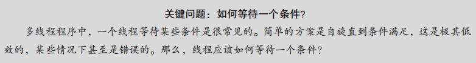
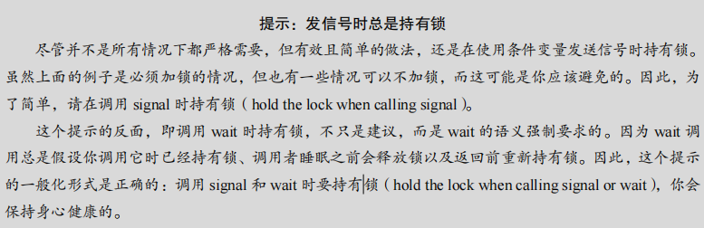
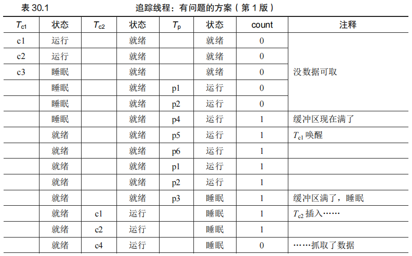
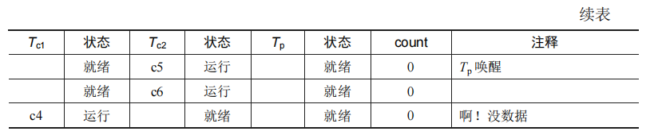
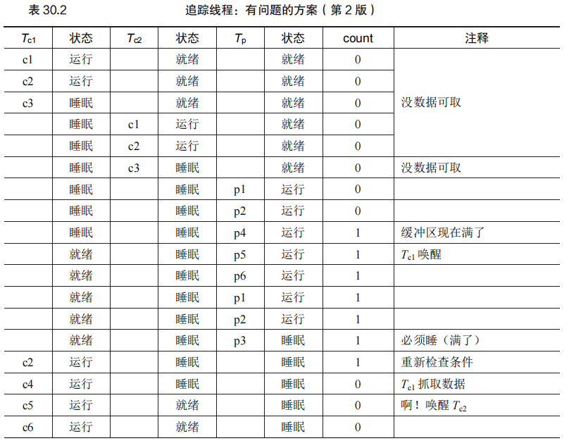
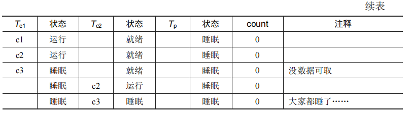
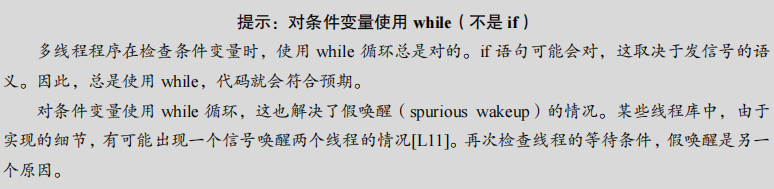

# 第 30 章 条件变量 - 总结

​		在并发编程中，锁的作用是为了确保临界区的代码在多线程环境下能够正确执行。然而，仅仅依赖锁并不能解决所有的并发问题。在线程之间的协作中，常常需要一种机制，让线程能够在某个条件满足之前进入休眠状态，而不是无休止地自旋等待。这种机制就是条件变量。

**条件变量的基本概念**

​		条件变量允许一个线程等待特定的条件成立（如某个共享变量的值发生变化），并且能够高效地将线程置于等待状态。通过使用条件变量，线程可以避免使用 CPU 时间来反复检查条件是否满足，显著提升程序的效率。

**示例代码说明**

​		在这一章的开头，举了一个简单的例子来说明问题。父线程创建了一个子线程，并希望等待子线程执行完毕再继续运行。代码如下：

```c
void *child(void *arg) { 
    printf("child\n"); 
    // XXX how to indicate we are done? 
    return NULL; 
}

int main(int argc, char *argv[]) { 
    printf("parent: begin\n"); 
    pthread_t c; 
    Pthread_create(&c, NULL, child, NULL); // create child 
    // XXX how to wait for child? 
    printf("parent: end\n"); 
    return 0; 
}
```

​		理想情况下，输出应该是：

```shell
parent: begin 
child 
parent: end 
```

​		然而，如果我们尝试使用简单的共享变量来实现同步，如下所示：

```c
volatile int done = 0; 

void *child(void *arg) { 
    printf("child\n"); 
    done = 1; 
    return NULL; 
}

int main(int argc, char *argv[]) { 
    printf("parent: begin\n"); 
    pthread_t c; 
    Pthread_create(&c, NULL, child, NULL); // create child 
    while (done == 0) 
        ; // spin 
    printf("parent: end\n"); 
    return 0; 
}
```

​		这个方案虽然能够工作，但它的效率非常低，因为父线程会不断自旋等待子线程的完成，这种方式浪费了大量的 CPU 时间。理想的解决方案应该是让父线程在条件未满足时进入休眠状态，直到子线程完成工作后再唤醒父线程继续执行。

#### **关键问题**

**这里提出了一个关键问题：如何让线程高效地等待一个条件的满足？简单的自旋方案不仅低效，在某些情况下甚至可能导致更严重的性能问题。因此，我们需要更优雅的解决方案，即条件变量。条件变量通过 `pthread_cond_wait()` 和 `pthread_cond_signal()` 等机制，实现了线程在等待条件满足时的高效同步，避免了不必要的 CPU 开销。**


在接下来的内容中，将会详细介绍条件变量的使用方法及其在各种并发场景中的应用，以帮助开发者更好地理解并应用这种重要的同步原语。


### 原文：

​		到目前为止，我们已经形成了锁的概念，看到了如何通过硬件和操作系统支持的正确组合来实现锁。然而，锁并不是并发程序设计所需的唯一原语。

​		具体来说，在很多情况下，线程需要检查某一条件（condition）满足之后，才会继续运行。例如，父线程需要检查子线程是否执行完毕 [这常被称为 join()]。这种等待如何实现呢？我们来看如图 30.1 所示的代码。

​		以下是图 30.1 中父线程等待子线程的代码，并附加详细的解释注释。这段代码展示了如何使用 `pthread_create` 创建子线程，并使用 `pthread_join` 让父线程等待子线程完成。

```C
#include <stdio.h>
#include <pthread.h>

// 子线程执行的函数
void *child(void *arg) {
    printf("child\n");  // 子线程输出信息
    // 使用 return NULL 表示子线程执行完毕
    return NULL;
}

int main(int argc, char *argv[]) {
    printf("parent: begin\n");   // 父线程开始
    pthread_t c;                 // 定义一个线程变量
    pthread_create(&c, NULL, child, NULL); // 创建子线程，执行 child 函数
    
    // 使用 pthread_join 等待子线程完成
    pthread_join(c, NULL); // 等待子线程 c 完成，阻塞父线程直到子线程结束

    printf("parent: end\n");     // 父线程结束
    return 0;                    // 程序正常结束
}
```

### **解释说明：**

1. **创建子线程 `pthread_create`：**

   - 使用 `pthread_create` 函数创建一个子线程。
   - 参数说明：
     - 第一个参数 `&c`：指向线程 ID 的指针，用于存储新创建的线程 ID。
     - 第二个参数 `NULL`：线程属性，使用默认属性。
     - 第三个参数 `child`：子线程的启动函数，子线程将执行这个函数。
     - 第四个参数 `NULL`：传递给子线程函数的参数，这里为 `NULL`。

2. **等待子线程完成 `pthread_join`：**

   - 使用 `pthread_join` 函数等待子线程完成。
   - 参数说明：
     - 第一个参数 `c`：子线程的 ID。
     - 第二个参数 `NULL`：用于接收子线程的返回值，这里不需要接收任何返回值，所以为 `NULL`。
   - `pthread_join` 会阻塞父线程，直到子线程执行完毕。这是确保父线程在子线程完成后再继续执行的标准方法。

3. **输出顺序：**

   - 在没有使用 `pthread_join` 的情况下，父线程和子线程是并发执行的，输出顺序可能不确定。

   - 使用 

     ```
     pthread_join
     ```

      后，父线程将等待子线程完成，因此输出顺序为：

     - `parent: begin`
     - `child`
     - `parent: end`

### **总结：**

- **线程同步：** `pthread_join` 用于同步父子线程，确保父线程在子线程完成后再继续执行。
- **资源管理：** `pthread_join` 还可以用于回收子线程的资源，避免内存泄漏。
- **并发控制：** 通过 `pthread_create` 和 `pthread_join` 可以实现简单的线程并发和同步机制，适合于基本的多线程编程。


我们期望能看到这样的输出:

```shell
parent: begin 
child 
parent: end
```

​		我们可以尝试用一个共享变量，如图 30.2 所示。这种解决方案一般能工作，但是效率低下，因为主线程会自旋检查，浪费 CPU 时间。我们希望有某种方式让父线程休眠，直到等待的条件满足（即子线程完成执行）

​		以下是图 30.2 中父线程等待子线程的基于自旋的方案的代码，并附加详细的解释注释。这种实现使用一个 `volatile` 变量来同步父线程和子线程，通过自旋等待的方式让父线程等待子线程完成。

```C
#include <stdio.h>
#include <pthread.h>

// 使用 volatile 修饰 done 变量，表示该变量可能会被多个线程修改
volatile int done = 0; // 初始值为 0，表示子线程尚未完成

// 子线程执行的函数
void *child(void *arg) {
    printf("child\n");  // 子线程输出信息
    done = 1;           // 子线程完成后将 done 设置为 1
    return NULL;
}

int main(int argc, char *argv[]) {
    printf("parent: begin\n");   // 父线程开始
    pthread_t c;                 // 定义一个线程变量
    pthread_create(&c, NULL, child, NULL); // 创建子线程，执行 child 函数

    // 自旋等待子线程完成，通过检查 done 变量的值
    while (done == 0)
        ; // 自旋等待，什么也不做，直到 done 变为 1

    printf("parent: end\n");     // 父线程结束
    return 0;                    // 程序正常结束
}
```

#### **解释说明：**

1. **`volatile` 关键字：**
   - 使用 `volatile` 修饰 `done` 变量，表示该变量可能会被多个线程修改，防止编译器对其进行优化。
   - `volatile` 告诉编译器每次访问 `done` 时都要从内存中读取，而不是使用寄存器缓存的值。
2. **子线程函数 `child`：**
   - 在子线程中输出 `"child"`。
   - 将 `done` 变量设置为 `1`，表示子线程已完成。
3. **父线程自旋等待：**
   - 父线程在进入自旋等待循环前输出 `"parent: begin"`。
   - 使用一个 `while (done == 0)` 循环来自旋等待子线程完成，即在 `done` 变为 `1` 之前，父线程不断检查 `done` 的值。
   - 自旋等待是一个高 CPU 使用率的操作，因为父线程一直在忙等待（忙轮询），直到条件满足。
4. **输出顺序：**
   - 子线程和父线程的执行是并发的，由于父线程在自旋等待子线程完成，因此输出顺序是：
     - `parent: begin`
     - `child`
     - `parent: end`

#### **关键点：**

- **自旋等待的缺点：**
  - 自旋等待会导致高 CPU 占用，因为父线程在不断轮询 `done` 的值。
  - 在多核系统上，自旋等待可能更快地检测到状态变化，但仍然是资源密集型操作。
- **`volatile` 的作用：**
  - 确保每次读取 `done` 的值时都从内存中获取最新的值，而不是从寄存器或缓存中获取。
  - 这避免了由于编译器优化导致的多线程同步问题。
- **适用场景：**
  - 自旋等待适用于短时间的等待场景，如果等待时间长或者系统负载高，应该使用更高效的同步机制，如 `pthread_join` 或条件变量。

#### **总结：**

- **线程同步：** 使用 `volatile` 变量和自旋等待实现父线程等待子线程完成。
- **性能考虑：** 自旋等待虽然实现简单，但会浪费大量 CPU 资源，不推荐在实际应用中使用。
- **改进建议：** 对于更复杂的场景，建议使用 `pthread_join`、条件变量等更高效的同步机制。




## 第 30.1 节 定义和程序

​		条件变量（condition variable）是一种用于线程同步的机制，允许线程在特定条件不满足时进入等待状态，直到该条件变为真。条件变量通常与互斥锁（mutex）配合使用，以确保线程在等待和发信号的过程中不会发生竞态条件。

#### 条件变量的定义和基本操作

在 POSIX 线程库中，条件变量通过 `pthread_cond_t` 类型声明，并通过 `pthread_cond_wait()` 和 `pthread_cond_signal()` 两个主要函数进行操作。

- `pthread_cond_wait(pthread_cond_t *c, pthread_mutex_t *m);`
  - 等待条件变量 `c` 满足。在调用此函数时，线程首先需要持有与之关联的互斥锁 `m`，并且在进入等待状态前会自动释放该锁。当线程被唤醒时，它将重新获取锁并继续执行。这种设计是为了避免在线程进入等待状态时可能产生的竞态条件。
- `pthread_cond_signal(pthread_cond_t *c);`
  - 唤醒一个正在等待条件变量 `c` 的线程。如果没有线程在等待，该信号将被忽略。因此，信号的发出需要在适当的条件下进行控制。

#### 通过条件变量实现线程同步

​		条件变量的一个典型应用场景是线程之间的同步，例如父线程等待子线程完成（也称为 `join` 操作）。在实现中，通过条件变量的 `wait()` 和 `signal()` 操作，父线程可以高效地等待子线程的完成，而不需要自旋等待，节省了 CPU 资源。

##### 示例代码分析

以下是一个简单的例子，展示了如何使用条件变量让父线程等待子线程完成：

```C
int done = 0; 
pthread_mutex_t m = PTHREAD_MUTEX_INITIALIZER; 
pthread_cond_t c = PTHREAD_COND_INITIALIZER; 

void thr_exit() { 
    Pthread_mutex_lock(&m); 
    done = 1; 
    Pthread_cond_signal(&c); 
    Pthread_mutex_unlock(&m); 
} 

void *child(void *arg) { 
    printf("child\n"); 
    thr_exit(); 
    return NULL; 
}

void thr_join() { 
    Pthread_mutex_lock(&m); 
    while (done == 0) 
        Pthread_cond_wait(&c, &m); 
    Pthread_mutex_unlock(&m); 
} 

int main(int argc, char *argv[]) { 
    printf("parent: begin\n"); 
    pthread_t p; 
    Pthread_create(&p, NULL, child, NULL); 
    thr_join(); 
    printf("parent: end\n"); 
    return 0; 
}
```

**工作原理：**

1. 父线程创建子线程并调用 `thr_join()` 进入等待状态。
2. 子线程执行完毕后调用 `thr_exit()`，设置 `done` 为 1，并通过 `pthread_cond_signal()` 发出信号唤醒父线程。
3. 父线程在收到信号后，从 `pthread_cond_wait()` 返回，重新获得互斥锁，并检查 `done` 的状态，确定子线程已完成，进而继续执行。

#### 注意事项

1. **变量状态的重要性**：在该例子中，变量 `done` 记录了子线程是否完成。如果没有这个变量，可能导致父线程在信号发出前进入等待，从而导致死锁。
2. **锁与信号的使用**：在发出信号和进入等待时，必须持有互斥锁。这不仅是条件变量工作的前提，也是为了防止竞态条件的发生。
3. **使用循环检查条件**：即使在逻辑上看似不必要，使用 `while` 而不是 `if` 来检查条件是一个良好的习惯，因为 `pthread_cond_wait()` 可能会意外返回，循环检查确保了条件的再次验证。

通过这个示例，我们看到了条件变量在线程同步中的基本使用方法和注意事项。在接下来的内容中，将进一步探讨条件变量在更复杂的并发场景中的应用。


### 原文：

​		==线程可以使用条件变量（condition variable），来等待一个条件变成真==。条件变量是一个**显式队列**，==当某些执行状态（即条件，condition）不满足时，线程可以把自己加入队列，等待（waiting）该条件。==另外某个线程，当它改变了上述状态时，就可以唤醒一个或者多个等待线程（通过在该条件上发信号），让它们继续执行。Dijkstra 最早在“私有信号量”[D01]中提出这种思想。Hoare 后来在关于观察者的工作中，将类似的思想称为条件变量[H74]。

​		要声明这样的条件变量，只要像这样写：**pthread_cond_t c;，这里声明 c 是一个条件变量**（注意：还需要适当的初始化）。**条件变量有两种相关操作：wait()和 signal()**。线程要睡眠的时候，调用 wait()。当线程想唤醒等待在某个条件变量上的睡眠线程时，调用 signal()。具体来说，POSIX 调用如图 30.3 所示。

​		以下是图 30.3 中使用条件变量实现的父线程等待子线程的代码，并附加详细的解释注释。这种实现使用条件变量 `pthread_cond_t` 来同步父线程和子线程，从而避免了自旋等待的高 CPU 使用问题。

```C
#include <stdio.h>
#include <pthread.h>

int done = 0; // 全局变量，表示子线程是否已完成
pthread_mutex_t m = PTHREAD_MUTEX_INITIALIZER; // 互斥锁，用于保护 done 变量
pthread_cond_t c = PTHREAD_COND_INITIALIZER;  // 条件变量，用于线程间的同步

// 子线程退出函数，通知主线程子线程已完成
void thr_exit() {
    pthread_mutex_lock(&m);   // 获取互斥锁
    done = 1;                 // 设置 done 为 1，表示子线程已完成
    pthread_cond_signal(&c);  // 发出条件信号，通知等待的线程
    pthread_mutex_unlock(&m); // 释放互斥锁
}

// 子线程执行的函数
void *child(void *arg) {
    printf("child\n");  // 子线程输出信息
    thr_exit();         // 子线程完成时调用 thr_exit，通知主线程
    return NULL;
}

// 主线程等待子线程完成的函数
void thr_join() {
    pthread_mutex_lock(&m);   // 获取互斥锁
    while (done == 0)         // 当 done 为 0 时，表示子线程尚未完成
        pthread_cond_wait(&c, &m); // 等待条件变量 c，被唤醒后继续检查 done
    pthread_mutex_unlock(&m); // 释放互斥锁
}

int main(int argc, char *argv[]) {
    printf("parent: begin\n");  // 父线程开始
    pthread_t p;                // 定义一个线程变量
    pthread_create(&p, NULL, child, NULL); // 创建子线程，执行 child 函数

    thr_join(); // 等待子线程完成

    printf("parent: end\n");    // 父线程结束
    return 0;                   // 程序正常结束
}
```

#### **解释说明：**

1. **互斥锁 `pthread_mutex_t` 和条件变量 `pthread_cond_t`：**
   - `m` 是一个互斥锁，用于保护共享变量 `done` 的修改，确保多个线程不会同时访问 `done`。
   - `c` 是一个条件变量，用于在线程之间进行同步，当子线程完成后，使用条件变量通知主线程。
2. **子线程退出函数 `thr_exit`：**
   - 获取互斥锁 `m`，将 `done` 变量设置为 `1` 表示子线程完成。
   - 使用 `pthread_cond_signal(&c)` 向等待该条件的线程（主线程）发出信号，通知它子线程已完成。
   - 释放互斥锁 `m`。
3. **子线程函数 `child`：**
   - 子线程输出 `"child"`。
   - 调用 `thr_exit`，设置 `done` 并发出条件信号。
4. **父线程等待函数 `thr_join`：**
   - 获取互斥锁 `m`。
   - 使用 `while (done == 0)` 循环检查 `done` 的状态。
   - 当 `done` 为 0 时，调用 `pthread_cond_wait(&c, &m)` 进入等待状态，直到子线程发出条件信号。
   - 当收到条件信号后，`pthread_cond_wait` 释放锁并重新获取锁后继续检查 `done`。
   - 释放互斥锁 `m`。
5. **主函数 `main`：**
   - 主线程输出 `"parent: begin"`。
   - 创建子线程，并调用 `thr_join` 等待子线程完成。
   - 子线程完成后，主线程输出 `"parent: end"`。

#### **关键点：**

- **条件变量的使用：**
  - 条件变量用于线程间的信号通信，可以高效地阻塞和唤醒线程，避免了自旋等待的高 CPU 使用问题。
  - `pthread_cond_wait(&c, &m)` 在等待时自动释放互斥锁，当被唤醒后重新获取互斥锁继续执行。
- **互斥锁的作用：**
  - 互斥锁 `m` 用于确保 `done` 变量的读写操作是原子的，防止多个线程同时修改 `done` 导致的竞态条件。
- **线程同步：**
  - 通过条件变量和互斥锁的组合，实现了父线程对子线程完成状态的同步等待，是一种高效且可扩展的线程同步机制。

#### **总结：**

- **高效的线程同步：** 通过条件变量避免了自旋等待带来的 CPU 资源浪费，是一种更优的线程同步方式。
- **代码清晰易理解：** 使用条件变量和互斥锁的组合使得代码逻辑简单且易于维护。
- **适用场景广泛：** 条件变量适用于多线程编程中各种需要等待条件的场景，不仅限于父子线程同步。

​		

​		我们常简称为 wait()和 signal()。==你可能注意到一点，wait()调用有一个参数，它是互斥量。它假定在 wait()调用时，这个互斥量是已上锁状态。wait()的职责是释放锁，并让调用线程休眠（原子地）。当线程被唤醒时（在另外某个线程发信号给它后），它必须重新获取锁，再返回调用者。这样复杂的步骤也是为了避免在线程陷入休眠时，产生一些竞态条件。==我们观察一下图 30.3 中 join 问题的解决方法，以加深理解。

​		有两种情况需要考虑。==第一种情况是父线程创建出子线程，但自己继续运行（假设只有一个处理器），然后马上调用 thr_join()等待子线程。==在这种情况下，它会先获取锁，检查子进程是否完成（还没有完成），然后调用 wait()，让自己休眠。子线程最终得以运行，打印出“child”，并调用 thr_exit()函数唤醒父进程，这段代码会在获得锁后设置状态变量 done，然后向父线程发信号唤醒它。最后，父线程会运行（从 wait()调用返回并持有锁），释放锁，打印出“parent:end”。

​		==第二种情况是，子线程在创建后，立刻运行，设置变量 done 为 1，调用 signal 函数唤醒其他线程（这里没有其他线程），然后结束。父线程运行后，调用 thr_join()时，发现 done已经是 1 了，就直接返回。==

​		最后一点说明：你可能看到父线程使用了一个 while 循环，而不是 if 语句来判断是否需要等待。==虽然从逻辑上来说没有必要使用循环语句，但这样做总是好的（后面我们会加以说明）。==

​		为了确保理解 thr_exit()和 thr_join()中每个部分的重要性，我们来看一些其他的实现。首先，你可能会怀疑状态变量 done 是否需要。代码像下面这样如何？正确吗？

​		这段代码展示了两个函数：`thr_exit` 和 `thr_join`，它们使用条件变量和互斥锁实现线程间的同步。以下是代码和详细的解释注释：

```C
#include <pthread.h>
#include <stdio.h>

pthread_mutex_t m = PTHREAD_MUTEX_INITIALIZER; // 初始化互斥锁
pthread_cond_t c = PTHREAD_COND_INITIALIZER;   // 初始化条件变量

// thr_exit 函数用于通知其他线程
void thr_exit() {
    pthread_mutex_lock(&m);        // 获取互斥锁
    pthread_cond_signal(&c);       // 发出条件信号，通知等待的线程
    pthread_mutex_unlock(&m);      // 释放互斥锁
}

// thr_join 函数用于等待通知
void thr_join() {
    pthread_mutex_lock(&m);        // 获取互斥锁
    pthread_cond_wait(&c, &m);     // 等待条件变量的信号，同时释放互斥锁并进入等待状态
                                   // 被唤醒后，重新获取互斥锁继续执行
    pthread_mutex_unlock(&m);      // 释放互斥锁
}

int main() {
    // 示例的简单主函数，可根据需要调用 thr_exit 和 thr_join 来测试功能
    return 0;
}
```

#### **解释说明：**

1. **互斥锁 `pthread_mutex_t m` 和条件变量 `pthread_cond_t c`：**

   - 互斥锁 `m` 用于保护共享资源，确保对条件变量的操作（如信号发送和等待）是线程安全的。
   - 条件变量 `c` 用于线程之间的同步，使一个线程可以等待另一个线程的信号。

2. **`thr_exit` 函数：**

   - `pthread_mutex_lock(&m)`：获取互斥锁，以保护对条件变量的操作。
   - `pthread_cond_signal(&c)`：发送条件信号 `c`，通知所有等待该信号的线程至少有一个可以继续执行。
   - `pthread_mutex_unlock(&m)`：释放互斥锁，让其他线程可以获取锁。

3. **`thr_join` 函数：**

   - `pthread_mutex_lock(&m)`：获取互斥锁，以保护对条件变量的操作。

   - ```
     pthread_cond_wait(&c, &m)
     ```

     - 等待条件变量 `c` 的信号，同时自动释放互斥锁 `m` 并进入等待状态。
     - 当被其他线程发出的信号唤醒时，`pthread_cond_wait` 重新获取互斥锁 `m` 并继续执行。

   - `pthread_mutex_unlock(&m)`：释放互斥锁，让其他线程可以继续。

#### **关键点：**

- **条件变量的使用：**
  - `pthread_cond_signal(&c)` 用于通知一个等待该条件的线程继续执行。
  - `pthread_cond_wait(&c, &m)` 在等待信号时自动释放互斥锁，并在被唤醒后重新获取锁。
- **线程同步：**
  - 通过条件变量和互斥锁的组合，实现了线程间的高效同步，使得一个线程能够等待另一个线程的信号。
- **适用场景：**
  - 这类同步机制广泛用于多线程编程中需要等待某种条件发生的场景，比如线程间的协调、资源管理等。

#### **总结：**

- **高效的同步机制：** 使用条件变量和互斥锁组合可以避免忙等待，节省 CPU 资源。
- **简单易用：** 条件变量的使用使得线程同步的代码逻辑清晰易懂，易于维护。
- **线程安全：** 互斥锁的使用保证了对共享资源和条件变量的访问是线程安全的。

​	

​		这段代码是有问题的。==假设子线程立刻运行，并且调用 thr_exit()。在这种情况下，子线程发送信号，但此时却没有在条件变量上睡眠等待的线程。父线程运行时，就会调用 wait并卡在那里，没有其他线程会唤醒它。==通过这个例子，**你应该认识到变量 done 的重要性，它记录了线程有兴趣知道的值**。睡眠、唤醒和锁都离不开它。下面是另一个糟糕的实现。在这个例子中，我们假设线程在发信号和等待时都不加锁。会发生什么问题？想想看！

```C
void thr_exit() { 
    done = 1; 
    pthread_cond_signal(&c); 
} 

void thr_join() { 
    if (done == 0) 
        pthread_cond_wait(&c, &m); 
}
```

​		这段代码展示了 `thr_exit` 和 `thr_join` 函数的实现，用于使用条件变量实现线程同步。然而，这段代码中存在一些问题，主要是缺少对互斥锁的使用，这会导致多个线程对共享变量 `done` 和条件变量 `c` 的操作不是线程安全的。以下是改进后的代码和详细的解释注释。

```C
#include <pthread.h>
#include <stdio.h>

int done = 0; // 全局变量，表示线程是否已完成
pthread_mutex_t m = PTHREAD_MUTEX_INITIALIZER; // 初始化互斥锁
pthread_cond_t c = PTHREAD_COND_INITIALIZER;   // 初始化条件变量

// thr_exit 函数，用于通知其他线程子线程已完成
void thr_exit() {
    pthread_mutex_lock(&m);        // 获取互斥锁
    done = 1;                      // 设置 done 为 1，表示子线程已完成
    pthread_cond_signal(&c);       // 发出条件信号，通知等待的线程
    pthread_mutex_unlock(&m);      // 释放互斥锁
}

// thr_join 函数，用于等待子线程完成
void thr_join() {
    pthread_mutex_lock(&m);        // 获取互斥锁
    if (done == 0)                 // 检查 done 是否为 0，表示子线程尚未完成
        pthread_cond_wait(&c, &m); // 等待条件变量的信号，同时释放互斥锁并进入等待状态
                                   // 被唤醒后重新获取互斥锁继续执行
    pthread_mutex_unlock(&m);      // 释放互斥锁
}

int main() {
    // 示例的简单主函数，可根据需要调用 thr_exit 和 thr_join 来测试功能
    return 0;
}
```

#### **解释说明：**

1. **互斥锁 `pthread_mutex_t m` 和条件变量 `pthread_cond_t c`：**
   - 互斥锁 `m` 用于保护共享变量 `done` 的读写操作，确保多个线程之间的同步。
   - 条件变量 `c` 用于线程之间的同步，使得一个线程可以等待另一个线程的信号。
2. **`thr_exit` 函数：**
   - 使用 `pthread_mutex_lock(&m)` 获取互斥锁，确保对共享变量 `done` 和条件变量 `c` 的操作是线程安全的。
   - 将 `done` 设置为 `1`，表示子线程已完成。
   - 调用 `pthread_cond_signal(&c)` 发出条件信号，通知等待的线程（即主线程）子线程已完成。
   - 使用 `pthread_mutex_unlock(&m)` 释放互斥锁。
3. **`thr_join` 函数：**
   - 使用 `pthread_mutex_lock(&m)` 获取互斥锁，保护对共享变量 `done` 的检查和条件变量 `c` 的操作。
   - 检查 `done` 是否为 `0`，如果为 `0`，表示子线程尚未完成，需要进入等待状态。
   - 调用 `pthread_cond_wait(&c, &m)` 等待条件变量 `c` 的信号，并自动释放互斥锁 `m`。
   - 被唤醒后重新获取互斥锁，并继续执行后续代码。
   - 使用 `pthread_mutex_unlock(&m)` 释放互斥锁。

#### **关键点：**

- **互斥锁的必要性：**
  - 互斥锁用于确保对共享变量 `done` 和条件变量的操作是线程安全的，防止竞态条件的发生。
  - 在对共享变量或条件变量进行任何操作前，都需要先获取互斥锁。
- **条件变量的作用：**
  - 条件变量用于线程之间的信号同步，使得一个线程可以等待另一个线程的完成状态。
  - `pthread_cond_wait(&c, &m)` 函数在等待信号时自动释放互斥锁，避免了死锁的风险。
- **代码逻辑改进：**
  - 原代码中缺少对互斥锁的使用，可能导致多个线程同时修改或访问 `done` 变量，产生竞态条件。
  - 改进后的代码确保在修改或检查共享状态时正确使用互斥锁，保证线程安全。

#### **总结：**

- **线程同步：** 使用互斥锁和条件变量的组合实现了线程间的同步等待，避免了自旋等待。
- **线程安全：** 正确的互斥锁使用确保了共享变量的访问是线程安全的，避免了竞态条件。
- **代码清晰：** 改进后的代码逻辑清晰，易于理解和维护，适合在多线程环境中使用。


​		这里的问题是一个微妙的竞态条件。具体来说，如果父进程调用 thr_join()，然后检查完done 的值为 0，然后试图睡眠。但在调用 wait 进入睡眠之前，父进程被中断。子线程修改变量 done 为 1，发出信号，同样没有等待线程。父线程再次运行时，就会长眠不醒，这就惨了。



希望通过这个简单的 join 示例，你可以看到使用条件变量的一些基本要求。为了确保你能理解，我们现在来看一个更复杂的例子：生产者/消费者（producer/consumer）或有界缓冲区（bounded-buffer）问题。


## 第 30.2 节 生产者/消费者（有界缓冲区）问题

​		==生产者/消费者问题，也被称为有界缓冲区问题，是经典的多线程同步问题。它涉及多个生产者线程将数据放入缓冲区，和多个消费者线程从缓冲区中取出数据。==此问题的关键在于如何在生产者和消费者之间进行正确的同步，确保不会出现缓冲区溢出或空取数据的错误。

#### 基本缓冲区实现

​		我们首先定义了一个简单的缓冲区及其相关的 `put()` 和 `get()` 函数。这些函数的作用分别是将数据存入缓冲区和从缓冲区中取出数据。最初的实现假设缓冲区仅能存储一个整数，并且通过一个 `count` 变量来指示缓冲区是空还是满。

```C
int buffer;
int count = 0; // initially, empty

void put(int value) {
    assert(count == 0);
    count = 1;
    buffer = value;
}

int get() {
    assert(count == 1);
    count = 0;
    return buffer;
}
```

#### 初始的生产者和消费者线程

​		简单的生产者和消费者线程分别负责将整数放入缓冲区和从缓冲区取出数据。在最初的实现中，生产者和消费者没有进行同步，这样的设计在并发环境下是有问题的。

```C
void *producer(void *arg) {
    int i;
    int loops = (int) arg;
    for (i = 0; i < loops; i++) {
        put(i);
    }
}

void *consumer(void *arg) {
    int i;
    while (1) {
        int tmp = get();
        printf("%d\n", tmp);
    }
}
```

#### 问题与初步解决方案

直接使用上述代码会出现竞态条件，尤其是在多个生产者或消费者线程同时操作时。==因此，引入了条件变量和互斥锁来控制对缓冲区的访问，确保同步。==

```C
cond_t cond;
mutex_t mutex;

void *producer(void *arg) {
    int i;
    for (i = 0; i < loops; i++) {
        Pthread_mutex_lock(&mutex);
        if (count == 1)
            Pthread_cond_wait(&cond, &mutex);
        put(i);
        Pthread_cond_signal(&cond);
        Pthread_mutex_unlock(&mutex);
    }
}

void *consumer(void *arg) {
    int i;
    for (i = 0; i < loops; i++) {
        Pthread_mutex_lock(&mutex);
        if (count == 0)
            Pthread_cond_wait(&cond, &mutex);
        int tmp = get();
        Pthread_cond_signal(&cond);
        Pthread_mutex_unlock(&mutex);
        printf("%d\n", tmp);
    }
}
```

#### 关键问题与改进

上述初步解决方案存在两个主要问题：

1. **if 语句的使用**：如果使用 `if` 语句来检查条件，可能导致在条件变化后多个线程争抢资源，导致资源状态不一致。因此，应该将 `if` 替换为 `while` 循环，以确保条件在被唤醒后重新检查。
2. **单个条件变量的问题**：使用单个条件变量可能导致错误的线程被唤醒，从而导致系统进入死锁状态。为了解决这个问题，使用了两个条件变量，`empty` 和 `fill`，分别用于表示缓冲区的空和满状态。

改进后的代码如下：

```C
cond_t empty, fill;
mutex_t mutex;

void *producer(void *arg) {
    int i;
    for (i = 0; i < loops; i++) {
        Pthread_mutex_lock(&mutex);
        while (count == 1)
            Pthread_cond_wait(&empty, &mutex);
        put(i);
        Pthread_cond_signal(&fill);
        Pthread_mutex_unlock(&mutex);
    }
}

void *consumer(void *arg) {
    int i;
    for (i = 0; i < loops; i++) {
        Pthread_mutex_lock(&mutex);
        while (count == 0)
            Pthread_cond_wait(&fill, &mutex);
        int tmp = get();
        Pthread_cond_signal(&empty);
        Pthread_mutex_unlock(&mutex);
        printf("%d\n", tmp);
    }
}
```

#### 最终有效方案

为提高并发和效率，最后的解决方案引入了一个大小为 `MAX` 的缓冲区，使得生产者和消费者可以在一个更大的范围内并发操作。这不仅减少了上下文切换的频率，还增加了系统的整体并发性能。

```C
int buffer[MAX];
int fill = 0;
int use = 0;
int count = 0;

void put(int value) {
    buffer[fill] = value;
    fill = (fill + 1) % MAX;
    count++;
}

int get() {
    int tmp = buffer[use];
    use = (use + 1) % MAX;
    count--;
    return tmp;
}
```

通过以上改进，我们成功地解决了生产者/消费者问题，达到了更高的并发性和效率。

**提示**：在处理条件变量时，使用 `while` 循环来检查条件是一个良好的编程实践，可以避免假唤醒和其他竞态条件带来的问题。


### 原文：

​		本章要面对的下一个问题，是生产者/消费者（producer/consumer）问题，也叫作有界缓冲区（bounded buffer）问题。这一问题最早由 Dijkstra 提出[D72]。实际上也正是通过研究这一问题，Dijkstra 和他的同事发明了通用的信号量（它可用作锁或条件变量）[D01]。

​		假设有一个或多个生产者线程和一个或多个消费者线程。生产者把生成的数据项放入缓冲区；消费者从缓冲区取走数据项，以某种方式消费。

​		很多实际的系统中都会有这种场景。例如，在多线程的网络服务器中，一个生产者将HTTP 请求放入工作队列（即有界缓冲区），消费线程从队列中取走请求并处理。

​		我们在使用管道连接不同程序的输出和输入时，也会使用有界缓冲区，例如 grep foo file.txt | wc -l。这个例子并发执行了两个进程，grep 进程从 file.txt 中查找包括“foo”的行，写到标准输出；UNIX shell 把输出重定向到管道（通过 pipe 系统调用创建）。管道的另一端是 wc 进程的标准输入，wc 统计完行数后打印出结果。因此，grep 进程是生产者，wc 是进程是消费者，它们之间是内核中的有界缓冲区，而你在这个例子里只是一个开心的用户。

​		因为有界缓冲区是共享资源，所以我们必须通过同步机制来访问它，以免①产生竞态条件。为了更好地理解这个问题，我们来看一些实际的代码。

​		首先需要一个共享缓冲区，让生产者放入数据，消费者取出数据。简单起见，我们就拿一个整数来做缓冲区（你当然可以想到用一个指向数据结构的指针来代替），两个内部函数将值放入缓冲区，从缓冲区取值。图 30.4 为相关代码。

​		以下是图 30.4 中的 `put` 和 `get` 函数的第 1 版代码。这些函数实现了一个简单的单值缓冲区，使用 `count` 变量来控制缓冲区是否为空或已满。

```C
#include <assert.h>

int buffer; 
int count = 0; // 初始时，缓冲区为空

void put(int value) { 
    assert(count == 0); // 确保缓冲区为空
    count = 1;          // 设置缓冲区为已满
    buffer = value;     // 将值放入缓冲区
}

int get() { 
    assert(count == 1); // 确保缓冲区已满
    count = 0;          // 设置缓冲区为空
    return buffer;      // 返回缓冲区中的值
}
```

#### 代码说明

- `int buffer;`：用于存储单个整数的缓冲区。
- `int count = 0;`：用于指示缓冲区的状态，`0` 表示空，`1` 表示满。

##### `put` 函数

- 将一个整数 `value` 放入缓冲区。
- 使用 `assert(count == 0)` 确保缓冲区在放入新值前是空的。
- 将 `count` 设置为 `1`，表示缓冲区已满。
- 将 `value` 存入 `buffer`。

##### `get` 函数

- 从缓冲区中获取一个整数。
- 使用 `assert(count == 1)` 确保缓冲区在取值前是满的。
- 将 `count` 设置为 `0`，表示缓冲区变为空。
- 返回缓冲区中的值。

#### 重要注意

- 这个实现是非线程安全的，因为没有使用任何同步机制来保护 `count` 和 `buffer`。
- 适合单线程的基本用例，不适用于多线程环境，需要进一步的锁机制或条件变量来确保正确性。

​		

​		很简单，不是吗？put()函数会假设缓冲区是空的，把一个值存在缓冲区，然后把 count设置为 1 表示缓冲区满了。get()函数刚好相反，把缓冲区清空后（即将 count 设置为 0），并返回该值。不用担心这个共享缓冲区只能存储一条数据，稍后我们会一般化，用队列保存更多数据项，这会比听起来更有趣。

​		现在我们需要编写一些函数，知道何时可以访问缓冲区，以便将数据放入缓冲区或从缓冲区取出数据。条件是显而易见的：仅在 count 为 0 时（即缓冲器为空时），才将数据放入缓冲器中。仅在计数为 1 时（即缓冲器已满时），才从缓冲器获得数据。如果我们编写同步代码，让生产者将数据放入已满的缓冲区，或消费者从空的数据获取数据，就做错了（在这段代码中，断言将触发）。

​		这项工作将由两种类型的线程完成，其中一类我们称之为生产者（producer）线程，另一类我们称之为消费者（consumer）线程。图 30.5 展示了一个生产者的代码，它将一个整数放入共享缓冲区 loops 次，以及一个消费者，它从该共享缓冲区中获取数据（永远不停），每次打印出从共享缓冲区中提取的数据项。

以下是图 30.5 中生产者和消费者线程的第 1 版代码。该代码展示了生产者/消费者模式的基本实现，其中生产者将数据放入缓冲区，消费者从缓冲区中读取数据。然而，这个实现没有同步机制，因此在多线程环境下是不安全的。

```C
#include <stdio.h>

void *producer(void *arg) { 
    int i; 
    int loops = (int) arg; // 生产者将执行的循环次数
    for (i = 0; i < loops; i++) { 
        put(i); // 将数据放入缓冲区
    }
    return NULL; // 返回 NULL 表示线程结束
}

void *consumer(void *arg) { 
    int i; 
    while (1) { 
        int tmp = get(); // 从缓冲区中获取数据
        printf("%d\n", tmp); // 输出获取的数据
    }
    return NULL; // 虽然无限循环中不会执行到，但保留返回语句
}
```

#### 代码说明

1. **生产者线程 (`producer`)：**
   - 接受一个参数 `arg`，表示要执行的循环次数。
   - 在每次循环中调用 `put(i)`，将数据 `i` 放入缓冲区。
2. **消费者线程 (`consumer`)：**
   - 无限循环地调用 `get()` 从缓冲区中获取数据。
   - 将获取到的数据打印到标准输出。

#### 关键点

- **无同步机制：**
  - 当前实现的生产者和消费者操作没有任何同步机制保护，这意味着多个线程之间对共享资源（缓冲区）的访问可能会发生冲突。
  - 例如，生产者可能在消费者获取数据前多次调用 `put`，导致缓冲区状态不一致；反之，消费者可能在生产者放入数据前调用 `get`，导致读取无效数据。
- **改进建议：**
  - 使用互斥锁（`pthread_mutex_t`）来保护对共享缓冲区的访问。
  - 使用条件变量（`pthread_cond_t`）来协调生产者和消费者之间的等待和通知。
  - 增加退出条件：当前消费者无限循环运行，可以增加退出条件或标志来优雅地结束消费者线程。
- **线程安全：**
  - 在多线程程序中，必须使用适当的同步机制来防止数据竞争和保证操作的原子性。
- **示例应用：**
  - 这种基本的生产者/消费者模型通常用于处理并发任务，如多线程服务器中的任务调度、日志处理等。


​		通过引入同步机制，可以确保生产者和消费者线程之间的协调，使得生产者不会在缓冲区已满时继续放入数据，消费者不会在缓冲区为空时试图获取数据。

#### 有问题的方案 

​		假设只有一个生产者和一个消费者。显然，put()和 get()函数之中会有临界区，因为 put()更新缓冲区，get()读取缓冲区。但是，给代码加锁没有用，我们还需别的东西。不奇怪，别的东西就是某些条件变量。在这个（有问题的）首次尝试中（见图 30.6），我们用了条件变量 cond 和相关的锁 mutex。

以下是图 30.6 中生产者/消费者模型的改进版代码。该版本引入了互斥锁和条件变量，使用 `if` 语句来协调生产者和消费者之间的同步。通过这些同步机制，确保生产者和消费者在操作共享缓冲区时不会发生冲突。

```C
#include <stdio.h>
#include <pthread.h>

pthread_cond_t cond = PTHREAD_COND_INITIALIZER; // 初始化条件变量
pthread_mutex_t mutex = PTHREAD_MUTEX_INITIALIZER; // 初始化互斥锁
int count = 0; // 表示缓冲区状态的计数器，0 表示空，1 表示满

void *producer(void *arg) { 
    int i; 
    int loops = *(int *)arg; // 获取循环次数
    for (i = 0; i < loops; i++) { 
        pthread_mutex_lock(&mutex); // p1: 获取互斥锁
        if (count == 1)             // p2: 检查缓冲区是否已满
            pthread_cond_wait(&cond, &mutex); // p3: 缓冲区已满，等待消费者消费
        
        put(i);                     // p4: 将数据放入缓冲区
        count = 1;                  // 更新缓冲区状态为满
        pthread_cond_signal(&cond); // p5: 通知消费者有数据可取
        pthread_mutex_unlock(&mutex); // p6: 释放互斥锁
    }
    return NULL;
}

void *consumer(void *arg) { 
    int i; 
    int loops = *(int *)arg; // 获取循环次数
    for (i = 0; i < loops; i++) { 
        pthread_mutex_lock(&mutex); // c1: 获取互斥锁
        if (count == 0)             // c2: 检查缓冲区是否为空
            pthread_cond_wait(&cond, &mutex); // c3: 缓冲区为空，等待生产者生产
        
        int tmp = get();            // c4: 从缓冲区获取数据
        count = 0;                  // 更新缓冲区状态为空
        pthread_cond_signal(&cond); // c5: 通知生产者可以生产
        pthread_mutex_unlock(&mutex); // c6: 释放互斥锁
        printf("%d\n", tmp);        // 输出获取的数据
    }
    return NULL;
}
```

#### **代码说明：**

1. **互斥锁 `mutex` 和条件变量 `cond`：**
   - 互斥锁 `mutex` 用于保护共享资源（如缓冲区和计数器 `count`），防止多个线程同时修改它们。
   - 条件变量 `cond` 用于生产者和消费者之间的同步，使得它们可以等待对方的操作完成。
2. **生产者线程 `producer`：**
   - 获取互斥锁后检查缓冲区状态，如果缓冲区已满（`count == 1`），则调用 `pthread_cond_wait` 等待消费者的信号。
   - `pthread_cond_wait` 会在等待时自动释放互斥锁，并在收到信号后重新获取互斥锁继续执行。
   - 当缓冲区有空间时，生产者将数据放入缓冲区，更新状态为满（`count = 1`），并通过 `pthread_cond_signal` 通知消费者。
3. **消费者线程 `consumer`：**
   - 获取互斥锁后检查缓冲区状态，如果缓冲区为空（`count == 0`），则调用 `pthread_cond_wait` 等待生产者的信号。
   - 消费者从缓冲区获取数据，更新状态为空（`count = 0`），并通过 `pthread_cond_signal` 通知生产者可以继续生产。
4. **同步机制：**
   - 使用互斥锁确保对共享变量的操作是线程安全的。
   - 使用条件变量实现生产者和消费者之间的等待和通知，避免自旋等待的高 CPU 使用。

#### **关键点：**

- **使用互斥锁保护共享资源：**
  - 所有对共享资源（缓冲区和 `count` 变量）的访问都被互斥锁保护，以防止数据竞争。
- **条件变量的同步作用：**
  - 条件变量 `cond` 用于在线程之间传递信号，使得线程可以在需要时等待其他线程的操作。
- **使用 `if` 语句检查条件：**
  - `if` 语句用于在每次操作前检查条件，但这可能导致“虚假唤醒”的问题。可以改进为使用 `while` 循环以确保在被唤醒时条件仍然满足。

#### **改进建议：**

- 使用 `while` 而不是 `if` 来检查条件，以防止虚假唤醒导致的逻辑错误。
- 检查 `pthread_cond_wait` 和 `pthread_mutex` 函数的返回值，确保线程同步正确无误。

#### **总结：**

- **线程同步：** 通过互斥锁和条件变量实现了生产者和消费者的同步，避免了竞争条件。
- **高效资源管理：** 使用条件变量避免了不必要的自旋等待，提高了程序的效率。
- **应用广泛：** 这种模式在多线程编程中非常常见，广泛用于生产者/消费者问题、任务调度等场景。

​		

​		来看看生产者和消费者之间的信号逻辑。当生产者想要填充缓冲区时，它等待缓冲区变空（p1～p3）。消费者具有完全相同的逻辑，但等待不同的条件——变满（c1～c3）。

​		当只有一个生产者和一个消费者时，图 30.6 中的代码能够正常运行。但如果有超过一个线程（例如两个消费者），这个方案会有两个严重的问题。哪两个问题？

​		……（暂停思考一下）……

​		我们来理解第一个问题，它与等待之前的 if 语句有关。假设有两个消费者（*T*c1 和 *T*c2），一个生产者（*T*p）。首先，一个消费者（*T*c1）先开始执行，它获得锁（c1），检查缓冲区是否可以消费（c2），然后等待（c3）（这会释放锁）。

​		接着生产者（*T*p）运行。它获取锁（p1），检查缓冲区是否满（p2），发现没满就给缓冲区加入一个数字（p4）。然后生产者发出信号，说缓冲区已满（p5）。关键的是，这让第一个消费者（*T*c1）不再睡在条件变量上，进入就绪队列。*T*c1 现在可以运行（但还未运行）。生产者继续执行，直到发现缓冲区满后睡眠（p6,p1-p3）。

​		这时问题发生了：另一个消费者（*T*c2）抢先执行，消费了缓冲区中的值（c1,c2,c4,c5,c6，跳过了 c3 的等待，因为缓冲区是满的）。现在假设 *T*c1 运行，在从 wait 返回之前，它获取了锁，然后返回。然后它调用了 get() (p4)，但缓冲区已无法消费！断言触发，代码不能像预期那样工作。显然，我们应该设法阻止 *T*c1 去消费，因为 *T*c2 插进来，消费了缓冲区中之前生产的一个值。表 30.1 展示了每个线程的动作，以及它的调度程序状态（就绪、运行、睡眠）随时间的变化。





​		问题产生的原因很简单：在 *T*c1 被生产者唤醒后，但在它运行之前，缓冲区的状态改变了（由于 *T*c2）。发信号给线程只是唤醒它们，暗示状态发生了变化（在这个例子中，就是值已被放入缓冲区），但并不会保证在它运行之前状态一直是期望的情况。信号的这种释义常称为 Mesa 语义（Mesa semantic），为了纪念以这种方式建立条件变量的首次研究[LR80]。另一种释义是 Hoare 语义（Hoare semantic），虽然实现难度大，但是会保证被唤醒线程立刻执行[H74]。实际上，几乎所有系统都采用了 Mesa 语义。

#### 较好但仍有问题的方案：使用 While 语句替代 If 

​		幸运的是，修复这个问题很简单（见图 30.7）：把 if 语句改为 while。当消费者 *T*c1 被唤醒后，立刻再次检查共享变量（c2）。如果缓冲区此时为空，消费者就会回去继续睡眠（c3）。生产者中相应的 if 也改为 while（p2）。

以下是图 30.7 中的生产者/消费者模型的代码，使用了一个条件变量和 `while` 语句来确保线程之间的同步。这种方式解决了使用 `if` 语句可能出现的虚假唤醒问题，从而保证线程同步的正确性。

```C
#include <stdio.h>
#include <pthread.h>

pthread_cond_t cond = PTHREAD_COND_INITIALIZER; // 初始化条件变量
pthread_mutex_t mutex = PTHREAD_MUTEX_INITIALIZER; // 初始化互斥锁
int count = 0; // 缓冲区状态，0 表示空，1 表示满
int loops; // 全局变量，表示生产者和消费者的循环次数

void *producer(void *arg) { 
    int i; 
    for (i = 0; i < loops; i++) { 
        pthread_mutex_lock(&mutex); // p1: 获取互斥锁
        while (count == 1)          // p2: 使用 while 循环检查缓冲区是否已满
            pthread_cond_wait(&cond, &mutex); // p3: 如果已满，等待消费者消费

        put(i);                     // p4: 将数据放入缓冲区
        count = 1;                  // 更新缓冲区状态为满
        pthread_cond_signal(&cond); // p5: 通知等待的消费者
        pthread_mutex_unlock(&mutex); // p6: 释放互斥锁
    }
    return NULL;
}

void *consumer(void *arg) { 
    int i; 
    for (i = 0; i < loops; i++) { 
        pthread_mutex_lock(&mutex); // c1: 获取互斥锁
        while (count == 0)          // c2: 使用 while 循环检查缓冲区是否为空
            pthread_cond_wait(&cond, &mutex); // c3: 如果为空，等待生产者生产

        int tmp = get();            // c4: 从缓冲区获取数据
        count = 0;                  // 更新缓冲区状态为空
        pthread_cond_signal(&cond); // c5: 通知等待的生产者
        pthread_mutex_unlock(&mutex); // c6: 释放互斥锁
        printf("%d\n", tmp);        // 输出获取的数据
    }
    return NULL;
}
```

#### **代码说明：**

1. **互斥锁 `mutex` 和条件变量 `cond`：**
   - 互斥锁 `mutex` 用于保护共享变量 `count`，防止多个线程同时修改缓冲区的状态。
   - 条件变量 `cond` 用于线程之间的同步，当缓冲区为空时通知生产者，当缓冲区满时通知消费者。
2. **生产者线程 `producer`：**
   - 使用 `pthread_mutex_lock(&mutex)` 获取互斥锁，确保对共享变量的访问是安全的。
   - 使用 `while (count == 1)` 循环检查缓冲区是否已满。如果缓冲区已满，调用 `pthread_cond_wait(&cond, &mutex)` 进入等待状态。
   - `pthread_cond_wait` 函数会在等待信号时自动释放互斥锁，并在收到信号后重新获取锁。
   - 当缓冲区有空间时，将数据放入缓冲区，更新状态为满（`count = 1`），并通过 `pthread_cond_signal(&cond)` 通知消费者可以消费数据。
   - 释放互斥锁。
3. **消费者线程 `consumer`：**
   - 使用 `pthread_mutex_lock(&mutex)` 获取互斥锁，确保对共享变量的访问是安全的。
   - 使用 `while (count == 0)` 循环检查缓冲区是否为空。如果缓冲区为空，调用 `pthread_cond_wait(&cond, &mutex)` 进入等待状态。
   - 当缓冲区有数据时，消费者从缓冲区获取数据，更新状态为空（`count = 0`），并通过 `pthread_cond_signal(&cond)` 通知生产者可以继续生产。
   - 释放互斥锁并输出获取的数据。

#### **关键点：**

- **使用 `while` 循环检查条件：**
  - 使用 `while` 循环代替 `if` 语句，防止虚假唤醒（即线程被错误地唤醒）后不满足条件而继续执行。
- **条件变量的同步作用：**
  - 条件变量用于在生产者和消费者之间传递信号，确保一个线程等待另一个线程完成操作。
- **互斥锁的作用：**
  - 互斥锁用于保护对共享变量的访问，确保线程之间的操作是原子的。

#### **总结：**

- **线程同步：** 通过互斥锁和条件变量组合，实现了生产者和消费者的同步，避免了竞态条件。

- **高效等待：** 使用条件变量避免了自旋等待，减少了 CPU 资源浪费。

- **适用场景广泛：** 这种模式广泛用于多线程编程中的任务调度、数据缓冲区管理等场景，提供了一种高效的线程同步方案。

  

​		由于 Mesa 语义，我们要记住一条关于条件变量的简单规则：总是使用 while 循环（always use while loop）。虽然有时候不需要重新检查条件，但这样做总是安全的，做了就开心了。

​		但是，这段代码仍然有一个问题，也是上文提到的两个问题之一。你能想到吗？它和我们只用了一个条件变量有关。尝试弄清楚这个问题是什么，再继续阅读。想一下！

​		……（暂停想一想，或者闭一下眼）……

​		我们来确认一下你想得对不对。假设两个消费者（*T*c1 和 *T*c2）先运行，都睡眠了（c3）。生产者开始运行，在缓冲区放入一个值，唤醒了一个消费者（假定是 *T*c1），并开始睡眠。现在是一个消费者马上要运行（*T*c1），两个线程（*T*c2 和 *T*p）都等待在同一个条件变量上。问题马上就要出现了：让人感到兴奋！

​		消费者 *T*c1 醒过来并从 wait()调用返回（c3），重新检查条件（c2），发现缓冲区是满的，消费了这个值（c4）。这个消费者然后在该条件上发信号（c5），唤醒一个在睡眠的线程。但是，应该唤醒哪个线程呢？

​		因为消费者已经清空了缓冲区，很显然，应该唤醒生产者。但是，如果它唤醒了 *T*c2（这绝对是可能的，取决于等待队列是如何管理的），问题就出现了。具体来说，消费者 *T*c2 会醒过来，发现队列为空（c2），又继续回去睡眠（c3）。生产者 *T*p 刚才在缓冲区中放了一个值，现在在睡眠。另一个消费者线程 *T*c1 也回去睡眠了。3 个线程都在睡眠，显然是一个缺陷。由表 30.2 可以看到这个可怕灾难的步骤。





​		信号显然需要，但必须更有指向性。消费者不应该唤醒消费者，而应该只唤醒生产者，反之亦然。

#### 单值缓冲区的生产者/消费者方案 

​		解决方案也很简单：使用两个条件变量，而不是一个，以便正确地发出信号，在系统状态改变时，哪类线程应该唤醒。图 30.8 展示了最终的代码。

​		以下是图 30.8 中的生产者/消费者模型的代码，使用了两个条件变量 (`empty` 和 `fill`) 和 `while` 语句来协调生产者和消费者之间的同步。这种实现能够更好地控制生产者和消费者对共享资源的访问，避免死锁和竞态条件。

```C
#include <stdio.h>
#include <pthread.h>

pthread_cond_t empty = PTHREAD_COND_INITIALIZER; // 用于通知生产者的条件变量，当缓冲区为空时使用
pthread_cond_t fill = PTHREAD_COND_INITIALIZER;  // 用于通知消费者的条件变量，当缓冲区有数据时使用
pthread_mutex_t mutex = PTHREAD_MUTEX_INITIALIZER; // 初始化互斥锁
int count = 0; // 缓冲区状态，0 表示空，1 表示满
int loops; // 全局变量，表示生产者和消费者的循环次数

void *producer(void *arg) { 
    int i; 
    for (i = 0; i < loops; i++) { 
        pthread_mutex_lock(&mutex);             // 获取互斥锁
        while (count == 1)                      // 如果缓冲区已满
            pthread_cond_wait(&empty, &mutex);  // 等待缓冲区变空
        
        put(i);                                 // 将数据放入缓冲区
        count = 1;                              // 更新缓冲区状态为满
        pthread_cond_signal(&fill);             // 通知消费者有数据可取
        pthread_mutex_unlock(&mutex);           // 释放互斥锁
    }
    return NULL;
}

void *consumer(void *arg) { 
    int i; 
    for (i = 0; i < loops; i++) { 
        pthread_mutex_lock(&mutex);             // 获取互斥锁
        while (count == 0)                      // 如果缓冲区为空
            pthread_cond_wait(&fill, &mutex);   // 等待缓冲区有数据
        
        int tmp = get();                        // 从缓冲区获取数据
        count = 0;                              // 更新缓冲区状态为空
        pthread_cond_signal(&empty);            // 通知生产者可以继续生产
        pthread_mutex_unlock(&mutex);           // 释放互斥锁
        printf("%d\n", tmp);                    // 输出获取的数据
    }
    return NULL;
}
```

#### **代码说明：**

1. **互斥锁 `mutex` 和两个条件变量 `empty` 和 `fill`：**
   - 互斥锁 `mutex` 用于保护对共享变量 `count` 的访问，防止多个线程同时修改它。
   - 条件变量 `empty` 用于通知生产者缓冲区为空时可以生产数据。
   - 条件变量 `fill` 用于通知消费者缓冲区有数据时可以消费数据。
2. **生产者线程 `producer`：**
   - 使用 `pthread_mutex_lock(&mutex)` 获取互斥锁，确保对共享变量的访问是安全的。
   - 使用 `while (count == 1)` 循环检查缓冲区是否已满。如果已满，调用 `pthread_cond_wait(&empty, &mutex)` 等待缓冲区变空的信号。
   - 当缓冲区有空间时，将数据放入缓冲区，更新状态为满（`count = 1`），并通过 `pthread_cond_signal(&fill)` 通知消费者。
   - 释放互斥锁。
3. **消费者线程 `consumer`：**
   - 使用 `pthread_mutex_lock(&mutex)` 获取互斥锁，确保对共享变量的访问是安全的。
   - 使用 `while (count == 0)` 循环检查缓冲区是否为空。如果为空，调用 `pthread_cond_wait(&fill, &mutex)` 等待缓冲区有数据的信号。
   - 当缓冲区有数据时，消费者从缓冲区获取数据，更新状态为空（`count = 0`），并通过 `pthread_cond_signal(&empty)` 通知生产者可以继续生产。
   - 释放互斥锁并输出获取的数据。

#### **关键点：**

- **使用两个条件变量：**
  - `empty` 用于生产者等待，当缓冲区为空时唤醒生产者。
  - `fill` 用于消费者等待，当缓冲区有数据时唤醒消费者。
- **同步机制的改进：**
  - 使用两个条件变量比单一条件变量更明确地控制生产者和消费者的执行顺序。
  - 使用 `while` 循环确保线程在被唤醒时检查条件，避免虚假唤醒带来的问题。
- **线程安全性：**
  - 互斥锁确保了对共享变量 `count` 的访问是原子的，避免了竞态条件。

#### **总结：**

- **高效的线程同步：** 通过两个条件变量和互斥锁的结合，实现了生产者和消费者的高效同步。
- **防止资源争用：** 使用 `while` 循环和条件变量组合，确保线程只有在满足条件时才进行操作，避免了不必要的等待。
- **实用性：** 这种生产者/消费者模式广泛应用于多线程编程中的数据缓冲区管理、任务队列处理等场景。

在上述代码中，生产者线程等待条件变量 empty，发信号给变量 fill。相应地，消费者线程等待 fill，发信号给 empty。这样做，从设计上避免了上述第二个问题：消费者再也不会唤醒消费者，生产者也不会唤醒生产者。


#### 最终的生产者/消费者方案 

​		我们现在有了可用的生产者/消费者方案，但不太通用。我们最后的修改是提高并发和效率。具体来说，增加更多缓冲区槽位，这样在睡眠之前，可以生产多个值。同样，睡眠之前可以消费多个值。单个生产者和消费者时，这种方案因为上下文切换少，提高了效率。多个生产者和消费者时，它甚至支持并发生产和消费，从而提高了并发。幸运的是，和现有方案相比，改动也很小。

​		第一处修改是缓冲区结构本身，以及对应的 put()和 get()方法（见图 30.9）。我们还稍稍修改了生产者和消费者的检查条件，以便决定是否要睡眠。图 30.10 展示了最终的等待和信号逻辑。生产者只有在缓冲区满了的时候才会睡眠（p2），消费者也只有在队列为空的时候睡眠（c2）。至此，我们解决了生产者/消费者问题。

以下是图 30.9 中最终版的 `put()` 和 `get()` 方法的代码。这些方法实现了一个环形缓冲区，用于生产者/消费者模型中多值缓冲的管理。

```C
#define MAX 10 // 定义缓冲区的最大容量

int buffer[MAX]; // 缓冲区数组，用于存储数据
int fill = 0;    // fill 指针，指向下一个要插入的位置
int use = 0;     // use 指针，指向下一个要取出的位置
int count = 0;   // 当前缓冲区中的元素数量

// put() 函数：将值放入缓冲区
void put(int value) { 
    buffer[fill] = value;           // 将值插入到 fill 指针指向的位置
    fill = (fill + 1) % MAX;        // 更新 fill 指针，环形移动
    count++;                        // 增加元素计数
}

// get() 函数：从缓冲区取出值
int get() { 
    int tmp = buffer[use];          // 从 use 指针指向的位置取出值
    use = (use + 1) % MAX;          // 更新 use 指针，环形移动
    count--;                        // 减少元素计数
    return tmp;                     // 返回取出的值
}
```

#### **代码说明：**

1. **环形缓冲区：**
   - 缓冲区的实现方式是环形的，通过 `fill` 和 `use` 指针来管理插入和取出的位置。
   - `fill` 指针表示下一个要插入的位置。
   - `use` 指针表示下一个要取出的位置。
   - 使用取模操作 `(index + 1) % MAX` 来实现环形效果，当指针到达数组末尾时会自动回到数组的起始位置。
2. **`put(int value)` 方法：**
   - 将数据插入到 `fill` 指针指向的缓冲区位置。
   - 更新 `fill` 指针位置，使其指向下一个插入点。
   - 增加 `count`，表示缓冲区中的数据量增加。
3. **`get()` 方法：**
   - 从 `use` 指针指向的缓冲区位置取出数据。
   - 更新 `use` 指针位置，使其指向下一个取出点。
   - 减少 `count`，表示缓冲区中的数据量减少。

#### **关键点：**

- **环形缓冲区设计：**
  - 使用环形缓冲区可以有效利用数组空间，实现连续的插入和取出操作而不需要移动数组中的数据。
  - 通过指针的移动和取模运算，确保在数组末尾之后继续从数组的开头开始操作。
- **计数变量 `count`：**
  - `count` 用于跟踪缓冲区中当前的元素数量。
  - 它帮助生产者和消费者判断何时缓冲区是满的或空的，从而进行相应的等待或通知。
- **生产者/消费者模型：**
  - 在多线程环境下，这种设计需要配合互斥锁和条件变量来实现线程安全的生产者/消费者模型。
  - 互斥锁保护对 `buffer`、`fill`、`use` 和 `count` 的访问，防止数据竞争。
  - 条件变量用于协调生产者和消费者的等待与唤醒操作。

#### **总结：**

- **高效的数据存取：** 环形缓冲区提供了高效的数据存取方式，避免了线性缓冲区可能带来的空间浪费。
- **简洁的操作逻辑：** 通过简单的指针操作和计数管理，实现了数据的有序插入和取出。
- **适用场景广泛：** 这种设计广泛应用于需要缓存临时数据的场景，如任务队列、数据流处理、日志管理等。


​		以下是图 30.8 的生产者/消费者模型的改进版代码，使用了两个条件变量 (`empty` 和 `fill`) 和 `while` 循环来协调生产者和消费者之间的同步。这种实现可以处理多元素缓冲区的情况，并且通过条件变量和互斥锁的组合来确保线程安全。

```C
#include <stdio.h>
#include <pthread.h>

#define MAX 10 // 缓冲区的最大容量

pthread_cond_t empty = PTHREAD_COND_INITIALIZER; // 条件变量，用于通知生产者缓冲区为空
pthread_cond_t fill = PTHREAD_COND_INITIALIZER;  // 条件变量，用于通知消费者缓冲区有数据
pthread_mutex_t mutex = PTHREAD_MUTEX_INITIALIZER; // 互斥锁，用于保护对共享资源的访问

int buffer[MAX]; // 环形缓冲区
int fill = 0;    // 下一个要插入的位置
int use = 0;     // 下一个要取出的位置
int count = 0;   // 当前缓冲区中的元素数量
int loops = 20;  // 生产者和消费者的循环次数，可以根据需要调整

// 将值放入缓冲区的函数
void put(int value) { 
    buffer[fill] = value;           // 将值插入到 fill 指针指向的位置
    fill = (fill + 1) % MAX;        // 更新 fill 指针，环形移动
    count++;                        // 增加元素计数
}

// 从缓冲区取出值的函数
int get() { 
    int tmp = buffer[use];          // 从 use 指针指向的位置取出值
    use = (use + 1) % MAX;          // 更新 use 指针，环形移动
    count--;                        // 减少元素计数
    return tmp;                     // 返回取出的值
}

// 生产者线程
void *producer(void *arg) { 
    int i; 
    for (i = 0; i < loops; i++) { 
        pthread_mutex_lock(&mutex);         // p1: 获取互斥锁
        while (count == MAX)                // p2: 如果缓冲区已满
            pthread_cond_wait(&empty, &mutex); // p3: 等待缓冲区有空位
        
        put(i);                             // p4: 将数据放入缓冲区
        pthread_cond_signal(&fill);         // p5: 通知消费者有数据可取
        pthread_mutex_unlock(&mutex);       // p6: 释放互斥锁
    }
    return NULL;
}

// 消费者线程
void *consumer(void *arg) { 
    int i; 
    for (i = 0; i < loops; i++) {
        pthread_mutex_lock(&mutex);         // c1: 获取互斥锁
        while (count == 0)                  // c2: 如果缓冲区为空
            pthread_cond_wait(&fill, &mutex); // c3: 等待缓冲区有数据
        
        int tmp = get();                    // c4: 从缓冲区获取数据
        pthread_cond_signal(&empty);        // c5: 通知生产者有空位
        pthread_mutex_unlock(&mutex);       // c6: 释放互斥锁
        printf("%d\n", tmp);                // 输出获取的数据
    }
    return NULL;
}

int main() {
    pthread_t prod, cons;
    pthread_create(&prod, NULL, producer, NULL); // 创建生产者线程
    pthread_create(&cons, NULL, consumer, NULL); // 创建消费者线程

    pthread_join(prod, NULL); // 等待生产者线程完成
    pthread_join(cons, NULL); // 等待消费者线程完成

    return 0;
}
```

#### **代码说明：**

1. **条件变量 `empty` 和 `fill`：**
   - `empty` 用于通知生产者缓冲区有空位，当消费者取出数据时发送信号。
   - `fill` 用于通知消费者缓冲区有数据，当生产者放入数据时发送信号。
2. **生产者线程 `producer`：**
   - 在每次放入数据前检查缓冲区是否已满 (`count == MAX`)，如果已满，则通过 `pthread_cond_wait` 等待 `empty` 条件变量的信号。
   - 放入数据后，通知消费者缓冲区有数据可取 (`pthread_cond_signal(&fill)`)。
3. **消费者线程 `consumer`：**
   - 在每次取出数据前检查缓冲区是否为空 (`count == 0`)，如果为空，则通过 `pthread_cond_wait` 等待 `fill` 条件变量的信号。
   - 取出数据后，通知生产者缓冲区有空位可用 (`pthread_cond_signal(&empty)`)。
4. **同步机制：**
   - 互斥锁 `mutex` 确保对共享资源的访问是线程安全的，防止多个线程同时修改缓冲区状态。
   - 条件变量 `empty` 和 `fill` 实现了生产者和消费者之间的等待和通知机制。

#### **关键点：**

- **环形缓冲区：**
  - 使用环形缓冲区和指针的环形移动方式有效利用数组空间，避免了线性缓冲区可能带来的空间浪费。
- **同步与线程安全：**
  - 通过互斥锁和条件变量的结合，确保了生产者和消费者操作的正确性和线程安全，避免了竞态条件和死锁问题。
- **使用 `while` 循环检查条件：**
  - `while` 循环确保在条件被满足之前线程不会继续执行，防止虚假唤醒导致的逻辑错误。

#### **总结：**

- **高效的生产者/消费者模型：** 通过两个条件变量和互斥锁实现了生产者和消费者之间的高效同步。
- **实用性强：** 适用于多线程编程中数据缓冲管理、任务队列处理等场景。
- **代码结构清晰：** 条件变量和互斥锁的结合使得代码逻辑简单易懂，易于维护和扩展。

图 30.10 最终有效方案




## 第 30.3 节 覆盖条件

​		在第 30.3 节中，介绍了条件变量的一个实际应用场景：多线程内存分配库。这个场景展示了如何处理多个线程在分配内存时可能遇到的条件竞争问题。

​		在这段代码中，`bytesLeft` 变量用于跟踪堆中剩余的可用内存字节数。`allocate()` 函数在分配内存时，如果内存不足，会使调用线程进入等待状态，直到有足够的内存可用。相应地，当内存被释放时，`free()` 函数会发信号通知等待的线程。

```C
int bytesLeft = MAX_HEAP_SIZE;
cond_t c;
mutex_t m;

void *allocate(int size) {
    Pthread_mutex_lock(&m);
    while (bytesLeft < size)
        Pthread_cond_wait(&c, &m);
    void *ptr = ...; // get mem from heap
    bytesLeft -= size;
    Pthread_mutex_unlock(&m);
    return ptr;
}

void free(void *ptr, int size) {
    Pthread_mutex_lock(&m);
    bytesLeft += size;
    Pthread_cond_signal(&c); // whom to signal??
    Pthread_mutex_unlock(&m);
}
```

#### 问题描述

​		代码中的关键问题在于，当有多个线程在等待内存时，释放内存的线程应该唤醒哪个等待线程。例如，一个线程 `Ta` 申请 100 字节的内存，另一个线程 `Tb` 申请 10 字节的内存，而堆中只有 50 字节可用。此时，如果 `free()` 函数仅唤醒 `Ta`，那么由于内存不足，它将继续等待，而 `Tb` 可以立即分配 10 字节的内存。这种情况下，`Tb` 没有被唤醒是一个问题。

#### 覆盖条件的解决方案

​		为了解决这个问题，Lampson 和 Redell 提出了使用 `pthread_cond_broadcast()` 来代替 `pthread_cond_signal()`。这种方法会唤醒所有等待线程，而不仅仅是一个线程。这样做确保了每个可能需要唤醒的线程都能够被唤醒并重新检查条件。

虽然这种方法可能会引发性能问题，因为可能会唤醒不必要的线程，但在某些情况下，这是确保正确性的最直接方法。这种情况被称为覆盖条件（covering condition），因为它通过广播唤醒所有线程来覆盖所有可能的情况。

### 原文：

​		现在再来看条件变量的一个例子。这段代码摘自 Lampson 和 Redell 关于飞行员的论文[LR80]，同一个小组首次提出了上述的 Mesa 语义（Mesa semantic，他们使用的语言是 Mesa，因此而得名）。

​		他们遇到的问题通过一个简单的例子就能说明，在这个例子中，是一个简单的多线程内存分配库。图 30.11 是展示这一问题的代码片段。

以下是图 30.11 中的示例代码，展示了一个简单的内存分配和释放机制，通过使用互斥锁和条件变量来管理堆中的可用字节数。这个示例实现了一个基本的内存管理系统，确保线程安全的分配和释放操作。

```C
#include <stdio.h>
#include <pthread.h>

#define MAX_HEAP_SIZE 1024 // 假设堆的最大大小为 1024 字节

int bytesLeft = MAX_HEAP_SIZE; // 当前堆中剩余的字节数

pthread_cond_t c = PTHREAD_COND_INITIALIZER; // 条件变量，用于同步内存分配和释放
pthread_mutex_t m = PTHREAD_MUTEX_INITIALIZER; // 互斥锁，用于保护 bytesLeft 变量

// 内存分配函数
void *allocate(int size) { 
    pthread_mutex_lock(&m); // 获取互斥锁
    while (bytesLeft < size) // 如果剩余空间不足，等待条件变量信号
        pthread_cond_wait(&c, &m); // 等待内存释放信号

    // 这里应该有实际的内存分配逻辑，暂时用空指针表示
    void *ptr = ...; // 获取内存（实际实现中需要从堆中获取）
    bytesLeft -= size; // 更新剩余的字节数
    pthread_mutex_unlock(&m); // 释放互斥锁
    return ptr; // 返回分配的内存指针
}

// 内存释放函数
void free(void *ptr, int size) { 
    pthread_mutex_lock(&m); // 获取互斥锁
    bytesLeft += size; // 更新剩余的字节数
    pthread_cond_signal(&c); // 发送信号，通知等待分配的线程
    pthread_mutex_unlock(&m); // 释放互斥锁
}
```

#### **代码说明：**

1. **共享变量和同步工具：**
   - `bytesLeft`：一个全局变量，用于跟踪堆中剩余的字节数。
   - `pthread_cond_t c`：条件变量，用于管理内存分配和释放之间的同步。
   - `pthread_mutex_t m`：互斥锁，用于保护对 `bytesLeft` 变量的访问，防止竞态条件。
2. **`allocate(int size)` 函数：**
   - 用于请求分配 `size` 字节的内存。
   - 获取互斥锁后，检查当前剩余的字节数是否足够分配所需的内存。
   - 如果不够，则调用 `pthread_cond_wait(&c, &m)` 进入等待状态，等待有足够内存释放的信号。
   - 分配内存并更新 `bytesLeft` 的值。
   - 释放互斥锁并返回分配的内存指针。
3. **`free(void \*ptr, int size)` 函数：**
   - 用于释放之前分配的 `size` 字节的内存。
   - 获取互斥锁后，增加 `bytesLeft` 变量的值，表示释放了内存。
   - 使用 `pthread_cond_signal(&c)` 发送信号，通知等待分配的线程可以尝试再次分配内存。
   - 释放互斥锁。

#### **关键点：**

- **条件变量的使用：**
  - `pthread_cond_wait(&c, &m)` 会自动释放互斥锁 `m` 并进入等待状态，直到接收到 `pthread_cond_signal(&c)` 的通知。
  - `pthread_cond_signal(&c)` 用于唤醒一个等待分配的线程，使其能够继续尝试分配内存。
- **同步机制：**
  - 互斥锁确保对 `bytesLeft` 变量的访问是原子的，防止多个线程同时修改 `bytesLeft`。
  - 条件变量用于在内存分配不足时进行等待，并在释放内存时发送信号以唤醒等待的线程。
- **条件覆盖问题：**
  - `pthread_cond_signal(&c)` 可能导致覆盖条件的问题，即可能会唤醒多个线程，而实际只需要唤醒一个能够成功分配的线程。
  - 为了更精确地管理唤醒线程的逻辑，可以使用 `pthread_cond_broadcast` 或者增加其他控制逻辑。

#### **总结：**

- **线程安全的内存管理：** 通过互斥锁和条件变量的结合，实现了线程安全的内存分配和释放。
- **高效的同步：** 通过条件变量实现了线程之间的等待和通知机制，避免了忙等待，节省了 CPU 资源。
- **适用场景：** 这种模式适用于需要管理共享资源的多线程程序，如内存池管理、任务调度等。

​		从代码中可以看出，当线程调用进入内存分配代码时，它可能会因为内存不足而等待。相应的，线程释放内存时，会发信号说有更多内存空闲。但是，代码中有一个问题：应该唤醒哪个等待线程（可能有多个线程）？

​		考虑以下场景。假设目前没有空闲内存，线程 *T*a 调用 allocate(100)，接着线程 *T*b 请求较少的内存，调用 allocate(10)。*T*a和 *T*b 都等待在条件上并睡眠，没有足够的空闲内存来满足它们的请求。

​		这时，假定第三个线程 *T*c调用了 free(50)。遗憾的是，当它发信号唤醒等待线程时，可能不会唤醒申请 10 字节的 *T*b 线程。而 *T*a 线程由于内存不够，仍然等待。因为不知道唤醒哪个（或哪些）线程，所以图中代码无法正常工作。

​		Lampson 和 Redell 的解决方案也很直接：用 pthread_cond_broadcast()代替上述代码中的pthread_cond_signal()，唤醒所有的等待线程。这样做，确保了所有应该唤醒的线程都被唤醒。当然，不利的一面是可能会影响性能，因为不必要地唤醒了其他许多等待的线程，它们本来（还）不应该被唤醒。这些线程被唤醒后，重新检查条件，马上再次睡眠。

​		Lampson 和 Redell 把这种条件变量叫作覆盖条件（covering condition），因为它能覆盖所有需要唤醒线程的场景（保守策略）。成本如上所述，就是太多线程被唤醒。聪明的读者可能发现，在单个条件变量的生产者/消费者问题中，也可以使用这种方法。但是，在这个例子中，我们有更好的方法，因此用了它。一般来说，如果你发现程序只有改成广播信号时才能工作（但你认为不需要），可能是程序有缺陷，修复它！但在上述内存分配的例子中，广播可能是最直接有效的方案。


## 第 30.4 节 小结

​		在第 30.4 节中，总结了条件变量的重要性及其在并发编程中的应用。条件变量是继锁之后的另一个关键同步原语，它允许线程在某些条件不满足时进入等待状态。当条件满足时，线程被唤醒并继续执行，这为解决复杂的同步问题提供了有效的工具。

​		特别是在解决经典的生产者/消费者问题和覆盖条件的情境中，条件变量展示了其强大的功能。通过使用条件变量，程序可以避免忙等待，从而提高效率和资源利用率。此外，正确理解和使用条件变量中的 `signal` 和 `broadcast` 语义也是确保程序正确性的重要部分。

​		在实际开发中，如果遇到必须使用广播信号才能解决的问题，开发者应当警惕潜在的设计缺陷，除非这是最直接且有效的解决方案。在某些场景下，广播信号确实是唯一的、最简单的方案。


### 原文：

​		我们看到了引入锁之外的另一个重要同步原语：条件变量。当某些程序状态不符合要求时，通过允许线程进入休眠状态，条件变量使我们能够漂亮地解决许多重要的同步问题，包括著名的（仍然重要的）生产者/消费者问题，以及覆盖条件。