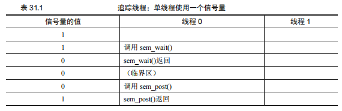
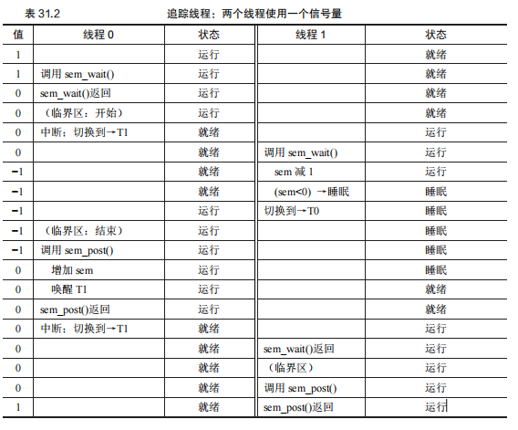
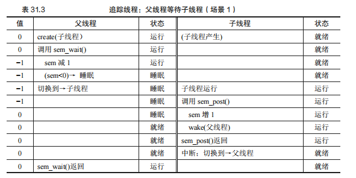
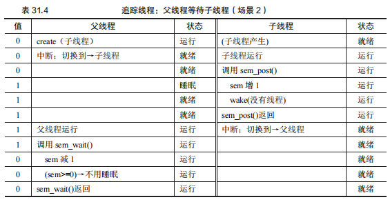

## 第 31 章 信号量

在第 31 章中，信号量作为一种关键的同步原语被介绍。它由 Edsger Dijkstra 引入，用于解决各种并发问题，尤其是那些涉及到多个线程或进程需要协调访问共享资源的情况。

#### 原文：

​		我们现在知道，需要锁和条件变量来解决各种相关的、有趣的并发问题。多年前，首先认识到这一点的人之中，有一个就是 Edsger Dijkstra（虽然很难知道确切的历史[GR92]）。他出名是因为图论中著名的“最短路径”算法[D59]，因为早期关于结构化编程的论战“Goto语句是有害的”[D68a]（这是一个极好的标题！），还因为他引入了名为信号量[D68b，D72]的同步原语，正是这里我们要学习的。事实上，Dijkstra 及其同事发明了信号量，作为与同步有关的所有工作的唯一原语。你会看到，可以使用信号量作为锁和条件变量。

#### 关键问题：如何使用信号量？

​		**如何使用信号量代替锁和条件变量？什么是信号量？什么是二值信号量？用锁和条件变量来实现信号量是否简单？不用锁和条件变量，如何实现信号量？**


### 31.1 信号量的定义

信号量是一个包含整数值的对象，可以通过两个基本操作来改变它的值：`sem_wait()` 和 `sem_post()`。这两个操作的行为如下：

- `sem_wait(sem_t *s)`：这个函数会将信号量的值减一。如果信号量的值在调用时大于或等于 1，那么 `sem_wait()` 立即返回；如果信号量的值为 0 或负数，调用线程将被阻塞，直到信号量的值再次变为正数（通过另一个线程调用 `sem_post()` 来增加信号量的值）。
- `sem_post(sem_t *s)`：这个函数会将信号量的值增加一，并且如果有线程正在等待该信号量（即信号量的值为负数），它会唤醒其中的一个线程。

信号量的工作机制依赖于它的整数值。初始值的设定决定了信号量的行为。例如，如果将信号量的初始值设为 1，它就可以充当一个简单的互斥锁，确保同一时间只有一个线程能够进入临界区。

#### 信号量的使用

信号量可以用于多种同步场景，包括但不限于以下几种：

1. **互斥锁（Binary Semaphore）**：通过初始化信号量值为 1，可以将其用作互斥锁。这保证了同一时间只有一个线程能够进入临界区。
2. **计数信号量（Counting Semaphore）**：通过初始化信号量值为大于 1 的值，可以允许多个线程同时进入临界区，直到达到一个预定的最大值。
3. **条件变量替代品**：信号量还可以用来实现条件同步机制。例如，在生产者/消费者问题中，可以通过信号量来协调生产者和消费者对缓冲区的访问。

#### 实现信号量的要点

在信号量的实现中，最关键的是确保 `sem_wait()` 和 `sem_post()` 操作的原子性。这意味着在执行这两个操作时，必须防止其他线程对信号量值的同时修改，以避免竞态条件。这通常通过锁和条件变量来实现。

在信号量的工作原理中，负的信号量值表示有多少线程在等待该信号量。因此，当多个线程调用 `sem_wait()` 时，它们会被排队等待，直到一个 `sem_post()` 操作将它们唤醒。

通过信号量，可以有效地管理和控制多线程环境中的资源访问，防止数据竞争和死锁等常见并发问题。


#### 原文：

​		信号量是有一个整数值的对象，可以用两个函数来操作它。在 POSIX 标准中，是sem_wait()和 sem_post()①。因为信号量的初始值能够决定其行为，所以首先要初始化信号量，才能调用其他函数与之交互，如图 31.1 所示。

```
1 #include <semaphore.h> 
2 sem_t s; 
3 sem_init(&s, 0, 1);
图 31.1 初始化信号量
```

​		其中申明了一个信号量 s，通过第三个参数，将它的值初始化为 1。sem_init()的第二个参数，在我们看到的所有例子中都设置为 0，表示信号量是在同一进程的多个线程共享的。读者可以参考手册，了解信号量的其他用法（即如何用于跨不同进程的同步访问），这要求第二个参数用不同的值。信号量初始化之后，我们可以调用sem_wait()或 sem_post()与之交互。图 31.2 展示了这两个函数的不同行为。我们暂时不关注这两个函数的实现，这显然是需要注意的。多个线程会调用 sem_wait()和 sem_post()，显然需要管理这些临界区。我们首先关注如何使用这些原语，稍后再讨论如何实现。

```
1 int sem_wait(sem_t *s) { 
2 decrement the value of semaphore s by one 
3 wait if value of semaphore s is negative 
4 } 
5 
6 int sem_post(sem_t *s) { 
7 increment the value of semaphore s by one 
8 if there are one or more threads waiting, wake one 
9 } 
图 31.2 信号量：Wait 和 Post 的定义
```

​		我们应该讨论这些接口的几个突出方面。首先，sem_wait()要么立刻返回（调用 sem_wait()时，信号量的值大于等于 1），要么会让调用线程挂起，直到之后的一个 post 操作。当然，也可能多个调用线程都调用 sem_wait()，因此都在队列中等待被唤醒。

​		其次，sem_post()并没有等待某些条件满足。它直接增加信号量的值，如果有等待线程，唤醒其中一个。

​		最后，当信号量的值为负数时，这个值就是等待线程的个数[D68b]。虽然这个值通常不会暴露给信号量的使用者，但这个恒定的关系值得了解，可能有助于记住信号量的工作原理。

​		先（暂时）不用考虑信号量内的竞争条件，假设这些操作都是原子的。我们很快就会用锁和条件变量来实现。


### 31.2 二值信号量（锁）

在 31.2 节中，讨论了如何使用信号量作为锁来实现线程同步。信号量是一种更加通用的同步原语，二值信号量（即信号量的值为 0 或 1）是其中一种特定用途，常用于实现互斥锁。

#### 信号量的使用

二值信号量的基本用法非常简单。在使用信号量作为锁时，我们需要初始化信号量，并通过 `sem_wait()` 和 `sem_post()` 函数对临界区进行保护。

- **初始化信号量**: 在信号量作为锁使用时，通常将信号量的初始值设为 1，这表示锁未被持有。图 31.3 展示了代码的初始化部分：

  ```
  sem_t m;
  sem_init(&m, 0, 1); // 初始化信号量为 1，表示锁未被持有
  ```

- **进入临界区**: 在线程进入临界区之前，它会调用 `sem_wait()`，该操作会将信号量的值减 1。如果信号量的值变为负数，则表示锁已被持有，线程会进入等待状态，直到有另一个线程释放锁为止。

- **离开临界区**: 当线程离开临界区时，它会调用 `sem_post()`，该操作会将信号量的值加 1。如果有其他线程在等待该信号量，则其中一个线程会被唤醒并继续执行。

#### 工作流程示例

以下是两个线程在使用信号量作为锁时的一个场景：

1. **单线程场景**:
   - 线程 0 调用 `sem_wait()`，信号量的值从 1 变为 0，表示锁已被线程 0 持有。
   - 线程 0 进入临界区，执行完成后调用 `sem_post()`，将信号量的值恢复为 1，表示锁未被持有。
2. **多线程场景**:
   - 线程 0 先调用 `sem_wait()`，信号量的值减为 0 并进入临界区。
   - 线程 1 尝试进入临界区时调用 `sem_wait()`，信号量的值变为 -1，线程 1 进入等待状态。
   - 线程 0 退出临界区后调用 `sem_post()`，信号量的值变为 0，并唤醒等待的线程 1，线程 1 得以进入临界区。

表 31.2 提供了这种情况下的线程调度和信号量值变化的详细跟踪，展示了信号量如何有效地管理多个线程对临界区的访问。

#### 二值信号量的实现

在这种用法中，信号量被称为二值信号量，因为它在任一时刻只能持有两个状态（0 和 1）。当信号量的初始值为 1 时，表示锁未被持有，线程可以自由进入临界区；当值为 0 时，表示锁已被持有，其他线程必须等待。

通过这种方式，二值信号量可以实现简单的互斥锁，确保只有一个线程在任意时刻能够进入受保护的临界区，避免数据竞争和其他并发问题。

#### 原文：

​		现在我们要使用信号量了。信号量的第一种用法是我们已经熟悉的：用信号量作为锁。在图 31.3 所示的代码片段里，我们直接把临界区用一对 sem_wait()/sem_post()环绕。但是，为了使这段代码正常工作，信号量 m 的初始值（图中初始化为 *X*）是至关重要的。*X* 应该是多少呢？

```
1 sem_t m; 
2 sem_init(&m, 0, X); // initialize semaphore to X; what should X be? 
3 
4 sem_wait(&m); 
5 // critical section here 
6 sem_post(&m); 
图 31.3 二值信号量（就是锁）
```

……（读者先思考一下再继续学习）……

​		回顾 sem_wait()和 sem_post()函数的定义，我们发现初值应该是 1。

​		为了说明清楚，我们假设有两个线程的场景。第一个线程（线程 0）调用了 sem_wait()，它把信号量的值减为 0。然后，它只会在值小于 0 时等待。因为值是 0，调用线程从函数返回并继续，线程 0 现在可以自由进入临界区。线程 0 在临界区中，如果没有其他线程尝试获取锁，当它调用 sem_post()时，会将信号量重置为 1（因为没有等待线程，不会唤醒其他线程）。表 31.1 追踪了这一场景。



​		如果线程 0 持有锁（即调用了 sem_wait()之后，调用 sem_post()之前），另一个线程（线程 1）调用 sem_wait()尝试进入临界区，那么更有趣的情况就发生了。这种情况下，线程 1把信号量减为−1，然后等待（自己睡眠，放弃处理器）。线程 0 再次运行，它最终调用sem_post()，将信号量的值增加到 0，唤醒等待的线程（线程 1），然后线程 1 就可以获取锁。线程 1 执行结束时，再次增加信号量的值，将它恢复为 1。

​		表 31.2 追踪了这个例子。除了线程的动作，表中还显示了每一个线程的调度程序状态（scheduler state）：运行、就绪（即可运行但没有运行）和睡眠。特别要注意，当线程 1 尝试获取已经被持有的锁时，陷入睡眠。只有线程 0 再次运行之后，线程 1 才可能会唤醒并继续运行。




​		如果你想追踪自己的例子，那么请尝试一个场景，多个线程排队等待锁。在这样的追踪中，信号量的值会是什么？我们可以用信号量来实现锁了。因为锁只有两个状态（持有和没持有），所以这种用法有时也叫作二值信号量（binary semaphore）。事实上这种信号量也有一些更简单的实现，我们这里使用了更为通用的信号量作为锁。


### 31.3 信号量用作条件变量

在 31.3 节中，讨论了如何使用信号量来实现条件变量的功能。信号量不仅可以用作锁，还可以用作条件变量来管理线程间的同步，尤其是在一个线程需要等待某个条件满足时。

#### 信号量作为条件变量的基本原理

信号量在用作条件变量时，主要用于在线程之间传递信号。例如，一个线程在执行到某一阶段时，需要等待另一个线程完成特定的操作。在这种情况下，等待的线程会调用 `sem_wait()` 进入等待状态，而执行操作的线程在完成后会调用 `sem_post()` 来通知等待的线程继续执行。

#### 代码示例：父线程等待子线程

下面是一个简单的例子，展示了父线程如何等待子线程完成执行（见图 31.4）：

```
sem_t s;

void *child(void *arg) {
    printf("child\n");
    sem_post(&s); // 子线程完成后发送信号
    return NULL;
}

int main(int argc, char *argv[]) {
    sem_init(&s, 0, 0); // 初始化信号量为 0
    printf("parent: begin\n");
    pthread_t c;
    Pthread_create(&c, NULL, child, NULL);
    sem_wait(&s); // 等待子线程完成
    printf("parent: end\n");
    return 0;
}
```

该程序运行时，我们希望能看到这样的输出：

```
parent: begin 
child 
parent: end
```

在该程序中，信号量 `s` 的初始值设置为 0，这意味着父线程在执行 `sem_wait()` 时，会立即进入等待状态，直到子线程执行 `sem_post()` 并将信号量的值增加为 1，唤醒父线程。

#### 两种可能的执行场景

1. **子线程在父线程之前运行**：
   - 如果子线程在父线程调用 `sem_wait()` 之前运行并执行 `sem_post()`，信号量的值将从 0 变为 1。此时，当父线程执行 `sem_wait()` 时，信号量的值会减少为 0，父线程无需等待，可以直接继续执行。
2. **父线程在子线程之前运行**：
   - 如果父线程先执行 `sem_wait()`，信号量的值会从 0 减少为 -1，表示父线程进入等待状态。随后，子线程执行 `sem_post()` 时，信号量的值会增加为 0，并唤醒父线程，父线程从 `sem_wait()` 返回，继续执行。

在这两种情况下，信号量都能保证线程间的同步，确保父线程在子线程完成后再继续执行。

#### 关键点

- **信号量初始值设置为 0**：这确保了等待线程在调用 `sem_wait()` 时会立即进入等待状态，直到信号量的值被 `sem_post()` 增加为正数。
- **信号量的使用**：通过 `sem_wait()` 和 `sem_post()`，可以有效地控制线程的执行顺序，避免竞态条件，实现线程间的同步。

这个例子展示了信号量用作条件变量的简单而有效的方式，适用于需要线程间同步的各种场景。


#### 原文：

​		信号量也可以用在一个线程暂停执行，等待某一条件成立的场景。例如，一个线程要等待一个链表非空，然后才能删除一个元素。在这种场景下，通常一个线程等待条件成立，另外一个线程修改条件并发信号给等待线程，从而唤醒等待线程。因为等待线程在等待某些条件（condition）发生变化，所以我们将信号量作为条件变量（condition variable）。

​		下面是一个简单例子。假设一个线程创建另外一线程，并且等待它结束（见图 31.4）。

```
1 sem_t s; 
2 
3 void *
4 child(void *arg) { 
5 printf("child\n"); 
6 sem_post(&s); // signal here: child is done 
7 return NULL; 
8 } 
9 
10 int 
11 main(int argc, char *argv[]) { 
12 sem_init(&s, 0, X); // what should X be? 
13 printf("parent: begin\n"); 
14 pthread_t c; 
15 Pthread_create(c, NULL, child, NULL); 
16 sem_wait(&s); // wait here for child 
17 printf("parent: end\n"); 
18 return 0; 
19 } 
图 31.4 父线程等待子线程
```

该程序运行时，我们希望能看到这样的输出：

```
parent: begin 
child 
parent: end
```

​		然后问题就是如何用信号量来实现这种效果。结果表明，答案也很容易理解。从代码中可知，父线程调用 sem_wait()，子线程调用 sem_post()，父线程等待子线程执行完成。但是，问题来了：信号量的初始值应该是多少？（再想一下，然后继续阅读）

​		当然，答案是信号量初始值应该是 0。有两种情况需要考虑。第一种，父线程创建了子线程，但是子线程并没有运行。这种情况下（见表 31.3），父线程调用 sem_wait()会先于子线程调用 sem_post()。我们希望父线程等待子线程运行。为此，唯一的办法是让信号量的值不大于 0。因此，0 为初值。父线程运行，将信号量减为−1，然后睡眠等待；子线程运行的时候，调用 sem_post()，信号量增加为 0，唤醒父线程，父线程然后从 sem_wait()返回，完成该程序。



​		第二种情况是子线程在父线程调用 sem_wait()之前就运行结束（见表 31.4）。在这种情况下，子线程会先调用 sem_post()，将信号量从 0 增加到 1。然后当父线程有机会运行时，会调用sem_wait()，发现信号量的值为 1。于是父线程将信号量从 1 减为 0，没有等待，直接从sem_wait()返回，也达到了预期效果。




### 31.4 生产者/消费者（有界缓冲区）问题总结

在 31.4 节中，讨论了使用信号量解决经典的生产者/消费者问题（有界缓冲区问题）。生产者/消费者问题是多线程编程中的常见问题之一，涉及如何安全地在多个线程之间共享一个有限的缓冲区。

#### 初次尝试

最初的解决方案使用了两个信号量：`empty` 和 `full`，分别表示缓冲区中的空槽和已满槽的数量。具体的 `put()` 和 `get()` 函数如图 31.5 所示：

```
int buffer[MAX];
int fill = 0;
int use = 0;

void put(int value) {
    buffer[fill] = value;
    fill = (fill + 1) % MAX;
}

int get() {
    int tmp = buffer[use];
    use = (use + 1) % MAX;
    return tmp;
}
```

对应的生产者和消费者代码如图 31.6 所示：

```
sem_t empty;
sem_t full;

void *producer(void *arg) {
    int i;
    for (i = 0; i < loops; i++) {
        sem_wait(&empty); // 等待空槽
        put(i); // 放入数据
        sem_post(&full); // 增加已满槽数
    }
}

void *consumer(void *arg) {
    int i, tmp = 0;
    while (tmp != -1) {
        sem_wait(&full); // 等待已满槽
        tmp = get(); // 取出数据
        sem_post(&empty); // 增加空槽数
        printf("%d\n", tmp);
    }
}
```

在这种初次尝试中，信号量 `empty` 的初值为 `MAX`，表示缓冲区最初是空的，而 `full` 的初值为 0，表示最初没有数据。在这个方案中，生产者在空槽数为 0 时等待，消费者在满槽数为 0 时等待。

#### 问题：竞态条件

当 `MAX > 1` 时，多生产者/消费者情况下会产生竞态条件。假设两个生产者几乎同时执行 `put()` 操作，而其中一个在更新 `fill` 索引前被中断，另一个生产者可能会覆盖之前的数据，导致数据丢失。

#### 解决方案：增加互斥锁

为了解决竞态条件，增加了一个二值信号量 `mutex` 作为锁，以保护 `put()` 和 `get()` 的临界区（见图 31.7）：

```
sem_t empty;
sem_t full;
sem_t mutex;

void *producer(void *arg) {
    int i;
    for (i = 0; i < loops; i++) {
        sem_wait(&mutex); // 获得锁
        sem_wait(&empty); // 等待空槽
        put(i); // 放入数据
        sem_post(&full); // 增加已满槽数
        sem_post(&mutex); // 释放锁
    }
}

void *consumer(void *arg) {
    int i;
    for (i = 0; i < loops; i++) {
        sem_wait(&mutex); // 获得锁
        sem_wait(&full); // 等待已满槽
        int tmp = get(); // 取出数据
        sem_post(&empty); // 增加空槽数
        sem_post(&mutex); // 释放锁
        printf("%d\n", tmp);
    }
}
```

#### 问题：死锁

这个方案虽然解决了竞态条件，但引入了死锁风险。当一个线程持有锁并等待信号量时，另一个线程也可能在等待锁，从而导致两个线程相互等待，形成死锁。

#### 终极解决方案：缩小锁的作用域

最终的解决方案是缩小互斥锁的作用域，仅在对共享资源进行实际访问时使用锁（见图 31.8）：

```
sem_t empty;
sem_t full;
sem_t mutex;

void *producer(void *arg) {
    int i;
    for (i = 0; i < loops; i++) {
        sem_wait(&empty); // 等待空槽
        sem_wait(&mutex); // 获得锁
        put(i); // 放入数据
        sem_post(&mutex); // 释放锁
        sem_post(&full); // 增加已满槽数
    }
}

void *consumer(void *arg) {
    int i;
    for (i = 0; i < loops; i++) {
        sem_wait(&full); // 等待已满槽
        sem_wait(&mutex); // 获得锁
        int tmp = get(); // 取出数据
        sem_post(&mutex); // 释放锁
        sem_post(&empty); // 增加空槽数
        printf("%d\n", tmp);
    }
}
```

在该方案中，互斥锁仅用于保护 `put()` 和 `get()` 的临界区，而 `full` 和 `empty` 信号量的等待和唤醒操作都在锁的外面进行，从而避免了死锁并确保程序的正确性。

#### 结论

通过逐步改进，最终方案解决了生产者/消费者问题中的竞态条件和死锁问题，实现了一个有效的多线程有界缓冲区。


#### 原文：

​		本章的下一个问题是生产者/消费者（producer/consumer）问题，有时称为有界缓冲区问题[D72]。第 30 章讲条件变量时已经详细描述了这一问题，细节请参考相应内容。

##### 		第一次尝试 

​		第一次尝试解决该问题时，我们用两个信号量 empty 和 full 分别表示缓冲区空或者满。

图 31.5 是 put()和 get()函数，图 31.6 是我们尝试解决生产者/消费者问题的代码。

```
1 int buffer[MAX]; 
2 int fill = 0; 
3 int use = 0; 
4 
5 void put(int value) { 
6 buffer[fill] = value; // line f1 
7 fill = (fill + 1) % MAX; // line f2 
8 } 
9 
10 int get() { 
11 int tmp = buffer[use]; // line g1 
12 use = (use + 1) % MAX; // line g2 
13 return tmp; 
14 } 
图 31.5 put()和 get()函数
```

```
1 sem_t empty; 
2 sem_t full; 
3 
4 void *producer(void *arg) { 
5 int i; 
6 for (i = 0; i < loops; i++) { 
7 sem_wait(&empty); // line P1 
8 put(i); // line P2 
9 sem_post(&full); // line P3 
10 } 
11 } 
12 
13 void *consumer(void *arg) { 
14 int i, tmp = 0; 
15 while (tmp != -1) { 
16 sem_wait(&full); // line C1 
17 tmp = get(); // line C2 
18 sem_post(&empty); // line C3 
19 printf("%d\n", tmp); 
20 }
21 } 
22 
23 int main(int argc, char *argv[]) { 
24 // ... 
25 sem_init(&empty, 0, MAX); // MAX buffers are empty to begin with... 
26 sem_init(&full, 0, 0); // ... and 0 are full 
27 // ... 
28 } 
图 31.6 增加 full 和 empty 条件
```


​		本例中，生产者等待缓冲区为空，然后加入数据。类似地，消费者等待缓冲区变成有数据的状态，然后取走数据。我们先假设 MAX=1（数组中只有一个缓冲区），验证程序是否有效。

​		假设有两个线程，一个生产者和一个消费者。我们来看在一个 CPU 上的具体场景。消费者先运行，执行到 C1 行，调用 sem_wait(&full)。因为 full 初始值为 0，wait 调用会将 full减为−1，导致消费者睡眠，等待另一个线程调用 sem_post(&full)，符合预期。

​		假设生产者然后运行。执行到 P1 行，调用 sem_wait(&empty)。不像消费者，生产者将继续执行，因为 empty 被初始化为 MAX（在这里是 1）。因此，empty 被减为 0，生产者向缓冲区中加入数据，然后执行 P3 行，调用 sem_post(&full)，把 full 从−1 变成 0，唤醒消费者（即将它从阻塞变成就续）。

​		在这种情况下，可能会有两种情况。如果生产者继续执行，再次循环到 P1 行，由于 empty值为 0，它会阻塞。如果生产者被中断，而消费者开始执行，调用 sem_wait(&full)（c1 行），发现缓冲区确实满了，消费它。这两种情况都是符合预期的。

​		你可以用更多的线程来尝试这个例子（即多个生产者和多个消费者）。它应该仍然正常运行。

​		我们现在假设 MAX 大于 1（比如 MAX=10）。对于这个例子，假定有多个生产者，多个消费者。现在就有问题了：竞态条件。你能够发现是哪里产生的吗？（花点时间找一下）如果没有发现，不妨仔细观察 put()和 get()的代码。

​		好，我们来理解该问题。假设两个生产者（Pa 和 Pb）几乎同时调用 put()。当 Pa 先运行，在 f1 行先加入第一条数据（fill=0），假设 Pa 在将 fill 计数器更新为 1 之前被中断，Pb开始运行，也在 f1 行给缓冲区的 0 位置加入一条数据，这意味着那里的老数据被覆盖！这可不行，我们不能让生产者的数据丢失。

##### 		解决方案：增加互斥 

​		你可以看到，这里忘了互斥。向缓冲区加入元素和增加缓冲区的索引是临界区，需要小心保护起来。所以，我们使用二值信号量来增加锁。图 31.7 是对应的代码。

```
1 sem_t empty; 
2 sem_t full; 
3 sem_t mutex; 
4 
5 void *producer(void *arg) { 
6 int i;
7 for (i = 0; i < loops; i++) { 
8 sem_wait(&mutex); // line p0 (NEW LINE) 
9 sem_wait(&empty); // line p1 
10 put(i); // line p2 
11 sem_post(&full); // line p3 
12 sem_post(&mutex); // line p4 (NEW LINE) 
13 } 
14 } 
15 
16 void *consumer(void *arg) { 
17 int i; 
18 for (i = 0; i < loops; i++) { 
19 sem_wait(&mutex); // line c0 (NEW LINE) 
20 sem_wait(&full); // line c1 
21 int tmp = get(); // line c2 
22 sem_post(&empty); // line c3 
23 sem_post(&mutex); // line c4 (NEW LINE) 
24 printf("%d\n", tmp); 
25 } 
26 } 
27 
28 int main(int argc, char *argv[]) { 
29 // ... 
30 sem_init(&empty, 0, MAX); // MAX buffers are empty to begin with... 
31 sem_init(&full, 0, 0); // ... and 0 are full 
32 sem_init(&mutex, 0, 1); // mutex=1 because it is a lock (NEW LINE) 
33 // ... 
34 } 
图 31.7 增加互斥量（不正确的）
```

​		现在我们给整个 put()/get()部分都增加了锁，注释中有 NEW LINE 的几行就是。这似乎是正确的思路，但仍然有问题。为什么？死锁。为什么会发生死锁？考虑一下，尝试找出一个死锁的场景。必须以怎样的步骤执行，会导致程序死锁？


##### 		避免死锁 

​		好，既然你想出来了，下面是答案。假设有两个线程，一个生产者和一个消费者。消费者首先运行，获得锁（c0 行），然后对 full 信号量执行 sem_wait() （c1 行）。因为还没有数据，所以消费者阻塞，让出 CPU。但是，重要的是，此时消费者仍然持有锁。然后生产者运行。假如生产者能够运行，它就能生产数据并唤醒消费者线程。遗憾的是，它首先对二值互斥信号量调用 sem_wait()（p0 行）。锁已经被持有，因此生产者也被卡住。这里出现了一个循环等待。消费者持有互斥量，等待在 full 信号量上。生产者可以发送full 信号，却在等待互斥量。因此，生产者和消费者互相等待对方——典型的死锁。


##### 		最后，可行的方案 

​		要解决这个问题，只需减少锁的作用域。图 31.8 是最终的可行方案。可以看到，我们把获取和释放互斥量的操作调整为紧挨着临界区，把 full、empty 的唤醒和等待操作调整到锁外面。结果得到了简单而有效的有界缓冲区，多线程程序的常用模式。现在理解，将来使用。未来的岁月中，你会感谢我们的。至少在期末考试遇到这个问题时，你会感谢我们。

```
1 sem_t empty; 
2 sem_t full; 
3 sem_t mutex; 
4 
5 void *producer(void *arg) { 
6 int i; 
7 for (i = 0; i < loops; i++) { 
8 sem_wait(&empty); // line p1 
9 sem_wait(&mutex); // line p1.5 (MOVED MUTEX HERE...) 
10 put(i); // line p2 
11 sem_post(&mutex); // line p2.5 (... AND HERE) 
12 sem_post(&full); // line p3 
13 } 
14 } 
15 
16 void *consumer(void *arg) { 
17 int i; 
18 for (i = 0; i < loops; i++) { 
19 sem_wait(&full); // line c1 
20 sem_wait(&mutex); // line c1.5 (MOVED MUTEX HERE...) 
21 int tmp = get(); // line c2 
22 sem_post(&mutex); // line c2.5 (... AND HERE) 
23 sem_post(&empty); // line c3 
24 printf("%d\n", tmp); 
25 } 
26 } 
27 
28 int main(int argc, char *argv[]) { 
29 // ... 
30 sem_init(&empty, 0, MAX); // MAX buffers are empty to begin with... 
31 sem_init(&full, 0, 0); // ... and 0 are full 
32 sem_init(&mutex, 0, 1); // mutex=1 because it is a lock 
33 // ... 
34 } 
图 31.8 增加互斥量（正确的）
```


### 31.5 读者-写者锁

在 31.5 节中，讨论了一种更灵活的锁定机制——读者-写者锁（reader-writer lock）。这种锁的设计初衷是为了优化对数据结构的并发访问，特别是在一些场景下，读操作可以并发执行，而写操作则需要独占资源。

#### 问题背景

在并发程序设计中，某些数据结构可能需要同时支持多个读者（读取数据的线程）访问，而只允许一个写者（修改数据的线程）进行操作。例如，一个并发链表中，插入操作会修改链表的状态，需要独占访问权限；而查找操作仅是读取链表，可以允许多个线程并发执行。

#### 读者-写者锁的实现

读者-写者锁的基本思想是，多个读者可以同时获取读锁，而写者只能独占获取写锁。实现这一机制的代码如图 31.9 所示：

```
typedef struct _rwlock_t { 
    sem_t lock; // binary semaphore (basic lock) 
    sem_t writelock; // used to allow ONE writer or MANY readers 
    int readers; // count of readers reading in critical section 
} rwlock_t;

void rwlock_init(rwlock_t *rw) { 
    rw->readers = 0; 
    sem_init(&rw->lock, 0, 1); 
    sem_init(&rw->writelock, 0, 1); 
}

void rwlock_acquire_readlock(rwlock_t *rw) { 
    sem_wait(&rw->lock); 
    rw->readers++; 
    if (rw->readers == 1) 
        sem_wait(&rw->writelock); // first reader acquires writelock 
    sem_post(&rw->lock); 
}

void rwlock_release_readlock(rwlock_t *rw) { 
    sem_wait(&rw->lock); 
    rw->readers--; 
    if (rw->readers == 0) 
        sem_post(&rw->writelock); // last reader releases writelock 
    sem_post(&rw->lock); 
}

void rwlock_acquire_writelock(rwlock_t *rw) { 
    sem_wait(&rw->writelock); 
}

void rwlock_release_writelock(rwlock_t *rw) { 
    sem_post(&rw->writelock); 
}
```

#### 代码解析

1. **数据结构**：
   - `lock`: 用于保护对 `readers` 计数器的访问，是一个二值信号量。
   - `writelock`: 确保只有一个写者或者多个读者可以访问数据，是一个二值信号量。
   - `readers`: 计数当前正在读取数据的读者数量。
2. **读锁的获取和释放**：
   - 获取读锁时，线程首先获取 `lock` 信号量，增加 `readers` 计数。如果当前是第一个读者（即 `readers == 1`），它还需要获取 `writelock` 信号量，阻止写者进入临界区。然后释放 `lock`，允许其他读者进入。
   - 释放读锁时，线程再次获取 `lock`，减少 `readers` 计数。如果当前是最后一个读者（即 `readers == 0`），它会释放 `writelock` 信号量，允许等待中的写者进入。
3. **写锁的获取和释放**：
   - 获取写锁的线程直接尝试获取 `writelock` 信号量。如果成功，表示没有其他写者或读者正在访问临界区，它可以进入。
   - 释放写锁时，线程释放 `writelock` 信号量，允许其他等待的读者或写者进入。

#### 优缺点分析

- **优点**：
  - 读者-写者锁允许多个读者并发访问，从而提高读操作的并发性。
  - 在读操作较多而写操作较少的场景下，这种锁机制可以显著提高系统的吞吐量。
- **缺点**：
  - 读者容易饿死写者：在高频率的读操作下，写者可能长期得不到执行的机会，因为读者在不断地获取和释放读锁。
  - 性能开销：相比简单的互斥锁，读者-写者锁引入了更多的复杂性和开销，可能在某些情况下反而降低性能。

#### 总结

读者-写者锁是一种在某些特定场景下非常有用的并发控制机制。它展示了信号量的强大之处，通过组合和巧妙设计，可以实现灵活的锁定策略。然而，正如提示中所指出的那样，简单的方案往往是最有效的，在选择使用读者-写者锁时，需要权衡其复杂性和潜在的性能开销。


#### 原文：

​		另一个经典问题源于对更加灵活的锁定原语的渴望，它承认不同的数据结构访问可能需要不同类型的锁。例如，一个并发链表有很多插入和查找操作。插入操作会修改链表的状态（因此传统的临界区有用），而查找操作只是读取该结构，只要没有进行插入操作，我们可以并发的执行多个查找操作。读者—写者锁（reader-writer lock）就是用来完成这种操作的[CHP71]。图 31.9 是这种锁的代码。

​		代码很简单。如果某个线程要更新数据结构，需要调用 rwlock_acquire_lock()获得写锁，调用 rwlock_release_writelock()释放锁。内部通过一个 writelock 的信号量保证只有一个写者能获得锁进入临界区，从而更新数据结构。

```
1 typedef struct _rwlock_t { 
2 sem_t lock; // binary semaphore (basic lock) 
3 sem_t writelock; // used to allow ONE writer or MANY readers 
4 int readers; // count of readers reading in critical section 
5 } rwlock_t; 
6 
7 void rwlock_init(rwlock_t *rw) { 
8 rw->readers = 0; 
9 sem_init(&rw->lock, 0, 1); 
10 sem_init(&rw->writelock, 0, 1); 
11 } 
12 
13 void rwlock_acquire_readlock(rwlock_t *rw) { 
14 sem_wait(&rw->lock); 
15 rw->readers++; 
16 if (rw->readers == 1) 
17 sem_wait(&rw->writelock); // first reader acquires writelock 
18 sem_post(&rw->lock); 
19 } 
20 
21 void rwlock_release_readlock(rwlock_t *rw) { 
22 sem_wait(&rw->lock); 
23 rw->readers--; 
24 if (rw->readers == 0) 
25 sem_post(&rw->writelock); // last reader releases writelock 
26 sem_post(&rw->lock); 
27 } 
28 
29 void rwlock_acquire_writelock(rwlock_t *rw) { 
30 sem_wait(&rw->writelock); 
31 } 
32 
33 void rwlock_release_writelock(rwlock_t *rw) { 
34 sem_post(&rw->writelock); 
35 } 
图 31.9 一个简单的读者-写者锁
```

​		读锁的获取和释放操作更加吸引人。获取读锁时，读者首先要获取 lock，然后增加 reader变量，追踪目前有多少个读者在访问该数据结构。重要的步骤然后在 rwlock_acquire_readlock()内发生，当第一个读者获取该锁时。在这种情况下，读者也会获取写锁，即在 writelock 信号量上调用 sem_wait()，最后调用 sem_post()释放 lock。

​		一旦一个读者获得了读锁，其他的读者也可以获取这个读锁。但是，想要获取写锁的线程，就必须等到所有的读者都结束。最后一个退出的写者在“writelock”信号量上调用sem_post()，从而让等待的写者能够获取该锁。


#### 提示：简单的笨办法可能更好（**Hill** 定律）

​		**我们不能小看一个概念，即简单的笨办法可能最好。某些时候简单的自旋锁反而是最有效的，因为它容易实现而且高效。虽然读者—写者锁听起来很酷，但是却很复杂，复杂可能意味着慢。因此，总是优先尝试简单的笨办法。**

​		**这种受简单吸引的思想，在多个地方都能发现。一个早期来源是 Mark Hill 的学位论文[H87]，研究如何为 CPU 设计缓存。Hill 发现简单的直接映射缓存比花哨的集合关联性设计更加有效（一个原因是在缓存中，越简单的设计，越能够更快地查找）。Hill 简洁地总结了他的工作：“大而笨更好。”因此我们将这种类似的建议叫作 Hill 定律（Hill’s Law）。**


​		这一方案可行（符合预期），但有一些缺陷，尤其是公平性。读者很容易饿死写者。存在复杂一些的解决方案，也许你可以想到更好的实现？提示：有写者等待时，如何能够避免更多的读者进入并持有锁。

​		最后，应该指出，读者-写者锁还有一些注意点。它们通常加入了更多开锁（尤其是更复杂的实现），因此和其他一些简单快速的锁相比，读者写者锁在性能方面没有优势[CB08]。无论哪种方式，它们都再次展示了如何以有趣、有用的方式来使用信号量。


### 31.6 哲学家就餐问题

哲学家就餐问题（Dining Philosopher’s Problem）是由 Edsger Dijkstra 提出的经典并发问题，虽然其实际应用不多，但因为它在研究并发编程中的同步问题时非常有趣，所以广为人知。这一问题的重要性不仅体现在学术研究中，甚至在一些编程面试中也经常出现。

#### 问题描述

在哲学家就餐问题中，假设有五位哲学家围坐在一张圆桌旁，每两位哲学家之间放置了一把餐叉，因此共有五把餐叉。哲学家们有时会思考，不需要餐叉；有时会吃饭，而一位哲学家只有同时拿到左手边和右手边的两把餐叉，才能进食。餐叉的争夺以及同步问题就是这个问题的核心所在。

哲学家们的基本循环代码如下：

```
c复制代码while (1) { 
    think(); 
    getforks(); 
    eat(); 
    putforks(); 
}
```

关键的挑战在于如何实现 `getforks()` 和 `putforks()` 函数，以保证：

1. 没有死锁发生。
2. 没有哲学家会饿死（即长时间得不到两把餐叉）。
3. 并发度尽可能高（让尽可能多的哲学家同时进食）。

#### 辅助函数

为了解决这个问题，我们使用一些辅助函数，帮助定位哲学家左右手的餐叉编号：

```
c复制代码int left(int p) { return p; } 
int right(int p) { return (p + 1) % 5; }
```

对于哲学家 `p`，`left(p)` 返回左手边餐叉的编号，`right(p)` 返回右手边餐叉的编号。模运算解决了最后一位哲学家右手边餐叉编号的问题。

我们还需要一些信号量来解决这个问题，假设需要 5 个信号量，每把餐叉一个：`sem_t forks[5]`。

#### 有问题的解决方案

首先，我们尝试一个简单的解决方案：每个哲学家依次获取左手边和右手边的餐叉。如果拿到了两把餐叉，哲学家可以进食；进食完后，释放餐叉。

实现如下：

```
c复制代码void getforks() { 
    sem_wait(forks[left(p)]); 
    sem_wait(forks[right(p)]); 
}

void putforks() { 
    sem_post(forks[left(p)]); 
    sem_post(forks[right(p)]); 
}
```

这个方案的思路很直接：哲学家首先尝试拿起左手边的餐叉，再尝试拿起右手边的餐叉。然而，这种方案存在一个严重问题：**死锁**。

假设每位哲学家都成功拿到了左手边的餐叉，但在尝试拿起右手边的餐叉时却发现右手边的餐叉已经被其他哲学家占用了，这时就会发生死锁——所有哲学家都在等待另一个餐叉，无法继续进食，程序将陷入僵局。

#### 解决方案：打破循环依赖

为了解决死锁问题，我们可以调整哲学家获取餐叉的顺序。具体来说，假设最后一位哲学家（编号为 4 的哲学家）先拿右手边的餐叉，再拿左手边的餐叉，而其他哲学家依然保持原来的顺序。这样可以打破循环等待，从而避免死锁。

代码如下：

```
c复制代码void getforks() { 
    if (p == 4) { 
        sem_wait(forks[right(p)]); 
        sem_wait(forks[left(p)]); 
    } else { 
        sem_wait(forks[left(p)]); 
        sem_wait(forks[right(p)]); 
    } 
}
```

通过这种调整，最后一个哲学家会先尝试拿右手边的餐叉，这样可以防止所有哲学家都拿着一把餐叉互相等待的情况，从而避免死锁。

#### 总结

哲学家就餐问题是并发编程中的经典问题，虽然实际应用较少，但其对理解并发控制、死锁避免等问题具有重要意义。通过调整获取资源的顺序，可以有效避免死锁。然而，其他类似的并发问题，如吸烟者问题、理发师问题等，也提供了丰富的并发控制思路和技术。

### 31.7 如何实现信号量

在这一节中，我们将用底层的同步原语（锁和条件变量）来实现自己的信号量，称之为 Zemaphore。这个实现相对简单，核心代码如下：

```
typedef struct _Zem_t { 
    int value; 
    pthread_cond_t cond; 
    pthread_mutex_t lock; 
} Zem_t; 

// 只允许一个线程调用初始化函数
void Zem_init(Zem_t *s, int value) { 
    s->value = value; 
    pthread_cond_init(&s->cond, NULL); 
    pthread_mutex_init(&s->lock, NULL); 
} 

void Zem_wait(Zem_t *s) { 
    pthread_mutex_lock(&s->lock); 
    while (s->value <= 0) 
        pthread_cond_wait(&s->cond, &s->lock); 
    s->value--; 
    pthread_mutex_unlock(&s->lock); 
} 

void Zem_post(Zem_t *s) { 
    pthread_mutex_lock(&s->lock); 
    s->value++; 
    pthread_cond_signal(&s->cond); 
    pthread_mutex_unlock(&s->lock); 
} 
```

在这个实现中，我们使用了一把锁、一个条件变量和一个表示信号量值的状态变量。这种实现与 Dijkstra 定义的信号量稍有不同，主要区别在于我们没有让信号量的值为负数来反映等待线程的数量。事实上，在这个实现中，信号量的值永远不会小于 0，这种行为更加容易实现，并且符合现有的 Linux 实现。

**提示：小心泛化**

在系统设计中，抽象和泛化是非常有用的技术，一个好的想法可以通过适当的扩展来解决更大范围的问题。然而，泛化时要小心，正如 Lampson 所提醒的那样：“不要泛化。泛化通常都是错的。”【L83】。

我们可以将信号量视为锁和条件变量的泛化形式，但这种泛化是否必要？考虑到使用信号量来实现条件变量的难度，可能这种泛化并没有我们想象的那么通用。

实际上，使用信号量实现锁和条件变量是一个相对棘手的问题。一些有经验的并发程序员曾在 Windows 环境下尝试过，结果导致了许多缺陷【B04】。你可以自己尝试一下，看看能否理解为什么使用信号量实现条件变量比看起来要困难得多。

### 31.8 小结

信号量是一个非常强大且灵活的并发编程原语。有些程序员因为信号量的简单实用，可能只使用信号量，而不使用锁和条件变量。

在本章中，我们展示了几个经典的并发问题及其解决方案。如果你对这些内容感兴趣，还有很多资料可以参考。Allen Downey 的关于并发和信号量编程的书籍【D08】是一本非常好的参考资料（而且是免费的）。这本书包含了许多谜题，研究它们可以帮助你更深入地理解信号量以及一般的并发编程知识。成为一名并发编程专家需要多年的努力，学习本课程之外的内容无疑是掌握这一领域的关键。