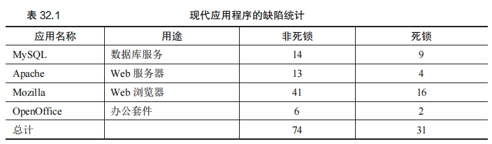
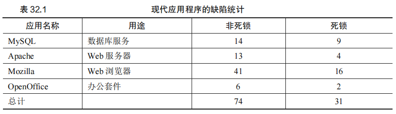
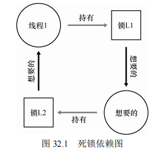
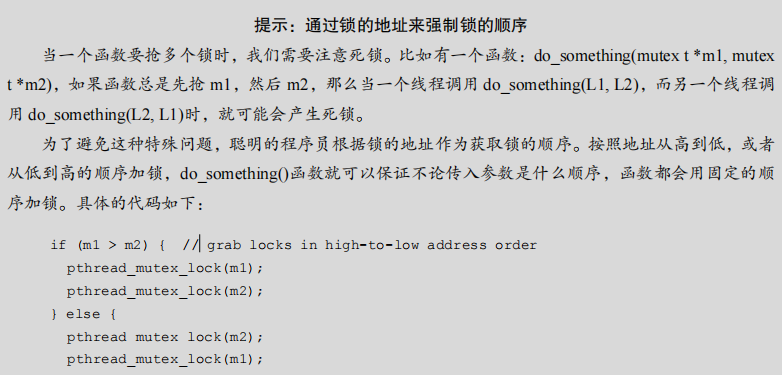
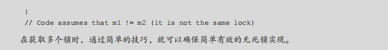
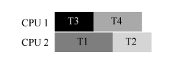
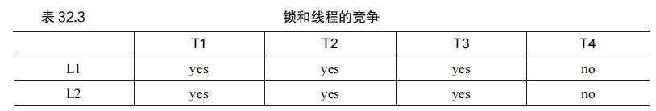
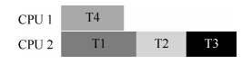

# 第 32 章 常见并发问题

​		并发编程中，存在许多常见的缺陷模式，理解这些模式对于编写健壮且正确的程序至关重要。以下是本章的关键问题和常见的并发缺陷类型。

### 原文：

​		多年来，研究人员花了大量的时间和精力研究并发编程的缺陷。很多早期的工作是关于死锁的，之前的章节也有提及，本章会深入学习[C+71]。最近的研究集中在一些其他类型的常见并发缺陷（即非死锁缺陷）。在本章中，我们会简要了解一些并发问题的例子，以便更好地理解要注意什么问题。因此，本章的关键问题就是：


## 32.1 有哪些类型的缺陷

​		研究表明，复杂的并发程序中存在多种缺陷类型。Lu 等人对几个流行的开源应用程序（如 MySQL、Apache、Mozilla 和 OpenOffice）进行了研究，统计并分析了这些应用程序中常见的并发缺陷类型。这些缺陷大致分为两类：非死锁缺陷和死锁缺陷。

​		表 32.1 展示了这些应用程序中发现的 105 个缺陷的分布情况，其中大部分（74 个）是非死锁缺陷，其余 31 个是死锁缺陷。通过分析这些缺陷的类型，我们可以更好地理解并发编程中需要注意的问题。



### 原文：

​		第一个最明显的问题就是：在复杂并发程序中，有哪些类型的缺陷呢？一般来说，这个问题很难回答，好在其他人已经做过相关的工作。具体来说，Lu 等人[L+08]详细分析了一些流行的并发应用，以理解实践中有哪些类型的缺陷。

​		研究集中在 4 个重要的开源应用：MySQL（流行的数据库管理系统）、Apache（著名的Web 服务器）、Mozilla（著名的 Web 浏览器）和 OpenOffice（微软办公套件的开源版本）。研究人员通过检查这几个代码库已修复的并发缺陷，将开发者的工作变成量化的缺陷分析。理解这些结果，有助于我们了解在成熟的代码库中，实际出现过哪些类型的并发问题。

​		表 32.1 是 Lu 及其同事的研究结论。可以看出，共有 105 个缺陷，其中大多数是非死锁相关的（74 个），剩余 31 个是死锁缺陷。另外，可以看出每个应用的缺陷数目，OpenOffice只有 8 个，而 Mozilla 有接近 60 个。



​		我们现在来深入分析这两种类型的缺陷。对于第一类非死锁的缺陷，我们通过该研究的例子来讨论。对于第二类死锁缺陷，我们讨论人们在阻止、避免和处理死锁上完成的大量工作。


## 32.2 非死锁缺陷

​		非死锁缺陷在 Lu 等人的研究中占了大多数。在这一节，我们主要讨论其中两种常见的非死锁缺陷：违反原子性（atomicity violation）缺陷和错误顺序（order violation）缺陷。

### 违反原子性缺陷

​		违反原子性缺陷是指一段代码假设某些操作是原子的，但在实际执行中，这些操作并未实现原子性，导致程序出现问题。以下是一个出现在 MySQL 中的例子：

```C
Thread 1:: 
if (thd->proc_info) { 
    ... 
    fputs(thd->proc_info, ...); 
    ... 
} 

Thread 2:: 
thd->proc_info = NULL; 
```

​		在这个例子中，两个线程都访问 `thd` 结构中的 `proc_info` 成员。第一个线程检查 `proc_info` 非空，然后打印出它的值；而第二个线程将其设置为 `NULL`。如果第一个线程在检查后且在调用 `fputs()` 前被中断，第二个线程将 `proc_info` 设置为 `NULL`，那么当第一个线程恢复执行时，由于引用了空指针，程序将会崩溃。

​		==修复这个问题的通常方法是对共享变量的访问进行加锁，确保每个线程在访问 `proc_info` 字段时，都持有锁。==下面是修复后的代码：

```C
pthread_mutex_t proc_info_lock = PTHREAD_MUTEX_INITIALIZER; 

Thread 1:: 
pthread_mutex_lock(&proc_info_lock); 
if (thd->proc_info) { 
    ... 
    fputs(thd->proc_info, ...); 
    ... 
} 
pthread_mutex_unlock(&proc_info_lock); 

Thread 2:: 
pthread_mutex_lock(&proc_info_lock); 
thd->proc_info = NULL; 
pthread_mutex_unlock(&proc_info_lock); 
```

### 违反顺序缺陷

==违反顺序缺陷发生在两个内存访问的预期顺序被打破的情况下。==以下是一个例子：

```C
Thread 1:: 
void init() { 
    ... 
    mThread = PR_CreateThread(mMain, ...); 
    ... 
} 

Thread 2:: 
void mMain(...) { 
    ... 
    mState = mThread->State; 
    ... 
} 
```

​		在这个例子中，线程 2 的代码假设 `mThread` 已经被初始化了。然而，如果线程 1 没有首先执行，线程 2 可能因为引用未初始化的 `mThread` 而崩溃。

​		为了修复这个问题，==可以使用条件变量来强制执行代码的顺序==。以下是修复后的代码：

```C
pthread_mutex_t mtLock = PTHREAD_MUTEX_INITIALIZER; 
pthread_cond_t mtCond = PTHREAD_COND_INITIALIZER; 
int mtInit = 0; 

Thread 1:: 
void init() { 
    ... 
    mThread = PR_CreateThread(mMain, ...); 

    // 发出信号，表示线程已经创建
    pthread_mutex_lock(&mtLock); 
    mtInit = 1; 
    pthread_cond_signal(&mtCond); 
    pthread_mutex_unlock(&mtLock); 
    ... 
} 

Thread 2:: 
void mMain(...) { 
    ... 
    // 等待线程初始化完成
    pthread_mutex_lock(&mtLock); 
    while (mtInit == 0) 
        pthread_cond_wait(&mtCond, &mtLock); 
    pthread_mutex_unlock(&mtLock); 

    mState = mThread->State; 
    ... 
} 
```

​		在这个修复方案中，增加了一个锁 `mtLock`、一个条件变量 `mtCond`，以及一个状态变量 `mtInit`。这样确保了线程 2 只在 `mThread` 被正确初始化后才会继续执行。

### 非死锁缺陷：小结

​		Lu 等人的研究表明，绝大多数非死锁问题都是违反原子性和违反顺序这两种。因此，程序员在编写并发程序时，仔细研究这些错误模式，可以更好地避免这些问题。随着自动化代码检查工具的发展，这些工具也应该集中关注这两种错误类型，因为它们在实际开发中是非常常见的。

​		然而，并不是所有的缺陷都像我们举的例子一样容易修复。有些问题需要更深入的了解应用程序，以及进行大量的代码和数据结构调整。为了深入理解这些问题，推荐阅读 Lu 等人的研究论文。

### 原文：

​		Lu 的研究表明，非死锁问题占了并发问题的大多数。它们是怎么发生的？我们如何修复？我们现在主要讨论其中两种：违反原子性（atomicity violation）缺陷和错误顺序（order violation）缺陷。

#### 违反原子性缺陷 

​		第一种类型的问题叫作违反原子性。这是一个 MySQL 中出现的例子。读者可以先自行找出其中问题所在。

```
Thread 1:: 
if (thd->proc_info) { 
    ...
    fputs(thd->proc_info, ...); 
    ...
}
Thread 2:: 
thd->proc_info = NULL;
```

​	补充：下面是将线程 1 和线程 2 的代码整合在一起，并使用互斥锁（mutex）来保护对共享资源 `thd->proc_info` 的访问，以防止数据竞争的问题。代码包括详细注释以解释每个步骤。

```C
#include <stdio.h>
#include <pthread.h>
#include <stdlib.h>

typedef struct {
    char *proc_info;          // 指向进程信息的指针
    pthread_mutex_t lock;     // 互斥锁，用于保护对 proc_info 的访问
} ThreadData;

ThreadData *thd; // 全局指针，假设在 main 中已正确初始化

// 线程 1 的函数
void *thread1_func(void *arg) {
    pthread_mutex_lock(&thd->lock); // 获取互斥锁，进入临界区
    if (thd->proc_info) {           // 检查 proc_info 是否非空
        // ... 执行其他需要的操作
        fputs(thd->proc_info, stdout); // 将 proc_info 输出到标准输出
        // ... 其他操作
    }
    pthread_mutex_unlock(&thd->lock); // 释放互斥锁，离开临界区
    return NULL;
}

// 线程 2 的函数
void *thread2_func(void *arg) {
    pthread_mutex_lock(&thd->lock); // 获取互斥锁，进入临界区
    thd->proc_info = NULL;          // 将 proc_info 置为 NULL
    pthread_mutex_unlock(&thd->lock); // 释放互斥锁，离开临界区
    return NULL;
}

int main() {
    pthread_t t1, t2; // 定义线程标识符
    thd = malloc(sizeof(ThreadData)); // 分配内存并初始化 thd
    thd->proc_info = "Process information"; // 示例设置 proc_info
    pthread_mutex_init(&thd->lock, NULL);   // 初始化互斥锁

    // 创建线程 1 和线程 2
    pthread_create(&t1, NULL, thread1_func, NULL);
    pthread_create(&t2, NULL, thread2_func, NULL);

    // 等待线程完成
    pthread_join(t1, NULL);
    pthread_join(t2, NULL);

    // 销毁互斥锁并释放资源
    pthread_mutex_destroy(&thd->lock);
    free(thd);

    return 0;
}
```

#### 代码解释：

1. **结构体定义 (`ThreadData`)**：
   - `proc_info`：指向进程信息的指针，供两个线程共享和修改。
   - `lock`：互斥锁，用于保护 `proc_info`，防止数据竞争。
2. **线程 1 (`thread1_func`)**：
   - 尝试输出 `proc_info`。
   - 使用 `pthread_mutex_lock` 获取互斥锁，进入临界区。
   - 检查 `proc_info` 是否非空，如果非空则执行 `fputs` 操作将其输出到标准输出。
   - 释放互斥锁，离开临界区。
3. **线程 2 (`thread2_func`)**：
   - 修改 `proc_info`。
   - 使用 `pthread_mutex_lock` 获取互斥锁，进入临界区。
   - 将 `proc_info` 置为 `NULL`，修改共享资源。
   - 释放互斥锁，离开临界区。
4. **主程序 (`main`)**：
   - 初始化全局的 `ThreadData` 结构体，包括分配内存和设置初始值。
   - 初始化互斥锁。
   - 创建线程 1 和线程 2，并分别执行它们的函数。
   - 等待两个线程执行完毕，确保程序的正确执行顺序。
   - 销毁互斥锁并释放分配的内存，清理资源。

#### 关键点：

- **互斥锁的使用**：通过在每个访问 `proc_info` 的操作前后使用 `pthread_mutex_lock` 和 `pthread_mutex_unlock`，保证了对共享资源的安全访问。
- **数据竞争的解决**：互斥锁确保在一个线程访问共享资源时，其他线程无法同时进行访问，从而避免数据竞争。
- **正确的资源管理**：在程序结束时，确保销毁互斥锁并释放分配的内存，避免资源泄漏。

通过这种方式，我们可以确保多个线程对共享资源的安全访问，避免由于数据竞争导致的不确定行为和错误。	


​		这个例子中，两个线程都要访问 thd 结构中的成员 proc_info。第一个线程检查 proc_info非空，然后打印出值；第二个线程设置其为空。显然，当第一个线程检查之后，在 fputs()调用之前被中断，第二个线程把指针置为空；当第一个线程恢复执行时，由于引用空指针，导致程序奔溃。

​		根据 Lu 等人，更正式的违反原子性的定义是：“违反了多次内存访问中预期的可串行性（即代码段本意是原子的，但在执行中并没有强制实现原子性）”。在我们的例子中，proc_info 的非空检查和 fputs()调用打印 proc_info 是假设原子的，当假设不成立时，代码就出问题了。

​		这种问题的修复通常（但不总是）很简单。你能想到如何修复吗？在这个方案中，我们只要给共享变量的访问加锁，确保每个线程访问 proc_info 字段时，都持有锁（proc_info_lock）。当然，访问这个结构的所有其他代码，也应该先获取锁。

```
pthread_mutex_t proc_info_lock = PTHREAD_MUTEX_INITIALIZER;

Thread 1::
pthread_mutex_lock(&proc_info_lock); 
if (thd->proc_info) { 
    ...
    fputs(thd->proc_info, ...); 
    ...
} 
pthread_mutex_unlock(&proc_info_lock);

Thread 2::
pthread_mutex_lock(&proc_info_lock); 
thd->proc_info = NULL; 
pthread_mutex_unlock(&proc_info_lock);
```

#### 违反顺序缺陷 

​		Lu 等人提出的另一种常见的非死锁问题叫作违反顺序（order violation）。下面是一个简单的例子。同样，看看你是否能找出为什么下面的代码有缺陷。

```
Thread 1::
void init() { 
    ...
    mThread = PR_CreateThread(mMain, ...); 
    ...
}

Thread 2::
void mMain(...) { 
    ...
    mState = mThread->State; 
    ...
}
```

​		你可能已经发现，线程 2 的代码中似乎假定变量 mThread 已经被初始化了（不为空）。然而，如果线程 1 并没有首先执行，线程 2 就可能因为引用空指针奔溃（假设 mThread初始值为空；否则，可能会产生更加奇怪的问题，因为线程 2 中会读到任意的内存位置并引用）。

​		违反顺序更正式的定义是：“两个内存访问的预期顺序被打破了（即 A 应该在 B 之前执行，但是实际运行中却不是这个顺序）”[L+08]。

​		我们通过强制顺序来修复这种缺陷。正如之前详细讨论的，条件变量（condition variables）就是一种简单可靠的方式，在现代代码集中加入这种同步。在上面的例子中，我们可以把代码修改成这样：

```
pthread_mutex_t mtLock = PTHREAD_MUTEX_INITIALIZER; 
pthread_cond_t mtCond = PTHREAD_COND_INITIALIZER; 
int mtInit = 0; 

Thread 1::
void init() { 
    ...
    mThread = PR_CreateThread(mMain, ...); 

    // signal that the thread has been created... 
    pthread_mutex_lock(&mtLock); 
    mtInit = 1; 
    pthread_cond_signal(&mtCond);
    pthread_mutex_unlock(&mtLock); 
    ... 
} 

Thread 2::
void mMain(...) { 
    ...
    // wait for the thread to be initialized... 
    pthread_mutex_lock(&mtLock); 
    while (mtInit == 0) 
        pthread_cond_wait(&mtCond, &mtLock); 
    pthread_mutex_unlock(&mtLock); 

    mState = mThread->State; 
    ... 
}
```

​		在这段修复的代码中，我们增加了一个锁（mtLock）、一个条件变量（mtCond）以及状态的变量（mtInit）。初始化代码运行时，会将 mtInit 设置为 1，并发出信号表明它已做了这件事。如果线程 2 先运行，就会一直等待信号和对应的状态变化；如果后运行，线程 2 会检查是否初始化（即 mtInit 被设置为 1），然后正常运行。请注意，我们可以用 mThread 本身作为状态变量，但为了简洁，我们没有这样做。当线程之间的顺序很重要时，条件变量（或信号量）能够解决问题。

#### 非死锁缺陷：小结 

​		Lu 等人的研究中，大部分（97%）的非死锁问题是违反原子性和违反顺序这两种。因此，程序员仔细研究这些错误模式，应该能够更好地避免它们。此外，随着更自动化的代码检查工具的发展，它们也应该关注这两种错误，因为开发中发现的非死锁问题大部分都是这两种。

​		然而，并不是所有的缺陷都像我们举的例子一样，这么容易修复。有些问题需要对应用程序的更深的了解，以及大量代码及数据结构的调整。阅读 Lu 等人的优秀（可读性强）的论文，了解更多细节。


## 32.3 死锁缺陷

死锁（deadlock）是并发系统中一个经典且复杂的问题，通常发生在多个线程争夺多个资源时。死锁的典型场景是一个线程持有锁 L1，并等待获取锁 L2，而另一个线程持有锁 L2，并等待锁 L1，如下所示：

```
Thread 1:                Thread 2:
lock(L1);                lock(L2);
lock(L2);                lock(L1);
```

如果线程 1 和线程 2 都尝试获取对方持有的锁，就会陷入相互等待的状态，导致死锁。图 32.1 描绘了这种依赖关系的循环（cycle），其中的环路表明了死锁的形成。




### 为什么发生死锁

1. **复杂的依赖关系**：在大型代码库中，组件之间的依赖可能非常复杂。例如，操作系统中的虚拟内存系统和文件系统之间的交互可能导致循环依赖，从而引发死锁。
2. **封装问题**：软件开发中的模块化设计可能会隐藏潜在的锁依赖问题。例如，Java 中 `Vector` 类的 `AddAll()` 方法可能会导致死锁，因为它同时需要获取两个向量的锁，而不同线程可能会以不同的顺序获取这些锁。

### 产生死锁的条件

根据经典的死锁理论，产生死锁需要满足以下四个条件：

1. **互斥**：线程对资源的访问是互斥的（即一次只能一个线程持有锁）。
2. **持有并等待**：线程持有一个资源的同时，还在等待其他资源。
3. **非抢占**：线程持有的资源不能被抢占，只有线程自己可以释放资源。
4. **循环等待**：线程之间存在一个循环等待链，其中每个线程持有一个资源，并等待下一个线程持有的资源。

如果打破这四个条件中的任何一个，就可以避免死锁。

### 预防死锁的方法

1. **避免循环等待**：通过为锁的获取设定一个全序或偏序，确保线程总是按照固定的顺序获取锁，从而避免循环等待。例如，如果所有线程总是先获取锁 L1 再获取锁 L2，则不会产生死锁。
2. **持有并等待的解决**：通过一次性获取所有所需的锁来避免持有并等待。可以引入一个预防锁（prevention lock），在获取所有其他锁之前，先获取预防锁。虽然这种方法有效，但它要求事先知道所有需要的锁，并且可能降低系统并发性。
3. **非抢占策略**：使用 `trylock()` 方法尝试获取锁，如果失败，则释放已经持有的锁并重试。这种方法虽然避免了死锁，但可能导致活锁（livelock），即系统忙于获取锁但没有进展。
4. **避免互斥**：通过使用无等待（wait-free）数据结构或原子操作，避免锁的使用。例如，使用硬件支持的比较并交换（compare-and-swap, CAS）指令可以实现无锁的原子操作，从而避免死锁。


### 提示：通过锁的地址来强制锁的顺序

​		当一个函数要抢多个锁时，我们需要注意死锁。比如有一个函数：do_something(mutex t *m1, mutex t *m2)，如果函数总是先抢 m1，然后 m2，那么当一个线程调用 do_something(L1, L2)，而另一个线程调用 do_something(L2, L1)时，就可能会产生死锁。 

​		为了避免这种特殊问题，聪明的程序员根据锁的地址作为获取锁的顺序。按照地址从高到低，或者从低到高的顺序加锁，do_something()函数就可以保证不论传入参数是什么顺序，函数都会用固定的顺序加锁。具体的代码如下：

```
if (m1 > m2) { // grab locks in high-to-low address order 
 pthread_mutex_lock(m1); 
 pthread_mutex_lock(m2); 
} else { 
 pthread_mutex_lock(m2); 
 pthread_mutex_lock(m1);
 } 
// Code assumes that m1 != m2 (it is not the same lock) 
在获取多个锁时，通过简单的技巧，就可以确保简单有效的无死锁实现。
```


### 通过调度避免死锁

在某些场景下，可以通过聪明的线程调度策略来避免死锁。例如，如果知道某些线程需要获取相同的锁资源，可以确保它们不同时运行，从而避免死锁。虽然这种方法在某些嵌入式系统中有效，但一般情况下，它限制了系统的并发性。

### 检查和恢复

另一种应对死锁的策略是允许死锁偶尔发生，然后通过检查和恢复机制来处理。许多数据库系统采用这种策略，它们会定期检查系统状态，发现死锁时，强制中止并恢复受影响的线程。虽然这种策略允许系统继续运行，但可能会对性能产生一定影响。


### ==原文：==

​		除了上面提到的并发缺陷，死锁（deadlock）是一种在许多复杂并发系统中出现的经典问题。例如，当线程 1 持有锁 L1，正在等待另外一个锁 L2，而线程 2 持有锁 L2，却在等待锁 L1 释放时，死锁就产生了。以下的代码片段就可能出现这种死锁：

```
Thread 1: Thread 2: 
lock(L1); lock(L2); 
lock(L2); lock(L1);
```

​		这段代码运行时，不是一定会出现死锁的。当线程 1 占有锁 L1，上下文切换到线程 2。线程 2 锁住 L2，试图锁住 L1。这时才产生了死锁，两个线程互相等待。如图 32.1 所示，其中的圈（cycle）表明了死锁。


​		该图应该有助于描述清楚问题。程序员在编写代码中应该如何处理死锁呢？


#### 为什么发生死锁 

​		你可能在想，上文提到的这个死锁的例子，很容易就可以避免。例如，只要线程 1 和线程 2 都用相同的抢锁顺序，死锁就不会发生。那么，死锁为什么还会发生？

​		其中一个原因是在大型的代码库里，组件之间会有复杂的依赖。以操作系统为例。虚拟内存系统在需要访问文件系统才能从磁盘读到内存页；文件系统随后又要和虚拟内存交互，去申请一页内存，以便存放读到的块。因此，在设计大型系统的锁机制时，你必须要仔细地去避免循环依赖导致的死锁。

​		另一个原因是封装（encapsulation）。软件开发者一直倾向于隐藏实现细节，以模块化的方式让软件开发更容易。然而，模块化和锁不是很契合。Jula 等人指出[J+08]，某些看起来没有关系的接口可能会导致死锁。以 Java 的 Vector 类和 AddAll()方法为例，我们这样调用这个方法：

```
Vector v1, v2; 
v1.AddAll(v2);
```

​		在内部，这个方法需要多线程安全，因此针对被添加向量（v1）和参数（v2）的锁都需要获取。假设这个方法，先给 v1 加锁，然后再给 v2 加锁。如果另外某个线程几乎同时在调用 v2.AddAll(v1)，就可能遇到死锁。

#### 产生死锁的条件 

​		死锁的产生需要如下 4 个条件[C+71]。

- 互斥：线程对于需要的资源进行互斥的访问（例如一个线程抢到锁）。

- 持有并等待：线程持有了资源（例如已将持有的锁），同时又在等待其他资源（例如，需要获得的锁）

- 非抢占：线程获得的资源（例如锁），不能被抢占。
- 循环等待：线程之间存在一个环路，环路上每个线程都额外持有一个资源，而这个资源又是下一个线程要申请的。

​		如果这 4 个条件的任何一个没有满足，死锁就不会产生。因此，我们首先研究一下预防死锁的方法；每个策略都设法阻止某一个条件，从而解决死锁的问题。

### 预防 

#### 循环等待 

​		也许最实用的预防技术（当然也是经常采用的），就是让代码不会产生循环等待。最直接的方法就是获取锁时提供一个全序（total ordering）。假如系统共有两个锁（L1 和 L2），那么我们每次都先申请 L1 然后申请 L2，就可以避免死锁。这样严格的顺序避免了循环等待，也就不会产生死锁。

​		当然，更复杂的系统中不会只有两个锁，锁的全序可能很难做到。因此，偏序（partial ordering）可能是一种有用的方法，安排锁的获取并避免死锁。Linux 中的内存映射代码就是一个偏序锁的好例子[T+94]。代码开头的注释表明了 10 组不同的加锁顺序，包括简单的关系，比如 i_mutex 早于 i_mmap_mutex，也包括复杂的关系，比如 i_mmap_mutex 早于private_lock，早于 swap_lock，早于 mapping->tree_lock。

​		你可以想到，全序和偏序都需要细致的锁策略的设计和实现。另外，顺序只是一种约定，粗心的程序员很容易忽略，导致死锁。最后，有序加锁需要深入理解代码库，了解各种函数的调用关系，即使一个错误，也会导致“D”字。





#### 持有并等待 

​		死锁的持有并等待条件，可以通过原子地抢锁来避免。实践中，可以通过如下代码来实现：

```
lock(prevention); 
lock(L1); 
lock(L2); 
... 
unlock(prevention);
```

​		先抢到 prevention 这个锁之后，代码保证了在抢锁的过程中，不会有不合时宜的线程切换，从而避免了死锁。当然，这需要任何线程在任何时候抢占锁时，先抢到全局的 prevention锁。例如，如果另一个线程用不同的顺序抢锁 L1 和 L2，也不会有问题，因为此时，线程已经抢到了 prevention 锁。

​		注意，出于某些原因，这个方案也有问题。和之前一样，它不适用于封装：因为这个方案需要我们准确地知道要抢哪些锁，并且提前抢到这些锁。因为要提前抢到所有锁（同时），而不是在真正需要的时候，所以可能降低了并发。

#### 非抢占 

​		在调用 unlock 之前，都认为锁是被占有的，多个抢锁操作通常会带来麻烦，因为我们等待一个锁时，同时持有另一个锁。很多线程库提供更为灵活的接口来避免这种情况。具体来说，trylock()函数会尝试获得锁，或者返回−1，表示锁已经被占有。你可以稍后重试一下。

​		可以用这一接口来实现无死锁的加锁方法：

```
top: 
lock(L1); 
if (trylock(L2) == -1) { 
    unlock(L1); 
    goto top; 
}
```

​		注意，另一个线程可以使用相同的加锁方式，但是不同的加锁顺序（L2 然后 L1），程序仍然不会产生死锁。但是会引来一个新的问题：活锁（livelock）。两个线程有可能一直重复这一序列，又同时都抢锁失败。这种情况下，系统一直在运行这段代码（因此不是死锁），但是又不会有进展，因此名为活锁。也有活锁的解决方法：例如，可以在循环结束的时候，先随机等待一个时间，然后再重复整个动作，这样可以降低线程之间的重复互相干扰。

​		关于这个方案的最后一点：使用 trylock 方法可能会有一些困难。第一个问题仍然是封装：如果其中的某一个锁，是封装在函数内部的，那么这个跳回开始处就很难实现。如果代码在中途获取了某些资源，必须要确保也能释放这些资源。例如，在抢到 L1 后，我们的代码分配了一些内存，当抢 L2 失败时，并且在返回开头之前，需要释放这些内存。当然，在某些场景下（例如，之前提到的 Java 的 vector 方法），这种方法很有效。

#### 互斥 

​		最后的预防方法是完全避免互斥。通常来说，代码都会存在临界区，因此很难避免互斥。那么我们应该怎么做呢？

​		Herlihy 提出了设计各种无等待（wait-free）数据结构的思想[H91]。想法很简单：通过强大的硬件指令，我们可以构造出不需要锁的数据结构。

​		举个简单的例子，假设我们有比较并交换（compare-and-swap）指令，是一种由硬件提供的原子指令，做下面的事：

```C
int CompareAndSwap(int *address, int expected, int new) { 
    if (*address == expected) { 
        *address = new; 
        return 1; // success 
    } 
    return 0; // failure 
}
```

​		假定我们想原子地给某个值增加特定的数量。我们可以这样实现：

```
void AtomicIncrement(int *value, int amount) { 
    do { 
        int old = *value; 
    } while (CompareAndSwap(value, old, old + amount) == 0); 
}
```

​		无须获取锁，更新值，然后释放锁这些操作，我们使用比较并交换指令，反复尝试将值更新到新的值。这种方式没有使用锁，因此不会有死锁（有可能产生活锁）。

​		我们来考虑一个更复杂的例子：链表插入。这是在链表头部插入元素的代码：

```
void insert(int value) { 
    node_t *n = malloc(sizeof(node_t)); 
    assert(n != NULL); 
    n->value = value; 
    n->next = head; 
    head = n; 
}
```

​		这段代码在多线程同时调用的时候，会有临界区（看看你是否能弄清楚原因）。当然，我们可以通过给相关代码加锁，来解决这个问题：

```
void insert(int value) { 
    node_t *n = malloc(sizeof(node_t)); 
    assert(n != NULL); 
    n->value = value;
    lock(listlock); // begin critical section 
    n->next = head; 
    head = n; 
    unlock(listlock); // end of critical section 
}

```

​		上面的方案中，我们使用了传统的锁①。这里我们尝试用比较并交换指令（compare-and-swap)来实现插入操作。一种可能的实现是：

```
void insert(int value) { 
    node_t *n = malloc(sizeof(node_t)); 
    assert(n != NULL); 
    n->value = value; 
    do { 
        n->next = head; 
    } while (CompareAndSwap(&head, n->next, n) == 0); 
}
```

​		这段代码，首先把 next 指针指向当前的链表头（head），然后试着把新节点交换到链表头。但是，如果此时其他的线程成功地修改了 head 的值，这里的交换就会失败，导致这个线程根据新的 head 值重试。

​		当然，只有插入操作是不够的，要实现一个完善的链表还需要删除、查找等其他工作。如果你有兴趣，可以去查阅关于无等待同步的丰富文献。

#### 通过调度避免死锁 

​		除了死锁预防，某些场景更适合死锁避免（avoidance）。我们需要了解全局的信息，包括不同线程在运行中对锁的需求情况，从而使得后续的调度能够避免产生死锁。

​		例如，假设我们需要在两个处理器上调度 4 个线程。更进一步，假设我们知道线程 1（T1）需要用锁 L1 和 L2，T2 也需要抢 L1 和 L2，T3 只需要 L2，T4 不需要锁。我们用表32.2 来表示线程对锁的需求。


一种比较聪明的调度方式是，只要 T1 和 T2 不同时运行，就不会产生死锁。下面就是这种方式：



​		请注意，T3 和 T1 重叠，或者和 T2 重叠都是可以的。虽然 T3 会抢占锁 L2，但是由于它只用到一把锁，和其他线程并发执行都不会产生死锁。

​		我们再来看另一个竞争更多的例子。在这个例子中，对同样的资源（又是锁 L1 和 L2）有更多的竞争。锁和线程的竞争如表 32.3 所示。



​		特别是，线程 T1、T2 和 T3 执行过程中，都需要持有锁 L1 和 L2。下面是一种不会产生死锁的可行方案：



​		你可以看到，T1、T2 和 T3 运行在同一个处理器上，这种保守的静态方案会明显增加完成任务的总时间。尽管有可能并发运行这些任务，但为了避免死锁，我们没有这样做，付出了性能的代价。

​		Dijkstra 提出的银行家算法[D64]是一种类似的著名解决方案，文献中也描述了其他类似的方案。遗憾的是，这些方案的适用场景很局限。例如，在嵌入式系统中，你知道所有任务以及它们需要的锁。另外，和上文的第二个例子一样，这种方法会限制并发。因此，通过调度来避免死锁不是广泛使用的通用方案。

#### 检查和恢复 

​		最后一种常用的策略就是允许死锁偶尔发生，检查到死锁时再采取行动。举个例子，如果一个操作系统一年死机一次，你会重启系统，然后愉快地（或者生气地）继续工作。如果死锁很少见，这种不是办法的办法也是很实用的。


​		很多数据库系统使用了死锁检测和恢复技术。死锁检测器会定期运行，通过构建资源图来检查循环。当循环（死锁）发生时，系统需要重启。如果还需要更复杂的数据结构相关的修复，那么需要人工参与。

​		读者可以在其他地方找到更多的关于数据库并发、死锁和相关问题的资料[B+87，K87]。阅读这些著作，当然最好可以通过学习数据库的课程，深入地了解这一有趣而且丰富的主题。


## 32.4 小结

​		在本章中，我们探讨了并发编程中的一些常见缺陷，尤其是非死锁缺陷和死锁问题。非死锁缺陷通常包括违反原子性和违反顺序两种，它们在现代代码中很常见，修复这些问题相对简单。相比之下，死锁问题则更加复杂，涉及多种预防、避免和恢复策略。

​		死锁问题随着并发编程的历史而发展，已有大量研究成果和解决方案。然而，在实际应用中，设计一种全新的无等待数据结构极其复杂，因此往往选择通过正确的锁顺序、聪明的调度策略或死锁检测与恢复机制来避免死锁。最终，随着并发编程模型的发展，如 MapReduce 这样的系统，可以让开发者在不使用锁的情况下完成并行计算，从而减少死锁问题的发生。

### 原文：

​		在本章中，我们学习了并发编程中出现的缺陷的类型。第一种是非常常见的，非死锁缺陷，通常也很容易修复。这种问题包括：违法原子性，即应该一起执行的指令序列没有一起执行；违反顺序，即两个线程所需的顺序没有强制保证。

​		同时，我们简要地讨论了死锁：为何会发生，以及如何处理。这个问题几乎和并发一样古老，已经有成百上千的相关论文了。实践中是自行设计抢锁的顺序，从而避免死锁发生。无等待的方案也很有希望，在一些通用库和系统中，包括 Linux，都已经有了一些无等待的实现。然而，这种方案不够通用，并且设计一个新的无等待的数据结构极其复杂，以至于不够实用。也许，最好的解决方案是开发一种新的并发编程模型：在类似 MapReduce（来自 Google）[GD02]这样的系统中，程序员可以完成一些类型的并行计算，无须任何锁。锁必然带来各种困难，也许我们应该尽可能地避免使用锁，除非确信必须使用。