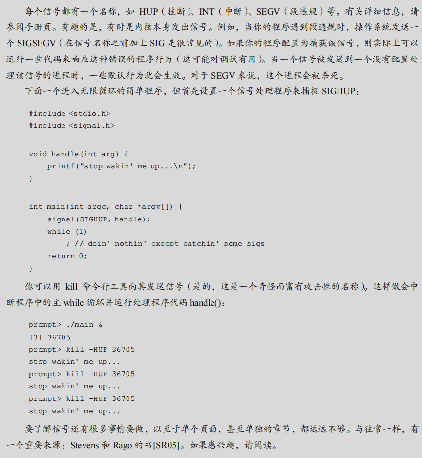

# 第33章 基于事件的并发（进阶）

​		目前为止，我们提到的并发，似乎只能用线程来实现。就像生活中的许多事，这不完全对。具体来说，一些基于图形用户界面（GUI）的应用[O96]，或某些类型的网络服务器[PDZ99]，常常采用另一种并发方式。这种方式称为基于事件的并发（event-based concurrency），在一些现代系统中较为流行，比如 node.js[N13]，但它源自于 C/UNIX 系统，我们下面将讨论。

​		基于事件的并发针对两方面的问题。一方面是多线程应用中，正确处理并发很有难度。正如我们讨论的，忘加锁、死锁和其他烦人的问题会发生。另一方面，开发者无法控制多线程在某一时刻的调度。程序员只是创建了线程，然后就依赖操作系统能够合理地调度线程。要实现一个在各种不同负载下，都能够良好运行的通用调度程序，是极有难度的。因此，某些时候操作系统的调度并不是最优的。关键问题如下。


## 33.1 基本想法：事件循环

在基于事件的并发模型中，不使用传统的多线程并发处理，而是依赖一个事件循环（event loop）来处理并发任务。事件循环的基本思想非常简单，它等待某个事件的发生，当事件发生时，就会处理该事件，然后继续等待下一个事件。这种方法避免了多线程并发中的一些常见问题，如死锁和复杂的调度问题。

事件循环的伪代码如下：

```C
while (1) { 
    events = getEvents(); 
    for (e in events) 
        processEvent(e); 
}
```

在这个循环中，`getEvents()`负责获取所有已经发生的事件，然后`processEvent(e)`处理每个事件。事件循环的优点之一是它对调度有显式的控制，这意味着程序可以决定何时处理哪个事件，而不是依赖操作系统的调度机制。

### 原文：

​		我们使用的基本方法就是基于事件的并发（event-based concurrency）。该方法很简单：我们等待某事（即“事件”）发生；当它发生时，检查事件类型，然后做少量的相应工作（可能是 I/O 请求，或者调度其他事件准备后续处理）。这就好了！

​		在深入细节之前，我们先看一个典型的基于事件的服务器。==这种应用都是基于一个简单的结构，称为事件循环（event loop）==。事件循环的伪代码如下：

```C
while (1) { 
 events = getEvents(); 
 for (e in events) 
 processEvent(e); 
}
```

​		它确实如此简单。主循环等待某些事件发生（通过 getEvents()调用），然后依次处理这些发生的事件。处理事件的代码叫作事件处理程序（event handler）。==重要的是，处理程序在处理一个事件时，它是系统中发生的唯一活动。因此，调度就是决定接下来处理哪个事件。这种对调度的显式控制，是基于事件方法的一个重要优点。==

​		但这也带来一个更大的问题：**基于事件的服务器如何决定哪个事件发生**，尤其是对于网络和磁盘 I/O？具体来说，**事件服务器如何确定是否有它的消息已经到达**？


## 33.2 重要 API：select()（或 poll()）

​		为了实现基于事件的并发模型，事件循环需要一种方法来检测是否有事件发生，特别是在处理网络和磁盘 I/O 时。大多数操作系统提供了`select()`或`poll()`系统调用来支持这一功能。这些调用允许程序检查文件描述符，看看它们是否有数据可读或可写，从而决定是否应该处理这些描述符。

### `select()`函数

`select()`的原型如下：

```C
int select(int nfds, 
    fd_set *restrict readfds, 
    fd_set *restrict writefds, 
    fd_set *restrict errorfds, 
    struct timeval *restrict timeout);
```

- `nfds`：指定要检查的文件描述符的数量。
- `readfds`：指向一组文件描述符的指针，用于检查它们是否可以读取。
- `writefds`：指向一组文件描述符的指针，用于检查它们是否可以写入。
- `errorfds`：指向一组文件描述符的指针，用于检查是否有异常情况。
- `timeout`：指定`select()`调用等待的最长时间。如果设置为`NULL`，`select()`将无限期等待直到有描述符变得可用。

​		`select()`返回已经准备好的描述符的数量，这样程序就可以处理这些描述符。通常情况下，基于事件的服务器会使用`select()`来实现非阻塞I/O，从而避免整个服务器因为一个阻塞调用而被挂起。

### 阻塞与非阻塞接口

​		阻塞（同步）接口在完成任务后才会返回，而非阻塞（异步）接口则会在开始任务后立即返回，任务在后台继续执行。对于基于事件的并发模型，非阻塞接口是至关重要的，因为阻塞调用会阻止事件循环继续处理其他事件，导致系统挂起。

### 小结

​		基于事件的并发模型是处理并发任务的一种有效方式，尤其适用于需要处理大量 I/O 操作的服务器。通过使用事件循环和`select()`或`poll()`系统调用，程序可以检测并处理事件，而不需要依赖复杂的多线程模型。这种方法不仅简化了并发编程，还避免了许多多线程编程中的常见问题。

### 原文：

​		知道了基本的事件循环，我们接下来必须解决如何接收事件的问题。大多数系统提供了基本的 API，即通过 select()或 poll()系统调用。这些接口对程序的支持很简单：检查是否有任何应该关注的进入 I/O。例如，假定网络应用程序（如 Web 服务器）希望检查是否有网络数据包已到达，以便为它们提供服务。这些系统调用就让你做到这一点。

​		下面以 select()为例，手册页（在 macOS X 上）以这种方式描述 API：

```C
int select(int nfds, 
 fd_set *restrict readfds, 
 fd_set *restrict writefds, 
 fd_set *restrict errorfds, 
 struct timeval *restrict timeout);
```

​		手册页中的实际描述：select()检查 I/O 描述符集合，它们的地址通过 readfds、writefds和 errorfds 传入，分别查看它们中的某些描述符是否已准备好读取，是否准备好写入，或有异常情况待处理。在每个集合中检查前 nfds 个描述符，即检查描述符集合中从 0 到 nfds-1的描述符。返回时，select()用给定请求操作准备好的描述符组成的子集替换给定的描述符集合。select()返回所有集合中就绪描述符的总数。


​		关于 select()有几点要注意。首先，请注意，它可以让你检查描述符是否可以读取和写入。前者让服务器确定新数据包已到达并且需要处理，而后者则让服务知道何时可以回复（即出站队列未满）。

​		其次，请注意超时参数。这里的一个常见用法是将超时设置为 NULL，这会导致 select()无限期地阻塞，直到某个描述符准备就绪。但是，更健壮的服务器通常会指定某种超时。一种常见的技术是将超时设置为零，因此让调用 select()立即返回。

​		poll()系统调用非常相似。有关详细信息，请参阅其手册页或 Stevens 和 Rago 的书[SR05]。

​		无论哪种方式，这些基本原语为我们提供了一种构建非阻塞事件循环的方法，它可以简单地检查传入数据包，从带有消息的套接字中读取数据，并根据需要进行回复。


## 33.3 使用 `select()`

​		为了更具体地说明如何使用 `select()` 来检测哪些网络描述符上有传入消息，下面是一段简单的示例代码，如图 33.1 所示：

```C
#include <stdio.h> 
#include <stdlib.h> 
#include <sys/time.h> 
#include <sys/types.h> 
#include <unistd.h> 

int main(void) { 
    // open and set up a bunch of sockets (not shown) 
    // main loop 
    while (1) { 
        // initialize the fd_set to all zero 
        fd_set readFDs; 
        FD_ZERO(&readFDs); 
        
        // now set the bits for the descriptors 
        // this server is interested in 
        // (for simplicity, all of them from min to max) 
        int fd; 
        for (fd = minFD; fd < maxFD; fd++) 
            FD_SET(fd, &readFDs); 
        
        // do the select 
        int rc = select(maxFD+1, &readFDs, NULL, NULL, NULL); 
        
        // check which actually have data using FD_ISSET() 
        for (fd = minFD; fd < maxFD; fd++) 
            if (FD_ISSET(fd, &readFDs)) 
                processFD(fd); 
    } 
}
```

​		这段代码展示了一个简单的事件循环。在每次循环中，`FD_ZERO()` 用于清空文件描述符集合，然后 `FD_SET()` 将所有从 `minFD` 到 `maxFD` 的文件描述符添加到集合中。随后，通过 `select()` 函数检测哪些描述符有数据可读。`FD_ISSET()` 函数则用于检查哪些描述符已经准备好数据，并调用 `processFD(fd)` 处理这些描述符。

​		实际的服务器会更加复杂，包含发送消息、执行磁盘 I/O 等逻辑。关于更多详细信息，可以参考 Stevens 和 Rago 的书籍 [SR05]。

### 原文：

​		为了让这更具体，我们来看看如何使用 select()来查看哪些网络描述符在它们上面有传入消息。图 33.1 展示了一个简单的例子。

以下是使用 `select()` 函数的简单服务器代码，包含详细的注释和对其工作过程的简要分析。

```c
#include <stdio.h> 
#include <stdlib.h> 
#include <sys/time.h> 
#include <sys/types.h> 
#include <unistd.h> 

int minFD = 0;   // 假设最小的文件描述符
int maxFD = 10;  // 假设最大的文件描述符

void processFD(int fd) {
    // 处理有数据的文件描述符（具体逻辑省略）
    printf("Processing FD: %d\n", fd);
}

int main(void) { 
    // 假设已打开并设置了一些套接字（代码未显示）

    // 主循环
    while (1) { 
        // 初始化 fd_set，将所有位设置为 0
        fd_set readFDs; 
        FD_ZERO(&readFDs); // 清空描述符集

        // 设置服务器感兴趣的文件描述符
        // (为简化，假设是从 minFD 到 maxFD 的所有描述符)
        int fd; 
        for (fd = minFD; fd < maxFD; fd++) 
            FD_SET(fd, &readFDs); // 将描述符 fd 添加到集合中

        // 调用 select 函数，等待文件描述符变为可读
        int rc = select(maxFD+1, &readFDs, NULL, NULL, NULL); 

        // 检查哪些描述符实际有数据可读
        for (fd = minFD; fd < maxFD; fd++) 
            if (FD_ISSET(fd, &readFDs)) // 检查描述符 fd 是否在集合中
                processFD(fd); // 处理该文件描述符
    } 
}
```

#### 代码分析：

1. **`fd_set` 和 `FD_ZERO()`**：
   - `fd_set` 是一个位集合，用于保存文件描述符的集合。
   - `FD_ZERO(&readFDs)` 清空 `fd_set`，将所有位设为 0，准备开始设置文件描述符。
2. **`FD_SET()`**：
   - 使用 `FD_SET(fd, &readFDs)` 将当前感兴趣的文件描述符 `fd` 添加到集合中。
   - 在这个例子中，假设所有的文件描述符从 `minFD` 到 `maxFD` 都是感兴趣的，因此在循环中依次将它们加入集合。
3. **`select()`**：
   - `select(maxFD+1, &readFDs, NULL, NULL, NULL)` 调用 `select` 函数，监听 `readFDs` 中的文件描述符，看哪些是可读的。
   - 参数解释：
     - `maxFD+1` 是监听的文件描述符的范围。
     - `&readFDs` 是我们感兴趣的可读文件描述符集合。
     - `NULL` 表示我们不关心可写和异常的文件描述符。
     - `NULL` 超时时间设置为无限，表示阻塞等待直到有描述符可用。
4. **`FD_ISSET()`**：
   - `FD_ISSET(fd, &readFDs)` 用来检查文件描述符 `fd` 是否在 `readFDs` 集合中，并且已经变为可读。
   - 如果 `FD_ISSET` 返回 true，则调用 `processFD(fd)` 来处理这个文件描述符。

#### 总结：

- 这段代码实现了一个简单的事件循环，使用 `select()` 系统调用来监听多个文件描述符的可读状态。
- 当有文件描述符变为可读时，`select()` 返回，程序使用 `FD_ISSET()` 检查哪些文件描述符有数据可读，并进行处理。
- 通过这种方式，服务器可以同时处理多个连接而不需要为每个连接创建一个线程或进程，从而提高了效率和可扩展性。


​		这段代码实际上很容易理解。初始化完成后，服务器进入无限循环。在循环内部，它使用 FD_ZERO()宏首先清除文件描述符集合，然后使用 FD_SET()将所有从 minFD 到 maxFD的文件描述符包含到集合中。例如，这组描述符可能表示服务器正在关注的所有网络套接字。最后，服务器调用 select()来查看哪些连接有可用的数据。然后，通过在循环中使用FD_ISSET()，事件服务器可以查看哪些描述符已准备好数据并处理传入的数据。

​		当然，真正的服务器会比这更复杂，并且在发送消息、发出磁盘 I/O 和许多其他细节时需要使用逻辑。想了解更多信息，请参阅 Stevens 和 Rago 的书 [SR05]，了解 API 信息，或Pai 等人的论文、Welsh 等人的论文[PDZ99，WCB01]，以便对基于事件的服务器的一般流程有一个很好的总体了解。


## 33.4 为何更简单？无须锁

​		在使用单个 CPU 和基于事件的应用程序时，并发程序中通常遇到的问题（如死锁）并不存在。由于基于事件的方法是单线程的，因此一次只处理一个事件，不需要使用锁。这样避免了线程间的中断问题，也避免了多线程编程中的常见并发性错误。


## 33.5 一个问题：阻塞系统调用

​		虽然基于事件的编程方式听起来很理想，但它有一个显著的问题：如果某个事件处理程序需要发出可能会阻塞的系统调用怎么办？

​		例如，假设一个服务器接收到客户端的请求，需要从磁盘读取一个文件并将其返回给客户端。为了完成这个任务，服务器可能需要执行 `open()` 和一系列 `read()` 系统调用，而这些调用可能会阻塞，等待磁盘 I/O 完成。

​		==在基于线程的服务器中，这不是一个问题，因为其他线程可以继续执行。而在基于事件的服务器中，由于它是单线程的，如果某个事件处理程序阻塞了整个事件循环，整个服务器都会被阻塞，导致资源浪费。==

### 原文：

​		到目前为止，基于事件的编程听起来很棒，对吧？编写一个简单的循环，然后在事件发生时处理事件。甚至不需要考虑锁！但是有一个问题：如果某个事件要求你发出可能会阻塞的系统调用，该怎么办？

​		例如，假定一个请求从客户端进入服务器，要从磁盘读取文件并将其内容返回给发出请求的客户端（很像简单的 HTTP 请求）。为了处理这样的请求，某些事件处理程序最终将不得不发出 open()系统调用来打开文件，然后通过一系列 read()调用来读取文件。当文件被读入内存时，服务器可能会开始将结果发送到客户端。

​		open()和 read()调用都可能向存储系统发出 I/O 请求（当所需的元数据或数据不在内存中时），因此可能需要很长时间才能提供服务。使用基于线程的服务器时，这不是问题：在发出 I/O 请求的线程挂起（等待 I/O 完成）时，其他线程可以运行，从而使服务器能够取得进展。事实上，I/O 和其他计算的自然重叠（overlap）使得基于线程的编程非常自然和直接。

​		但是，使用基于事件的方法时，没有其他线程可以运行：只是主事件循环。这意味着如果一个事件处理程序发出一个阻塞的调用，整个服务器就会这样做：阻塞直到调用完成。当事件循环阻塞时，系统处于闲置状态，因此是潜在的巨大资源浪费。因此，我们在基于事件的系统中必须遵守一条规则：不允许阻塞调用。


## 33.6 解决方案：==异步 I/O==

​		为了克服阻塞调用的问题，==许多现代操作系统引入了异步 I/O（asynchronous I/O）。异步 I/O 允许应用程序发出 I/O 请求，并在 I/O 完成之前立即返回控制权。==应用程序可以通过其他接口来检查这些 I/O 是否完成。

### 示例：macOS 上的异步 I/O

在 macOS 上，异步 I/O 通过 `struct aiocb`（AIO 控制块）来实现。`struct aiocb` 的简化版本如下：

```C
struct aiocb { 
    int aio_fildes;    /* File descriptor */ 
    off_t aio_offset;  /* File offset */ 
    volatile void *aio_buf; /* Location of buffer */ 
    size_t aio_nbytes; /* Length of transfer */ 
};
```

要进行异步读取，应用程序需要先填充该结构，然后调用 `aio_read()` 函数：

```C
int aio_read(struct aiocb *aiocbp);
```

`aio_read()` 调用会尝试发出 I/O 请求并立即返回，应用程序可以继续执行其他任务。

为了检查 I/O 请求是否完成，应用程序可以使用 `aio_error()` 函数：

```C
int aio_error(const struct aiocb *aiocbp);
```

该函数返回 0 表示 I/O 已完成，返回 `EINPROGRESS` 表示 I/O 尚未完成。

### 补充：**UNIX** 信号

​		所有现代 UNIX 变体都有一个称为信号（signal）的巨大而迷人的基础设施。最简单的信号提供了一种与进程进行通信的方式。具体来说，可以将信号传递给应用程序。这样做会让应用程序停止当前的任何工作，开始运行信号处理程序（signal handler），即应用程序中某些处理该信号的代码。完成后，该进程就恢复其先前的行为。

​		每个信号都有一个名称，如 HUP（挂断）、INT（中断）、SEGV（段违规）等。有关详细信息，请参阅手册页。有趣的是，有时是内核本身发出信号。例如，当你的程序遇到段违规时，操作系统发送一个 SIGSEGV（在信号名称之前加上 SIG 是很常见的）。如果你的程序配置为捕获该信号，则实际上可以运行一些代码来响应这种错误的程序行为（这可能对调试有用）。当一个信号被发送到一个没有配置处理该信号的进程时，一些默认行为就会生效。对于 SEGV 来说，这个进程会被杀死。

​		下面一个进入无限循环的简单程序，但首先设置一个信号处理程序来捕捉 SIGHUP：

```C
#include <stdio.h> 
#include <signal.h> 
void handle(int arg) { 
 printf("stop wakin' me up...\n"); 
} 
int main(int argc, char *argv[]) { 
 signal(SIGHUP, handle); 
 while (1) 
 ; // doin' nothin' except catchin' some sigs 
 return 0; 
}
```

​		你可以用 kill 命令行工具向其发送信号（是的，这是一个奇怪而富有攻击性的名称）。这样做会中断程序中的主 while 循环并运行处理程序代码 handle()：

```C
prompt> ./main & 
[3] 36705 
prompt> kill -HUP 36705 
stop wakin' me up... 
prompt> kill -HUP 36705 
stop wakin' me up... 
prompt> kill -HUP 36705 
stop wakin' me up...
```

要了解信号还有很多事情要做，以至于单个页面，甚至单独的章节，都远远不够。与往常一样，有一个重要来源：Stevens 和 Rago 的书[SR05]。如果感兴趣，请阅读。


​		在没有异步 I/O 的系统中，纯基于事件的方法无法实现。然而，聪明的研究人员已经推出了相当适合他们的方法。例如，Pai 等人 [PDZ99]描述了一种使用事件处理网络数据包的混合方法，并且使用线程池来管理未完成的 I/O。详情请阅读他们的论文。

### 总结

基于事件的并发编程可以避免多线程中的许多复杂性，但也需要考虑如何处理可能阻塞的系统调用。异步 I/O 提供了一种解决方案，允许服务器在处理 I/O 请求时不阻塞事件循环，从而提高服务器的并发性能和响应速度。


### 原文：

​		为了克服这个限制，许多现代操作系统已经引入了新的方法来向磁盘系统发出 I/O 请求，一般称为异步 I/O（asynchronous I/O）。这些接口使应用程序能够发出 I/O 请求，并在 I/O 完成之前立即将控制权返回给调用者，另外的接口让应用程序能够确定各种 I/O 是否已完成。例如，让我们来看看在 macOS X 上提供的接口（其他系统有类似的 API）。这些 API围绕着一个基本的结构，即 struct aiocb 或 AIO 控制块（AIO control block）。该结构的简化版本如下所示（有关详细信息，请参阅手册页）：

```C
struct aiocb { 
 int aio_fildes; /* File descriptor */ 
 off_t aio_offset; /* File offset */ 
 volatile void *aio_buf; /* Location of buffer */ 
 size_t aio_nbytes; /* Length of transfer */ 
};
```

​		要向文件发出异步读取，应用程序应首先用相关信息填充此结构：要读取文件的文件描述符（aio_fildes），文件内的偏移量（ai_offset）以及长度的请求（aio_nbytes），最后是应该复制读取结果的目标内存位置（aio_buf）。

​		在填充此结构后，应用程序必须发出异步调用来读取文件。在 macOS X 上，此 API 就是异步读取（asynchronous read）API：

```C
int aio_read(struct aiocb *aiocbp);
```

​		该调用尝试发出 I/O。如果成功，它会立即返回并且应用程序（即基于事件的服务器）可以继续其工作。

​		然而，我们必须解决最后一个难题。我们如何知道 I/O 何时完成，并且缓冲区（由 aio buf指向）现在有了请求的数据？

​		还需要最后一个 API。在 macOS X 上，它被称为 aio_error()（有点令人困惑）。API 看起来像这样：

```C
int aio_error(const struct aiocb *aiocbp); 
```

​		该系统调用检查 aiocbp 引用的请求是否已完成。如果有，则函数返回成功（用零表示）。如果不是，则返回 EINPROGRESS。因此，对于每个未完成的异步 I/O，应用程序可以通过调用 aio_error()来周期性地轮询（poll）系统，以确定所述 I/O 是否尚未完成。

​		你可能已经注意到，检查一个 I/O 是否已经完成是很痛苦的。如果一个程序在某个特定时间点发出数十或数百个 I/O，是否应该重复检查它们中的每一个，或者先等待一会儿，或者……

​		为了解决这个问题，一些系统提供了基于中断（interrupt）的方法。此方法使用 UNIX信号（signal）在异步 I/O 完成时通知应用程序，从而消除了重复询问系统的需要。这种轮询与中断问题也可以在设备中看到，正如你将在 I/O 设备章节中看到的（或已经看到的）。

​		在没有异步 I/O 的系统中，纯基于事件的方法无法实现。然而，聪明的研究人员已经推出了相当适合他们的方法。例如，Pai 等人 [PDZ99]描述了一种使用事件处理网络数据包的混合方法，并且使用线程池来管理未完成的 I/O。详情请阅读他们的论文。





## 33.7 另一个问题：状态管理

​		基于事件的方法的另一个挑战在于状态管理。与基于线程的方法不同，基于事件的代码通常更复杂，因为它需要手动管理程序状态。当事件处理程序发出异步 I/O 请求时，它必须打包一些状态信息，以便在 I/O 完成时，能够在下一个事件处理程序中使用。这种手动栈管理（manual stack management）使得基于事件的编程更加复杂。

​		举个例子，假设一个基于线程的服务器需要从文件描述符（`fd`）中读取数据，并将其写入到一个网络套接字描述符（`sd`）中，代码如下：

```C
int rc = read(fd, buffer, size); 
rc = write(sd, buffer, size); 
```

​		在多线程程序中，这种操作很容易实现。当 `read()` 最终返回时，代码立即知道要写入哪个套接字，因为这些信息保存在线程的堆栈中。

​		然而，==在基于事件的系统中，事情就没有这么简单了。为了实现相同的功能，首先需要使用异步 I/O 调用来发出读取请求，例如使用 `aio_read()`。在读取完成时，基于事件的服务器需要知道接下来应该做什么，这时就需要用到“延续（continuation）”的概念。==

​		延续是一种老的编程语言结构，其核心思想是将需要在事件完成时使用的信息记录在某种数据结构中。==当事件发生（如磁盘 I/O 完成）时，事件处理程序可以查找这些信息并继续处理事件==。例如，可以将套接字描述符 `sd` 记录在由文件描述符 `fd` 索引的某种数据结构中（如哈希表）。当磁盘 I/O 完成时，使用 `fd` 来查找并获取 `sd` 的值，然后将数据写入套接字。


## 33.8 什么事情仍然很难

尽管基于事件的方法有许多优点，但它也有一些固有的难题：

1. **多核环境下的并发控制**：当系统从单个 CPU 转向多核 CPU 时，基于事件的方法中的一些简单性就消失了。==为了利用多个 CPU，事件服务器可能需要并行运行多个事件处理程序，这时就会出现传统的并发控制问题，例如临界区和锁。==
2. **分页（Paging）集成困难**：==基于事件的方法无法与某些系统活动（如分页）很好地集成。==例如，当事件处理程序发生页错误时，它会被阻塞，导致服务器在页错误完成之前无法进展。虽然可以避免显式阻塞，但由于页错误导致的隐式阻塞很难避免。
3. **代码管理复杂**：随着时间的推移，基于事件的代码可能变得难以维护。函数的确切语义可能会随着时间发生变化，特别是当函数从非阻塞变为阻塞时，原本设计为非阻塞的事件处理程序需要重新设计。
4. **异步 I/O 的实现复杂**：==虽然异步磁盘 I/O 现在在大多数平台上都可用，但与异步网络 I/O 的集成并不像想象中那么简单和统一==。例如，通常需要组合使用 `select()`（用于网络 I/O）和 `aio_read()`（用于磁盘 I/O）来管理所有未完成的 I/O。

### 原文：

​		基于事件的方法还有其他一些困难，我们应该指出。例如，当系统从单个 CPU 转向多个 CPU 时，基于事件的方法的一些简单性就消失了。具体来说，为了利用多个 CPU，事件服务器必须并行运行多个事件处理程序。发生这种情况时，就会出现常见的同步问题（例如临界区），并且必须采用通常的解决方案（例如锁定）。因此，在现代多核系统上，无锁的简单事件处理已不再可能。

​		基于事件的方法的另一个问题是，它不能很好地与某些类型的系统活动集成，如分页（paging）。例如，如果事件处理程序发生页错误，它将被阻塞，并且因此服务器在页错误完成之前不会有进展。尽管服务器的结构可以避免显式阻塞，但由于页错误导致的这种隐式阻塞很难避免，因此在频繁发生时可能会导致较大的性能问题。

​		还有一个问题是随着时间的推移，基于事件的代码可能很难管理，因为各种函数的确切语义发生了变化[A+02]。例如，如果函数从非阻塞变为阻塞，调用该例程的事件处理程序也必须更改以适应其新性质，方法是将其自身分解为两部分。由于阻塞对于基于事件的服务器而言是灾难性的，因此程序员必须始终注意每个事件使用的 API 语义的这种变化。

​		最后，虽然异步磁盘 I/O 现在可以在大多数平台上使用，但是花了很长时间才做到这一点[PDZ99]，而且与异步网络 I/O 集成不会像你想象的那样有简单和统一的方式。例如，虽然人们只想使用 select()接口来管理所有未完成的 I/O，但通常需要组合用于网络的 select()和用于磁盘 I/O 的 AIO 调用。

## 33.9 小结

​		==本章讨论了基于事件的并发编程方法。尽管基于事件的方法能够为应用程序提供调度控制，并避免多线程编程中的某些复杂性，但这种方法也带来了状态管理的复杂性和与现代系统其他部分（如分页）的集成困难。==由于这些挑战，线程和事件作为并发编程的两种不同方法，在未来可能会继续共存。想要进一步了解这些技术的读者可以参考相关的研究论文，或者尝试编写基于事件的代码来获得更深入的理解。

### 原文：

​		我们已经介绍了不同风格的基于事件的并发。基于事件的服务器为应用程序本身提供了调度控制，但是这样做的代价是复杂性以及与现代系统其他方面（例如分页）的集成难度。由于这些挑战，没有哪一种方法表现最好。因此，线程和事件在未来很多年内可能会持续作为解决同一并发问题的两种不同方法。阅读一些研究论文（例如[A+02，PDZ99，vB+03，WCB01]），或者写一些基于事件的代码，以了解更多信息，这样更好。