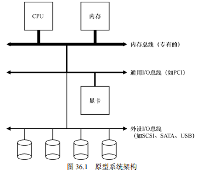
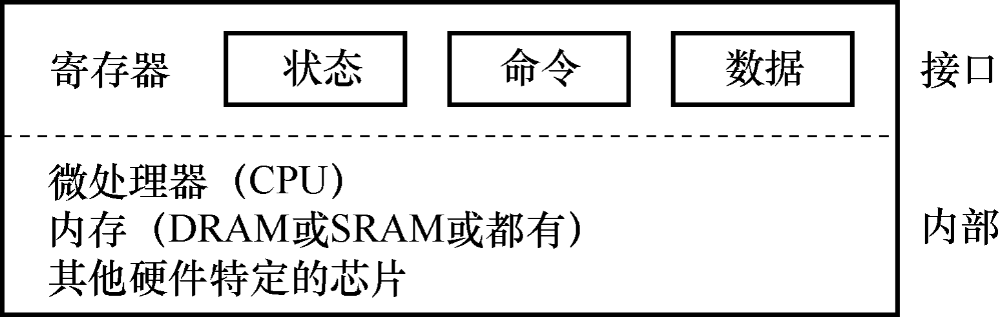
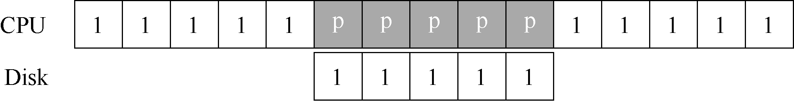
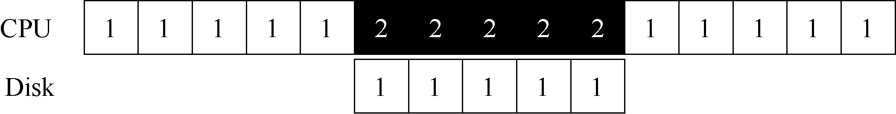
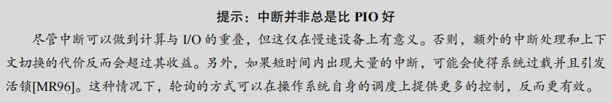
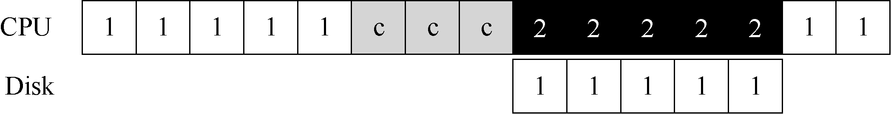
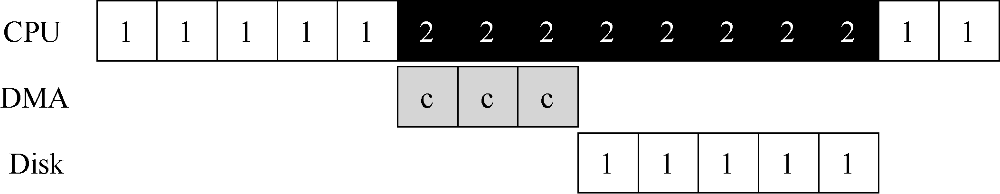
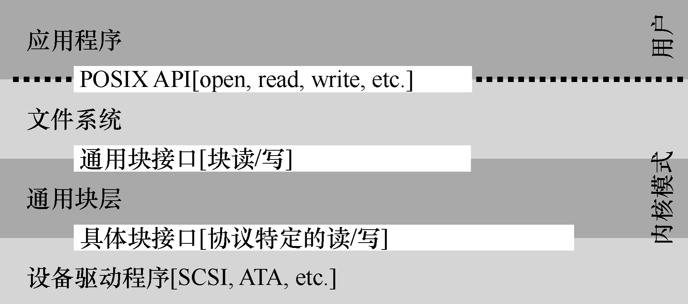

# 第 36 章 I/O 设备

​		在深入讲解持久性部分之前，首先介绍 I/O 设备的概念以及操作系统如何与这些设备进行交互。I/O 对计算机系统至关重要，因为它涉及到程序的输入和输出操作。没有输入和输出的程序是没有实际意义的，因此，关键问题是：如何将 I/O 集成进计算机系统中，使其高效运行？


## 36.1 系统架构

​		我们先来看一个典型的系统架构。==系统中，CPU 通过内存总线与系统内存相连。高性能 I/O 设备（如图像处理设备）通过 I/O 总线连接到系统，而外围设备（如磁盘和鼠标）则通过外围总线（如 SCSI、SATA 或 USB）连接到系统。==该分层架构的原因在于物理布局和造价成本。高性能总线较短且昂贵，因此用于连接需要高性能的设备，而低性能设备则通过外围总线连接，这样可以连接更多的设备。



### 原文：

​		开始讨论之前，我们先看一个典型系统的架构（见图 36.1）。其中，CPU 通过某种内存总线（memory bus）或互连电缆连接到系统内存。图像或者其他高性能 I/O 设备通过常规的I/O 总线（I/O bus）连接到系统，在许多现代系统中会是 PCI 或它的衍生形式。最后，更下面是外围总线（peripheral bus），比如 SCSI、SATA 或者 USB。它们将最慢的设备连接到系统，包括磁盘、鼠标及其他类似设备。


​		你可能会问：为什么要用这样的分层架构？简单回答：==因为物理布局及造价成本。==越快的总线越短，因此高性能的内存总线没有足够的空间连接太多设备。另外，在工程上高性能总线的造价非常高。所以，系统的设计采用了这种分层的方式，这样可以让要求高性能的设备（比如显卡）离 CPU 更近一些，低性能的设备离 CPU 远一些。将磁盘和其他低速设备连到外围总线的好处很多，其中较为突出的好处就是你可以在外围总线上连接大量的设备。

## 36.2 标准设备

为了理解设备交互机制，我们通过一个标准设备的例子来说明。标准设备由两个重要组件组成：

1. ==**硬件接口**：提供给系统其他部分的接口，使系统软件能够控制设备的操作。==所有设备都有自己的接口和交互协议。
2. ==**内部结构**：设备的内部实现部分，负责具体实现设备所展示的抽象接口。==简单设备可能只包含一个或几个芯片，而复杂设备则可能包含简单的 CPU、通用内存和特定芯片。

#### 原文：

​		现在来看一个标准设备（不是真实存在的），通过它来帮助我们更好地理解设备交互的机制。从图 36.2 中，可以看到一个包含两部分重要组件的设备。第一部分是向系统其他部分展现的硬件接口（interface）。同软件一样，硬件也需要一些接口，让系统软件来控制它的操作。因此，所有设备都有自己的特定接口以及典型交互的协议。

​		第 2 部分是它的内部结构（internal structure）。这部分包含设备相关的特定实现，负责具体实现设备展示给系统的抽象接口。非常简单的设备通常用一个或几个芯片来实现它们的功能。更复杂的设备会包含简单的 CPU、一些通用内存、设备相关的特定芯片，来完成它们的工作。例如，现代 RAID 控制器通常包含成百上千行固件（firmware，即硬件设备中的软件），以实现其功能。




## 36.3 标准协议

​		==一个典型的设备接口包含三个寄存器：状态寄存器、命令寄存器和数据寄存器。==操作系统通过读写这些寄存器来控制设备的行为。与设备的交互过程通常包括以下步骤：

1. 操作系统轮询**状态寄存器**，等待设备进入就绪状态。
2. 当设备就绪后，操作系统将**数据写入数据寄存器****。
3. 操作系统**将命令写入命令寄存器**，设备开始执行命令。
4. 操作系统再次**轮询设备状态**，等待设备完成命令执行。

​		这个协议简单有效，但在等待设备完成命令时，轮询过程可能会浪费大量 CPU 时间，从而导致低效。为了解决这一问题，操作系统需要优化策略，以减少轮询带来的开销。

### 原文：

​		在图 36.2 中，一个（简化的）设备接口包含 3 个寄存器：一个状态（status）寄存器，可以读取并查看设备的当前状态；一个命令（command）寄存器，用于通知设备执行某个具体任务；一个数据（data）寄存器，将数据传给设备或从设备接收数据。通过读写这些寄存器，操作系统可以控制设备的行为。

​		我们现在来描述操作系统与该设备的典型交互，以便让设备为它做某事。协议如下：

```C
While (STATUS == BUSY) 
 	; // wait until device is not busy 
Write data to DATA register 
Write command to COMMAND register 
 	(Doing so starts the device and executes the command) 
While (STATUS == BUSY) 
 	; // wait until device is done with your request
```

​		该协议包含 4 步。第 1 步，操作系统通过反复读取状态寄存器，等待设备进入可以接收命令的就绪状态。我们称之为轮询（polling）设备（基本上，就是问它正在做什么）。第2 步，操作系统下发数据到数据寄存器。例如，你可以想象如果这是一个磁盘，需要多次写入操作，将一个磁盘块（比如 4KB）传递给设备。如果主 CPU 参与数据移动（就像这个示例协议一样），我们就称之为编程的 I/O（programmed I/O，PIO）。第 3 步，操作系统将命令写入命令寄存器；这样设备就知道数据已经准备好了，它应该开始执行命令。最后一步，操作系统再次通过不断轮询设备，等待并判断设备是否执行完成命令（有可能得到一个指示成功或失败的错误码）。

​		这个简单的协议好处是足够简单并且有效。但是难免会有一些低效和不方便。我们注意到这个协议存在的第一个问题就是轮询过程比较低效，在等待设备执行完成命令时浪费大量 CPU 时间，如果此时操作系统可以切换执行下一个就绪进程，就可以大大提高 CPU 的利用率。


## 36.4 利用中断减少 CPU 开销

​		==为了减少CPU在轮询设备状态时浪费的时间，中断机制被引入。**中断允许设备在完成任务后主动通知CPU，而不需要CPU不断地检查设备状态**。==通过中断，操作系统可以让发出I/O请求的进程进入睡眠，并调度其他进程执行。当设备完成操作后，触发中断，操作系统执行中断服务程序（ISR），处理完设备的请求并唤醒等待的进程。这种机制允许计算与I/O操作并行进行，提高了CPU的利用率。

**优化策略**：

- 如果设备处理速度非常快，轮询可能比中断更有效，因为上下文切换和中断处理的开销可能会超过其收益。
- 在某些场景下（如高频网络数据包的处理），使用中断可能导致系统过载或活锁，此时适度轮询或中断合并（多个中断合并为一次）可以更好地控制系统行为。

### 原文：

​		多年前，工程师们发明了我们目前已经很常见的中断（interrupt）来减少 CPU 开销。有了中断后，CPU 不再需要不断轮询设备，而是向设备发出一个请求，然后就可以让对应进程睡眠，切换执行其他任务。当设备完成了自身操作，会抛出一个硬件中断，引发 CPU 跳转执行操作系统预先定义好的中断服务例程（Interrupt Service Routine，ISR），或更为简单的中断处理程序（interrupt handler）。中断处理程序是一小段操作系统代码，它会结束之前的请求（比如从设备读取到了数据或者错误码）并且唤醒等待 I/O 的进程继续执行。

​		因此，==中断允许计算与 I/O 重叠（overlap），这是提高 CPU 利用率的关键==。下面的时间线展示了这一点：




​		其中，进程 1 在 CPU 上运行一段时间（对应 CPU 那一行上重复的 1），然后发出一个读取数据的 I/O 请求给磁盘。==如果没有中断，那么操作系统就会简单自旋，不断轮询设备状态，直到设备完成 I/O 操作（对应其中的 p）。==当设备完成请求的操作后，进程 1 又可以继续运行。

​		如果我们利用中断并允许重叠，操作系统就可以在等待磁盘操作时做其他事情：




​		在这个例子中，在磁盘处理进程 1 的请求时，操作系统在 CPU 上运行进程 2。磁盘处理完成后，触发一个中断，然后操作系统唤醒进程 1 继续运行。这样，在这段时间，无论CPU 还是磁盘都可以有效地利用。

​		注意，==使用中断并非总是最佳方案。假如有一个非常高性能的设备，它处理请求很快：通常在 CPU 第一次轮询时就可以返回结果。此时如果使用中断，反而会使系统变慢：切换到其他进程，处理中断，再切换回之前的进程代价不小。==因此，**如果设备非常快，那么最好的办法反而是轮询。如果设备比较慢，那么采用允许发生重叠的中断更好**。如果设备的速度未知，或者时快时慢，可以考虑使用混合（hybrid）策略，先尝试轮询一小段时间，如果设备没有完成操作，此时再使用中断。这种两阶段（two-phased）的办法可以实现两种方法的好处。



​		另一个最好不要使用中断的场景是网络。网络端收到大量数据包，如果每一个包都发生一次中断，那么有可能导致操作系统发生活锁（livelock），即不断处理中断而无法处理用户层的请求。例如，假设一个 Web 服务器因为“点杠效应”而突然承受很重的负载。这种情况下，偶尔使用轮询的方式可以更好地控制系统的行为，并允许 Web 服务器先服务一些用户请求，再回去检查网卡设备是否有更多数据包到达。

​		另一个基于中断的优化就是合并（coalescing）。设备在抛出中断之前往往会等待一小段时间，在此期间，其他请求可能很快完成，因此多次中断可以合并为一次中断抛出，从而降低处理中断的代价。当然，等待太长会增加请求的延迟，这是系统中常见的折中。参见Ahmad 等人的文章[A+11]，有精彩的总结。


## 36.5 利用DMA进行更高效的数据传送

​		==为了减少编程I/O（PIO）带来的CPU负载，直接内存访问（DMA）技术被引入。DMA是一种特殊的硬件机制，允许数据在内存和设备之间传输时无需CPU参与。==操作系统通过编程DMA引擎，指定数据的位置、大小和目标设备，然后DMA负责完成数据传输。==在DMA执行任务时，CPU可以继续处理其他任务，提高了系统整体的效率。当DMA任务完成后，它会触发中断通知操作系统数据传输已经完成。==

​		这种机制进一步优化了I/O操作，使得CPU能够处理更多的进程，最大化资源利用率。

### 原文：

​		标准协议还有一点需要我们注意。具体来说，如果使用编程的 I/O 将一大块数据传给设备，CPU 又会因为琐碎的任务而变得负载很重，浪费了时间和算力，本来更好是用于运行其他进程。下面的时间线展示了这个问题：



​		进程 1 在运行过程中需要向磁盘写一些数据，所以它开始进行 I/O 操作，将数据从内存拷贝到磁盘（其中标示 c 的过程）。拷贝结束后，磁盘上的 I/O 操作开始执行，此时 CPU 才可以处理其他请求。


​		解决方案就是使用 DMA（Direct Memory Access）。DMA 引擎是系统中的一个特殊设备，它可以协调完成内存和设备间的数据传递，不需要 CPU 介入。

​		DMA 工作过程如下。为了能够将数据传送给设备，操作系统会通过编程告诉 DMA 引擎数据在内存的位置，要拷贝的大小以及要拷贝到哪个设备。在此之后，操作系统就可以处理其他请求了。当 DMA 的任务完成后，DMA 控制器会抛出一个中断来告诉操作系统自己已经完成数据传输。修改后的时间线如下：



​		从时间线中可以看到，数据的拷贝工作都是由 DMA 控制器来完成的。因为 CPU 在此时是空闲的，所以操作系统可以让它做一些其他事情，比如此处调度进程 2 到 CPU 来运行。因此进程 2 在进程 1 再次运行之前可以使用更多的 CPU。


## 36.6 设备交互的方法

​		==操作系统与设备通信的方式有两种：明确的I/O指令和内存映射I/O。==通过I/O指令，==操作系统可以使用特定的指令（如x86上的`in`和`out`指令）与设备交互，向特定寄存器或端口发送数据。==这类指令通常是特权指令，只有操作系统能执行，以确保系统的安全性。

​		==内存映射I/O则是通过**将设备寄存器映射为内存地址**来实现的。==操作系统通过读写这些内存地址与设备通信，硬件将这些操作转发到设备上。这种方法无需引入新的指令，但与I/O指令相比，两者在当前系统中都有应用。

#### 原文：

​		现在，我们了解了执行 I/O 涉及的效率问题后，还有其他一些问题需要解决，以便将设备合并到系统中。你可能已经注意到了一个问题：我们还没有真正讨论过操作系统究竟如何与设备进行通信！所以问题如下。


​		随着技术的不断发展，主要有两种方式来实现与设备的交互。第一种办法相对老一些（在 IBM 主机中使用了多年），就是用明确的 I/O 指令。这些指令规定了操作系统将数据发送到特定设备寄存器的方法，从而允许构造上文提到的协议。

​		例如在 x86 上，in 和 out 指令可以用来与设备进行交互。当需要发送数据给设备时，调用者指定一个存入数据的特定寄存器及一个代表设备的特定端口。执行这个指令就可以实现期望的行为。

​		这些指令通常是特权指令（privileged）。操作系统是唯一可以直接与设备交互的实体。例如，设想如果任意程序都可以直接读写磁盘：完全混乱（总是会这样），因为任何用户程序都可以利用这个漏洞来取得计算机的全部控制权。

​		第二种方法是内存映射 I/O（memory- mapped I/O）。通过这种方式，硬件将设备寄存器作为内存地址提供。当需要访问设备寄存器时，操作系统装载（读取）或者存入（写入）到该内存地址；然后硬件会将装载/存入转移到设备上，而不是物理内存。

​		两种方法没有一种具备极大的优势。内存映射 I/O 的好处是不需要引入新指令来实现设备交互，但两种方法今天都在使用。


### 36.7 纳入操作系统：设备驱动程序

​		为使==操作系统尽可能通用且设备无关，使用了设备驱动程序来处理设备的具体操作细节==。**驱动程序将设备的操作封装起来，使操作系统的其他部分无需关心具体设备的实现细节**。例如，在Linux文件系统栈中，文件系统通过通用块设备层与设备驱动程序通信，块设备层将请求转发给相应的驱动程序，驱动程序处理具体的硬件操作。

​		==尽管这种封装简化了操作系统的设计，但也有缺陷。某些设备的特殊功能可能无法通过通用接口使用。此外，由于每个设备都需要驱动程序，驱动程序代码占据了内核代码的很大一部分（超过70%）==。由于许多驱动程序的开发者并非全职内核开发者，驱动程序成为系统崩溃的主要原因之一。


#### 原文：

​		最后我们要讨论一个问题：每个设备都有非常具体的接口，如何将它们纳入操作系统，而我们希望操作系统尽可能通用。例如文件系统，我们希望开发一个文件系统可以工作在SCSI 硬盘、IDE 硬盘、USB 钥匙串设备等设备之上，并且希望这个文件系统不那么清楚对这些不同设备发出读写请求的全部细节。因此，我们的问题如下。

****

​		这个问题可以通过古老的抽象（abstraction）技术来解决。在最底层，操作系统的一部分软件清楚地知道设备如何工作，我们将这部分软件称为设备驱动程序（device driver），所有设备交互的细节都封装在其中。

​		我们来看看 Linux 文件系统栈，理解抽象技术如何应用于操作系统的设计和实现。图36.3 粗略地展示了 Linux 软件的组织方式。可以看出，文件系统（当然也包括在其之上的应用程序）完全不清楚它使用的是什么类型的磁盘。它只需要简单地向通用块设备层发送读写请求即可，块设备层会将这些请求路由给对应的设备驱动，然后设备驱动来完成真正的底层操作。尽管比较简单，但图 36.3 展示了这些细节如何对操作系统的大部分进行隐藏。



图 36.3 文件系统栈

​		注意，这种封装也有不足的地方。例如，如果有一个设备可以提供很多特殊的功能，但为了兼容大多数操作系统它不得不提供一个通用的接口，这样就使得自身的特殊功能无法使用。这种情况在使用 SCSI 设备的 Linux 中就发生了。SCSI 设备提供非常丰富的报告错误信息，但其他的块设备（比如 ATA/IDE）只提供非常简单的报错处理，这样上层的所有软件只能在出错时收到一个通用的 EIO 错误码（一般 IO 错误），SCSI 可能提供的所有附加信息都不能报告给文件系统[G08]。

​		有趣的是，因为所有需要插入系统的设备都需要安装对应的驱动程序，所以久而久之，驱动程序的代码在整个内核代码中的占比越来越大。查看 Linux 内核代码会发现，超过 70%的代码都是各种驱动程序。在 Windows 系统中，这样的比例同样很高。因此，如果有人跟你说操作系统包含上百万行代码，实际的意思是包含上百万行驱动程序代码。当然，任何安装进操作系统的驱动程序，大部分默认都不是激活状态（只有一小部分设备是在系统刚开启时就需要连接）。更加令人沮丧的是，因为驱动程序的开发者大部分是“业余的”（不是全职内核开发者），所以他们更容易写出缺陷，因此是内核崩溃的主要贡献者[S03]。


### 36.8 案例研究：简单的 IDE 磁盘驱动程序

在本节中，我们通过一个简单的 IDE 磁盘驱动程序的例子来更深入地了解设备驱动程序的工作原理，尤其是在 xv6 操作系统中的实现。

#### IDE 磁盘的基本接口

==IDE 硬盘向操作系统提供了一个简单的接口，其中包含四种类型的寄存器：控制寄存器、命令块寄存器、状态寄存器和错误寄存器。==在 x86 架构上，可以使用 I/O 指令 `in` 和 `out` 来访问这些寄存器，具体地址和功能如下：

- **控制寄存器（Control Register）**：地址为 `0x3F6`，用于控制设备复位和中断启用。
- **命令块寄存器（Command Block Registers）**：地址范围为 `0x1F0` 到 `0x1F7`，包括数据端口、错误寄存器、扇区计数器、逻辑块地址（LBA）寄存器和命令寄存器。
- **状态寄存器（Status Register）**：地址为 `0x1F7`，包括设备状态标志，如忙碌（BUSY）、就绪（READY）、数据请求（DRQ）等。
- **错误寄存器（Error Register）**：地址为 `0x1F1`，在状态寄存器的错误标志置位时，用于检查详细的错误信息。

#### 与 IDE 设备交互的基本协议

与 IDE 设备进行交互的基本协议包括以下步骤：

1. **等待设备就绪**：读取状态寄存器，直到设备 READY 且未忙碌为止。
2. **设置命令参数**：写入扇区数量和 LBA 地址，并指定驱动编号。
3. **启动 I/O 操作**：向命令寄存器写入读取或写入命令。
4. **数据传输**：对于写操作，等待设备准备好接收数据，然后将数据写入数据端口。
5. **中断处理**：每个扇区的传输结束后处理中断，或者批量处理数据后触发中断。
6. **错误处理**：操作完成后检查状态寄存器，必要时读取错误寄存器获取详细错误信息。

#### xv6 中的 IDE 驱动程序实现

xv6 操作系统中的 IDE 驱动程序实现了上述协议，主要由以下函数组成：

- **`ide_wait_ready()`**：等待驱动就绪，通过反复读取状态寄存器，直到设备不再忙碌并且处于就绪状态。

  ```C
  static int ide_wait_ready() { 
    while (((int r = inb(0x1f7)) & IDE_BSY) || !(r & IDE_DRDY)) 
      ; // loop until drive isn't busy 
  }
  ```

- **`ide_start_request()`**：开始一个 I/O 请求，将请求发送给磁盘。如果是写操作，还会发送数据。

  ```C
  static void ide_start_request(struct buf *b) { 
    ide_wait_ready(); 
    outb(0x3f6, 0); // generate interrupt 
    outb(0x1f2, 1); // how many sectors? 
    outb(0x1f3, b->sector & 0xff); // LBA goes here ... 
    outb(0x1f4, (b->sector >> 8) & 0xff); // ... and here 
    outb(0x1f5, (b->sector >> 16) & 0xff); // ... and here! 
    outb(0x1f6, 0xe0 | ((b->dev&1)<<4) | ((b->sector>>24)&0x0f)); 
    if(b->flags & B_DIRTY){ 
      outb(0x1f7, IDE_CMD_WRITE); // this is a WRITE 
      outsl(0x1f0, b->data, 512/4); // transfer data too! 
    } else { 
      outb(0x1f7, IDE_CMD_READ); // this is a READ (no data) 
    } 
  }
  ```

- **`ide_rw()`**：处理读写请求，将请求加入队列，如果队列为空，则直接发送请求到磁盘。等待请求完成时，进程进入睡眠状态。

  ```
  void ide_rw(struct buf *b) { 
    acquire(&ide_lock); 
    for (struct buf **pp = &ide_queue; *pp; pp=&(*pp)->qnext) 
      ; // walk queue 
    *pp = b; // add request to end 
    if (ide_queue == b) // if q is empty 
      ide_start_request(b); // send req to disk 
    while ((b->flags & (B_VALID|B_DIRTY)) != B_VALID) 
      sleep(b, &ide_lock); // wait for completion 
    release(&ide_lock); 
  }
  ```

- **`ide_intr()`**：处理磁盘中断，在读请求时从设备读取数据，并唤醒等待的进程。如果队列中还有其他请求，继续处理下一个请求。

  ```
  void ide_intr() { 
    struct buf *b; 
    acquire(&ide_lock); 
    if (!(b->flags & B_DIRTY) && ide_wait_ready() >= 0) 
      insl(0x1f0, b->data, 512/4); // if READ: get data 
    b->flags |= B_VALID; 
    b->flags &= ~B_DIRTY; 
    wakeup(b); // wake waiting process 
    if ((ide_queue = b->qnext) != 0) // start next request 
      ide_start_request(ide_queue); // (if one exists) 
    release(&ide_lock); 
  }
  ```

这个驱动程序展示了操作系统如何通过一系列寄存器与 IDE 磁盘交互，完成读写操作，并通过中断机制提高系统效率。


#### 原文：

​		为了更深入地了解设备驱动，我们快速看看一个真实的设备——IDE 磁盘驱动程序[L94]。我们总结了协议，如参考文献[W10]所述。我们也会看看 xv6 源码中一个简单的、能工作的 IDE 驱动程序实现。

​		IDE 硬盘暴露给操作系统的接口比较简单，包含 4 种类型的寄存器，即控制、命令块、状态和错误。在 x86 上，利用 I/O 指令 in 和 out 向特定的 I/O 地址（如下面的 0x3F6）读取或写入时，可以访问这些寄存器，如图 36.4 所示。

```
Control Register: 
 Address 0x3F6 = 0x80 (0000 1RE0): R=reset, E=0 means "enable interrupt" 
Command Block Registers: 
 Address 0x1F0 = Data Port 
 Address 0x1F1 = Error 
 Address 0x1F2 = Sector Count 
 Address 0x1F3 = LBA low byte 
 Address 0x1F4 = LBA mid byte 
 Address 0x1F5 = LBA hi byte 
 Address 0x1F6 = 1B1D TOP4LBA: B=LBA, D=drive 
 Address 0x1F7 = Command/status 
Status Register (Address 0x1F7): 
 7 6 5 4 3 2 1 0 
 BUSY READY FAULT SEEK DRQ CORR IDDEX ERROR 
Error Register (Address 0x1F1): (check when Status ERROR==1) 
 7 6 5 4 3 2 1 0 
 BBK UNC MC IDNF MCR ABRT T0NF AMNF 
 BBK = Bad Block 
 UNC = Uncorrectable data error 
 MC = Media Changed 
 IDNF = ID mark Not Found 
 MCR = Media Change Requested 
 ABRT = Command aborted 
 T0NF = Track 0 Not Found 
 AMNF = Address Mark Not Found 
图 36.4 IDE 接口
```

以下是对 IDE 接口寄存器的描述和用代码形式的注释，详细解释了各个寄存器的用途和它们在操作过程中的作用。

```
c复制代码// Control Register at address 0x3F6
// 0x80 (0000 1RE0): R = Reset, E = 0 means "enable interrupt"
#define CONTROL_REGISTER 0x3F6
#define CONTROL_RESET 0x04      // Bit 2: Reset (R)
#define CONTROL_ENABLE_INT 0x00 // Bit 1: Enable interrupt (E = 0)

// Command Block Registers
#define DATA_PORT 0x1F0        // Data Port for reading/writing data
#define ERROR_REGISTER 0x1F1   // Error register for reporting errors
#define SECTOR_COUNT 0x1F2     // Number of sectors to read/write
#define LBA_LOW 0x1F3          // Low byte of the Logical Block Address
#define LBA_MID 0x1F4          // Middle byte of the Logical Block Address
#define LBA_HIGH 0x1F5         // High byte of the Logical Block Address
#define DRIVE_SELECT 0x1F6     // Drive and LBA select: 1B1D TOP4LBA (B = LBA mode, D = drive)
#define COMMAND_STATUS 0x1F7   // Command and status register

// Status Register at address 0x1F7
// 7 6 5 4 3 2 1 0 
// BUSY READY FAULT SEEK DRQ CORR IDDEX ERROR
#define STATUS_REGISTER 0x1F7
#define STATUS_BUSY 0x80   // Bit 7: Controller is busy
#define STATUS_READY 0x40  // Bit 6: Controller is ready
#define STATUS_FAULT 0x20  // Bit 5: Fault occurred
#define STATUS_SEEK 0x10   // Bit 4: Seek complete
#define STATUS_DRQ 0x08    // Bit 3: Data Request ready
#define STATUS_CORR 0x04   // Bit 2: Corrected data
#define STATUS_IDDEX 0x02  // Bit 1: Index mark detected
#define STATUS_ERROR 0x01  // Bit 0: Error occurred

// Error Register at address 0x1F1 (check when STATUS_ERROR == 1)
// 7 6 5 4 3 2 1 0 
// BBK UNC MC IDNF MCR ABRT T0NF AMNF
#define ERROR_BBK 0x80    // Bit 7: Bad Block
#define ERROR_UNC 0x40    // Bit 6: Uncorrectable data error
#define ERROR_MC 0x20     // Bit 5: Media Changed
#define ERROR_IDNF 0x10   // Bit 4: ID mark Not Found
#define ERROR_MCR 0x08    // Bit 3: Media Change Requested
#define ERROR_ABRT 0x04   // Bit 2: Command aborted
#define ERROR_T0NF 0x02   // Bit 1: Track 0 Not Found
#define ERROR_AMNF 0x01   // Bit 0: Address Mark Not Found
```

#### 简述过程：

1. **控制寄存器 (Control Register)**:
   - 位于地址 `0x3F6`，用于控制 IDE 接口的操作。
   - 包含复位位 (`R`) 和中断使能位 (`E`)，其中复位位用于复位控制器，中断使能位用于控制中断。
2. **命令块寄存器 (Command Block Registers)**:
   - 这些寄存器用于与硬盘驱动器交互，控制数据传输。
   - `DATA_PORT` (`0x1F0`): 数据端口，用于读取和写入数据。
   - `ERROR_REGISTER` (`0x1F1`): 错误寄存器，当状态寄存器的错误位被设置时，读取该寄存器来确定具体的错误类型。
   - `SECTOR_COUNT` (`0x1F2`): 用于指定要读写的扇区数量。
   - `LBA_LOW`, `LBA_MID`, `LBA_HIGH` (`0x1F3`, `0x1F4`, `0x1F5`): 这些寄存器存储逻辑块地址 (LBA) 的低、中和高字节。
   - `DRIVE_SELECT` (`0x1F6`): 选择驱动器和 LBA 模式。
   - `COMMAND_STATUS` (`0x1F7`): 命令和状态寄存器，用于发送命令和读取状态。
3. **状态寄存器 (Status Register)**:
   - 位于地址 `0x1F7`，用于提供 IDE 控制器的当前状态。
   - 包含多个位，如 `BUSY` (控制器忙)、`READY` (控制器就绪)、`DRQ` (数据请求准备好) 和 `ERROR` (发生错误) 等。
4. **错误寄存器 (Error Register)**:
   - 位于地址 `0x1F1`，当状态寄存器的错误位 (`STATUS_ERROR`) 被设置时，读取该寄存器可以获取具体的错误原因。
   - 错误原因包括坏块 (`BBK`)、不可纠正的数据错误 (`UNC`)、媒体已更换 (`MC`)、ID 标记未找到 (`IDNF`) 等。

#### 过程分析：

该代码定义了与 IDE 硬盘驱动器交互所需的寄存器和相应的位。通过使用这些寄存器，系统可以控制硬盘的读写操作，检测错误状态，并做出相应的处理。例如，当控制器的状态寄存器显示准备好读取数据时，系统可以读取数据寄存器中的内容；如果发生错误，可以查询错误寄存器以获取错误的详细信息。这些寄存器的正确使用是实现低级硬盘控制的关键。


下面是与设备交互的简单协议，假设它已经初始化了，如图 36.5 所示。

- 等待驱动就绪。读取状态寄存器（0x1F7）直到驱动 READY 而非忙碌。

-   向命令寄存器写入参数。写入扇区数，待访问扇区对应的逻辑块地址（LBA），并将驱动编号（master=0x00，slave=0x10，因为 IDE 允许接入两个硬盘）写入命令寄存器（0x1F2-0x1F6）。

-   开启 I/O。发送读写命令到命令寄存器。向命令寄存器（0x1F7）中写入 READ-WRITE 

命令。

-   数据传送（针对写请求）：等待直到驱动状态为 READY 和 DRQ（驱动请求数据），

向数据端口写入数据。

-   中断处理。在最简单的情况下，每个扇区的数据传送结束后都会触发一次中断处

理程序。较复杂的方式支持批处理，全部数据传送结束后才会触发一次中断处理。

-   错误处理。在每次操作之后读取状态寄存器。如果 ERROR 位被置位，可以读取错

误寄存器来获取详细信息。

```
static int ide_wait_ready() { 
 while (((int r = inb(0x1f7)) & IDE_BSY) || !(r & IDE_DRDY)) 
 ; // loop until drive isn't busy 
} 
static void ide_start_request(struct buf *b) { 
 ide_wait_ready(); 
 outb(0x3f6, 0); // generate interrupt 
 outb(0x1f2, 1); // how many sectors? 
 outb(0x1f3, b->sector & 0xff); // LBA goes here ... 
 outb(0x1f4, (b->sector >> 8) & 0xff); // ... and here 
 outb(0x1f5, (b->sector >> 16) & 0xff); // ... and here! 
 outb(0x1f6, 0xe0 | ((b->dev&1)<<4) | ((b->sector>>24)&0x0f)); 
 if(b->flags & B_DIRTY){ 
 outb(0x1f7, IDE_CMD_WRITE); // this is a WRITE 
 outsl(0x1f0, b->data, 512/4); // transfer data too! 
 } else { 
 outb(0x1f7, IDE_CMD_READ); // this is a READ (no data) 
 } 
} 
void ide_rw(struct buf *b) { 
 acquire(&ide_lock); 
 for (struct buf **pp = &ide_queue; *pp; pp=&(*pp)->qnext) 
 ; // walk queue 
 *pp = b; // add request to end 
 if (ide_queue == b) // if q is empty 
 ide_start_request(b); // send req to disk 
 while ((b->flags & (B_VALID|B_DIRTY)) != B_VALID) 
 sleep(b, &ide_lock); // wait for completion 
 release(&ide_lock); 
} 
void ide_intr() { 
 struct buf *b; 
 acquire(&ide_lock); 
 if (!(b->flags & B_DIRTY) && ide_wait_ready() >= 0) 
 insl(0x1f0, b->data, 512/4); // if READ: get data
 b->flags |= B_VALID; 
 b->flags &= ˜B_DIRTY; 
 wakeup(b); // wake waiting process 
 if ((ide_queue = b->qnext) != 0) // start next request 
 ide_start_request(ide_queue); // (if one exists) 
 release(&ide_lock); 
} 
图 36.5 xv6 的 IDE 硬盘驱动程序（简化的）
```

​		该协议的大部分可以在 xv6 的 IDE 驱动程序中看到，它（在初始化后）通过 4 个主要函数来实现。第一个是 ide_rw()，它会将一个请求加入队列（如果前面还有请求未处理完成），或者直接将请求发送到磁盘（通过 ide_start_request()）。不论哪种情况，调用进程进入睡眠状态，等待请求处理完成。第二个是 ide_start_request()，它会将请求发送到磁盘（在写请求时，可能是发送数据）。此时 x86 的 in 或 out 指令会被调用，以读取或写入设备寄存器。在发起请求之前，开始请求函数会使用第三个函数 ide_wait_ready()，来确保驱动处于就绪状态。最后，当发生中断时，ide_intr()会被调用。它会从设备中读取数据（如果是读请求），并且在结束后唤醒等待的进程，如果此时在队列中还有别的未处理的请求，则调用ide_start_request()接着处理下一个 I/O 请求。


以下是简化版的 xv6 IDE 硬盘驱动程序代码，包括详细注释和过程简述。这段代码主要涉及硬盘请求的发起和处理，利用 IDE 控制器的寄存器来执行读写操作。

```
c复制代码// 等待硬盘准备好
static int ide_wait_ready() { 
    // 循环等待，直到硬盘不再忙 (BSY = 0) 且准备好 (DRDY = 1)
    while (((int r = inb(0x1f7)) & IDE_BSY) || !(r & IDE_DRDY)) 
        ; // 不断轮询状态寄存器 0x1f7
}

// 开始处理硬盘请求
static void ide_start_request(struct buf *b) { 
    ide_wait_ready(); // 等待硬盘准备就绪
    outb(0x3f6, 0);   // 生成中断，向控制寄存器发送 0
    outb(0x1f2, 1);   // 设置读/写的扇区数量，通常为 1
    outb(0x1f3, b->sector & 0xff);          // 设置 LBA 的低字节
    outb(0x1f4, (b->sector >> 8) & 0xff);   // 设置 LBA 的中间字节
    outb(0x1f5, (b->sector >> 16) & 0xff);  // 设置 LBA 的高字节
    outb(0x1f6, 0xe0 | ((b->dev & 1) << 4) | ((b->sector >> 24) & 0x0f)); // 设置驱动器号和 LBA 顶部字节

    if (b->flags & B_DIRTY) {  // 检查缓冲区是否有脏数据需要写入
        outb(0x1f7, IDE_CMD_WRITE); // 发送写入命令
        outsl(0x1f0, b->data, 512/4); // 将数据写入数据端口，每次写入 4 字节
    } else { 
        outb(0x1f7, IDE_CMD_READ); // 发送读取命令
    }
}

// 发起硬盘读写请求
void ide_rw(struct buf *b) { 
    acquire(&ide_lock); // 获取锁以保护队列
    // 遍历请求队列，将新请求添加到队列末尾
    for (struct buf **pp = &ide_queue; *pp; pp = &(*pp)->qnext)
        ; 
    *pp = b; // 将请求添加到队列末尾
    if (ide_queue == b) // 如果队列之前是空的
        ide_start_request(b); // 发送请求到硬盘
    // 等待请求完成，条件是缓冲区必须是有效的且不是脏的
    while ((b->flags & (B_VALID | B_DIRTY)) != B_VALID) 
        sleep(b, &ide_lock); // 等待请求完成
    release(&ide_lock); // 释放锁
}

// 硬盘中断处理函数
void ide_intr() { 
    struct buf *b; 
    acquire(&ide_lock); // 获取锁以保护队列
    // 如果请求是读取且硬盘准备就绪
    if (!(b->flags & B_DIRTY) && ide_wait_ready() >= 0) 
        insl(0x1f0, b->data, 512/4); // 将数据从硬盘读入内存
    b->flags |= B_VALID; // 标记缓冲区为有效
    b->flags &= ~B_DIRTY; // 清除脏标志
    wakeup(b); // 唤醒等待该缓冲区的进程
    // 如果队列中有下一个请求，开始处理它
    if ((ide_queue = b->qnext) != 0) 
        ide_start_request(ide_queue); 
    release(&ide_lock); // 释放锁
}
```

#### 简述过程：

1. **等待硬盘准备 (`ide_wait_ready`)**：

   - 该函数会一直轮询硬盘的状态寄存器 `0x1F7`，直到硬盘不再忙碌 (`IDE_BSY` = 0) 且准备就绪 (`IDE_DRDY` = 1)。

2. **启动硬盘请求 (`ide_start_request`)**：

   - 该函数在等待硬盘准备就绪后，通过一系列 `outb` 和 `outsl` 指令向硬盘发送命令和数据。

   - 它根据缓冲区标志 

     ```
     B_DIRTY
     ```

      判断请求是读还是写：

     - **写请求**：向 `0x1F7` 发送写命令，然后通过 `outsl` 将数据写入硬盘。
     - **读请求**：只发送读命令。

3. **读写操作 (`ide_rw`)**：

   - 该函数将请求添加到请求队列中。如果队列是空的，立即发起请求。
   - 当请求未完成时，进程进入睡眠状态，等待中断处理程序唤醒它。

4. **中断处理 (`ide_intr`)**：

   - 硬盘完成请求后触发中断，由该函数处理。
   - 它检查当前请求的类型，如果是读取请求且硬盘准备就绪，则从硬盘读取数据到内存。
   - 将缓冲区标记为有效，并清除脏标志。
   - 唤醒等待缓冲区的进程，如果请求队列中有下一个请求，则发起下一个请求。

#### 总结：

- 这个驱动程序实现了基本的 IDE 硬盘读写操作，包括等待硬盘准备、发起读写请求、处理中断等关键步骤。
- 使用锁和条件变量确保并发操作的安全性，防止多个进程同时操作共享数据。
- 通过中断处理和请求队列机制，程序可以高效地管理多个硬盘请求，确保硬盘资源的合理使用。


### 36.9 历史记录

​		在结束之前，本节简要回顾了中断和 DMA 等基本思想的历史起源。这些技术在计算机发展的早期已经出现，并随着时间的发展不断完善。

- **中断**：早在 20 世纪 50 年代，像 UNIVAC 这样的早期计算机已经有某种形式的中断向量，尽管具体的起源年份并不明确。==中断技术允许 CPU 在等待 I/O 操作时执行其他任务，从而提高效率。==
- **DMA（直接内存访问）**：DMA 的起源同样在 20 世纪 50 年代中期。Knuth 和其他一些人认为第一个使用 DMA 技术的是 DYSEAC，而另一些人认为是 IBM SAGE。==无论如何，这些系统能够让 I/O 设备直接与内存交互，并在完成后中断 CPU。==

​		这些技术的发展背景与当时的计算机硬件条件密切相关：==早期的 CPU 速度相对较快，而 I/O 设备则相对较慢。因此，工程师们开发了中断和 DMA 等机制，以便在执行 I/O 操作时更好地利用 CPU 资源。==

### 原文：

​		在结束之前，我们简述一下这些基本思想的由来。如果你想了解更多内容，可以阅读Smotherman 的出色总结[S08]。

​		中断的思想很古老，存在于最早的机器之中。例如，20 世纪 50 年代的 UNIVAC 上就有某种形式的中断向量，虽然无法确定具体是哪一年出现的[S08]。遗憾的是，即使现在还是计算机诞生的初期，我们就开始丢失了起缘的历史记录。

​		关于什么机器第一个使用 DMA 技术也有争论。Knuth 和一些人认为是 DYSEAC（一种“移动”计算机，当时意味着可以用拖车运输它），而另外一些人则认为是 IBM SAGE[S08]。无论如何，在 20 世纪 50 年代中期，就有系统的 I/O 设备可以直接和内存交互，并在完成后中断 CPU。

​		这段历史比较难追溯，因为相关发明都与真实的、有时不太出名的机器联系在一起。例如，有些人认为 Lincoln Labs TX-2 是第一个拥有向量中断的机器[S08]，但这无法确定。

​		因为这些技术思想相对明显（在等待缓慢的 I/O 操作时让 CPU 去做其他事情，这种想法不需要爱因斯坦式的飞跃），也许我们关注“谁第一”是误入歧途。肯定明确的是：在人们构建早期的机器系统时，I/O 支持是必需的。中断、DMA 及相关思想都是在快速 CPU 和慢速设备之间权衡的结果。如果你处于那个时代，可能也会有同样的想法。


### 36.10 小结

本章提供了操作系统如何与 I/O 设备交互的基本理解，并介绍了几种提高设备效率的重要技术。

- **中断**：通过允许 CPU 在等待 I/O 操作时执行其他任务，中断技术极大地提高了系统的效率。
- **DMA（直接内存访问）**：DMA 使得数据在设备和内存之间传输时，不需要 CPU 的直接介入，从而进一步解放了 CPU 资源。
- **访问设备寄存器的方式**：介绍了通过 I/O 指令和内存映射 I/O 来访问设备寄存器的两种方式。
- **设备驱动程序**：操作系统通过设备驱动程序来封装设备的具体操作细节，使得操作系统能够以设备无关的方式进行设计和构建。

这些内容为理解操作系统如何高效地与硬件设备交互奠定了基础。


### 原文：

​		至此你应该对操作系统如何与设备交互有了非常基本的理解。本章介绍了两种技术，中断和 DMA，用于提高设备效率。我们还介绍了访问设备寄存器的两种方式，I/O 指令和内存映射 I/O。最后，我们介绍了设备驱动程序的概念，展示了操作系统本身如何封装底层细节，从而更容易以设备无关的方式构建操作系统的其余部分。