# 第37章 磁盘驱动器

​		第 36 章介绍了 I/O 设备的一般概念，并展示了操作系统如何与这种东西进行交互。在本章中，我们将更详细地介绍一种设备：磁盘驱动器（hard disk drive）。数十年来，这些驱动器一直是计算机系统中持久数据存储的主要形式，文件系统技术（即将探讨）的大部分发展都是基于它们的行为。因此，在构建管理它的文件系统软件之前，有必要先了解磁盘操作的细节。Ruemmler 和 Wilkes [RW92]，以及 Anderson、Dykes 和 Riedel [ADR03]在他们的优秀论文中提供了许多这方面的细节。

### 37.1 接口

​		本节讨论了现代磁盘驱动器的基本接口。==磁盘由大量扇区（通常每个扇区为512字节）组成，每个扇区都可以被独立读取或写入。驱动器通过一个线性地址空间进行操作，其中每个扇区都有一个唯一编号。==

​		尽管文件系统通常会批量读取或写入多个扇区（如4KB或更多），但驱动器制造商只能保证单个512字节写入的原子性，这意味着如果发生电源故障，==只有512字节的写入操作可以保证完整，而更大规模的写入可能会发生部分写入，即“撕裂写入”。==

磁盘驱动器的接口虽然简单，但有一些默认假设：

1. **空间局部性**：访问两个彼此靠近的扇区比访问两个相隔较远的扇区更快。
2. **顺序访问优势**：顺序读取或写入（即访问连续的扇区）是最快的访问模式，比随机访问要快得多。

## 原文

​		我们先来了解一个现代磁盘驱动器的接口。所有现代驱动器的基本接口都很简单。驱动器由大量扇区（512 字节块）组成，每个扇区都可以读取或写入。在具有 *n* 个扇区的磁盘上，扇区从 0 到 *n*−1 编号。因此，我们可以将磁盘视为一组扇区，0 到 *n*−1 是驱动器的地址空间（address space）。

​		多扇区操作是可能的。实际上，许多文件系统一次读取或写入 4KB（或更多）。但是，在更新磁盘时，驱动器制造商唯一保证的是单个 512 字节的写入是原子的（atomic，即它将完整地完成或者根本不会完成）。因此，如果发生不合时宜的掉电，则只能完成较大写入的一部分 [有时称为不完整写入（torn write）]。

​		大多数磁盘驱动器的客户端都会做出一些假设，但这些假设并未直接在接口中指定。Schlosser 和 Ganger 称这是磁盘驱动器的“不成文的合同”[SG04]。具体来说，通常可以假设访问驱动器地址空间内两个彼此靠近的块将比访问两个相隔很远的块更快。人们通常也可以假设访问连续块（即顺序读取或写入）是最快的访问模式，并且通常比任何更随机的访问模式快得多。

### 37.2 基本几何形状

现代磁盘驱动器的物理结构复杂而精细。磁盘由一个或多个盘片（platter）组成，每个盘片的两面都可用于存储数据，这些盘片通过磁性变化永久存储数据位。

- **盘片和主轴**：盘片连接到主轴上，主轴由电机驱动，以恒定的速度旋转。典型的旋转速度为每分钟7200到15000转（RPM）。一次完整旋转的时间很重要，例如，10000 RPM 的驱动器一次旋转需要大约6毫秒。
- **磁道和扇区**：每个盘片表面上有数以千计的同心圆磁道（track），数据在这些磁道上编码存储。磁道非常紧密地排列在一起，磁盘的一个表面上可能有数百个磁道。
- **磁头和磁盘臂**：磁盘读写操作通过磁头完成，每个盘片表面都有一个磁头。磁头通过磁盘臂定位到指定的磁道上以执行读写操作。

这些基本结构和概念为后续深入理解磁盘驱动器的操作和性能优化奠定了基础。

### 原文：

​		让我们开始了解现代磁盘的一些组件。我们从一个盘片（platter）开始，它是一个圆形坚硬的表面，通过引入磁性变化来永久存储数据。磁盘可能有一个或多个盘片。每个盘片有两面，每面都称为表面。这些盘片通常由一些硬质材料（如铝）制成，然后涂上薄薄的磁性层，即使驱动器断电，驱动器也能持久存储数据位。

​		所有盘片都围绕主轴（spindle）连接在一起，主轴连接到一个电机，以一个恒定（固定）的速度旋转盘片（当驱动器接通电源时）。旋转速率通常以每分钟转数（Rotations Per Minute，RPM）来测量，典型的现代数值在 7200～15000 RPM 范围内。请注意，我们经常会对单次旋转的时间感兴趣，例如，以 10000 RPM 旋转的驱动器意味着一次旋转需要大约 6ms。

​		数据在扇区的同心圆中的每个表面上被编码。我们称这样的同心圆为一个磁道（track）。一个表面包含数以千计的磁道，紧密地排在一起，数百个磁道只有头发的宽度。

​		要从表面进行读写操作，我们需要一种机制，使我们能够感应（即读取）磁盘上的磁性图案，或者让它们发生变化（即写入）。读写过程由磁头（disk head）完成；驱动器的每个表面有一个这样的磁头。磁头连接到单个磁盘臂（disk arm）上，磁盘臂在表面上移动，将磁头定位在期望的磁道上。

### 37.3 简单的磁盘驱动器

​		这一节详细介绍了磁盘驱动器的基本工作原理，通过构建一个简单的模型来理解磁盘是如何处理数据请求的。

​		首先，考虑一个简单的磁盘模型，只有一条磁道，磁道上有12个扇区，每个扇区大小为512字节。这些扇区围绕主轴排列，磁盘由电机驱动逆时针旋转。在这个模型中，为了处理读取请求（例如读取扇区0），磁盘必须等待期望的扇区旋转到磁头下方，这种等待被称为旋转延迟。在最坏情况下，读取请求可能需要等待接近一个完整的旋转时间。

​		随着模型的复杂化，假设磁盘有多条磁道，磁头需要移动到正确的磁道上以读取数据，这个过程称为寻道。寻道时间以及旋转延迟是磁盘操作中最耗时的部分。

#### 磁盘操作的主要步骤：

1. ==**旋转延迟**：磁盘等待指定扇区旋转到磁头下方。==
2. ==**寻道时间**：磁头移动到目标磁道。==
3. ==**数据传输**：磁头在指定扇区上方读取或写入数据。==

### 其他磁盘操作细节

1. **磁道偏斜（Track Skew）**：为了优化跨磁道的顺序访问，磁盘驱动器会稍微偏移磁道上的扇区位置。这种偏移可以减少在切换磁道时的延迟。
2. **多区域磁盘驱动器（Multi-Zoned Disk Drives）**：磁盘的外圈磁道比内圈磁道有更多的扇区，这是因为外圈有更多的物理空间。磁盘通常被划分为多个区域，每个区域的磁道数和扇区数相同。
3. **磁盘缓存（Disk Cache）**：现代磁盘驱动器通常配备少量的缓存内存（通常8MB或16MB），用于存储最近读取或写入的数据，从而加快后续的相关请求处理。
4. **写缓存策略**：写缓存有两种主要策略——**后写（Write Back）**缓存和**直写（Write Through）**缓存。后写缓存可能会使磁盘看起来更快，但也可能导致数据一致性问题。直写缓存则在数据实际写入磁盘后再返回写入完成信号。

这些细节为后续理解磁盘调度和文件系统设计提供了基础。

#### 原文：

​		让我们每次构建一个磁道的模型，来了解磁盘是如何工作的。假设我们有一个单一磁道的简单磁盘（见图 37.1）。

​		该磁道只有 12 个扇区，每个扇区的大小为 512 字节（典型的扇区大小，回忆一下），因此用 0 到 11 的数字表示。这里的单个盘片围绕主轴旋转，电机连接到主轴。当然，磁道本身并不太有趣，我们希望能够读取或写入这些扇区，因此需要一个连接到磁盘臂上的磁头，如我们现在所见（见图 37.2）

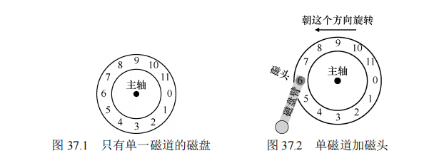

​		在图 37.2 中，连接到磁盘臂末端的磁头位于扇形部分 6 的上方，磁盘表面逆时针旋转。

##### 		单磁道延迟：旋转延迟 

​		要理解如何在简单的单道磁盘上处理请求，请想象我们现在收到读取块 0 的请求。磁盘应如何处理该请求？

​		在我们的简单磁盘中，磁盘不必做太多工作。具体来说，它必须等待期望的扇区旋转到磁头下。这种等待在现代驱动器中经常发生，并且是 I/O 服务时间的重要组成部分，它有一个特殊的名称：旋转延迟（rotational delay，有时称为 rotation delay，尽管听起来很奇怪）。在这个例子中，如果完整的旋转延迟是 *R*，那么磁盘必然产生大约为 *R*/2 的旋转延迟，以等待 0 来到读/写磁头下面（如果我们从 6 开始）。对这个单一磁道，最坏情况的请求是第 5 扇区，这导致接近完整的旋转延迟，才能服务这种请求。

##### 多磁道：寻道时间 

​		到目前为止，我们的磁盘只有一条磁道，这是不太现实的。现代磁盘当然有数以百万计的磁道。因此，我们来看看更具现实感的磁盘表面，这个表面有 3 条磁道（见图 37.3 左图）。在该图中，磁头当前位于最内圈的磁道上（它包含扇区 24～35）。下一个磁道包含下一组扇区（12～23），最外面的磁道包含最前面的扇区（0～11）。

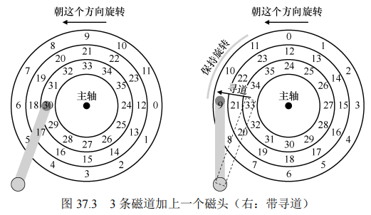

​		为了理解驱动器如何访问给定的扇区，我们现在追踪请求发生在远处扇区的情况，例如，读取扇区 11。为了服务这个读取请求，驱动器必须首先将磁盘臂移动到正确的磁道（在这种情况下，是最外面的磁道），通过一个所谓的寻道（seek）过程。寻道，以及旋转，是最昂贵的磁盘操作之一。

​		应该指出的是，寻道有许多阶段：首先是磁盘臂移动时的加速阶段。然后随着磁盘臂全速移动而惯性滑动。然后随着磁盘臂减速而减速。最后，在磁头小心地放置在正确的磁道上时停下来。停放时间（settling time）通常不小，例如 0.5～2ms，因为驱动器必须确定找到正确的磁道（想象一下，如果它只是移到附近！）。

​		寻道之后，磁盘臂将磁头定位在正确的磁道上。图 37.3（右图）描述了寻道。

​		如你所见，在寻道过程中，磁盘臂已经移动到所需的磁道上，并且盘片当然已经开始旋转，在这个例子中，大约旋转了 3 个扇区。因此，扇区 9 即将通过磁头下方，我们只能承受短暂的转动延迟，以便完成传输。

​		当扇区 11 经过磁盘磁头时，I/O 的最后阶段将发生，称为传输（transfer），数据从表面读取或写入表面。因此，我们得到了完整的 I/O 时间图：首先寻道，然后等待转动延迟，最后传输。

##### 一些其他细节 

​		尽管我们不会花费太多时间，但还有一些关于磁盘驱动器操作的令人感兴趣的细节。许多驱动器采用某种形式的磁道偏斜（track skew），以确保即使在跨越磁道边界时，顺序读取也可以方便地服务。在我们的简单示例磁盘中，这可能看起来如图 37.4 所示。

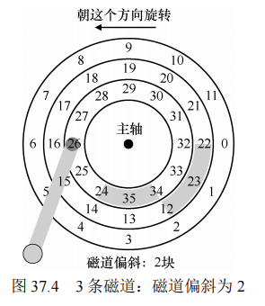

​		扇区往往会偏斜，因为从一个磁道切换到另一个磁道时，磁盘需要时间来重新定位磁头（即便移到相邻磁道）。如果没有这种偏斜，磁头将移动到下一个磁道，但所需的下一个块已经旋转到磁头下，因此驱动器将不得不等待整个旋转延迟，才能访问下一个块。

​		另一个事实是，外圈磁道通常比内圈磁道具有更多扇区，这是几何结构的结果。那里空间更多。这些磁道通常被称为多区域（multi-zoned）磁盘驱动器，其中磁盘被组织成多个区域，区域是表面上连续的一组磁道。每个区域每个磁道具有相同的扇区数量，并且外圈区域具有比内圈区域更多的扇区。

​		最后，任何现代磁盘驱动器都有一个重要组成部分，即它的缓存（cache），由于历史原因有时称为磁道缓冲区（track buffer）。该缓存只是少量的内存（通常大约 8MB 或 16MB），驱动器可以使用这些内存来保存从磁盘读取或写入磁盘的数据。例如，当从磁盘读取扇区时，驱动器可能决定读取该磁道上的所有扇区并将其缓存在其存储器中。这样做可以让驱动器快速响应所有后续对同一磁道的请求。

​		在写入时，驱动器面临一个选择：它应该在将数据放入其内存之后，还是写入实际写入磁盘之后，回报写入完成？前者被称为后写（write back）缓存（有时称为立即报告，immediate reporting），后者则称为直写（write through）。后写缓存有时会使驱动器看起来“更快”，但可能有危险。如果文件系统或应用程序要求将数据按特定顺序写入磁盘以保证正确性，后写缓存可能会导致问题（请阅读文件系统日志的章节以了解详细信息）。

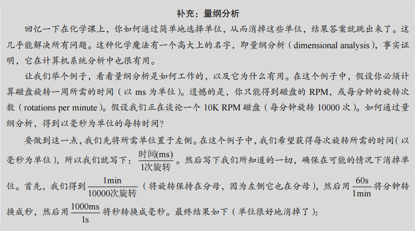

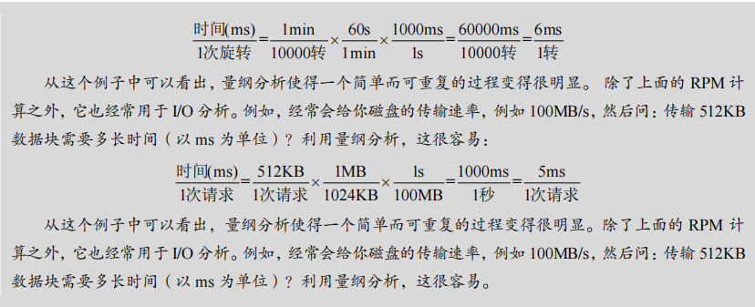

### 37.4 I/O 时间：用数学

​		在本节中，我们使用数学模型来分析磁盘的I/O时间。I/O时间由三个主要部分组成：寻道时间、旋转延迟和数据传输时间。公式如下：

​		TI/O=T寻道+T旋转+T传输T_{\text{I/O}} = T_{\text{寻道}} + T_{\text{旋转}} + T_{\text{传输}}TI/O=T寻道+T旋转+T传输

​		要计算I/O速率，可以将传输的大小除以所花费的时间：

​		RI/O=传输大小TI/OR_{\text{I/O}} = \frac{\text{传输大小}}{T_{\text{I/O}}}RI/O=TI/O传输大小

​		我们通过分析两个不同类型的工作负载来理解磁盘性能差异：随机工作负载（读取磁盘上随机位置的小块数据）和顺序工作负载（从磁盘连续读取大量数据）。

### 具体示例计算

#### 磁盘驱动器规格

我们分析了两个不同类型的磁盘驱动器：希捷Cheetah 15K.5（高性能SCSI驱动器）和Barracuda（容量型SATA驱动器）。它们的规格如下：

| 驱动器类型   | Cheetah 15K.5 | Barracuda |
| ------------ | ------------- | --------- |
| 容量         | 300GB         | 1TB       |
| RPM          | 15000         | 7200      |
| 平均寻道时间 | 4ms           | 9ms       |
| 最大传输速度 | 125MB/s       | 105MB/s   |
| 磁盘         | 4             | 4         |
| 缓存         | 16MB          | 16/32MB   |
| 连接方式     | SCSI          | SATA      |

#### 随机工作负载

假设每次读取4KB的数据，随机工作负载的计算如下：

- **Cheetah 15K.5**:

  - 平均寻道时间: 4ms
  - 旋转延迟: 2ms（15000 RPM => 4ms/转, 半圈旋转平均2ms）
  - 传输时间: 30μs（4KB / 125MB/s）

  因此，Cheetah的总I/O时间 TI/OT_{\text{I/O}}TI/O 约为 6ms，对应的I/O速率 RI/OR_{\text{I/O}}RI/O 约为 0.66MB/s。

- **Barracuda**:

  - 平均寻道时间: 9ms
  - 旋转延迟: 4.17ms（7200 RPM => 8.33ms/转, 半圈旋转平均4.17ms）
  - 传输时间: 38μs（4KB / 105MB/s）

  因此，Barracuda的总I/O时间 TI/OT_{\text{I/O}}TI/O 约为 13.2ms，对应的I/O速率 RI/OR_{\text{I/O}}RI/O 约为 0.31MB/s。

#### 顺序工作负载

假设一次读取100MB的数据，顺序工作负载的计算如下：

- **Cheetah 15K.5**: TI/OT_{\text{I/O}}TI/O 约为 800ms，RI/OR_{\text{I/O}}RI/O 约为 125MB/s。
- **Barracuda**: TI/OT_{\text{I/O}}TI/O 约为 950ms，RI/OR_{\text{I/O}}RI/O 约为 105MB/s。

### 重要结论

- 随机与顺序工作负载之间的性能差异显著，顺序I/O的速率远高于随机I/O。Cheetah的顺序I/O速率比随机I/O高约200倍，而Barracuda则高约300倍。
- 高性能驱动器（如Cheetah）与容量型驱动器（如Barracuda）在性能上存在显著差异，这使得用户在选择驱动器时需要在性能和成本之间做出权衡。

### 补充：计算“平均”寻道时间

在计算磁盘的平均寻道时间时，通常引用的平均寻道时间约为完整寻道时间的三分之一。这是基于平均寻道距离计算得出的结果。具体来说，计算两个磁道之间的平均距离，然后通过积分计算出平均距离，结果显示平均寻道时间是最大寻道时间的三分之一。

#### 原文：

​		既然我们有了一个抽象的磁盘模型，就可以通过一些分析来更好地理解磁盘性能。具体来说，现在可以将 I/O 时间表示为 3 个主要部分之和：

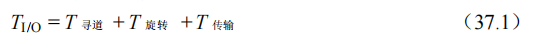

​		请注意，通常比较驱动器用 I/O 速率（*R*I/O）更容易（如下所示），它很容易从时间计算出来。只要将传输的大小除以所花的时间：

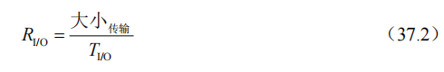

​		为了更好地感受 I/O 时间，我们执行以下计算。假设有两个我们感兴趣的工作负载。第一个工作负载称为随机（random）工作负载，它向磁盘上的随机位置发出小的（例如 4KB）读取请求。随机工作负载在许多重要的应用程序中很常见，包括数据库管理系统。第二种称为顺序（sequential）工作负载，只是从磁盘连续读取大量的扇区，不会跳过。顺序访问模式很常见，因此也很重要。

​		为了理解随机和顺序工作负载之间的性能差异，我们首先需要对磁盘驱动器做一些假设。我们来看看希捷的几个现代磁盘。第一个名为 Cheetah 15K.5 [S09b]，是高性能 SCSI驱动器。第二个名为 Barracuda [S09a]，是一个为容量而生的驱动器。有关两者的详细信息如表 37.1 所示。

​		如你所见，这些驱动器具有完全不同的特性，并且从很多方面很好地总结了磁盘驱动器市场的两个重要部分。首先是“高性能”驱动器市场，驱动器的设计尽可能快，提供低寻道时间，并快速传输数据。其次是“容量”市场，每字节成本是最重要的方面。因此，驱动器速度较慢，但将尽可能多的数据放到可用空间中。

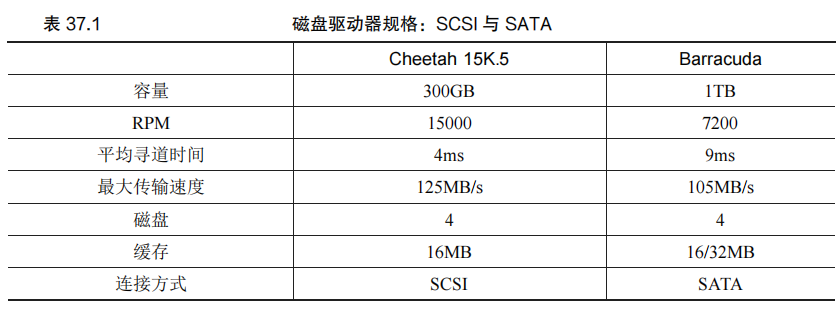

​		根据这些数据，我们可以开始计算驱动器在上述两个工作负载下的性能。我们先看看随机工作负载。假设每次读取 4KB 发生在磁盘的随机位置，我们可以计算每次读取需要多长时间。在 Cheetah 上：

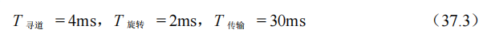

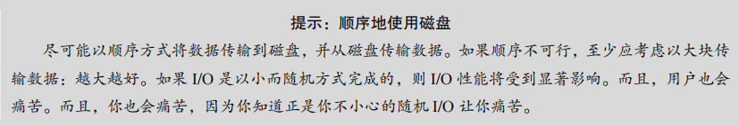

​		平均寻道时间（4ms）就采用制造商报告的平均时间。请注意，完全寻道（从表面的一端到另一端）可能需要两到三倍的时间。平均旋转延迟直接根据 RPM 计算。15000 RPM 等于 250 RPS（每秒转速）。因此，每次旋转需要 4ms。平均而言，磁盘将会遇到半圈旋转，因此平均时间为 2ms。最后，传输时间就是传输大小除以峰值传输速率。在这里它小得几乎看不见（30μs，注意，需要 1000μs 才是 1ms！）。

​		因此，根据我们上面的公式，Cheetah 的 *T*I/O大致等于 6ms。为了计算 I/O 的速率，我们只需将传输的大小除以平均时间，因此得到 Cheetah 在随机工作负载下的 *R*I/O 大约是0.66MB/s。对 Barracuda 进行同样的计算，得到 *T*I/O约为 13.2ms，慢两倍多，因此速率约为0.31MB/s。

​		现在让我们看看顺序工作负载。在这里我们可以假定在一次很长的传输之前只有一次寻道和旋转。简单起见，假设传输的大小为 100MB。因此，Barracuda 和 Cheetah 的 *T*I/O分别约为 800ms 和 950ms。因此 I/O 的速率几乎接近 125MB/s 和 105MB/s 的峰值传输速率，如表 37.2 所示。

​		表 37.2 展示了一些重要的事情。第一点，也是最重要的一点，随机和顺序工作负载之间的驱动性能差距很大，对于 Cheetah 来说几乎是 200 左右，而对于 Barracuda 来说差不多是 300 倍。因此我们得出了计算历史上最明显的设计提示。第二点更微妙：高端“性能”驱动器与低端“容量”驱动器之间的性能差异很大。出于这个原因（和其他原因），人们往往愿意为前者支付最高的价格，同时尽可能便宜地获得后者。

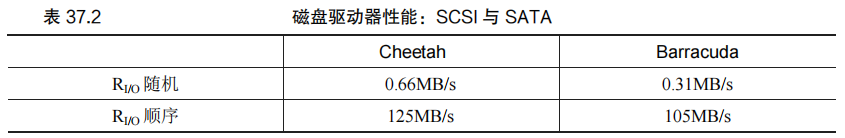

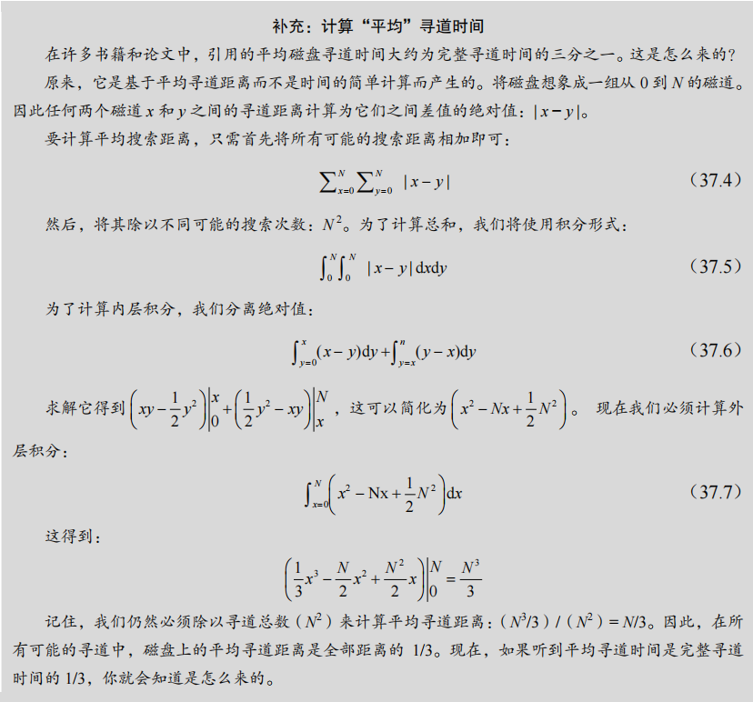

### 37.5 磁盘调度

由于 I/O 操作的高成本，操作系统在决定磁盘 I/O 请求的处理顺序时扮演了重要角色。磁盘调度程序通过估计每个请求的查找和旋转延迟，尽可能选择处理时间最短的请求，遵循最短任务优先（SJF）原则。

#### SSTF：最短寻道时间优先

最短寻道时间优先（SSTF）是早期的一种磁盘调度方法，它按照离当前磁头位置最近的磁道优先处理 I/O 请求。例如，如果磁头当前位于内圈磁道，而有两个请求分别来自中间磁道和外圈磁道，SSTF 会优先处理中间磁道的请求。

然而，SSTF 可能导致饥饿问题，即某些远离当前磁头位置的请求可能长期得不到处理。为解决这个问题，引入了电梯算法（SCAN 和 C-SCAN），该算法像电梯一样，一次从磁盘的一个方向扫到另一个方向，确保所有请求最终都能得到处理。

#### SPTF：最短定位时间优先

最短定位时间优先（SPTF）是一种更先进的调度算法，它不仅考虑寻道时间，还同时考虑旋转延迟，以更好地接近 SJF 原则。然而，由于操作系统通常无法获得磁盘的精确几何信息，SPTF 通常在磁盘控制器内部实现，由磁盘自身来处理请求的调度。

#### 现代磁盘调度

在现代系统中，磁盘调度通常在磁盘控制器内部进行，操作系统只负责将一批请求发送给磁盘，然后由磁盘控制器根据内部的几何信息和当前磁头位置，采用 SPTF 等算法来优化处理顺序。此外，I/O 合并（将相邻块的多个请求合并为一个请求）和非工作保全方法（延迟请求以期望获得更优的调度）也是现代磁盘调度中常用的技术。

#### 原文：

​	由于 I/O 的高成本，操作系统在决定发送给磁盘的 I/O 顺序方面历来发挥作用。更具体地说，给定一组 I/O 请求，磁盘调度程序检查请求并决定下一个要调度的请求[SCO90，JW91]。

​		与任务调度不同，每个任务的长度通常是不知道的，对于磁盘调度，我们可以很好地猜测“任务”（即磁盘请求）需要多长时间。通过估计请求的查找和可能的旋转延迟，磁盘调度程序可以知道每个请求将花费多长时间，因此（贪婪地）选择先服务花费最少时间的请求。因此，磁盘调度程序将尝试在其操作中遵循 SJF（最短任务优先）的原则（principle of SJF，shortest job first）。

#### SSTF：最短寻道时间优先 

​		一种早期的磁盘调度方法被称为最短寻道时间优先（Shortest-Seek-Time-First，SSTF）（也称为最短寻道优先，Shortest-Seek-First，SSF）。SSTF 按磁道对 I/O 请求队列排序，选择在最近磁道上的请求先完成。例如，假设磁头当前位置在内圈磁道上，并且我们请求扇区 21（中间磁道）和 2（外圈磁道），那么我们会首先发出对 21 的请求，等待它完成，然后发出对 2 的请求（见图 37.5）。

​		在这个例子中，SSTF 运作良好，首先寻找中间磁道，然后寻找外圈磁道。但 SSTF 不是万能的，原因如下。第一个问题，主机操作系统无法利用驱动器的几何结构，而是只会看到一系列的块。幸运的是，这个问题很容易解决。操作系统可以简单地实现最近块优先（Nearest-Block-First，NBF），而不是 SSTF，然后用最近的块地址来调度请求。

​		第二个问题更为根本：饥饿（starvation）。想象一下，在我们上面的例子中，是否有对磁头当前所在位置的内圈磁道有稳定的请求。然后，纯粹的 SSTF 方法将完全忽略对其他磁道的请求。因此关键问题如下。

#### 电梯（又称 SCAN 或 C-SCAN） 

​		这个问题的答案是很久以前得到的（参见[CKR72]中的例子），并且相对比较简单。该

算法最初称为 SCAN，简单地以跨越磁道的顺序来服务磁盘请求。我们将一次跨越磁盘称为

扫一遍。因此，如果请求的块所属的磁道在这次扫一遍中已经服务过了，它就不会立即处

理，而是排队等待下次扫一遍。

​		SCAN 有许多变种，所有这些变种都是一样的。例如，Coffman 等人引入了 F-SCAN，

它在扫一遍时冻结队列以进行维护[CKR72]。这个操作会将扫一遍期间进入的请求放入队列

中，以便稍后处理。这样做可以避免远距离请求饥饿，延迟了迟到（但更近）请求的服务。

​		C-SCAN 是另一种常见的变体，即循环 SCAN（Circular SCAN）的缩写。不是在一个

方向扫过磁盘，该算法从外圈扫到内圈，然后从内圈扫到外圈，如此下去。

由于现在应该很明显的原因，这种算法（及其变种）有时被称为电梯（elevator）算法，因为它的行为像电梯，电梯要么向上要么向下，而不只根据哪层楼更近来服务请求。试想

一下，如果你从 10 楼下降到 1 楼，有人在 3 楼上来并按下 4 楼，那么电梯就会上升到 4 楼，

因为它比 1 楼更近！如你所见，电梯算法在现实生活中使用时，可以防止电梯中发生战斗。

在磁盘中，它就防止了饥饿。

然而，SCAN 及其变种并不是最好的调度技术。特别是，SCAN（甚至 SSTF）实际上

并没有严格遵守 SJF 的原则。具体来说，它们忽视了旋转。因此，另一个关键问题如下

#### SPTF：最短定位时间优先 

​		在讨论最短定位时间优先调度之前（Shortest Positioning Time First，SPTF，有时也称为最短接入时间优先，Shortest Access Time First，SATF。这是解决我们问题的方法），让我们确保更详细地了解问题。图 37.6 给出了一个例子。

​		在这个例子中，磁头当前定位在内圈磁道上的扇区 30上方。因此，调度程序必须决定：下一个请求应该为安排扇区 16（在中间磁道上）还是扇区 8（在外圈磁道上）。接下来应该服务哪个请求？

​		答案当然是“视情况而定”。在工程中，事实证明“视情况而定”几乎总是答案，这反映了取舍是工程师生活的一部分。这样的格言也很好，例如，当你不知道老板问题的答案时，也许可以试试这句好话。然而，知道为什么视情况而定总是更好，我们在这里讨论要讨论这一点。

​		这里的情况是旋转与寻道相比的相对时间。如果在我们的例子中，寻道时间远远高于旋转延迟，那么 SSTF（和变体）就好了。但是，想象一下，如果寻道比旋转快得多。然后，在我们的例子中，寻道远一点的、在外圈磁道的服务请求 8，比寻道近一点的、在中间磁道的服务请求 16 更好，后者必须旋转很长的距离才能移到磁头下。

​		在现代驱动器中，正如上面所看到的，查找和旋转大致相当（当然，视具体的请求而定），因此 SPTF 是有用的，它提高了性能。然而，它在操作系统中实现起来更加困难，操作系统通常不太清楚磁道边界在哪，也不知道磁头当前的位置（旋转到了哪里）。因此，SPTF通常在驱动器内部执行，如下所述。

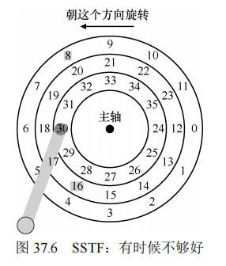

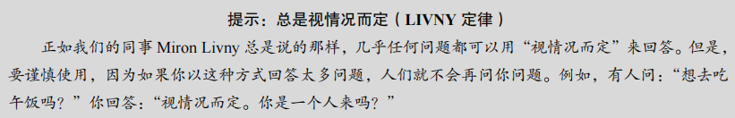

#### 其他调度问题 

​		在这个基本磁盘操作，调度和相关主题的简要描述中，还有很多问题我们没有讨论。其中一个问题是：在现代系统上执行磁盘调度的地方在哪里？在较早的系统中，操作系统完成了所有的调度。在查看一系列挂起的请求之后，操作系统会选择最好的一个，并将其发送到磁盘。当该请求完成时，将选择下一个，如此下去。磁盘当年比较简单，生活也是。

​		在现代系统中，磁盘可以接受多个分离的请求，它们本身具有复杂的内部调度程序（它们可以准确地实现 SPTF。在磁盘控制器内部，所有相关细节都可以得到，包括精确的磁头位置）。因此，操作系统调度程序通常会选择它认为最好的几个请求（如 16），并将它们全部发送到磁盘。磁盘然后利用其磁头位置和详细的磁道布局信息等内部知识，以最佳可能（SPTF）顺序服务于这些请求。

​		磁盘调度程序执行的另一个重要相关任务是 I/O 合并（I/O merging）。例如，设想一系列请求读取块 33，然后是 8，然后是 34，如图 37.8 所示。在这种情况下，调度程序应该将块 33 和34 的请求合并（merge）为单个两块请求。调度程序执行的所有请求都基于合并后的请求。合并在操作系统级别尤其重要，因为它减少了发送到磁盘的请求数量，从而降低了开销。

​		现代调度程序关注的最后一个问题是：在向磁盘发出 I/O 之前，系统应该等待多久？有人可能天真地认为，即使有一个磁盘 I/O，也应立即向驱动器发出请求。这种方法被称为工作保全（work-conserving），因为如果有请求要服务，磁盘将永远不会闲下来。然而，对预期磁盘调度的研究表明，有时最好等待一段时间 [ID01] ，即所谓的非工作保全（non-work-conserving）方法。通过等待，新的和“更好”的请求可能会到达磁盘，从而整体效率提高。当然，决定何时等待以及多久可能会非常棘手。请参阅研究论文以了解详细信息，或查看 Linux 内核实现，以了解这些想法如何转化为实践（如果你对自己要求很高）。

### 37.6 小结

​		==本章概述了磁盘如何工作以及如何通过磁盘调度优化 I/O 性能==。这一模型为理解磁盘在计算机系统中的角色提供了基础，尽管实际驱动器设计涉及许多复杂的物理、电子和材料科学问题。通过这个功能模型，我们可以继续在这些设备之上构建更为复杂的系统。