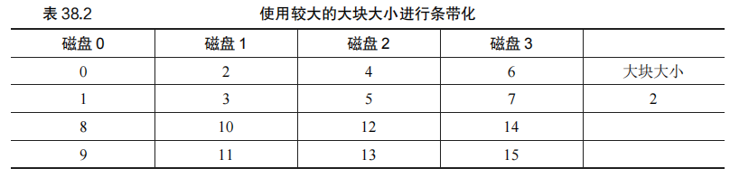
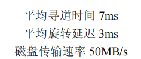
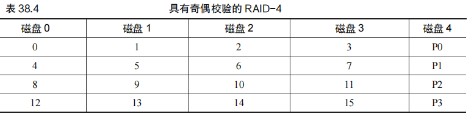

# 第38章 廉价冗余磁盘阵列（RAID）

### 原文：		

​		我们使用磁盘时，有时希望它更快。I/O 操作很慢，因此可能成为整个系统的瓶颈。我们使用磁盘时，有时希望它更大。越来越多的数据正在上线，因此磁盘变得越来越满。我们使用磁盘时，有时希望它更可靠。如果磁盘出现故障，而数据没有备份，那么所有有价值的数据都没了。

​		本章将介绍==廉价冗余磁盘阵列（Redundant Array of Inexpensive Disks），更多时候称为RAID [P+88]，这种技术使用多个磁盘一起构建更快、更大、更可靠的磁盘系统。==这个词在20世纪80年代后期由U.C.伯克利的一组研究人员引入（由David Patterson教授和Randy Katz教授以及后来的学生 Garth Gibson 领导）。大约在这个时候，许多不同的研究人员同时提出了使用多个磁盘来构建更好的存储系统的基本思想[BJ88，K86，K88，PB86，SG86]。

​		==从外部看，RAID 看起来像一个磁盘：一组可以读取或写入的块。在内部，RAID 是一个复杂的庞然大物，由多个磁盘、内存（包括易失性和非易失性）以及一个或多个处理器来管理系统。==硬件 RAID 非常像一个计算机系统，专门用于管理一组磁盘。

​		与单个磁盘相比，RAID 具有许多优点。==一个好处就是性能。并行使用多个磁盘可以大大加快 I/O 时间。另一个好处是容量。大型数据集需要大型磁盘。最后，RAID 可以提高可靠性。在多个磁盘上传输数据（无 RAID 技术）会使数据容易受到单个磁盘丢失的影响。通过某种形式的冗余（redundancy），RAID 可以容许损失一个磁盘并保持运行，就像没有错误一样。==

​		令人惊讶的是，RAID 为使用它们的系统透明地（transparently）提供了这些优势，即RAID 对于主机系统看起来就像一个大磁盘。当然，透明的好处在于它可以简单地用 RAID替换磁盘，而不需要更换一行软件。操作系统和客户端应用程序无须修改，就可以继续运行。==通过这种方式，透明极大地提高了 RAID 的可部署性（deployability），使用户和管理员可以使用 RAID，而不必担心软件兼容性问题。==

​		我们现在来讨论一些 RAID 的重要方面。从接口、故障模型开始，然后讨论如何在 3个重要的方面评估 RAID 设计：容量、可靠性和性能。然后我们讨论一些对 RAID 设计和实现很重要的其他问题。

## 38.1 接口和 RAID 内部

​		RAID（廉价冗余磁盘阵列）系统对于文件系统和其他客户端应用程序而言，看起来像一个大型、快速且可靠的磁盘。文件系统发出逻辑 I/O 请求，RAID 系统则需要计算请求应访问的磁盘，并执行相应的物理 I/O 操作。

​		==RAID 的内部结构非常复杂，通常由一个微控制器、易失性存储器（如 DRAM）、非易失性存储器（用于安全缓冲写入操作）以及可能的专用逻辑电路组成。RAID 系统通过标准接口（如 SCSI 或 SATA）连接到主机，其内部运作类似于一个专用计算机系统，运行特定的固件来管理磁盘操作。==

### 原文：

​		对于上面的文件系统，RAID 看起来像是一个很大的、（我们希望是）快速的、并且（希望是）可靠的磁盘。就像使用单个磁盘一样，它将自己展现为线性的块数组，每个块都可以由文件系统（或其他客户端）读取或写入。

​		当文件系统向 RAID 发出逻辑 I/O 请求时，RAID 内部必须计算要访问的磁盘（或多个磁盘）以完成请求，然后发出一个或多个物理 I/O 来执行此操作。这些物理 I/O 的确切性质取决于 RAID 级别，我们将在下面详细讨论。但是，举一个简单的例子，考虑一个 RAID，它保留每个块的两个副本（每个都在一个单独的磁盘上）。当写入这种镜像（mirrored）RAID系统时，RAID 必须为它发出的每一个逻辑 I/O 执行两个物理 I/O。

​		RAID 系统通常构建为单独的硬件盒，并通过标准连接（例如，SCSI 或 SATA）接入主机。然而，在内部，RAID 相当复杂。它包括一个微控制器，运行固件以指导 RAID 的操作。它还包括 DRAM 这样的易失性存储器，在读取和写入时缓冲数据块。在某些情况下，还包括非易失性存储器，安全地缓冲写入。它甚至可能包含专用的逻辑电路，来执行奇偶校验计算（在某些 RAID 级别中非常有用，下面会提到）。在很高的层面上，RAID 是一个非常专业的计算机系统：它有一个处理器，内存和磁盘。然而，它不是运行应用程序，而是运行专门用于操作 RAID 的软件。

## 38.2 故障模型

​		RAID 的设计旨在处理和恢复某些类型的磁盘故障。==最简单的故障模型称为故障—停止（fail-stop）模型，在这种模型下，磁盘只有两种状态：工作状态或故障状态。==工作状态下，所有块都可以正常读写，而故障状态则意味着磁盘永久丢失。

​		在故障—停止模型中，RAID 系统能够轻松检测到磁盘的故障，这一假设对于实现 RAID 的冗余设计非常重要。==然而，该模型并未考虑更复杂的无声故障（如磁盘损坏）或潜在的扇区错误。==

### 原文：

​		要理解 RAID 并比较不同的方法，我们必须考虑故障模型。RAID 旨在检测并从某些类型的磁盘故障中恢复。因此，准确地知道哪些故障对于实现工作设计至关重要。

​		我们假设的第一个故障模型非常简单，并且被称为故障—停止（fail-stop）故障模型[S84]。在这种模式下，磁盘可以处于两种状态之一：工作状态或故障状态。使用工作状态的磁盘时，所有块都可以读取或写入。相反，当磁盘出现故障时，我们认为它永久丢失。

​		故障—停止模型的一个关键方面是它关于故障检测的假定。具体来说，当磁盘发生故障时，我们认为这很容易检测到。例如，在 RAID 阵列中，我们假设 RAID 控制器硬件（或软件）可以立即观察磁盘何时发生故障。

​		因此，我们暂时不必担心更复杂的“无声”故障，如磁盘损坏。我们也不必担心在其他工作磁盘上无法访问单个块（有时称为潜在扇区错误）。稍后我们会考虑这些更复杂的（遗憾的是，更现实的）磁盘错误。

## 38.3 如何评估 RAID

在评估不同的 RAID 设计时，主要从以下三个方面进行考虑：

1. **容量（Capacity）**：给定一组 N 个磁盘，RAID 的有效容量是多少？==在没有冗余的情况下，容量就是 N。但在存在冗余时（如每个块有两个副本），有效容量会减少到 N/2。==不同的 RAID 级别会在容量上表现出不同的结果。
2. **可靠性（Reliability）**：不同的 RAID 设计能够承受多少个磁盘故障？此评估基于假设的故障模型，在该模型中假设整个磁盘可能会发生故障。
3. **性能（Performance）**：性能的评估取决于具体的工作负载。因此，必须先定义典型的工作负载，然后再评估 RAID 的性能表现。

接下来，我们将探讨 RAID 的几个重要设计：RAID 0 级（条带化）、RAID 1 级（镜像）和 RAID 4/5 级（基于奇偶校验的冗余），并对它们进行评估。

### 原文：

​		我们很快会看到，构建 RAID 有多种不同的方法。每种方法都有不同的特点，这值得评估，以便了解它们的优缺点。

​		具体来说，我们将从 3 个方面评估每种 RAID 设计。第一个方面是容量（capacity）。在给定一组 *N* 个磁盘的情况下，RAID 的客户端可用的容量有多少？没有冗余，答案显然是 *N*。不同的是，如果有一个系统保存每个块的两个副本，我们将获得 *N*/2 的有用容量。不同的方案（例如，基于校验的方案）通常介于两者之间。

​		第二个方面是可靠性（reliability）。给定设计允许有多少磁盘故障？根据我们的故障模型，我们只假设整个磁盘可能会故障。在后面的章节（例如，关于数据完整性的第 44 章）中，我们将考虑如何处理更复杂的故障模式。

​		最后，第三个方面是性能（performance）。性能有点难以评估，因为它在很大程度上取决于磁盘阵列提供的工作负载。因此，在评估性能之前，我们将首先提出一组应该考虑的典型工作负载。

​		我们现在考虑 3 个重要的 RAID 设计：RAID 0 级（条带化），RAID 1 级（镜像）和 RAID 4/5 级（基于奇偶校验的冗余）。这些设计中的每一个都被命名为一“级”，源于伯克利的Patterson、Gibson 和 Katz 的开创性工作[P+88]。

## 38.4 RAID 0 级：条带化

​		RAID 0 级，也称为条带化（striping），尽管没有提供任何冗余，但它在容量和性能方面表现出色，因此值得了解。

​		在 RAID 0 中，数据被条带化地分布在磁盘阵列中，如表 38.1 所示。数据块按轮转方式分布在磁盘上，目的是最大化并行性，特别是在处理顺序读取请求时。

​		可以通过调整大块大小（chunk size）来影响 RAID 的性能。例如，较小的大块大小增加了跨多个磁盘的并行性，但也可能增加定位时间。而较大的大块大小则减少了并行性，依赖于多个并发请求来实现高吞吐量。

​		==RAID 0 在容量方面表现优异，N 个磁盘提供了 N 的有效容量。然而，由于缺乏冗余，RAID 0 的可靠性较差，任何一个磁盘的故障都会导致数据丢失。==

​		在性能方面，RAID 0 通常表现很好，尤其是在顺序工作负载下，并行使用多个磁盘可以提供高吞吐量。稳态吞吐量取决于磁盘的数量和顺序或随机 I/O 的带宽（S 和 R）。顺序工作负载下，RAID 0 的带宽接近 N × S，而在随机工作负载下则为 N × R。

​		最后，计算单个请求的延迟时，RAID 0 的延迟与单个磁盘的延迟相当，而稳态吞吐量则会受到工作负载类型的显著影响。

### 原文：

​		第一个 RAID 级别实际上不是 RAID 级别，因为没有冗余。但是，RAID 0 级（即条带化，striping）因其更为人所知，可作为性能和容量的优秀上限，所以值得了解。

​		最简单的条带形式将按表 38.1 所示的方式在系统的磁盘上将块条带化（stripe），假设此处为 4 个磁盘阵列。

​		通过表 38.1，你了解了基本思想：以轮转方式将磁盘阵列的块分布在磁盘上。这种方法的目的是在对数组的连续块进行请求时，从阵列中获取最大的并行性（例如，在一个大的顺序读取中）。我们将同一行中的块称为条带，因此，上面的块 0、1、2 和 3 在相同的条带中。在这个例子中，我们做了一个简化的假设，在每个磁盘上只有 1 个块（每个大小为 4KB）放在下一个磁盘上。但是，这种安排不是必然的。例如，我们可以像表 38.2 那样在磁盘上安排块。

​		在这个例子中，我们在每个磁盘上放置两个 4KB 块，然后移动到下一个磁盘。因此，此 RAID 阵列的大块大小（chunk size）为 8KB，因此条带由 4 个大块（或 32KB）数据组成。

#### 大块大小 

​		一方面，大块大小主要影响阵列的性能。例如，大小较小的大块意味着许多文件将跨多个磁盘进行条带化，从而增加了对单个文件的读取和写入的并行性。但是，跨多个磁盘访问块的定位时间会增加，因为整个请求的定位时间由所有驱动器上请求的最大定位时间决定。

​		另一方面，较大的大块大小减少了这种文件内的并行性，因此依靠多个并发请求来实现高吞吐量。但是，较大的大块大小减少了定位时间。例如，如果一个文件放在一个块中并放置在单个磁盘上，则访问它时发生的定位时间将只是单个磁盘的定位时间。

​		因此，确定“最佳”的大块大小是很难做到的，因为它需要大量关于提供给磁盘系统的工作负载的知识[CL95]。对于本讨论的其余部分，我们将假定该数组使用单个块（4KB）的大块大小。大多数阵列使用较大的大块大小（例如，64KB），但对于我们在下面讨论的问题，确切的块大小无关紧要。因此，简单起见，我们用一个单独的块。

#### 回到 RAID-0 分析 

​		现在让我们评估条带化的容量、可靠性和性能。从容量的角度来看，它是顶级的：给定 *N* 个磁盘，条件化提供 *N* 个磁盘的有用容量。从可靠性的角度来看，条带化也是顶级的，但是最糟糕：任何磁盘故障都会导致数据丢失。最后，性能非常好：通常并行使用所有磁盘来为用户 I/O 请求提供服务。

#### 评估 RAID 性能 

​		在分析 RAID 性能时，可以考虑两种不同的性能指标。首先是单请求延迟。了解单个I/O 请求对 RAID 的满意度非常有用，因为它可以揭示单个逻辑 I/O 操作期间可以存在多少并行性。第二个是 RAID 的稳态吞吐量，即许多并发请求的总带宽。由于 RAID 常用于高性能环境，因此稳态带宽至关重要，因此将成为我们分析的主要重点。

​		为了更详细地理解吞吐量，我们需要提出一些感兴趣的工作负载。对于本次讨论，我们将假设有两种类型的工作负载：顺序（sequential）和随机（random）。对于顺序的工作负载，我们假设对阵列的请求大部分是连续的。例如，一个请求（或一系列请求）访问 1MB数据，始于块（B），终于（B+1MB），这被认为是连续的。顺序工作负载在很多环境中都很常见（想想在一个大文件中搜索关键字），因此被认为是重要的。

​		对于随机工作负载，我们假设每个请求都很小，并且每个请求都是到磁盘上不同的随机位置。例如，随机请求流可能首先在逻辑地址 10 处访问 4KB，然后在逻辑地址 550000处访问，然后在 20100 处访问，等等。一些重要的工作负载（例如数据库管理系统（DBMS）上的事务工作负载）表现出这种类型的访问模式，因此它被认为是一种重要的工作负载。

​		当然，真正的工作负载不是那么简单，并且往往混合了顺序和类似随机的部分，行为介于两者之间。简单起见，我们只考虑这两种可能性。

​		你知道，顺序和随机工作负载会导致磁盘的性能特征差异很大。对于顺序访问，磁盘以最高效的模式运行，花费很少时间寻道并等待旋转，大部分时间都在传输数据。对于随机访问，情况恰恰相反：大部分时间花在寻道和等待旋转上，花在传输数据上的时间相对较少。为了在分析中捕捉到这种差异，我们将假设磁盘可以在连续工作负载下以 *S* MB/s 传输数据，并且在随机工作负载下以 *R* MB/s 传输数据。一般来说，*S* 比 *R* 大得多。

​		为了确保理解这种差异，我们来做一个简单的练习。具体来说，给定以下磁盘特征，计算 *S* 和 *R*。假设平均大小为 10MB 的连续传输，平均为 10KB 的随机传输。另外，假设以下磁盘特征：

​		要计算 *S*，我们需要首先计算在典型的 10MB 传输中花费的时间。首先，我们花 7ms寻找，然后 3ms 旋转。最后，传输开始。10MB @ 50MB/s 导致 1/5s，即 200ms 的传输时间。因此，对于每个 10MB 的请求，花费了 210ms 完成请求。要计算 *S*，只需要除一下：

#### 再次回到 RAID-0 分析 

​		现在我们来评估条带化的性能。正如我们上面所说的，它通常很好。例如，从延迟角度来看，单块请求的延迟应该与单个磁盘的延迟几乎相同。毕竟，RAID-0 将简单地将该请求重定向到其磁盘之一。

​		从稳态吞吐量的角度来看，我们期望获得系统的全部带宽。因此，吞吐量等于 *N*（磁盘数量）乘以 *S*（单个磁盘的顺序带宽）。对于大量的随机 I/O，我们可以再次使用所有的磁盘，从而获得 *N*·*R* MB/s。我们在后面会看到，这些值都是最简单的计算值，并且将作为与其他 RAID 级别比较的上限。

## 38.5 RAID 1 级：镜像

RAID 1 级，即镜像（Mirroring），是超越条带化的第一个 RAID 级别。==在镜像系统中，每个逻辑块都有多个副本，通常保留两个物理副本，分别存储在不同的磁盘上。这种冗余使得 RAID 1 能够容许单个磁盘的故障而不丢失数据。==

在一个典型的 RAID 1 系统中，如表 38.3 所示，数据被镜像到不同的磁盘对上。例如，磁盘 0 和磁盘 1 存储相同的数据，磁盘 2 和磁盘 3 也存储相同的数据。==读取操作可以从任意一个副本中进行，而写入操作则必须同时更新两个副本。写入可以并行进行，从而减少写入时间。==

**RAID-1 分析：**

- **容量**：RAID 1 的有效容量仅为总容量的一半，因为每个块都有两个副本。因此，对于 N 个磁盘，RAID 1 提供的有效容量是 N/2。

- **可靠性**：RAID 1 的可靠性较高，能够容许至少一个磁盘故障，甚至可能容许多个磁盘故障，取决于具体的磁盘组合。

- 性能：

  - **读取性能**：读取操作的延迟与单个磁盘相当，因为 RAID 1 可以选择从任意一个副本中读取数据。
  - **写入性能**：写入操作需要同时更新两个副本，因此逻辑写入操作的延迟略高于单个磁盘的写入延迟。
  - **稳态吞吐量**：顺序写入和读取的最大带宽都是峰值带宽的一半。对于随机读取，RAID 1 可以利用所有磁盘提供完整带宽，而随机写入的带宽则减半。

**一致更新问题**：==RAID 1 及其他多磁盘 RAID 系统面临一致更新问题==，即在执行多个磁盘的更新时，如何保证数据一致性。例如，如果在更新两个磁盘副本时发生掉电或崩溃，可能导致两个副本数据不一致。==为了解决这个问题，通常会使用预写日志（write-ahead log）来确保在崩溃时可以恢复一致的状态。==

**性能评估**： ==在顺序工作负载下，RAID 1 的吞吐量是峰值带宽的一半，而在随机工作负载下，RAID 1 能够提供全部可用带宽。==对于写入操作，顺序和随机的带宽都为总带宽的一半。==RAID 1 提供的性能和可靠性平衡，使其成为一个非常可靠的存储解决方案。==

### 原文：

​	第一个超越条带化的 RAID 级别称为 RAID 1 级，即镜像。对于镜像系统，我们只需生成系统中每个块的多个副本。当然，每个副本应该放在一个单独的磁盘上。通过这样做，我们可以容许磁盘故障。在一个典型的镜像系统中，我们将假设对于每个逻辑块，RAID 保留两个物理副本。表38.3 所示的是一个例子。

​		在这个例子中，磁盘 0 和磁盘 1 具有相同的内容，而磁盘 2 和磁盘 3 也具有相同的内容。数据在这些镜像对之间条带化。实际上，你可能已经注意到有多种不同的方法可以在磁盘上放置块副本。上面的安排是常见的安排，有时称为 RAID-10（或 RAID 1+0），因为它使用镜像对（RAID-1），然后在其上使用条带化（RAID-0）。另一种常见安排是 RAID-01（或 RAID 0+1），它包含两个大型条带化（RAID-0）阵列，然后是镜像（RAID-1）。目前，我们的讨论只是假设上面布局的镜像。

​		从镜像阵列读取块时，RAID 有一个选择：它可以读取任一副本。例如，如果对 RAID发出对逻辑块 5 的读取，则可以自由地从磁盘 2 或磁盘 3 读取它。但是，在写入块时，不存在这样的选择：RAID 必须更新两个副本的数据，以保持可靠性。但请注意，这些写入可以并行进行。例如，对逻辑块 5 的写入可以同时在磁盘 2 和 3 上进行。

#### RAID-1 分析 

​		让我们评估一下 RAID-1。从容量的角度来看，RAID-1 价格昂贵。在镜像级别=2 的情况下，我们只能获得峰值有用容量的一半。因此，对于 *N* 个磁盘，镜像的有用容量为 *N*/2。

​		从可靠性的角度来看，RAID-1 表现良好。它可以容许任何一个磁盘的故障。你也许会注意到 RAID-1 实际上可以做得比这更好，只需要一点运气。想象一下，在表 38.3 中，磁盘 0 和磁盘 2 都故障了。在这种情况下，没有数据丢失！更一般地说，镜像系统（镜像级别为 2）肯定可以容许一个磁盘故障，最多可容许 *N*/2 个磁盘故障，这取决于哪些磁盘故障。在实践中，我们通常不喜欢把这样的事情交给运气。因此，大多数人认为镜像对于处理单个故障是很好的。

​		最后，我们分析性能。从单个读取请求的延迟角度来看，我们可以看到它与单个磁盘上的延迟相同。所有 RAID-1 都会将读取导向一个副本。写入有点不同：在完成写入之前，需要完成两次物理写入。这两个写入并行发生，因此时间大致等于单次写入的时间。然而，因为逻辑写入必须等待两个物理写入完成，所以它遭遇到两个请求中最差的寻道和旋转延迟，因此（平均而言）比写入单个磁盘略高。

#### 补充：**RAID** 一致更新问题

## 38.6 RAID 4 级：通过奇偶校验节省空间

​		RAID 4 级使用了一种不同的冗余方法，==即奇偶校验（parity），旨在通过减少冗余数据的存储量来节省空间，但这会对性能产生影响。==

​		在 RAID 4 系统中，如表 38.4 所示，==数据条带化存储在多个磁盘上，同时为每一条数据生成一个奇偶校验块，用于存储该条数据的冗余信息。==例如，奇偶校验块 P1 包含由块 4、5、6 和 7 计算出的冗余信息。奇偶校验通过异或（XOR）操作计算，并用于在磁盘发生故障时重建丢失的数据。

#### 奇偶校验的工作原理

​		异或函数适用于每个数据位，保证在任何数据位丢失时，可以通过读取剩余数据位和奇偶校验位来重构丢失的数据。这种方法通过对每个块的每一位进行按位异或运算来实现。例如，块 0 和块 1 的每个位异或后生成一个奇偶校验位，该位存储在奇偶校验块中。

#### RAID-4 性能分析

​		RAID 4 的容量为 (N−1) 个磁盘的总容量，因为其中一个磁盘用于存储奇偶校验信息。可靠性方面，RAID 4 可以容许一个磁盘故障，但多个磁盘故障将导致数据不可恢复。

**性能分析**：

- ==**顺序读取**：RAID 4 可以并行读取所有数据磁盘，而不包括奇偶校验磁盘，因此顺序读取的最大带宽为 (N−1)·S MB/s。==
- ==**顺序写入**：RAID 4 在顺序写入时可以通过“全条带写入”进行优化，即同时写入所有数据块和奇偶校验块，这使得顺序写入的最大带宽同样为 (N−1)·S MB/s。==
- ==**随机读取**：随机读取性能与顺序读取相似，所有数据磁盘都可以并行读取，因此最大带宽为 (N−1)·R MB/s。==
- ==**随机写入**：随机写入是 RAID 4 的性能瓶颈，因为它涉及对奇偶校验块的更新。为了正确更新奇偶校验，RAID 4 必须执行两次读取和两次写入，这导致奇偶校验磁盘成为瓶颈。小的随机写入性能通常为 (R/2) MB/s。==

​		在 RAID 4 中，奇偶校验磁盘的负载过重，使得其成为整个系统性能的限制因素，这个问题被称为“小写入问题”。即使增加磁盘数量，也无法改善这种瓶颈。

​		==**I/O 延迟**： 单次读取的延迟等同于单个磁盘请求的延迟。单次写入需要执行两次读取和两次写入，这些操作可以并行执行，因此总延迟大约是单个磁盘的两倍。==然而，由于奇偶校验更新需要等待两次读取的完成，因此可能会导致更差的定位时间。

​		总体而言，RAID 4 在节省空间的同时，提供了可靠的数据保护，但在处理小的随机写入时表现不佳。

### 原文：

​		我们现在展示一种向磁盘阵列添加冗余的不同方法，称为奇偶校验（parity）。基于奇偶校验的方法试图使用较少的容量，从而克服由镜像系统付出的巨大空间损失。不过，这样做的代价是——性能。

​		这是 5 个磁盘的 RAID-4 系统的例子（见表 38.4）。对于每一条数据，我们都添加了一个奇偶校验（parity）块，用于存储该条块的冗余信息。例如，奇偶校验块 P1 具有从块 4、5、6 和 7 计算出的冗余信息。

​		为了计算奇偶性，我们需要使用一个数学函数，使我们能够承受条带中任何一个块的损失。事实表明，简单异或（XOR）函数相当不错。对于给定的一组比特，如果比特中有偶数个 1，则所有这些比特的 XOR 返回 0，如果有奇数个 1，则返回 1 如表 38.5 所示。

​		在第一行（0、0、1、1）中，有两个 1（C2、C3），因此所有这些值的异或是 0（P）。同样，在第二行中只有一个 1（C1），因此 XOR 必须是 1（P）。你可以用一种简单的方法记住这一点：任何一行中的 1 的数量必须是偶数（而不是奇数）。这是 RAID 必须保持的不变性（invariant），以便奇偶校验正确。

​		从上面的例子中，你也许可以猜出，如何利用奇偶校验信息从故障中恢复。想象一下标为 C2 的列丢失了。要找出该列中肯定存在的值，我们只需读取该行中的所有其他值（包括 XOR 的奇偶校验位）并重构（reconstruct）正确的答案。具体来说，假设 C2 列中第一行的值丢失（它是 1）。通过读取该行中的其他值（C0 中的 0，C1 中的 0，C3 中的 1 以及奇偶校验列 P 中的 0），我们得到值 0、0、1 和 0。因为我们知道 XOR 保持每行有偶数个 1，所以就知道丢失的数据肯定是什么——1。这就是重构在基于异或的方案中的工作方式！还要注意如何计算重构值：只要将数据位和奇偶校验位异或，就像开始计算奇偶校验一样。

​		现在你可能会想：我们正在讨论所有这些位的异或，然而上面我们知道 RAID 在每个磁盘上放置了 4KB（或更大）的块。如何将 XOR 应用于一堆块来计算奇偶校验？事实证明这很容易。只需在数据块的每一位上执行按位 XOR。将每个按位 XOR 的结果放入奇偶校验块的相应位置中。例如，如果我们有 4 位大小的块（是的，这个块仍然比 4KB 块小很多，但是你看到了全景），它们可能看起来如表 38.6 所示。

可以看出，每个块的每个比特计算奇偶校验，结果放在奇偶校验块中。

#### RAID-4 分析 

​		现在让我们分析一下 RAID-4。从容量的角度来看，RAID-4 使用 1 个磁盘作为它所保护的每组磁盘的奇偶校验信息。因此，RAID 组的有用容量是（*N*−1）。可靠性也很容易理解：RAID-4 容许 1 个磁盘故障，不容许更多。如果丢失多个磁盘，则无法重建丢失的数据。

​		最后，是性能。这一次，让我们从分析稳态吞吐量开始。连续读取性能可以利用除奇偶校验磁盘以外的所有磁盘，因此可提供（*N*−1）·*S* MB/s（简单情况）的峰值有效带宽。要理解顺序写入的性能，我们必须首先了解它们是如何完成的。将大块数据写入磁盘时，RAID-4 可以执行一种简单优化，称为全条带写入（full-stripe write）。例如，设想块 0、1、2 和 3 作为写请求的一部分发送到 RAID（见表 38.7）。

​		在这种情况下，RAID 可以简单地计算 P0 的新值（通过在块 0、1、2 和 3 上执行 XOR），然后将所有块（包括奇偶块）并行写入上面的 5 个磁盘（在图中以灰色突出显示）。因此，全条带写入是 RAID-4 写入磁盘的最有效方式。

​		一旦我们理解了全条带写入，计算 RAID-4 上顺序写入的性能就很容易。有效带宽也是（*N*−1）·*S* MB/s。即使奇偶校验磁盘在操作过程中一直处于使用状态，客户也无法从中获得性能优势。

​		现在让我们分析随机读取的性能。从表 38.7 中还可以看到，一组 1 块的随机读取将分布在系统的数据磁盘上，而不是奇偶校验磁盘上。因此，有效性能是：（*N*−1）·*R* MB/s。

​		随机写入，我们留到了最后，展示了 RAID-4 最引人注目的情况。想象一下，我们希望在上面的例子中覆盖写入块 1。我们可以继续并覆盖它，但这会给我们带来一个问题：奇偶校验块 P0 将不再准确地反映条带的正确奇偶校验值。在这个例子中，P0 也必须更新。我们如何正确并有效地更新它？

​		存在两种方法。第一种称为加法奇偶校验（additive parity），要求我们做以下工作。为了计算新奇偶校验块的值，并行读取条带中所有其他数据块（在本例中为块 0、2 和 3），并与新块（1）进行异或。结果是新的校验块。为了完成写操作，你可以将新数据和新奇偶校验写入其各自的磁盘，也是并行写入。

​		这种技术的问题在于它随磁盘数量而变化，因此在较大的 RAID 中，需要大量的读取来计算奇偶校验。因此，导致了减法奇偶校验（subtractive parity）方法。

​		例如，想象下面这串位（4 个数据位，一个奇偶校验位）：

​		你现在应该能够确定何时使用加法奇偶校验计算，何时使用减法方法。考虑系统中需要多少个磁盘，导致加法方法比减法方法执行更少的 I/O。哪里是交叉点？

​		对于这里的性能分析，假定使用减法方法。因此，对于每次写入，RAID 必须执行 4 次物理 I/O（两次读取和两次写入）。现在想象有很多提交给 RAID 的写入。RAID-4 可以并行执行多少个？为了理解，让我们再看一下 RAID-4 的布局（见表 38.8）。

​		现在想象几乎同时向 RAID-4 提交 2 个小的请求，写入块 4 和块 13（在表 38.8 中标出）。

​		这些磁盘的数据位于磁盘 0 和 1 上，因此对数据的读写操作可以并行进行，这很好。出现的问题是奇偶校验磁盘。这两个请求都必须读取 4 和 13 的奇偶校验块，即奇偶校验块1 和 3（用+标记）。估计你已明白了这个问题：在这种类型的工作负载下，奇偶校验磁盘是瓶颈。因此我们有时将它称为基于奇偶校验的 RAID 的小写入问题（small-write problem）。因此，即使可以并行访问数据磁盘，奇偶校验磁盘也不会实现任何并行。由于奇偶校验磁盘，所有对系统的写操作都将被序列化。由于奇偶校验磁盘必须为每个逻辑 I/O 执行两次 I/O（一次读取，一次写入），我们可以通过计算奇偶校验磁盘在这两个 I/O 上的性能来计算RAID-4 中的小的随机写入的性能，从而得到（*R* / 2）MB/s。随机小写入下的 RAID-4 吞吐量很糟糕，向系统添加磁盘也不会改善。

​		我们最后来分析 RAID-4 中的 I/O 延迟。你现在知道，单次读取（假设没有失败）只映射到单个磁盘，因此其延迟等同于单个磁盘请求的延迟。单次写入的延迟需要两次读取，然后两次写入。读操作可以并行进行，写操作也是如此，因此总延迟大约是单个磁盘的两倍。（有一些差异，因为我们必须等待两个读取操作完成，所以会得到最差的定位时间，但是之后，更新不会导致寻道成本，因此可能是比平均水平更好的定位成本。）

## 38.7 RAID 5 级：旋转奇偶校验 

### 原文：

​		为解决小写入问题（至少部分解决），Patterson、Gibson 和 Katz 推出了 RAID-5。RAID-5的工作原理与 RAID-4 几乎完全相同，只是它将奇偶校验块跨驱动器旋转（见表 38.9）。

​		如你所见，==每个条带的奇偶校验块现在都在磁盘上旋转，以消除 RAID-4 的奇偶校验磁盘瓶颈。==

#### RAID-5 分析 

​		RAID-5 的大部分分析与 RAID-4 相同。例如，两级的有效容量和容错能力是相同的。顺序读写性能也是如此。单个请求（无论是读还是写）的延迟也与 RAID-4 相同。

​		==随机读取性能稍好一点，==因为我们可以利用所有的磁盘。最后，==RAID-4 的随机写入性能明显提高，==因为它允许跨请求进行并行处理。想象一下写入块 1 和写入块 10。这将变成对磁盘 1 和磁盘 4（对于块 1 及其奇偶校验）的请求以及对磁盘 0 和磁盘 2（对于块 10 及其奇偶校验）的请求。因此，它们可以并行进行。事实上，我们通常可以假设，如果有大量的随机请求，我们将能够保持所有磁盘均匀忙碌。如果是这样的话，那么我们用于小写入的总带宽将是N/4 ·*R* MB/s。4 倍损失是由于每个 RAID-5 写入仍然产生总计 4 个 I/O 操作，这就是使用基于奇偶校验的 RAID 的成本。

​		由于 RAID-5 基本上与 RAID-4 相同，只是在少数情况下它更好，所以它几乎完全取代了市场上的 RAID-4。==唯一没有取代的地方是系统知道自己绝不会执行大写入以外的任何事情，从而完全避免了小写入问题[HLM94]。==在这些情况下，有时会使用 RAID-4，因为它的构建稍微简单一些。

## 38.8 RAID 比较：总结

在本节中，对不同级别的 RAID 进行了比较，并总结了它们在容量、可靠性和性能上的差异。

- ==**RAID-0**：提供了最高的容量和性能，因为没有冗余，所以没有任何可靠性保障。所有磁盘的容量加在一起就是可用容量。吞吐量在顺序读写时最大，在随机 I/O 时性能也很好。==
- ==**RAID-1**：通过镜像每个块来提供可靠性，但容量只有一半。它可以容忍一个磁盘的故障，但在随机写入时性能有所下降，因为需要写入两个副本。==
- ==**RAID-4**：使用一个奇偶校验磁盘来提供冗余，因此容量为 (N-1)。它可以容忍一个磁盘故障，但在小的随机写入时性能很差，因为奇偶校验磁盘成为瓶颈。==
- ==**RAID-5**：通过旋转奇偶校验块解决了 RAID-4 的小写入问题。容量和可靠性与 RAID-4 相同，但随机写入性能有所改善，因为奇偶校验块在不同的磁盘上轮转，减少了奇偶校验磁盘的负载。==

表 38.10 总结了各个 RAID 级别的容量、可靠性和性能特点，帮助理解不同 RAID 设计之间的权衡。

​		但是，表 38.10 中的比较确实抓住了基本差异，对于理解 RAID 各级之间的折中很有用。对于延迟分析，我们就使用 T 来表示对单个磁盘的请求所需的时间。

​		总之，如果你严格要求性能而不关心可靠性，那么条带显然是最好的。但是，如果你想要随机 I/O 的性能和可靠性，镜像是最好的，你付出的代价是容量下降。如果容量和可靠性是你的主要目标，那么 RAID-5 胜出，你付出的代价是小写入的性能。最后，如果你总是在按顺序执行 I/O 操作并希望最大化容量，那么 RAID-5 也是最有意义的。

### 原文：

​		现在简单总结一下表 38.10 中各级 RAID 的比较。请注意，我们省略了一些细节来简化分析。例如，在镜像系统中写入时，平均查找时间比写入单个磁盘时稍高，因为寻道时间是两个寻道时间（每个磁盘上一个）的最大值。因此，对两个磁盘的随机写入性能通常会比单个磁盘的随机写入性能稍差。此外，在 RAID-4/5 中更新奇偶校验磁盘时，旧奇偶校验的第一次读取可能会导致完全寻道和旋转，但第二次写入奇偶校验只会导致旋转。

​		但是，表 38.10 中的比较确实抓住了基本差异，对于理解 RAID 各级之间的折中很有用。对于延迟分析，我们就使用 T 来表示对单个磁盘的请求所需的时间。

​		总之，如果你严格要求性能而不关心可靠性，那么条带显然是最好的。但是，如果你想要随机 I/O 的性能和可靠性，镜像是最好的，你付出的代价是容量下降。如果容量和可靠性是你的主要目标，那么 RAID-5 胜出，你付出的代价是小写入的性能。最后，如果你总是在按顺序执行 I/O 操作并希望最大化容量，那么 RAID-5 也是最有意义的。

## 38.9 其他有趣的 RAID 问题

​		本节提到了一些 RAID 设计中的其他有趣问题，例如其他 RAID 级别（如 RAID-2、RAID-3、RAID-6），以及在磁盘发生故障时系统的功能和性能表现。讨论了热备用磁盘的使用，以及在故障期间的性能变化。还提到了更复杂的故障模型，如潜在的扇区错误和块损坏，以及应对这些问题的技术。此外，还提到软件 RAID 的成本较低，但存在一致性更新问题。

### 原文：

​		还有一些其他有趣的想法，人们可以（并且应该）在讨论 RAID 时讨论。以下是我们最终可能会写的一些内容。

​		例如，还有很多其他 RAID 设计，包括最初分类中的第 2 和第 3 级以及第 6 级可容许多个磁盘故障[C+04]。还有 RAID 在磁盘发生故障时的功能；有时它会有一个热备用（hot spare）磁盘来替换发生故障的磁盘。发生故障时的性能和重建故障磁盘期间的性能会发生什么变化？还有更真实的故障模型，考虑潜在的扇区错误（latent sector error）或块损坏（block corruption）[B+08]，以及处理这些故障的许多技术（详细信息参见数据完整性章节）。最后，甚至可以将 RAID 构建为软件层：这种软件 RAID 系统更便宜，但有其他问题，包括一致更新问题[DAA05]。

## 38.10 小结

​		总结了 RAID 的概念及其在现代存储系统中的应用。RAID 将多个磁盘组合成一个更大且更可靠的存储系统，且对上层系统透明。不同的 RAID 级别适用于不同的需求，如 RAID-1 提供了良好的性能和可靠性，但容量成本高；RAID-5 则在容量和可靠性上更具优势，但在小写入场景下性能较差。选择合适的 RAID 级别并正确配置参数对优化性能和容量至关重要。

### 原文：

​		我们讨论了 RAID。RAID 将大量独立磁盘扩充成更大、更可靠的单一实体。重要的是，它是透明的，因此上面的硬件和软件对这种变化相对不在意。

​		有很多可能的 RAID 级别可供选择，使用的确切 RAID 级别在很大程度上取决于最终用户的优先级。例如，镜像 RAID 是简单的、可靠的，并且通常提供良好的性能，但是容量成本高。相比之下，RAID-5 从容量角度来看是可靠和更好的，但在工作负载中有小写入时性能很差。为特定工作负载正确地挑选 RAID 并设置其参数（块大小、磁盘数量等），这非常具有挑战性，更多的是艺术而不是科学。