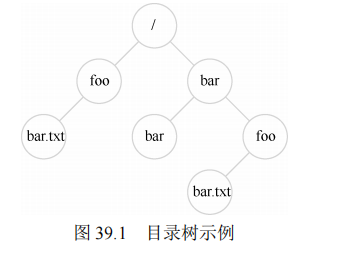
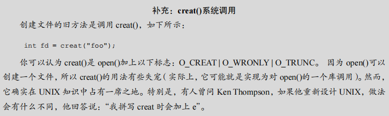
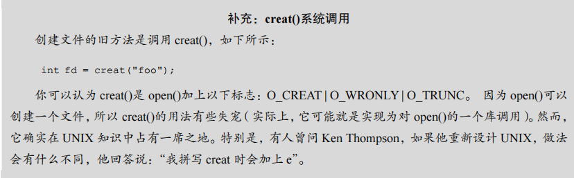
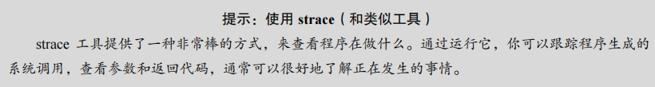
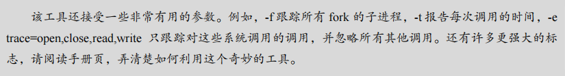
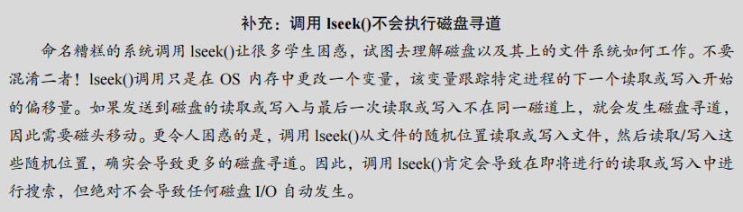
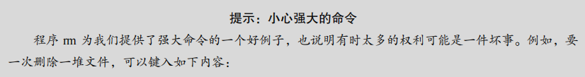
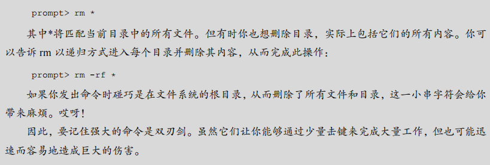

# 第39章 插叙：文件和目录

### 原文：		

​		到目前为止，==我们看到了两项关键操作系统技术的发展：进程，它是虚拟化的 CPU；地址空间，它是虚拟化的内存。==在这两种抽象共同作用下，程序运行时就好像它在自己的私有独立世界中一样，好像它有自己的处理器（或多处理器），好像它有自己的内存。这种假象使得对系统编程变得更容易，因此现在不仅在台式机和服务器上盛行，而且在所有可编程平台上越来越普遍，包括手机等在内。

​		在这一部分，我们加上虚拟化拼图中更关键的一块：==持久存储（persistent storage）。永久存储设备永久地（或至少长时间地）存储信息，如传统硬盘驱动器（hard disk drive）或更现代的固态存储设备（solid-state storage device）。==持久存储设备与内存不同。内存在断电时，其内容会丢失，而持久存储设备会保持这些数据不变。因此，操作系统必须特别注意这样的设备：用户用它们保存真正关心的数据。


​		接下来几章会讨论管理持久数据的一些关键技术，重点是如何提高性能及可靠性。但是，我们先从总体上看看 API：你在与 UNIX 文件系统交互时会看到的接口。


## 39.1 文件和目录

​		==操作系统通过虚拟化持久存储设备来管理数据。持久存储设备，如硬盘驱动器和固态存储设备，可以长时间存储信息，即使在断电后也不会丢失。==这与内存不同，内存在断电时会丢失其内容。==文件系统的任务是管理这些持久存储设备，并确保数据的可靠存储和检索。==

文件和目录是存储虚拟化的两个关键抽象：

- ==**文件**：文件是一个线性字节数组，可以被读取和写入。每个文件都有一个唯一的标识符（如 inode 号），用于内部识别。操作系统通常不关心文件的内容类型，只负责存储和管理这些数据。==
- ==**目录**：目录包含一个（用户可读名称，低级名称）的列表，将用户可读名称映射到文件的低级名称（如 inode 号）。目录可以包含文件或其他目录，形成一个目录树结构，从根目录（“/”）开始，通过分隔符命名子目录，直到指定的文件或目录。==

### 原文：

​		随着时间的推移，存储虚拟化形成了两个关键的抽象。第一个是文件（file）。==文件就是一个线性字节数组，每个字节都可以读取或写入。每个文件都有某种低级名称（low-level name），通常是某种数字。用户通常不知道这个名字（我们稍后会看到）。==由于历史原因，文件的低级名称通常称为 inode 号（inode number）。我们将在以后的章节中学习更多关于inode 的知识。==现在，只要假设每个文件都有一个与其关联的 inode 号。==

​		在大多数系统中，操作系统不太了解文件的结构（例如，它是图片、文本文件还是 C代码）。相反，==文件系统的责任仅仅是将这些数据永久存储在磁盘上，==并确保当你再次请求数据时，得到你原来放在那里的内容。做到这一点并不像看起来那么简单！ 

​		第二个抽象是目录（directory）。一个目录，像一个文件一样，也有一个低级名字（即inode 号），但是它的内容非常具体：它包含一个（用户可读名字，低级名字）对的列表。例如，假设存在一个低级别名称为“10”的文件，它的用户可读的名称为“foo”。“foo”所在的目录因此会有条目（“foo”，“10”），将用户可读名称映射到低级名称。目录中的每个条目都指向文件或其他目录。通过将目录放入其他目录中，用户可以构建任意的目录树（directory tree，或目录层次结构，directory hierarchy），在该目录树下存储所有文件和目录。

​		目录层次结构从根目录（root directory）开始（在基于 UNIX 的系统中，根目录就记为“/”），并使用某种分隔符（separator）来命名后续子目录（sub-directories），直到命名所需的文件或目录。例如，如果用户在根目录中创建了一个目录 foo，然后在目录 foo中创建了一个文件 bar.txt，我们就可以通过它的绝对路径名（absolute pathname）来引用该文件，在这个例子中，它将是/foo/bar.txt。更复杂的目录树，请参见图 39.1。示例中的有效目录是/，/foo，/bar，/bar/bar，/bar/foo，有效的文件是/foo/bar.txt 和/bar/foo/bar.txt。目录和文件可以具有相同的名称，只要它们位于文件系统树的不同位置（例如，图中有两个名为 bar.txt 的文件：/foo/bar.txt 和/bar/foo/bar.txt）。




​		你可能还会注意到，这个例子中的文件名通常包含两部分：bar 和 txt，以句点分隔。第一部分是任意名称，而文件名的第二部分通常用于指示文件的类型（type），例如，它是 C代码（例如.c）还是图像（例如.jpg），或音乐文件（例如.mp3）。然而，这通常只是一个惯例（convention）：一般不会强制名为 main.c 的文件中包含的数据确实是 C 源代码。

​		因此，我们可以看到文件系统提供的了不起的东西：一种方便的方式来命名我们感兴趣的所有文件。==名称在系统中很重要，因为访问任何资源的第一步是能够命名它。在 UNIX系统中，文件系统提供了一种统一的方式来访问磁盘、U 盘、CD-ROM、许多其他设备上的文件，事实上还有很多其他的东西，都位于单一目录树下。==


## 39.2 文件系统接口

​		文件系统接口提供了一组用于创建、访问和删除文件的 API。我们将在本节中探讨这些基本操作，并介绍用于删除文件的神秘调用 `unlink()`。

## 39.3 创建文件

​		文件的创建可以通过 `open()` 系统调用完成。调用 `open()` 并传入 `O_CREAT` 标志可以创建一个新文件。以下是一个示例代码，用于在当前工作目录中创建一个名为 "foo" 的文件：

```C
int fd = open("foo", O_CREAT | O_WRONLY | O_TRUNC);
```

在这个例子中，`open()` 接受了一些不同的标志：

- `O_CREAT`：创建一个新文件。
- `O_WRONLY`：以只写模式打开文件。
- `O_TRUNC`：如果文件已经存在，将其截断为零字节大小，删除所有现有内容。

​		==`open()` 的返回值是一个文件描述符（file descriptor），这是一个整数，用于标识进程中的打开文件。文件描述符是进程私有的，用于后续的文件操作，如读取或写入。==



### 原文：

​		我们将从最基本的操作开始：创建一个文件。这可以通过 open 系统调用完成。通过调用 open()并传入 O_CREAT 标志，程序可以创建一个新文件。下面是示例代码，用于在当前工作目录中创建名为“foo”的文件。

```
int fd = open("foo", O_CREAT | O_WRONLY | O_TRUNC);
```

​		函数 open()接受一些不同的标志。在本例中，程序创建文件（O_CREAT），只能写入该文件，因为以（O_WRONLY）这种方式打开，并且如果该文件已经存在，则首先将其截断为零字节大小，删除所有现有内容（O_TRUNC）。



​		open()的一个重要方面是它的返回值：文件描述符（file descriptor）。文件描述符只是一个整数，是每个进程私有的，在 UNIX 系统中用于访问文件。因此，一旦文件被打开，你就可以使用文件描述符来读取或写入文件，假定你有权这样做。这样，一个文件描述符就是一种权限（capability）[L84]，即一个不透明的句柄，它可以让你执行某些操作。另一种看待文件描述符的方法，是将它作为指向文件类型对象的指针。一旦你有这样的对象，就可以调用其他“方法”来访问文件，如 read()和 write()。下面你会看到如何使用文件描述符。


## 39.4 读写文件

在创建了文件后，下一步通常是读取或写入文件的内容。例如，使用 `echo` 命令输出内容到文件 `foo`，然后通过 `cat` 命令将其内容显示在屏幕上。为了理解 `cat` 程序如何读取文件，我们可以使用 `strace` 工具来追踪程序执行时的系统调用。

在追踪 `cat foo` 的执行时，`strace` 显示了以下系统调用顺序：

1. **`open()`**：`cat` 首先打开文件 `foo` 以进行读取操作，使用了 `O_RDONLY` 标志表示只读模式，并使用 `O_LARGEFILE` 标志支持大文件。调用成功后，返回了一个文件描述符（通常为 3，因为 0、1、2 分别被分配给标准输入、输出和错误）。
2. **`read()`**：`cat` 然后使用 `read()` 从文件中读取数据。`read()` 的第一个参数是文件描述符，第二个参数是缓冲区的指针，第三个参数是读取的字节数。在此示例中，`read()` 成功读取了 6 个字节，包括 "hello" 和换行符。
3. **`write()`**：接着，`cat` 使用 `write()` 将读取的数据输出到屏幕，`write()` 的目标是文件描述符 1，即标准输出。
4. **`close()`**：最后，`cat` 关闭文件 `foo`，表示读取操作完成。

写入文件的过程与读取类似，区别在于使用 `write()` 系统调用将数据写入文件。通过 `strace` 可以轻松追踪这些操作。


### 原文：

​		一旦我们有了一些文件，当然就会想要读取或写入。我们先读取一个现有的文件。如果在命令行键入，我们就可以用 cat 程序，将文件的内容显示到屏幕上。

```
prompt> echo hello > foo 
prompt> cat foo 
hello 
prompt>
```

​		在这段代码中，==我们将程序 echo 的输出重定向到文件 foo，然后文件中就包含单词“hello”。然后我们用 cat 来查看文件的内容。但是，cat 程序如何访问文件 foo？==

​		为了弄清楚这个问题，我们将使用一个非常有用的工具，来跟踪程序所做的系统调用。在 Linux 上，==该工具称为 strace==。其他系统也有类似的工具（参见 macOS X 上的 dtruss，或某些较早的 UNIX 变体上的 truss）。==strace 的作用就是跟踪程序在运行时所做的每个系统调用，然后将跟踪结果显示在屏幕上供你查看。==





​		下面是一个例子，使用 strace 来找出 cat 在做什么（为了可读性删除了一些调用）。

```
prompt> strace cat foo 
... 
open("foo", O_RDONLY|O_LARGEFILE) = 3 
read(3, "hello\n", 4096) = 6 
write(1, "hello\n", 6) = 6 
hello 
read(3, "", 4096) = 0 
close(3) = 0 
... 
prompt>
```

​		==cat 做的第一件事是打开文件准备读取。我们应该注意几件事情。首先，该文件仅为读取而打开（不写入），如 O_RDONLY 标志所示。其次，使用 64 位偏移量（O_LARGEFILE）。最后，open()调用成功并返回一个文件描述符，其值为 3。==

​		你可能会想，为什么第一次调用 open()会返回 3，而不是 0 或 1？事实证明，每个正在运行的进程已经打开了 3 个文件：标准输入（进程可以读取以接收输入），标准输出（进程可以写入以便将信息显示到屏幕），以及标准错误（进程可以写入错误消息）。==这些分别由文件描述符 0、1 和 2 表示。==因此，==当你第一次打开另一个文件时（如上例所示），它几乎肯定是文件描述符 3。==

​		打开成功后，cat 使用 read()系统调用重复读取文件中的一些字节。read()的第一个参数是文件描述符，从而告诉文件系统读取哪个文件。一个进程当然可以同时打开多个文件，因此描述符使操作系统能够知道某个特定的读取引用了哪个文件。第二个参数指向一个用于放置 read()结果的缓冲区。在上面的系统调用跟踪中，strace 显示了这时的读取结果（“hello”）。第三个参数是缓冲区的大小，在这个例子中是 4KB。对 read()的调用也成功返回，这里返回它读取的字节数（6，其中包括“hello”中的 5 个字母和一个行尾标记）。

​		此时，你会看到 strace 的另一个有趣结果：==对 write()系统调用的一次调用，针对**文件描述符 1**。如上所述，此描述符被称为标准输出，因此用于将单词“Hello”写到屏幕上，这正是 cat 程序要做的事。==但是它直接调用 write()吗？也许（如果它是高度优化的）。但是，如果不是，那么可能会调用库例程 printf()。在内部，printf()会计算出传递给它的所有格式化细节，并最终对标准输出调用 write，将结果显示到屏幕上。

​		然后，==cat 程序试图从文件中读取更多内容，但由于文件中没有剩余字节，read()返回 0，程序知道这意味着它已经读取了整个文件。==因此，程序调用 close()，传入相应的文件描述符，表明它已用完文件“foo”。该文件因此被关闭，对它的读取完成了。

​		写入文件是通过一组类似的步骤完成的。==首先，打开一个文件准备写入，然后调用 write()系统调用，对于较大的文件，可能重复调用，然后调用 close()。==使用 strace 追踪写入文件，也许针对你自己编写的程序，或者追踪 dd 实用程序，例如 dd if = foo of = bar。


## 39.5 读取和写入，但不按顺序

虽然文件通常是顺序读取或写入的，但有时需要从文件的特定位置读取或写入数据。为此，可以使用 `lseek()` 系统调用来移动文件的当前偏移量。

`lseek()` 的原型如下：

```C
off_t lseek(int fildes, off_t offset, int whence);
```

- **`fildes`**：文件描述符，标识要操作的文件。
- **`offset`**：偏移量，表示从文件中的哪个位置开始。
- ==**`whence`**：指定偏移量的基准点，可以是 `SEEK_SET`（从文件头开始）、`SEEK_CUR`（从当前位置开始）或 `SEEK_END`（从文件末尾开始）。==

操作系统为每个进程打开的文件维护一个“当前”偏移量。`lseek()` 可以通过显式调用来更改这个偏移量。需要注意的是，`lseek()` 调用并不会直接导致磁盘寻道，只是修改了内核中跟踪文件位置的变量。真正的磁盘寻道发生在实际读取或写入操作时。


### 原文：

​		到目前为止，我们已经讨论了如何读取和写入文件，但所有访问都是顺序的（sequential）。也就是说，我们从头到尾读取一个文件，或者从头到尾写一个文件。但是，有时能够读取或写入文件中的特定偏移量是有用的。例如，如果你在文本文件上构建了索引并利用它来查找特定单词，最终可能会从文件中的某些随机（random）偏移量中读取数据。为此，我们将使用 lseek()系统调用。下面是函数原型： 

```C
off_t lseek(int fildes, off_t offset, int whence);
```

​		第一个参数是熟悉的（一个文件描述符）。第二个参数是偏移量，它将文件偏移量定位到文件中的特定位置。第三个参数，由于历史原因而被称为 whence，明确地指定了搜索的执行方式。以下摘自手册页： 

```C
If whence is SEEK_SET, the offset is set to offset bytes. 
If whence is SEEK_CUR, the offset is set to its current 
location plus offset bytes. 
If whence is SEEK_END, the offset is set to the size of 
the file plus offset bytes.
```

​		从这段描述中可见，对于每个进程打开的文件，操作系统都会跟踪一个“当前”偏移量，这将决定在文件中读取或写入时，下一次读取或写入开始的位置。因此，打开文件的抽象包括它具有当前偏移量，偏移量的更新有两种方式。第一种是当发生 *N* 个字节的读或写时，*N* 被添加到当前偏移。因此，每次读取或写入都会隐式更新偏移量。第二种是明确的lseek，它改变了上面指定的偏移量。



​		请注意，调用 lseek()与移动磁盘臂的磁盘的寻道（seek）操作无关。对 lseek()的调用只是改变内核中变量的值。执行 I/O 时，根据磁盘头的位置，磁盘可能会也可能不会执行实际的寻道来完成请求。


## 39.6 用 fsync()立即写入

​		通常，当程序调用 `write()` 时，文件系统会将数据暂时缓存在内存中，并在稍后的某个时间点将其实际写入持久存储设备。这种做法有助于提高系统性能，但也带来了潜在的数据丢失风险，尤其是在 `write()` 调用后但数据还未写入磁盘之前发生系统崩溃的情况下。

​		为了满足某些应用程序（如数据库管理系统）对数据持久性的严格要求，大多数文件系统提供了额外的控制 API。在 UNIX 系统中，这个接口是 `fsync(int fd)`。当应用程序调用 `fsync()` 时，文件系统会强制将与指定文件描述符关联的所有脏数据写入磁盘，并在写入完成后返回，确保数据已经安全存储。

以下是一个使用 `fsync()` 的简单示例：

```C
int fd = open("foo", O_CREAT | O_WRONLY | O_TRUNC);
assert(fd > -1);
int rc = write(fd, buffer, size);
assert(rc == size);
rc = fsync(fd);
assert(rc == 0);
```

​		在这个示例中，文件 `foo` 被打开，数据块被写入，接着通过调用 `fsync()` 强制数据立即写入磁盘。`fsync()` 返回后，应用程序可以确信数据已经被保存。然而，这个操作并不完全保证文件系统的一致性。如果文件是新创建的，还需要对包含该文件的目录调用 `fsync()`，以确保该目录的更新也被写入磁盘。这种细节如果忽略，可能会导致应用程序级别的错误。


### 原文：

​		大多数情况下，当程序调用 write()时，它只是告诉文件系统：请在将来的某个时刻，将此数据写入持久存储。出于性能的原因，文件系统会将这些写入在内存中缓冲（buffer）一段时间（例如 5s 或 30s）。在稍后的时间点，写入将实际发送到存储设备。从调用应用程序的角度来看，写入似乎很快完成，并且只有在极少数情况下（例如，在 write()调用之后但写入磁盘之前，机器崩溃）数据会丢失。

​		但是，有些应用程序需要的不只是这种保证。例如，在数据库管理系统（DBMS）中，开发正确的恢复协议要求能够经常强制写入磁盘。为了支持这些类型的应用程序，大多数文件系统都提供了一些额外的控制 API。在 UNIX中，提供给应用程序的接口被称为 fsync(int fd)。当进程针对特定文件描述符调用 fsync()时，文件系统通过强制将所有脏（dirty）数据（即尚未写入的）写入磁盘来响应，针对指定文件描述符引用的文件。一旦所有这些写入完成，fsync()例程就会返回。

​		以下是如何使用 fsync()的简单示例。代码打开文件 foo，向它写入一个数据块，然后调用 fsync()以确保立即强制写入磁盘。一旦 fsync()返回，应用程序就可以安全地继续前进，知道数据已被保存（如果 fsync()实现正确，那就是了）。

```C
int fd = open("foo", O_CREAT | O_WRONLY | O_TRUNC); 
assert(fd > -1); 
int rc = write(fd, buffer, size); 
assert(rc == size); 
rc = fsync(fd); 
assert(rc == 0);
```

​		有趣的是，这段代码并不能保证你所期望的一切。在某些情况下，还需要 fsync()包含foo 文件的目录。添加此步骤不仅可以确保文件本身位于磁盘上，而且可以确保文件（如果新创建）也是目录的一部分。毫不奇怪，这种细节往往被忽略，导致许多应用程序级别的错误[P+13]。


## 39.7 文件重命名

​		当一个文件被创建后，有时需要给它一个新的名字。在 UNIX 系统中，这可以通过 `mv` 命令完成，它使用了系统调用 `rename(char *old, char *new)` 来实现文件的重命名。`rename()` 调用接受两个参数：旧名称和新名称。

​		`rename()` 提供了一个关键的保证：它通常是一个原子操作。无论系统是否在重命名期间崩溃，文件要么保留旧名称，要么成功重命名为新名称，不会出现部分重命名或其他中间状态。这对一些需要确保文件状态一致性的应用程序非常重要。

例如，在文件编辑器（如 `emacs`）中，当用户保存文件时，编辑器会将文件的新版本写入一个临时文件（如 `foo.txt.tmp`），然后使用 `fsync()` 确保数据被写入磁盘。接着，它通过调用 `rename()` 将临时文件重命名为原始文件名称，从而实现对文件的原子更新：

```C
int fd = open("foo.txt.tmp", O_WRONLY|O_CREAT|O_TRUNC);
write(fd, buffer, size); // write out new version of file
fsync(fd);
close(fd);
rename("foo.txt.tmp", "foo.txt");
```

这种方式确保了即使系统在更新过程中崩溃，文件系统中也不会出现不一致的状态，新旧文件的切换是原子的。


### 原文：

​		有了一个文件后，有时需要给一个文件一个不同的名字。在命令行键入时，这是通过mv 命令完成的。在下面的例子中，文件 foo 被重命名为 bar。

```shell
prompt> mv foo bar
```

​		利用 strace，我们可以看到 mv 使用了系统调用 rename(char * old, char * new)，它只需要两个参数：文件的原来名称（old）和新名称（new）。

​		rename()调用提供了一个有趣的保证：它（通常）是一个原子（atomic）调用，不论系统是否崩溃。如果系统在重命名期间崩溃，文件将被命名为旧名称或新名称，不会出现奇怪的中间状态。因此，对于支持某些需要对文件状态进行原子更新的应用程序，rename()非常重要。

​		让我们更具体一点。想象一下，你正在使用文件编辑器（例如 emacs），并将一行插入到文件的中间。例如，该文件的名称是 foo.txt。编辑器更新文件并确保新文件包含原有内容和插入行的方式如下（为简单起见，忽略错误检查）：

```C
int fd = open("foo.txt.tmp", O_WRONLY|O_CREAT|O_TRUNC); 
write(fd, buffer, size); // write out new version of file 
fsync(fd); 
close(fd); 
rename("foo.txt.tmp", "foo.txt");
```

​		在这个例子中，编辑器做的事很简单：将文件的新版本写入临时名称（foot.txt.tmp），使用 fsync()将其强制写入磁盘。然后，当应用程序确定新文件的元数据和内容在磁盘上，就将临时文件重命名为原有文件的名称。最后一步自动将新文件交换到位，同时删除旧版本的文件，从而实现原子文件更新。


## 39.8 获取文件信息

​		在文件系统中，除了存储文件的实际数据外，还需要保存大量关于文件的元数据（metadata）。这些元数据可以通过 `stat()` 或 `fstat()` 系统调用来获取，这些调用会填充一个 `stat` 结构，其中包含了文件的各类信息。`stat` 结构包括以下字段：

- `st_dev`: 包含文件的设备ID。
- `st_ino`: 文件的 inode 号。
- `st_mode`: 文件的保护模式（权限）。
- `st_nlink`: 硬链接的数量。
- `st_uid`: 文件所有者的用户 ID。
- `st_gid`: 文件所有者的组 ID。
- `st_rdev`: 设备 ID（如果文件是特殊文件）。
- `st_size`: 文件的总大小（以字节为单位）。
- `st_blksize`: 文件系统 I/O 的块大小。
- `st_blocks`: 分配的块数。
- `st_atime`: 最后一次访问时间。
- `st_mtime`: 最后一次修改时间。
- `st_ctime`: 最后一次状态更改时间。

​		例如，使用命令 `stat` 可以查看某个文件的元数据信息：

```C
prompt> echo hello > file 
prompt> stat file 
 File: 'file' 
 Size: 6 Blocks: 8 IO Block: 4096 regular file 
Device: 811h/2065d Inode: 67158084 Links: 1 
Access: (0640/-rw-r-----) Uid: (30686/ remzi) Gid: (30686/ remzi) 
Access: 2011-05-03 15:50:20.157594748 -0500 
Modify: 2011-05-03 15:50:20.157594748 -0500 
Change: 2011-05-03 15:50:20.157594748 -0500 
```

​		文件系统通常将这些信息保存在名为 inode 的数据结构中。当我们讨论文件系统的实现时，会更深入地了解 inode 的工作原理。


#### 原文：

​		除了文件访问之外，我们还希望文件系统能够保存关于它正在存储的每个文件的大量信息。我们通常将这些数据称为文件元数据（metadata）。要查看特定文件的元数据，我们可以使用 stat()或 fstat()系统调用。这些调用将一个路径名（或文件描述符）添加到一个文件中，并填充一个 stat 结构，如下所示：

```C
struct stat { 
 dev_t st_dev; /* ID of device containing file */ 
 ino_t st_ino; /* inode number */ 
 mode_t st_mode; /* protection */ 
 nlink_t st_nlink; /* number of hard links */ 
 uid_t st_uid; /* user ID of owner */ 
 gid_t st_gid; /* group ID of owner */ 
 dev_t st_rdev; /* device ID (if special file) */ 
 off_t st_size; /* total size, in bytes */ 
 blksize_t st_blksize; /* blocksize for filesystem I/O */ 
 blkcnt_t st_blocks; /* number of blocks allocated */ 
 time_t st_atime; /* time of last access */ 
 time_t st_mtime; /* time of last modification */ 
 time_t st_ctime; /* time of last status change */ 
};
```

​		你可以看到有关于每个文件的大量信息，包括其大小（以字节为单位），其低级名称（即inode 号），一些所有权信息以及有关何时文件被访问或修改的一些信息，等等。要查看此信息，可以使用命令行工具 stat：

```C
prompt> echo hello > file 
prompt> stat file 
 File: 'file' 
 Size: 6 Blocks: 8 IO Block: 4096 regular file 
Device: 811h/2065d Inode: 67158084 Links: 1 
Access: (0640/-rw-r-----) Uid: (30686/ remzi) Gid: (30686/ remzi) 
Access: 2011-05-03 15:50:20.157594748 -0500 
Modify: 2011-05-03 15:50:20.157594748 -0500 
Change: 2011-05-03 15:50:20.157594748 -0500
```

​		事实表明，每个文件系统通常将这种类型的信息保存在一个名为 inode①的结构中。当我们讨论文件系统的实现时，会学习更多关于 inode 的知识。就目前而言，你应该将 inode看作是由文件系统保存的持久数据结构，包含上述信息。


## 39.9 删除文件

​		在 UNIX 系统中，删除文件是通过 `unlink()` 系统调用实现的。尽管很多用户认为删除文件应该是一个 "remove" 或 "delete" 调用，但 `unlink()` 之所以得名，是因为它实际上解除了文件名与其数据的链接。换句话说，`unlink()` 移除了目录中的条目，但文件数据仍可能保留在磁盘上，直到系统确认没有其他硬链接指向该数据。

​		例如，使用 `strace` 追踪删除文件的过程，可以看到如下的系统调用：

```C
prompt> strace rm foo 
... 
unlink("foo") = 0 
... 
```

​		`unlink()` 只需要文件名作为参数，并在成功删除文件时返回 0。

​		现在，我们知道了如何创建文件并按顺序访问它们。但是，如何删除文件？如果用过UNIX，你可能认为你知道：只需运行程序 rm。但是，rm 使用什么系统调用来删除文件？我们再次使用老朋友 strace 来找出答案。下面删除那个讨厌的文件“foo”：

```C
prompt> strace rm foo 
... 
unlink("foo") = 0 
...
```

​		我们从跟踪的输出中删除了一堆不相关的内容，只留下一个神秘名称的系统调用unlink()。如你所见，unlink()只需要待删除文件的名称，并在成功时返回零。但这引出了一个很大的疑问：为什么这个系统调用名为“unlink”？为什么不就是“remove”或“delete”？要理解这个问题的答案，我们不仅要先了解文件，还有目录。


## 39.10 创建目录

​		除了文件之外，操作系统还允许用户创建目录。目录的创建是通过 `mkdir()` 系统调用实现的。创建目录时，系统会在该目录中添加两个默认条目：“.”（指向自身）和 “..”（指向父目录）。

​		例如，创建一个名为 `foo` 的目录，可以使用如下命令并追踪其系统调用：

```shell
prompt> strace mkdir foo 
... 
mkdir("foo", 0777) = 0 
... 
```

​		在创建目录后，可以使用 `ls -a` 查看目录内容：

```sh
prompt> ls -a foo
.  ..
```

​		这表示目录在初始创建时确实是“空的”，但它包含了指向自身和父目录的两个基础条目。

​		要注意的是，目录的内容是文件系统的元数据，用户不能直接修改目录内容，只能通过创建或删除文件和目录间接改变目录内容。


### 原文：

​		除了文件外，还可以使用一组与目录相关的系统调用来创建、读取和删除目录。请注意，你永远不能直接写入目录。因为目录的格式被视为文件系统元数据，所以你只能间接更新目录，例如，通过在其中创建文件、目录或其他对象类型。通过这种方式，文件系统可以确保目录的内容始终符合预期。

​		要创建目录，可以用系统调用 mkdir()。同名的 mkdir 程序可以用来创建这样一个目录。让我们看一下，当我们运行 mkdir 程序来创建一个名为 foo 的简单目录时，会发生什么：

```shell
prompt> strace mkdir foo 
... 
mkdir("foo", 0777) = 0 
... 
prompt>
```





​		这样的目录创建时，它被认为是“空的”，尽管它实际上包含最少的内容。具体来说，空目录有两个条目：一个引用自身的条目，一个引用其父目录的条目。前者称为“.”（点）目录，后者称为“..”（点-点）目录。你可以通过向程序 ls 传递一个标志（-a）来查看这些目录：

```
prompt> ls -a 
./ ../ 
prompt> ls -al 
total 8 
drwxr-x--- 2 remzi remzi 6 Apr 30 16:17 ./ 
drwxr-x--- 26 remzi remzi 4096 Apr 30 16:17 ../
```


## 39.11 读取目录

​		在创建了目录后，我们可能希望读取其中的内容。例如，`ls` 命令就是用于列出目录内容的工具。为了实现类似 `ls` 的功能，我们可以使用一组特定的系统调用：`opendir()`、`readdir()` 和 `closedir()`。

​		以下是一个简单的示例程序，演示如何使用这些调用读取目录内容并打印每个文件的名称和 inode 编号：

```C
int main(int argc, char *argv[]) { 
    DIR *dp = opendir("."); 
    assert(dp != NULL); 
    struct dirent *d; 
    while ((d = readdir(dp)) != NULL) { 
        printf("%d %s\n", (int) d->d_ino, d->d_name); 
    } 
    closedir(dp); 
    return 0; 
}
```

​		==`opendir()` 打开一个目录，并返回一个指向目录流的指针。然后，`readdir()` 函数一次读取一个目录项，每个目录项包含文件名和 inode 编号等信息。`closedir()` 则用于关闭目录流。==

​		目录项的结构 `dirent` 包含以下字段：

- `d_name[256]`: 文件名。
- `d_ino`: 文件的 inode 编号。
- `d_off`: 到下一个目录项的偏移量。
- `d_reclen`: 目录项的长度。
- `d_type`: 文件类型。

​		通过这个程序，我们可以看到目录中的所有文件及其相关的 inode 信息。如果需要更多关于文件的详细信息（例如文件大小等），可以在每个文件上调用 `stat()`。


### 原文：

​		既然我们创建了目录，也可能希望读取目录。实际上，这正是 ls 程序做的事。让我们编写像 ls 这样的小工具，看看它是如何做的。

​		不是像打开文件一样打开一个目录，而是使用一组新的调用。下面是一个打印目录内容的示例程序。该程序使用了 opendir()、readdir()和 closedir()这 3 个调用来完成工作，你可以看到接口有多简单。我们只需使用一个简单的循环就可以一次读取一个目录条目，并打印目录中每个文件的名称和 inode 编号。

```
int main(int argc, char *argv[]) { 
 DIR *dp = opendir("."); 
 assert(dp != NULL); 
 struct dirent *d; 
 while ((d = readdir(dp)) != NULL) { 
 printf("%d %s\n", (int) d->d_ino, d->d_name); 
 } 
 closedir(dp); 
 return 0; 
}
```

下面的声明在 struct dirent 数据结构中，展示了每个目录条目中可用的信息。

```
struct dirent { 
 char d_name[256]; /* filename */
 ino_t d_ino; /* inode number */ 
 off_t d_off; /* offset to the next dirent */ 
 unsigned short d_reclen; /* length of this record */ 
 unsigned char d_type; /* type of file */ 
};
```

​		由于目录只有少量的信息（基本上，只是将名称映射到 inode 号，以及少量其他细节），程序可能需要在每个文件上调用 stat()以获取每个文件的更多信息，例如其长度或其他详细信息。实际上，这正是 ls 带有-l 标志时所做的事情。请试着对带有和不带有-l 标志的 ls 运行 strace，自己看看结果。


## 39.12 删除目录

​		与文件类似，目录也可以删除，但过程稍微复杂一些。==删除目录的系统调用是 `rmdir()`，这也是命令行程序 `rmdir` 所使用的。==与文件的删除不同，删除目录时需要确保目录是空的，即除了 "." 和 ".." 之外没有其他内容。否则，`rmdir()` 调用将会失败。

## 39.13 硬链接

​		硬链接允许在文件系统中创建多个指向同一文件的名称。通过 `link()` 系统调用，我们可以创建一个新文件名，指向与已有文件相同的 inode。命令行工具 `ln` 用于创建硬链接。以下是一个简单的示例：

```shell
prompt> echo hello > file 
prompt> ln file file2 
prompt> cat file2 
hello
```

​		在这个示例中，我们创建了一个文件 `file`，然后使用 `ln` 创建了一个硬链接 `file2`。此后，`file` 和 `file2` 都指向同一个 inode，因此内容是相同的。通过 `ls -i` 命令，我们可以看到这两个文件共享相同的 inode 编号：

```shell
prompt> ls -i file file2 
67158084 file 
67158084 file2 
```

​		==删除文件时，`unlink()` 系统调用会移除文件名与其 inode 之间的链接，并减少 inode 的引用计数。只有当引用计数为零时，文件系统才会真正删除文件并释放与之相关的数据块。==

以下是一个关于硬链接和引用计数的示例：

```shell
prompt> echo hello > file 
prompt> stat file 
... Inode: 67158084 Links: 1 ... 
prompt> ln file file2 
prompt> stat file 
... Inode: 67158084 Links: 2 ... 
prompt> ln file2 file3 
prompt> stat file 
... Inode: 67158084 Links: 3 ... 
prompt> rm file 
prompt> stat file2 
... Inode: 67158084 Links: 2 ... 
prompt> rm file2 
prompt> stat file3 
... Inode: 67158084 Links: 1 ... 
prompt> rm file3
```

​		在这个过程中，我们可以看到 inode 的链接计数如何随着硬链接的创建和删除而增加或减少。最终，当所有链接被删除时，文件的数据才会真正从文件系统中移除。


### 原文：

​		我们现在回到为什么删除文件是通过 unlink()的问题，理解在文件系统树中创建条目的新方法，即通过所谓的 link()系统调用。link()系统调用有两个参数：一个旧路径名和一个新路径名。当你将一个新的文件名“链接”到一个旧的文件名时，你实际上创建了另一种引用同一个文件的方法。命令行程序 ln 用于执行此操作，如下面的例子所示：

```shell
prompt> echo hello > file 
prompt> cat file 
hello 
prompt> ln file file2 
prompt> cat file2 
hello
```

​		在这里，我们创建了一个文件，其中包含单词“hello”，并称之为 file。然后，我们用ln 程序创建了该文件的一个硬链接。在此之后，我们可以通过打开 file 或 file2 来检查文件。

​		link 只是在要创建链接的目录中创建了另一个名称，并将其指向原有文件的相同 inode号（即低级别名称）。该文件不以任何方式复制。相反，你现在就有了两个人类可读的名称（file 和 file2），都指向同一个文件。通过打印每个文件的 inode 号，我们甚至可以在目录中看到这一点：

```shell
prompt> ls -i file file2 
67158084 file
67158084 file2 
prompt>
```

​		通过带-i 标志的 ls，它会打印出每个文件的 inode 编号（以及文件名）。因此，你可以看到实际上已完成的链接：只是对同一个 inode 号（本例中为 67158084）创建了新的引用。

​		现在，你可能已经开始明白 unlink()名称的由来。创建一个文件时，实际上做了两件事。首先，要构建一个结构（inode），它将跟踪几乎所有关于文件的信息，包括其大小、文件块在磁盘上的位置等等。其次，将人类可读的名称链接到该文件，并将该链接放入目录中。

​		在创建文件的硬链接之后，在文件系统中，原有文件名（file）和新创建的文件名（file2）之间没有区别。实际上，它们都只是指向文件底层元数据的链接，可以在 inode 编号 67158084中找到。

​		因此，为了从文件系统中删除一个文件，我们调用 unlink()。在上面的例子中，我们可以删除文件名 file，并且仍然毫无困难地访问该文件：

```shell
prompt> rm file 
removed 'file' 
prompt> cat file2 
hello
```

​		这样的结果是因为当文件系统取消链接文件时，它检查 inode 号中的引用计数（reference count）。该引用计数（有时称为链接计数，link count）允许文件系统跟踪有多少不同的文件名已链接到这个 inode。调用 unlink()时，会删除人类可读的名称（正在删除的文件）与给定inode 号之间的“链接”，并减少引用计数。只有当引用计数达到零时，文件系统才会释放inode 和相关数据块，从而真正“删除”该文件。

​		当然，你可以使用 stat()来查看文件的引用计数。让我们看看创建和删除文件的硬链接时，引用计数是什么。在这个例子中，我们将为同一个文件创建 3 个链接，然后删除它们。仔细看链接计数！

```shell
prompt> echo hello > file 
prompt> stat file 
... Inode: 67158084 Links: 1 ... 
prompt> ln file file2 
prompt> stat file 
... Inode: 67158084 Links: 2 ... 
prompt> stat file2 
... Inode: 67158084 Links: 2 ... 
prompt> ln file2 file3 
prompt> stat file 
... Inode: 67158084 Links: 3 ... 
prompt> rm file 
prompt> stat file2 
... Inode: 67158084 Links: 2 ... 
prompt> rm file2 
prompt> stat file3 
... Inode: 67158084 Links: 1 ... 
prompt> rm file3
```


## 39.14 符号链接

​		符号链接（symbolic link），也称为软链接（soft link），是文件系统中的一种特殊链接类型，它解决了硬链接的一些局限性。==硬链接有一些限制，例如无法为目录创建硬链接，也无法在不同的磁盘分区之间创建硬链接。==为了解决这些问题，符号链接被引入。

#### 创建符号链接

​		要创建符号链接，可以使用与创建硬链接相同的 `ln` 程序，但需要加上 `-s` 标志。以下是创建符号链接的示例：

```shell
prompt> echo hello > file 
prompt> ln -s file file2 
prompt> cat file2 
hello 
```

​		在这个例子中，==我们首先创建了一个包含文本 "hello" 的文件 `file`，然后使用 `ln -s` 创建了一个指向 `file` 的符号链接 `file2`。==现在可以通过 `file` 和 `file2` 两个名称访问同一文件的内容。

#### 符号链接与硬链接的区别

虽然创建符号链接和硬链接的过程类似，但它们有本质的不同：

1. **文件类型**：符号链接是文件系统中与常规文件和目录不同的第三种文件类型。通过 `stat` 命令，可以看到符号链接的文件类型被标识为 `symbolic link`：

   ```sh
   prompt> stat file 
   ... regular file ...
   prompt> stat file2 
   ... symbolic link ...
   ```

2. **文件大小**：符号链接的大小等于它所指向的文件路径名的长度。例如，指向 `file` 的符号链接 `file2` 大小为 4 个字节，因为 `file` 这个路径名的长度为 4 个字符。

   ```shell
   prompt> ls -al 
   drwxr-x--- 2 remzi remzi 29 May 3 19:10 ./
   drwxr-x--- 27 remzi remzi 4096 May 3 15:14 ../
   -rw-r----- 1 remzi remzi 6 May 3 19:10 file 
   lrwxrwxrwx 1 remzi remzi 4 May 3 19:10 file2 -> file 
   ```

   如果符号链接指向一个更长的文件路径名，那么符号链接的大小也会相应增加：

   ```shell
   prompt> echo hello > alongerfilename 
   prompt> ln -s alongerfilename file3 
   prompt> ls -al alongerfilename file3 
   -rw-r----- 1 remzi remzi 6 May 3 19:17 alongerfilename 
   lrwxrwxrwx 1 remzi remzi 15 May 3 19:17 file3 -> alongerfilename 
   ```

3. **悬空引用（Dangling Reference）**：由于符号链接是指向另一个文件路径的引用，当被引用的文件被删除时，符号链接会变成一个悬空引用（dangling reference），即符号链接仍然存在，但它指向的文件不存在了。

   ```sh
   prompt> echo hello > file 
   prompt> ln -s file file2 
   prompt> cat file2 
   hello 
   prompt> rm file 
   prompt> cat file2 
   cat: file2: No such file or directory 
   ```

   在这个例子中，当我们删除了 `file` 文件后，符号链接 `file2` 变成了悬空引用，尝试访问它会导致错误。

符号链接提供了一种灵活的方法来引用文件，可以跨文件系统和目录创建链接，但要注意它们可能导致悬空引用的问题。


### 原文：

​		还有一种非常有用的链接类型，称为符号链接（symbolic link），有时称为软链接（soft link）。事实表明，硬链接有点局限：你不能创建目录的硬链接（因为担心会在目录树中创建一个环）。你不能硬链接到其他磁盘分区中的文件（因为 inode 号在特定文件系统中是唯一的，而不是跨文件系统），等等。因此，人们创建了一种称为符号链接的新型链接。

​		要创建这样的链接，可以使用相同的程序 ln，但使用-s 标志。下面是一个例子。

```
prompt> echo hello > file 
prompt> ln -s file file2 
prompt> cat file2 
hello
```

​		如你所见，创建软链接看起来几乎相同，现在可以通过文件名称 file 以及符号链接名称file2 来访问原始文件。

​		但是，除了表面相似之外，符号链接实际上与硬链接完全不同。第一个区别是符号链接本身实际上是一个不同类型的文件。我们已经讨论过常规文件和目录。符号链接是文件系统知道的第三种类型。对符号链接运行 stat 揭示了一切。

```
prompt> stat file 
 ... regular file ... 
prompt> stat file2 
 ... symbolic link ...
```

​		运行 ls 也揭示了这个事实。如果仔细观察 ls 输出的长格式的第一个字符，可以看到常规文件最左列中的第一个字符是“-”，目录是“d”，软链接是“l”。你还可以看到符号链接的大小（本例中为 4 个字节），以及链接指向的内容（名为 file 的文件）。

```
prompt> ls -al 
drwxr-x--- 2 remzi remzi 29 May 3 19:10 ./ 
drwxr-x--- 27 remzi remzi 4096 May 3 15:14 ../ 
-rw-r----- 1 remzi remzi 6 May 3 19:10 file 
lrwxrwxrwx 1 remzi remzi 4 May 3 19:10 file2 -> file
```

​		file2 是 4 个字节，原因在于形成符号链接的方式，即将链接指向文件的路径名作为链接文件的数据。因为我们链接到一个名为 file 的文件，所以我们的链接文件 file2 很小（4个字节）。如果链接到更长的路径名，链接文件会更大。

```
prompt> echo hello > alongerfilename 
prompt> ln -s alongerfilename file3 
prompt> ls -al alongerfilename file3 
-rw-r----- 1 remzi remzi 6 May 3 19:17 alongerfilename 
lrwxrwxrwx 1 remzi remzi 15 May 3 19:17 file3 -> alongerfilename
```

​		最后，由于创建符号链接的方式，有可能造成所谓的悬空引用（dangling reference）

```
prompt> echo hello > file 
prompt> ln -s file file2 
prompt> cat file2 
hello 
prompt> rm file 
prompt> cat file2 
cat: file2: No such file or directory
```

​		正如你在本例中看到的，符号链接与硬链接完全不同，删除名为 file 的原始文件会导致符号链接指向不再存在的路径名。


## 39.15 创建并挂载文件系统

​		在操作系统中，文件系统接口不仅包括访问文件和目录，还包括如何从多个底层文件系统构建一个完整的目录树。这是通过创建文件系统并将其挂载到统一的目录树上来实现的。

### 创建文件系统

​		==要创建文件系统，通常使用一个名为 `mkfs`（发音为“make fs”）的工具。这个工具接收一个设备（例如磁盘分区，如 `/dev/sda1`）和文件系统类型（例如 `ext3`）作为输入，并在指定的磁盘分区上创建一个空的文件系统，从根目录开始。`mkfs` 命令的功能是初始化磁盘，使其能够存储文件和目录。==

### 挂载文件系统

​		==一旦文件系统被创建，就需要通过挂载将其集成到现有的目录树中，使其内容可以访问。这个任务是通过 `mount` 程序完成的，它调用底层的 `mount()` 系统调用来实际执行挂载操作。==

​		例如，==假设有一个存储在 `/dev/sda1` 分区上的 `ext3` 文件系统，其中包含一个根目录和两个子目录 `a` 和 `b`，每个子目录中都有一个名为 `foo` 的文件。如果希望将该文件系统挂载到现有的目录 `/home/users` 上，可以使用以下命令：==

```shell
prompt> mount -t ext3 /dev/sda1 /home/users
```

​		成功挂载后，新的文件系统的根目录将映射到 `/home/users`，可以通过 `/home/users/` 访问该根目录，通过 `/home/users/a` 和 `/home/users/b` 访问子目录 `a` 和 `b`，并通过 `/home/users/a/foo` 和 `/home/users/b/foo` 访问文件 `foo`。

​		==通过 `mount` 命令可以查看系统上所有已挂载的文件系统及其挂载点。==例如：

```shell
/dev/sda1 on / type ext3 (rw)
proc on /proc type proc (rw)
sysfs on /sys type sysfs (rw)
```

​		这显示了各种类型的文件系统，包括标准的基于磁盘的 `ext3` 文件系统、用于访问当前进程信息的 `proc` 文件系统、用于临时文件的 `tmpfs` 文件系统等。


### 原文：

​		我们现在已经了解了访问文件、目录和特定类型链接的基本接口。但是我们还应该讨论另一个话题：==如何从许多底层文件系统组建完整的目录树。==这项任务的实现是先制作文件系统，然后挂载它们，使其内容可以访问。

​		==为了创建一个文件系统，大多数文件系统提供了一个工具，通常名为 mkfs（发音为“make fs”），它就是完成这个任务的。==思路如下：作为输入，为该工具提供一个设备（例如磁盘分区，例如/dev/sda1），一种文件系统类型（例如 ext3），它就在该磁盘分区上写入一个空文件系统，从根目录开始。mkfs 说，要有文件系统！ 

​		但是，一旦创建了这样的文件系统，就需要在统一的文件系统树中进行访问。这个任务是通过 mount 程序实现的（它使底层系统调用 mount()完成实际工作）。mount 的作用很简单：以现有目录作为目标挂载点（mount point），本质上是将新的文件系统粘贴到目录树的这个点上。

​		这里举个例子可能很有用。想象一下，我们有一个未挂载的 ext3 文件系统，存储在设备分区/dev/sda1 中，它的内容包括：一个根目录，其中包含两个子目录 a 和 b，每个子目录依次包含一个名为 foo 的文件。假设希望在挂载点/home/users 上挂载此文件系统。我们会输入以下命令：

```shell
prompt> mount -t ext3 /dev/sda1 /home/users
```

​		如果成功，mount 就让这个新的文件系统可用了。但是，请注意现在如何访问新的文件系统。要查看那个根目录的内容，我们将这样使用 ls：

```shell
prompt> ls /home/users/ 
a b
```

​		如你所见，路径名/home/users/现在指的是新挂载目录的根。同样，我们可以使用路径名/home/users/a 和/home/users/b 访问文件 a 和 b。最后，可以通过/home/users/a/foo 和/home/users/ b/foo 访问名为 foo 的两个文件。因此 mount 的美妙之处在于：它将所有文件系统统一到一棵树中，而不是拥有多个独立的文件系统，这让命名统一而且方便。

​		要查看系统上挂载的内容，以及在哪些位置挂载，只要运行 mount 程序。你会看到类似下面的内容：

```sh
/dev/sda1 on / type ext3 (rw) 
proc on /proc type proc (rw) 
sysfs on /sys type sysfs (rw) 
/dev/sda5 on /tmp type ext3 (rw) 
/dev/sda7 on /var/vice/cache type ext3 (rw) 
tmpfs on /dev/shm type tmpfs (rw) 
AFS on /afs type afs (rw)
```

​		这个疯狂的组合展示了许多不同的文件系统，包括 ext3（标准的基于磁盘的文件系统）、proc 文件系统（用于访问当前进程信息的文件系统）、tmpfs（仅用于临时文件的文件系统）和 AFS（分布式文件系统）。它们都“粘”在这台机器的文件系统树上。


### 39.16 小结

​		UNIX 文件系统接口虽然看似简单，但实际操作中有很多细节需要掌握。==熟悉这些接口并大量使用它们是掌握文件系统操作的最佳方式。==通过学习和实践，逐渐深入了解如何实现和使用文件系统接口。接下来的内容将深入探讨如何实现满足这些接口要求的文件系统。

### 原文：

​		UNIX 系统（实际上任何系统）中的文件系统接口看似非常基本，但如果你想掌握它，还有很多需要了解的东西。当然，没有什么比直接（大量地）使用它更好。所以请用它！当然，要读更多的书。像往常一样，Stevens 的书[SR05]是开始的地方。

​		我们浏览了基本的接口，希望你对它们的工作原理有所了解。更有趣的是如何实现一个满足 API 要求的文件系统，接下来将详细介绍这个主题。