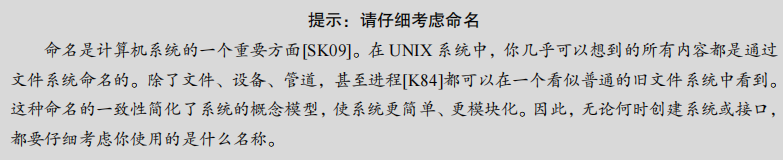

## 第39章 插叙：文件和目录

​		到目前为止，我们看到了两项关键操作系统技术的发展：进程，它是虚拟化的 CPU；地址空间，它是虚拟化的内存。在这两种抽象共同作用下，程序运行时就好像它在自己的私有独立世界中一样，好像它有自己的处理器（或多处理器），好像它有自己的内存。这种假象使得对系统编程变得更容易，因此现在不仅在台式机和服务器上盛行，而且在所有可编程平台上越来越普遍，包括手机等在内。

​		在这一部分，我们加上虚拟化拼图中更关键的一块：持久存储（persistent storage）。永久存储设备永久地（或至少长时间地）存储信息，如传统硬盘驱动器（hard disk drive）或更现代的固态存储设备（solid-state storage device）。持久存储设备与内存不同。内存在断电时，其内容会丢失，而持久存储设备会保持这些数据不变。因此，操作系统必须特别注意这样的设备：用户用它们保存真正关心的数据。

#### 关键问题：如何管理持久存储设备

**操作系统应该如何管理持久存储设备？都需要哪些 API？实现有哪些重要方面？**

​		接下来几章会讨论管理持久数据的一些关键技术，重点是如何提高性能及可靠性。但

是，我们先从总体上看看 API：你在与 UNIX 文件系统交互时会看到的接口。

### 39.1 文件和目录

操作系统通过虚拟化持久存储设备来管理数据。持久存储设备，如硬盘驱动器和固态存储设备，可以长时间存储信息，即使在断电后也不会丢失。这与内存不同，内存在断电时会丢失其内容。文件系统的任务是管理这些持久存储设备，并确保数据的可靠存储和检索。

文件和目录是存储虚拟化的两个关键抽象：

- **文件**：文件是一个线性字节数组，可以被读取和写入。每个文件都有一个唯一的标识符（如 inode 号），用于内部识别。操作系统通常不关心文件的内容类型，只负责存储和管理这些数据。
- **目录**：目录包含一个（用户可读名称，低级名称）的列表，将用户可读名称映射到文件的低级名称（如 inode 号）。目录可以包含文件或其他目录，形成一个目录树结构，从根目录（“/”）开始，通过分隔符命名子目录，直到指定的文件或目录。

#### 原文：

​		随着时间的推移，存储虚拟化形成了两个关键的抽象。第一个是文件（file）。文件就是一个线性字节数组，每个字节都可以读取或写入。每个文件都有某种低级名称（low-level name），通常是某种数字。用户通常不知道这个名字（我们稍后会看到）。由于历史原因，文件的低级名称通常称为 inode 号（inode number）。我们将在以后的章节中学习更多关于inode 的知识。现在，只要假设每个文件都有一个与其关联的 inode 号。

​		在大多数系统中，操作系统不太了解文件的结构（例如，它是图片、文本文件还是 C代码）。相反，文件系统的责任仅仅是将这些数据永久存储在磁盘上，并确保当你再次请求数据时，得到你原来放在那里的内容。做到这一点并不像看起来那么简单！ 

​		第二个抽象是目录（directory）。一个目录，像一个文件一样，也有一个低级名字（即inode 号），但是它的内容非常具体：它包含一个（用户可读名字，低级名字）对的列表。例如，假设存在一个低级别名称为“10”的文件，它的用户可读的名称为“foo”。“foo”所在的目录因此会有条目（“foo”，“10”），将用户可读名称映射到低级名称。目录中的每个条目都指向文件或其他目录。通过将目录放入其他目录中，用户可以构建任意的目录树（directory tree，或目录层次结构，directory hierarchy），在该目录树下存储所有文件和目录。

​		目录层次结构从根目录（root directory）开始（在基于 UNIX 的系统中，根目录就记为“/”），并使用某种分隔符（separator）来命名后续子目录（sub-directories），直到命名所需的文件或目录。例如，如果用户在根目录中创建了一个目录 foo，然后在目录 foo中创建了一个文件 bar.txt，我们就可以通过它的绝对路径名（absolute pathname）来引用该文件，在这个例子中，它将是/foo/bar.txt。更复杂的目录树，请参见图 39.1。示例中的有效目录是/，/foo，/bar，/bar/bar，/bar/foo，有效的文件是/foo/bar.txt 和/bar/foo/bar.txt。目录和文件可以具有相同的名称，只要它们位于文件系统树的不同位置（例如，图中有两个名为 bar.txt 的文件：/foo/bar.txt 和/bar/foo/bar.txt）。



​		你可能还会注意到，这个例子中的文件名通常包含两部分：bar 和 txt，以句点分隔。第一部分是任意名称，而文件名的第二部分通常用于指示文件的类型（type），例如，它是 C代码（例如.c）还是图像（例如.jpg），或音乐文件（例如.mp3）。然而，这通常只是一个惯例（convention）：一般不会强制名为 main.c 的文件中包含的数据确实是 C 源代码。

​		因此，我们可以看到文件系统提供的了不起的东西：一种方便的方式来命名我们感兴趣的所有文件。名称在系统中很重要，因为访问任何资源的第一步是能够命名它。在 UNIX系统中，文件系统提供了一种统一的方式来访问磁盘、U 盘、CD-ROM、许多其他设备上的文件，事实上还有很多其他的东西，都位于单一目录树下。


### 39.2 文件系统接口

文件系统接口提供了一组用于创建、访问和删除文件的 API。我们将在本节中探讨这些基本操作，并介绍用于删除文件的神秘调用 `unlink()`。

### 39.3 创建文件

文件的创建可以通过 `open()` 系统调用完成。调用 `open()` 并传入 `O_CREAT` 标志可以创建一个新文件。以下是一个示例代码，用于在当前工作目录中创建一个名为 "foo" 的文件：

```
int fd = open("foo", O_CREAT | O_WRONLY | O_TRUNC);
```

在这个例子中，`open()` 接受了一些不同的标志：

- `O_CREAT`：创建一个新文件。
- `O_WRONLY`：以只写模式打开文件。
- `O_TRUNC`：如果文件已经存在，将其截断为零字节大小，删除所有现有内容。

`open()` 的返回值是一个文件描述符（file descriptor），这是一个整数，用于标识进程中的打开文件。文件描述符是进程私有的，用于后续的文件操作，如读取或写入。

### 补充：create() 系统调用

旧的创建文件方法是使用 `creat()` 系统调用，这个函数的作用类似于 `open()`，但只创建文件并以只写模式打开。虽然 `creat()` 已经过时，但它在 UNIX 系统的历史中占有一席之地。

通过 `open()` 或 `creat()` 创建文件后，操作系统返回一个文件描述符。这个文件描述符用于后续的文件操作，如读取和写入。

### 39.4 读写文件

在创建了文件后，下一步通常是读取或写入文件的内容。例如，使用 `echo` 命令输出内容到文件 `foo`，然后通过 `cat` 命令将其内容显示在屏幕上。为了理解 `cat` 程序如何读取文件，我们可以使用 `strace` 工具来追踪程序执行时的系统调用。

在追踪 `cat foo` 的执行时，`strace` 显示了以下系统调用顺序：

1. **`open()`**：`cat` 首先打开文件 `foo` 以进行读取操作，使用了 `O_RDONLY` 标志表示只读模式，并使用 `O_LARGEFILE` 标志支持大文件。调用成功后，返回了一个文件描述符（通常为 3，因为 0、1、2 分别被分配给标准输入、输出和错误）。
2. **`read()`**：`cat` 然后使用 `read()` 从文件中读取数据。`read()` 的第一个参数是文件描述符，第二个参数是缓冲区的指针，第三个参数是读取的字节数。在此示例中，`read()` 成功读取了 6 个字节，包括 "hello" 和换行符。
3. **`write()`**：接着，`cat` 使用 `write()` 将读取的数据输出到屏幕，`write()` 的目标是文件描述符 1，即标准输出。
4. **`close()`**：最后，`cat` 关闭文件 `foo`，表示读取操作完成。

写入文件的过程与读取类似，区别在于使用 `write()` 系统调用将数据写入文件。通过 `strace` 可以轻松追踪这些操作。

### 39.5 读取和写入，但不按顺序

虽然文件通常是顺序读取或写入的，但有时需要从文件的特定位置读取或写入数据。为此，可以使用 `lseek()` 系统调用来移动文件的当前偏移量。

`lseek()` 的原型如下：

```
off_t lseek(int fildes, off_t offset, int whence);
```

- **`fildes`**：文件描述符，标识要操作的文件。
- **`offset`**：偏移量，表示从文件中的哪个位置开始。
- **`whence`**：指定偏移量的基准点，可以是 `SEEK_SET`（从文件头开始）、`SEEK_CUR`（从当前位置开始）或 `SEEK_END`（从文件末尾开始）。

操作系统为每个进程打开的文件维护一个“当前”偏移量。`lseek()` 可以通过显式调用来更改这个偏移量。需要注意的是，`lseek()` 调用并不会直接导致磁盘寻道，只是修改了内核中跟踪文件位置的变量。真正的磁盘寻道发生在实际读取或写入操作时。

### 39.6 用 fsync()立即写入

通常，当程序调用 `write()` 时，文件系统会将数据暂时缓存在内存中，并在稍后的某个时间点将其实际写入持久存储设备。这种做法有助于提高系统性能，但也带来了潜在的数据丢失风险，尤其是在 `write()` 调用后但数据还未写入磁盘之前发生系统崩溃的情况下。

为了满足某些应用程序（如数据库管理系统）对数据持久性的严格要求，大多数文件系统提供了额外的控制 API。在 UNIX 系统中，这个接口是 `fsync(int fd)`。当应用程序调用 `fsync()` 时，文件系统会强制将与指定文件描述符关联的所有脏数据写入磁盘，并在写入完成后返回，确保数据已经安全存储。

以下是一个使用 `fsync()` 的简单示例：

```
int fd = open("foo", O_CREAT | O_WRONLY | O_TRUNC);
assert(fd > -1);
int rc = write(fd, buffer, size);
assert(rc == size);
rc = fsync(fd);
assert(rc == 0);
```

在这个示例中，文件 `foo` 被打开，数据块被写入，接着通过调用 `fsync()` 强制数据立即写入磁盘。`fsync()` 返回后，应用程序可以确信数据已经被保存。然而，这个操作并不完全保证文件系统的一致性。如果文件是新创建的，还需要对包含该文件的目录调用 `fsync()`，以确保该目录的更新也被写入磁盘。这种细节如果忽略，可能会导致应用程序级别的错误。

### 39.7 文件重命名

当一个文件被创建后，有时需要给它一个新的名字。在 UNIX 系统中，这可以通过 `mv` 命令完成，它使用了系统调用 `rename(char *old, char *new)` 来实现文件的重命名。`rename()` 调用接受两个参数：旧名称和新名称。

`rename()` 提供了一个关键的保证：它通常是一个原子操作。无论系统是否在重命名期间崩溃，文件要么保留旧名称，要么成功重命名为新名称，不会出现部分重命名或其他中间状态。这对一些需要确保文件状态一致性的应用程序非常重要。

例如，在文件编辑器（如 `emacs`）中，当用户保存文件时，编辑器会将文件的新版本写入一个临时文件（如 `foo.txt.tmp`），然后使用 `fsync()` 确保数据被写入磁盘。接着，它通过调用 `rename()` 将临时文件重命名为原始文件名称，从而实现对文件的原子更新：

```
int fd = open("foo.txt.tmp", O_WRONLY|O_CREAT|O_TRUNC);
write(fd, buffer, size); // write out new version of file
fsync(fd);
close(fd);
rename("foo.txt.tmp", "foo.txt");
```

这种方式确保了即使系统在更新过程中崩溃，文件系统中也不会出现不一致的状态，新旧文件的切换是原子的。

### 39.8 获取文件信息

在文件系统中，除了存储文件的实际数据外，还需要保存大量关于文件的元数据（metadata）。这些元数据可以通过 `stat()` 或 `fstat()` 系统调用来获取，这些调用会填充一个 `stat` 结构，其中包含了文件的各类信息。`stat` 结构包括以下字段：

- `st_dev`: 包含文件的设备ID。
- `st_ino`: 文件的 inode 号。
- `st_mode`: 文件的保护模式（权限）。
- `st_nlink`: 硬链接的数量。
- `st_uid`: 文件所有者的用户 ID。
- `st_gid`: 文件所有者的组 ID。
- `st_rdev`: 设备 ID（如果文件是特殊文件）。
- `st_size`: 文件的总大小（以字节为单位）。
- `st_blksize`: 文件系统 I/O 的块大小。
- `st_blocks`: 分配的块数。
- `st_atime`: 最后一次访问时间。
- `st_mtime`: 最后一次修改时间。
- `st_ctime`: 最后一次状态更改时间。

例如，使用命令 `stat` 可以查看某个文件的元数据信息：

```
prompt> echo hello > file 
prompt> stat file 
 File: 'file' 
 Size: 6 Blocks: 8 IO Block: 4096 regular file 
Device: 811h/2065d Inode: 67158084 Links: 1 
Access: (0640/-rw-r-----) Uid: (30686/ remzi) Gid: (30686/ remzi) 
Access: 2011-05-03 15:50:20.157594748 -0500 
Modify: 2011-05-03 15:50:20.157594748 -0500 
Change: 2011-05-03 15:50:20.157594748 -0500 
```

文件系统通常将这些信息保存在名为 inode 的数据结构中。当我们讨论文件系统的实现时，会更深入地了解 inode 的工作原理。

### 39.9 删除文件

在 UNIX 系统中，删除文件是通过 `unlink()` 系统调用实现的。尽管很多用户认为删除文件应该是一个 "remove" 或 "delete" 调用，但 `unlink()` 之所以得名，是因为它实际上解除了文件名与其数据的链接。换句话说，`unlink()` 移除了目录中的条目，但文件数据仍可能保留在磁盘上，直到系统确认没有其他硬链接指向该数据。

例如，使用 `strace` 追踪删除文件的过程，可以看到如下的系统调用：

```
prompt> strace rm foo 
... 
unlink("foo") = 0 
... 
```

`unlink()` 只需要文件名作为参数，并在成功删除文件时返回 0。

### 39.10 创建目录

除了文件之外，操作系统还允许用户创建目录。目录的创建是通过 `mkdir()` 系统调用实现的。创建目录时，系统会在该目录中添加两个默认条目：“.”（指向自身）和 “..”（指向父目录）。

例如，创建一个名为 `foo` 的目录，可以使用如下命令并追踪其系统调用：

```
prompt> strace mkdir foo 
... 
mkdir("foo", 0777) = 0 
... 
```

在创建目录后，可以使用 `ls -a` 查看目录内容：

```
bash复制代码prompt> ls -a foo
.  ..
```

这表示目录在初始创建时确实是“空的”，但它包含了指向自身和父目录的两个基础条目。

要注意的是，目录的内容是文件系统的元数据，用户不能直接修改目录内容，只能通过创建或删除文件和目录间接改变目录内容。

### 39.11 读取目录

在创建了目录后，我们可能希望读取其中的内容。例如，`ls` 命令就是用于列出目录内容的工具。为了实现类似 `ls` 的功能，我们可以使用一组特定的系统调用：`opendir()`、`readdir()` 和 `closedir()`。

以下是一个简单的示例程序，演示如何使用这些调用读取目录内容并打印每个文件的名称和 inode 编号：

```
int main(int argc, char *argv[]) { 
    DIR *dp = opendir("."); 
    assert(dp != NULL); 
    struct dirent *d; 
    while ((d = readdir(dp)) != NULL) { 
        printf("%d %s\n", (int) d->d_ino, d->d_name); 
    } 
    closedir(dp); 
    return 0; 
}
```

`opendir()` 打开一个目录，并返回一个指向目录流的指针。然后，`readdir()` 函数一次读取一个目录项，每个目录项包含文件名和 inode 编号等信息。`closedir()` 则用于关闭目录流。

目录项的结构 `dirent` 包含以下字段：

- `d_name[256]`: 文件名。
- `d_ino`: 文件的 inode 编号。
- `d_off`: 到下一个目录项的偏移量。
- `d_reclen`: 目录项的长度。
- `d_type`: 文件类型。

通过这个程序，我们可以看到目录中的所有文件及其相关的 inode 信息。如果需要更多关于文件的详细信息（例如文件大小等），可以在每个文件上调用 `stat()`。

### 39.12 删除目录

与文件类似，目录也可以删除，但过程稍微复杂一些。删除目录的系统调用是 `rmdir()`，这也是命令行程序 `rmdir` 所使用的。与文件的删除不同，删除目录时需要确保目录是空的，即除了 "." 和 ".." 之外没有其他内容。否则，`rmdir()` 调用将会失败。

### 39.13 硬链接

硬链接允许在文件系统中创建多个指向同一文件的名称。通过 `link()` 系统调用，我们可以创建一个新文件名，指向与已有文件相同的 inode。命令行工具 `ln` 用于创建硬链接。以下是一个简单的示例：

```
prompt> echo hello > file 
prompt> ln file file2 
prompt> cat file2 
hello
```

在这个示例中，我们创建了一个文件 `file`，然后使用 `ln` 创建了一个硬链接 `file2`。此后，`file` 和 `file2` 都指向同一个 inode，因此内容是相同的。通过 `ls -i` 命令，我们可以看到这两个文件共享相同的 inode 编号：

```
bash复制代码prompt> ls -i file file2 
67158084 file 
67158084 file2 
```

删除文件时，`unlink()` 系统调用会移除文件名与其 inode 之间的链接，并减少 inode 的引用计数。只有当引用计数为零时，文件系统才会真正删除文件并释放与之相关的数据块。

以下是一个关于硬链接和引用计数的示例：

```
prompt> echo hello > file 
prompt> stat file 
... Inode: 67158084 Links: 1 ... 
prompt> ln file file2 
prompt> stat file 
... Inode: 67158084 Links: 2 ... 
prompt> ln file2 file3 
prompt> stat file 
... Inode: 67158084 Links: 3 ... 
prompt> rm file 
prompt> stat file2 
... Inode: 67158084 Links: 2 ... 
prompt> rm file2 
prompt> stat file3 
... Inode: 67158084 Links: 1 ... 
prompt> rm file3
```

在这个过程中，我们可以看到 inode 的链接计数如何随着硬链接的创建和删除而增加或减少。最终，当所有链接被删除时，文件的数据才会真正从文件系统中移除。

### 39.14 符号链接

符号链接（symbolic link），也称为软链接（soft link），是文件系统中的一种特殊链接类型，它解决了硬链接的一些局限性。硬链接有一些限制，例如无法为目录创建硬链接，也无法在不同的磁盘分区之间创建硬链接。为了解决这些问题，符号链接被引入。

#### 创建符号链接

要创建符号链接，可以使用与创建硬链接相同的 `ln` 程序，但需要加上 `-s` 标志。以下是创建符号链接的示例：

```
bash复制代码prompt> echo hello > file 
prompt> ln -s file file2 
prompt> cat file2 
hello 
```

在这个例子中，我们首先创建了一个包含文本 "hello" 的文件 `file`，然后使用 `ln -s` 创建了一个指向 `file` 的符号链接 `file2`。现在可以通过 `file` 和 `file2` 两个名称访问同一文件的内容。

#### 符号链接与硬链接的区别

虽然创建符号链接和硬链接的过程类似，但它们有本质的不同：

1. **文件类型**：符号链接是文件系统中与常规文件和目录不同的第三种文件类型。通过 `stat` 命令，可以看到符号链接的文件类型被标识为 `symbolic link`：

   ```
   prompt> stat file 
   ... regular file ...
   prompt> stat file2 
   ... symbolic link ...
   ```

2. **文件大小**：符号链接的大小等于它所指向的文件路径名的长度。例如，指向 `file` 的符号链接 `file2` 大小为 4 个字节，因为 `file` 这个路径名的长度为 4 个字符。

   ```
   prompt> ls -al 
   drwxr-x--- 2 remzi remzi 29 May 3 19:10 ./
   drwxr-x--- 27 remzi remzi 4096 May 3 15:14 ../
   -rw-r----- 1 remzi remzi 6 May 3 19:10 file 
   lrwxrwxrwx 1 remzi remzi 4 May 3 19:10 file2 -> file 
   ```

   如果符号链接指向一个更长的文件路径名，那么符号链接的大小也会相应增加：

   ```
   prompt> echo hello > alongerfilename 
   prompt> ln -s alongerfilename file3 
   prompt> ls -al alongerfilename file3 
   -rw-r----- 1 remzi remzi 6 May 3 19:17 alongerfilename 
   lrwxrwxrwx 1 remzi remzi 15 May 3 19:17 file3 -> alongerfilename 
   ```

3. **悬空引用（Dangling Reference）**：由于符号链接是指向另一个文件路径的引用，当被引用的文件被删除时，符号链接会变成一个悬空引用（dangling reference），即符号链接仍然存在，但它指向的文件不存在了。

   ```
   prompt> echo hello > file 
   prompt> ln -s file file2 
   prompt> cat file2 
   hello 
   prompt> rm file 
   prompt> cat file2 
   cat: file2: No such file or directory 
   ```

   在这个例子中，当我们删除了 `file` 文件后，符号链接 `file2` 变成了悬空引用，尝试访问它会导致错误。

符号链接提供了一种灵活的方法来引用文件，可以跨文件系统和目录创建链接，但要注意它们可能导致悬空引用的问题。

### 39.15 创建并挂载文件系统

在操作系统中，文件系统接口不仅包括访问文件和目录，还包括如何从多个底层文件系统构建一个完整的目录树。这是通过创建文件系统并将其挂载到统一的目录树上来实现的。

#### 创建文件系统

要创建文件系统，通常使用一个名为 `mkfs`（发音为“make fs”）的工具。这个工具接收一个设备（例如磁盘分区，如 `/dev/sda1`）和文件系统类型（例如 `ext3`）作为输入，并在指定的磁盘分区上创建一个空的文件系统，从根目录开始。`mkfs` 命令的功能是初始化磁盘，使其能够存储文件和目录。

#### 挂载文件系统

一旦文件系统被创建，就需要通过挂载将其集成到现有的目录树中，使其内容可以访问。这个任务是通过 `mount` 程序完成的，它调用底层的 `mount()` 系统调用来实际执行挂载操作。

例如，假设有一个存储在 `/dev/sda1` 分区上的 `ext3` 文件系统，其中包含一个根目录和两个子目录 `a` 和 `b`，每个子目录中都有一个名为 `foo` 的文件。如果希望将该文件系统挂载到现有的目录 `/home/users` 上，可以使用以下命令：

```
prompt> mount -t ext3 /dev/sda1 /home/users
```

成功挂载后，新的文件系统的根目录将映射到 `/home/users`，可以通过 `/home/users/` 访问该根目录，通过 `/home/users/a` 和 `/home/users/b` 访问子目录 `a` 和 `b`，并通过 `/home/users/a/foo` 和 `/home/users/b/foo` 访问文件 `foo`。

通过 `mount` 命令可以查看系统上所有已挂载的文件系统及其挂载点。例如：

```
/dev/sda1 on / type ext3 (rw)
proc on /proc type proc (rw)
sysfs on /sys type sysfs (rw)
```

这显示了各种类型的文件系统，包括标准的基于磁盘的 `ext3` 文件系统、用于访问当前进程信息的 `proc` 文件系统、用于临时文件的 `tmpfs` 文件系统等。

### 39.16 小结

UNIX 文件系统接口虽然看似简单，但实际操作中有很多细节需要掌握。熟悉这些接口并大量使用它们是掌握文件系统操作的最佳方式。通过学习和实践，逐渐深入了解如何实现和使用文件系统接口。接下来的内容将深入探讨如何实现满足这些接口要求的文件系统。