## 第 40 章 文件系统实现

本章详细介绍了 VSFS（Very Simple File System），一个简化版的 UNIX 文件系统。VSFS 用于演示文件系统的基本结构、访问方法和策略。这些概念在许多现代文件系统中仍然适用。

#### 原文：

​		本章将介绍一个简单的文件系统实现，称为 VSFS（Very Simple File System，简单文件系统）。它是典型 UNIX 文件系统的简化版本，因此可用于介绍一些基本磁盘结构、访问方法和各种策略，你可以在当今许多文件系统中看到。

​		文件系统是纯软件。与 CPU 和内存虚拟化的开发不同，我们不会添加硬件功能来使文件系统的某些方面更好地工作（但我们需要注意设备特性，以确保文件系统运行良好）。由于在构建文件系统方面具有很大的灵活性，因此人们构建了许多不同的文件系统，从 AFS（Andrew 文件系统）[H+88]到 ZFS（Sun 的 Zettabyte 文件系统）[B07]。所有这些文件系统都有不同的数据结构，在某些方面优于或逊于同类系统。因此，我们学习文件系统的方式是通过案例研究：首先，通过本章中的简单文件系统（VSFS）介绍大多数概念。然后，对真实文件系统进行一系列研究，以了解它们在实践中有何区别。


### 40.1 思考方式

理解文件系统的两个核心方面是：

1. **数据结构**：文件系统使用的数据结构用于组织磁盘上的数据和元数据。例如，简单的文件系统（如 VSFS）使用块数组，而更复杂的文件系统（如 XFS）使用基于树的结构。
2. **访问方法**：访问方法定义了如何将系统调用（如 `open()`、`read()`、`write()`）映射到文件系统的数据结构上。了解在这些调用期间哪些结构会被读取或修改，是理解文件系统工作的关键。


#### 原文：

​		考虑文件系统时，我们通常建议考虑它们的两个不同方面。如果你理解了这两个方面，

可能就理解了文件系统基本工作原理。

第一个方面是文件系统的数据结构（data structure）。换言之，文件系统在磁盘上使用哪

些类型的结构来组织其数据和元数据？我们即将看到的第一个文件系统（包括下面的

VSFS）使用简单的结构，如块或其他对象的数组，而更复杂的文件系统（如 SGI 的 XFS）

使用更复杂的基于树的结构[S+96]。


​		文件系统的第二个方面是访问方法（access method）。如何将进程发出的调用，如 open()、read()、write()等，映射到它的结构上？在执行特定系统调用期间读取哪些结构？改写哪些结构？所有这些步骤的执行效率如何？如果你理解了文件系统的数据结构和访问方法，就形成了一个关于它如何工作的良好心智模型，这是系统思维的一个关键部分。在深入研究我们的第一个实现时，请尝试建立你的心智模型。


### 40.2 整体组织

VSFS 文件系统的基本组织方式包括将磁盘分割成大小为 4KB 的块。磁盘的每个部分用于不同的目的：

- **数据区域（Data Region）**：用于存放用户数据的磁盘区域，占据磁盘大部分空间。例如，64 块的磁盘中，最后 56 块用于数据区域。
- **inode 表（Inode Table）**：存放文件元数据的表格，每个 inode 记录文件的大小、块位置、权限等信息。假设 5 个块用于 inode 表，每个块可存储 16 个 inode，总共可存储 80 个 inode。
- **分配结构（Allocation Structure）**：用于记录 inode 和数据块的使用状态。VSFS 使用位图来表示块的分配状态：
  - **数据位图（Data Bitmap）**：标记数据块的分配状态。
  - **inode 位图（Inode Bitmap）**：标记 inode 的分配状态。
- **超级块（Superblock）**：包含关于文件系统的全局信息，如 inode 和数据块的总数及其起始位置。

下图展示了磁盘布局：

```
| S (Superblock) | i (Inode Bitmap) | d (Data Bitmap) | I (Inode Table) | D (Data Region) |
|       1块       |      1块         |       1块        |      5块          |      56块         |
```

#### 原文：

​		我们现在来开发 VSFS 文件系统在磁盘上的数据结构的整体组织。我们需要做的第一件事是将磁盘分成块（block）。简单的文件系统只使用一种块大小，这里正是这样做的。我们选择常用的 4KB。

​		因此，我们对构建文件系统的磁盘分区的看法很简单：一系列块，每块大小为 4KB。在大小为 *N* 个 4KB 块的分区中，这些块的地址为从 0 到 *N*−1。假设我们有一个非常小的磁盘，只有 64 块：

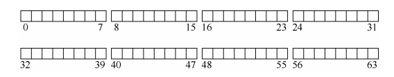

​		现在让我们考虑一下，为了构建文件系统，需要在这些块中存储什么。当然，首先想到的是用户数据。实际上，任何文件系统中的大多数空间都是（并且应该是）用户数据。我们将用于存放用户数据的磁盘区域称为数据区域（data region），简单起见，将磁盘的固定部分留给这些块，例如磁盘上 64 个块的最后 56 个：

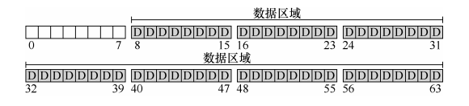

​		正如我们在第 39 章中了解到的，文件系统必须记录每个文件的信息。该信息是元数据（metadata）的关键部分，并且记录诸如文件包含哪些数据块（在数据区域中）、文件的大小，其所有者和访问权限、访问和修改时间以及其他类似信息的事情。为了存储这些信息，文件系统通常有一个名为 inode 的结构（后面会详细介绍 inode）。为了存放 inode，我们还需要在磁盘上留出一些空间。我们将这部分磁盘称为 inode 表（inode table），它只是保存了一个磁盘上 inode 的数组。因此，假设我们将 64 个块中的 5 块用于 inode，磁盘映像现在看起来如下：

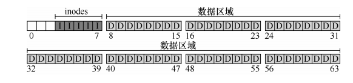

​		在这里应该指出，inode 通常不是那么大，例如，只有 128 或 256 字节。假设每个 inode有 256 字节，一个 4KB 块可以容纳 16 个 inode，而我们上面的文件系统则包含 80 个 inode。在我们简单的文件系统中，建立在一个小小的 64 块分区上，这个数字表示文件系统中可以拥有的最大文件数量。但是请注意，建立在更大磁盘上的相同文件系统可以简单地分配更大的 inode 表，从而容纳更多文件。

​		到目前为止，我们的文件系统有了数据块（D）和 inode（I），但还缺一些东西。你可能已经猜到，还需要某种方法来记录 inode 或数据块是空闲还是已分配。因此，这种分配结构（allocation structure）是所有文件系统中必需的部分。

​		当然，可能有许多分配记录方法。例如，我们可以用一个空闲列表（free list），指向第一个空闲块，然后它又指向下一个空闲块，依此类推。我们选择一种简单而流行的结构，称为位图（bitmap），一种用于数据区域（数据位图，data bitmap），另一种用于 inode 表（inode位图，inode bitmap）。位图是一种简单的结构：每个位用于指示相应的对象/块是空闲（0）还是正在使用（1）。因此新的磁盘布局如下，包含 inode 位图（i）和数据位图（d）：

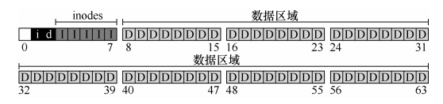

​		你可能会注意到，对这些位图使用整个 4KB 块是有点杀鸡用牛刀。这样的位图可以记录 32KB 对象是否分配，但我们只有 80 个 inode 和 56 个数据块。但是，简单起见，我们就为每个位图使用整个 4KB 块。

​		细心的读者可能已经注意到，在极简文件系统的磁盘结构设计中，还有一块。我们将它保留给超级块（superblock），在下图中用 S 表示。超级块包含关于该特定文件系统的信息，包括例如文件系统中有多少个 inode 和数据块（在这个例子中分别为 80 和 56）、inode 表的开始位置（块 3）等等。它可能还包括一些幻数，来标识文件系统类型（在本例中为 VSFS）。

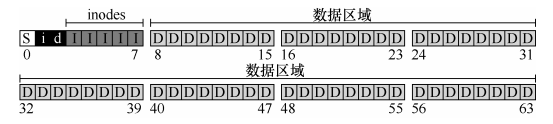

​		因此，在挂载文件系统时，操作系统将首先读取超级块，初始化各种参数，然后将该卷添加到文件系统树中。当卷中的文件被访问时，系统就会知道在哪里查找所需的磁盘上的结构。


### 40.3 文件组织：inode

**inode** 是存储文件元数据的结构，包括文件类型、大小、权限、时间戳和数据块指针。每个 inode 由一个 inode 号（inumber）标识。VSFS 中，inode 号可用于直接计算 inode 在磁盘上的位置。

假设 inode 表从 12KB 开始，读取 inode 号为 32 的节点时的计算如下：

- 偏移量计算：`32 × 256字节 = 8192字节`

- 加上 inode 表起始地址：`8192字节 + 12KB = 20KB`

- 扇区地址计算：

  ```
  blk = (inumber * sizeof(inode_t)) / blockSize;
  sector = ((blk * blockSize) + inodeStartAddr) / sectorSize;
  ```

**设计 inode 的关键在于如何引用数据块的位置**：

- **直接指针**：每个直接指针指向一个数据块。
- **间接指针**：指向一个包含多个指针的块，每个指针指向一个数据块。
- **双重间接指针**：指向包含间接块指针的块，间接块包含数据块指针。
- **多级索引**：这种不平衡树形结构允许 inode 支持非常大的文件。

表 40.1 列出了 ext2 的 inode 结构示例：

| 大小（字节） | 名称        | 用途              |
| ------------ | ----------- | ----------------- |
| 2            | mode        | 文件权限          |
| 2            | uid         | 文件所有者        |
| 4            | size        | 文件大小          |
| 4            | time        | 最近访问时间      |
| 4            | ctime       | 创建时间          |
| 4            | mtime       | 最近修改时间      |
| 4            | dtime       | 删除时间          |
| 2            | gid         | 所属分组          |
| 2            | links count | 硬链接数量        |
| 4            | blocks      | 分配的块数        |
| 4            | flags       | inode 的使用方式  |
| 60           | block       | 磁盘指针（15 个） |

#### 原文：

文件系统最重要的磁盘结构之一是 inode，几乎所有的文件系统都有类似的结构。名

称 inode 是 index node（索引节点）的缩写，它是由 UNIX 开发人员 Ken Thompson [RT74]

给出的历史性名称，因为这些节点最初放在一个数组中，在访问特定 inode 时会用到该数

组的索引。

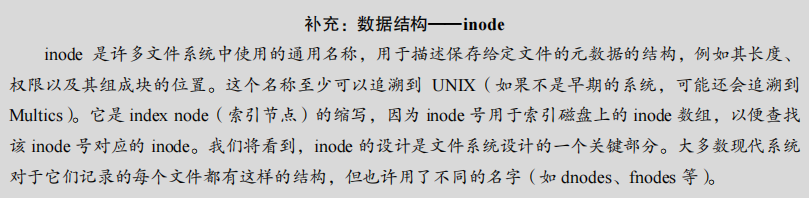

​		每个 inode 都由一个数字（称为 inumber）隐式引用，我们之前称之为文件的低级名称（low-level name）。在 VSFS（和其他简单的文件系统）中，给定一个 inumber，你应该能够直接计算磁盘上相应节点的位置。例如，如上所述，获取 VSFS 的 inode 表：大小为 20KB（5 个 4KB 块），因此由 80 个 inode（假设每个 inode 为 256 字节）组成。进一步假设 inode区域从 12KB 开始（即超级块从 0KB 开始，inode 位图在 4KB 地址，数据位图在 8KB，因此 inode 表紧随其后）。因此，在 VSFS 中，我们为文件系统分区的开头提供了以下布局（特写视图）：

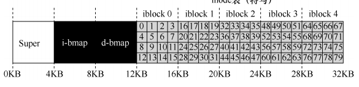

​		要读取 inode 号 32，文件系统首先会计算 inode 区域的偏移量（32×inode 的大小，即8192），将它加上磁盘 inode 表的起始地址（inodeStartAddr = 12KB），从而得到希望的 inode块的正确字节地址：20KB。回想一下，磁盘不是按字节可寻址的，而是由大量可寻址扇区组成，通常是 512 字节。因此，为了获取包含索引节点 32 的索引节点块，文件系统将向节点（即 40）发出一个读取请求，取得期望的 inode 块。更一般地说，inode 块的扇区地址 iaddr可以计算如下：

```
blk = (inumber * sizeof(inode_t)) / blockSize; 
sector = ((blk * blockSize) + inodeStartAddr) / sectorSize;
```

​		在每个 inode 中，实际上是所有关于文件的信息：文件类型（例如，常规文件、目录等）、大小、分配给它的块数、保护信息（如谁拥有该文件以及谁可以访问它）、一些时间信息（包括文件创建、修改或上次访问的时间文件下），以及有关其数据块驻留在磁盘上的位置的信息（如某种类型的指针）。我们将所有关于文件的信息称为元数据（metadata）。实际上，文件系统中除了纯粹的用户数据外，其他任何信息通常都称为元数据。表 40.1 所示的是 ext2 [P09]的 inode 的例子。

​		设计 inode 时，最重要的决定之一是它如何引用数据块的位置。一种简单的方法是在inode 中有一个或多个直接指针（磁盘地址）。每个指针指向属于该文件的一个磁盘块。这种方法有局限：例如，如果你想要一个非常大的文件（例如，大于块的大小乘以直接指针数），那就不走运了。

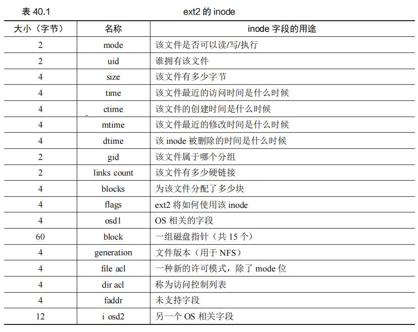

#### 多级索引 

​		为了支持更大的文件，文件系统设计者必须在 inode 中引入不同的结构。一个常见的思路是有一个称为间接指针（indirect pointer）的特殊指针。它不是指向包含用户数据的块，而是指向包含更多指针的块，每个指针指向用户数据。因此，inode 可以有一些固定数量（例如 12 个）的直接指针和一个间接指针。如果文件变得足够大，则会分配一个间接块（来自磁盘的数据块区域），并将 inode 的间接指针设置为指向它。假设一个块是 4KB，磁盘地址是 4 字节，那就增加了 1024 个指针。文件可以增长到（12 + 1024）×4KB，即 4144KB。


​		毫不奇怪，在这种方法中，你可能希望支持更大的文件。为此，只需添加另一个指向inode 的指针：双重间接指针（double indirect pointer）。该指针指的是一个包含间接块指针的块，每个间接块都包含指向数据块的指针。因此，双重间接块提供了可能性，允许使用额外的 1024×1024 个 4KB 块来增长文件，换言之，支持超过 4GB 大小的文件。不过，你可能想要更多，我们打赌你知道怎么办：三重间接指针（triple indirect pointer）。

​		总之，这种不平衡树被称为指向文件块的多级索引（multi-level index）方法。我们来看一个例子，它有 12 个直接指针，以及一个间接块和一个双重间接块。假设块大小为 4KB，并且指针为 4 字节，则该结构可以容纳一个刚好超过 4GB 的文件，即（12 + 1024 + 10242 ）×4KB。增加一个三重间接块，你是否能弄清楚支持多大的文件？（提示：很大）

​		许多文件系统使用多级索引，包括常用的文件系统，如 Linux ext2 [P09]和 ext3，NetApp的 WAFL，以及原始的 UNIX 文件系统。其他文件系统，包括 SGI XFS 和 Linux ext4，使用范围而不是简单的指针。有关基于范围的方案如何工作的详细信息，请参阅前面的内容（它们类似于讨论虚拟内存时的段）。

​		你可能想知道：为什么使用这样的不平衡树？为什么不采用不同的方法？好吧，事实证明，许多研究人员已经研究过文件系统以及它们的使用方式，几乎每次他们都发现了某些“真相”，几十年来都是如此。其中一个真相是，大多数文件很小。这种不平衡的设计反映了这样的现实。如果大多数文件确实很小，那么为这种情况优化是有意义的。因此，使用少量的直接指针（12 是一个典型的数字），inode 可以直接指向 48KB 的数据，需要一个（或多个）间接块来处理较大的文件。参见 Agrawal 等人最近的研究[A+07]。表 40.2 总结了这些结果。

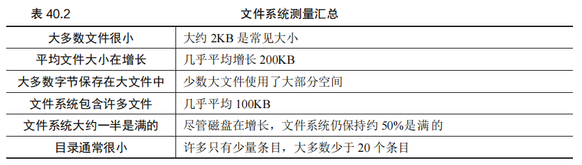

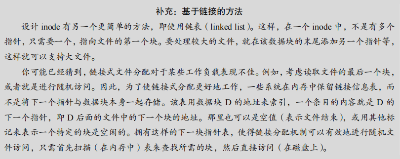

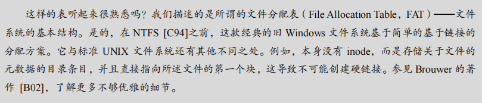

​		当然，在 inode 设计的空间中，存在许多其他可能性。毕竟，inode 只是一个数据结构，任何存储相关信息并可以有效查询的数据结构就足够了。由于文件系统软件很容易改变，如果工作负载或技术发生变化，你应该愿意探索不同的设计。


### 40.4 目录组织

VSFS 目录的组织非常简单，是由（文件名, inode 号）组成的列表。每个目录条目包含 inode 号、记录长度、字符串长度和文件名。

例如，目录 `dir`（inode 号为 5）中有三个文件（`foo`、`bar` 和 `foobar`），它们的 inode 号分别为 12、13 和 24：

| inum | reclen | strlen | name   |
| ---- | ------ | ------ | ------ |
| 5    | 4      | 2      | .      |
| 2    | 4      | 3      | ..     |
| 12   | 4      | 4      | foo    |
| 13   | 4      | 4      | bar    |
| 24   | 8      | 7      | foobar |

目录的 inode 标记为“目录”类型，并且可以包含直接指向数据块的指针或间接块。

#### 原文：

​		在 VSFS 中（像许多文件系统一样），目录的组织很简单。一个目录基本上只包含一个二元组（条目名称，inode 号）的列表。对于给定目录中的每个文件或目录，目录的数据块中都有一个字符串和一个数字。对于每个字符串，可能还有一个长度（假定采用可变大小的名称）。

​		例如，假设目录 dir（inode 号是 5）中有 3 个文件（foo、bar 和 foobar），它们的 inode号分别为 12、13 和 24。dir 在磁盘上的数据可能如下所示：

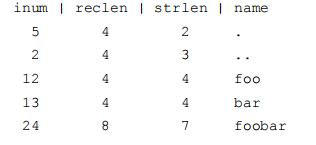

​		在这个例子中，每个条目都有一个 inode 号，记录长度（名称的总字节数加上所有的剩余空间），字符串长度（名称的实际长度），最后是条目的名称。请注意，每个目录有两个额外的条目：.（点）和..（点点）。点目录就是当前目录（在本例中为 dir），而点点是父目录（在本例中是根目录）。

​		删除一个文件（例如调用 unlink()）会在目录中间留下一段空白空间，因此应该有一些方法来标记它（例如，用一个保留的 inode 号，比如 0）。这种删除是使用记录长度的一个原因：新条目可能会重复使用旧的、更大的条目，从而在其中留有额外的空间。

​		你可能想知道确切的目录存储在哪里。通常，文件系统将目录视为特殊类型的文件。因此，目录有一个 inode，位于 inode 表中的某处（inode 表中的 inode 标记为“目录”的类型字段，而不是“常规文件”）。该目录具有由 inode 指向的数据块（也可能是间接块）。这些数据块存在于我们的简单文件系统的数据块区域中。我们的磁盘结构因此保持不变。

​		我们还应该再次指出，这个简单的线性目录列表并不是存储这些信息的唯一方法。像以前一样，任何数据结构都是可能的。例如，XFS [S+96]以 B 树形式存储目录，使文件创建操作（必须确保文件名在创建之前未被使用）快于使用简单列表的系统，因为后者必须扫描其中的条目。


### 40.5 空闲空间管理

VSFS 使用 inode 位图和数据位图来管理空闲空间。这些位图标记哪些 inode 和数据块是空闲的，哪些是已分配的。在创建文件时，系统搜索位图以找到空闲的 inode 并将其分配给新文件。对数据块的分配也类似。

**预分配策略**：在创建文件时，VSFS 会寻找连续的一系列空闲块，从而保证文件在磁盘上的连续性，提高访问性能。

#### 原文：

​		文件系统必须记录哪些 inode 和数据块是空闲的，哪些不是，这样在分配新文件或目录时，就可以为它找到空间。因此，空闲空间管理（free space management）对于所有文件系统都很重要。在 VSFS 中，我们用两个简单的位图来完成这个任务。


​		例如，当我们创建一个文件时，我们必须为该文件分配一个 inode。文件系统将通过位图搜索一个空闲的内容，并将其分配给该文件。文件系统必须将 inode 标记为已使用（用 1），并最终用正确的信息更新磁盘上的位图。分配数据块时会发生类似的一组活动。

​		为新文件分配数据块时，还可能会考虑其他一些注意事项。例如，一些 Linux 文件系统（如 ext2 和 ext3）在创建新文件并需要数据块时，会寻找一系列空闲块（如 8 块）。通过找到这样一系列空闲块，然后将它们分配给新创建的文件，文件系统保证文件的一部分将在磁盘上并且是连续的，从而提高性能。因此，这种预分配（pre-allocation）策略，是为数据块分配空间时的常用启发式方法。


### 40.6 访问路径：读取和写入

VSFS 处理文件读取和写入的访问路径包括：

#### 从磁盘读取文件

以读取文件 `/foo/bar` 为例：

1. 打开文件 `/foo/bar` 的调用会触发系统从根目录开始遍历路径。
2. 根目录的 inode 号为 2，是已知的，在文件系统挂载时加载。
3. 系统首先读取根目录的 inode 和数据块，查找 `foo` 的 inode 号。
4. 递归查找 `bar` 的 inode，读取其数据。
5. 系统返回文件描述符供用户使用。

表 40.3 描述了打开和读取文件的时间线：

| 操作      | 影响的块             | 操作详情                  |
| --------- | -------------------- | ------------------------- |
| open(bar) | root, foo, bar inode | 读取根、foo、bar 的 inode |
| read      | bar data[0]          | 读取 bar 的第一个数据块   |
| read()    | bar data[1]          | 读取第二个数据块          |

#### 写入磁盘

写入操作通常需要分配新块，导致多次 I/O 操作。表 40.4 展示了创建文件 `/foo/bar` 并写入 3 个块的时间线：

| 操作             | 影响的块             | 操作详情                                          |
| ---------------- | -------------------- | ------------------------------------------------- |
| create(/foo/bar) | root, foo, bar inode | 创建文件的过程中，读取和更新根、foo、bar 的 inode |
| write()          | data bitmap, inode   | 更新 inode 和数据位图，写入数据块                 |
| write()          | data bitmap, inode   | 更新 inode 和数据位图，写入数据块                 |
| write()          | data bitmap, inode   | 更新 inode 和数据位图，写入数据块                 |

#### 原文：

​		现在我们已经知道文件和目录如何存储在磁盘上，我们应该能够明白读取或写入文件的操作过程。理解这个访问路径（access path）上发生的事情，是开发人员理解文件系统如何工作的第二个关键。请注意！

​		对于下面的例子，我们假设文件系统已经挂载，因此超级块已经在内存中。其他所有内容（如 inode、目录）仍在磁盘上。

##### 从磁盘读取文件 

​		在这个简单的例子中，让我们先假设你只是想打开一个文件（例如/foo/bar，读取它，然后关闭它）。对于这个简单的例子，假设文件的大小只有 4KB（即 1 块）。当你发出一个 open("/foo/bar", O_RDONLY)调用时，文件系统首先需要找到文件 bar 的inode，从而获取关于该文件的一些基本信息（权限信息、文件大小等等）。为此，文件系统必须能够找到 inode，但它现在只有完整的路径名。文件系统必须遍历（traverse）路径名，从而找到所需的 inode。

​		所有遍历都从文件系统的根开始，即根目录（root directory），它就记为/。因此，文件系统的第一次磁盘读取是根目录的 inode。但是这个 inode 在哪里？要找到 inode，我们必须知道它的 i-number。通常，我们在其父目录中找到文件或目录的 i-number。根没有父目录（根据定义）。因此，根的 inode 号必须是“众所周知的”。在挂载文件系统时，文件系统必须知道它是什么。在大多数 UNIX 文件系统中，根的 inode 号为 2。因此，要开始该过程，文件系统会读入 inode 号 2 的块（第一个 inode 块）。

​		一旦 inode 被读入，文件系统可以在其中查找指向数据块的指针，数据块包含根目录的内容。因此，文件系统将使用这些磁盘上的指针来读取目录，在这个例子中，寻找 foo 的条目。通过读入一个或多个目录数据块，它将找到 foo 的条目。一旦找到，文件系统也会找到下一个需要的 foo 的 inode 号（假定是 44）。

​		下一步是递归遍历路径名，直到找到所需的 inode。在这个例子中，文件系统读取包含foo 的 inode 及其目录数据的块，最后找到 bar 的 inode 号。open()的最后一步是将 bar 的 inode读入内存。然后文件系统进行最后的权限检查，在每个进程的打开文件表中，为此进程分配一个文件描述符，并将它返回给用户。

​		打开后，程序可以发出 read()系统调用，从文件中读取。第一次读取（除非 lseek()已被调用，则在偏移量 0 处）将在文件的第一个块中读取，查阅 inode 以查找这个块的位置。它也会用新的最后访问时间更新 inode。读取将进一步更新此文件描述符在内存中的打开文件表，更新文件偏移量，以便下一次读取会读取第二个文件块，等等。

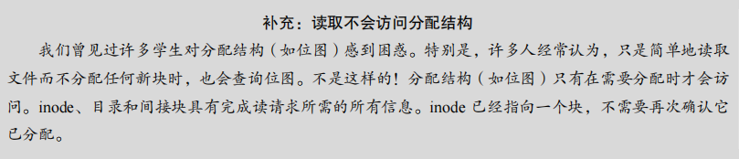

​		在某个时候，文件将被关闭。这里要做的工作要少得多。很明显，文件描述符应该被释放，但现在，这就是 FS 真正要做的。没有磁盘 I/O 发生。

​		整个过程如表 40.3 所示（向下时间递增）。在该表中，打开导致了多次读取，以便最终找到文件的 inode。之后，读取每个块需要文件系统首先查询 inode，然后读取该块，再使用写入更新 inode 的最后访问时间字段。花一些时间，试着理解发生了什么。

​		另外请注意，open 导致的 I/O 量与路径名的长度成正比。对于路径中的每个增加的目录，我们都必须读取它的 inode 及其数据。更糟糕的是，会出现大型目录。在这里，我们只需要读取一个块来获取目录的内容，而对于大型目录，我们可能需要读取很多数据块才能找到所需的条目。是的，读取文件时生活会变得非常糟糕。你会发现，写入一个文件（尤其是创建一个新文件）更糟糕。

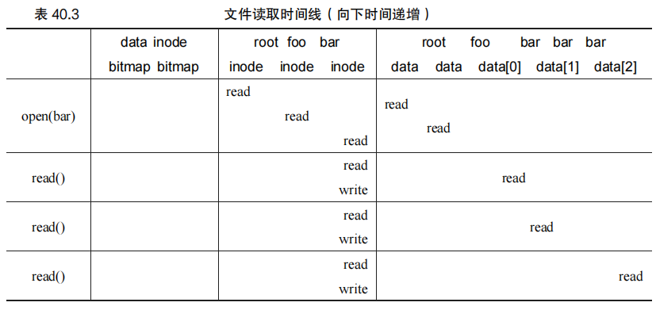

##### 写入磁盘 

​		写入文件是一个类似的过程。首先，文件必须打开（如上所述）。其次，应用程序可以发出 write()调用以用新内容更新文件。最后，关闭该文件。

​		与读取不同，写入文件也可能会分配（allocate）一个块（除非块被覆写）。当写入一个新文件时，每次写入操作不仅需要将数据写入磁盘，还必须首先决定将哪个块分配给文件，从而相应地更新磁盘的其他结构（例如数据位图和 inode）。因此，每次写入文件在逻辑上会导致 5 个 I/O：一个读取数据位图（然后更新以标记新分配的块被使用），一个写入位图（将它的新状态存入磁盘），再是两次读取，然后写入 inode（用新块的位置更新），最后一次写入真正的数据块本身。

​		考虑简单和常见的操作（例如文件创建），写入的工作量更大。要创建一个文件，文件系统不仅要分配一个 inode，还要在包含新文件的目录中分配空间。这样做的 I/O 工作总量非常大：一个读取 inode 位图（查找空闲 inode），一个写入 inode 位图（将其标记为已分配），一个写入新的 inode 本身（初始化它），一个写入目录的数据（将文件的高级名称链接到它的 inode 号），以及一个读写目录 inode 以便更新它。如果目录需要增长以容纳新条目，则还需要额外的 I/O（即数据位图和新目录块）。所有这些只是为了创建一个文件！

​		我们来看一个具体的例子，其中创建了 file/foo/bar，并且向它写入了 3 个块。表 40.4展示了在 open()（创建文件）期间和在 3 个 4KB 写入期间发生的情况。

​		在该表中，对磁盘的读取和写入放在导致它们发生的系统调用之下，它们可能发生的大致顺序从表的顶部到底部依次进行。你可以看到创建该文件需要多少工作：在这种情况下，有 10 次 I/O，用于遍历路径名，然后创建文件。你还可以看到每个分配写入需要 5 次I/O：一对读取和更新 inode，另一对读取和更新数据位图，最后写入数据本身。文件系统如何以合理的效率完成这些任务？

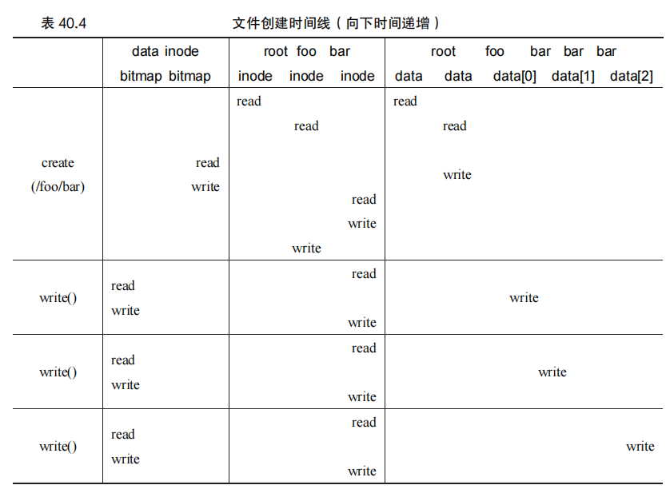


### 40.7 缓存和缓冲

为了减少 I/O 操作，VSFS 使用系统内存作为缓存：

- **读取缓存**：通过缓存目录 inode 和数据块，减少重复的读取操作。
- **写入缓存**：将写入操作延迟到内存中批处理，从而减少磁盘 I/O。例如，在文件创建和删除频繁发生时，延迟写入可以避免不必要的 I/O。

现代文件系统通常将虚拟内存页面和文件系统页面集成到统一的页面缓存中，实现资源的动态划分。这种灵活性提高了内存的利用率和系统的整体性能。


#### 原文：

​		如上面的例子所示，读取和写入文件可能是昂贵的，会导致（慢速）磁盘的许多 I/O。这显然是一个巨大的性能问题，为了弥补，大多数文件系统积极使用系统内存（DRAM）来缓存重要的块。

​		想象一下上面的打开示例：没有缓存，每个打开的文件都需要对目录层次结构中的每个级别至少进行两次读取（一次读取相关目录的 inode，并且至少有一次读取其数据）。使用长路径名（例如，/1/2/3/…/100/file.txt），文件系统只是为了打开文件，就要执行数百次读取！

​		早期的文件系统因此引入了一个固定大小的缓存（fixed-size cache）来保存常用的块。正如我们在讨论虚拟内存时一样，LRU 及不同变体策略会决定哪些块保留在缓存中。这个固定大小的缓存通常会在启动时分配，大约占总内存的 10%。

​		然而，这种静态的内存划分（static partitioning）可能导致浪费。如果文件系统在给定的时间点不需要 10%的内存，该怎么办？使用上述固定大小的方法，文件高速缓存中的未使用页面不能被重新用于其他一些用途，因此导致浪费。

​		相比之下，现代系统采用动态划分（dynamic partitioning）方法。具体来说，许多现代操作系统将虚拟内存页面和文件系统页面集成到统一页面缓存中（unified page cache）[S00]。通过这种方式，可以在虚拟内存和文件系统之间更灵活地分配内存，具体取决于在给定时间哪种内存需要更多的内存。

​		现在想象一下有缓存的文件打开的例子。第一次打开可能会产生很多 I/O 流量，来读取目录的 inode 和数据，但是随后文件打开的同一文件（或同一目录中的文件），大部分会命中缓存，因此不需要 I/O。

​		我们也考虑一下缓存对写入的影响。尽管可以通过足够大的缓存完全避免读取 I/O，但写入流量必须进入磁盘，才能实现持久。因此，高速缓存不能减少写入流量，像对读取那样。虽然这么说，写缓冲（write buffering，人们有时这么说）肯定有许多优点。首先，通过延迟写入，文件系统可以将一些更新编成一批（batch），放入一组较小的 I/O 中。例如，如果在创建一个文件时，inode 位图被更新，稍后在创建另一个文件时又被更新，则文件系统会在第一次更新后延迟写入，从而节省一次 I/O。其次，通过将一些写入缓冲在内存中，系统可以调度（schedule）后续的 I/O，从而提高性能。最后，一些写入可以通过拖延来完全避免。例如，如果应用程序创建文件并将其删除，则将文件创建延迟写入磁盘，可以完全避免（avoid）写入。在这种情况下，懒惰（在将块写入磁盘时）是一种美德。

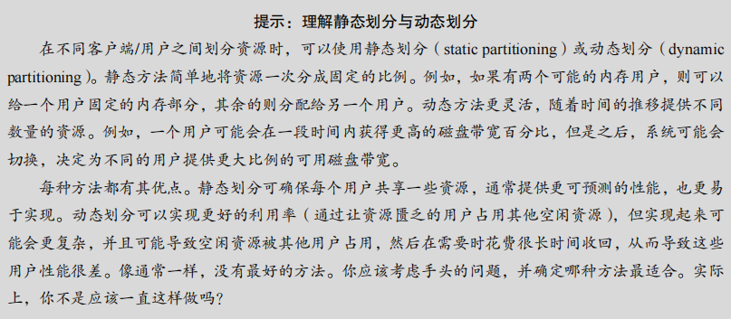

​		由于上述原因，大多数现代文件系统将写入在内存中缓冲 5～30s，这代表了另一种折中：如果系统在更新传递到磁盘之前崩溃，更新就会丢失。但是，将内存写入时间延长，则可以通过批处理、调度甚至避免写入，提高性能。

​		某些应用程序（如数据库）不喜欢这种折中。因此，为了避免由于写入缓冲导致的意外数据丢失，它们就强制写入磁盘，通过调用 fsync()，使用绕过缓存的直接 I/O（direct I/O）接口，或者使用原始磁盘（raw disk）接口并完全避免使用文件系统①。虽然大多数应用程序能接受文件系统的折中，但是如果默认设置不能令人满意，那么有足够的控制可以让系统按照你的要求进行操作。


### 40.8 小结

VSFS 展示了构建文件系统的基本机制，包括 inode、目录、位图和超级块。文件系统的设计有很大的自由度，这使得开发者可以通过优化不同策略来提升系统性能。在未来的章节中，还会深入探讨如何优化这些策略以实现更高效的文件系统。