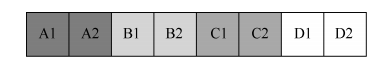
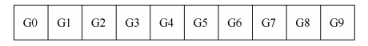
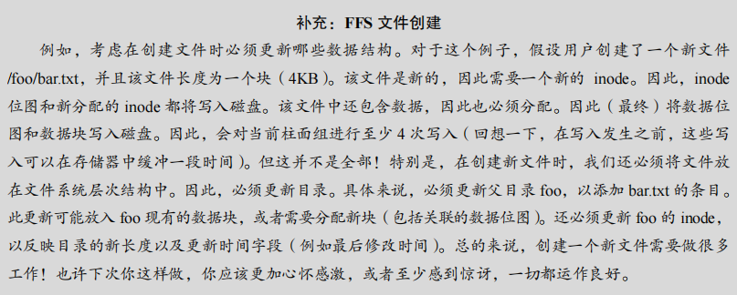
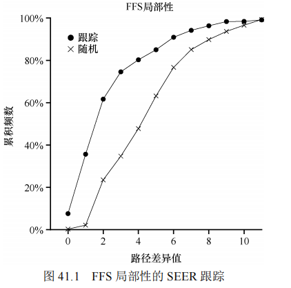
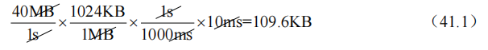
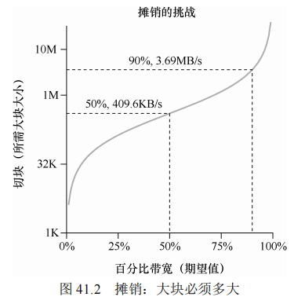

## 第 41 章 局部性和快速文件系统

这一章介绍了快速文件系统（Fast File System，FFS），它是老 UNIX 文件系统的改进版本。FFS 通过引入磁盘意识的设计，提高了文件系统的性能。这章详细探讨了文件系统的组织方式、文件和目录的分配策略以及如何处理大文件等问题。

#### 原文：

​		当 UNIX 操作系统首次引入时，UNIX“魔法师”Ken Thompson 编写了第一个文件系统。我们称之为“老 UNIX 文件系统”，它非常简单，基本上，它的数据结构在磁盘上看起来像这样：


​		超级块（S）包含有关整个文件系统的信息：卷的大小、有多少 inode、指向空闲列表块的头部的指针等等。磁盘的 inode 区域包含文件系统的所有 inode。最后，大部分磁盘都被数据块占用。

​		老文件系统的好处在于它很简单，支持文件系统试图提供的基本抽象：文件和目录层次结构。与过去笨拙的基于记录的存储系统相比，这个易于使用的系统真正向前迈出了一步。与早期系统提供的更简单的单层次层次结构相比，目录层次结构是真正的进步。


### 41.1 问题：性能不佳

老 UNIX 文件系统的设计简单，但存在严重的性能问题：

1. **随机存取**：老 UNIX 文件系统将磁盘视为随机访问的内存，这忽略了磁盘固有的寻道成本。文件的数据块经常和其 inode 分散在磁盘的不同位置，导致每次读取文件时都需要频繁寻道。
2. **碎片化**：文件删除和分配操作会使磁盘空间变得碎片化。例如，如果删除了部分文件，则可用空间分散在磁盘上。当需要为新文件分配空间时，这些碎片会导致文件分布在磁盘的多个位置，严重影响顺序读写性能。
3. **小块大小**：老文件系统使用 512 字节的块，这虽然减少了内部碎片，但每个块的访问都需要一次寻道，使得传输效率极低。

**关键问题**：如何组织磁盘数据以提高性能？文件系统需要具有磁盘意识，采用适当的数据结构和分配策略，减少寻道次数，提高顺序访问效率。

#### 原文：

​		问题是：性能很糟糕。根据 Kirk McKusick 和他在伯克利的同事[MJLF84]的测量，性能开始就不行，随着时间的推移变得更糟，直到文件系统仅提供总磁盘带宽的 2%！

​		主要问题是老 UNIX 文件系统将磁盘当成随机存取内存。数据遍布各处，而不考虑保存数据的介质是磁盘的事实，因此具有实实在在的、昂贵的定位成本。例如，文件的数据块通常离其 inode 非常远，因此每当第一次读取 inode 然后读取文件的数据块（非常常见的操作）时，就会导致昂贵的寻道。

​		更糟糕的是，文件系统最终会变得非常碎片化（fragmented），因为空闲空间没有得到精心管理。空闲列表最终会指向遍布磁盘的一堆块，并且随着文件的分配，它们只会占用下一个空闲块。结果是在磁盘上来回访问逻辑上连续的文件，从而大大降低了性能。

​		例如，假设以下数据块区域包含 4 个文件（A、B、C 和 D），每个文件大小为两个块：



​		如果删除 B 和 D，则生成的布局为：


​		如你所见，可用空间被分成两块构成的两大块，而不是很好的连续 4 块。假设我们现在希望分配一个大小为 4 块的文件 E：


​		你可以看到会发生什么：E 分散在磁盘上，因此，在访问 E 时，无法从磁盘获得峰值（顺序）性能。你首先读取 E1 和 E2，然后寻道，再读取 E3 和 E4。这个碎片问题一直发生在老UNIX 文件系统中，并且会影响性能。（插一句：这个问题正是磁盘碎片整理工具要解决的。它们将重新组织磁盘数据以连续放置文件，并为让空闲空间成为一个或几个连续的区域，移动数据，然后重写 inode 等以反映变化。）

​		另一个问题：原始块大小太小（512 字节）。因此，从磁盘传输数据本质上是低效的。较小的块是好的，因为它们最大限度地减少了内部碎片（internal fragmentation，块内的浪费），但是由于每个块可能需要一个定位开销来访问它，因此传输不佳。我们可以总结如下问题。


### 41.2 FFS：磁盘意识是解决方案

为了应对老 UNIX 文件系统的性能问题，伯克利的一组研究人员开发了 FFS。他们的策略是引入磁盘意识，让文件系统的结构和分配策略更好地利用磁盘的物理特性，从而提高性能。FFS 保持了 UNIX 文件系统的接口（如 `open()`、`read()`、`write()`），但改变了内部实现。

### 41.3 组织结构：柱面组

FFS 的核心改进之一是将磁盘划分为若干分组，称为 **柱面组（cylinder group）**，类似于现代文件系统中的块组（block group）。这种划分使得相关文件和数据可以分布在相邻的柱面组内，减少了寻道开销。

每个柱面组的结构如下：

- **超级块（Superblock）**：包含文件系统的全局信息，每个柱面组中都有超级块的副本，提供冗余以提高文件系统的可靠性。
- **inode 位图（inode bitmap）和数据位图（data bitmap）**：用于跟踪 inode 和数据块的分配状态。位图是管理空闲空间的有效方法，因为它们能帮助文件系统找到大块的空闲空间，减少碎片化问题。
- **inode 区域**：存储文件的 inode。
- **数据块区域**：存储用户数据，柱面组的大部分空间都用于存放数据块。

示意图如下：

```
| Superblock | inode bitmap | data bitmap | inode table | data blocks |
|   冗余副本  |  管理 inode   | 管理数据块  |    inode    |    数据块     |
```

**FFS 文件创建示例**： 假设用户创建一个新文件 `/foo/bar.txt`，文件大小为 4KB。FFS 的工作流程包括：

- 更新 inode 位图和分配新的 inode。
- 更新数据位图和分配一个数据块。
- 更新父目录 `/foo`，添加 `bar.txt` 的条目。
- 更新 `/foo` 的 inode，调整目录大小和更新时间。

总之，创建一个新文件至少需要四次写操作。


#### 原文：

​		第一步是更改磁盘上的结构。FFS 将磁盘划分为一些分组，称为柱面组（cylinder group，而一些现代文件系统，如 Linux ext2 和 ext3，就称它们为块组，即 block group）。因此，我们可以想象一个具有 10 个柱面组的磁盘：



​		这些分组是 FFS 用于改善性能的核心机制。通过在同一组中放置两个文件，FFS 可以确保先后访问两个文件不会导致穿越磁盘的长时间寻道。

​		因此，FFS 需要能够在每个组中分配文件和目录。每个组看起来像这样：


​		我们现在描述一个柱面组的构成。出于可靠性原因，每个组中都有超级块（super block）的一个副本（例如，如果一个被损坏或划伤，你仍然可以通过使用其中一个副本来挂载和访问文件系统）。

​		在每个组中，我们需要记录该组的 inode 和数据块是否已分配。每组的 inode 位图（inode bitmap，ib）和数据位图（data bitmap，db）起到了这个作用，分别针对每组中的 inode 和数据块。位图是管理文件系统中可用空间的绝佳方法，因为很容易找到大块可用空间并将其分配给文件，这可能会避免旧文件系统中空闲列表的某些碎片问题。

​		最后，inode 和数据块区域就像之前的极简文件系统一样。像往常一样，每个柱面组的大部分都包含数据块。




### 41.4 策略：如何分配文件和目录

FFS 采用了“相关的东西放在一起，不相关的东西分开放”的原则来分配文件和目录。

- **目录放置**：FFS 将目录放置在分配较少且空闲 inode 较多的柱面组中，以保持平衡和方便后续文件的分配。
- **文件放置**：文件的数据块通常与其 inode 放在同一柱面组中。同一目录下的文件也尽量放在一起，以便减少寻道时间。例如，目录 `/dir1` 中的文件 `1.txt`、`2.txt` 和 `3.txt` 会尽量放在同一组内。

#### 原文：

​		有了这个分组结构，FFS 现在必须决定，如何在磁盘上放置文件和目录以及相关的元数据，以提高性能。基本的咒语很简单：相关的东西放一起（以此推论，无关的东西分开放）。

​		因此，为了遵守规则，FFS 必须决定什么是“相关的”，并将它们置于同一个区块组内。相反，不相关的东西应该放在不同的块组中。为实现这一目标，FFS 使用了一些简单的放置推断方法。

​		首先是目录的放置。FFS 采用了一种简单的方法：找到分配数量少的柱面组（因为我们希望跨组平衡目录）和大量的自由 inode（因为我们希望随后能够分配一堆文件），并将目录数据和 inode 放在该分组中。当然，这里可以使用其他推断方法（例如，考虑空闲数据块的数量）。

​		对于文件，FFS 做两件事。首先，它确保（在一般情况下）将文件的数据块分配到与其inode 相同的组中，从而防止 inode 和数据之间的长时间寻道（如在老文件系统中）。其次，它将位于同一目录中的所有文件，放在它们所在目录的柱面组中。因此，如果用户创建了 4个文件，/dir1/1.txt、/dir1/2.txt、/dir1/3.txt 和/dir99/4.txt，FFS 会尝试将前 3 个放在一起（同一组），与第四个远离（它在另外某个组中）。

​		应该注意的是，这些推断方法并非基于对文件系统流量的广泛研究，或任何特别细致的研究。相反，它们建立在良好的老式常识基础之上（这不就是 CS 代表的吗？）。目录中的文件通常一起访问（想象编译一堆文件然后将它们链接到单个可执行文件中）。因为它们确保了相关文件之间的寻道时间很短，FFS 通常会提高性能。


### 41.5 测量文件的局部性

FFS 的分配策略基于对文件访问局部性的假设。研究表明，在实际的文件访问中，许多文件访问是局部的，即连续访问的文件常位于同一目录或相邻的目录中。

图 41.1 展示了文件访问的局部性测量结果，验证了 FFS 的假设：

```
| 距离 | 累积百分比 |
|------|------------|
| 0    | 7%         |
| 1    | 40%        |
| 2    | 25%        |
```

这些结果表明，大约 40% 的文件访问在同一目录内（距离为 0 或 1），进一步支持了将相关文件放在一起的策略。

#### 原文：

​		为了更好地理解这些推断方法是否有意义，我们决定分析文件系统访问的一些跟踪记录，看看是否确实存在命名空间的局部性。出于某种原因，文献中似乎没有对这个主题进行过很好的研究。

​		具体来说，我们进行了 SEER 跟踪[K94]，并分析了目录树中不同文件的访问有多“遥远”。例如，如果打开文件 f，然后跟踪到它重新打开（在打开任何其他文件之前），则在目录树中打开的这两个文件之间的距离为零（因为它们是同一文件）。如果打开目录 dir 中的文件 f（即 dir/f），然后在同一目录中打开文件 g（即 dir/g），则两个文件访问之间的距离为1，因为它们共享相同的目录，但不是同一个文件。换句话说，我们的距离度量标准衡量为了找到两个文件的共同祖先，必须在目录树上走多远。它们在树上越靠近，度量值越低。

​		图41.1展示了SEER跟踪中看到的局部性，针对SEER集群中所有工作站上的所有SEER跟踪。其中的 *x* 轴是差异度量值，*y* 轴是具有该差异值的文件打开的累积百分比。具体来说，对于 SEER 跟踪（图中标记为“跟踪”），你可以看到大约 7%的文件访问是先前打开的文件，并且近 40%的文件访问是相同的文件或同一目录中的文件（即 0 或 1 的差异值）。因此，FFS的局部性假设似乎有意义（至少对于这些跟踪）。

​		有趣的是，另外 25%左右的文件访问是距离为 2 的文件。当用户以多级方式构造一组相关目录，并不断在它们之间跳转时，就会发生这种类型的局部性。例如，如果用户有一个 src目录，并将目标文件（.o 文件）构建到 obj 目录中，并且这两个目录都是主 proj 目录的子目录，则常见访问模式就是 proj/src/foo .c 后跟着proj/obj/foo.o。这两个访问之间的距离是 2，因为 proj 是共同的祖先。FFS 在其策略中没有考虑这种类型的局部性，因此在这种访问之间会发生更多的寻道。

​		为了进行比较，我们还展示了“随机”跟踪的局部性。我们以随机的顺序，从原有的SEER 跟踪中选择文件，计算这些随机顺序访问之间的距离度量值，从而生成随机跟踪。如你所见，随机跟踪中的命名空间局部性较少，和预期的一样。但是，因为最终每个文件共享一个共同的祖先（即根），总会有一些局部性，




### 41.6 大文件例外

FFS 对于大文件采用不同的分配策略，以避免大文件填满一个柱面组，从而阻止其他“相关”文件的合理放置：

- **大文件分散**：当文件超过一定大小（例如 12 个直接指针指向的块），FFS 将文件的后续数据块放在其他柱面组中。这样做的目的是保持每个柱面组的可用性，尽可能避免影响相关文件的局部性。

**摊销计算**：

- 如果磁盘平均寻道时间为 10ms，传输速率为 40 MB/s，那么为了在寻道和传输上花费相等的时间，需要传输 409.6KB。
- 为了达到更高的性能（如 90% 和 99% 的峰值带宽），块的大小需要更大。

#### 原文：

​		在 FFS 中，文件放置的一般策略有一个重要的例外，它出现在大文件中。如果没有不同的规则，大文件将填满它首先放入的块组（也可能填满其他组）。以这种方式填充块组是不符合需要的，因为它妨碍了随后的“相关”文件放置在该块组内，因此可能破坏文件访问的局部性。

​		因此，对于大文件，FFS 执行以下操作。在将一定数量的块分配到第一个块组（例如，12 个块，或 inode 中可用的直接指针的数量）之后，FFS 将文件的下一个“大”块（即第一个间接块指向的那些部分）放在另一个块组中（可能因为它的利用率低而选择）。然后，文件的下一个块放在另一个不同的块组中，依此类推。

​		让我们看一些图片，更好地理解这个策略。如果没有大文件例外，单个大文件会将其所有块放入磁盘的一部分。我们使用一个包含 10 个块的文件的小例子，来直观地说明该行为。

​		以下是 FFS 没有大文件例外时的图景：


​		有了大文件例外，我们可能会看到像这样的情形，文件以大块的形式分布在磁盘上：


​		聪明的读者会注意到，在磁盘上分散文件块会损害性能，特别是在顺序文件访问的相

对常见的情况下（例如，当用户或应用程序按顺序读取块 0～9 时）。你是对的！确实会。

我们可以通过仔细选择大块大小，来改善这一点。

​		具体来说，如果大块大小足够大，我们大部分时间仍然花在从磁盘传输数据上，而在

大块之间寻道的时间相对较少。每次开销做更多工作，从而减少开销，这个过程称为摊销

（amortization），它是计算机系统中的常用技术。

​		举个例子：假设磁盘的平均定位时间（即寻道和旋转）是 10ms。进一步假设磁盘以 40 

MB/s 的速率传输数据。如果我们的目标是花费一半的时间来寻找数据块，一半时间传输数

据（从而达到峰值磁盘性能的 50%），那么需要每 10ms 定位开销导致 10ms 的传输数据。所

以问题就变成了：为了在传输中花费 10ms，大块必须有多大？简单，只需使用数学，特别

是我们在磁盘章节中提到的量纲分析：



​		基本上，这个等式是说：如果你以 40 MB/s 的速度传输数据，每次寻找时只需要传输409.6KB，就能花费一半的时间寻找，一半的时间传输。同样，你可以计算达到 90%峰值带宽所需的块大小（结果大约为 3.69MB），甚至达到 99%的峰值带宽（40.6MB！）。正如你所看到的，越接近峰值，这些块就越大（图 41.2 展

示了这些值）。

​		但是，FFS 没有使用这种类型的计算来跨组分布大文件。相反，它采用了一种简单的方法，基于 inode 本身的结构。前 12 个直接块与 inode 放在同一组中。每个后续的间接块，以及它指向的所有块都放在不同的组中。如果块大小为 4KB，磁盘地址是 32 位，则此策略意味着文件的每 1024个块（4MB）放在单独的组中，唯一的例外是直接指针所指向的文件的前 48KB。

​		我们应该注意到，磁盘驱动器的趋势是传输速率相当快，因为磁盘制造商擅长将更多位填塞到同一表面。但驱动器的机械方面与寻道相关（磁盘臂速度和旋转速度），改善相当缓慢[P98]。这意味着随着时间的推移，机械成本变得相对昂贵，因此，为了摊销所述成本，你必须在寻道之间传输更多数据。




### 41.7 关于 FFS 的其他几件事

FFS 还引入了其他创新点：

1. **子块（sub-blocks）**：FFS 引入了 512 字节的子块来减少小文件的内部碎片。当文件小于 4KB 时，FFS 使用子块；当文件超过 4KB 后，FFS 将子块合并为完整的 4KB 块。
2. **优化的磁盘布局**：在老磁盘接口中，FFS 通过跳过块的方式（如跳过一个块）来避免在顺序读取时错过数据块。这种方法称为参数化放置（parameterized placement）。
3. **长文件名和符号链接**：FFS 允许长文件名，并引入了符号链接（symlink），增加了文件系统的灵活性和可用性。

#### 原文：

​		FFS 也引入了一些其他创新。特别是，设计人员非常担心容纳小文件。事实证明，当时许多文件大小为 2KB 左右，使用 4KB 块虽然有利于传输数据，但空间效率却不太好。因此，在典型的文件系统上，这种内部碎片（internal fragmentation）可能导致大约一半的磁盘浪费。

​		FFS 设计人员采用很简单的解决方案解决了这个问题。他们决定引入子块（sub-block），这些子块有 512 字节，文件系统可以将它们分配给文件。因此，如果你创建了一个小文件（比如大小为 1KB），它将占用两个子块，因此不会浪费整个 4KB 块。随着文件的增长，文件系统将继续为其分配 512 字节的子块，直到它达到完整的 4KB 数据。此时，FFS 将找到一个 4KB 块，将子块复制到其中，并释放子块以备将来使用。

​		你可能会发现这个过程效率低下，文件系统需要大量的额外工作（特别是执行复制的大量额外 I/O）。你又对了！因此，FFS 通常通过修改 libc 库来避免这种异常行为。该库将缓冲写入，然后以 4KB 块的形式将它们发送到文件系统，从而在大多数情况下完全避免子块的特殊情况。

​		FFS 引入的第二个巧妙方法，是针对性能进行优化的磁盘布局。那时候（在 SCSI 和其他更现代的设备接口之前），磁盘不太复杂，需要主机 CPU 以更加亲力亲为的方式来控制它们的操作。当文件放在磁盘的连续扇区上时，FFS 遇到了问题，如图 41.3 左图所示。

​		具体来说，在顺序读取期间出现了问题。FFS 首先发出一个请求，读取块 0。当读取完成时，FFS 向块 1 发出读取，为时已晚：块 1 已在磁头下方旋转，现在对块 1 的读取将导致完全旋转。

​		FFS 使用不同的布局解决了这个问题，如图 41.3（右图）所示。通过每次跳过一块（在这个例子中），在下一块经过磁头之前，FFS 有足够的时间发出请求。实际上，FFS 足够聪明，能够确定特定磁盘在布局时应跳过多少块，以避免额外的旋转。这种技术称为参数化，因为 FFS 会找出磁盘的特定性能参数，并利用它们来确定准确的交错布局方案。

​		你可能会想：这个方案毕竟不太好。实际上，使用这种类型的布局只能获得 50%的峰值带宽，因为你必须绕过每个轨道两次才能读取每个块一次。幸运的是，现代磁盘更加智能：它们在内部读取整个磁道并将其缓冲在内部磁盘缓存中（由于这个原因，通常称为磁道缓冲区，track buffer）。然后，在对轨道的后续读取中，磁盘就从其高速缓存中返回所需数据。因此，文件系统不再需要担心这些令人难以置信的低级细节。如果设计得当，抽象和更高级别的接口可能是一件好事。

​		FFS 还增加了另一些可用性改进。FFS 是允许长文件名的第一个文件系统之一，因此在文件系统中实现了更具表现力的名称，而不是传统的固定大小方法（例如，8 个字符）。此外，引入了一种称为符号链接的新概念。正如第 40 章所讨论的那样，硬链接的局限性在于它们都不能指向目录（因为害怕引入文件系统层次结构中的循环），并且它们只能指向同一卷内的文件（即 inode 号必须仍然有意义）。符号链接允许用户为系统上的任何其他文件或目录创建“别名”，因此更加灵活。FFS 还引入了一个原子 rename()操作，用于重命名文件。除了基本技术之外，可用性的改进也可能让 FFS 拥有更强大的用户群。


### 41.8 小结

FFS 的引入标志着文件系统设计的一个重要转折点，它不仅提高了文件系统的性能，还显著提升了文件系统的可用性。通过将磁盘当作磁盘来设计文件系统结构，FFS 引导了现代文件系统的发展方向，许多现代文件系统（如 Linux 的 ext2 和 ext3）仍然受到 FFS 的影响。FFS 的核心教训是：充分利用磁盘的物理特性，通过合理的分配策略和结构设计，提高文件系统的性能和可用性。