# 第 42 章 崩溃一致性：FSCK 和日志

​		==文件系统需要管理一组持久化的数据结构来提供预期的抽象，如文件、目录和元数据。这些结构存储在持久存储设备上，例如硬盘或 SSD。文件系统面临的主要挑战之一是，在断电或系统崩溃时，如何保持这些持久性数据结构的一致性。==这被称为崩溃一致性问题。文件系统必须确保即使在崩溃后也能保持磁盘的合理状态。

### 原文：

​		至此我们看到，文件系统管理一组数据结构以实现预期的抽象：文件、目录，以及所有其他元数据，它们支持我们期望从文件系统获得的基本抽象。与大多数数据结构不同（例如，正在运行的程序在内存中的数据结构），文件系统数据结构必须持久（persist），即它们必须长期存在，存储在断电也能保留数据的设备上（例如硬盘或基于闪存的 SSD）。

​		文件系统面临的一个主要挑战在于，如何在出现断电（power loss）或系统崩溃（system crash）的情况下，更新持久数据结构。具体来说，如果在更新磁盘结构的过程中，有人绊到电源线并且机器断电，会发生什么？或者操作系统遇到错误并崩溃？由于断电和崩溃，更新持久性数据结构可能非常棘手，并导致了文件系统实现中一个有趣的新问题，称为崩溃一致性问题（crash-consistency problem）。

​		这个问题很容易理解。想象一下，为了完成特定操作，你必须更新两个磁盘上的结构 A和 B。由于磁盘一次只为一个请求提供服务，因此其中一个请求将首先到达磁盘（A 或 B）。如果在一次写入完成后系统崩溃或断电，则磁盘上的结构将处于不一致（inconsistent）的状态。因此，我们遇到了所有文件系统需要解决的问题：


​		在本章中，我们将更详细地探讨这个问题，看看文件系统克服它的一些方法。我们将首先检查较老的文件系统采用的方法，即 fsck，文件系统检查程序（file system checker）。然后，我们将注意力转向另一种方法，称为日志记录（journaling，也称为预写日志，write-ahead logging），这种技术为每次写入增加一点开销，但可以更快地从崩溃或断电中恢复。我们将讨论日志的基本机制，包括 Linux ext3 [T98，PAA05]（一个相对现代的日志文件系统）实现的几种不同的日志。


### 42.1 一个详细的例子

为了解崩溃一致性问题，假设一个简单的工作负载：将一个数据块附加到文件。文件系统包含以下结构：

- **inode 位图**：跟踪 inode 是否被分配（例如，`00000100` 表示第 2 号 inode 被分配）。
- **数据位图**：跟踪数据块的分配状态（例如，`00001000` 表示数据块 4 被分配）。
- **inode 表**：存储文件的元数据。假设 inode [v1] 指向块 4。

​		==当向文件追加内容时，需要更新 inode（增加大小并添加新数据块的指针）、数据位图（标记新块已分配）和数据块本身。这涉及 3 次磁盘写入：更新 inode、位图和新数据块。==下面是 inode [v2] 的示例：

```
owner : remzi 
permissions : read-write 
size : 2 
pointer : 4 
pointer : 5 
pointer : null 
pointer : null 
```

==**崩溃场景**：==

- **只写入数据块（Db）**：数据写入磁盘，但没有 inode 或位图的更新，磁盘看起来就像什么都没发生过。
- **只写入 inode（I[v2]）**：inode 指向了未被数据位图标记的块，可能读取垃圾数据。
- **只写入位图（B[v2]）**：块被标记为已分配，但没有 inode 指向它，导致空间泄露。

#### 原文：

​		为了开始对日志的调查，先看一个例子。我们需要一种工作负载（workload），它以某种方式更新磁盘结构。这里假设工作负载很简单：将单个数据块附加到原有文件。通过打开文件，调用 lseek()将文件偏移量移动到文件末尾，然后在关闭文件之前，向文件发出单个4KB 写入来完成追加。

​		我们还假定磁盘上使用标准的简单文件系统结构，类似于之前看到的文件系统。这个小例子包括一个 inode 位图（inode bitmap，只有 8 位，每个 inode 一个），一个数据位图（data bitmap，也是 8 位，每个数据块一个），inode（总共 8 个，编号为 0 到 7，分布在 4 个块上），以及数据块（总共 8 个，编号为 0～7）。以下是该文件系统的示意图：

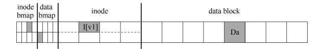

​		查看图中的结构，可以看到分配了一个 inode（inode 号为 2），它在 inode 位图中标记，单个分配的数据块（数据块 4）也在数据中标记位图。inode 表示为 I [v1]，因为它是此 inode的第一个版本。它将很快更新（由于上述工作负载）。

​		再来看看这个简化的 inode。在 I[v1]中，我们看到：

```
owner : remzi 
permissions : read-write 
size : 1 
pointer : 4 
pointer : null 
pointer : null 
pointer : null
```

​		在这个简化的 inode 中，文件的大小为 1（它有一个块位于其中），第一个直接指针指向块 4（文件的第一个数据块，Da），并且所有其他 3 个直接指针都被设置为 null（表示它们未被使用）。当然，真正的 inode 有更多的字段。更多相关信息，请参阅前面的章节。

​		向文件追加内容时，要向它添加一个新数据块，因此必须更新 3 个磁盘上的结构：inode（必须指向新块，并且由于追加而具有更大的大小），新数据块 Db 和新版本的数据位图（称之为 B[v2]）表示新数据块已被分配。

​		因此，在系统的内存中，有 3 个块必须写入磁盘。更新的 inode（inode 版本 2，或简称为 I [v2]）现在看起来像这样：

```
owner : remzi 
permissions : read-write 
size : 2 
pointer : 4 
pointer : 5 
pointer : null 
pointer : null
```

​		更新的数据位图（B[v2]）现在看起来像这样：00001100。最后，有数据块（Db），它只是用户放入文件的内容。

​		我们希望文件系统的最终磁盘映像如下所示：

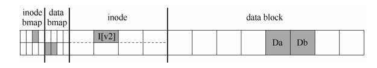

​		要实现这种转变，文件系统必须对磁盘执行 3 次单独写入，分别针对 inode（I[v2]），位图（B[v2]）和数据块（Db）。请注意，当用户发出 write()系统调用时，这些写操作通常不会立即发生。脏的 inode、位图和新数据先在内存（页面缓存，page cache，或缓冲区缓存，buffer cache）中存在一段时间。然后，当文件系统最终决定将它们写入磁盘时（比如说 5s或 30s），文件系统将向磁盘发出必要的写入请求。遗憾的是，可能会发生崩溃，从而干扰磁盘的这些更新。特别是，如果这些写入中的一个或两个完成后发生崩溃，而不是全部 3个，则文件系统可能处于有趣的状态。

#### 崩溃场景

​	为了更好地理解这个问题，让我们看一些崩溃情景示例。想象一下，只有一次写入成

功。因此有以下 3 种可能的结果。

-   只将数据块（**Db**）写入磁盘。在这种情况下，数据在磁盘上，但是没有指向它的inode，也没有表示块已分配的位图。因此，就好像写入从未发生过一样。从文件系统崩溃一致性的角度来看，这种情况根本不是问题。

-   只有更新的 **inode**（**I[v2]**）写入了磁盘。在这种情况下，inode 指向磁盘地址（5），其中 Db 即将写入，但 Db 尚未写入。因此，如果我们信任该指针，我们将从磁盘读取垃圾数据（磁盘地址 5 的旧内容）。

​		此外，遇到了一个新问题，我们将它称为文件系统不一致（file-system inconsistency）。磁盘上的位图告诉我们数据块 5 尚未分配，但是 inode 说它已经分配了。文件系统数据结构中的这种不同意见，是文件系统的数据结构不一致。要使用文件系统，我们必须以某种方式解决这个问题。

-   只有更新后的位图（**B [v2]**）写入了磁盘。在这种情况下，位图指示已分配块 5，但没有指向它的 inode。因此文件系统再次不一致。如果不解决，这种写入将导致空间泄露（space leak），因为文件系统永远不会使用块 5。在这个向磁盘写入 3 次的尝试中，还有 3 种崩溃场景。在这些情况下，两次写入成功，最后一次失败。

-   **inode**（**I[v2]**）和位图（**B[v2]**）写入了磁盘，但没有写入数据（**Db**）。在这种情况下，文件系统元数据是完全一致的：inode 有一个指向块 5 的指针，位图指示 5正在使用，因此从文件系统的元数据的角度来看，一切看起来都很正常。但是有一个问题：5 中又是垃圾。

-   写入了 **inode**（**I[v2]**）和数据块（**Db**），但没有写入位图（**B[v2]**）。在这种情况下，inode 指向了磁盘上的正确数据，但同样在 inode 和位图（B1）的旧版本之间存在不一致。因此，我们在使用文件系统之前，又需要解决问题。

-   写入了位图（**B[v2]**）和数据块（**Db**），但没有写入 **inode**（**I[v2]**）。在这种情况下，inode 和数据位图之间再次存在不一致。但是，即使写入块并且位图指示其使用，我们也不知道它属于哪个文件，因为没有 inode 指向该块。

#### 崩溃一致性问题 

​		希望从这些崩溃场景中，你可以看到由于崩溃而导致磁盘文件系统映像可能出现的许多问题：在文件系统数据结构中可能存在不一致性。可能有空间泄露，可能将垃圾数据返回给用户，等等。==理想的做法是将文件系统从一个一致状态（在文件被追加之前），原子地（atomically）移动到另一个状态（在 inode、位图和新数据块被写入磁盘之后）。==遗憾的是，做到这一点不容易，因为磁盘一次只提交一次写入，而这些更新之间可能会发生崩溃或断电。我们将这个一般问题称为崩溃一致性问题（crash-consistency problem，也可以称为一致性更新问题，consistent-update problem）。


## 42.2 解决方案 1：文件系统检查程序（FSCK）

​		早期文件系统采用简单的方法处理崩溃一致性：==在崩溃时允许数据结构不一致，重启时通过文件系统检查程序（fsck）修复这些不一致。fsck 在文件系统挂载前运行，扫描并修复各种文件系统元数据的不一致性。==

**FSCK 检查步骤**：

1. **超级块检查**：验证超级块内容是否合理。
2. **空闲块检查**：扫描 inode 和间接块，生成正确的分配位图，确保分配位图和 inode 一致。
3. **inode 状态检查**：检查每个 inode 是否有效，损坏的 inode 会被清除。
4. **链接计数检查**：扫描目录树，验证 inode 链接计数是否准确。
5. **重复检查**：检查是否有重复的块指针，必要时修复。
6. **坏块检查**：验证指针是否指向有效范围内的块，删除指向超出范围的指针。
7. **目录检查**：验证目录内容的完整性，例如“.” 和“..”是否存在，每个目录条目是否指向已分配的 inode。

虽然 fsck 能解决许多不一致性问题，但对整个磁盘的扫描会导致恢复过程非常缓慢，尤其是在大容量磁盘上。因此，随着磁盘容量的增加，研究人员开发了更快的方法。


### 原文：

​		早期的文件系统采用了一种简单的方法来处理崩溃一致性。基本上，它们决定让不一致的事情发生，然后再修复它们（重启时）。这种偷懒方法的典型例子可以在一个工具中找到：fsck①。fsck 是一个 UNIX 工具，用于查找这些不一致并修复它们[M86]。在不同的系统上，存在检查和修复磁盘分区的类似工具。请注意，这种方法无法解决所有问题。例如，考虑上面的情况，文件系统看起来是一致的，但是 inode 指向垃圾数据。唯一真正的目标，是确保文件系统元数据内部一致。

​		工具 fsck 在许多阶段运行，如 McKusick 和 Kowalski 的论文[MK96]所述。它在文件系统挂载并可用之前运行（fsck 假定在运行时没有其他文件系统活动正在进行）。一旦完成，磁盘上的文件系统应该是一致的，因此可以让用户访问。

​		以下是 fsck 的基本总结。

-   超级块：fsck 首先检查超级块是否合理，主要是进行健全性检查，例如确保文件系统大小大于分配的块数。通常，这些健全性检查的目的是找到一个可疑的（冲突的）超级块。在这种情况下，系统（或管理员）可以决定使用超级块的备用副本。

-   空闲块：接下来，fsck 扫描 inode、间接块、双重间接块等，以了解当前在文件系统中分配的块。它利用这些知识生成正确版本的分配位图。因此，如果位图和 inode之间存在任何不一致，则通过信任 inode 内的信息来解决它。对所有 inode 执行相同类型的检查，确保所有看起来像在用的 inode，都在 inode 位图中有标记。

-   **inode** 状态：检查每个 inode 是否存在损坏或其他问题。例如，fsck 确保每个分配的 inode 具有有效的类型字段（即常规文件、目录、符号链接等）。如果 inode 字段存在问题，不易修复，则 inode 被认为是可疑的，并被 fsck 清除，inode 位图相应地更新。

-   **inode** 链接：fsck 还会验证每个已分配的 inode 的链接数。你可能还记得，链接计数表示包含此特定文件的引用（即链接）的不同目录的数量。为了验证链接计数，fsck 从根目录开始扫描整个目录树，并为文件系统中的每个文件和目录构建自己的链接计数。如果新计算的计数与 inode 中找到的计数不匹配，则必须采取纠正措施，通常是修复 inode 中的计数。如果发现已分配的 inode 但没有目录引用它，则会将其移动到 lost + found 目录。

-   重复：fsck 还检查重复指针，即两个不同的 inode 引用同一个块的情况。如果一个inode 明显不好，可能会被清除。或者，可以复制指向的块，从而根据需要为每个inode 提供其自己的副本。

-   坏块：在扫描所有指针列表时，还会检查坏块指针。如果指针显然指向超出其有效范围的某个指针，则该指针被认为是“坏的”，例如，它的地址指向大于分区大小的块。在这种情况下，fsck 不能做任何太聪明的事情。它只是从 inode 或间接块中删除（清除）该指针。

-   目录检查：fsck 不了解用户文件的内容。但是，目录包含由文件系统本身创建的特定格式的信息。因此，fsck 对每个目录的内容执行额外的完整性检查，确保“.”和“..”是前面的条目，目录条目中引用的每个 inode 都已分配，并确保整个层次结构中没有目录的引用超过一次。

​		如你所见，构建有效工作的 fsck 需要复杂的文件系统知识。确保这样的代码在所有情况下都能正常工作可能具有挑战性[G+08]。然而，fsck（和类似的方法）有一个更大的、也许更根本的问题：它们太慢了。对于非常大的磁盘卷，扫描整个磁盘，以查找所有已分配的块并读取整个目录树，可能需要几分钟或几小时。随着磁盘容量的增长和 RAID 的普及，fsck 的性能变得令人望而却步（尽管最近取得了进展[M+13]）。

​		在更高的层面上，fsck 的基本前提似乎有点不合理。考虑上面的示例，其中只有 3 个块写入磁盘。扫描整个磁盘，仅修复更新 3 个块期间出现的问题，这是非常昂贵的。这种情况类似于将你的钥匙放在卧室的地板上，然后从地下室开始，搜遍每个房间，执行“搜索整个房子找钥匙”的恢复算法。它有效，但很浪费。因此，随着磁盘（和 RAID）的增长，研究人员和从业者开始寻找其他解决方案。


## 42.3 解决方案 2：日志（或预写日志）

​		一种更活跃的解决方案是从数据库系统借鉴的预写日志（Write-Ahead Logging），在文件系统中称为 **日志（journaling）**。基本思路是：在更新磁盘结构之前，先将这些更新写入一个日志。日志记录了要进行的更新，使得即使在崩溃时，也能通过重放日志恢复系统。

#### 数据日志

​		数据日志记录所有更新，包括数据块和元数据。例如，要将 inode（I[v2]）、位图（B[v2]）和数据块（Db）写入磁盘，首先将这些块写入日志：

```
| TxB | I[v2] | B[v2] | Db | TxE |
```

- **TxB**：事务开始块，包含更新的信息和事务标识符。
- **I[v2]**、**B[v2]**、**Db**：即将更新的内容。
- **TxE**：事务结束块，标记事务的结束。

当事务完整地写入日志后，再将这些更新内容写入它们的最终位置。这一过程称为 **加检查点（checkpointing）**。

#### 崩溃期间的恢复

​		恢复时，文件系统扫描日志，寻找已提交的事务，然后重放这些事务，将它们的内容写入最终位置。这种形式的日志称为 **重做日志（redo logging）**。

#### 日志优化和批处理

​		为了提高性能，文件系统可以将多个事务合并为一个全局事务，减少写入日志的次数。这种批处理技术可以显著减少对磁盘的写入流量。

#### 元数据日志

​		为了减少日志开销，文件系统可以只记录元数据更新，而不记录用户数据。这称为 **元数据日志（metadata journaling）** 或 **有序日志（ordered journaling）**。这种方式中，数据块直接写入最终位置，不记录在日志中。在写入元数据之前，数据块必须先写入磁盘。

#### 块复用的棘手问题

​		块复用时，如果块在删除后被重新分配，可能会导致不一致。解决方法是使用 **撤销记录（revoke records）**，记录被删除的块，避免在恢复过程中重放这些块。


#### 原文：

​		对于一致更新问题，最流行的解决方案可能是从数据库管理系统的世界中借鉴的一个想法。==这种名为预写日志（write-ahead logging）的想法，是为了解决这类问题而发明的。==在文件系统中，出于历史原因，==我们通常将预写日志称为日志（journaling）。==第一个实现它的文件系统是 Cedar [H87]，但许多现代文件系统都使用这个想法，包括 Linux ext3 和 ext4、reiserfs、IBM 的 JFS、SGI 的 XFS 和 Windows NTFS。

​		基本思路如下。更新磁盘时，在覆写结构之前，首先写下一点小注记（在磁盘上的其他地方，在一个众所周知的位置），描述你将要做的事情。写下这个注记就是“预写”部分，我们把它写入一个结构，并组织成“日志”。因此，就有了预写日志。

​		通过将注释写入磁盘，可以保证在更新（覆写）正在更新的结构期间发生崩溃时，能够返回并查看你所做的注记，然后重试。因此，你会在崩溃后准确知道要修复的内容（以及如何修复它），而不必扫描整个磁盘。因此，通过设计，日志功能在更新期间增加了一些工作量，从而大大减少了恢复期间所需的工作量。

​		我们现在将描述 Linux ext3（一种流行的日志文件系统）如何将日志记录到文件系统中。大多数磁盘上的结构与 Linux ext2 相同，例如，磁盘被分成块组，每个块组都有一个 inode和数据位图以及 inode 和数据块。新的关键结构是日志本身，它占用分区内或其他设备上的少量空间。因此，ext2 文件系统（没有日志）看起来像这样：


​		假设日志放在同一个文件系统映像中（虽然有时将它放在单独的设备上，或作为文件系统中的文件），带有日志的 ext3 文件系统如下所示：

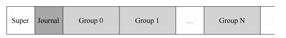

​		真正的区别只是日志的存在，当然，还有它的使用方式。

##### 数据日志 

​		看一个简单的例子，来理解数据日志（data journaling）的工作原理。数据日志作为 Linux ext3 文件系统的一种模式提供，本讨论的大部分内容都来自于此。

​		假设再次进行标准的更新，我们再次希望将 inode（I[v2]）、位图（B[v2]）和数据块（Db）写入磁盘。在将它们写入最终磁盘位置之前，现在先将它们写入日志。这就是日志中的样子：

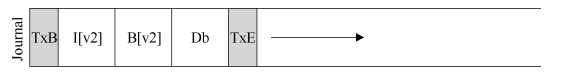

​		你可以看到，这里写了 5 个块。事务开始（TxB）告诉我们有关此更新的信息，包括对文件系统即将进行的更新的相关信息（例如，块 I[v2]、B[v2]和 Db 的最终地址），以及某种事务标识符（transaction identifier，TID）。中间的 3 个块只包含块本身的确切内容，这被称为物理日志（physical logging），因为我们将更新的确切物理内容放在日志中（另一种想法，逻辑日志（logical logging），在日志中放置更紧凑的更新逻辑表示，例如，“这次更新希望将数据块 Db 追加到文件 X”，这有点复杂，但可以节省日志中的空间，并可能提高性能）。最后一个块（TxE）是该事务结束的标记，也会包含 TID。

​		==一旦这个事务安全地存在于磁盘上，我们就可以覆写文件系统中的旧结构了。这个过程称为加检查点（checkpointing）。==因此，为了对文件系统加检查点（checkpoint，即让它与日志中即将进行的更新一致），我们将 I[v2]、B[v2]和 Db 写入其磁盘位置，如上所示。如果这些写入成功完成，我们已成功地为文件系统加上了检查点，基本上完成了。因此，我们的初始操作顺序如下。

​		1．**日志写入**：将事务（包括事务开始块，所有即将写入的数据和元数据更新以及事务结束块）写入日志，等待这些写入完成。

​		2．**加检查点**：将待处理的元数据和数据更新写入文件系统中的最终位置。

​		在我们的例子中，先将 TxB、I[v2]、B[v2]、Db 和 TxE 写入日志。这些写入完成后，我们将加检查点，将 I[v2]、B[v2]和 Db 写入磁盘上的最终位置，完成更新。

​		在写入日志期间发生崩溃时，事情变得有点棘手。在这里，我们试图将事务中的这些块（即 TxB、I[v2]、B[v2]、Db、TxE）写入磁盘。一种简单的方法是一次发出一个，等待每个完成，然后发出下一个。但是，这很慢。理想情况下，我们希望一次发出所有 5 个块写入，因为这会将 5 个写入转换为单个顺序写入，因此更快。然而，由于以下原因，这是不安全的：给定如此大的写入，磁盘内部可以执行调度并以任何顺序完成大批写入的小块。因此，磁盘内部可以（1）写入 TxB、I[v2]、B[v2]和 TxE，然后才写入 Db。遗憾的是，如果磁盘在（1）和（2）之间断电，那么磁盘上会变成：

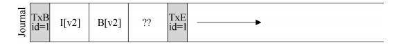

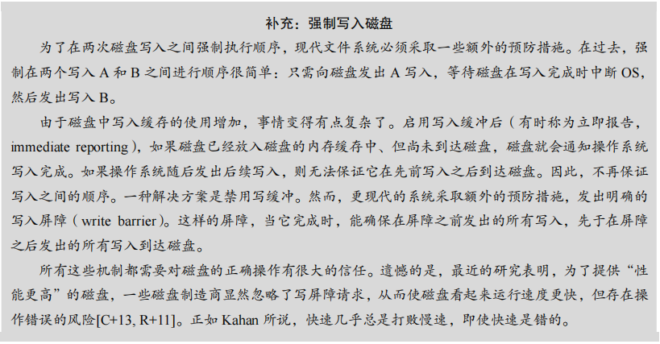

​		为什么这是个问题？好吧，事务看起来像一个有效的事务（它有一个匹配序列号的开头和结尾）。此外，文件系统无法查看第四个块并知道它是错误的。毕竟，它是任意的用户数据。因此，如果系统现在重新启动并运行恢复，它将重放此事务，并无知地将垃圾块“??”的内容复制到 Db 应该存在的位置。这对文件中的任意用户数据不利。如果它发生在文件系统的关键部分上，例如超级块，可能会导致文件系统无法挂装，那就更糟了。

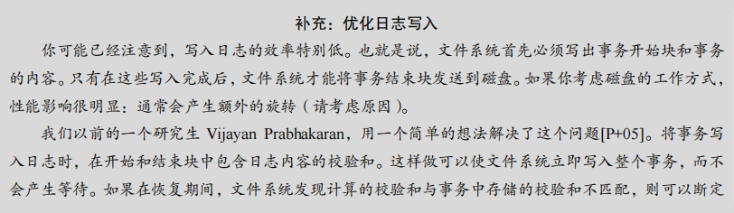

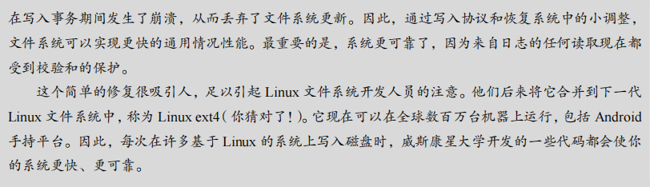

​		为避免该问题，文件系统分两步发出事务写入。首先，它将除 TxE 块之外的所有块写入日志，同时发出这些写入。当这些写入完成时，日志将看起来像这样（假设又是文件追加的工作负载）：

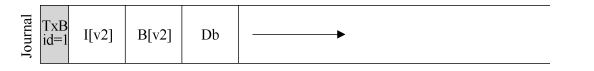

​		当这些写入完成时，文件系统会发出 TxE 块的写入，从而使日志处于最终的安全状态：

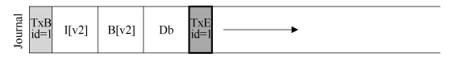

​		此过程的一个重要方面是磁盘提供的原子性保证。事实证明，磁盘保证任何 512 字节写入都会发生或不发生（永远不会半写）。因此，为了确保 TxE 的写入是原子的，应该使它成为一个 512 字节的块。因此，我们当前更新文件系统的协议如下，3 个阶段中的每一个都标上了名称。

​		1．日志写入：将事务的内容（包括 TxB、元数据和数据）写入日志，等待这些写入完成。

​		2．日志提交：将事务提交块（包括 TxE）写入日志，等待写完成，事务被认为已提交

（committed）。

​		3．加检查点：将更新内容（元数据和数据）写入其最终的磁盘位置。

##### 恢复 

​		现在来==了解文件系统如何利用日志内容从崩溃中恢复（recover）==。在这个更新序列期间，任何时候都可能发生崩溃。如果崩溃发生在事务被安全地写入日志之前（在上面的步骤 2完成之前），那么我们的工作很简单：简单地跳过待执行的更新。==如果在事务已提交到日志之后但在加检查点完成之前发生崩溃，则文件系统可以按如下方式恢复（recover）更新。系统引导时，文件系统恢复过程将扫描日志，并查找已提交到磁盘的事务。然后，这些事务被重放（replayed，按顺序），文件系统再次尝试将事务中的块写入它们最终的磁盘位置。这种形式的日志是最简单的形式之一，称为重做日志（redo logging）。==通过在日志中恢复已提交的事务，文件系统确保磁盘上的结构是一致的，因此可以继续工作，挂载文件系统并为新请求做好准备。

​		请注意，即使在某些更新写入块的最终位置之后，在加检查点期间的任何时刻发生崩溃，都没问题。在最坏的情况下，其中一些更新只是在恢复期间再次执行。因为恢复是一种罕见的操作（仅在系统意外崩溃之后发生），所以几次冗余写入无须担心①。

##### 批处理日志更新 

​		你可能已经注意到，基本协议可能会增加大量额外的磁盘流量。例如，假设我们在同一目录中连续创建两个文件，称为 file1 和 file2。要创建一个文件，必须更新许多磁盘上的结构，至少包括：inode 位图（分配新的 inode），新创建的文件 inode，包含新文件目录条目的父目录的数据块，以及父目录的 inode（现在有一个新的修改时间）。通过日志，我们将所有这些信息逻辑地提交给我们的两个文件创建的日志。因为文件在同一个目录中，我们假设在同一个 inode 块中都有 inode，这意味着如果不小心，我们最终会一遍又一遍地写入这些相同的块。

​		==为了解决这个问题，一些文件系统不会一次一个地向磁盘提交每个更新（例如，Linux ext3）。与此不同，可以将所有更新缓冲到全局事务中。==在上面的示例中，当创建两个文件时，文件系统只将内存中的 inode 位图、文件的 inode、目录数据和目录 inode 标记为脏，并将它们添加到块列表中，形成当前的事务。当最后应该将这些块写入磁盘时（例如，在超时 5s 之后），会提交包含上述所有更新的单个全局事务。因此，通过缓冲更新，文件系统在许多情况下可以避免对磁盘的过多的写入流量。

##### 使日志有限 

​		==因此，我们已经了解了更新文件系统磁盘结构的基本协议。文件系统缓冲内存中的更新一段时间。最后写入磁盘时，文件系统首先仔细地将事务的详细信息写入日志（即预写日志）。事务完成后，文件系统会加检查点，将这些块写入磁盘上的最终位置。==

​		但是，日志的大小有限。如果不断向它添加事务（如下所示），它将很快填满。你觉得会发生什么？

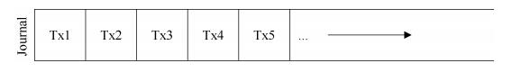

​		日志满时会出现两个问题。第一个问题比较简单，但不太重要：日志越大，恢复时间越长，因为恢复过程必须重放日志中的所有事务（按顺序）才能恢复。第二个问题更重要：当日志已满（或接近满）时，不能向磁盘提交进一步的事务，从而使文件系统“不太有用”（即无用）。

​		==为了解决这些问题，日志文件系统将日志视为循环数据结构，一遍又一遍地重复使用。这就是为什么日志有时被称为循环日志（circular log）。==为此，文件系统必须在加检查点之后的某个时间执行操作。==具体来说，一旦事务被加检查点，文件系统应释放它在日志中占用的空间，允许重用日志空间。==有很多方法可以达到这个目的。例如，你只需在日志超级块（journal superblock）中标记日志中最旧和最新的事务。所有其他空间都是空闲的。以下是这种机制的图形描述：

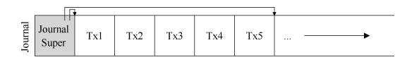

​		在日志超级块中（不要与主文件系统的超级块混淆），日志系统记录了足够的信息，以了解哪些事务尚未加检查点，从而减少了恢复时间，并允许以循环的方式重新使用日志。因此，我们在基本协议中添加了另一个步骤。

​		**1．日志写入：将事务的内容（包括 TxB 和更新内容）写入日志，等待这些写入完成。**

​		**2．日志提交：将事务提交块（包括 TxE）写入日志，等待写完成，事务被认为已提交（committed）。**

​		**3．加检查点：将更新内容写入其最终的磁盘位置。**

​		==4．释放：一段时间后，通过更新日志超级块，在日志中标记该事务为空闲。==

​		因此，我们得到了最终的数据日志协议。但仍然存在一个问题：我们将每个数据块写入磁盘两次，这是沉重的成本，特别是为了系统崩溃这样罕见的事情。你能找到一种方法来保持一致性，而无须两次写入数据吗？

##### 元数据日志 

​		尽管恢复现在很快（扫描日志并重放一些事务而不是扫描整个磁盘），但文件系统的正常操作比我们想要的要慢。特别是，对于每次写入磁盘，我们现在也要先写入日志，从而使写入流量加倍。在顺序写入工作负载期间，这种加倍尤为痛苦，现在将以驱动器峰值写入带宽的一半进行。此外，在写入日志和写入主文件系统之间，存在代价高昂的寻道，这为某些工作负载增加了显著的开销。

​		由于将每个数据块写入磁盘的成本很高，人们为了提高性能，尝试了一些不同的东西。例如，我们上面描述的日志模式通常称为数据日志（data journaling，如在 Linux ext3 中），因为它记录了所有用户数据（除了文件系统的元数据之外）。==一种更简单（也更常见）的日志形式有时称为有序日志（ordered journaling，或称为元数据日志，metadata journaling），它几乎相同，只是用户数据没有写入日志。==因此，在执行与上述相同的更新时，以下信息将写入日志：

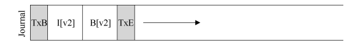

​		先前写入日志的数据块 Db 将改为写入文件系统，避免额外写入。考虑到磁盘的大多数I/O 流量是数据，不用两次写入数据会大大减少日志的 I/O 负载。然而，修改确实提出了一个有趣的问题：我们何时应该将数据块写入磁盘？

​		再考虑一下文件追加的例子，以更好地理解问题。更新包含 3 个块：I[v2]、B[v2]和 Db。前两个都是元数据，将被记录，然后加检查点。后者只会写入文件系统一次。什么时候应该把 Db 写入磁盘？这有关系吗？

​		事实证明，数据写入的顺序对于仅元数据日志很重要。例如，如果我们在事务（包含 I [v2]和 B [v2]）完成后将 Db 写入磁盘如何？遗憾的是，这种方法存在一个问题：文件系统是一致的，但 I[v2]可能最终指向垃圾数据。具体来说，考虑写入了 I[v2]和 B[v2]，但 Db 没有写入磁盘的情况。然后文件系统将尝试恢复。由于 Db 不在日志中，因此文件系统将重放

 

​	I[v2]和 B[v2]的写入，并生成一致的文件系统（从文件系统元数据的角度来看）。但是，I[v2]将指向垃圾数据，即指向 Db 中的任何数据。

​		==为了确保不出现这种情况，在将相关元数据写入磁盘之前，一些文件系统（例如，Linux ext3）先将数据块（常规文件）写入磁盘。==具体来说，协议有以下几个。

​	1．数据写入：将数据写入最终位置，等待完成（等待是可选的，详见下文）。

​	==2．日志元数据写入：将开始块和元数据写入日志，等待写入完成。==

​	3．日志提交：将事务提交块（包括 TxE）写入日志，等待写完成，现在认为事务（包括数据）已提交（committed）。

​	4．加检查点元数据：将元数据更新的内容写入文件系统中的最终位置。

​	5．释放：稍后，在日志超级块中将事务标记为空闲。

​		通过强制先写入数据，文件系统可以保证指针永远不会指向垃圾。实际上，这个“先写入被指对象，再写入指针对象”的规则是崩溃一致性的核心，并且被其他崩溃一致性方案[GP94]进一步利用。

​		==在大多数系统中，元数据日志（类似于 ext3 的有序日志）比完整数据日志更受欢迎。==例如，Windows NTFS 和 SGI 的 XFS 都使用无序的元数据日志。Linux ext3 为你提供了选择数据、有序或无序模式的选项（在无序模式下，可以随时写入数据）。所有这些模式都保持元数据一致，它们的数据语义各不相同。

​		最后，请注意，在发出写入日志（步骤 2）之前强制数据写入完成（步骤 1）不是正确性所必需的，如上面的协议所示。具体来说，可以发出数据写入，并向日志写入事务开始块和元数据。==唯一真正的要求，是在发出日志提交块之前完成步骤 1 和步骤 2（步骤 3）。==

##### 棘手的情况：块复用 

​		一些有趣的特殊情况让日志更加棘手，因此值得讨论。其中一些与块复用有关。正如Stephen Tweedie（ext3 背后的主要开发者之一）说的：

​		“整个系统的可怕部分是什么？……是删除文件。与删除有关的一切都令人毛骨悚然。与删除有关的一切……如果块被删除然后重新分配，你会做噩梦。”[T00] 

​		Tweedie 给出的具体例子如下。假设你正在使用某种形式的元数据日志（因此不记录文件的数据块）。假设你有一个名为 foo 的目录。用户向 foo 添加一个条目（例如通过创建文件），因此 foo 的内容（因为目录被认为是元数据）被写入日志。假设 foo 目录数据的位置是块 1000。因此日志包含如下内容：

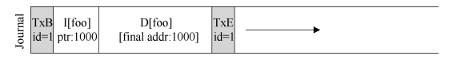

​		此时，用户删除目录中的所有内容以及目录本身，从而释放块 1000 以供复用。最后，用户创建了一个新文件（比如 foobar），结果复用了过去属于 foo 的相同块（1000）。foobar的 inode 提交给磁盘，其数据也是如此。但是，请注意，因为正在使用元数据日志，所以只有 foobar 的 inode 被提交给日志，文件 foobar 中块 1000 中新写入的数据没有写入日志。

​		现在假设发生了崩溃，所有这些信息仍然在日志中。在重放期间，恢复过程简单地重放日志中的所有内容，包括在块 1000 中写入目录数据。因此，重放会用旧目录内容覆盖当前文件 foobar 的用户数据！显然，这不是一个正确的恢复操作，当然，在阅读文件 foobar时，用户会感到惊讶。

​		这个问题有一些解决方案。例如，可以永远不再重复使用块，直到所述块的删除加上检查点，从日志中清除。Linux ext3 的做法是将新类型的记录添加到日志中，称为撤销（revoke）记录。在上面的情况中，删除目录将导致撤销记录被写入日志。在重放日志时，系统首先扫描这样的重新记录。任何此类被撤销的数据都不会被重放，从而避免了上述问题。

##### 总结日志：时间线 

​		在结束对日志的讨论之前，我们总结一下讨论过的协议，用时间线来描述每个协议。表 42.1展示了日志数据和元数据时的协议，表 42.2 展示了仅记录元数据时的协议。

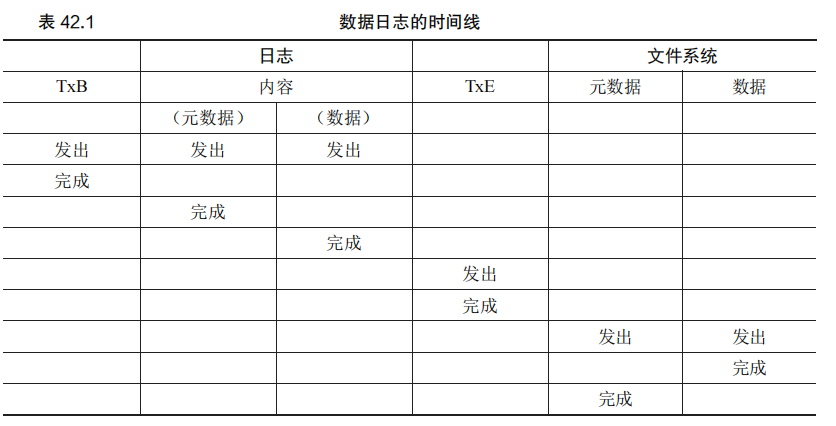

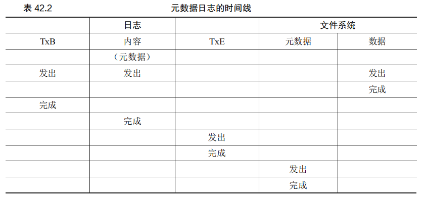

​		在每个表中，时间向下增加，表中的每一行显示可以发出或可能完成写入的逻辑时间。例如，在数据日志协议（见表 42.1）中，事务开始块（TxB）的写入和事务的内容可以在逻辑上同时发出，因此可以按任何顺序完成。但是，在上述写入完成之前，不得发出对事务结束块（TxE）的写入。同样，在事务结束块提交之前，写入数据和元数据块的加检查点无法开始。水平虚线表示必须遵守的写入顺序要求。

​		对元数据日志协议也显示了类似的时间线。请注意，在逻辑上，数据写入可以与对事务开始的写入和日志的内容一起发出。但是，必须在事务结束发出之前发出并完成。

​		最后，请注意，时间线中每次写入标记的完成时间是任意的。在实际系统中，完成时间由 I/O 子系统确定，I/O 子系统可能会重新排序写入以提高性能。对于顺序的唯一保证，是那些必须强制执行，才能保证协议正确性的顺序。


## 42.4 解决方案 3：其他方法

除了 fsck 和日志，其他方法也可以解决崩溃一致性问题：

- **软更新（Soft Updates）**：通过对写入排序，确保磁盘结构始终保持一致。这需要对文件系统数据结构有深入了解，实现复杂。
- **写时复制（Copy-On-Write, COW）**：永不覆写现有数据，而是将更新写入新位置。更新完成后，翻转指针指向新位置。COW 技术在 Sun 的 ZFS 等文件系统中得到应用。
- **基于反向指针的一致性（Backpointer-Based Consistency, BBC）**：在每个数据块中增加反向指针，用于检查文件系统的一致性。
- **乐观崩溃一致性（Optimistic Crash Consistency）**：尽可能多地发出写入，利用事务校验和等技术检测并解决不一致。

### 原文：

​		到目前为止，我们已经描述了保持文件系统元数据一致性的两个可选方法：基于 fsck 的偷懒方法，以及称为日志的更活跃的方法。但是，并不是只有这两种方法。Ganger 和 Patt 引入了一种称为软更新[GP94]的方法。这种方法仔细地对文件系统的所有写入排序，以确保磁盘上的结构永远不会处于不一致的状态。例如，通过先写入指向的数据块，再写入指向它的inode，可以确保 inode 永远不会指向垃圾。对文件系统的所有结构可以导出类似的规则。然而，实现软更新可能是一个挑战。上述日志层的实现只需要具体文件系统结构的较少知识，但软更新需要每个文件系统数据结构的复杂知识，因此给系统增加了相当大的复杂性。

​		另一种方法称为写时复制（Copy-On-Write，COW），并且在许多流行的文件系统中使用，包括 Sun 的 ZFS [B07]。这种技术永远不会覆写文件或目录。相反，它会对磁盘上以前未使用的位置进行新的更新。在完成许多更新后，COW 文件系统会翻转文件系统的根结构，以包含指向刚更新结构的指针。这样做可以使文件系统保持一致。在将来的章节中讨论日志结构文件系统（LFS）时，我们将学习更多关于这种技术的知识。LFS 是 COW 的早期范例。

​		另一种方法是我们刚刚在威斯这星大学开发的方法。这种技术名为基于反向指针的一致性（Backpointer-Based Consistency，BBC），它在写入之间不强制执行排序。为了实现一致性，系统中的每个块都会添加一个额外的反向指针。例如，每个数据块都引用它所属的inode。访问文件时，文件系统可以检查正向指针（inode 或直接块中的地址）是否指向引用它的块，从而确定文件是否一致。如果是这样，一切都肯定安全地到达磁盘，因此文件是一致的。如果不是，则文件不一致，并返回错误。通过向文件系统添加反向指针，可以获得一种新形式的惰性崩溃一致性[C+12]。

​		最后，我们还探索了减少日志协议等待磁盘写入完成的次数的技术。这种新方法名为乐观崩溃一致性（optimistic crash consistency）[C+13]，尽可能多地向磁盘发出写入，并利用事务校验和（transaction checksum）[P+05]的一般形式，以及其他一些技术来检测不一致，如果出现不一致的话。对于某些工作负载，这些乐观技术可以将性能提高一个数量级。但是，要真正运行良好，需要稍微不同的磁盘接口[C+13]。

## 42.5 小结

​		崩溃一致性是文件系统设计中的一个关键问题。fsck 方法可以修复文件系统的不一致性，但速度慢，尤其在现代大容量磁盘上表现更差。日志技术通过预写日志，将恢复时间大幅减少，使得系统在崩溃后能快速恢复。元数据日志减少了日志流量，同时确保了文件系统的元数据一致性。现代文件系统广泛采用日志技术，并不断改进崩溃一致性解决方案，提高文件系统的性能和可靠性。