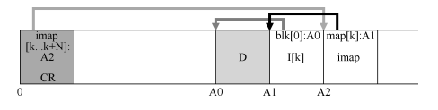

# 第 43 章 日志结构文件系统

在 20 世纪 90 年代初期，John Ousterhout 教授和研究生 Mendel Rosenblum 领导的伯克利团队开发了一种新的文件系统，称为 **日志结构文件系统（Log-structured File System，LFS）**。其主要动机基于以下观察：

- **内存大小增长**：随着内存变大，更多数据可以被缓存，减少磁盘读取次数，而写入则占据磁盘的大部分流量，因此提升写入性能变得尤为重要。
- **顺序 I/O 与随机 I/O 性能差距扩大**：磁盘的传输带宽每年增长 50% 至 100%，但寻道和旋转延迟成本下降缓慢。因此，顺序使用磁盘能带来巨大的性能提升。
- ==**现有文件系统的局限**：如 FFS 在常见工作负载下表现不佳，特别是在频繁的小文件写入时，导致频繁寻道和旋转延迟。==
- ==**RAID 支持不足**：RAID 系统面临小写入问题（small-write problem），现有文件系统未能避免最坏的 RAID 写入行为。==

​		LFS 通过将所有更新（包括元数据）缓存在内存段中，并在段满时以一次长时间的顺序传输写入磁盘的空闲部分，实现了顺序写入。这样可以利用磁盘的顺序带宽，提高写入性能。

### 原文：

​		20 世纪 90 年代早期，由 John Ousterhout 教授和研究生 Mendel Rosenblum 领导的伯克利小组开发了一种新的文件系统，称为日志结构文件系统[RO91]。他们这样做的动机是基于以下观察。

-   **内存大小不断增长。**随着内存越来越大，可以在内存中缓存更多数据。随着更多数据的缓存，磁盘流量将越来越多地由写入组成，因为读取将在缓存中进行处理。因此，文件系统性能很大程度上取决于写入性能。

-   **随机 I/O 性能与顺序 I/O 性能之间存在巨大的差距，且不断扩大：传输带宽每年增加约 50%～100%。**寻道和旋转延迟成本下降得较慢，可能每年 5%～10%[P98]。因此，如果能够以顺序方式使用磁盘，则可以获得巨大的性能优势，随着时间的推移而增长。

-   **现有文件系统在许多常见工作负载上表现不佳。**例如，FFS [MJLF84]会执行大量写入，以创建大小为一个块的新文件：一个用于新的 inode，一个用于更新 inode位图，一个用于文件所在的目录数据块，一个用于目录 inode 以更新它，一个用于新数据块，它是新文件的一部分，另一个是数据位图，用于将数据块标记为已分配。因此，尽管 FFS 会将所有这些块放在同一个块组中，但 FFS 会导致许多短寻道和随后的旋转延迟，因此性能远远低于峰值顺序带宽。

-   **文件系统不支持 RAID。**例如，RAID-4 和 RAID-5 具有小写入问题（small-write problem），即对单个块的逻辑写入会导致 4 个物理 I/O 发生。现有的文件系统不会试图避免这种最坏情况的 RAID 写入行为。


​		因此，理想的文件系统会专注于写入性能，并尝试利用磁盘的顺序带宽。此外，它在常见工作负载上表现良好，这种负载不仅写出数据，还经常更新磁盘上的元数据结构。最后，它可以在 RAID 和单个磁盘上运行良好。

​		引入的新型文件系统 Rosenblum 和 Ousterhout 称为 LFS，是日志结构文件系统（Log-structured File System）的缩写。写入磁盘时，LFS 首先将所有更新（包括元数据！）缓冲在内存段中。当段已满时，它会在一次长时间的顺序传输中写入磁盘，并传输到磁盘的未使用部分。LFS 永远不会覆写现有数据，而是始终将段写入空闲位置。由于段很大，因此可以有效地使用磁盘，并且文件系统的性能接近其峰值。


## 43.1 按顺序写入磁盘

​		==LFS 的核心思想是将文件系统状态的所有更新转换为对磁盘的一系列顺序写入。==LFS 通过将数据块、inode 等顺序写入磁盘，以减少寻道和旋转延迟。尽管顺序写入是核心思想，但实现过程中需要处理许多细节和挑战。

### 原文：

​		因此，我们遇到了第一个挑战：如何将文件系统状态的所有更新转换为对磁盘的一系列顺序写入？为了更好地理解这一点，让我们举一个简单的例子。想象一下，我们正在将数据块 D 写入文件。将数据块写入磁盘可能会导致以下磁盘布局，其中 D 写在磁盘地址 A0：


​		但是，当用户写入数据块时，不仅是数据被写入磁盘；还有其他需要更新的元数据（metadata）。在这个例子中，让我们将文件的 inode（I）也写入磁盘，并将其指向数据块 D。写入磁盘时，数据块和 inode 看起来像这样（注意 inode 看起来和数据块一样大，但通常情况并非如此。在大多数系统中，数据块大小为 4KB，而 inode 小得多，大约 128B）：


​		简单地将所有更新（例如数据块、inode 等）顺序写入磁盘的这一基本思想是 LFS 的核心。如果你理解这一点，就抓住了基本的想法。但就像所有复杂的系统一样，魔鬼藏在细节中。


## 43.2 顺序而高效地写入

​		==顺序写入的效率依赖于一次性写入足够大的数据量。通过 **写入缓冲（write buffering）**，LFS 将内存中的更新缓冲为段，并在段足够大时写入磁盘。这些段通常较大，以确保写入效率。==


### 原文：

​		遗憾的是，（单单）顺序写入磁盘并不足以保证高效写入。例如，假设我们在时间 T 向地址 A 写入一个块。然后等待一会儿，再向磁盘写入地址 A+1（下一个块地址按顺序），但是在时间 T+δ。遗憾的是，在第一次和第二次写入之间，磁盘已经旋转。当你发出第二次写入时，它将在提交之前等待一大圈旋转（具体地说，如果旋转需要时间 Trotation，则磁盘将等待 Trotation−δ，然后才能将第二次写入提交到磁盘表面）。因此，你可以希望看到简单地按顺序写入磁盘不足以实现最佳性能。实际上，你必须向驱动器发出大量连续写入（或一次大写入）才能获得良好的写入性能。

​		为了达到这个目的，LFS 使用了一种称为写入缓冲①（write buffering）的古老技术。在写入磁盘之前，LFS 会跟踪内存中的更新。收到足够数量的更新时，会立即将它们写入磁盘，从而确保有效使用磁盘。LFS 一次写入的大块更新被称为段（segment）。虽然这个术语在计算机系统中被过度使用，但这里的意思是 LFS 用来对写入进行分组的大块。因此，在写入磁盘时，LFS 会缓冲内存段中的更新，然后将该段一次性写入磁盘。只要段足够大，这些写入就会很有效。下面是一个例子，其中 LFS 将两组更新缓冲到一个小段中。实际段更大（几 MB）。第一次更新是对文件 j 的 4 次块写入，第二次是添加到文件 k 的一个块。然后，LFS 立即将整个七个块的段提交到磁盘。这些块的磁盘布局如下：


## 43.3 要缓冲多少

​		==要实现高效写入，LFS 需要缓冲足够的数据量，以摊销每次写入前的定位开销。==计算缓冲量的公式如下：

D=F×Rpeak×Tposition1−FD = \frac{F \times R_{peak} \times T_{position}}{1 - F}D=1−FF×Rpeak×Tposition

其中 FFF 为希望达到的带宽峰值百分比，RpeakR_{peak}Rpeak 为磁盘的峰值传输速率，TpositionT_{position}Tposition 为定位时间。通过调整 FFF，可以计算达到不同峰值性能所需的缓冲量。

### 原文：


## 43.4 如何查找 inode

​		在传统 UNIX 文件系统中，inode 存储在固定位置，==但在 LFS 中，inode 被分散在磁盘的各个部分，且不断移动。为解决这个问题，LFS 引入了 **inode 映射（inode map, imap）**，它是一个将 inode 号映射到最新 inode 位置的间接层。imap 被存储在段中，随着段的写入而更新。==

### 原文：

​		要了解如何在 LFS 中很到 inode，让我们简单回顾一下如何在典型的 UNIX 文件系统中查很 inode。在典型的文件系统（如 FFS）甚至老 UNIX 文件系统中，查很 inode 很容易，因为它们以数组形式组织，并放在磁盘的固定位置上。

​		例如，老 UNIX 文件系统将所有 inode 保存在磁盘的固定位置。因此，给定一个 inode号和起始地址，要查很特定的 inode，只需将 inode 号乘以 inode 的大小，然后将其加上磁盘数组的起始地址，即可计算其确切的磁盘地址。给定一个 inode 号，基于数组的索引是快速而直接的。

​		在 FFS 中查很给定 inode 号的 inode 仅稍微复杂一些，因为 FFS 将 inode 表拆分为块并在每个柱面组中放置一组 inode。因此，必须知道每个 inode 块的大小和每个 inode 的起始地址。之后的计算类似，也很容易。

​		在 LFS 中，生活比较艰很。为什么？好吧，我们已经设法将 inode 分散在整个磁盘上！更糟糕的是，我们永远不会覆盖，因此最新版本的 inode（即我们想要的那个）会不断移动。


## 43.5 通过间接解决方案：innode 映射


### 原文：

​		为了解决这个问题，LFS 的设计者通过名为 inode 映射（inode map，imap）的数据结构，在 inode 号和 inode 之间引入了一个间接层（level of indirection）。imap 是一个结构，它将 inode号作为输入，并生成最新版本的 inode 的磁盘地址。因此，你可以想象它通常被实现为一个简单的数组，每个条目有 4 个字节（一个磁盘指针）。每次将 inode 写入磁盘时，imap 都会使用其新位置进行更新。


​		遗憾的是，imap 需要保持持久（写入磁盘）。这样做允许 LFS 在崩溃时仍能记录 inode位置，从而按设想运行。因此有一个问题：imap 应该驻留在磁盘上的哪个位置？

​		当然，它可以存在于磁盘的固定部分。遗憾的是，由于它经常更新，因此需要更新文件结构，然后写入 imap，因此性能会受到影响（每次的更新和 imap 的固定位置之间，会有更多的磁盘寻道）。

​		与此不同，LFS 将 inode 映射的块放在它写入所有其他新信息的位置旁边。因此，当将数据块追加到文件 k 时，LFS 实际上将新数据块，其 inode 和一段 inode 映射一起写入磁盘，如下所示：


​		在该图中，imap 数组存储在标记为 imap 的块中，它告诉 LFS，inode k 位于磁盘地址A1。接下来，这个 inode 告诉 LFS 它的数据块 D 在地址 A0。


## 43.6 检查点区域

​		为了在磁盘上找到 inode 映射，==LFS 设定了一个固定的区域，称为 **检查点区域（checkpoint region, CR）**。CR 包含指向最新 inode 映射的指针。CR 仅在定期（如每 30 秒）更新，因此不会频繁写入。CR 是磁盘布局的起始点，用于恢复和查找文件系统的关键数据结构。==

### 原文：

​		聪明的读者（就是你，对吗？）可能已经注意到了这里的问题。我们如何很到 inode 映射，现在它的各个部分现在也分布在整个磁盘上？归根到底：文件系统必须在磁盘上有一些固定且已知的位置，才能开始文件查很。

​		LFS 在磁盘上只有这样一个固定的位置，称为检查点区域（checkpoint region，CR）。检查点区域包含指向最新的 inode 映射片段的指针（即地址），因此可以通过首先读取 CR 来很到 inode 映射片段。请注意，检查点区域仅定期更新（例如每 30s 左右），因此性能不会受到影响。因此，磁盘布局的整体结构包含一个检查点区域（指向内部映射的最新部分），每个 inode映射块包含 inode 的地址，inode 指向文件（和目录），就像典型的 UNIX 文件系统一样。

​		下面的例子是检查点区域（注意它始终位于磁盘的开头，地址为 0），以及单个 imap 块，inode 和数据块。一个真正的文件系统当然会有一个更大的 CR（事实上，它将有两个，我们稍后会理解），许多 imap 块，当然还有更多的 inode、数据块等。




## 43.7 读取文件的过程：回顾

​		==从 LFS 读取文件时，首先读取 CR 来查找 inode 映射。通过 inode 映射找到 inode 的位置，再通过 inode 的指针访问文件的块数据。虽然读取 inode 的过程略复杂，但一旦 inode 映射被缓存，读取效率与传统文件系统类似。==

### 原文：

​		为了确保理解 LFS 的工作原理，现在让我们来看看从磁盘读取文件时必须发生的事情。假设从内存中没有任何东西开始。我们必须读取的第一个磁盘数据结构是检查点区域。检查点区域包含指向整个 inode 映射的指针（磁盘地址），因此 LFS 读入整个 inode 映射并将其缓存在内存中。在此之后，当给定文件的 inode 号时，LFS 只是在 imap 中查很 inode 号到inode 磁盘地址的映射，并读入最新版本的 inode。要从文件中读取块，此时，LFS 完全按照典型的 UNIX 文件系统进行操作，方法是使用直接指针或间接指针或双重间接指针。在通常情况下，从磁盘读取文件时，LFS 应执行与典型文件系统相同数量的 I/O，整个 imap 被缓存，因此 LFS 在读取过程中所做的额外工作是在 imap 中查很 inode 的地址。


## 43.8 目录如何

​		LFS 处理目录结构与传统文件系统类似，目录中存储名称到 inode 号的映射。创建文件时，LFS 将目录的更新、inode 和文件数据块一并写入磁盘的空闲段中。通过 inode 映射，LFS 避免了递归更新问题，即每次 inode 位置变化时不需要更新指向它的目录。

### 原文：

​		到目前为止，我们通过仅考虑 inode 和数据块，简化了讨论。但是，要访问文件系统中的文件（例如/home/remzi/foo，我们最喜欢的伪文件名之一），也必须访问一些目录。那么LFS 如何存储目录数据呢？

​		幸运的是，==目录结构与传统的 UNIX 文件系统基本相同，因为目录只是（名称，inode号）映射的集合。例如，在磁盘上创建文件时，LFS 必须同时写入新的 inode，一些数据，以及引用此文件的目录数据及其 inode。==请记住，LFS 将在磁盘上按顺序写入（在缓冲更新一段时间后）。因此，在目录中创建文件 foo，将导致磁盘上的以下新结构：


​		inode 映射的片段包含目录文件 dir 以及新创建的文件 f 的位置信息。因此，访问文件foo（具有 inode 号 f）时，你先要查看 inode 映射（通常缓存在内存中），很到目录 dir（A3）的 inode 的位置。然后读取目录的 inode，它给你目录数据的位置（A2）。读取此数据块为你提供名称到 inode 号的映射（foo，k）。然后再次查阅 inode 映射，很到 inode 号 k（A1）的位置，最后在地址 A0 处读取所需的数据块。

​		==inode 映射还解决了 LFS 中存在的另一个严重问题，称为递归更新问题（recursive updateproblem[Z+12]。任何永远不会原地更新的文件系统（例如 LFS）都会遇到该问题，它们将更新移动到磁盘上的新位置。==

​		具体来说，每当更新 inode 时，它在磁盘上的位置都会发生变化。如果我们不小心，这也会导致对指向该文件的目录的更新，然后必须更改该目录的父目录，依此类推，一路沿文件系统树向上。

​		LFS 巧妙地避免了 inode 映射的这个问题。即使 inode 的位置可能会发生变化，更改也不会反映在目录本身中。事实上，imap 结构被更新，而目录保持相同的名称到 inumber 的映射。因此，通过间接，LFS 避免了递归更新问题。


## 43.9 一个新的问题：垃圾收集

​		==LFS 会不断将最新版本的文件数据写入新位置，导致旧版本的数据块成为 **垃圾（garbage）**。LFS 需要定期清理这些旧版本的块，这个过程称为 **垃圾收集（garbage collection）**。==

- ==**机制**：LFS 通过段摘要块（segment summary block）记录每个数据块的 inode 号和偏移量。通过检查 inode 的直接或间接指针，LFS 能确定块是否是活的（在用）或已死（不再使用）。==
- ==**策略**：垃圾收集策略包括决定何时进行清理和选择哪些段进行清理。LFS 尝试通过分析段的热度（覆盖频率）来优化清理过程。==

### 原文：

​		你可能已经注意到 LFS 的另一个问题；它会反复将最新版本的文件（包括其 inode 和数据）写入磁盘上的新位置。此过程在保持写入效率的同时，意味着 LFS 会在整个磁盘中分散旧版本的文件结构。我们（毫不客气地）将这些旧版本称为垃圾（garbage）。例如，假设有一个由 inode 号 k 引用的现有文件，该文件指向单个数据块 D0。我们现在覆盖该块，生成新的 inode 和新的数据块。由此产生的 LFS 磁盘布局看起来像这样（注意，简单起见，我们省略了 imap 和其他结构。还需要将一个新的 imap 大块写入磁盘，以指向新的 inode）：


​		在图中，可以看到 inode 和数据块在磁盘上有两个版本，一个是旧的（左边那个），一个是当前的，因此是活的（live，右边那个）。对于覆盖数据块的简单行为，LFS 必须持久许多新结构，从而在磁盘上留下上述块的旧版本。

​		另外举个例子，假设我们将一块添加到该原始文件 k 中。在这种情况下，会生成新版本的 inode，但旧数据块仍由旧 inode 指向。因此，它仍然存在，并且与当前文件系统分离：


​		但是，LFS 只保留文件的最新活版本。因此（在后台），LFS 必须定期查很文件数据，索引节点和其他结构的旧的死版本，并清理（clean）它们。因此，清理应该使磁盘上的块再次空闲，以便在后续写入中使用。请注意，清理过程是垃圾收集（garbage collection）的一种形式，这种技术在编程语言中出现，可以自动为程序释放未使用的内存。

​		之前我们讨论过的段很重要，因为它们是在 LFS 中实现对磁盘的大段写入的机制。事实证因，它们也是有效清理的重要组成部分。想象一下，如果 LFS 清理程序在清理过程中简单地通过并释放单个数据块，索引节点等，会发生什么。结果：文件系统在磁盘上分配的空间之间混合了一些空闲洞（hole）。写入性能会大幅下降，因为 LFS 无法很到一个大块连续区域，以便顺序地写入磁盘，获得高性能。

​		实际上，LFS 清理程序按段工作，从而为后续写入清理出大块空间。基本清理过程的工作原理如下。LFS 清理程序定期读入许多旧的（部分使用的）段，确定哪些块在这些段中存在，然后写出一组新的段，只包含其中活着的块，从而释放旧块用于写入。具体来说，我们预期清理程序读取 *M* 个现有段，将其内容打包（compact）到 *N* 个新段（其中 *N* < *M*），然后将 *N* 段写入磁盘的新位置。然后释放旧的 *M* 段，文件系统可以使用它们进行后续写入。

​		但是，我们现在有两个问题。第一个是机制：LFS 如何判断段内的哪些块是活的，哪些块已经死了？第二个是策略：清理程序应该多久运行一次，以及应该选择清理哪些部分？


## 43.10 确定块的死活

### 原文：

​		我们首先关注这个问题。给定磁盘段 S 内的数据块 D，LFS 必须能够确定 D 是不是活的。为此，LFS 会为描述每个块的每个段添加一些额外信息。具体地说，对于每个数据块 D，LFS 包括其 inode 号（它属于哪个文件）及其偏移量（这是该文件的哪一块）。该信息记录在一个数据结构中，位于段头部，称为段摘要块（segment summary block）。

​		根据这些信息，可以直接确定块的死活。对于位于地址 A 的磁盘上的块 D，查看段摘要块并很到其 inode 号 N 和偏移量 T。接下来，查看 imap 以很到 N 所在的位置，并从磁盘读取 N（可能它已经在内存中，这更好）。最后，利用偏移量 T，查看 inode（或某个间接块），看看 inode 认为此文件的第 T 个块在磁盘上的位置。如果它刚好指向磁盘地址 A，则 LFS可以断定块 D 是活的。如果它指向其他地方，LFS 可以断定 D 未被使用（即它已经死了），因此知道不再需要该版本。下面的伪代码总结了这个过程：

```
(N, T) = SegmentSummary[A]; 
inode = Read(imap[N]); 
if (inode[T] == A) 
 // block D is alive 
else 
 // block D is garbage
```

下面是一个描述机制的图，其中段摘要块（标记为 SS）记录了地址 A0 处的数据块，实际上是文件 k 在偏移 0 处的部分。通过检查 imap 的 k，可以很到 inode，并且看到它确实指向该位置。


​		LFS 走了一些捷径，可以更有效地确定死活。例如，当文件被截断或删除时，LFS 会增加其版本号（version number），并在 imap 中记录新版本号。通过在磁盘上的段中记录版本号，LFS 可以简单地通过将磁盘版本号与 imap 中的版本号进行比较，跳过上述较长的检查，从而避免额外的读取。

## 43.11策略问题：要清理哪些块，何时清理

​		在上述机制的基础上，LFS 必须包含一组策略，以确定何时清理以及哪些块值得清理。确定何时清理比较容易。要么是周期性的，要么是空闲时间，要么是因为磁盘已满。

​		确定清理哪些块更具挑战性，并且已成为许多研究论文的主题。在最初的 LFS 论文[RO91]中，作者描述了一种试图分离冷热段的方法。热段是经常覆盖内容的段。因此，对于这样的段，最好的策略是在清理之前等待很长时间，因为越来越多的块被覆盖（在新的段中），从而被释放以供使用。相比之下，冷段可能有一些死块，但其余的内容相对稳定。因此，作者得出结论，应该尽快清理冷段，延迟清理热段，并开发出一种完全符合要求的试探算法。但是，与大多数政策一样，这只是一种方法，当然并非“最佳”方法。后来的一些方法展示了如何做得更好[MR+97]。


## 43.12 崩溃恢复和日志

​		==LFS 通过日志化管理所有写入，并定期更新 CR。LFS 使用双检查点区域交替更新以确保一致性，并通过前滚技术重建部分段以尽量减少数据丢失。在崩溃后，LFS 能从 CR 开始恢复，重放日志中的段来恢复文件系统状态。==


### 原文：

​		最后一个问题：如果系统在 LFS 写入磁盘时崩溃会发生什么？你可能还记得上一章讲的日志，在更新期间崩溃对于文件系统来说是棘手的，因此 LFS 也必须考虑这些问题。

​		在正常操作期间，LFS 将一些写入缓冲在段中，然后（当段已满或经过一段时间后），将段写入磁盘。LFS 在日志（log）中组织这些写入，即指向头部段和尾部段的检查点区域，并且每个段指向要写入的下一个段。LFS 还定期更新检查点区域（CR）。在这些操作期间都可能发生崩溃（写入段，写入 CR）。那么 LFS 在写入这些结构时如何处理崩溃？

​		我们先介绍第二种情况。为了确保 CR 更新以原子方式发生，LFS 实际上保留了两个CR，每个位于磁盘的一端，并交替写入它们。当使用最新的指向 inode 映射和其他信息的指针更新 CR 时，LFS 还实现了一个谨慎的协议。具体来说，它首先写出一个头（带有时间戳），然后写出 CR 的主体，然后最后写出最后一部分（也带有时间戳）。如果系统在 CR 更新期间崩溃，LFS 可以通过查看一对不一致的时间戳来检测到这一点。LFS 将始终选择使用具有一致时间戳的最新 CR，从而实现 CR 的一致更新。

​		我们现在关注第一种情况。由于 LFS 每隔 30s 左右写入一次 CR，因此文件系统的最后一致快照可能很旧。因此，在重新启动时，LFS 可以通过简单地读取检查点区域、它指向的imap 片段以及后续文件和目录，从而轻松地恢复。但是，最后许多秒的更新将会丢失。

​		为了改进这一点，LFS 尝试通过数据库社区中称为前滚（roll forward）的技术，重建其中许多段。基本思想是从最后一个检查点区域开始，很到日志的结尾（包含在 CR 中），然后使用它来读取下一个段，并查看其中是否有任何有效更新。如果有，LFS 会相应地更新文件系统，从而恢复自上一个检查点以来写入的大部分数据和元数据。有关详细信息，请参阅 Rosenblum 获奖论文[R92]。


## 43.13 小结

​		==LFS 采用了数据库系统中的 **影子分页（shadow paging）** 技术，实现了写时复制（Copy-on-Write）。这种方法通过将所有更新组织为顺序写入，提高了磁盘的写入性能。然而，这也引入了垃圾收集问题，需要定期清理磁盘上的旧数据段。==一些现代文件系统，如 NetApp 的 WAFL、Sun 的 ZFS 和 Linux 的 btrfs，采用了类似的写时复制方法，继续发展和优化 LFS 的理念。特别是 NetApp 的 WAFL 将 LFS 的垃圾收集问题转化为特性，通过提供旧版本的快照为用户提供了额外的恢复选项。

