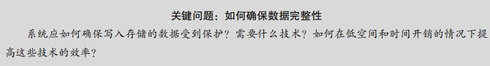
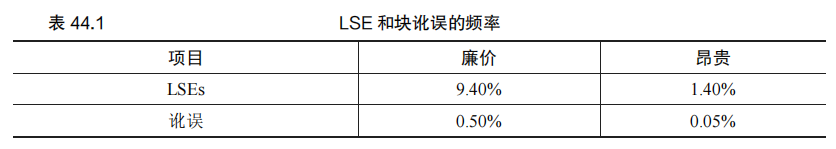
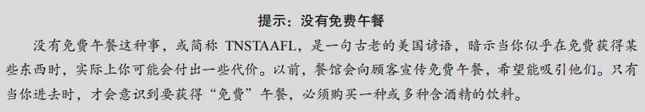
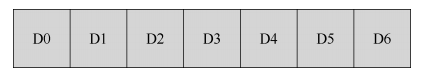
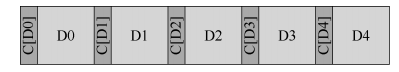
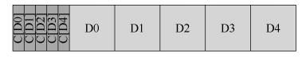
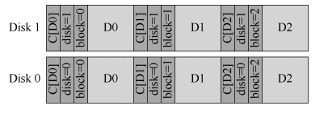

### 第 44 章 数据完整性和保护

现代存储系统必须面对数据不可靠性的问题，即如何确保数据完整性，避免数据丢失或错误。数据完整性（data integrity）或数据保护（data protection）是确保存储系统返回的数据与存储时一致的重要领域。本章探讨了各种技术，以确保数据的安全性和完整性。



#### 44.1 磁盘故障模式

现代磁盘不仅会发生传统的故障-停止（fail-stop）模式（磁盘完全失效），还会出现 **部分故障（fail-partial）**，即磁盘某些块无法访问或数据错误。这些故障包括：

- **潜在扇区错误（LSE）**：磁盘扇区不可读，通常由于磁头碰撞、宇宙射线等导致数据位损坏。
- **块讹误（block corruption）**：磁盘块被错误地写入或传输，即便 ECC 校验码无误，但返回的数据仍不正确。这种错误尤其隐蔽，被称为无声故障（silent fault）。

研究表明，廉价磁盘（如 SATA）和昂贵磁盘（如 SCSI）都可能出现这些问题。尽管昂贵磁盘出现的频率较低，但这些故障仍需存储系统进行处理。

#### 原文：

​		正如你在关于 RAID 的章节中所了解到的，磁盘并不完美，并且可能会发生故障（有时）。在早期的 RAID 系统中，故障模型非常简单：要么整个磁盘都在工作，要么完全失败，而且检测到这种故障很简单。这种磁盘故障的故障—停止（fail-stop）模型使构建 RAID 相对简单[S90]。

​		你不知道的是现代磁盘展示的所有其他类型的故障模式。具体来说，正如 Bairavasundaram等人的详细研究[B+07，B+08]，现代磁盘似乎大部分时间正常工作，但是无法成功访问一个或几个块。具体来说，两种类型的单块故障是常见的，值得考虑：潜在扇区错误（Latent-Sector Errors，LSE）和块讹误（block corruption）。接下来分别详细地讨论。

​		当磁盘扇区（或扇区组）以某种方式讹误时，会出现 LSE。例如，如果磁头由于某种原因接触到表面（磁头碰撞，head crash，在正常操作期间不应发生的情况），则可能会讹误表面，使得数据位不可读。宇宙射线也会导致数据位翻转，使内容不正确。幸运的是，驱动器使用磁盘内纠错码（Error Correcting Code，ECC）来确定块中的磁盘位是否良好，并且在某些情况下，修复它们。如果它们不好，并且驱动器没有足够的信息来修复错误，则在发出请求读取它们时，磁盘会返回错误。

​		还存在一些情况，磁盘块出现讹误（corrupt），但磁盘本身无法检测到。例如，有缺陷的磁盘固件可能会将块写入错误的位置。在这种情况下，磁盘 ECC 指示块内容很好，但是从客户端的角度来看，在随后访问时返回错误的块。类似地，当一个块通过有故障的总线从主机传输到磁盘时，它可能会讹误。由此产生的讹误数据会存入磁盘，但它不是客户所希望的。这些类型的故障特别隐蔽，因为它们是无声的故障（silent fault）。返回故障数据时，磁盘没有报告问题。

​		Prabhakaran 等人将这种更现代的磁盘故障视图描述为故障—部分（fail-partial）磁盘故障模型[P+05]。在此视图中，磁盘仍然可以完全失败（像传统的故障停止模型中的情况）。然而，磁盘也可以似乎正常工作，并有一个或多个块变得不可访问（即 LSE）或保存了错误的内容（即讹误）。因此，当访问看似工作的磁盘时，偶尔会在尝试读取或写入给定块时返回错误（非无声的部分故障），偶尔可能只是返回错误的数据（一个无声的部分错误）。

​		这两种类型的故障都有点罕见，但有多罕见？表 44.1 总结了 Bairavasundaram 的两项研究[B+07，B+08]的一些结果。



​		该表显示了在研究过程中至少出现一次 LSE 或块讹误的驱动器百分比（大约 3 年，超过 150 万个磁盘驱动器）。该表进一步将结果细分为“廉价”驱动器（通常为 SATA 驱动器）和“昂贵”驱动器（通常为 SCSI 或 FibreChannel）。如你所见，虽然购买更好的驱动器可以减少两种类型问题的频率（大约一个数量级），但它们的发生频率仍然足够高，你需要仔细考虑如何在存储系统中处理它们。关于 LSE 的一些其他发现如下：  具有多个 LSE 的昂贵驱动器可能会像廉价驱动器一样产生附加错误。

  对于大多数驱动器，第二年的年度错误率会增加。

-   LSE 随磁盘大小增加。

-   大多数磁盘的 LSE 少于 50 个。

-   具有 LSE 的磁盘更有可能发生新增的 LSE。

-   存在显著的空间和时间局部性。

-   磁盘清理很有用（大多数 LSE 都是这样找到的）。

​	关于讹误的一些发现如下：

-   同一驱动器类别中不同驱动器型号的讹误机会差异很大。

-   老化效应因型号而异。

-   工作负载和磁盘大小对讹误几乎没有影响。

- 大多数具有讹误的磁盘只有少数讹误。

-   讹误不是与一个磁盘或 RAID 中的多个磁盘无关的。

-   存在空间局部性和一些时间局部性。

-   与 LSE 的相关性较弱。

​		要了解有关这些故障的更多信息，应该阅读原始论文[B+07，B+08]。但主要观点应该已经明确：如果真的希望建立一个可靠的存储系统，必须包括一些机制来检测和恢复 LSE并阻止讹误。


#### 44.2 处理潜在的扇区错误

**潜在扇区错误（LSE）** 易于检测，当磁盘访问失败时，存储系统可以使用冗余机制（如 RAID）从备用副本或通过奇偶校验恢复数据。例如：

- 在 RAID-1 镜像中，读取备用副本。
- 在 RAID-4 或 RAID-5 中，通过奇偶校验组中的其他块重建数据。

**改进措施**：为了应对 LSE 频发的问题，RAID-DP 等系统增加了额外的冗余度，如两个奇偶校验磁盘（而非一个），以在重建时应对 LSE 的发生。这虽然增加了成本和空间需求，但能大大提高系统的恢复能力。


#### 原文：

​		鉴于这两种新的部分磁盘故障模式，我们现在应该尝试看看可以对它们做些什么。让我们首先解决两者中较为容易的问题，即潜在的扇区错误。


​		事实证明，潜在的扇区错误很容易处理，因为它们（根据定义）很容易被检测到。当存储系统尝试访问块，并且磁盘返回错误时，存储系统应该就用它具有的任何冗余机制，来返回正确的数据。例如，在镜像 RAID 中，系统应该访问备用副本。在基于奇偶校验的RAID-4 或 RAID-5 系统中，系统应通过奇偶校验组中的其他块重建该块。因此，利用标准冗余机制，可以容易地恢复诸如 LSE 这样的容易检测到的问题。

​		多年来，LSE 的日益增长影响了 RAID 设计。当全盘故障和 LSE 接连发生时，RAID-4/5系统会出现一个特别有趣的问题。具体来说，当整个磁盘发生故障时，RAID 会尝试读取奇偶校验组中的所有其他磁盘，并重新计算缺失值，来重建（reconstruct）磁盘（例如，在热备用磁盘上）。如果在重建期间，在任何一个其他磁盘上遇到 LSE，我们就会遇到问题：重建无法成功完成。

​		为了解决这个问题，一些系统增加了额外的冗余度。例如，NetApp 的 RAID-DP 相当于两个奇偶校验磁盘，而不是一个[C+04]。在重建期间发现 LSE 时，额外的校验盘有助于重建丢失的块。与往常一样，这有成本，因为为每个条带维护两个奇偶校验块的成本更高。但是，NetApp WAFL 文件系统的日志结构特性在许多情况下降低了成本[HLM94]。另外的成本是空间，需要额外的磁盘来存放第二个奇偶校验块。


#### 44.3 检测讹误：校验和

数据讹误难以检测，因为其无声性使得磁盘读取的数据在无提示情况下可能出错。为了确保数据完整性，现代存储系统广泛使用 **校验和（checksum）**。

**校验和的工作原理**：

- 校验和是对数据块内容的摘要，可以是 4 或 8 个字节。
- 存储系统将校验和与数据一起存储，读取时重新计算校验和并与存储值比较。若匹配，数据无误；若不匹配，数据损坏。

**常见校验和方法**：

1. **异或（XOR）校验和**：简单、快速，但对某些错误（如位翻转）不敏感。
2. **加法校验和**：基于二进制补码加法，能检测许多错误，但对移位不敏感。
3. **Fletcher 校验和**：基于加法的更复杂形式，能检测单比特、双比特及大部分突发错误。
4. **循环冗余校验（CRC）**：通过将数据视为大二进制数并对其进行二进制模运算来计算，广泛用于网络和存储中，具备高效和高准确性。

#### 原文：

​		现在让我们解决更具挑战性的问题，即数据讹误导致的无声故障。在出现讹误导致磁盘返回错误数据时，如何阻止用户获取错误数据？


​		与潜在的扇区错误不同，检测讹误是一个关键问题。客户如何判断一个块坏了？一旦知道特定块是坏的，恢复就像以前一样：你需要有该块的其他副本（希望没有讹误！）。因此，我们将重点放在检测技术上。

​		现代存储系统用于保持数据完整性的主要机制称为校验和（checksum）。校验和就是一个函数的结果，该函数以一块数据（例如 4KB 块）作为输入，并计算这段数据的函数，产生数据内容的小概要（比如 4 字节或 8 字节）。此摘要称为校验和。这种计算的目的在于，让系统将校验和与数据一起存储，然后在访问时确认数据的当前校验和与原始存储值匹配，从而检测数据是否以某种方式被破坏或改变。



#### 常见的校验和函数

许多不同的函数用于计算校验和，并且强度（即它们在保护数据完整性方面有多好）

和速度（即它们能够以多快的速度计算）不同。系统中常见的权衡取决于此：通常，你获

得的保护越多，成本就越高。没有免费午餐这种事。

有人使用一个简单的校验和函数，它基于异或（XOR）。使用基于 XOR 的校验和，只

需对需要校验和的数据块的每个块进行异或运算，从而生成一个值，表示整个块的 XOR。

为了使这更具体，想象一下在一个 16 字节的块上计算一个 4 字节的校验和（这个块当然

太小而不是真正的磁盘扇区或块，但它将用作示例）。十六进制的 16 个数据字节如下所示：

```
365e c4cd ba14 8a92 ecef 2c3a 40be f666
```

如果以二进制形式查看它们，会看到：

```
0011 0110 0101 1110 1100 0100 1100 1101 
1011 1010 0001 0100 1000 1010 1001 0010 
1110 1100 1110 1111 0010 1100 0011 1010 
0100 0000 1011 1110 1111 0110 0110 0110
```

​		因为我们以每行 4 个字节为一组排列数据，所以很容易看出生成的校验和是什么。只需对每列执行 XOR 以获得最终的校验和值：

```
0010 0000 0001 1011 1001 0100 0000 0011
```

​		十六进制的结果是 0x201b9403。

​		XOR 是一个合理的校验和，但有其局限性。例如，如果每个校验和单元内相同位置的两个位发生变化，则校验和将不会检测到讹误。出于这个原因，人们研究了其他校验和函数。

​		另一个简单的校验和函数是加法。这种方法具有快速的优点。计算它只需要在每个数据块上执行二进制补码加法，忽略溢出。它可以检测到数据中的许多变化，但如果数据被移位，则不好。

​		稍微复杂的算法被称为 Fletcher 校验和（Fletcher checksum），命名基于（你可能会猜到）发明人 John G. Fletcher [F82]。它非常简单，涉及两个校验字节 s1 和 s2 的计算。具体来说，假设块 D 由字节 d1,…, dn 组成。s1 简单地定义如下：s1 = s1 + di mod 255（在所有 di 上计算）。s2 依次为：s2 = s2 + s1 mod 255（同样在所有 di 上）[F04]。已知 fletcher 校验和几乎与 CRC（下面描述）一样强，可以检测所有单比特错误，所有双比特错误和大部分突发错误[F04]。

​		最后常用的校验和称为循环冗余校验（CRC）。虽然听起来很奇特，但基本想法很简单。假设你希望计算数据块 D 的校验和。你所做的只是将 D 视为一个大的二进制数（毕竟它只是一串位）并将其除以约定的值（k）。该除法的其余部分是 CRC 的值。事实证明，人们可以相当有效地实现这种二进制模运算，因此也可以在网络中普及 CRC。有关详细信息，请参见其他资料[M13]。

​		无论使用何种方法，很明显没有完美的校验和：两个具有不相同内容的数据块可能具有相同的校验和，这被称为碰撞（collision）。这个事实应该是直观的：毕竟，计算校验和会使某种很大的东西（例如，4KB）产生很小的摘要（例如，4 或 8 个字节）。在选择良好的校验和函数时，我们试图找到一种函数，能够在保持易于计算的同时，最小化碰撞机会。

#### 校验和布局 

​		既然你已经了解了如何计算校验和，接下来就分析如何在存储系统中使用校验和。我们必须解决的第一个问题是校验和的布局，即如何将校验和存储在磁盘上？

​		最基本的方法就是为每个磁盘扇区（或块）存储校验和。给定数据块 D，我们称该数据的校验和为 C（D）。因此，没有校验和，磁盘布局如下所示：



​		有了校验和，布局为每个块添加一个校验和：



​		因为校验和通常很小（例如，8 字节），并且磁盘只能以扇区大小的块（512 字节）或其倍数写入，所以出现的一个问题是如何实现上述布局。驱动器制造商采用的一种解决方案是使用 520 字节扇区格式化驱动器，每个扇区额外的 8 个字节可用于存储校验和。

​		在没有此类功能的磁盘中，文件系统必须找到一种方法来将打包的校验和存储到 512字节的块中。一种可能性如下：



​		在该方案中，*n* 个校验和一起存储在一个扇区中，后跟 *n* 个数据块，接着是后 *n* 块的另一个校验和扇区，依此类推。该方案具有在所有磁盘上工作的优点，但效率较低。例如，如果文件系统想要覆盖块 D1，它必须读入包含 C（D1）的校验和扇区，更新其中的 C（D1），然后写出校验和扇区以及新的数据块 D1（因此，一次读取和两次写入）。前面的方法（每个扇区一个校验和）只执行一次写操作。


#### 44.4 使用校验和

**校验和布局**：

- 校验和可以与每个数据块一起存储或集中存储在专用扇区中。前者效率高，但需要支持特殊扇区大小（如 520 字节）；后者在传统磁盘上工作，但会增加额外的 I/O 操作。

**校验和的使用**：

- 在读取块时，计算并比较校验和来验证数据。匹配则返回数据；不匹配则表明数据损坏。
- 若存储系统有冗余数据，使用副本或奇偶校验恢复正确数据；否则返回错误。

### 原文：

​		在确定了校验和布局后，现在可以实际了解如何使用校验和。读取块 D 时，客户端（即文件系统或存储控制器）也从磁盘 Cs（D）读取其校验和，这称为存储的校验和（stored checksum，因此有下标 Cs）。然后，客户端计算读取的块 D 上的校验和，这称为计算的校验和（computed checksum）Cc（D）。此时，客户端比较存储和计算的校验和。如果它们相等 [即 Cs（D）== Cc（D）]，数据很可能没有被破坏，因此可以安全地返回给用户。如果它们不匹配 [即 Cs（D）!= Cc（D）]，则表示数据自存储之后已经改变（因为存储的校验和反映了当时数据的值）。在这种情况下，存在讹误，校验和帮助我们检测到了。发现了讹误，自然的问题是我们应该怎么做呢？如果存储系统有冗余副本，答案很简单：尝试使用它。如果存储系统没有此类副本，则可能的答案是返回错误。在任何一种情况下，都要意识到讹误检测不是神奇的子弹。如果没有其他方法来获取没有讹误的数据，那你就不走运了。


#### 44.5 错误位置的写入

**错误位置的写入（misdirected write）** 发生在数据写入错误位置的情况。检测此问题的解决方案是将物理标识符（磁盘和扇区号）添加到校验和中。读取时，若标识符不匹配则发生了错误位置写入，这种冗余信息可帮助检测和避免此类故障。

#### 原文：

​		上述基本方案对一般情况的讹误块工作良好。但是，现代磁盘有几种不同的故障模式，需要不同的解决方案。

​		第一种感兴趣的失败模式称为“错误位置的写入（misdirected write）”。这出现在磁盘和RAID 控制器中，它们正确地将数据写入磁盘，但位置错误。在单磁盘系统中，这意味着磁盘写入块 Dx 不是在地址 x（像期望那样），而是在地址 y（因此是“讹误的”Dy）。另外，在多磁盘系统中，控制器也可能将 Di，x 不是写入磁盘 i 的 x，而是写入另一磁盘 j。因此问题是：


​		毫不奇怪，答案很简单：在每个校验和中添加更多信息。在这种情况下，添加物理标识符（Physical Identifier，物理 ID）非常有用。例如，如果存储的信息现在包含校验和 C（D）以及块的磁盘和扇区号，则客户端很容易确定块内是否存在正确的信息。具体来说，如果客户端正在读取磁盘 10 上的块 4（D10,4），则存储的信息应包括该磁盘号和扇区偏移量，如下所示。如果信息不匹配，则发生了错误位置写入，并且现在检测到讹误。以下是在双磁盘系统上添加此信息的示例。注意，该图与之前的其他图一样，不是按比例绘制的，因为校验和通常很小（例如，8 个字节），而块则要大得多（例如，4KB 或更大）：



​		可以从磁盘格式看到，磁盘上现在有相当多的冗余：对于每个块，磁盘编号在每个块中重复，并且相关块的偏移量也保留在块本身旁边。但是，冗余信息的存在应该是不奇怪。冗余是错误检测（在这种情况下）和恢复（在其他情况下）的关键。一些额外的信息虽然不是完美磁盘所必需的，但可以帮助检测出现问题的情况。


#### 44.6 最后一个问题：丢失的写入

**丢失的写入（lost write）** 是指存储设备报告写入成功但数据未持久化的情况。校验和在此情况下无效，因为旧数据可能仍然拥有正确的校验和。解决方案包括：

- **写入后读取（read-after-write）** 或 **写入验证（write verify）**：在写入后立即读取验证，但会显著降低性能。
- **更高级的文件系统支持**：如 Sun 的 ZFS，在文件系统的 inode 或间接块中也存储校验和，以检测数据和元数据的不匹配。

#### 原文：

​		遗憾的是，错误位置的写入并不是我们要解决的最后一个问题。具体来说，一些现代存储设备还有一个问题，称为丢失的写入（lost write）。当设备通知上层写入已完成，但事实上它从未持久，就会发生这种问题。因此，磁盘上留下的是该块的旧内容，而不是更新的新内容。

​		这里显而易见的问题是：上面做的所有校验和策略（例如，基本校验和或物理 ID），是否有助于检测丢失的写入？遗憾的是，答案是否定的：旧块很可能具有匹配的校验和，上面使用的物理 ID（磁盘号和块偏移）也是正确的。因此我们最后的问题：


​		有许多可能的解决方案有助于解决该问题[K+08]。一种经典方法[BS04]是执行写入验证（write verify），或写入后读取（read-after-write）。通过在写入后立即读回数据，系统可以确保数据确实到达磁盘表面。然而，这种方法非常慢，使完成写入所需的 I/O 数量翻了一番。

​		某些系统在系统的其他位置添加校验和，以检测丢失的写入。例如，Sun 的 Zettabyte 文件系统（ZFS）在文件系统的每个 inode 和间接块中，包含文件中每个块的校验和。因此，即使对数据块本身的写入丢失，inode 内的校验和也不会与旧数据匹配。只有当同时丢失对 inode和数据的写入时，这样的方案才会失败，这是不太可能的情况（但也有可能发生！）。


#### 44.7 擦净

为了确保数据长期安全，存储系统应定期执行 **磁盘擦净（disk scrubbing）**，即扫描磁盘中的所有块并验证校验和。这种做法可以发现潜在的数据损坏，减少数据完全丢失的风险。擦净操作通常安排在系统闲置时进行。

#### 原文：

​		经过所有这些讨论，你可能想知道：这些校验和何时实际得到检查？当然，在应用程序访问数据时会发生一些检查，但大多数数据很少被访问，因此将保持未检查状态。未经检查的数据对于可靠的存储系统来说是个问题，因为数据位衰减最终可能会影响特定数据的所有副本。

​		为了解决这个问题，许多系统利用各种形式的磁盘擦净（disk scrubbing）[K+08]。通过定期读取系统的每个块，并检查校验和是否仍然有效，磁盘系统可以减少某个数据项的所有副本都被破坏的可能性。典型的系统每晚或每周安排扫描。


#### 44.8 校验和的开销

**空间开销**：

- 磁盘空间：每 4KB 数据块的 8 字节校验和，约占 0.19% 的磁盘空间。
- 内存空间：在访问时短暂使用，通常影响较小。

**时间开销**：

- **CPU 开销**：计算校验和的操作增加了 CPU 负载，常采用合并数据复制和校验和计算的方法以减少开销。
- **I/O 开销**：可能导致额外的 I/O，特别是在校验和与数据分开存储时。通过擦净等后台操作增加了 I/O 活动，但这些活动通常安排在系统空闲时进行。

#### 原文：

​		在结束之前，讨论一下使用校验和进行数据保护的一些开销。有两种不同的开销，在计算机系统中很常见：空间和时间。

​		空间开销有两种形式。第一种是磁盘（或其他存储介质）本身。每个存储的校验和占用磁盘空间，不能再用于用户数据。典型的比率可能是每 4KB 数据块的 8 字节校验和，磁盘空间开销为 0.19%。

​		第二种空间开销来自系统的内存。访问数据时，内存中必须有足够的空间用于校验和以及数据本身。但是，如果系统只是检查校验和，然后在完成后将其丢弃，则这种开销是短暂的，并不是很重要。只有将校验和保存在内存中（为了增加内存讹误防护级别[Z+13]），才能观察到这种小开销。

​		虽然空间开销很小，但校验和引起的时间开销可能非常明显。至少，CPU 必须计算每个块的校验和，包括存储数据时（确定存储的校验和的值），以及访问时（再次计算校验和，并将其与存储的校验和进行比较）。许多使用校验和的系统（包括网络栈）采用了一种降低CPU 开销的方法，将数据复制和校验和组合成一个简化的活动。因为无论如何都需要拷贝（例如，将数据从内核页面缓存复制到用户缓冲区中），组合的复制/校验和可能非常有效。

​		除了 CPU 开销之外，一些校验和方案可能会导致外部 I/O 开销，特别是当校验和与数据分开存储时（因此需要额外的 I/O 来访问它们），以及后台擦净所需的所有额外 I/O。前者可以通过设计减少，后者影响有限，因为可以调整，也许通过控制何时进行这种擦净活动。半夜，当大多数（不是全部）努力工作的人们上床睡觉时，可能是进行这种擦净活动、增加存储系统健壮性的好时机。


#### 44.9 小结

我们探讨了现代存储系统中数据保护的技术，特别是校验和的使用。随着存储设备的不断发展，新型故障模式可能会出现，需要新的检测和恢复机制。当前的校验和技术已能有效应对多种故障，但未来的存储系统可能需要进一步创新。时间和技术的进步将继续推动这一领域的发展。