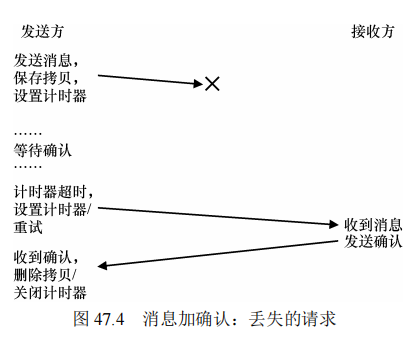

### 第 47 章 分布式系统

分布式系统对现代世界产生了深远影响。通过分布式系统，机器能够共同合作，以在广泛的范围内提供服务。Google、Facebook 等现代网络服务利用大量机器协作提供特定服务，构建这种系统时面临的主要挑战是如何在故障频发的环境下保持系统运行。本章介绍分布式系统的基本原理和主要问题，尤其是通信的可靠性和效率。

#### 原文：

​		分布式系统改变了世界的面貌。当你的 Web 浏览器连接到地球上其他地方的 Web 服务器时，它就会参与似乎是简单形式的客户端/服务器（client/server）分布式系统。当你连上Google 和 Facebook 等现代网络服务时，不只是与一台机器进行交互。在幕后，这些复杂的服务是利用大量机器（成千上万台）来提供的，每台机器相互合作，以提供站点的特定服务。因此，你应该清楚什么让研究分布式系统变得有趣。的确，它值得开一门课。在这里，我们只介绍一些主要议题。

​		构建分布式系统时会出现许多新的挑战。我们关注的主要是故障（failure）。机器、磁盘、网络和软件都会不时故障，因为我们不知道（并且可能永远不知道）如何构建“完美”的组件和系统。但是，构建一个现代的 Web 服务时，我们希望它对客户来说就像永远不会失败一样。怎样才能完成这项任务？


​		有趣的是，虽然故障是构建分布式系统的核心挑战，但它也代表着一个机遇。是的，机器会故障。但是机器故障这一事实并不意味着整个系统必须失败。通过聚集一组机器，我们可以构建一个看起来很少失败的系统，尽管它的组件经常出现故障。这种现实是分布式系统的核心优点和价值，也是为什么它们几乎支持了你使用的所有现代 Web 服务，包括Google、Facebook 等。


​		其他重要问题也存在。系统性能（performance）通常很关键。对于将分布式系统连接在一起的网络，系统设计人员必须经常仔细考虑如何完成给定的任务，尝试减少发送的消息数量，并进一步使通信尽可能高效（低延迟、高带宽）。

​		最后，安全（security）也是必要的考虑因素。连接到远程站点时，确保远程方是他们声称的那些人，这成为一个核心问题。此外，确保第三方无法监听或改变双方之间正在进行的通信，也是一项挑战。

​		本章将介绍分布式系统中最基本的新方面：通信（communication）。也就是说，分布式系统中的机器应该如何相互通信？我们将从可用的最基本原语（消息）开始，并在它们之上构建一些更高级的原语。正如上面所说的，故障将是重点：通信层应如何处理故障？


### 47.1 通信基础

分布式系统的通信本质上是不可靠的。数据包可能在传输过程中丢失、损坏，或无法到达目的地。造成数据包丢失的原因包括：

- **电气问题**：可能导致数据位翻转。
- **组件故障**：如网络链接或数据包路由器损坏。
- **内存不足**：交换机、路由器或终端节点内的缓冲区不足以容纳所有数据包时会丢弃数据包。

由于丢包是网络中的基本现象，分布式系统必须有处理丢包的机制。

#### 原文：

​		现代网络的核心原则是，通信基本是不可靠的。无论是在广域 Internet，还是 Infiniband等局域高速网络中，数据包都会经常丢失、损坏，或无法到达目的地。

​		数据包丢失或损坏的原因很多。有时，在传输过程中，由于电气或其他类似问题，某些位会被翻转。有时，系统中的某个元素（例如网络链接或数据包路由器，甚至远程主机）会以某种方式损坏，或以其他方式无法正常工作。网络电缆确实会意外地被切断，至少有时候。

​		然而，更基本的是由于网络交换机、路由器或终端节点内缺少缓冲，而导致数据包丢失。具体来说，即使我们可以保证所有链路都能正常工作，并且系统中的所有组件（交换机、路由器、终端主机）都按预期启动并运行，仍然可能出现丢失，原因如下。想象一下数据包到达路由器。对于要处理的数据包，它必须放在路由器内某处的内存中。如果许多此类数据包同时到达，则路由器内的内存可能无法容纳所有数据包。此时路由器唯一的选择是丢弃（drop）一个或多个数据包。同样的行为也发生在终端主机上。当你向单台机器发送大量消息时，机器的资源很容易变得不堪重负，从而再次出现丢包现象。

​		因此，丢包是网络的基本现象。所以问题变成：应该如何处理丢包？


### 47.2 不可靠的通信层

一些应用程序可以直接在不可靠的网络上运行。例如，UDP（用户数据报协议）就是一种不可靠的通信层协议。使用 UDP，进程通过套接字 API 创建通信端点，并发送数据报。虽然 UDP 可以快速传输数据，但缺乏可靠性，数据包可能会丢失且发送方无法得知。尽管如此，UDP 仍包含基本的校验和机制来检测部分数据包损坏。

校验和是检测数据完整性的基本手段。通过计算消息的校验和，并在接收方进行比较，可以检测数据在传输过程中的损坏。

#### 原文：

​		一个简单的方法是：我们不处理它。由于某些应用程序知道如何处理数据包丢失，因此让它们用基本的不可靠消息传递层进行通信有时很有用，这是端到端的论点（end-to-end argument）的一个例子，人们经常听到（参见本章结尾处的补充）。这种不可靠层的一个很好的例子，就是几乎所有现代系统中都有的 UDP/IP 网络栈。要使用 UDP，进程使用套接字（socket）API 来创建通信端点（communication endpoint）。其他机器（或同一台机器上）的进程将 UDP 数据报（datagram）发送到前面的进程（数据报是一个固定大小的消息，有最大大小）。

​		图 47.1 和图 47.2 展示了一个基于 UDP/IP 构建的简单客户端和服务器。客户端可以向服务器发送消息，然后服务器响应回复。用这么少的代码，你就拥有了开始构建分布式系统所需的一切！

```
// client code 
int main(int argc, char *argv[]) { 
 int sd = UDP_Open(20000); 
 struct sockaddr_in addr, addr2; 
 int rc = UDP_FillSockAddr(&addr, "machine.cs.wisc.edu", 10000); 
 char message[BUFFER_SIZE]; 
 sprintf(message, "hello world"); 
 rc = UDP_Write(sd, &addr, message, BUFFER_SIZE);
 if (rc > 0) { 
 int rc = UDP_Read(sd, &addr2, buffer, BUFFER_SIZE); 
 } 
 return 0; 
} 
// server code 
int main(int argc, char *argv[]) { 
 int sd = UDP_Open(10000); 
 assert(sd > -1); 
 while (1) { 
 struct sockaddr_in s; 
 char buffer[BUFFER_SIZE]; 
 int rc = UDP_Read(sd, &s, buffer, BUFFER_SIZE); 
 if (rc > 0) { 
 char reply[BUFFER_SIZE]; 
 sprintf(reply, "reply"); 
 rc = UDP_Write(sd, &s, reply, BUFFER_SIZE); 
 } 
 } 
 return 0; 
} 
图 47.1 UDP/IP 客户端/服务器代码示例
```


```
int UDP_Open(int port) { 
 int sd; 
 if ((sd = socket(AF_INET, SOCK_DGRAM, 0)) == -1) { return -1; } 
 struct sockaddr_in myaddr; 
 bzero(&myaddr, sizeof(myaddr)); 
 myaddr.sin_family = AF_INET; 
 myaddr.sin_port = htons(port); 
 myaddr.sin_addr.s_addr = INADDR_ANY; 
 if (bind(sd, (struct sockaddr *) &myaddr, sizeof(myaddr)) == -1) { 
 close(sd); 
 return -1; 
 } 
 return sd; 
} 
int UDP_FillSockAddr(struct sockaddr_in *addr, char *hostName, int port) { 
 bzero(addr, sizeof(struct sockaddr_in)); 
 addr->sin_family = AF_INET; // host byte order 
 addr->sin_port = htons(port); // short, network byte order 
 struct in_addr *inAddr; 
 struct hostent *hostEntry; 
 if ((hostEntry = gethostbyname(hostName)) == NULL) { return -1; } 
 inAddr = (struct in_addr *) hostEntry->h_addr; 
 addr->sin_addr = *inAddr; 
 return 0; 
}
int UDP_Write(int sd, struct sockaddr_in *addr, char *buffer, int n) { 
 int addrLen = sizeof(struct sockaddr_in); 
 return sendto(sd, buffer, n, 0, (struct sockaddr *) addr, addrLen); 
} 
int UDP_Read(int sd, struct sockaddr_in *addr, char *buffer, int n) { 
 int len = sizeof(struct sockaddr_in); 
 return recvfrom(sd, buffer, n, 0, (struct sockaddr *) addr, 
 (socklen_t *) &len); 
 return rc; 
} 
图 47.2 一个简单的 UDP 库
```

​		UDP 是不可靠通信层的一个很好的例子。如果你使用它，就会遇到数据包丢失（丢弃），从而无法到达目的地的情况。发送方永远不会被告知丢失。但是，这并不意味着 UDP 根本不能防止任何故障。例如，UDP 包含校验和（checksum），以检测某些形式的数据包损坏。

​		但是，由于许多应用程序只是想将数据发送到目的地，而不想考虑丢包，所以我们需要更多。具体来说，我们需要在不可靠的网络之上进行可靠的通信。


### 47.3 可靠的通信层

为了在不可靠网络上实现可靠的通信，需要采用 **超时/重试** 机制和 **确认（acknowledgment）**。发送方在发送消息后等待确认，如果未在规定时间内收到确认，发送方将重试发送。

**挑战**：可能发生的数据包丢失不仅包括原始消息丢失，还可能是确认消息丢失，导致接收方重复接收相同的消息。为了解决这个问题，可以采用 **顺序计数器（sequence counter）**：

- 发送方和接收方维护一个计数器，每次发送或接收消息时递增。
- 消息包含一个唯一的 ID，接收方通过 ID 判断是否是重复消息，避免重复处理。

**TCP/IP** 是最广泛使用的可靠通信协议，它通过确认和超时机制实现了可靠数据传输，并处理网络拥塞等问题。

#### 原文：

​		为了构建可靠的通信层，我们需要一些新的机制和技术来处理数据包丢失。考虑一个简单的示例，其中客户端通过不可靠的连接向服务器发送消息。我们必须回答的第一个问题是：发送方如何知道接收方实际收到了消息？

​		我们要使用的技术称为确认（acknowledgment），或简称为 ack。这个想法很简单：发送方向接收方发送消息，接收方然后发回短消息确认收到。图 47.3 描述了该过程。


​		当发送方收到该消息的确认时，它可以放心接收方确实收到了原始消息。但是，如果没有收到确认，发送方应该怎么办？

​		为了处理这种情况，我们需要一种额外的机制，称为超时（timeout）。当发送方发送消息时，发送方现在将计时器设置为在一段时间后关闭。如果在此时间内未收到确认，则发送方断定该消息已丢失。发送方然后就重试（retry）发送，再次发送相同的消息，希望这次它能送达。要让这种方法起作用，发送方必须保留一份消息副本，以防它需要再次发送。超时和重试的组合导致一些人称这种方法为超时/重试（timeout/retry）。非常聪明的一群人，那些搞网络的，不是吗？图 47.4 展示了一个例子。

​		遗憾的是，这种形式的超时/重试还不够。图 47.5 展示了可能导致故障的数据包丢失示例。在这个例子中，丢失的不是原始消息，而是确认消息。从发送方的角度来看，情况似乎是相同的：没有收到确认，因此超时和重试是合适的。但是从接收方的角度来看，完全不同：现在相同的消息收到了两次！虽然可能存在这种情况，但通常情况并非如此。设想下载文件时，在下载过程中重复多个数据包，会发生什么。因此，如果目标是可靠的消息层，我们通常还希望保证接收方每个消息只接收一次（exactly once）。

 


​		为了让接收方能够检测重复的消息传输，发送方必须以某种独特的方式标识每个消息，并且接收方需要某种方式来追踪它是否已经看过每个消息。当接收方看到重复传输时，它只是简单地响应消息，但（严格地说）不会将消息传递给接收数据的应用程序。因此，发送方收到确认，但消息未被接收两次，保证了上面提到的一次性语义。

​		有许多方法可以检测重复的消息。例如，发送方可以为每条消息生成唯一的 ID。接收方可以追踪它所见过的每个 ID。这种方法可行，但它的成本非常高，需要无限的内存来跟踪所有 ID。

​		一种更简单的方法，只需要很少的内存，解决了这个问题，该机制被称为顺序计数器（sequence counter）。利用顺序计数器，发送方和接收方就每一方将维护的计数器的起始值达成一致（例如 1）。无论何时发送消息，计数器的当前值都与消息一起发送。此计数器值（*N*）作为消息的 ID。发送消息后，发送方递增该值（到 *N* + 1）。

​		接收方使用其计数器值，作为发送方传入消息的 ID 的预期值。如果接收的消息（*N*）的 ID 与接收方的计数器匹配（也是 *N*），它将确认该消息，将其传递给上层的应用程序。在这种情况下，接收方断定这是第一次收到此消息。接收方然后递增其计数器（到 *N* + 1），并等待下一条消息。

​		如果确认丢失，则发送方将超时，并重新发送消息 *N*。这次，接收器的计数器更高（*N*+1），因此接收器知道它已经接收到该消息。因此它会确认该消息，但不会将其传递给应用程序。以这种简单的方式，顺序计数器可以避免重复。

​		最常用的可靠通信层称为 TCP/IP，或简称为 TCP。TCP 比上面描述的要复杂得多，包括处理网络拥塞的机制[VJ88]，多个未完成的请求，以及数百个其他的小调整和优化。如果你很好奇，请阅读更多相关信息。参加一个网络课程并很好地学习这些材料，这样更好。


### 47.4 通信抽象

构建分布式系统时，需要选择合适的通信抽象。早期尝试将操作系统抽象扩展到分布式环境，例如 **分布式共享内存（DSM）**，让不同机器上的进程共享一个大的虚拟地址空间。但 DSM 面临两个主要问题：

- **故障处理**：机器故障可能导致地址空间部分丢失，难以恢复。
- **性能问题**：访问远程页面会导致昂贵的远程提取，影响性能。

这些问题使 DSM 难以在实际中广泛应用。

#### 原文：		

​		有了基本的消息传递层，现在遇到了本章的下一个问题：构建分布式系统时，应该使用什么抽象通信？


​		多年来，系统社区开发了许多方法。其中一项工作涉及操作系统抽象，将其扩展到在分布式环境中运行。例如，分布式共享内存（Distributed Shared Memory，DSM）系统使不同机器上的进程能够共享一个大的虚拟地址空间[LH89]。这种抽象将分布式计算变成貌似多线程应用程序。唯一的区别是这些线程在不同的机器上运行，而不是在同一台机器上的不同处理器上。

​		大多数 DSM 系统的工作方式是通过操作系统的虚拟内存系统。在一台计算机上访问页面时，可能会发生两种情况。在第一种（最佳）情况下，页面已经是机器上的本地页面，因此可以快速获取数据。在第二种情况下，页面目前在其他机器上。发生页面错误，页面错误处理程序将消息发送到其他计算机以获取页面，将其装入请求进程的页表中，然后继续执行。

​		由于许多原因，这种方法今天并未广泛使用。DSM 最大的问题是它如何处理故障。例如，想象一下，如果机器出现故障。那台机器上的页面会发生什么？如果分布式计算的数据结构分布在整个地址空间怎么办？在这种情况下，这些数据结构的一部分将突然变得不可用。如果部分地址空间丢失，处理故障会很难。想象一下链表，其中下一个指针指向已经消失的地址空间的一部分。

​		另一个问题是性能。人们通常认为，在编写代码时，访问内存的成本很低。在 DSM 系统中，一些访问是便宜的，但是其他访问导致页面错误和远程机器的昂贵提取。因此，这种 DSM 系统的程序员必须非常小心地组织计算，以便几乎不发生任何通信，从而打败了这种方法的主要出发点。虽然在这个领域进行了大量研究，但实际影响不大。没有人用 DSM构建可靠的分布式系统。


### 47.5 远程过程调用（RPC）

**远程过程调用（RPC）** 是构建分布式系统的关键抽象。RPC 使远程函数调用像本地函数调用一样简单。RPC 系统包括两部分：**存根生成器（stub generator）** 和 **运行时库（run-time library）**。

- **存根生成器**：自动生成客户端和服务器的存根代码，处理函数参数和返回值的序列化（marshaling）和反序列化（unmarshaling），并进行实际的网络通信。
- **运行时库**：处理 RPC 调用的底层细节，包括命名（naming）、消息传输协议选择（如 TCP 或 UDP）等。

RPC 允许客户端发起远程函数调用，服务器处理请求并返回结果。为避免性能损耗，许多 RPC 系统选择构建在 UDP 等不可靠通信层上，自己实现可靠性和序列号机制。

**复杂性处理**：

- 处理长时间运行的 RPC 调用，可以使用显式确认或轮询机制。
- 处理大于单个数据包的参数时，需要分组和重组技术。
- 处理字节序问题（大端序 vs. 小端序），通过明确定义消息格式或使用 XDR 等标准。

**异步 RPC** 提供性能优化选项，允许客户端发起调用后继续执行其他任务，结果可以在稍后请求。


#### 原文：

​		虽然最终结果表明，操作系统抽象对于构建分布式系统来说是一个糟糕的选择，但编 程语言（PL）抽象要有意义得多。最主要的抽象是基于远程过程调用（Remote Procedure Call），或简称 RPC [BN84]①。

​		远程过程调用包都有一个简单的目标：使在远程机器上执行代码的过程像调用本地函数一样简单直接。因此，对于客户端来说，进行一个过程调用，并在一段时间后返回结果。服务器只是定义了一些它希望导出的例程。其余的由 RPC 系统处理，RPC 系统通常有两部分：存根生成器（stub generator，有时称为协议编译器，protocol compiler）和运行时库（run-time library）。接下来将更详细地介绍这些部分。

##### 存根生成器 

​		存根生成器的工作很简单：通过自动化，消除将函数参数和结果打包成消息的一些痛苦。这有许多好处：通过设计避免了手工编写此类代码时出现的简单错误。此外，存根生成器也许可以优化此类代码，从而提高性能。

​		这种编译器的输入就是服务器希望导出到客户端的一组调用。从概念上讲，它可能就像这样简单：

```
interface { 
 int func1(int arg1); 
 int func2(int arg1, int arg2); 
};
```

​		存根生成器接受这样的接口，并生成一些不同的代码片段。对于客户端，生成客户端存根（client stub），其中包含接口中指定的每个函数。希望使用此 RPC 服务的客户端程序将链接此客户端存根，调用它以进行 RPC。

​		在内部，客户端存根中的每个函数都执行远程过程调用所需的所有工作。对于客户端，代码只是作为函数调用出现（例如，客户端调用 func1(x)）。在内部，func1()的客户端存根中的代码执行此操作：

- 创建消息缓冲区。消息缓冲区通常只是某种大小的连续字节数组。

-   将所需信息打包到消息缓冲区中。该信息包括要调用的函数的某种标识符，以及函数所需的所有参数（例如，在上面的示例中，func1 需要一个整数）。将所有这些信息放入单个连续缓冲区的过程，有时被称为参数的封送处理（marshaling）或消息的序列化（serialization）。

- 将消息发送到目标 **RPC** 服务器。与 RPC 服务器的通信，以及使其正常运行所需的所有细节，都由 RPC 运行时库处理，如下所述。

-   等待回复。由于函数调用通常是同步的（synchronous），因此调用将等待其完成。

-   解包返回代码和其他参数。如果函数只返回一个返回码，那么这个过程很简单。但是，较复杂的函数可能会返回更复杂的结果（例如，列表），因此存根可能也需要对它们解包。此步骤也称为解封送处理（unmarshaling）或反序列化（deserialization）。

-   返回调用者。最后，只需从客户端存根返回到客户端代码。对于服务器，也会生成代码。在服务器上执行的步骤如下：

-   解包消息。此步骤称为解封送处理（unmarshaling）或反序列化（deserialization），将信息从传入消息中取出。提取函数标识符和参数。

-   调用实际函数。终于，我们到了实际执行远程函数的地方。RPC 运行时调用 ID 指定的函数，并传入所需的参数。

-   打包结果。返回参数被封送处理，放入一个回复缓冲区。

-   发送回复。回复最终被发送给调用者。

​		在存根编译器中还有一些其他重要问题需要考虑。第一个是复杂的参数，即一个包如何发送复杂的数据结构？例如，调用 write()系统调用时，会传入 3 个参数：一个整数文件描述符，一个指向缓冲区的指针，以及一个大小，指示要写入多少字节（从指针开始）。如果向RPC 包传入了一个指针，它需要能够弄清楚如何解释该指针，并执行正确的操作。通常，这是通过众所周知的类型（例如，用于传递给定大小的数据块的缓冲区 t，RPC 编译器可以理解），或通过使用更多信息注释数据结构来实现的，从而让编译器知道哪些字节需要序列化。

​		另一个重要问题是关于并发性的服务器组织方式。一个简单的服务器只是在一个简单的循环中等待请求，并一次处理一个请求。但是，你可能已经猜到，这可能非常低效。如果一个 RPC 调用阻塞（例如，在 I/O 上），就会浪费服务器资源。因此，大多数服务器以某种并发方式构造。常见的组织方式是线程池（thread pool）。在这种组织方式中，服务器启动时会创建一组有限的线程。消息到达时，它被分派给这些工作线程之一，然后执行 RPC调用的工作，最终回复。在此期间，主线程不断接收其他请求，并可能将其发送给其他工作线程。这样的组织方式支持服务器内并发执行，从而提高其利用率。标准成本也会出现，主要是编程复杂性，因为 RPC 调用现在可能需要使用锁和其他同步原语来确保它们的正确运行。


##### 运行时库 

​		运行时库处理 RPC 系统中的大部分繁重工作。这里处理大多数性能和可靠性问题。接下来讨论构建此类运行时层的一些主要挑战。

​		我们必须克服的首要挑战之一，是如何找到远程服务。这个命名（naming）问题在分布式系统中很常见，在某种意义上超出了我们当前讨论的范围。最简单的方法建立在现有命名系统上，例如，当前互联网协议提供的主机名和端口号。在这样的系统中，客户端必须知道运行所需 RPC 服务的机器的主机名或 IP 地址，以及它正在使用的端口号（端口号就是在机器上标识发生的特定通信活动的一种方式，允许同时使用多个通信通道）。然后，协议套件必须提供一种机制，将数据包从系统中的任何其他机器路由到特定地址。有关命名的详细讨论，请阅读 Grapevine 的论文，或关于互联网上的 DNS 和名称解析，或者阅读 Saltzer和 Kaashoek 的书[SK09]中的相关章节，这样更好。

​		一旦客户端知道它应该与哪个服务器通信，以获得特定的远程服务，下一个问题是应该构建 RPC 的传输级协议。具体来说，RPC 系统应该使用可靠的协议（如 TCP/IP），还是建立在不可靠的通信层（如 UDP/IP）上？

​		天真的选择似乎很容易：显然，我们希望将请求可靠地传送到远程服务器，显然，我们希望能够可靠地收到回复。因此，我们应该选择 TCP 这样的可靠传输协议，对吗？

​		遗憾的是，在可靠的通信层之上构建 RPC 可能会导致性能的低效率。回顾上面的讨论，可靠的通信层如何工作：确认和超时/重试。因此，当客户端向服务器发送 RPC 请求时，服务器以确认响应，以便调用者知道收到了请求。类似地，当服务器将回复发送到客户端时，客户端会对其进行确认，以便服务器知道它已被接收。在可靠的通信层之上构建请求/响应协议（例如 RPC），必须发送两个“额外”消息。

​		因此，许多 RPC 软件包都建立在不可靠的通信层之上，例如 UDP。这样做可以实现更高效的 RPC 层，但确实增加了为 RPC 系统提供可靠性的责任。RPC 层通过使用超时/重试和确认来实现所需的责任级别，就像我们上面描述的那样。通过使用某种形式的序列编号，通信层可以保证每个 RPC 只发生一次（在没有故障的情况下），或者最多只发生一次（在发生故障的情况下）。


其他问题 

​		还有一些其他问题，RPC 的运行时也必须处理。例如，当远程调用需要很长时间才能完成时，会发生什么？鉴于我们的超时机制，长时间运行的远程调用可能被客户端认为是故障，从而触发重试，因此需要小心。一种解决方案是在没有立即生成回复时使用显式确认（从接收方到发送方）。这让客户端知道服务器收到了请求。然后，经过一段时间后，客户端可以定期询问服务器是否仍在处理请求。如果服务器一直说“是”，客户端应该感到高兴并继续等待（毕竟，有时过程调用可能需要很长时间才能完成执行）。

​		运行时还必须处理具有大参数的过程调用，大于可以放入单个数据包的过程。一些底层的网络协议提供这样的发送方分组（fragmentation，较大的包分成一组较小的包）和接收方重组（reassembly，较小的部分组成一个较大的逻辑整体）。如果没有，RPC 运行时可能必须自己实现这样的功能。有关详细信息，请参阅 Birrell 和 Nelson 的优秀 RPC 论文[BN84]。

​		许多系统要处理的一个问题是字节序（byte ordering）。你可能知道，有些机器存储值时采用所谓的大端序（big endian），而其他机器采用小端序（little endian）。大端序存储从最高有效位到最低有效位的字节（比如整数），非常像阿拉伯数字。小端序则相反。两者对存储数字信息同样有效。这里的问题是如何在不同字节序的机器之间进行通信。


​		RPC 包通常在其消息格式中提供明确定义的字节序，从而处理该问题。在 Sun 的 RPC包中，XDR（eXternal Data Representation，外部数据表示）层提供此功能。如果发送或接收消息的计算机与 XDR 的字节顺序匹配，就会按预期发送和接收消息。但是，如果机器通信具有不同的字节序，则必须转换消息中的每条信息。因此，字节顺序的差异可以有一点性能成本。

​		最后一个问题是：是否向客户端暴露通信的异步性质，从而实现一些性能优化。具体来说，典型的 RPC 是同步（synchronously）的，即当客户端发出过程调用时，它必须等待过程调用返回，然后再继续。因为这种等待可能很长，而且因为客户端可能正在执行其他工作，所以某些 RPC 包让你能够异步（asynchronously）地调用 RPC。当发出异步 RPC 时，RPC 包发送请求并立即返回。然后，客户端可以自由地执行其他工作，例如调用其他 RPC，或进行其他有用的计算。客户端在某些时候会希望看到异步 RPC 的结果。因此它再次调用RPC 层，告诉它等待未完成的 RPC 完成，此时可以访问返回的结果。

### 47.6 小结

分布式系统通过处理常见的故障来提供高可用性。通信是分布式系统的核心，远程过程调用（RPC）为开发者提供了方便的编程抽象，使得在远程机器上执行代码与本地调用无异。RPC 包的实现需要解决命名、可靠性、性能和字节序等复杂问题，但其灵活性和简化的接口使得分布式系统的开发更加便捷和高效。