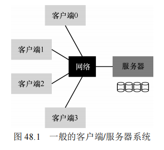
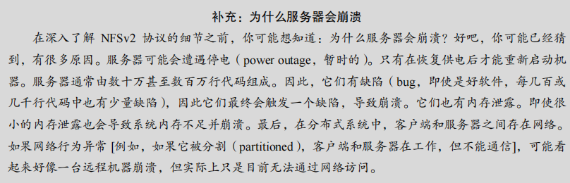

## 第 48 章 Sun 的网络文件系统（NFS）

分布式文件系统首次实现分布式客户端/服务器计算，允许多个客户端共享存储在服务器上的数据。Sun 的网络文件系统（NFS）是早期分布式文件系统的成功案例之一，它采用了无状态协议来简化服务器崩溃恢复，并实现了基本的文件共享和集中管理。

#### 原文：

​		分布式客户端/服务器计算的首次使用之一，是在分布式文件系统领域。在这种环境中，有许多客户端机器和一个服务器（或几个）。服务器将数据存储在其磁盘上，客户端通过结构良好的协议消息请求数据。图 48.1 展示了基本设置。

​		从图中可以看到，服务器有磁盘，发送消息的客户端通过网络，访问服务器磁盘上的目录和文件。为什么要麻烦，采用这种安排？（也就是说，为什么不就让客户端用它们的本地磁盘? ）好吧，这种设置允许在客户端之间轻松地共享（sharing）数据。因此，如果你在一台计算机上访问文件（客户端 0），然后再使用另一台（客户端 2），则你将拥有相同的文件系统视图。你可以在这些不同的机器上自然共享你的数据。第二个好处是集中管理（centralized administration）。例如，备份文件可以通过少数服务器机器完成，而不必通过众多客户端。另一个优点可能是安全（security），将所有服务器放在加锁的机房中。

### 48.1 基本分布式文件系统

在分布式文件系统中，客户端通过客户端文件系统访问服务器上的文件和目录。客户端应用程序调用系统接口（如 `open()`、`read()`、`write()`、`close()`），客户端文件系统负责将这些调用转换为请求并与服务器通信。分布式文件系统的核心目标是提供透明的文件访问，客户端操作应该看起来像本地文件系统操作一样。

客户端文件系统在内存中缓存从服务器读取的数据，从而减少网络流量。这种缓存机制可以显著提高系统性能，尤其是在频繁访问同一数据时。

#### 原文：

​		我们将研究分布式文件系统的体系结构。简单的客户端/服务器分布式文件系统，比之前研究的文件系统拥有更多的组件。在客户端，客户端应用程序通过客户端文件系统（client-side file system）来访问文件和目录。客户端应用程序向客户端文件系统发出系统调用（system call，例如 open()、read()、write()、close()、mkdir()等），以便访问保存在服务器上的文件。因此，对于客户端应用程序，该文件系统似乎与基于磁盘的文件系统没有任何不同，除了性能之外。这样，分布式文件系统提供了对文件的透明（transparent）访问，这是一个明显的目标。毕竟，谁想使用文件系统时需要不同的 API，或者用起来很痛苦？

​		客户端文件系统的作用，是执行服务这些系统调用所需的操作如图 48.2 所示。例如，如果客户端发出 read()请求，则客户端文件系统可以向服务器端文件系统（server-side file system，或更常见的是文件服务器，file server）发送消息，以读取特定块。然后，文件服务器将从磁盘（或自己的内存缓存）中读取块，并发送消息，将请求的数据发送回客户端。然后，客户端文件系统将数据复制到用户的缓冲区中。请注意，客户端内存或客户端磁盘上的后续 read()可以缓存（cached）在客户端内存中，在最好的情况下，不需要产生网络流量。

​		通过这个简单的概述，你应该了解客户端/服务器分布式文件系统中两个最重要的软件部分：客户端文件系统和文件服务器。它们的行为共同决定了分布式文件系统的行为。现在可以研究一个特定的系统：Sun 的网络文件系统（NFS）。

### 48.2 Sun 的网络文件系统（NFS）

NFS 是 Sun Microsystems 开发的分布式文件系统。NFS 的一个关键特性是采用开放协议，这使得不同的开发团队可以构建兼容的 NFS 服务器。NFS 通过定义明确的客户端和服务器通信消息格式，确保不同实现之间的互操作性。

#### 原文：

最早且相当成功的分布式系统之一是由 Sun Microsystems 开发的，被称为 Sun 网络文件

系统（或 NFS）[S86]。在定义 NFS 时，Sun 采取了一种不寻常的方法：Sun 开发了一种开

放协议（open protocol），它只是指定了客户端和服务器用于通信的确切消息格式，而不是

构建专有的封闭系统。不同的团队可以开发自己的 NFS 服务器，从而在 NFS 市场中竞争，

同时保持互操作性。NFS 服务器（包括 Oracle/Sun、NetApp [HLM94]、EMC、IBM 等）和

NFS 的广泛成功可能要归功于这种“开放市场”的做法。

### 48.3 服务器崩溃恢复

NFSv2 的设计目标是实现简单且快速的服务器崩溃恢复。这通过无状态协议来实现：服务器不会追踪客户端的状态，例如缓存哪些块、哪些文件打开、文件指针位置等。这种设计让服务器在崩溃后能够快速恢复，而不需要复杂的恢复协议。

### 48.4 无状态协议的实现

无状态协议意味着每个协议请求都必须包含所有完成请求所需的信息。例如，`read()` 请求必须指定要读取的文件句柄、偏移量和字节数。无状态的好处是，服务器可以随时重新启动，不需要跟踪客户端状态，也不需要复杂的崩溃恢复机制。

### 48.5 NFSv2 协议

NFSv2 协议使用 **文件句柄** 来唯一标识文件或目录。文件句柄包含卷标识符、inode 号和世代号，这三项组合唯一标识一个文件。NFSv2 的协议定义了一系列无状态操作，包括：

- `LOOKUP`：用于查找目录中的文件或目录并返回其句柄。
- `READ` 和 `WRITE`：用于读取或写入文件内容。
- `GETATTR`：获取文件的属性信息。

每个协议操作都包含完成请求所需的所有信息，从而确保服务器无状态。

### 48.6 从协议到分布式文件系统

客户端文件系统追踪文件访问的相关状态，并将应用程序的系统调用转换为协议消息。例如，打开文件时，客户端发送 `LOOKUP` 请求获取文件句柄，然后通过该句柄执行 `READ` 或 `WRITE` 操作。所有请求都通过服务器执行，无需服务器追踪客户端状态。

### 48.7 利用幂等操作处理服务器故障

NFSv2 的幂等性允许客户端在请求失败时简单地重试。大多数 NFS 操作都是幂等的，例如 `READ`、`LOOKUP` 和 `WRITE`。例如，`WRITE` 请求包含确切的偏移量和数据，即使多次执行也会产生相同的结果。利用幂等性，客户端可以安全地处理网络丢包或服务器崩溃。

### 48.8 提高性能：客户端缓存

为了提高性能，NFS 客户端在内存中缓存文件数据和元数据。这种缓存减少了对服务器的请求频率，从而改善了文件访问性能。此外，客户端可以暂时缓存写入数据，延迟将其发送到服务器。然而，这引入了缓存一致性问题。

### 48.9 缓存一致性问题

缓存一致性问题在多个客户端和一个服务器的环境中特别明显。例如，当客户端 C1 读取文件并缓存，另一个客户端 C2 修改该文件时，C1 的缓存可能会变得陈旧（stale）。NFS 通过两种方式解决这一问题：

1. **关闭时刷新**：客户端在关闭文件时将缓存数据写入服务器，确保其他客户端在打开文件时看到最新数据。
2. **GETATTR 请求**：客户端通过 GETATTR 请求验证文件属性是否发生更改，如果发现文件已更新则使缓存无效。

为了优化性能，NFS 客户端引入了属性缓存，在一定时间内避免频繁的 GETATTR 请求。

### 48.10 NFS 缓存一致性的评价

虽然 NFS 通过关闭时刷新和属性缓存处理了大部分一致性问题，但仍可能发生不一致现象。例如，客户端可能会在短暂文件操作后立即删除文件，但关闭时刷新的语义会导致数据被强制写入服务器，降低了性能。

### 48.11 服务器端写缓冲的隐含意义

NFS 服务器缓存读取的数据和元数据，并且在通知客户端写入成功前，必须将写入数据提交到稳定存储（例如磁盘）。如果服务器在数据提交到磁盘前崩溃，则会导致数据丢失或不一致。为了避免这种问题，NFS 服务器需要谨慎处理写缓冲。

### 48.12 小结

NFS 通过无状态设计实现了简单且快速的服务器崩溃恢复。幂等操作使得客户端可以处理多种故障情况，客户端缓存提高了性能但引入了缓存一致性问题。NFS 的设计提供了一个平衡的解决方案，在保证性能的同时尽量减少一致性问题。此外，NFS 的开放协议设计促成了其广泛使用和多样化实现。