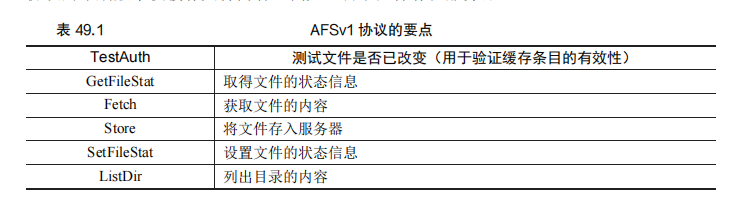
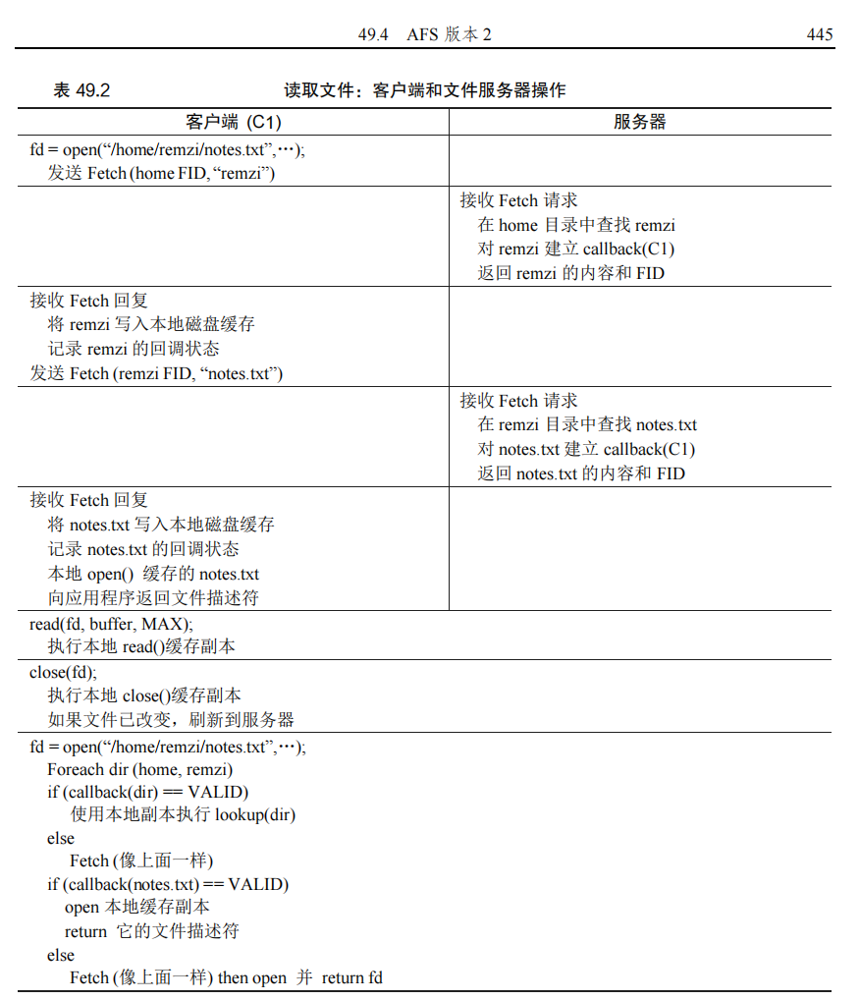
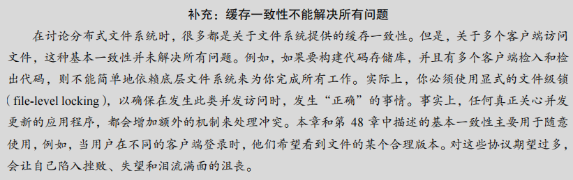
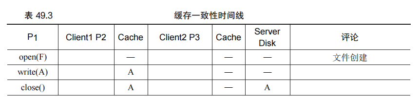
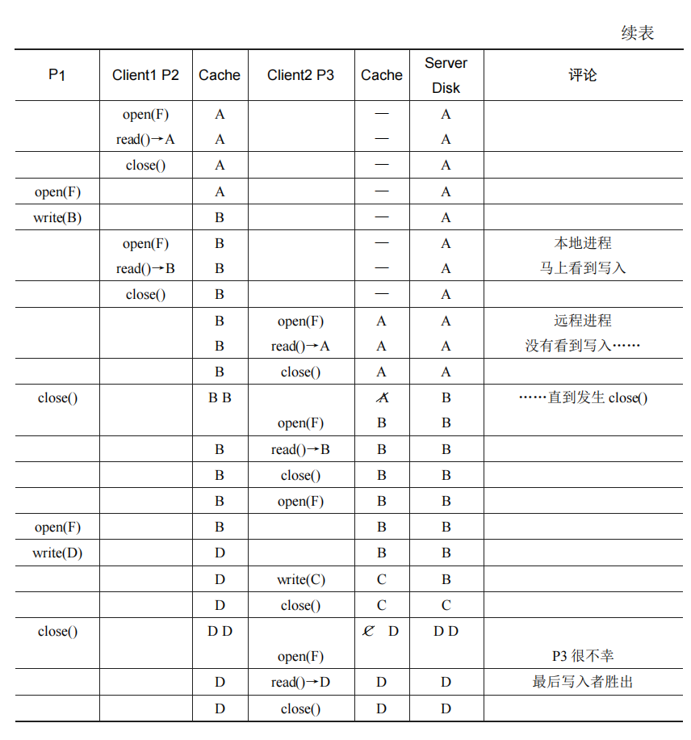
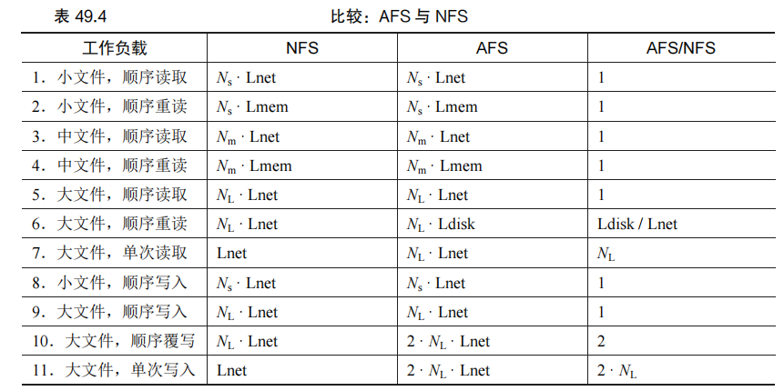
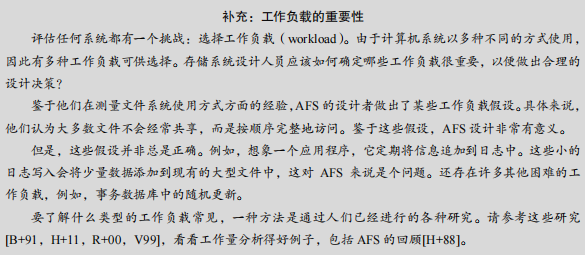

## 第 49 章 Andrew 文件系统（AFS）

Andrew 文件系统（AFS）是由卡内基梅隆大学（CMU）的研究人员于 20 世纪 80 年代开发的，旨在实现大规模的分布式文件系统，其主要目标是扩展性。AFS 与 NFS 在设计理念和实现细节上有显著差异，尤其是在缓存机制和一致性模型方面。

### 49.1 AFS 版本 1

AFS 的第一个版本（AFSv1）采用全文件缓存（whole-file caching）机制，客户端在本地磁盘上缓存完整文件。当客户端打开文件时，它会从服务器获取整个文件并存储在本地磁盘，所有后续的 `read()` 和 `write()` 操作都在本地进行，不需要网络通信。文件在 `close()` 时如果被修改，会被写回服务器。这种机制显著减少了对服务器的依赖，但也存在一些问题：

1. **路径查找成本高**：每次 Fetch 或 Store 请求都需要服务器遍历完整路径，导致服务器负载过高。
2. **频繁的状态验证**：AFSv1 通过 TestAuth 消息频繁检查缓存是否有效，这与 NFS 的 GETATTR 请求类似，造成服务器负载增加。

这些问题影响了 AFS 的可扩展性，每台服务器只能支持大约 20 个客户端。

#### 原文：

​		我们将讨论两个版本的 AFS [H+88，S+85]。第一个版本（我们称之为 AFSv1，但实际上原来的系统被称为 ITC 分布式文件系统[S+85]）已经有了一些基本的设计，但没有像期望那样可扩展，这导致了重新设计和最终协议（我们称之为 AFSv2，或就是 AFS）[H+88]。现在讨论第一个版本。

​		所有 AFS 版本的基本原则之一，是在访问文件的客户端计算机的本地磁盘（local disk）上，进行全文件缓存（whole-file caching）。当 open()文件时，将从服务器获取整个文件（如果存在），并存储在本地磁盘上的文件中。后续应用程序 read()和 write()操作被重定向到存储文件的本地文件系统。因此，这些操作不需要网络通信，速度很快。最后，在 close()时，文件（如果已被修改）被写回服务器。注意，与 NFS 的明显不同，NFS 缓存块（不是整个文件，虽然 NFS 当然可以缓存整个文件的每个块），并且缓存在客户端内存（不是本地磁盘）中。

​		让我们进一步了解细节。当客户端应用程序首次调用 open()时，AFS 客户端代码（AFS设计者称之为 Venus）将向服务器发送 Fetch 协议消息。Fetch 协议消息会将所需文件的整个路径名（例如/home/remzi/notes.txt）传递给文件服务器（它们称为 Vice 的组），然后将沿着路径名，查找所需的文件，并将整个文件发送回客户端。然后，客户端代码将文件缓存在客户端的本地磁盘上（将它写入本地磁盘）。如上所述，后续的 read()和 write()系统调用在AFS中是严格本地的（不与服务器进行通信）。它们只是重定向到文件的本地副本。因为read()和 write()调用就像调用本地文件系统一样，一旦访问了一个块，它也可以缓存在客户端内存中。因此，AFS 还使用客户端内存来缓存它在本地磁盘中的块副本。最后，AFS 客户端完成后检查文件是否已被修改（即它被打开并写入）。如果被修改，它会用 Store 协议消息，将新版本刷写回服务器，将整个文件和路径名发送到服务器以进行持久存储。

​		下次访问该文件时，AFSv1 的效率会更高。具体来说，客户端代码首先联系服务器（使用 TestAuth 协议消息），以确定文件是否已更改。如果未更改，客户端将使用本地缓存的副本，从而避免了网络传输，提高了性能。表 49.1 展示了 AFSv1 中的一些协议消息。请注意，协议的早期版本仅缓存文件内容。例如，目录只保存在服务器上。

### 49.2 版本1的问题

#### 原文：

​		第一版 AFS 的一些关键问题，促使设计人员重新考虑他们的文件系统。为了详细研究这些问题，AFS 的设计人员花费了大量时间来测量他们已有的原型，以找出问题所在。这样的实验是一件好事。测量（measurement）是理解系统如何工作，以及如何改进系统的关键。实际数据有助于取代直觉，让解构系统成为具体的科学。在他们的研究中，作者发现了 AFSv1 的两个主要问题。

- 路径查找成本过高。执行 Fetch 或 Store 协议请求时，客户端将整个路径名（例如/home/remzi/notes.txt）传递给服务器。为了访问文件，服务器必须执行完整的路径名遍历，首先查看根目录以查找 home，然后在 home 中查找 remzi，依此类推，一直沿着路径直到最终定位所需的文件。由于许多客户端同时访问服务器，AFS 的设计人员发现服务器花费了大量的 CPU 时间，只是在沿着目录路径走。

- 路径查找成本过高。执行 Fetch 或 Store 协议请求时，客户端将整个路径名（例如/home/remzi/notes.txt）传递给服务器。为了访问文件，服务器必须执行完整的路径名遍历，首先查看根目录以查找 home，然后在 home 中查找 remzi，依此类推，一直沿着路径直到最终定位所需的文件。由于许多客户端同时访问服务器，AFS 的设计人员发现服务器花费了大量的 CPU 时间，只是在沿着目录路径走。

- AFSv1 实际上还存在另外两个问题：服务器之间的负载不均衡，服务器对每个客户端使用一个不同的进程，从而导致上下文切换和其他开销。通过引入卷（volume），解决了负载不平衡问题。管理员可以跨服务器移动卷，以平衡负载。通过使用线程而不是进程构建服务器，在 AFSv2 中解决了上下文切换问题。但是，限于篇幅，这里集中讨论上述主要的两个协议问题，这些问题限制了系统的扩展。

### 49.3 改进协议

#### 原文：

​		上述两个问题限制了 AFS 的可扩展性。服务器 CPU 成为系统的瓶颈，每个服务器只能服务 20 个客户端而不会过载。服务器收到太多的 TestAuth 消息，当他们收到 Fetch 或 Store消息时，花费了太多时间查找目录层次结构。因此，AFS 设计师面临一个问题。

### 49.2 AFS 版本 2

AFSv2 通过引入 **回调（callback）** 机制和 **文件标识符（FID）** 改进了协议设计：

1. **回调机制**：服务器会在客户端缓存文件时记录一个回调，当文件在服务器端发生更改时通知客户端。这减少了客户端对服务器的频繁查询。
2. **文件标识符（FID）**：AFS 使用 FID 而不是路径名来标识文件，减少了路径查找的开销。客户端在首次访问时逐步获取目录和文件，并建立相应的回调，以减少后续访问中的服务器交互。

AFSv2 的这些改进大幅提升了可扩展性，每台服务器可以支持约 50 个客户端，同时保持性能接近本地文件系统。

#### 原文：

​		AFSv2 引入了回调（callback）的概念，以减少客户端/服务器交互的数量。回调就是服务器对客户端的承诺，当客户端缓存的文件被修改时，服务器将通知客户端。通过将此状态（state）添加到服务器，客户端不再需要联系服务器，以查明缓存的文件是否仍然有效。实际上，它假定文件有效，直到服务器另有说明为止。这里类似于轮询（polling）与中断（interrupt）。

​		AFSv2 还引入了文件标识符（File Identifier，FID）的概念（类似于 NFS 文件句柄），替代路径名，来指定客户端感兴趣的文件。AFS 中的 FID 包括卷标识符、文件标识符和“全局唯一标识符”（用于在删除文件时复用卷和文件 ID）。因此，不是将整个路径名发送到服务器，并让服务器沿着路径名来查找所需的文件，而是客户端会沿着路径名查找，每次一个，缓存结果，从而有望减少服务器上的负载。

​		例如，如果客户端访问文件/home/remzi/notes.txt，并且 home 是挂载在/上的 AFS 目录（即/是本地根目录，但 home 及其子目录在 AFS 中），则客户端将先获取 home 的目录内容，将它们放在本地磁盘缓存中，然后在 home 上设置回调。然后，客户端将获取目录 remzi，将其放入本地磁盘缓存，并在服务器上设置 remzi 的回调。最后，客户端将获取 notes.txt，将此常规文件缓存在本地磁盘中，设置回调，最后将文件描述符返回给调用应用程序。有关摘要，参见表 49.2。

​		然而，与 NFS 的关键区别在于，每次获取目录或文件时，AFS 客户端都会与服务器建立回调，从而确保服务器通知客户端，其缓存状态发生变化。好处是显而易见的：尽管第一次访问/home/remzi/notes.txt 会生成许多客户端—服务器消息（如上所述），但它也会为所有目录以及文件 notes.txt 建立回调，因此后续访问完全是本地的，根本不需要服务器交互。因此，在客户端缓存文件的常见情况下，AFS 的行为几乎与基于本地磁盘的文件系统相同。如果多次访问一个文件，则第二次访问应该与本地访问文件一样快。

### 49.5 缓存一致性

AFS 提供了简单易懂的缓存一致性模型：

- **不同机器上的进程**：当一个客户端写入文件并关闭时，服务器更新文件并通知所有缓存了该文件的客户端，使其缓存无效。后续打开请求将获取最新的文件版本。
- **同一机器上的进程**：写入操作对本地进程立即可见，不需要等到文件关闭。

AFS 采用“最后写入者胜出”策略处理跨机器的并发写入，即最后一个关闭文件的客户端的更改将保留在服务器上。

#### 原文：

​		讨论 NFS 时，我们考虑了缓存一致性的两个方面：更新可见性（update visibility）和缓存陈旧（cache staleness）。对于更新可见性，问题是：服务器何时用新版本的文件进行更新？对于缓存陈旧，问题是：一旦服务器有新版本，客户端看到新版本而不是旧版本缓存副本，需要多长时间？

​		由于回调和全文件缓存，AFS 提供的缓存一致性易于描述和理解。有两个重要的情况需要考虑：不同机器上进程的一致性，以及同一台机器上进程的一致性。在不同的计算机之间，AFS 让更新在服务器上可见，并在同一时间使缓存的副本无效，即在更新的文件被关闭时。客户端打开一个文件，然后写入（可能重复写入）。当它最终关闭时，新文件被刷新到服务器（因此可见）。然后，服务器中断任何拥有缓存副本的客户端的回调，从而确保客户端不再读取文件的过时副本。在这些客户端上的后续打开，需要从服务器重新获取该文件的新版本。

​		对于这个简单模型，AFS 对同一台机器上的不同进程进行了例外处理。在这种情况下，对文件的写入对于其他本地进程是立即可见的（进程不必等到文件关闭，就能查看其最新更新版本）。这让使用单个机器完全符合你的预期，因为此行为基于典型的 UNIX 语义。只有切换到不同的机器时，你才会发现更一般的 AFS 一致性机制。

​		有一个有趣的跨机器场景值得进一步讨论。具体来说，在极少数情况下，不同机器上的进程会同时修改文件，AFS 自然会采用所谓的“最后写入者胜出”方法（last writer win，也许应该称为“最后关闭者胜出”，last closer win）。具体来说，无论哪个客户端最后调用close()，将最后更新服务器上的整个文件，因此将成为“胜出”文件，即保留在服务器上，供其他人查看。结果是文件完全由一个客户端或另一个客户端生成。请注意与基于块的协议（如 NFS）的区别：在 NFS 中，当每个客户端更新文件时，可能会将各个块的写入刷新到服务器，因此服务器上的最终文件最终可能会混合为来自两个客户的更新。在许多情况下，这样的混合文件输出没有多大意义，例如，想象一个 JPEG 图像被两个客户端分段修改，导致的混合写入不太可能构成有效的 JPEG。

​		在表 49.3 中可以看到，展示其中一些不同场景的时间线。这些列展示了 Client1 上的两个进程（P1 和 P2）的行为及其缓存状态，Client2 上的一个进程（P3）及其缓存状态，以及服务器（Server），它们都在操作一个名为的 F 文件。对于服务器，该表只展示了左边的操作完成后该文件的内容。仔细查看，看看你是否能理解每次读取的返回结果的原因。如果想不通，右侧的“评论”字段对你会有所帮助。

### 49.6 崩溃恢复

AFS 的崩溃恢复机制比 NFS 更为复杂。由于服务器保存回调信息，如果客户端或服务器崩溃，可能会丢失这些状态。为此，客户端需要在重新连接服务器时验证其缓存的有效性，并在服务器崩溃后重新验证所有缓存的文件。

#### 原文：

​		从上面的描述中，你可能会感觉，崩溃恢复比 NFS 更复杂。你是对的。例如，假设有一小段时间，服务器（S）无法联系客户端（C1），比方说，客户端 C1 正在重新启动。当 C1 不可用时，S 可能试图向它发送一个或多个回调撤销消息。例如，假设 C1 在其本地磁盘上缓存了文件 F，然后 C2（另一个客户端）更新了 F，从而导致 S 向缓存该文件的所有客户端发送消息，以便将它从本地缓存中删除。因为 C1 在重新启动时可能会丢失这些关键消息，所以在重新加入系统时，C1 应该将其所有缓存内容视为可疑。因此，在下次访问文件 F 时，C1 应首先向服务器（使用 TestAuth 协议消息）询问，其文件 F 的缓存副本是否仍然有效。如果是这样，C1 可以使用它。如果不是，C1 应该从服务器获取更新的版本。

​		崩溃后服务器恢复也更复杂。问题是回调被保存在内存中。因此，当服务器重新启动时，它不知道哪个客户端机器具有哪些文件。因此，在服务器重新启动时，服务器的每个客户端必须意识到服务器已崩溃，并将其所有缓存内容视为可疑，并且（如上所述）在使用之前重新检查文件的有效性。因此，服务器崩溃是一件大事，因为必须确保每个客户端及时了解崩溃，或者冒着客户端访问陈旧文件的风险。有很多方法可以实现这种恢复。例如，让服务器在每个客户端启动并再次运行时向每个客户端发送消息（说“不要信任你的缓存内容！”），或让客户端定期检查服务器是否处于活动状态（利用心跳（heartbeat）消息，正如其名）。如你所见，构建更具可扩展性和合理性的缓存模型需要付出代价。使用 NFS，客户端很少注意到服务器崩溃。

### 49.7 AFSv2的扩展性和性能

AFSv2 通过减少服务器交互和改进协议设计，提升了性能和扩展性。其性能在大多数情况下接近本地文件系统，尤其在缓存命中率高的场景下表现尤为出色。相比之下，NFS 的性能依赖于网络访问，尤其在多次读取大文件时，AFS 的磁盘缓存优势更加明显。

AFS 的设计假设大多数文件按顺序完整访问，并且文件共享不频繁。尽管在某些特定工作负载下 AFS 可能表现不佳，但在大多数常见使用场景中，它都优于 NFS。

#### 原文：

​		有了新协议，人们对 AFSv2 进行了测量，发现它比原来的版本更具可扩展性。实际上，每台服务器可以支持大约 50 个客户端（而不是仅仅 20 个）。另一个好处是客户端性能通常非常接近本地性能，因为在通常情况下，所有文件访问都是本地的。文件读取通常转到本地磁盘缓存（可能还有本地内存）。只有当客户端创建新文件或写入现有文件时，才需要向服务器发送 Store 消息，从而用新内容更新文件。

​		对于常见的文件系统访问场景，通过与 NFS 进行比较，可以对 AFS 的性能有所了解。表 49.4 展示了定性比较的结果。

​		在表中，我们分析了不同大小的文件的典型读写模式。小文件中有 *N*S块，中等文件有*N*M个块，大文件有 *N*L 块。假设中小型文件可以放入客户端的内存，大文件可以放入本地磁盘，但不能放入客户端内存。

​		为了便于分析，我们还假设，跨网络访问远程服务器上的文件块，需要的时间为 *L*net。访问本地内存需要 *L*mem，访问本地磁盘需要 *L*disk。一般假设是 *L*net > *L*disk > *L*mem。

​		最后，我们假设第一次访问文件没有任何缓存命中。如果相关高速缓存具有足够容量来保存文件，则假设后续文件访问（即“重新读取”）将在高速缓存中命中。

​		该表的列展示了特定操作（例如，小文件顺序读取）在 NFS 或 AFS 上的大致时间。最右侧的列展示了 AFS 与 NFS 的比值。

​		我们有以下观察结果。首先，在许多情况下，每个系统的性能大致相当。例如，首次读取文件时（即工作负载 1、3、5），从远程服务器获取文件的时间占主要部分，并且两个系统上差不多。在这种情况下，你可能会认为 AFS 会更慢，因为它必须将文件写入本地磁盘。但是，这些写入由本地（客户端）文件系统缓存来缓冲，因此上述成本可能不明显。同样，你可能认为从本地缓存副本读取 AFS 会更慢，因为 AFS 会将缓存副本存储在磁盘上。但是，AFS 再次受益于本地文件系统缓存。读取 AFS 可能会命中客户端内存缓存，性能与 NFS 类似。

​		其次，在大文件顺序重新读取时（工作负载 6），出现了有趣的差异。由于 AFS 具有大型本地磁盘缓存，因此当再次访问该文件时，它将从磁盘缓存中访问该文件。相反，NFS只能在客户端内存中缓存块。结果，如果重新读取大文件（即比本地内存大的文件），则 NFS客户端将不得不从远程服务器重新获取整个文件。因此，假设远程访问确实比本地磁盘慢，AFS 在这种情况下比 NFS 快一倍。我们还注意到，在这种情况下，NFS 会增加服务器负载，这也会对扩展产生影响。

​		第三，我们注意到，（新文件的）顺序写入应该在两个系统上性能差不多（工作负载 8、9）。在这种情况下，AFS 会将文件写入本地缓存副本。当文件关闭时，AFS 客户端将根据协议强制写入服务器。NFS 将缓冲写入客户端内存，可能由于客户端内存压力，会强制将某些块写入服务器，但在文件关闭时肯定会将它们写入服务器，以保持 NFS 的关闭时刷新的一致性。你可能认为 AFS 在这里会变慢，因为它会将所有数据写入本地磁盘。但是，要意识到它正在写入本地文件系统。这些写入首先提交到页面缓存，并且只是稍后（在后台）提交到磁盘，因此 AFS 利用了客户端操作系统内存缓存基础结构的优势，提高了性能。

​		第四，我们注意到 AFS 在顺序文件覆盖（工作负载 10）上表现较差。之前，我们假设写入的工作负载也会创建一个新文件。在这种情况下，文件已存在，然后被覆盖。对于 AFS来说，覆盖可能是一个特别糟糕的情况，因为客户端先完整地提取旧文件，只是为了后来覆盖它。相反，NFS 只会覆盖块，从而避免了初始的（无用）读取①。

​		最后，访问大型文件中的一小部分数据的工作负载，在 NFS 上比 AFS 执行得更好（工作负载 7、11）。在这些情况下，AFS 协议在文件打开时获取整个文件。遗憾的是，只进行了一次小的读写操作。更糟糕的是，如果文件被修改，整个文件将被写回服务器，从而使性能影响加倍。NFS 作为基于块的协议，执行的 I/O 与读取或写入的大小成比例。

​		总的来说，我们看到 NFS 和 AFS 做出了不同的假设，并且因此实现了不同的性能结果，这不意外。这些差异是否重要，总是要看工作负载。

### 49.6 AFS 的其他改进

除了基本的协议改进，AFS 还引入了一些增强功能：

- **全局命名空间**：所有客户端在文件命名上保持一致，提升了系统的易用性。
- **安全性**：AFS 对用户身份验证和文件访问控制有更强的支持，确保了文件的安全性和隐私。
- **系统管理**：AFS 提供了更易于管理的工具和功能，使得管理员可以更方便地维护系统。

### 49.7 小结

AFS 通过创新的协议设计，实现了比 NFS 更高的扩展性和性能。全文件缓存和回调机制的结合，使得客户端与服务器的交互最小化，提升了系统效率。AFS 提供的强一致性模型和易于理解的缓存行为，使得它在某些环境中特别受欢迎。

尽管 AFS 的市场影响力逐渐减弱，但其思想和设计原则对后续的分布式文件系统发展产生了深远影响，尤其是对 NFSv4 的设计启发。AFS 的历史表明，协议设计对分布式文件系统的成功至关重要，合理的设计能够有效提升系统的性能和可扩展性。