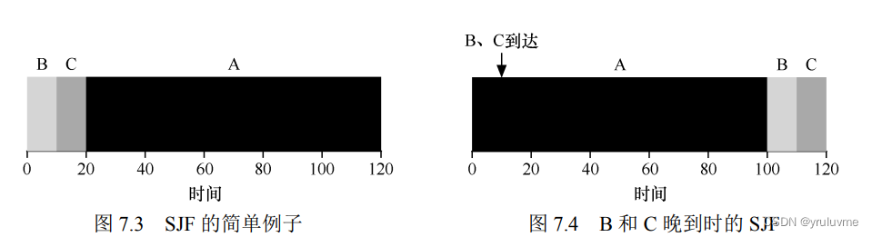
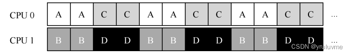

## 前言

[操作系统导论](https://so.csdn.net/so/search?q=%E6%93%8D%E4%BD%9C%E7%B3%BB%E7%BB%9F%E5%AF%BC%E8%AE%BA&spm=1001.2101.3001.7020)（Operating-Systems: Three-Easy-Pieces）是一本非常好的操作系统入门书籍。这是我看完了之后，做的一点笔记总结。（**重点部分加粗**）  
  
前段时间学习过《[深入理解计算机系统](https://so.csdn.net/so/search?q=%E6%B7%B1%E5%85%A5%E7%90%86%E8%A7%A3%E8%AE%A1%E7%AE%97%E6%9C%BA%E7%B3%BB%E7%BB%9F&spm=1001.2101.3001.7020)》（CSAPP）和  
《计算机组成与设计：硬件软件接口 RISC-V》  
学习完这本书算是对于之前的一点点补充，一些概念理解的更加深刻了。  
github上找到的[课后作业答案](https://github.com/joshuap233/Operating-Systems-Three-Easy-Pieces-NOTES)

[**第二部分**](https://blog.csdn.net/2301_79632450/article/details/134830067?spm=1001.2014.3001.5501)  
[**第三部分**](https://blog.csdn.net/2301_79632450/article/details/134831336?spm=1001.2014.3001.5501)

## 第一部分：虚拟化

#### 1.关于本书的对话

本书英文书名为《Operating Systems:Three Easy Pieces》  
本书主要三个部分：**虚拟化（virtualization）、并发（concurrency）和持久性（persistence）**

#### 2.操作系统介绍

一个运行中的程序会不断执行指令。

> 处理器从内存中  
> **获取（fetch）指令，对其解码（decode），然后执行（execute）**  
> 完成后，处理器继续执行下一条指令，依此类推，直到程序最终完成。

为了做到这点：

> 操作系统主要利用一种通用的技术：虚拟化（virtualization）  
> 操作系统将物理（physical）资源（如处理器、内存或磁盘）转换为更通用、更 强大且更易于使用的虚拟形式。  
> 因此，我们有时将操作系统称为虚拟机（virtual machine ）  
> 操作系统还提供了一些接口（**API**）

操作系统实际上做了：

> 1.它取 CPU、内存或磁盘等物理资源（resources），对它们虚拟化（virtualize）  
> 2.它处理与并发（concurrency）有关的麻烦且棘手的问题  
> 3.它持久地（persistently）存储文件，从而使它们长期随全

### cpu虚拟化

#### 3.关于虚拟化的对话

假设一个计算机只有一个 CPU（尽管现代计算机一般拥有多个CPU）

> 虚拟化要做的就是将这个 CPU 虚拟成多个虚拟 CPU 并分给每一个进程使用， 因此，每个应用都以为自己独占  
> CPU，但实际上只有一个CPU——它虚拟化了 CPU。

#### 4.抽象：进程

操作系统为正在运行的程序提供的抽象，就是所谓的**进程（process）**。

**进程的创建**：  
将代码和所有静态数据**加载（load）到内存**中，加载到进程的地址空间中  
为程序的运行时栈（run-time stack 或 stack）**分配内存**  
可能为程序的堆（heap）分配内存（用于显式请求的动态分配数据）  
**执行**与输入/输出（I/O）相关的**任务**

在早期的（简单的 ）操作系统中，加载过程尽早（eagerly）完成。  
[现代操作系统](https://so.csdn.net/so/search?q=%E7%8E%B0%E4%BB%A3%E6%93%8D%E4%BD%9C%E7%B3%BB%E7%BB%9F&spm=1001.2101.3001.7020)惰性（**lazily**）执行该过程，仅在需要加载的代码或数据片段加载。（惰性思想在计算机领域运用很广/**重要**）

> 一般来说进程有三个状态：**运行（running），就绪（ready），阻塞（blocked）**  
> 除此之外，进程还有其他可以处于的状态。如：初始（initial），最终（final/ _僵尸_ ）。

操作系统可能会为所有就绪的进程保留某种进程列表（process list），  
以及跟踪当前正在运行的进程的一些附加信息。  
操作系统还必须以某种方式跟踪被阻塞的进程。  
当 I/O 事件完成时，操作系统应确保唤醒正确的进程，让它准备好再次运行。

#### 5.插叙：进程 API

进程描述符(process identifier，PID)  
1.fork（） 系统调用fork（）用于创建新进程（并发相关）

2.wait（） 调用wait（）延迟自己的进程进行

3.exec（）给定可执行程序的名称及需要的参数后，exec()会从可执行程序中加载代码和静态数据，**并用它覆写自己**的代码段（以及静态数据），堆、栈及其他内存空间也会被重新初始化。然后操作系统就执行该程序，将参数通过 argv 传递给该进程。**它并没有创建新进程**，而是直接将当前运行的程序替换为不同的运行程序。子进程执行 exec()之后，几乎就像从未运行过一样。**对 exec()的成功调用永远不会返回。**

> _fork()和 exec()组合在创建和操作进程时非常强大_

#### 6.机制：受限直接执行

操作系统需要以某种方式让许多任务**共享物理 CPU**

> **基本思想**：运行一个进程一段时间，然后运行另一个进程，如此轮换。  
> 通过以这种方式时分共享（time sharing）CPU，实现了虚拟化  
> **问题**：如何**高效**、**可控地**虚拟化 CPU

  
为了使程序尽可能快地运行，  
开发人员想出了一种技术——**受限直接执行（limited direct execution）**  
（“**直接执行**”->直接在 CPU上运行程序）  
当 OS 希望启动程序运行时，它会在进程列表中为其**创建一个进程条目**，  
为其**分配内存**，将程序代码（从磁盘）**加载**到内存中，  
**找到入口**点（main()函数或类似的），**跳转**到那里，并开始**运行**用户的代码。

_我们需要解决两个问题_  
**第一个问题**：如果我们只运行一个程序，操作系统怎么能确保程序不做任何我们不希望它做的事，同时仍然高效地运行它？（**受限的操作**）  
**第二个问题**：当我们运行一个进程时，操作系统如何让它停下来并切换到另一个进程，从而实现虚拟化 CPU 所需的时分共享？（**进程的切换**）

_第一个问题：_

采用的方法是引入新的处理器模式

> **用户模式（user mode）**，在用户模式下运行的代码会**受限**。  
> 进程不能发出 I/O 请求。这样做会导致处理器引发异常，操作系统可能会终止进程。  
> **内核模式（kernel mode）**，操作系统（或内核）就以这种模式运行。  
> 运行的代码可以做**特权（privileged）操作**，如发出 I/O请求和执行所有类型的受限指令

**为了令用户模式进入内核模式**，程序必须执行特殊的**陷阱（trap）指令**。  
该指令同时跳入内核并将特权级别提升到内核模式。  
**完成后**，操作系统调用一个特殊的**从陷阱返回（return-from-trap）指令**，该指令返回到发起调用的用户程序中，同时将特权级别降低，回到用户模式

> 陷阱如何知道在 OS 内运行哪些代码？  
> **内核通过在启动时设置陷阱表（trap table）来实现**  
> 告诉硬件在发生某些异常事件时要运行哪些代码（这是特权操作）

  
_第二个问题：_

_**协作方式：等待系统调用**_  
在协作调度系统中，OS 通过等待系统调用，或某种非法操作发生，从而重新获得 CPU 的控制权。

_**非协作方式：操作系统进行控制**_  
**时钟中断**（timer interrupt）时钟设备可以编程为每隔几毫秒产生一次中断。  
产生中断时，当前正在运行的进程停止，操作系统中预先配置的中断处理程序（interrupt handler）运行。**操作系统获得 CPU 的控制权，停止当前进程，启动另一个进程。**

_**上下文切换（context switch）**_  
为了保存当前正在运行的进程的上下文，操作系统会执行一些底层汇编代码，  
**保存**通用寄存器（到它的内核栈）、程序计数器，以及当前正在运行的进程的内核栈指针，  
然后**恢复**寄存器（从它的内核栈）、程序计数器，并切换内核栈，供即将运行的进程使用。

例子：  

#### 7.进程调度：介绍

_度量指标：_

> **周转时间（average turnaround time） = 完成时间 − 到达时间  
> 响应时间（response time） = 首次运行 − 到达时间**

_基本调度方法：_

**先进先出（First In First Out，FIFO）**  
可能因为等待某一任务，导致平均周转时间可能过长  
  
**最短任务优先（Shortest Job First，SJF）**  
_非抢占形式_  
可能在运行时间长的任务时到达运行时间短的任务，导致平均周转时间变长  
  
**最短完成时间优先（Shortest Time-to-Completion First，STCF）**  
_或 抢占式最短作业优先（Preemptive Shortest Job First ，PSJF）_  
在SJF基础上引入抢占机制，更短运行时间任务可以抢占资源  
  
**轮转（Round-Robin，RR）调度**  
RR 在一个时间片（time slice）或称 调度量子（scheduling quantum）  
内运行一个工作，然后切换到运行队列中的下一个任务。直到所有任务完成。  
**平均响应时间很短，但是平均周转时间很长**  
时间片越短，RR 在响应时间上表现越好。然而上下文切换的成本将影响整体能  

> 所有程序都执行 I/O，所以更多时候需要**结合 I/O** 来判断  
> 

#### 8.调度：多级反馈队列

> **规则 1：如果 A 的优先级 > B 的优先级，运行 A（不运行 B）。  
> 规则 2：如果 A 的优先级 = B 的优先级，轮转运行 A 和 B。  
> 规则 3：工作进入系统时，放在最高优先级（最上层队列）。  
> 规则4：一旦工作用完了其在某一层中的时间配额（无论中间主动放弃了多少次 CPU），就降低其优先级（移入低一级队列）。  
> 规则 5：经过一段时间S，就将系统中所有工作重新加入最高优先级队列。**

#### 9.调度：比例份额

彩票调度：彩票数(ticket)代表了进程(或用户或其他)占有某个资源的份额。一个进程拥有的彩票数占比，就是它占有资源的份额。通过不断定时地(比如，每个时间片)抽取彩票，彩票调度从概率上获得这种份额比例。

步长调度：系统中的每个任务都有自己的步长，这个值与票数值成反比。每次进程运行后，我们会让它的计数器\[称为行程(pass)值\]增加它的步长，记录它的总体进展。

这两种CPU调度程序由于一些原因，**并没有被广泛使用**。一个原因是这两种方式都不能很好地适合 I/O；另一个原因是其中最难的票数分配问题并没有确定的解决方式（_了解即可_ ）

#### 10.多处理器调度（高级）

（**这部分现代很多**，CSAPP中也提及过，内容涉及广很多，  
小白可能并不能理解，可选部分）

**背景：多处理器架构**  
如果系统有多个处理器，并共享同一个内存，  
易引发**缓存一致性（cache coherence）问题**  
即每个处理器核心或者说进程能够访问到多个数据副本（例如cache），cache中的数据和内存中的数据不一致会存在功能性问题。

**缓存亲和度**  
一个进程在某个 CPU 上运行时，会在该 CPU 的缓存中维护许多状态。下次该进程在相同 CPU 上运行时，由于缓存中的数据而执行得更快。在不同的 CPU 上执行，会由于需要重新加载数据而很慢（好在硬件保证的缓存一致性可以保证正确执行）。**尽可能将进程保持在同一个 CPU 上**。

**单队列多处理器调度（Single Queue Multiprocessor Scheduling，SQMS）**  
SQMS存在几个明显短板：  
第一个是**缺乏可扩展性（scalability）**。为了保证在多CPU 上正常运行，调度程序的开发者需要在代码中通过加 **锁（locking）** 来保证原子性。（与**并发**相关）  
第二个是**缓存亲和性**。由于SQMS可能会经常切换CPU进行工作，导致缓存亲和性差。  
  

> 为了解决这个问题，大多数 SQMS 调度程序都**引入了一些亲和度机制**

  
**多队列多处理器调度（Multi-Queue Multiprocessor Scheduling，MQMS）**  
MQMS 比 SQMS 有明显的**优势**，**更具有可扩展性**。队列的数量会随着 CPU 的增加而增加，因此锁和缓存争用的开销不是大问题。**良好的缓存亲和度**。所有工作都保持在固定的 CPU 上，因而可以很好地利用缓存数据。  
  

有一个新问题，即**负载不均（load imbalance）**  
  
  
_甚至_：  
  
  
最明显的解决办法是让工作移动，即**迁移（migration）**

#### 11.关于 CPU 虚拟化的总结对话

了解一些重要的机制（mechanism）：陷阱和陷阱处理程序，时钟中断以及操作系统和硬件在进程间切换时如何谨慎地保存和恢复状态

### 内存虚拟化

（这一部分这里讲的很**简单**，CSAPP中讲述更**详细**也更难懂）

#### 12.关于内存虚拟化的对话

用户程序生成的每个地址都是虚拟地址  
（every address generated by a user program is a virtual address）  
我们将学习TLB 和多级页表。最终，我们将能够描述一个全功能的现代虚拟内存管理程序的工作原理

#### 13.抽象：地址空间

  
  
一个进程的地址空间包含运行的程序的所有内存状态

虚拟内存（VM）系统有三个主要目标：  
**透明（transparency），效率（efficiency），保护（protection）**  
虚拟内存系统负责为程序提供一个巨大的、稀疏的、私有的地址空间的假象，其中保存了程序的所有指令和数据。操作系统在专门硬件的帮助下，通过每一个虚拟内存的索引，将其转换为物理地址，物理内存根据获得的物理地址去获取所需的信息。操作系统会同时对许多进程执行此操作，并且确保程序之间互相不会受到影响，也不会影响操作系统。

#### 14.插叙：内存操作 API

内存包括两种：  
**栈（stack）内存**，它的申请和释放操作是编译器来**隐式**管理的，所以有时也称为自动（automatic）内存  
**堆（heap）内存**，其中所有的申请和释放操作都由程序员**显式**地完成。

**问题**：为什么你忘记free()了，退出时内存不会丢失？  
操作系统在进程运行时将内存交给进程，并在进程退出(或以其他方式结束)时将其**回收**。

#### 15.机制：地址转换

在实现 CPU 虚拟化时，一般准则为受限直接访问（Limited Direct Execution，LDE）。在实现虚拟内存时，我们将追求类似的战略。

> **关键问题：如何高效、灵活地虚拟化内存**

  
一个简单的思想，称为**基址加界限机制（base and bound）**，  
又称为**动态重定位（dynamic relocation）**

每个CPU需要两个硬件寄存器：**基址（base）寄存器**和  
**界限（bound）寄存器**，或称为**限制（limit）寄存器**  
（每个 CPU 一对）称为**内存管理单元（Memory Management Unit，MMU）**

_以如下方式转化为物理地址_

> _physical address = virtual address + base_

_**界限寄存器提供了访问保护**_  
_当进程访问超过边界或者访问负的虚拟地址时，CPU就会触发异常_

> 补充：数据结构——**空闲列表**\-记录当前没有使用的物理内存的范围

硬件支持：总结  
  
操作系统介入的过程：

> 第一，进程创建时，为进程的地址空间**找到内存空间**（利用空闲列表标记是否空闲）  
> 第二，在进程终止时（正常退出，或因行为不端被强制终止）**回收内存**，  
> 给其他进程或者操作系统使用。  
> 第三，在上下文切换时，操作系统必须**保存和恢复寄存器**。  
> 第四，操作系统必须提供**异常处理**程序（exception handler），或要一些调用的函数

  
这个简单动态重定位技术效率低下，产生大量内部碎片（internal fragmentation）  
因此有了**分段（segmentation）的概念**

#### 16.分段

_分段更高效利用物理空间，减少了地址空间中的内存浪费，可实现代码共享的功能_  
  
为了选择确定的段  
**显式（explicit）方式**，用虚拟地址的前几位来标识不同段，  
VAX/VMS 系统使用了这种技术  
  
为了处理栈，硬件还需要知道段的增长方向  
（用一位区分，比如 1 代表自小而大增长，0 反之）  
  
为了支持共享，需要一些额外的硬件支持，这就是保护位（protection bit）  
  
新问题：  
管理物理内存的空闲空间。新的地址空间被创建时，操作系统需要在物理内存中为它的段找到空间。  
物理内存很快充满了许多空闲空间的小洞，这种问题被称为**外部碎片（external fragmentation）**  
为此要引入**分片**完全解决问题  

#### 17.空闲空间管理

_地层机制：_

追踪已分配空间的大小  
嵌入空闲列表  
让堆增长

_基本策略：_

**最优匹配**：首先遍历整个空闲列表，找到和请求大小一样或更大的空闲块，然后返回候选者中最小的一块。  
**最差匹配**：遍历后尝试找最大的空闲块，分割并满足用户需求后，将剩余的块（很大）加入空闲列表。  
**首次匹配**：找到第一个足够大的块  
**下次匹配**：多维护一个指针，指向上次查找结束位置。其想法是将对空闲空间的查找操作扩散到整个列表

_其他策略：_

**分离空闲列表**  
通过拿出一部分内存专门满足某种大小的请求，碎片就不再是问题了。而且，由于没有复杂的列表查找过程，这种特定大小的内存分配和释放都很快。  
**伙伴系统**  
在这种系统中，空闲空间首先从概念上被看成大小为 2N 的大空间。当有一个内存分配请求时，空闲空间被递归地一分为二，直到刚好可以满足请求的大小（再一分为二就无法满足）。  
  
上面提到的众多方法都有一个重要的问题，**缺乏可扩展性（scaling）**。具体来说，就是**查找列表可能很慢**。因此，更先进的分配程序采用更复杂的数据结构来优化这个开销，牺牲简单性来换取性能。例子包括平衡二叉树、伸展树和偏序树

#### 18.分页：介绍

最大的改进是**灵活性**：通过完善的分页方法，操作系统能够高效地提供地址空间的抽象。  
另一个优点是分页提供的空闲空间管理的**简单性**。  
  
每个进程保存一个数据结构，称为**页表（page table）**。页表的主要作用是为地址空间的每个虚拟页面保存**地址转换**（**address translation**）VPN为虚拟页号，PFN为物理帧号  
  

> **页表用于将虚拟地址（虚拟页号）映射到物理地址（物理帧号）**

页表项中可能包含（**此书中了解即可**）：**有效位**（valid bit，通常用于指示特定地址转换是否有效），**保护位**（protection bit，表明页是否可以读取、写入或执行），**存在位**（present bit，表示该页是在物理存储器还是在磁盘上），**脏位**（dirty bit，表明页面被带入内存后是否被修改过），**参考位**（reference bit，也称访问位，accessed bit，有时用于追踪页是否被访问，也用于确定哪些页很受欢迎）等等

**问题**：页表会造成机器**访问很慢**（许多额外的内存访问来访问页表），**内存浪费**（内存被页表塞满）

#### 19.分页：快速地址转换（TLB）

大体框架：

    VPN = (VirtualAddress & VPN_MASK) >> SHIFT 
    (Success, TlbEntry) = TLB_Lookup(VPN) 
    if (Success == True) // TLB Hit 
    	if (CanAccess(TlbEntry.ProtectBits) == True) 
    		Offset = VirtualAddress & OFFSET_MASK 
    		PhysAddr = (TlbEntry.PFN << SHIFT) | Offset 
    		AccessMemory(PhysAddr) 
    	else 
    		RaiseException(PROTECTION_FAULT) 
    else // TLB Miss 
    	PTEAddr = PTBR + (VPN * sizeof(PTE)) 
    	PTE = AccessMemory(PTEAddr) 
    
    	if (PTE.Valid == False) 
    		RaiseException(SEGMENTATION_FAULT) 
    	else if (CanAccess(PTE.ProtectBits) == False) 
    		RaiseException(PROTECTION_FAULT) 
    	else 
    		TLB_Insert(VPN, PTE.PFN, PTE.ProtectBits) 
    		RetryInstruction()

硬件算法的大体流程：

> 首先从虚拟地址中提取页号（VPN）（第 1 行），然后检查 TLB 是否有该 VPN 的转换映射（第 2 行）。如果有，则TLB命中（TLB hit），接下来我们就可以从相关的 TLB项中取出页帧号（PFN），与原来虚拟地址中的偏移量组合形成期望的物理地址（PA），并访问内存（第 5～7行），假定保护检查没有失败（第 4行）  
> 如果 CPU 没有在 TLB 中找到转换映射（TLB 未命中），硬件访问页表来寻找转换映射（第 11～12 行），并用该转换映射更新TLB（第 18 行），假设该虚拟地址有效，而且我们有相关的访问权限（第 13、15行）。上述系列操作开销较大，主要是因为访问页表需要额外的内存引用（第 12 行）。最后，当 TLB 更新成功后，系统会重新尝试该指令，这时TLB 中有了这个转换映射，内存引用得到很快处理。

  
有了 TLB，在进程间切换时（因此有地址空间切换）TLB 中包含的虚拟到物理的地址映射只对当前进程有效，对其他进程是没有意义的。所以在发生进程切换时，硬件或操作系统（或二者）必须注意确保即将运行的进程不要误读了之前进程的地址映射。  
一种方法是在上下文切换时，**简单地清空（flush）TLB**，但是也会出现很多次未命中的问题。所以一些系统增加了硬件支持，加入ASID地址空间标识符来作区分。  
TLB满了之后会需要**替换策略**，可以使用简单的最近最少使用策略LRU，随机策略。

TLB 也**不能满足所有的程序需求**。如果一个程序短时间内访问的页数超过了 TLB 中的页数，就会产生大量的 TLB 未命中，运行速度就会变慢。这种现象被称为超出 TLB 覆盖范围（TLB coverage），解决这个问题的一种方案是**支持更大的页**

#### 20.分页：较小的表

一种简单的方法减小页表大小：使用更大的页。  
然而，大内存页会导致每页内的浪费，这被称为内部碎片（internal fragmentation）问题

混合方法：分页和分段，这种方法并非没有问题  
首先，它仍然要求使用分段，如果有一个大而稀疏的堆，仍然可能导致大量的页表浪费  
其次，这种杂合导致外部碎片再次出现。

**多级页表：**  
  
线性页表通常很大，线性表是按VPN索引的PTE数组，需要连续驻留在物理空间中；有了多级结构，我们增加了一个间接层 (level of indirection)，使用了页目录，它指向页表的各个部分。这种间接方式，让我们能够将页表页放在物理内存的任何地方。

多级页表的缺点在于，TLB未命中，就需要从内存加载两次，这样会造成时间的浪费（空间换时间的典型）；同时页表查找也会很复杂。

#### 21.超越物理内存：机制

在硬盘上开辟一部分空间用于物理页的移入和移出。超越物理内存：机制操作系统中，一般这样的空间称为**交换空间（swap space**）  
  
通常有更大的空间。为多个并发运行的进程都提供巨大地址空间的假象。交换空间位于硬盘驱动器上，它比进入物理内存要慢。

_页错误处理流程：_

    VPN = (VirtualAddress & VPN_MASK) >> SHIFT 
    (Success, TlbEntry) = TLB_Lookup(VPN) 
    if (Success == True) // TLB Hit 
    	if (CanAccess(TlbEntry.ProtectBits) == True) 
    		Offset = VirtualAddress & OFFSET_MASK 
    		PhysAddr = (TlbEntry.PFN << SHIFT) | Offset 
    		Register = AccessMemory(PhysAddr) 
    	else 
    		RaiseException(PROTECTION_FAULT) 
    
    else // TLB Miss 
    	PTEAddr = PTBR + (VPN * sizeof(PTE)) 
    	PTE = AccessMemory(PTEAddr) 
    	if (PTE.Valid == False) 
    		RaiseException(SEGMENTATION_FAULT) 
    	else 
    		if (CanAccess(PTE.ProtectBits) == False) 
    			RaiseException(PROTECTION_FAULT) 
    		else if (PTE.Present == True) 
    			// assuming hardware-managed TLB 
    			TLB_Insert(VPN, PTE.PFN, PTE.ProtectBits) 
    			RetryInstruction() 
    		else if (PTE.Present == False) 
    			RaiseException(PAGE_FAULT)

内存访问TLB未命中会遇到：

第一种情况：**该页存在（present）且有效（valid）**（第 18～21 行）。TLB 未命中处理程序可以简单地从 PTE 中获取 PFN，然后重试指令（这次 TLB 会命中），并因此继续前面描述的流程。

第二种情况：（第 22～23 行）**页错误处理程序需要运行**。虽然这是进程可以访问的合法页，但它并不在物理内存中。

第三种情况：访问的是一个**无效页**，可能由于程序中的错误（第 13～14 行）。在这种情况下，PTE 中的其他位都不重要了。

> 为了保证有少量的空闲内存，大多数操作系统会设置高水位线（High Watermark，HW） 和低水位线（Low  
> Watermark，LW），来帮助决定何时从内存中清除页。

#### 22.超越物理内存：策略

> _AMAT = (PHit·TM) + (PMiss·TD)_

_其中 TM表示访问内存的成本，TD表示访问磁盘的成本，PHit表示命中概率，PMiss表示未命中概率。_

> 补充：缓存未命中的类型  
> **强制性未命中**（compulsory miss，或冷启动未命中，cold-start miss）是因为缓存开始是空的  
> **容量未命中**（capacity miss）由于缓存的空间不足而不得不踢出一个项目以将新项目引入缓存  
> **冲突未命中**（conflict miss）出现在硬件中，因为硬件缓存中对项的放置位置有限制，这是由于所谓的集合关联性（set-associativity）。它不会出现在操作系统页面缓存中

**最优替换策略**  
替换内存中在最远将来才会访问到的页。  
最优策略非常**不切实际**，但作为仿真或其他研究的比较者还是非常有用的。

**简单策略：FIFO和随机**  
页在进入系统时，放入一个队列。当发生替换时，队列尾部页被踢出。FIFO 有一个大优势：实现相当**简单**。因为根本无法确定页的重要性，即使经常使用的页也会将其踢出，所以**命中率会很低**

随机策略更是**重量级** 随机选择一个页进行替换，命中率全看脸

**利用历史数据：LRU**

> 补充：局部性类型  
> 第一种是**空间局部性（spatial locality）**，它指出如果某页被访问，可能围绕它的页也会被访问。  
> 第二种是**时间局部性（temporal locality）**，它指出近期访问过的页面很可能在不久的将来再次访问。

LRU方法就是找到最近使用最少的页将它踢出，这种方法难以实现，因为页的数量太多了，如果遍历寻找，性能代价过大

**近似LRU**

增加一个**使用位**的概念，当最近使用了这个页，硬件就会将当前页的使用位设置成1

> 有一个简单的方法称作时钟算法（clock algorithm）系统中的所有页都放在一个循环列表中。时钟指针（clock hand）开始时指向某个特定的页（哪个页不重要）。当必须进行页替换时，操 作系统检查当前指向的页 P 的使用位是 1 还是 0。如果是1，则意味着页面 P 最近被使用， 因此不适合被替换。然后，P 的使用位设置为 0，时钟指针递增到下一页（P + 1）。该算法一直持续到找到一个使用位为 0 的页，使用位为 0 意味着这个页最近没有被使用过（在最坏的情况下，所有的页都已经被使用了，那么就将所有页的使用位都设置为 0）。

如果页已被修改（modified）并因此变脏（dirty），则踢出它就必须将它写回磁盘，这很昂贵。如果它没有被修改（因此是干净的，clean），踢出就没成本。  
当内存被超额请求，操作系统只能不停地换页才能满足需求，一般的解决方式就是杀死其中的内存密集型进程来控制内存请求。

#### 23.VAX/VMS 虚拟内存系统

（这部分内容了解即可）

VAX-11 为每个进程提供了一个 **32位**的虚拟地址空间，VAX 硬件中的页非常小（**512 字节**）。为了确保 VMS 不会用页表占满内存。虚拟地址由 **23 位 VPN** 和 **9 位**偏移组成。VPN 的**高两位**用于区分页所在段。该系统是**分页和分段**的混合体。  
  
VAX 中的页表项（PTE）包含：一个有效位，一个保护字段（4 位），一个修改位（或脏位），为 OS 使用保留的字段（5 位），一个物理帧号码（PFN）将页面的位置存储在物理内存中。没有引用位（no reference bit）！  
采用了这两种技术：**分段的FIFO 和 页聚集**

#### 24.内存虚拟化总结对话

> 我们在程序中可以观察到的所有地址都是虚拟地址。 TLB是一个非常关键的部分，为系统提供了一个地址转换的小硬件缓存。页表通常相当大，因此放在大而慢的内存中。地址转换结构需要足够灵活，多级表这样的结构是很好的。

## ps

  
第一次写这么多东西，给我写了一天，只是第一部分就这么多了，写的可能有点啰嗦，突然想起**二八定律**，下一部分可能会写精简很多，只留重要部分

# 参考

仅用于个人学习

[OSTEP《操作系统导论》万字 精华学习笔记-第一部分：虚拟化-CSDN博客](https://blog.csdn.net/2301_79632450/article/details/134829577)