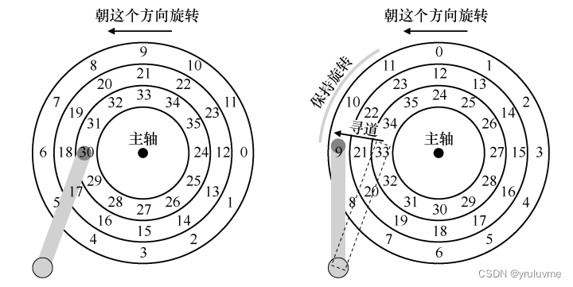
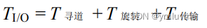

## 前言

这部分可能是对我补充最多的部分了，之前并不了解文件系统和[分布式系统](https://so.csdn.net/so/search?q=%E5%88%86%E5%B8%83%E5%BC%8F%E7%B3%BB%E7%BB%9F&spm=1001.2101.3001.7020)  
最后一部分了，之后看了新书后，可能也会写点笔记吧，对于理解帮助挺大的  
之后学习[计算机网络](https://so.csdn.net/so/search?q=%E8%AE%A1%E7%AE%97%E6%9C%BA%E7%BD%91%E7%BB%9C&spm=1001.2101.3001.7020)也会写点东西的。

## 第三部分：持久性

（这部分使用的例子大多是**磁盘**相关的例子，但是现代用的基本都是**固态硬盘**了，磁盘可能算是老古董了，  
但是了解一下没坏处，概念是互通的）

### 持久性

#### 35.关于持久性的对话

**持久性**是指数据在系统停止运行或发生故障后仍能保持存在和可访问性的能力  
持久性是保证数据安全的**重要手段**，如果没有持久性，那么就需要手动备份数据，这样会增加工作量和出错的概率，而且也不能保证备份的数据和原始数据完全一致

#### 36.I/O 设备

> 越快I/O 设备的总线越短，因此高性能的内存总线没有足够的空间连接太多设备。  
> 另外，在工程上**高性能总线的造价非常高**

> 第一部分是向系统其他部分展现的**硬件接口（interface）** 第二部分是它的**内部结构（internal structure）**

（_简化的_ ）设备接口包含 3 个寄存器：

> **状态（status）寄存器**，可以读取并查看设备的当前状态  
> **命令（command）寄存器**，用于通知设备执行某个具体任务  
> **数据（data）寄存器**，将数据传给设备或从设备接收数据

_通过读写这些寄存器，操作系统可以控制设备的行为。_

**利用中断减少 CPU 开销**

CPU 不再需要不断轮询设备，而是向设备发出一个请求，然后就可以让对应进程睡眠，切换执行其他任务。  
当设备完成了自身操作，会抛出一个硬件中断，引发 CPU 跳转执行操作系统预先定义好的中断服务例程（Interrupt Service Routine，ISR），或更为简单的中断处理程序（interrupt handler）。  
DMA（Direct Memory Access）。DMA 引擎是系统中的一个特殊设备，

**利用 DMA 进行更高效的数据传送**  
它可以协调完成内存和设备间的数据传递，不需要 CPU 介入

**设备交互的方法**

_**明确的 I/O 指令**_（老方法 ）：指令规定了操作系统将数据发送到特定设备寄存器的方法，从而允许构造协议  
_**内存映射 I/O**_（memory- mapped I/O）：硬件将设备寄存器作为内存地址提供。当需要访问设备寄存器时，操作系统装载（读取）或者存入（写入）到该内存地址；然后硬件会将装载/存入转移到设备上，而不是物理内存

**设备驱动程序**  

#### 37.磁盘驱动器

> （随着技术的发展，磁盘驱动器已经逐渐被**固态硬盘**（Solid State Drive，SSD）取代。  
> 固态硬盘使用闪存芯片而不是磁盘来存储数据，具有更快的读写速度和更低的能耗。  
> 这部分我没看的太认真，之后看看《现代操作系统》再说）

  
  
  
  
**磁盘调度**

**SSTF：最短寻道时间优先**

> SSTF 按磁道对 I/O 请求队列排序，选择在最近磁道上的请求先完成  
> **问题**：  
> 主机操作系统无法利用驱动器的几何结构，而是只会看到一系列的块。  
> 饥饿（starvation），如果有很多内圈的请求，那么外圈的磁道就会饥饿。

**电梯（又称 SCAN 或 C-SCAN）**

> 该算法从内圈扫到外圈，再从外圈扫回内圈，仍然遵守较近的优先  
> **问题：**  
> SCAN 及其变种并不是最好的调度技术。  
> SCAN（甚至 SSTF）实际上并没有严格遵守 SJF 的原则。它们忽视了旋转

**SPTF：最短定位时间优先**

> 最短定位时间优先，现在的机器查找和旋转的速度是相当的，  
> 所以SPTF算法经常在驱动器内部执行（因为驱动器比操作系统更懂磁道边界，磁头位置）

#### 38.廉价冗余磁盘阵列（RAID）

1.  **RAID 0**

_RAID 0将多个物理磁盘组合成一个逻辑卷，并将数据均匀地分布在这些磁盘上，以提高性能。  
由于RAID 0不提供冗余保护，因此如果其中任何一个物理磁盘发生故障，整个逻辑卷将无法使用。_  
  

2.  **RAID 1**

_RAID 1将数据完全复制到两个物理磁盘中，以提供冗余保护。如果其中任何一个物理磁盘发生故障，  
系统将自动切换到另一个磁盘上继续工作，从而保证数据的可靠性和可用性。  
RAID 1的存储容量只有一半，因为它需要将数据完全复制到另一个磁盘中。_  

3.  **RAID 4**

_RAID 4采用了与RAID 0类似的数据分片方式，但使用了一个称为“快速读”的技术，可以提高读取性能。  
RAID 4还使用了一个称为“延迟更新”的技术，可以减少数据写入的时间。RAID 4需要至少三个物理磁盘，  
其中两个用作数据磁盘，一个用作奇偶校验磁盘。RAID 4提供了冗余保护，但不提供性能提升。_  

4.  **RAID 5**

_RAID 5与RAID 4类似，也采用了数据分片方式，并使用了奇偶校验来提供冗余保护。  
RAID 5与RAID 4的不同之处在于，它使用了一个称为“条带化奇偶校验”的技术，  
可以将奇偶校验信息存储在数据磁盘中，从而提高存储容量。RAID 5需要至少三个物理磁盘，  
其中两个用作数据磁盘，一个用作奇偶校验磁盘。RAID 5提供了冗余保护和性能提升，但需要更多存储空间_。  

> 总的来说，  
> RAID 0提供了最高的性能，但不提供冗余保护。  
> RAID 1提供了冗余保护，但性能较低。  
> RAID 4和RAID 5提供了冗余保护和一定的性能提升，但需要更多的存储空间和计算资源。  
> 在实际应用中，需要根据数据的重要性、可用性和性能需求来选择适合的RAID级别。

> _补充：实际上还含有RAID 6、RAID 10等级别_

#### 39.插叙：文件和目录

（这节原文其实比较 玄，用了好多伪代码，硬看可能有点不理解）

**文件系统的结构**  
_文件系统通常由文件、目录、超级块和inode等部分组成。文件系统的结构可以是简单的文件目录结构，也可以是复杂的层次结构。_

**文件的存储和访问**  
_通常通过文件系统的缓冲区实现。当文件被修改时，文件系统会将修改的内容保存在缓冲区中，并在适当的时候将修改的内容写入磁盘中。_

**目录的组织和管理**  
_目录是文件系统中的一种数据结构，用于组织和管理文件。目录可以包含多个子目录和文件，可以通过链接的方式访问。（目录的组织和管理通常采用B树或哈希表等数据结构实现）_

**文件系统的实现**  
_包括文件系统的格式、文件系统的挂载和卸载、文件系统的备份和恢复等方面。文件系统的实现需要考虑文件系统的性能、可靠性和安全性等方面的问题。_

**文件系统的性能优化**  
_包括文件系统的缓存、文件系统的日志、文件系统的快照和克隆等方面。文件系统的性能优化可以提高文件系统的读写性能和可靠性，同时可以减少文件系统的存储空间和管理成本。_

#### 40.文件系统实现

> **inode**是UNIX或类UNIX操作系统（例如Linux）中的一种数据结构，用于存储文件系统中的文件或目录的元数据。  
> 每个文件或目录都有一个对应的inode，其中包含了文件或目录的各种属性信息，例如文件大小、文件类型、所有者、  
> 访问权限、创建时间、修改时间等等。inode号码是文件系统中唯一的标识符，它可以用来快速地定位文件或目录，  
> 而不需要遍历整个文件系统。在Unix或类UNIX操作系统中，inode是非常重要的概念，它是文件系统正常运行的基础。

  
  
_在Unix或Linux系统中，磁盘被划分为多个区域用于不同的目的。其中，用于存放用户数据的区域被称为**数据区域**，这些数据区域的大小可以非常大，可以容纳大量的用户数据。除了数据区域外，还有一部分区域用于存放文件系统的元数据，例如每个文件的权限、长度、组成块的位置等信息。这些元数据被存储在**inodes**结构中。_

_**inodes结构**用于存放每个文件的信息，包括长度、权限、组成块的位置等元数据。inodes中包含了一个inode位图和一个数据位图，用于指示对象/块是否空闲。_

_除了数据区域和inodes结构外，还有一个**超级块**，用于保存该特定文件系统的信息。超级块包含了文件系统类型、挂载选项、磁盘空间信息、空闲块表和空闲inode表等信息。超级块的作用是在文件系统被挂载时加载文件系统的相关信息，以便操作系统可以正确地管理和操作该文件系统。_

> **文件系统的实现方式**：  
> 包括裸设备、基于文件系统的虚拟设备和[分布式文件系统](https://so.csdn.net/so/search?q=%E5%88%86%E5%B8%83%E5%BC%8F%E6%96%87%E4%BB%B6%E7%B3%BB%E7%BB%9F&spm=1001.2101.3001.7020)等。裸设备是直接访问磁盘的方式，基于文件系统的虚拟设备是通过文件系统提供的接口访问磁盘的方式，分布式文件系统是通过网络访问远程磁盘的方式。  
> **文件系统的选择和评估**：  
> 选择和评估文件系统需要考虑文件系统的性能、可靠性和安全性等方面的问题。  
> 需要根据具体的应用场景和需求，选择适合的文件系统结构和实现方式。

#### 41.局部性和快速文件系统

> 局部性原则指程序在执行过程中倾向于访问最近刚刚访问过的数据，包括最近刚刚被访问的指令、数据和指令等。  
> 这种访问模式可以提高程序的效率，因为这样可以减少对存储器的访问次数，从而提高程序的执行速度。

**快速文件系统（Fast File System，FFS）**  
_快速文件系统利用局部性原则来提高文件系统的性能_  
（这节结合我之前看的一些内容**补充**了一点点）

**缓存机制**  
快速文件系统采用缓存机制来提高文件的读写速度。缓存是一种高速缓存技术，它将最近访问的数据存储在快速存储器中，以便快速访问。当程序需要访问数据时，首先会查找缓存中是否存在该数据，如果存在则直接从缓存中读取，否则需要从磁盘中读取数据并将其存储到缓存中以备下次使用。

**磁盘调度算法**  
快速文件系统采用了一些磁盘调度算法，这些算法可以根据文件的访问模式和历史访问记录，优化文件的访问顺序和缓存替换策略，从而提高文件系统的性能。

    sudo fdisk -i slice /dev/rdsk/c0t0d0s0

> 创建一个新的FFS文件系统，并将其安装到指定的磁盘上

FFS文件系统的原则是将**相关的信息尽可能地放在一起**。FFS文件系统还使用了inode和data block的组合来管理文件系统的数据。inode包含了文件系统中文件的元数据，而data block则包含了文件的实际内容。每个文件都有一个唯一的inode号码，通过这个号码可以快速地定位文件。

对于大文件，FFS文件系统使用了一种称为Large File Support（LFS）的技术。LFS允许FFS文件系统支持大于32GB的文件。为了实现这个目标，FFS文件系统使用了一种称为Extent-based allocation的技术。这种技术将大文件分成多个Extent，每个Extent都是连续的数据块，这样可以**减少文件碎片，提高文件系统的性能**。

在FFS文件系统中，还有一些小细节需要注意。例如，FFS文件系统使用了一种称为block number的机制来表示数据块的位置。这个机制可以**避免使用i节点号来访问数据块**，从而提高了文件系统的性能。FFS文件系统还支持软链接和硬链接，这些链接可以方便地访问文件和目录。

> FFS文件系统在处理小文件方面采用了一些创新的技术，例如引入子块和缓冲写入技术，以提高文件系统的性能和效率。它还引入了一种新的布局来避免子块被旋转过去，从而减少了额外的开销。

#### 42.崩溃一致性：FSCK 和日志

崩溃一致性（crash consistency）是指在系统崩溃或断电等意外情况下，保证文件系统中文件的一致性和完整性。为了实现崩溃一致性，文件系统通常需要进行fsck（file system check）和日志（journaling）。

**解决方案 1：文件系统检查程序**

> Fsck是一种用于检查和修复文件系统错误的工具。  
> 系统崩溃后，fsck会检查文件系统中的元数据和数据，确定文件的完整性和一致性，并尝试修复任何错误或损坏部分。  
> Fsck会尝试将文件系统恢复到崩溃之前的状态，以确保文件的完整性和一致性。

**解决方案 2：日志（或预写日志）**

> 日志是一种记录文件系统操作的技术，它记录了对文件系统的更改和操作。  
> 通过记录操作的日志，文件系统可以在系统崩溃后快速地恢复到崩溃之前的状态，而无需进行完整的fsck检查。  
> 这可以显著减少文件系统恢复的时间和复杂性，并提高文件系统的可用性和可靠性。

_1．数据写入：将数据写入最终位置，等待完成（等待是可选的，详见下文）  
2．日志元数据写入：将开始块和元数据写入日志，等待写入完成  
3．日志提交：将事务提交块（包括 TxE）写入日志，等待写完成，认为事务（包括数据）已提（committed）  
4．加检查点元数据：将元数据更新的内容写入文件系统中的最终位置  
5．释放：稍后，在日志超级块中将事务标记为空闲_

**解决方案 3：其他方法**

> **软更新**，这种方法仔细地对文件系统的所有写入排序，以确保磁盘上的结构永远不会处于不一致的状态  
> _**写时复制（Copy-On-Write，COW）**_，不会覆写文件或目录。它会对磁盘上以前未使用的位置进行新的更新  
> **反向指针的一致性（Backpointer-Based Consistency，BBC）**，它在写入之间不强制执行排序

#### 43.日志结构文件系统

**日志结构文件系统概述**

> 传统文件系统在更新数据时，需要将整个文件读出，修改后再写回磁盘，这种方式效率低下，且容易造成数据不一致。

    日志结构文件系统是一种高效、可靠的文件系统，它能够保证文件系统的一致性和完整性。

> 日志结构文件系统的核心思想是：将所有文件系统的操作都按照顺序记录在一个日志中，然后在需要时按照日志的顺序执行这些操作，以保证文件系统的一致性和完整性。

**日志结构文件系统的特点**

> **顺序性**：日志结构文件系统将所有操作都记录在一个日志中，操作按照顺序执行，保证了文件系统的一致性和完整性。  
> **原子性**：日志结构文件系统将每个操作都封装成一个原子单元，保证了每个操作的原子性。  
> **可靠性**：日志结构文件系统通过记录每个操作，可以在系统崩溃后恢复文件系统的一致性和完整性。  
> **高效性**：日志结构文件系统可以通过顺序写入和批量更新等技术，提高文件系统的效率。

**日志结构文件系统的实现**  
日志结构文件系统的实现通常包括三个部分：日志管理、文件系统管理和磁盘管理。

> **日志管理**负责记录和管理文件系统的所有操作，包括写入、删除和修改等操作。  
> **文件系统管理**负责管理文件系统的元数据和数据，包括目录、文件、权限和属性等。  
> **磁盘管理**负责管理文件系统的磁盘空间，包括磁盘空间的分配和释放等。

**优点**：

> 提高了文件系统的可靠性和一致性。  
> 提高了文件系统的性能，尤其是在大规模的文件系统中。  
> 可以支持在线扩展和动态调整。

**缺点**：

> 需要额外的磁盘空间来存储日志，增加了文件系统的开销。  
> 对于小文件系统，日志结构文件系统的开销比较大。  
> 对于某些应用程序，需要特殊的处理才能保证文件系统的一致性。

**补充：**

> 日志结构文件系统广泛应用于各种类型的文件系统中，包括Unix、Linux、Windows等操作系统的文件系统，以及数据库、邮件系统、Web服务器等应用程序的文件系统。  
> 在大型文件系统中，日志结构文件系统已经成为标准的选择，它可以提供高可靠性、高性能和可扩展性的解决方案。

#### 44.数据完整性和保护

**数据完整性**

> 数据完整性指的是数据在存储和传输过程中不被篡改或损坏的状态。  
> 为了保证数据的完整性，需要采用一些技术，如哈希校验、数字签名、加密等。

**数据保护**

> 数据保护指的是保护数据免受非法访问、泄露或破坏等威胁。  
> 为了保证数据的保护，需要采用一些技术，如访问控制、身份认证、数据备份等。

**数据完整性和保护的关系**

> 数据完整性和保护是密切相关的概念，只有保证数据的完整性，才能更好地保护数据。  
> 数据保护可以通过保证数据完整性来实现，例如数字签名可以验证数据是否被篡改。

**数据完整性和保护的技术**

> **哈希校验**：通过对数据进行哈希算法计算，得到一个固定长度的校验值，可以验证数据是否被篡改。  
> **数字签名**：使用公钥密码学技术生成数字签名，用于验证数据的完整性和真实性。 加密：通过加密算法对数据进行加密，可以防止未经授权的访问和泄露。  
> **访问控制**：通过访问控制技术，限制对数据的访问权限，可以防止非法访问和篡改。  
> **身份认证**：通过身份认证技术，验证用户的身份，可以防止恶意用户访问和篡改数据。  
> **数据备份**：通过数据备份技术，对数据进行备份，可以防止数据丢失或损坏。

**哈希校验**  
哈希校验是一种将任意长度的数据映射为固定长度的数据的算法。  
哈希校验可以用于检测数据是否被篡改。例如，在传输文件时，可以先计算文件的哈希值，然后将哈希值发送给接收者，接收者再计算文件的哈希值进行比对，以确保文件没有被篡改。

**数字签名**  
数字签名是一种将数据和发送者的身份信息绑定在一起的技术，用于验证数据的完整性和真实性。  
数字签名可以用于防止数据被伪造。例如，在电子邮件中使用数字签名，可以证明发件人的身份和电子邮件的完整性。

**加密**  
加密是一种将明文转换成密文的技术，用于保护数据的隐私性。  
加密可以用于保护存储在计算机系统中的敏感信息，如密码、信用卡号等。

**访问控制**  
访问控制是一种控制用户访问计算机系统资源的技术，用于保护计算机系统的安全性。  
访问控制可以用于限制用户对计算机系统的访问权限，防止未经授权的访问和操作。

**完整性检验**  
完整性检验是一种验证数据是否被篡改的技术，用于保护数据的完整性。  
完整性检验可以用于检测文件是否被篡改，例如，在文件传输过程中，可以使用哈希校验等技术进行完整性检验。

#### 45.关于持久的总结对话

计算机系统的持久性是一个复杂的问题，需要在多个方面采取措施来保证数据的可靠性和持久性。只有在系统的各个方面都得到充分考虑和保障的情况下，才能实现真正意义上的计算机持久性。

### 分布式

（这里讲的不全，更多的是**了解**一下）

### 46.关于分布式的对话

分布式系统（Distributed System）是由多台计算机和网络连接组成的系统，它们通过网络相互通信，协同完成任务。  
与传统的集中式系统相比，分布式系统特点：可扩展性，容错性，并发性，共享性

### 47.分布式系统

  
在分布式系统中，由于通信不可靠，会出现许多问题，例如数据丢失、延迟等。为了保证通信的可靠性，可以使用一些技术，如校验和、重传机制等。但是这些技术并不能完全保证通信的可靠性，因此需要采用其他方法来解决这些问题。

> 一种常见的解决方案是基于**远程过程调用**（Remote ProcedureCall，**RPC**）的抽象。RPC是一种用于在分布式系统中进行通信的技术，它允许一个进程像调用本地函数一样调用另一个进程。在RPC中，有两个重要的部分：存根生成器和运行时库

> **存根生成器**是一个自动工具，它将函数参数和结果打包成消息，并优化此类代码。  
> 存根生成器可以生成客户端和服务器端的代码，客户端代码用于向服务器发送请求，  
> 而服务器端代码用于接收请求并返回结果。

_运行时库是RPC系统中的核心部分，它处理RPC系统中的大部分繁重工作，例如网络连接、消息传输、错误处理等。运行时库还可以提供一些高级特性，例如负载均衡、故障恢复等。_

_使用RPC可以**简化分布式系统的开发，并提高系统的可靠性和性能**。RPC可以自动化地处理消息的打包和解包，减少了开发人员的工作量。此外，RPC还可以提供一些高级特性，例如负载均衡、故障恢复等，这些特性可以帮助开发人员更轻松地构建可靠的分布式系统。_

#### 48.Sun 的网络文件系统（NFS）

    NFS 是一种用于在网络上共享文件的协议，它允许远程主机可以像访问本地文件一样访问共享文件。NFS 最初由 Sun 公司开发，现在已经成为了一种通用的文件系统标准。

**NFS 的工作原理**

> NFS工作时，客户端通过网络请求访问服务器上的文件，服务器接收客户端请求后，将文件发送回客户端。客户端接收到文件后，可以像访问本地文件一样访问该文件。  
> NFS使用了一种客户端/服务器模型，其中客户端向服务器发起请求，服务器则将文件发送回客户端。

**NFS 的组成部分**

_NFS 由三个主要组件组成：_

> **客户端**：发起请求的主机，可以访问共享文件系统中的文件。  
> **服务器**：共享文件系统的主机，可以响应客户端的请求。  
> **协议**：定义了客户端和服务器之间的通信协议。

**NFS 的优点**

> **分布式文件系统**：NFS 允许多个计算机共享文件系统中文件，使文件系统可以分布在多个计算机上  
> **简单易用**：NFS使用起来非常简单，只需在客户端挂载远程共享文件系统即可。  
> **跨平台支持**：NFS 可以在多种操作系统之间共享文件系统，如Linux、Unix、MacOS 等

**NFS 的缺点**

> **安全性问题**：NFS 默认情况下没有加密功能，因此在网络传输过程中可能会被窃听或篡改。  
> **带宽占用**：NFS在传输大量数据时会占用较大的网络带宽。=

#### 49.Andrew 文件系统（AFS）

    AFS 是一种分布式文件系统，由卡内基梅隆大学的 Andrew 研究所开发。AFS 允许多个计算机共享文件系统中的文件，使得文件系统可以分布在多个计算机上。

**AFS 的特点**

> -   **分布式文件系统**：AFS 允许多个计算机共享文件系统中的文件，使得文件系统可以分布在多个计算机上。
> -   **客户端/服务器架构**：AFS 采用客户端/服务器架构，客户端向服务器请求文件，服务器将文件发送回客户端。
> -   **缓存机制**：AFS 在客户端上缓存了文件系统的一部分，使得客户端能够更快地访问文件。
> -   **版本控制**：AFS 允许多个用户同时编辑同一份文件，并且可以保存不同版本的文件。
> -   **安全性**：AFS 提供了安全性保障，可以限制不同用户对文件的访问权限。

**AFS 的组成部分**

_主要组件：_

> -   **文件服务器**：存储文件系统中的文件。
> -   **客户端**：访问文件服务器上的文件。
> -   **进程**：运行在客户端上的程序。
> -   **Volume**：AFS 中的逻辑分区，包含一组相关的文件和目录。
> -   **Volume Location Database (VLDB)**：记录每个 Volume 在哪个服务器存储。
> -   **Protection Server**：管理用户访问权限。

**AFS 的工作原理**

> -   客户端通过网络向文件服务器请求文件。
> -   文件服务器将文件发送回客户端。
> -   客户端将文件缓存在本地，以便下次访问时更快。
> -   如果客户端要修改文件，文件服务器将文件锁定，防止其他用户同时修改文件
> -   客户端修改文件后，将修改的内容发送回文件服务器，文件服务器将修改的内容写入磁盘中的文件。

#### 50.关于分布式的总结对话

    分布式系统是一个由多台计算机组成的系统，它们通过网络相互通信，协同完成任务。

_分布式系统具有以下特点：_

-   1.  _可扩展性_：可以通过添加更多的机器来扩展系统的性能和容量；
-   2.  _容错性_：即使某个节点发生故障，系统仍能正常运行；
-   3.  _并行性_：多个节点可以同时处理不同的任务，提高了系统的处理能力。

## ps

这本书是结束了，我之后还会更全面的学习操作系统，  
以及之后还有学习计算机网络，同时我也要加深一下我的算法了。