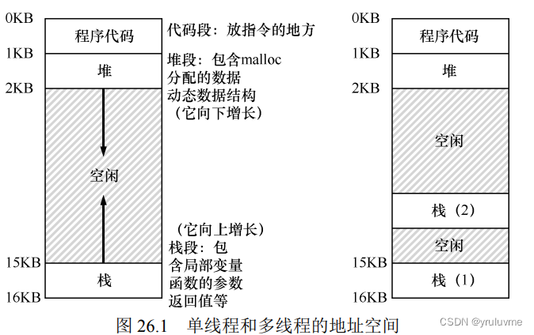

## 前言

之前学习CSAPP 和 [计算机组成](https://so.csdn.net/so/search?q=%E8%AE%A1%E7%AE%97%E6%9C%BA%E7%BB%84%E6%88%90&spm=1001.2101.3001.7020)与设计（原书第5版）硬件软件接口 RISC-V  
时了解过并发内容，但其实并没有完全理解，现在是补充了，  
之前学习c++时，了解多[线程库](https://so.csdn.net/so/search?q=%E7%BA%BF%E7%A8%8B%E5%BA%93&spm=1001.2101.3001.7020)时了解过一点，当时在github上学习了一个简单的线程池。当时并不完全理解，学习玩这一部分后，我就理解了其含义和原理

**“二八定律”**  
在任何一组东西中，最重要的只占其中一小部分，约20%，其余80%的尽管是多数，却是次要的

## 第二部分：并发

> （_**这部分 代码 或 伪代码 可能多点，看明白了就好理解多了**  
> **更具体还是要学习Linux，但耗时间，我可能要等到寒假了**_）  
> c++中的相关多线程的头文件(**thread，mutex，atomic，future，condition\_variable)**

### 25.关于并发的对话

存在某些类型的程序，我们称之为**多线程**（multi-threaded）应用程序。每个线程（thread）都像在这个程  
序中运行的独立代理程序。  
操作系统必须用**锁**（lock）和**条件变量**（condition variable）这样的原语。其次，操作系统本身是第一个并发程序。

### 26.并发：介绍

线程创建**独立于调用者运行，返回时间不定**。

**核心问题：不可控的调度**  
在并发执行中，由于线程或进程的抢占和调度是不可控的，不同线程或进程的执行顺序可能会不同，程序的执行结果也不同，因此程序的可再现性会受到影响。

原子方式的意思是“作为一个单元”，或是“**全部或没有**”，即为一个**整体**

> 补充：**这4个术语对并发代码非常重要**  
> **临界区**（critical section）是访问共享资源的一段代码，资源通常是变量或数据结构。  
> **竞态条件**（race condition）出现在多个线程同时进入临界区，都试图更新共享资源。  
> **不确定性**（indeterminate）程序由一个或多个竞态条件组成，程序的输出因运行而异。  
> **互斥**（mutual exclusion）可以保证只有一个线程进入临界区，从而避免出现竞态。

### 27.插叙：线程 API

都是代码 和 伪代码，可以了解概念，如果学习了 **Linux** 可以在原书具体看看  
我学习c语言的时候并没有了解过 多线程，看来CSAPP的时候才知道，  
我只知道c++中相关的部分内容，c++中含有的相关头文件：

**（thread，mutex，atomic，condition\_variable，future）**  
依次对应 线程，互斥锁，原子，条件变量，异步结果

### 28.锁

锁保存了锁在某一时刻的状态。它要么是可用的（available，或 unlocked，或 free）**一个线程持有锁，表示可用**。

锁（Lock）是一种常用的**同步机制**，用于控制对共享资源的访问。它在多线程环境下，保证了数据一致性和线程安全性。

锁的原理：  
锁的核心概念是互斥（Mutual Exclusion），即确保任意时刻只有一个线程可以访问共享资源，其他线程需要等待。常见的几种锁包括互斥锁（Mutex Lock）、读写锁（Read-Write Lock）、自旋锁（Spin Lock）等。

_评价锁的标准：_  
**互斥（mutual exclusion），公平性（fairness），性能（performance）**

_简单的互斥解决方案：控制中断_

    void lock() { 
    	DisableInterrupts(); 
    } 
    void unlock() { 
    	EnableInterrupts(); 
    }

主要优点是简单  
缺点多：  
1.程序可能在开始时就调用 lock()独占处理器 或 恶意程序调用 lock()后，死循环  
2.这种方案不支持多处理器  
3.关闭中断导致中断丢失，可能会导致严重的系统问题  
4.不太重要的原因是效率低

_锁的分类：_ （主要评价自旋锁）

**互斥锁（Mutex Lock）**：基于互斥原则，在同一时刻只允许一个线程持有锁。当某个线程请求该锁时，如果锁已被占用，则该线程会阻塞等待。  
**读写锁（Read-Write Lock）**：在并发读和独占写的场景下，可以提高并发性能。允许多个线程同时读取共享资源，但在有线程进行写操作时，其他读线程和写线程都需要等待。  
**自旋锁（Spin Lock）**：基于忙等待的原理，在多核处理器上使用较为广泛。当某个线程请求自旋锁时，如果锁已被占用，则该线程会一直忙碌地检查锁的状态，直到获取锁为止。

> _这是正确的锁，自旋锁没有公平性，可能会导致饿死  
> 在单 CPU 上，性能开销相当大，在多 CPU 上，自旋锁性能不错_

**比较并交换**

    int CompareAndSwap(int *ptr, int expected, int new) { 
    	int actual = *ptr; 
    	if (actual == expected) 
    		*ptr = new; 
    	return actual; 
    }

基本思路：检测 ptr 指向的值是否和 expected 相等；  
如果是，更新 ptr 所指的值为新值。否则，什么也不做。

**获取并增加**

    int FetchAndAdd(int *ptr) { 
    	int old = *ptr; 
    	*ptr = old + 1; 
    	return old; 
    }
    typedef struct lock_t { 
    	int ticket; 
    	int turn; 
    } lock_t; 
    
    void lock_init(lock_t *lock) { 
    	lock->ticket = 0; 
    	lock->turn = 0; 
    } 
     
    void lock(lock_t *lock) { 
    	int myturn = FetchAndAdd(&lock->ticket); 
    	while (lock->turn != myturn) 
    		; // spin 
    } 
    
    void unlock(lock_t *lock) { 
    	FetchAndAdd(&lock->turn); 
    } 

​    

基本操作：如果线程希望获取锁，首先对一个 ticket 值执行一个原子的获取并相加指令。这个值作为该线程的“turn”（顺位，即 myturn）。根据全局共享的 lock->turn 变量，当某一个线程的（myturn == turn）时，则轮到这个线程进入临界区。unlock 则是增加 turn，从而下一个等待线程可以进入临界区（本方法能够保证所有线程都能抢到锁）

为了避免自旋过多，使用队列：休眠替代自旋

**二阶段锁：**  
两阶段锁的第一阶段会先自旋一段时间，希望它可以获取锁  
如果第一个自旋阶段没有获得锁，第二阶段调用者会睡眠，直到锁可用

### 29.基于锁的并发数据结构

_常见的基于锁的并发数据结构_

**锁定整个数据结构**：

锁定整个数据结构是最简单的并发数据结构实现方式。它使用一个全局锁来保护整个数据结构，任意时刻只允许一个线程访问数据。尽管简单易实现，但这种方式可能导致较低的并发性能，因为多个线程需要等待全局锁的释放。

**锁分段（Lock Striping）：**

锁分段通过将数据结构分为多个段（segment），每个段使用一个独立的锁。不同的线程可以并发地访问不同的段，从而提高了并发性能。这种方式能够在一定程度上减少锁的争用，但可能导致一些复杂的同步问题，如跨段的操作。

**读写锁（Read-Write Lock）：**

读写锁是一种特殊的锁机制，允许多个读操作同时进行，但在写操作时进行互斥。它可以提高并发读操作的性能，适用于读多写少的场景。读写锁通常使用两个锁，一个用于读操作的共享锁，一个用于写操作的排他锁。

**乐观锁（Optimistic Locking）：**

乐观锁是一种无锁的并发控制机制，通过版本号或时间戳等方式对数据的修改进行检测。在读操作期间，不会锁定数据，只在写操作执行前进行检查。如果在检查后发现数据被其他线程修改，则重新执行操作。乐观锁适用于并发冲突较少的情况，能够提高并发性能。

### 30.条件变量

线程可以使用条件变量（condition variable），来等待一个条件变成真。  
条件变量是一个显式队列，当某些执行状态（即条件，condition）不满足时，  
线程可以把自己加入队列，等待（waiting）该条件。

**生产者/消费者最终方案**

    int buffer[MAX]; 
    int fill = 0; 
    int use = 0; 
    int count = 0; 
    
    void put(int value) { 
    	buffer[fill] = value; 
    	fill = (fill + 1) % MAX; 
    	++count; 
    } 
    
    int get() { 
    	int tmp = buffer[use]; 
    	use = (use + 1) % MAX; 
    	--count; 
    	return tmp; 
    } 

    cond_t empty, fill; 
    mutex_t mutex; 
    
    void *producer(void *arg) { 
    	int i; 
    	for (i = 0; i < loops; i++) { 
    		Pthread_mutex_lock(&mutex); // p1 
    		while (count == MAX) // p2 
    			Pthread_cond_wait(&empty, &mutex); // p3 
    		put(i); // p4 
    		Pthread_cond_signal(&fill); // p5 
    		Pthread_mutex_unlock(&mutex); // p6 
    	} 
    } 
    
    void *consumer(void *arg) { 
    	int i; 
    	for (i = 0; i < loops; i++) { 
    	Pthread_mutex_lock(&mutex); // c1 
    		while (count == 0) // c2 
    			Pthread_cond_wait(&fill, &mutex); // c3 
    		int tmp = get(); // c4 
    		Pthread_cond_signal(&empty); // c5 
    		Pthread_mutex_unlock(&mutex); // c6 
    		printf("%d\n", tmp); 
    	} 
    } 

> **提示：对条件变量使用 while（不是 if）**

**实现生产者线程：**

生产者线程首先获取互斥锁，然后检查缓冲区是否已满。如果缓冲区已满，则等待条件变量的唤醒；否则，将数据放入缓冲区。生产者线程完成对缓冲区的操作后，释放互斥锁，并通过条件变量通知消费者线程。

**实现消费者线程：**

消费者线程首先获取互斥锁，然后检查缓冲区是否为空。如果缓冲区为空，则等待条件变量的唤醒；否则，从缓冲区中取出数据进行消费。消费者线程完成对缓冲区的操作后，释放互斥锁，并通过条件变量通知生产者线程。

### 31.信号量

**创建信号量**：

首先，需要创建一个表示信号量的对象，并初始化一个整型计数值。通常，计数值表示资源的可用数量或者表示某种共享资源的状态。

**P操作（减操作）：**

当一个线程需要使用共享资源时，它会执行P操作。在P操作中，线程试图获取信号量。如果信号量的计数值大于0，表示有可用资源，线程可以继续执行。如果计数值等于0，表示没有可用资源，线程将被阻塞，直到有其他线程对信号量执行V操作（加操作）来增加计数值，使其大于0。

**V操作（加操作）：**

当一个线程使用完共享资源时，它会执行V操作。在V操作中，线程释放信号量，并增加计数值，表示可用资源的数量加1。如果有其他线程正在等待获取该信号量，执行V操作会唤醒其中一个线程，使其可以继续执行。

> 通过使用信号量，我们可以实现多线程之间的同步和互斥。当计数值大于1时，多个线程可以同时访问共享资源，这可以解决一些并发性能问题。而当计数值为1时，信号量也可用作互斥锁，确保只有一个线程可以访问资源。

**sem\_t**：信号量数据类型，用于声明信号量变量

**sem\_init(sem\_t \*sem, int pshared, unsigned int value)**：初始化信号量。第一个参数是指向信号量变量的指针，第二个参数表示信号量是否在多个进程间共享，第三个参数表示信号量的初始值。

**sem\_destroy(sem\_t \*sem)**：销毁信号量。释放信号量相关的资源。

**sem\_wait(sem\_t \*sem)**：执行P操作，等待并锁定信号量。如果信号量的值为0，则线程会被阻塞，直到信号量的值变为非零。

**sem\_post(sem\_t \*sem)**：执行V操作，释放并增加信号量的值。如果有其他线程正在等待该信号量，则其中一个线程被唤醒。

_哲学家就餐问题解决办法 ：_

    void getforks() { 
    	if (p == 4) { 
    		sem_wait(forks[right(p)]); 
    		sem_wait(forks[left(p)]); 
    	} else { 
    		sem_wait(forks[left(p)]); 
    		sem_wait(forks[right(p)]); 
    	} 
    } 

### 32.常见并发问题

**死锁（Deadlock）问题**：  
死锁是指多线程环境中，由于资源竞争的发生，导致线程无法继续执行，以致系统陷入无法恢复的状态。死锁问题通常涉及多个线程之间的相互依赖和资源的占用。

死锁问题的常见特征：

> **互斥条件**：资源不能被共享，一次只能被一个线程占用。  
> **持有并等待条件**：线程在占有某个资源的同时，等待其他资源被释放。  
> **不可剥夺条件**：资源在被占用期间不能被其他线程强行抢占。  
> **循环等待条件**：循环依赖关系中的线程相互等待对方占有的资源。

死锁需要通过合适的死锁预防、避免、检测和解除算法来进行处理，以保证系统的稳定性和可靠性。

**非死锁问题**：  
非死锁问题是指其他各种与并发相关的问题，除去死锁问题。这些问题主要涉及资源的共享和并发控制的正确性。

常见的非死锁问题包括：

> **竞态条件（Race Condition）**：多个线程并发访问和修改共享数据，导致结果的不确定性。  
> **数据竞争（Data Race）**：多个线程并发读写共享数据，而未正确同步，可能导致数据的不一致性。  
> **活锁（Livelock）**：线程之间相互响应对方的动作，导致一直无法向前推进，但系统仍在处理任务。  
> **饥饿（Starvation）**：某个线程或资源由于被其他线程长时间占用而无法获得使用，导致无法继续执行或资源无法被充分利用。

解决非死锁问题需要通过使用适当的同步机制和合理的并发编程设计，以避免资源竞争和确保数据的一致性。

**死锁预防**

优点：可以避免系统发生死锁，从而提高系统的可靠性和稳定性。同时，死锁预防也可以减少系统资源的浪费，因为避免了由于死锁导致的资源无法释放和浪费。

**死锁避免**

优点：不需要像死锁检测和死锁恢复一样耗费大量时间和资源来检测和解决死锁问题。同时，死锁避免也不需要像死锁预防一样对系统资源的分配进行严格限制，因此具有更高的系统灵活性和可靠性。

**限制**：

首先，需要事先声明每个进程请求的最大资源量，这可能会降低系统的灵活性和效率，同时需要系统设计者对系统资源的使用情况有较为准确的预测和评估。  
其次，需要对资源的分配和调度进行精细控制，否则仍然可能发生死锁。可能会增加系统的开销和复杂度

### 33.基于事件的并发（进阶）

基于事件的并发是指通过事件驱动机制实现多个任务的并发执行。与基于线程的并发相比，基于事件的并发更加轻量级，因为它不需要为多个任务创建多个线程，而是通过事件循环和回调函数来实现任务的切换和执行。

基于事件的并发通常采用事件驱动框架来实现：

> **事件驱动框架**：提供了事件循环和事件注册、删除等基本操作，以及回调函数的注册和执行等功能。
>
> **回调函数**：当某个事件发生时，由系统调用已经注册的回调函数来处理该事件。
>
> **事件循环**：不断地等待事件的发生，并在事件发生时调用相应的回调函数来处理事件。

_优点：_

> **轻量级**：不需要为每个任务创建一个线程，因此可以大大减少系统的资源消耗。
>
> **高并发**：可以同时处理多个任务，提高系统的并发性能。
>
> **响应速度快**：可以快速响应用户的操作，提高用户体验。
>
> **代码复用性强**：可以将通用的事件处理逻辑封装到回调函数中，从而实现代码的复用。

_缺点：_

> **回调函数嵌套**：如果回调函数中还需要调用其他回调函数，则可能会产生回调函数嵌套的问题，导致代码可读性变差。
>
> **事件优先级问题**：如果多个任务的事件优先级不同，则可能会出现事件冲突和竞争条件等问题。
>
> **调试困难**：由于基于事件的并发采用了异步执行的方式，因此在调试时可能会遇到一些困难。

当事件循环阻塞时，系统处于闲置状态，是潜在的巨大资源浪费。

> 规则：不允许阻塞调用

### 34.并发的总结对话

并发是指多个任务在同时执行，可以提高系统的性能和吞吐量。  
并发可以分为多线程并发和基于事件的并发两种模型。

多线程并发是指通过创建多个线程来实现多个任务的并发执行。  
基于事件的并发是指通过事件驱动机制实现多个任务的并发执行。

## ps

下一部分就是持久性了  
// 突然发觉自己算法好菜，下一部分可能要晚点了，最近写算法去了